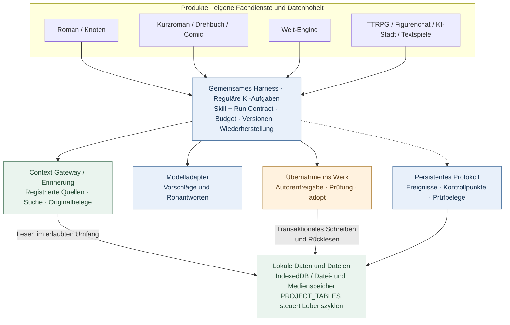
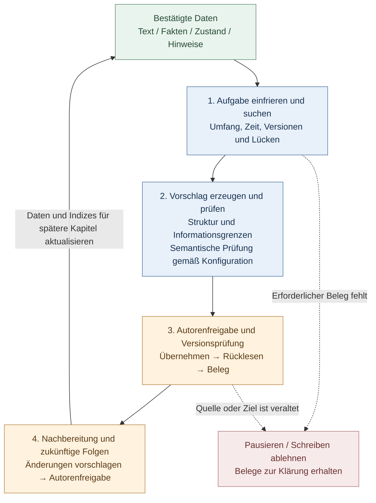

# StoryForge · 故事熔炉

**Schreibe Geschichten. Tauche in sie ein.**

<!-- readme-languages:start -->
[简体中文](./README.md) · [English](./README.en.md) · [Français](./README.fr.md) · [Deutsch](./README.de.md) · [Italiano](./README.it.md) · [Español](./README.es.md) · [Português](./README.pt.md) · [日本語](./README.ja.md) · [한국어](./README.ko.md)
<!-- readme-languages:end -->

[Mit dem Schreiben beginnen](#quick-start) · [Fog Harbor ausprobieren](#try-a-story) · [Architektur ansehen](#architecture)

StoryForge ist ein quelloffenes, lokal orientiertes Werkzeug für KI-gestütztes Erzählen und interaktive Geschichten. Schreibe Romane und kürzere Erzählungen, adaptiere einen Roman als Drehbuch oder Comic, entwickle wiederverwendbare Welten und erprobe interaktive Erlebnisse. Du wählst den Arbeitsablauf und bestätigst KI-Vorschläge, bevor sie Teil deines Werks werden.

> Stand von `main`, geprüft am 9. September 2026: Roman, Kurzroman, Drehbuch, Comic und Welt-Engine haben reguläre Produkteinstiege. Knotenmodus und interaktive Produkte sind Vorschauen. Dieses README ist übersetzt; das bedeutet keine vollständige deutsche Übersetzung der Oberfläche oder verlinkter Dokumente. Screenshots und viele Anleitungen sind chinesisch.

<a id="try-a-story"></a>

## Eine eigene Geschichte erleben

### Fog Harbor: The Last Light — Community-Vorschau eines Rollenspiels

Untersuche mit zwei KI-Begleitern ein altes Schiffsunglück, bewahre die Geheimnisse deiner Figur und entscheide über die Heimkehr der Schiffe in dieser Nacht. Eine KI-Spielleitung (KP) führt durch **7 Szenen, 6 Hinweise und 3 Enden**, mit eigenen **2W6-Regeln**.


Spielpaket und enthaltene Medien liegen im Repository. Richte deine eigene Modell-API ein, um zu beginnen. Der Screenshot zeigt den tatsächlichen Abenteuereinstieg.

**Spielablauf:** Handlung vorschlagen → Regeln auswerten → Antwort der Spielleitung lesen → Hinweise prüfen → speichern und fortsetzen.

<details>
<summary>Start und aktueller Umfang</summary>

Starte den aktuellen `main`-Stand, öffne **TTRPG** (`跑团`) und wähle das Abenteuer unter dem Produktionsbereich. Alternativ öffnest du `/storyforge/play`. Konfiguriere das Modell und wähle eine Figur. Du kannst allein mit KI-Begleitern oder durch Weiterreichen desselben Geräts spielen. Fortschritt, Wiederaufnahme und Kontrollpunkte werden lokal gespeichert. Öffentlicher Online-Mehrspielermodus ist nicht bereitgestellt; Geheimnisse auf einem gemeinsam genutzten Gerät sind gegenüber dessen Besitzer nicht geschützt.

[Spielanleitung](./examples/ttrpg/README.md) · [Produktions- und Spielnachweise](./examples/ttrpg/fog-harbor/production-status.md)

</details>

## Warum StoryForge?

- **Erinnerung mit Bezug zum Manuskript.** Originaltext, Fakten, Zusammenfassungen und Suche erschließen frühe Hinweise; bestätigte Kapiteländerungen stehen späteren Aufgaben zur Verfügung.
- **Eigene Abläufe für jedes Produkt.** Kurzromane prüfen Umfang und Fertigstellung, Drehbücher bewahren Adaptionsentscheidungen, Comics trennen Panels, Bilder und Lettering.
- **Die Entscheidung bleibt beim Autor.** Reguläre Schreibaufgaben liefern zunächst Vorschläge. Harness ergänzt Versionsschutz, Ausführungsnachweise und die Wiederherstellung gespeicherter Zustände.

[Schnellstart](#quick-start) · [Produktauswahl](#products) · [Erste Schreibsitzung](#first-session) · [Welten](#worlds) · [Harness](#architecture) · [Datenschutz](#privacy) · [Community](#community)

<a id="quick-start"></a>

## Schnellstart

Öffne die [Web-App](https://yuanbw.vercel.app/storyforge/) oder starte den Quellcode lokal. Für das grundlegende lokale Schreiben ist kein StoryForge-Konto nötig. KI-Aufgaben verwenden deine Anbieter-Zugangsdaten; API-Kosten fallen separat an. Die Website kann hinter `main` zurückliegen, ältere Releases sind feste Versionsstände.

Verwende **Node.js 24** und npm wie in der CI:

```bash
git clone https://github.com/yuanbw2025/storyforge.git
cd storyforge
npm ci
npm run dev
```

Öffne die von Vite angezeigte Adresse mit dem Pfad `/storyforge/` und lass das Terminal laufen. Ein Quellcode-ZIP erfordert nach dem Entpacken dieselben Schritte und ist kein Desktop-Installationspaket.

Öffne auf der Startseite oben rechts die Modelleinstellungen (`模型与本地设置`). Wähle einen Anbieter, trage API Key, Base URL und ein verfügbares Modell ein und teste Verbindung sowie eine kleine Generierung. Eine erfolgreiche Verbindung belegt weder Qualität noch Guthaben oder Kontextkapazität. Bei CORS-Fehlern folge der lokalen Proxy-Anleitung im Einstellungsbereich.

<a id="products"></a>

## Wähle deinen Einstieg


| Ziel | Einstieg | Ergebnis und Reifegrad |
|---|---|---|
| Einen Roman schreiben | Neu → Roman | Figuren, Gliederung, Kapitel, Kontinuität und Überarbeitung; aktueller technischer Ablauf abgenommen |
| Kürzere Erzählung abschließen | Neu → Kurzroman | Entwurf, Kapitelkarten, Text, Prüfung, eingefrorene Ausgabe; Markdown/TXT/JSON |
| Roman als Drehbuch adaptieren | Neu → Roman zu Drehbuch | Eingefrorene Quellen, Entscheidungen, strukturierte Szenen, Prüfung; Fountain/FDX/Druck |
| Roman als Comic adaptieren | Neu → Roman zu Comic | Seiten, Panels, visuelle Referenzen, Lettering, Ausgaben; PNG/WebP/CBZ/PDF |
| Eine Welt entwickeln | Neu → Welt-Engine | Semantische Inhalte, ausdrückliche Ableitung, eingefrorene Versionen und Lesezugriff |
| Visuellen Ablauf zusammenstellen | Knotenmodus | Vorschau; gemeinsame Romanlogik und Werkdaten |
| Spielen oder Erlebnisse erstellen | TTRPG / Figurenchat / KI-Stadt / Textspiele | Vorschauen mit eigenen Produktions- und Laufzeitzyklen |

Ein Roman benötigt keine Welt-Engine. Autoren können bestätigte Romane und Kurzromane ausdrücklich in einen Weltentwurf ableiten. Drehbücher und Comics sind eigenständige Adaptionen ohne diesen Exportweg. Ein veröffentlichtes Abenteuer lässt sich ohne vorherigen Weltenbau spielen.

<a id="first-session"></a>

## Deine erste Schreibsitzung

1. Wähle **Neu** (`新建`) → **Roman** (`长篇小说`) und gib Titel und Beschreibung ein.
2. Halte Absicht, Referenzen und Schreibregeln fest und ergänze die benötigten Einstellungen.
3. Plane Konflikt und Figuren, danach Bände und Kapitel. Schreibe selbst oder bearbeite und bestätige KI-Vorschläge.
4. Entwickle Szenen und Kapiteltext. Prüfe anschließend Änderungen an Fakten, Zuständen, Beziehungen und Hinweisen.
5. Exportiere unter **Datenverwaltung** (`数据管理`) den Text und eine vollständige JSON-Sicherung.


## Was die einzelnen Produkte für dein Werk leisten

### Roman und Knotenmodus

Der Romanbereich umfasst Referenzen, Welteinstellungen, Figuren und Beziehungen, Handlungsstränge, Gliederungen, Kapitel, Vorausdeutungen, Fakten, Inventare, Stil, Prompt-Vorlagen und Versionsverlauf.

Die Erinnerung behält den **Originaltext als Beleg** und ergänzt strukturierte Fakten und Zustände, Kapitel-/Band-/Gesamtzusammenfassungen und Suchindizes. Context Gateway findet zuerst Ressourcen und liest dann benötigte Details; tatsächlich verwendete Quellen werden protokolliert. Abgeleitete Indizes und Zusammenfassungen werden anhand von Quell-Hashes geprüft. Fehlen sie oder sind sie veraltet, steht der Originaltext als Rückfallquelle bereit. Werk- und Zeitgrenzen filtern die Suche.

Die Nachbereitung eines Kapitels schlägt Änderungen an Fakten, Figuren, Beziehungen, Gegenständen, Zeitachse, Hinweisen und Handlungssträngen zur Bestätigung vor. Die Wirkungsanalyse betrifft zukünftige Pläne und schreibt bestätigte Vergangenheit nicht stillschweigend um. Versionsprüfungen verhindern, dass alte Vorschläge neuere Bearbeitungen überschreiben.

Offizielle Knotenaktionen verwenden dieselben Skills, Daten und Übernahmeprozesse. Zwischenergebnisse lassen sich feiner zusammensetzen; experimentelle Entwürfe dürfen nicht in den verbindlichen Werkbestand übernommen werden. Die vollständige Zusammenarbeit beider Oberflächen wird noch validiert.

[Narrative Suche](./src/lib/context-gateway/narrative-retrieval.ts) · [Kapitelnachbereitung](./src/lib/ai/chapter-memory/run-chapter-memory.ts) · [Roman-/Knotenvertrag](./docs/products/LONGFORM-AND-NODE.md)

### Kurzroman: ein sichtbarer Weg zur Fertigstellung

Der eigene Ablauf zielt auf **5.000–25.000 chinesische Schriftzeichen in 3–8 Kapiteln**: Briefing, Entwurf, Kapitelkarten, Schreiben, Prüfung, Überarbeitung und Veröffentlichung. Prüfungen berücksichtigen tatsächliche Textlänge, Kapitelstruktur, fehlenden Text und offene Vorschläge. Befunde verweisen auf Kapitel und Belegstellen. Die Prüfung ist an den Manuskript-Hash gebunden und muss nach Änderungen aktualisiert werden. Überarbeitungen betreffen gezielte Kapitel; blockierende Befunde verhindern die Veröffentlichung. Jede akzeptierte Ausgabe wird unveränderlich gespeichert, frühere Ausgaben bleiben erhalten.

[Produktion und Abschlusskriterien](./src/lib/short-novel/service.ts) · [Eigene persistente KI-Abläufe](./src/lib/agent/run/short-novel-durable.ts)

### Drehbuch: nachvollziehbare Adaption und strukturierte Szenen

Ausgewählte Romanquellen werden eingefroren und mit Fakten, Kausalität, Adaptionsentscheidungen, Handlungsschritten, Szenenkarten und Szenen verbunden. Autoren können nachvollziehen, warum Ereignisse gestrichen, zusammengeführt oder umgeformt wurden. Ein **AST** bildet Drehbuchblöcke strukturiert ab; Code prüft das Format und rendert Fountain, FDX oder Druckausgaben.

Quellentreue und dramaturgische Wirkung werden getrennt geprüft. Änderungen nennen Szene und erwartete Revision; gesperrte Szenen müssen zuerst entsperrt werden, veraltete Änderungsvorschläge werden blockiert. Veröffentlichungen frieren Quellen, Entscheidungen und Szenen ein. Spätere Romanänderungen verändern ein veröffentlichtes Drehbuch nicht automatisch.

[Produktion und Revisionen](./src/lib/screenplay/production.ts) · [Veröffentlichungen](./src/lib/screenplay/release.ts) · [Renderer](./src/lib/screenplay/renderers.ts)

### Comic: Erzählung, Bilder und Lettering als eigene Ebenen

Zuerst entstehen Handlungsschritte, Seitenplan und Panels, anschließend Bilder und Lettering. Stabile Seiten-/Panel-IDs und eine ausdrückliche Lesereihenfolge verbinden Bildausschnitt, Handlung, Dialog und Quellenbelege. Visuelle Subjekte geben Figuren, Orten und Requisiten feste Identitäten. Bildvorschläge protokollieren Herkunft und Nachweise tatsächlich übertragener Referenzbilder.

**Lokales SVG-Lettering** legt bearbeitbare Sprechblasen, Texte und Geräusche über die Bilder. Eine Dialogkorrektur erfordert keine neue Bildgenerierung. Prüfungen markieren Überlauf, Überlappungen und unsichere Ränder; Autoren prüfen weiterhin verdeckte Bildinhalte. Storyboard- und Bildausgaben haben getrennte Abschlusskriterien. Veröffentlichte Bildausgaben behalten starke Blob-Referenzen auf ausgewählte Bilddaten.

**Aktuelle Grenze:** Der generische OpenAI-kompatible Bildadapter sendet ausschließlich Text und unterstützt laut Fähigkeitsdeklaration weder Referenzbilder noch feste Seeds oder Inpainting. Eine Referenz im Prompt zu erwähnen gilt nicht als Bildübertragung. Visuelle Produktion benötigt einen eingerichteten Bilddienst oder geeignete eigene Medien sowie menschliche Auswahl und Kontinuitätsprüfung.

[Produktion](./src/lib/comic/production.ts) · [Mediennachweise](./src/lib/comic/media-service.ts) · [Lettering](./src/lib/comic/renderers.ts) · [Qualitätsprüfungen](./src/lib/comic/qa.ts)

Die aktuellen technischen Abläufe sind auf `main` umgesetzt. Anbieterleistung und Inhaltsqualität werden weiterhin bewertet: [Fähigkeitsstand und Grenzen](./docs/roadmap/CAPABILITY-BASELINE.md).

<a id="worlds"></a>

## Welten und interaktive Produkte

Erstelle oder leite ausdrücklich eine Welt ab, friere eine Version ein und konfiguriere und starte die Produktion im gewählten Produkt. Die Welt-Engine speichert **versionierte semantische Inhalte**. Medien, Spielstände und private Weiterentwicklung gehören dem jeweiligen Produkt. Weder spätere Romanänderungen noch Spielereignisse schreiben die gemeinsame Welt automatisch um.

Eine Ableitung erfasst Quellwerk, Revision, Ausschnitt und Hash. Produktspezifische Adapter deklarieren erforderliche, optionale und verbotene Ressourcen und frieren einen **SourcePlan** ein. Schrittweises `describe / search / read` hält pro Lauf ein Context Manifest und abschließend ein SourceManifest tatsächlicher Zugriffe fest. Ein Abenteuer kann Version 1 weiterverwenden, während der Autor Version 2 bearbeitet.

[Weltressourcen-Client](./src/lib/context-gateway/world-release-client.ts) · [Weltvertrag](./docs/products/WORLD-ENGINE.md)

**Alle folgenden Produkte sind Vorschauen:**

| Produkt | Umgesetzter Mechanismus | Aktuelle Grenze |
|---|---|---|
| [TTRPG / KI-Spielleitung](./src/lib/ttrpg/information-boundary.ts) | Code prüft Regeln, Würfel und Folgen; getrennte Spielleitungs-/Spieler-/NSC-Kontexte, empfängerbezogene Geheimnisse, Ereignisse und Kontrollpunkte | Fog Harbor mit realen Modellläufen belegt; kein öffentlicher Online-Mehrspielermodus |
| [Figurenchat](./src/lib/character-interaction/runtime.ts) | Eingefrorene Profile, Sprachregeln, Szenenziele, Verpflichtungen/Geheimnisse/Konflikte als Erinnerung sowie Vertrauen/Nähe/Vorsicht/Respekt | Langfristige Figurenqualität in Bewertung |
| [Afterstory KI-Stadt](./src/lib/ai-town/runtime.ts) | Sechs Tagesabschnitte, Orte und Wege, Wissen, Erinnerung, Beziehungen, leichte Verwaltung und Nachholen von Offline-Zeit | 14-Tage-Wiederholung validiert; langfristige Modell- und echte Medienqualität noch in Bewertung |
| [Textabenteuer](./src/lib/adventure/runtime.ts) | Voraussetzungen, Inventar, Ressourcen, Fähigkeiten, Aufgaben und Folgen durch Code geprüft | Jede vollständige Geschichte braucht eigene Validierung |
| [AVG](./src/lib/avg/runtime.ts) | Deklarative Signale, Hintergrund-/Figuren-/Audioebenen, Medienprüfung und Bühnenschnappschüsse | Vollständige audiovisuelle Auslieferung in Validierung |
| [Textuelle offene Welt](./src/lib/open-world/runtime.ts) | Regionen, Reisen, Ressourcen, Fraktionen, Zeitpläne und zeitabhängige regionale Veränderungen | Vollständige Produktion und Langzeitspiel in Entwicklung |

Online-Community und kommerzielle Dienste sind für spätere Phasen vorgesehen.

<a id="architecture"></a>

## Gemeinsame Architektur und langfristige Konsistenz

**Harness ist das Ausführungs- und Prüfsystem um Modellaufrufe herum.** Es verknüpft Aufgabenverträge, tatsächliche Eingaben, Vorschläge, Versionen, Kontrollpunkte und Ergebnisse mit dem Werk. Jedes Produkt behält seine eigenen Fachdienste und Daten.



Die Pfeile zeigen Abhängigkeiten oder Datenzugriffe, keine Ausführungsreihenfolge. Romane und Kurzromane benötigen keine Welt-Engine. Interaktive Laufzeiten verwenden eigene Befehle und Zustandsmaschinen.

### Wie Konsistenz von Kapitel zu Kapitel erhalten bleibt

Der fortlaufende Zyklus lautet: **Belege finden, Änderungen bestätigen und der nächsten Aufgabe die richtige Version bereitstellen.** Generierung, Gedächtnisnachbereitung, Prüfung und Zukunftsplanung tragen dazu bei.



Jeder reguläre Lauf speichert Ereignisprotokoll und Kontrollpunkte. Kapitelnachbereitung und zukünftige Revisionen sind getrennte, begrenzte Läufe mit eigenen Versionsprüfungen und Freigaben. Der Zyklus kann mehrere Schreibsitzungen umfassen.

- Fehlende Pflichtquellen stoppen den Fortschritt. Manifeste erfassen Umfang, Hashes, Zugriffe und Lücken. Werk-, Welt- und Zeitgrenzen verhindern Vermischungen und verfrühtes Wissen.
- Vor der Übernahme werden Eingabe- und Zielrevisionen erneut geprüft. Veraltete Vorschläge dürfen neuere Texte nicht überschreiben. Rücklesen und Prüfbeleg kontrollieren das gespeicherte Ergebnis.
- Explizite Konsistenzprüfungen sind an den Text-Hash gebunden. Textänderungen machen alte Prüfnachweise ungültig.
- Wiederherstellung nutzt gespeicherte Zustände mit Versionsprüfung. Ein unbekanntes Ergebnis beim Anbieter führt nicht zu blindem erneutem Senden.

Beispiel: Kapitel 8 hält fest, wer ein einzigartiges Objekt besitzt. Für Kapitel 80 kann die Suche die Originalstelle und den bestätigten Zustand liefern. Ändert der Autor den Besitzer vor der Freigabe eines Vorschlags, blockiert die Revisionsprüfung dessen direkte Übernahme. Bestätigte neue Kapitel und Gedächtnisänderungen stehen späteren Kapiteln zur Verfügung.

### Nachprüfbare Belege

- [Suche bei großen Textmengen und Isolation von Welten und Zukunftswissen](./tests/regression/R-PHASE4-long-form-scale-gate.test.ts)
- [Blockierung ohne Pflichtbeleg und exakte Bearbeitungsziele](./tests/regression/R-CTXG7-gateway-execution.test.ts)
- [Ablehnung veralteter Vorschläge nach Text- oder Einstellungsänderung](./tests/regression/R-HARNESS7-prose-generation-durable.test.ts)
- [Wiederherstellung der Kapitelnachbereitung ohne neuen Modellaufruf](./tests/regression/R-HARNESS20-chapter-post-adoption-durable.test.ts)
- [Ungültige Audits nach Textänderung und kein Wiederholen unbekannter Ergebnisse](./tests/regression/R-MEMORY-CLOSE1-consistency-audit-durable.test.ts)
- [Erhalt geschriebener Geschichte und Ungültigmachen zukünftiger Pläne](./tests/regression/R-FUTURE1-continuous-evolution.test.ts)

[Reguläre Prosaläufe](./src/lib/agent/run/prose-generation-durable.ts) · [Prüfbelege](./src/lib/agent/run/verification-receipt.ts) · [Architektur](./docs/ARCHITECTURE.md) · [Harness-Standard](./docs/HARNESS-QUALITY-STANDARD.md)

**Umfang der Absicherung:** Code prüft Versionen, Geltungsbereiche, Struktur, Zustandsübergänge und Schreibregeln. Semantische Prüfungen hängen von Konfiguration oder ausdrücklicher Autorenaktion ab. Subtext, Metaphern, nicht erfasste Hinweise und literarische Qualität benötigen weiterhin Modell- und menschliches Urteil. Tests mit **100.000 / 300.000 / 1.000.000 Zeichen** belegen technisches Verhalten, keine garantierte literarische Konsistenz eines Romans mit einer Million Wörtern. Wiederherstellung umfasst persistierte Zustände; Hilfs- und Experimentalzugänge behalten ihre deklarierten Grenzen.

<a id="privacy"></a>

## Modelle, Speicherung und Datenschutz

- Nutze einen eigenen Cloud-Anbieter oder einen kompatiblen lokalen Dienst wie Ollama oder LM Studio. Anbietervoreinstellungen sind keine Qualitätszertifizierung für jedes Modell und Produkt.
- Cloud-Generierung sendet den ausgewählten Aufgabenkontext an den konfigurierten Anbieter. Lokale Speicherung macht nicht jeden KI-Aufruf offline.
- Werke und Spielstände liegen in IndexedDB des jeweiligen Browserprofils und Ursprungs. Ein anderer Browser, Hostname oder Port übernimmt diese Daten nicht automatisch.
- API-Schlüssel gelten standardmäßig für die Browsersitzung. Nur die ausdrückliche Speicheroption legt sie in localStorage ab.
- Exportiere vor Gerätewechsel oder Löschen der Browserdaten eine **vollständige JSON-Sicherung**. Markdown/TXT ersetzen sie nicht; für Medien nutze die Produkt-/Arbeitsbereichsexporte.
- Lokaler Ordnerzugriff erfordert Benutzerfreigabe: [Anleitung zum Speicherarbeitsbereich](./docs/MEMORY-WORKSPACE-GUIDE.md).
- Die optionale GitHub-Gist-Sicherung lädt das gesamte Projekt-JSON in dein privates Gist. Sie ist nicht Ende-zu-Ende-verschlüsselt.

<a id="community"></a>

## Community und Mitarbeit

[GitHub Issues](https://github.com/yuanbw2025/storyforge/issues) · [Projektseite des Entwicklers](https://yuanbw.vercel.app/) · QQ-Gruppe: **1082374587**

[Bilibili-Anleitung](https://www.bilibili.com/video/BV1q37j6QExh/) und [Zhihu-Einführung](https://zhuanlan.zhihu.com/p/2038714210188780594) sind ältere chinesische Ressourcen; Menüs können abweichen. Fehlerberichte sollten Version, Browser/Betriebssystem, Schritte sowie erwartetes und tatsächliches Ergebnis enthalten. Entferne Schlüssel und private Texte aus Bildern und Protokollen. Sterne, Beispiele, Videos, Übersetzungen und Beiträge sind willkommen.

StoryForge nutzt **React, TypeScript, Vite, Zustand, TipTap und Dexie**. Drei Register steuern die gemeinsame Basis: `CONTEXT_SOURCES` + `assembleContext()` für KI-Lesezugriffe, `FIELD_REGISTRY` + `AdoptionSchema` + `adopt()` für genehmigte Schreibzugriffe und `PROJECT_TABLES` für Tabellenlebenszyklen.

```bash
npm run ci
npm run ci:e2e
```

Lies vor Beiträgen [AGENTS.md](./AGENTS.md), [CONTRIBUTING.md](./CONTRIBUTING.md), den [Zusammenarbeitsprozess](./docs/COLLAB-WORKFLOW.md) und die [Projektcharta](./docs/PROJECT-MASTER-CHARTER.md).

## Sterne, Unterstützung und Lizenz

[](https://www.star-history.com/?repos=yuanbw2025%2Fstoryforge&type=date&legend=top-left)

Finanzielle Unterstützung ist freiwillig und verändert weder Funktionszugang noch zukünftige Updates. Sie trägt zu Modellabonnements und Wartung bei. [Details zur Unterstützung](./README.md#自愿赞助).

Der Code steht unter [MIT](./LICENSE). Originalwerke, Modelle, fremde Medien und Ausgaben behalten ihre jeweiligen Bedingungen. Beachte gegebenenfalls den [TTRPG-SRD-Lizenzhinweis](./docs/ttrpg/licenses/SRD-5.2.1-CC-BY-4.0.md).
