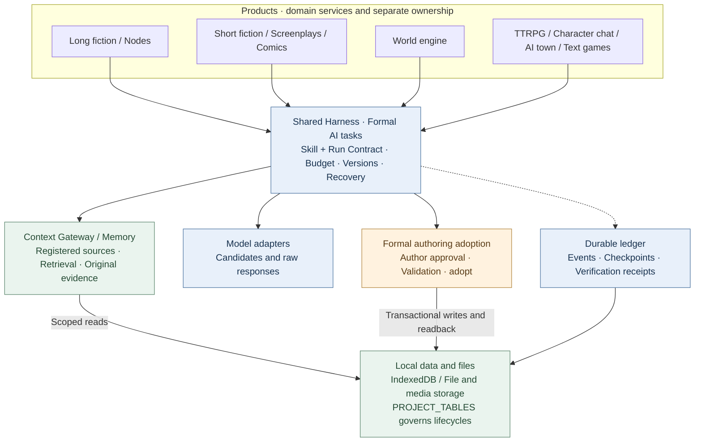
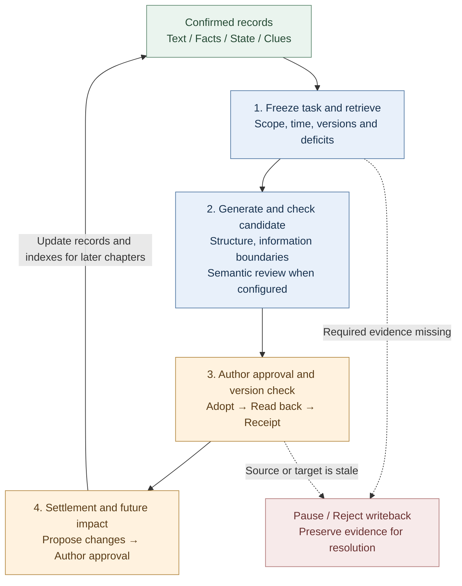

# StoryForge · 故事熔炉

**Turn ideas into finished works. Give stories a life beyond the page.**

[简体中文](./README.md) · [Open the web app](https://yuanbw.vercel.app/storyforge/) · [Source download](https://github.com/yuanbw2025/storyforge/archive/refs/heads/main.zip) · [Issues](https://github.com/yuanbw2025/storyforge/issues)

StoryForge is an open-source, local-first AI narrative creation and experience toolkit. Write long or short fiction, adapt a novel into a screenplay or comic, build reusable worlds, and explore character interaction and playable stories. You choose the workflow and approve AI candidates before they become part of your work.


> This introduction describes `main`, checked on September 9, 2026. Long-form writing, short fiction, screenplay adaptation, comic adaptation, and the world engine have released product entries. Nodes and interactive products are previews. Historical GitHub Releases do not include subsequent changes; the hosted site may lag behind `main`. Use current source for the features shown here. Screenshots are from an isolated local workspace, not an author's private manuscript.

## Choose your starting point

| Goal | Entry | Result and maturity |
|---|---|---|
| Write a novel | New → Long novel | Settings, characters, outlines, chapters, continuity and revision; current engineering workflow accepted |
| Finish short fiction | New → Short novel | Story design, chapter cards, drafting, review, frozen release, Markdown/TXT/JSON export |
| Adapt a novel into a screenplay | New → Novel to screenplay | Frozen source, adaptation decisions, beats, scene writing, review, Fountain/FDX/print export |
| Adapt a novel into a comic | New → Novel to comic | Pages, panels, visual references, lettering, storyboard/visual releases and PNG/WebP/CBZ/PDF export; visual output depends on supported image services or suitable author assets |
| Build a world | New → World engine | Semantic content, explicit derivation, frozen world versions and read access |
| Compose a visual workflow | Node authoring | Preview; shares the long-form backend and work data |
| Play an original adventure | TTRPG → Published adventures | Community preview of *Fog Harbor: The Last Light* |
| Create interactive experiences | Character chat / Afterstory town / Text games | Preview; each product has its own production and runtime lifecycle |

Novel writing does **not** require the world engine. Long and short fiction may optionally be derived into a world by their author. Screenplays and comics are independent adaptations. A published adventure can be played without creating a world first.

## What the architecture does for your work

Long fiction needs evidence from earlier chapters. Adaptation needs traceable decisions. Comics need readable pages as well as images. Each StoryForge product has a dedicated production model, backed by shared context retrieval, candidate approval, version checks and recoverable execution.

| Product | Concrete engineering | Practical benefit |
|---|---|---|
| Long fiction | Original text, structured facts, layered summaries, retrieval and future-impact review | Revisit early clues and track what a new chapter changes |
| Nodes — preview | Official actions reuse long-form Skills, work data and adoption | Compose smaller steps while retaining the existing manuscript |
| Short fiction | Dedicated length/chapter constraints, evidence-based review and completion gates | See what remains to draft, revise and finalize |
| Screenplays | Frozen sources → facts/causality → adaptation decisions → beats/scenes → structured script | Trace creative changes and review fidelity separately from dramatic effect |
| Comics | Script/page/panel pipeline, visual subjects, explicit reading order and separate lettering | Revise a panel or its dialogue and inspect page readability |
| Worlds | Versioned semantic snapshots and product-specific source plans | Reuse a known version across multiple works |
| Interactive previews | Dedicated rules, character knowledge, event histories and runtime state | Preserve consequences and independent playthroughs |

See the [architecture and long-term consistency loop](#shared-execution-and-data-architecture) for diagrams, implementation links and regression evidence.

## Quick start

Open the [web app](https://yuanbw.vercel.app/storyforge/) or run the source locally. Core local creation does not require a StoryForge account. AI generation uses your own provider credentials; cloud API charges are separate.

Use **Node.js 24** and npm, matching CI:

```bash
git clone https://github.com/yuanbw2025/storyforge.git
cd storyforge
npm ci
npm run dev
```

Open the address printed by Vite, with the `/storyforge/` path. Keep the terminal running while using the app. A downloaded source ZIP needs the same commands after extraction; it is not a desktop installer.

On the home page, open the top-right model/settings button (`模型与本地设置`). Choose a provider, enter your API Key, Base URL and an accessible model, then test the connection. Test a small generation before a large task. A successful connection does not establish task quality, account balance or context capacity. For browser CORS errors, follow the settings panel's local proxy instructions.

## Your first writing session

1. Click **New** (`新建`) → **Long novel** (`长篇小说`), enter a title and description. A local folder can be configured later.
2. Use project information, references and writing rules to record your intent. Fill only the settings needed for your story.
3. Plan the conflict and characters, then create volumes and chapters in the outline. Write manually or edit and approve AI candidates.
4. Open chapters, develop scene outlines and draft the text. Review before adopting results.
5. Check changes to facts, character states, relationships and foreshadowing before continuing.
6. Open **Data management** (`数据管理`) to export Markdown/TXT and a full JSON backup.


## Long fiction and nodes

The long-form workspace includes references, world settings, character profiles and relationships, storylines, outlines, chapter editing, foreshadowing, facts, inventories, style learning, prompt templates, usage records and version history.

**Memory has a traceable path back to the manuscript.** Original text provides evidence; facts, relationships, events and storylines hold structured state; chapter/volume/global summaries aid navigation; retrieval finds relevant passages. Context Gateway discovers resources before reading details and records actual sources. Derived indexes and summaries are checked against source hashes, with original-text fallback when indexes are missing or stale. Work scope and chapter boundaries filter retrieval.

For example, a recurring object late in the novel can lead back to its earlier appearance so the author can check its owner or associated promise. The source record makes the retrieved context inspectable; it does not guarantee perfect recall or literary consistency.

**New chapters have a follow-up workflow.** Chapter settlement proposes changes to facts, character states, relationships, inventory, timelines, foreshadowing and storylines for author confirmation. Impact analysis identifies future plans needing revision while preserving confirmed history. If you reveal a secret earlier than planned, you can inspect affected future outlines and decide what to change. Version checks block stale candidates from overwriting newer edits.

**Node mode exposes smaller building blocks.** Official node actions bind to the same long-form domain Skills and candidate/adoption chain. Authors can arrange intermediate artifacts and generation steps; improvements to a shared action serve both interfaces. Experimental node drafts cannot be adopted into canonical work. Complete cross-mode UI and lifecycle interoperability remains under validation.

Implementation: [narrative retrieval](./src/lib/context-gateway/narrative-retrieval.ts), [chapter settlement](./src/lib/ai/chapter-memory/run-chapter-memory.ts), [long-form and node contract](./docs/products/LONGFORM-AND-NODE.md).

Engineering tests cover 100,000 / 300,000 / 1,000,000-character workloads. These demonstrate storage and retrieval support, not a guarantee of literary quality or consistent million-word manuscripts. Model performance and author review still matter.

## Short fiction, screenplays and comics

### Short fiction: a visible route to completion

The dedicated workflow targets **5,000–25,000 Chinese characters across 3–8 chapters**: confirm the brief and story design, plan chapter cards, draft and approve chapters, review, rewrite and release.

- Completion checks inspect actual manuscript length, chapter structure, missing text and pending candidates, making unfinished work visible.
- Review issues point to chapters and supporting text. Reviews bind to the manuscript hash; edits require a current review before publication. Rewrites target specific chapters.
- Blocking issues prevent release. An accepted manuscript becomes a new frozen edition, preserving earlier releases while revision continues. Export Markdown, TXT or JSON.

Implementation: [production and completion gates](./src/lib/short-novel/service.ts), [dedicated durable AI runs](./src/lib/agent/run/short-novel-durable.ts).

### Screenplays: traceable adaptation, structured scenes

The pipeline freezes selected novel sources, then connects facts and causal relationships to adaptation decisions, beats, scene cards and script scenes.

- Source and decision mappings let authors inspect why an event was removed, merged or transformed into a scene.
- Scenes use an AST, a structured representation of script blocks. Code validates format and renders the same structure to Fountain, FDX or print.
- Source fidelity and dramatic structure have separate reviews. Revision patches name the scene, issues and expected revision; locked scenes must be unlocked first, and stale patches are blocked.
- Releases freeze sources, decisions and scenes. Later novel edits do not silently change a published screenplay.

When turning internal monologue into a confrontation, the author can inspect both the retained source information and the resulting dramatic scene. Implementation: [production and targeted revisions](./src/lib/screenplay/production.ts), [release snapshots](./src/lib/screenplay/release.ts), [renderers](./src/lib/screenplay/renderers.ts).

### Comics: script, visual assets and lettering as separate layers

Comic production first develops script beats, page plans and panels, then images and lettering. Authors can assess the visual narrative before spending on image generation.

- Stable page/panel identities and explicit reading order connect layout, shots, actions, dialogue and source evidence. Issues can target one page or panel.
- Visual subjects give characters, places and props stable identities and selected references. Image candidates record provenance and actual reference-transmission evidence for inspection and selection.
- Local SVG rendering adds editable bubbles, captions and sound effects above the images. Correcting dialogue does not require regenerating the panel. Checks flag lettering capacity, overlaps and unsafe boundaries; authors still inspect image occlusion.
- Storyboard and visual releases have distinct completion gates. Visual editions verify selected image bytes and retain strong Blob references so replacing working images does not alone remove old release media. Supported exports include PNG, WebP, CBZ and PDF.

**Current image adapter limit:** the built-in generic OpenAI-compatible adapter sends text only and declares no reference-image, fixed-seed or inpainting capability. The app reports these limits; naming a reference in a prompt is not recorded as transmitting an image. Visual production needs a configured image service or suitable author assets, with human selection and continuity review.

Implementation: [production](./src/lib/comic/production.ts), [media evidence](./src/lib/comic/media-service.ts), [lettering](./src/lib/comic/renderers.ts), [quality gates](./src/lib/comic/qa.ts).

All three have their current engineering workflows implemented on `main`. Provider performance and content quality continue to be evaluated. See the [capability baseline](./docs/roadmap/CAPABILITY-BASELINE.md) for evidence and limits.

## Try an original story

### Fog Harbor: The Last Light — community TTRPG preview

Investigate an old shipwreck with two AI companions, protect your character's secrets and decide how tonight's ships will return. An AI KP hosts the adventure using original 2d6 rules, with seven scenes, six clues and three endings.


Run current `main`, open **TTRPG** (`跑团`) and choose the adventure below the production section. The standalone route `/storyforge/play` also works. The game bundle, cover and included media ship with the repository. Configure your model API, choose a character and start.

Play solo with AI companions or use same-device handoff. Progress is local, with resume and checkpoints. Public online multiplayer is not deployed, and same-device secrets are not protected from the device owner. Read the [player guide](./examples/ttrpg/README.md) and [production/playthrough evidence](./examples/ttrpg/fog-harbor/production-status.md).

## Worlds and interactive products

Create a world directly or explicitly derive one from confirmed long/short fiction. Freeze a version, then configure and start production inside the selected product. Published experiences own their media, save data and private evolution. Later edits to a novel do not automatically synchronize with a derived world, and gameplay does not automatically rewrite the shared world.

**The world engine preserves identity, provenance and immutable versions.** Derivation records the source work, revision, selected range and content hash. Only semantic content is sealed into the world; products own their images and runtime data. Product-specific adapters declare required, optional and forbidden resources and freeze a SourcePlan before production. Progressive `describe / search / read` access records per-run context and a final SourceManifest of actual reads.

An adventure can continue using world version one while its author edits version two. A new experience can explicitly select the newer version. Developers can consume the versioned semantic interface without traversing internal world tables. See the [world resource client](./src/lib/context-gateway/world-release-client.ts) and [world contract](./docs/products/WORLD-ENGINE.md).

Interactive products use dedicated runtime mechanisms. **All remain previews**; implemented mechanisms and complete experience validation are distinct:

| Product | Implemented mechanisms and their purpose | Current limit |
|---|---|---|
| [TTRPG / AI KP](./src/lib/ttrpg/information-boundary.ts) | Rules, dice/effect resolution, separate KP/player/NPC contexts, recipient-filtered secrets, events and checkpoints give actions inspectable consequences | Fog Harbor has real-model production/playthrough evidence; public online multiplayer is not deployed |
| [Character chat](./src/lib/character-interaction/runtime.ts) | Frozen profiles, voice rules, scene goals, commitments/secrets/conflicts as memory, and trust/closeness/wariness/respect state preserve conversation consequences | Long-term character quality remains under evaluation |
| [Afterstory AI town](./src/lib/ai-town/runtime.ts) | Six daily time slots, place access and travel, resident knowledge and memories, relationships, light management and offline-time catch-up organize life after the original ending | 14-day replay validation exists; longitudinal model and non-fixture media quality remain under evaluation |
| [Text adventure](./src/lib/adventure/runtime.ts) | Action prerequisites, inventory, resources, abilities, quests and code-resolved checks connect progress to available actions | Complete experiences require work-specific validation |
| [AVG](./src/lib/avg/runtime.ts) | Declarative cues bind story beats to layered backgrounds, actors and audio; asset checks and stage snapshots support presentation recovery | Full audiovisual delivery remains under validation |
| [Text open world](./src/lib/open-world/runtime.ts) | Regions, travel, resources, faction influence, actor schedules, task cards/templates and time-based regional changes support persistent exploration state | Full production and long-term play remain in development |

Online community and commercial services are later-stage work.

## Shared execution and data architecture

### Independent products, shared governed AI execution

Each product owns its domain services and artifacts. **Harness is the execution and validation system around model calls**: it records task contracts, actual inputs, candidates, versions, checkpoints and results, connecting that evidence to the work.



Arrows show dependencies or data access, not execution order. Long and short fiction do not require the world engine. Interactive runtimes use product-specific commands and state machines; each product owns its media and saves. The next diagram follows formal long-fiction authoring.

### How Harness maintains long-term consistency

Consistency depends on a continuing cycle: **retrieve evidence, approve changes, and make the correct version available to the next task**. Chapter generation, memory settlement, review and future planning each contribute.



Each formal run also persists its ledger and checkpoints. Settlement and future revisions are separate, bounded runs with their own version checks and approvals; the loop can span multiple writing sessions.

| Consistency risk | Implemented control | Inspectable evidence |
|---|---|---|
| Forgotten early facts or clues | Structured facts, layered summaries and long-tail retrieval lead back to original text; required-source deficits block progress | Context Manifest with sources, hashes, actual reads and missing evidence |
| Wrong work or premature knowledge | Work/world scope and task time boundaries filter sources; information-boundary checks apply | Source scope and boundary evidence |
| Author edits while generation is running | Adoption rechecks relevant context and target revisions; stale candidates cannot overwrite newer work | Input versions, stale status and retained output |
| A saved chapter fails to carry forward | Readback verifies persisted state; settlement connects memory, retrieval and storylines; authors handle future-impact candidates | Adoption events, post-state, linked runs and receipts |
| Review no longer matches the manuscript | Explicit consistency audits bind to the text hash; edits invalidate old audit evidence | Recoverable audit candidates, sources and findings |
| Refresh or interruption breaks the process | Verified checkpoints restore saved candidates with version checks; unknown external outcomes are not blindly retried | Run, attempt, checkpoint and terminal records |

For example, chapter 8 establishes who holds a unique token. When chapter 80 needs it, retrieval supplies the original passage and confirmed ownership state. If the author changes ownership while a candidate is awaiting approval, revision checks block direct adoption of the stale result. After the new chapter is accepted, confirmed settlement updates become available to later chapters. This illustrates the mechanism; detecting every implicit contradiction still depends on review and author judgment.

### Evidence you can inspect

These existing regression tests cover concrete promises and failure cases:

| Claim | Regression evidence |
|---|---|
| Distant, middle and recent evidence at 100k / 300k / 1m characters; future/wrong-world isolation | [Long-form scale gate](./tests/regression/R-PHASE4-long-form-scale-gate.test.ts) |
| Missing required evidence blocks progress; exact edit targets cannot degrade to a prefix | [Gateway execution](./tests/regression/R-CTXG7-gateway-execution.test.ts) |
| Changed prose or upstream settings block stale adoption | [Prose adoption](./tests/regression/R-HARNESS7-prose-generation-durable.test.ts) |
| Saved chapter-settlement candidates recover without another model call | [Settlement recovery](./tests/regression/R-HARNESS20-chapter-post-adoption-durable.test.ts) |
| Text changes invalidate audits; unknown model outcomes do not auto-retry | [Explicit consistency audit](./tests/regression/R-MEMORY-CLOSE1-consistency-audit-durable.test.ts) |
| Written history is preserved and upstream changes invalidate future plans | [Future evolution boundaries](./tests/regression/R-FUTURE1-continuous-evolution.test.ts) |

Implementation: [formal prose runs](./src/lib/agent/run/prose-generation-durable.ts), [verification receipts](./src/lib/agent/run/verification-receipt.ts), [architecture](./docs/ARCHITECTURE.md), [Harness standard](./docs/HARNESS-QUALITY-STANDARD.md).

**Scope of assurance:** deterministic code checks versions, scope, structure, state transitions and writeback rules. Semantic review depends on task configuration or explicit author action. Subtext, metaphors, unregistered clues and literary quality still require model and human judgment. Scale fixtures demonstrate engineering behavior, not verified literary consistency across a million-word novel. Recovery covers persisted state; auxiliary and experimental entries retain their explicitly registered limits.

## Models, storage and privacy

- Bring your own cloud provider or use a compatible local model service such as Ollama or LM Studio. Provider presets are connection options, not certification that every model works equally well for every product.
- Cloud generation sends the task's selected context to your configured provider. Local-first does not mean every AI request is offline.
- Work and saves live in IndexedDB for the current browser profile and origin. Changing browser, hostname or port does not move your data.
- API Keys last for the current browser session by default. Explicitly choosing “remember on this device” stores them in localStorage.
- Export a **full JSON backup** before changing devices or clearing browser data. Markdown/TXT exports do not replace full backups; use the product/workspace export paths for media.
- Local folder access is user-authorized. See the [memory workspace guide](./docs/MEMORY-WORKSPACE-GUIDE.md).
- Optional GitHub Gist backup uploads full project JSON to your private Gist. It is not end-to-end encrypted storage.

## Community and contributing

- [Bilibili video guide](https://www.bilibili.com/video/BV1q37j6QExh/) and [Zhihu introduction](https://zhuanlan.zhihu.com/p/2038714210188780594): historical Chinese tutorials; menus may differ from current versions.
- QQ community: **1082374587**.
- [Developer's project site](https://yuanbw.vercel.app/) and [GitHub Issues](https://github.com/yuanbw2025/storyforge/issues).

For bugs, include the app version, browser/OS, steps, expected behavior and actual result. Remove secrets and private writing from screenshots and logs. Stars, tutorials, examples, translations and contributions are welcome.

StoryForge uses React, TypeScript, Vite, Zustand, TipTap and Dexie. Registered context sources, governed adoption and table lifecycle registries support the shared Agent/Harness infrastructure.

```bash
npm run ci
npm run ci:e2e
```

Read [AGENTS.md](./AGENTS.md), [CONTRIBUTING.md](./CONTRIBUTING.md) and the [collaboration workflow](./docs/COLLAB-WORKFLOW.md) before contributing. Product boundaries are defined in the [project charter](./docs/PROJECT-MASTER-CHARTER.md).

## Star history and support

[](https://www.star-history.com/?repos=yuanbw2025%2Fstoryforge&type=date&legend=top-left)

Sponsorship is voluntary and does not change access to features or future updates. It supports model subscriptions and maintenance. See [sponsorship details](./README.md#自愿赞助).

Code is licensed under [MIT](./LICENSE). Original works, models, third-party media and outputs retain their respective terms. See the [TTRPG SRD license notice](./docs/ttrpg/licenses/SRD-5.2.1-CC-BY-4.0.md) where applicable.
