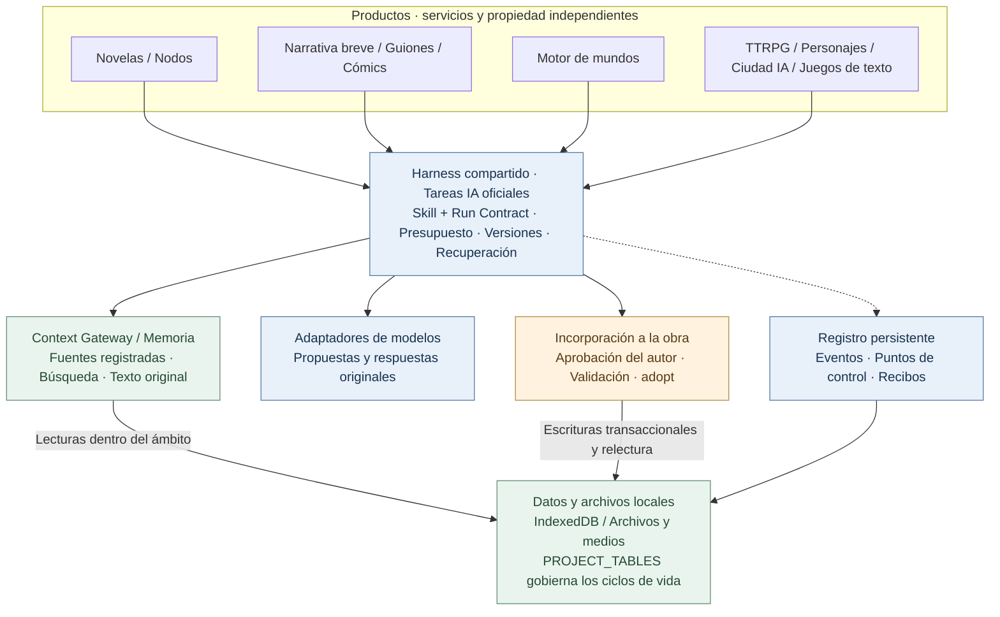
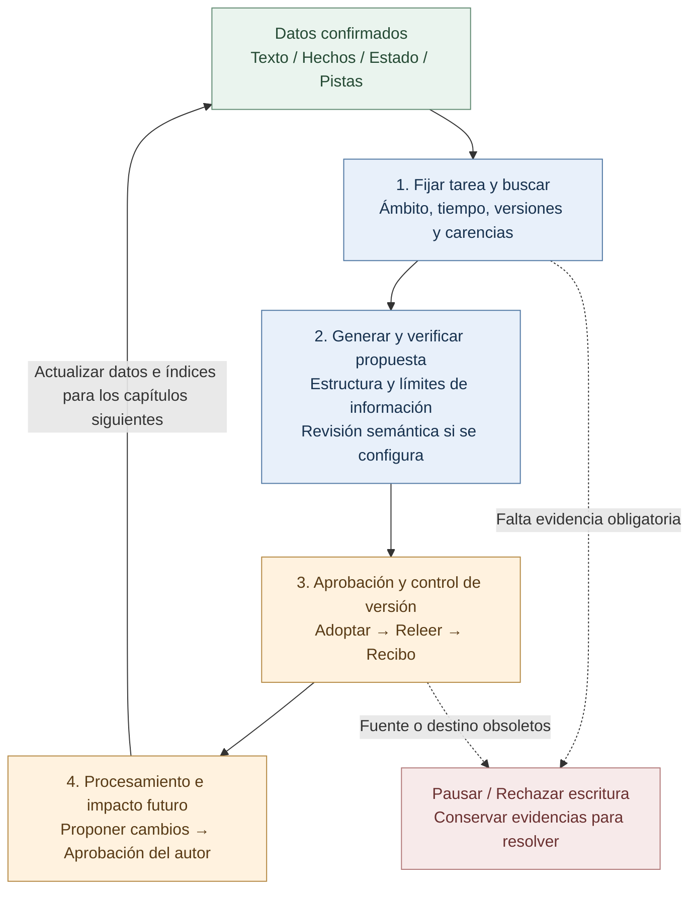

# StoryForge · 故事熔炉

**Escribe historias. Entra en sus mundos.**

<!-- readme-languages:start -->
[简体中文](./README.md) · [English](./README.en.md) · [Français](./README.fr.md) · [Deutsch](./README.de.md) · [Italiano](./README.it.md) · [Español](./README.es.md) · [Português](./README.pt.md) · [日本語](./README.ja.md) · [한국어](./README.ko.md)
<!-- readme-languages:end -->

[Empieza a crear](#quick-start) · [Prueba Fog Harbor](#try-a-story) · [Explora la arquitectura](#architecture)

StoryForge es una herramienta de código abierto para crear y vivir historias con IA, diseñada para conservar los datos en local. Escribe novelas y relatos breves, adapta novelas a guiones o cómics, construye mundos reutilizables y explora experiencias interactivas. Tú eliges el proceso y apruebas las propuestas de la IA antes de incorporarlas a tu obra.

> Estado de `main` comprobado el 9 de septiembre de 2026: novela, narrativa breve, guion, cómic y motor de mundos tienen entradas oficiales. El modo de nodos y los productos interactivos son versiones preliminares. Este README está traducido; no significa que toda la interfaz o los documentos enlazados estén disponibles en español. Las capturas y muchas guías están en chino.

<a id="try-a-story"></a>

## Prueba una historia original

### Fog Harbor: The Last Light — aventura de rol en versión preliminar comunitaria

Investiga un antiguo naufragio con dos compañeros IA, protege los secretos de tu personaje y decide cómo volverán los barcos esta noche. Un director de juego IA (KP) guía la aventura con reglas originales **2d6**, **7 escenas, 6 pistas y 3 finales**.


El juego y sus medios incluidos están en el repositorio. Configura tu propia API de modelo para empezar. La captura muestra la entrada real a la aventura.

**Ciclo de juego:** proponer una acción → resolver las reglas → leer la respuesta del director → revisar pistas → guardar y continuar.

<details>
<summary>Cómo jugar y alcance actual</summary>

Ejecuta el código actual de `main`, abre **TTRPG** (`跑团`) y selecciona la aventura debajo de la sección de producción, o visita `/storyforge/play`. Configura el modelo y elige un personaje. Juega en solitario con compañeros IA o por turnos en un mismo dispositivo. Progreso, reanudación y puntos de control son locales. No hay multijugador público en línea desplegado; los secretos en un dispositivo compartido no están protegidos frente a su propietario.

[Guía del jugador](./examples/ttrpg/README.md) · [Evidencias de producción y partidas](./examples/ttrpg/fog-harbor/production-status.md)

</details>

## Por qué StoryForge

- **Memoria vinculada al manuscrito.** Texto original, hechos, resúmenes y búsqueda ayudan a recuperar pistas antiguas; los cambios confirmados tras un capítulo alimentan los siguientes.
- **Un proceso específico por producto.** La narrativa breve comprueba extensión y finalización; el guion conserva decisiones de adaptación; el cómic separa viñetas, imágenes y rotulación.
- **El autor conserva el control.** La creación oficial genera primero propuestas. Harness añade protección de revisiones, evidencias de ejecución y recuperación de estados guardados.

[Inicio rápido](#quick-start) · [Productos](#products) · [Primera sesión](#first-session) · [Mundos](#worlds) · [Harness](#architecture) · [Privacidad](#privacy) · [Comunidad](#community)

<a id="quick-start"></a>

## Inicio rápido

Abre la [aplicación web](https://yuanbw.vercel.app/storyforge/) o ejecuta el código localmente. La creación local básica no requiere una cuenta de StoryForge. La IA usa tus credenciales del proveedor y sus cargos de API son independientes. El sitio puede ir por detrás de `main`; las Releases antiguas son versiones fijas.

Usa **Node.js 24** y npm, igual que la CI:

```bash
git clone https://github.com/yuanbw2025/storyforge.git
cd storyforge
npm ci
npm run dev
```

Abre la dirección que muestra Vite con la ruta `/storyforge/` y mantén el terminal en ejecución. Un ZIP del código necesita los mismos pasos tras descomprimirlo; no es un instalador de escritorio.

En la página inicial, abre los ajustes del modelo de la esquina superior derecha (`模型与本地设置`). Elige proveedor, introduce API Key, Base URL y un modelo accesible, y prueba la conexión y una generación pequeña. Conectarse no garantiza calidad, saldo ni capacidad de contexto. Para errores CORS del navegador, sigue las instrucciones del proxy local del panel.

<a id="products"></a>

## Elige tu punto de partida


| Objetivo | Entrada | Resultado y estado |
|---|---|---|
| Escribir una novela | Nuevo → Novela | Personajes, esquemas, capítulos, continuidad y revisión; proceso técnico actual validado |
| Terminar una obra breve | Nuevo → Narrativa breve | Diseño, fichas de capítulos, borrador, revisión, edición inmutable; Markdown/TXT/JSON |
| Adaptar a guion | Nuevo → Novela a guion | Fuentes fijadas, decisiones, escenas estructuradas, revisiones; Fountain/FDX/impresión |
| Adaptar a cómic | Nuevo → Novela a cómic | Páginas, viñetas, referencias visuales, rotulación, ediciones; PNG/WebP/CBZ/PDF |
| Crear un mundo | Nuevo → Motor de mundos | Contenido semántico, derivación explícita, versiones inmutables y lectura |
| Componer un proceso visual | Modo de nodos | Versión preliminar; comparte lógica y datos de la novela |
| Jugar o crear experiencias | TTRPG / Chat de personajes / Ciudad IA / Juegos de texto | Versiones preliminares con ciclos propios de producción y ejecución |

Escribir novelas no requiere el motor de mundos. El autor puede derivar explícitamente un mundo de contenido confirmado de una novela u obra breve. Guiones y cómics son adaptaciones independientes sin esa vía de exportación. Se puede jugar una aventura publicada sin crear antes un mundo.

<a id="first-session"></a>

## Tu primera sesión de escritura

1. Elige **Nuevo** (`新建`) → **Novela** (`长篇小说`) e introduce título y descripción.
2. Registra intención, referencias y reglas de escritura; añade la ambientación necesaria.
3. Planifica conflicto y personajes, luego volúmenes y capítulos. Escribe manualmente o edita y aprueba propuestas de la IA.
4. Desarrolla escenas y texto. Revisa los cambios en hechos, estados, relaciones y pistas antes de seguir.
5. En **Gestión de datos** (`数据管理`), exporta el texto y una copia JSON completa.


## Qué hace cada producto por tu obra

### Novelas y nodos

El espacio de novela incluye referencias, ambientación, personajes y relaciones, tramas, esquemas, capítulos, anticipaciones, hechos, inventarios, estilo, plantillas de prompts e historial.

La memoria conserva el **texto original como evidencia**, hechos y estados estructurados, resúmenes de capítulo/volumen/obra e índices de búsqueda. Context Gateway descubre recursos antes de leer sus detalles y registra las fuentes realmente usadas. Los resúmenes e índices derivados se comprueban mediante hashes de origen; si faltan o están obsoletos, se puede volver al texto original. El ámbito de la obra y los límites temporales filtran la recuperación.

Tras cada capítulo, el procesamiento propone cambios de hechos, personajes, relaciones, objetos, cronología, pistas y tramas para que el autor los confirme. El análisis de impacto afecta a planes futuros y preserva la historia confirmada. Las comprobaciones de versión impiden que propuestas antiguas sobrescriban ediciones recientes.

Los nodos oficiales reutilizan los mismos Skills, datos y procesos de aprobación para componer pasos y resultados intermedios. Los borradores experimentales no pueden incorporarse al contenido oficial. La interoperabilidad completa entre interfaces sigue en validación.

[Búsqueda narrativa](./src/lib/context-gateway/narrative-retrieval.ts) · [Procesamiento tras el capítulo](./src/lib/ai/chapter-memory/run-chapter-memory.ts) · [Contrato novela/nodos](./docs/products/LONGFORM-AND-NODE.md)

### Narrativa breve: un camino visible hasta terminar

El proceso dedicado apunta a **5.000–25.000 caracteres chinos en 3–8 capítulos**: brief, diseño, fichas, redacción, revisión, reescritura y publicación. Comprueba longitud real, estructura, texto ausente y propuestas pendientes. Los hallazgos de revisión señalan capítulos y fragmentos; la revisión queda ligada al hash del manuscrito y debe actualizarse después de cambios. Las reescrituras se dirigen a capítulos concretos. Los problemas bloqueantes impiden publicar; cada edición aceptada es inmutable y conserva las anteriores.

[Producción y criterios de finalización](./src/lib/short-novel/service.ts) · [Ejecuciones IA persistentes dedicadas](./src/lib/agent/run/short-novel-durable.ts)

### Guiones: decisiones de adaptación trazables

El proceso fija las fuentes seleccionadas y las conecta con hechos, causalidad, decisiones de adaptación, momentos narrativos, fichas y escenas. Se puede revisar por qué se eliminó, fusionó o transformó un evento. Las escenas usan un **AST**, una representación estructurada de bloques de guion que el código valida y convierte a Fountain, FDX o impresión.

La fidelidad a la fuente y la estructura dramática tienen revisiones separadas. Cada corrección identifica escena y revisión esperada; hay que desbloquear las escenas bloqueadas y se rechazan correcciones obsoletas. Las ediciones fijan fuentes, decisiones y escenas: modificar después la novela no altera automáticamente el guion publicado.

[Producción y revisiones](./src/lib/screenplay/production.ts) · [Ediciones](./src/lib/screenplay/release.ts) · [Renderizadores](./src/lib/screenplay/renderers.ts)

### Cómics: imágenes y rotulación en capas independientes

Primero se desarrollan momentos narrativos, páginas y viñetas; después, imágenes y rotulación. Identidades estables y un orden de lectura explícito conectan encuadres, acciones, diálogos y fuentes. Los sujetos visuales dan identidad a personajes, lugares y objetos. Las imágenes candidatas guardan procedencia y evidencias de las referencias realmente enviadas al proveedor.

La **rotulación SVG local** añade bocadillos, cartelas y efectos sonoros editables encima de las imágenes. Corregir un diálogo no requiere regenerar la viñeta. Las comprobaciones detectan desbordamientos, solapamientos y márgenes inseguros; el autor sigue revisando las partes de la imagen que quedan ocultas. Storyboard y edición visual tienen criterios distintos. Las ediciones visuales mantienen referencias fuertes a los Blob de las imágenes elegidas.

**Límite actual:** el adaptador de imágenes genérico compatible con OpenAI solo envía texto y declara no admitir imágenes de referencia, semillas fijas ni inpainting. Mencionar una referencia en un prompt no equivale a enviar la imagen. La producción visual requiere un servicio configurado o recursos adecuados del autor, con selección y revisión humana de continuidad.

[Producción](./src/lib/comic/production.ts) · [Evidencias de medios](./src/lib/comic/media-service.ts) · [Rotulación](./src/lib/comic/renderers.ts) · [Controles de calidad](./src/lib/comic/qa.ts)

Los procesos técnicos actuales están implementados en `main`; el rendimiento de proveedores y la calidad del contenido siguen evaluándose. Consulta la [base de capacidades](./docs/roadmap/CAPABILITY-BASELINE.md).

<a id="worlds"></a>

## Mundos y productos interactivos

Crea o deriva explícitamente un mundo, fija una versión y configura e inicia la producción dentro del producto elegido. El motor conserva solo **contenido semántico versionado**. Cada producto posee sus medios, partidas y evolución privada. Ni los cambios posteriores de la novela ni las partidas reescriben automáticamente el mundo compartido.

La derivación registra obra de origen, revisión, intervalo y hash. Los adaptadores de cada producto declaran recursos obligatorios, opcionales y prohibidos y fijan un **SourcePlan**. Las lecturas progresivas `describe / search / read` dejan un Context Manifest por ejecución y un SourceManifest final de lecturas reales. Una aventura puede seguir en la versión 1 mientras el autor trabaja en la 2.

[Cliente de recursos del mundo](./src/lib/context-gateway/world-release-client.ts) · [Contrato del mundo](./docs/products/WORLD-ENGINE.md)

**Todos los productos siguientes son versiones preliminares:**

| Producto | Mecanismos implementados | Límite actual |
|---|---|---|
| [TTRPG / director IA](./src/lib/ttrpg/information-boundary.ts) | Código para reglas, dados y efectos; contextos separados director/jugador/PNJ, secretos por destinatario, eventos y puntos de control | Fog Harbor tiene evidencias con modelos reales; sin multijugador público en línea |
| [Chat de personajes](./src/lib/character-interaction/runtime.ts) | Perfiles y voz fijados, objetivos de escena, memoria de compromisos/secretos/conflictos, confianza/cercanía/cautela/respeto | Calidad de personajes a largo plazo en evaluación |
| [Ciudad IA Afterstory](./src/lib/ai-town/runtime.ts) | Seis franjas diarias, lugares y viajes, conocimientos, recuerdos, relaciones, gestión ligera y avance del tiempo sin conexión | Reproducción de 14 días validada; modelos a largo plazo y medios no simulados aún en evaluación |
| [Aventura de texto](./src/lib/adventure/runtime.ts) | Requisitos, inventario, recursos, habilidades, misiones y consecuencias comprobados por código | Cada obra necesita validación específica |
| [AVG](./src/lib/avg/runtime.ts) | Indicaciones declarativas, capas de fondos/personajes/audio, comprobación de medios e instantáneas de escena | Experiencia audiovisual completa en validación |
| [Mundo abierto textual](./src/lib/open-world/runtime.ts) | Regiones, viajes, recursos, facciones, horarios y cambios regionales con el tiempo | Producción completa y juego prolongado en desarrollo |

La comunidad en línea y los servicios comerciales pertenecen a fases posteriores.

<a id="architecture"></a>

## Arquitectura compartida y coherencia a largo plazo

**Harness es el sistema de ejecución y validación que rodea las llamadas al modelo.** Vincula contratos de tarea, entradas reales, propuestas, versiones, puntos de control y resultados con la obra. Cada producto mantiene sus propios servicios de dominio y datos.



Las flechas indican dependencias o accesos a datos, no el orden de ejecución. Novelas y narrativa breve no requieren el motor de mundos. Los productos interactivos usan comandos y máquinas de estados propios.

### Cómo se mantiene la coherencia entre capítulos

El ciclo continuo consiste en **recuperar evidencias, aprobar cambios y entregar la versión correcta a la siguiente tarea**. Generación, actualización de memoria, auditoría y planificación futura contribuyen al proceso.



Cada ejecución oficial conserva su registro y puntos de control. El procesamiento posterior al capítulo y las revisiones futuras son ejecuciones separadas y acotadas, con sus propias comprobaciones de versión y aprobaciones. El ciclo puede abarcar varias sesiones.

- La falta de fuentes obligatorias bloquea el avance. Los manifiestos registran ámbito, hashes, lecturas y carencias. Los límites de obra, mundo y tiempo evitan mezclas y conocimiento prematuro.
- La adopción vuelve a comprobar revisiones de entrada y destino. Una propuesta obsoleta no puede sobrescribir texto reciente. La relectura y el recibo verifican lo guardado.
- Las auditorías explícitas de coherencia se vinculan al hash del texto. Modificarlo invalida las evidencias anteriores.
- La recuperación restaura estados persistidos con comprobación de versión. Un resultado desconocido del proveedor no desencadena reenvíos a ciegas.

Ejemplo: el capítulo 8 establece quién tiene un objeto único. En el capítulo 80, la búsqueda puede aportar el pasaje original y el estado confirmado. Si el autor cambia al propietario antes de aprobar una propuesta, el control de revisión bloquea su adopción directa. Tras confirmar el nuevo capítulo y sus cambios de memoria, los siguientes capítulos pueden utilizarlos.

### Evidencias que puedes inspeccionar

- [Búsqueda a gran escala y aislamiento de mundos e información futura](./tests/regression/R-PHASE4-long-form-scale-gate.test.ts)
- [Bloqueo sin evidencia obligatoria y destinos de edición exactos](./tests/regression/R-CTXG7-gateway-execution.test.ts)
- [Rechazo de propuestas obsoletas tras cambios de texto o ajustes](./tests/regression/R-HARNESS7-prose-generation-durable.test.ts)
- [Recuperación del procesamiento del capítulo sin otra llamada al modelo](./tests/regression/R-HARNESS20-chapter-post-adoption-durable.test.ts)
- [Invalidación de auditorías tras ediciones y sin reenvíos ante resultados desconocidos](./tests/regression/R-MEMORY-CLOSE1-consistency-audit-durable.test.ts)
- [Conservación de la historia escrita e invalidación de planes futuros](./tests/regression/R-FUTURE1-continuous-evolution.test.ts)

[Ejecuciones oficiales de prosa](./src/lib/agent/run/prose-generation-durable.ts) · [Recibos de verificación](./src/lib/agent/run/verification-receipt.ts) · [Arquitectura](./docs/ARCHITECTURE.md) · [Estándar Harness](./docs/HARNESS-QUALITY-STANDARD.md)

**Alcance de las garantías:** el código comprueba versiones, ámbitos, estructura, transiciones y reglas de escritura. La revisión semántica depende de la configuración o de una acción explícita del autor. Subtexto, metáforas, pistas no registradas y calidad literaria siguen necesitando criterio humano y del modelo. Los tests de **100.000 / 300.000 / 1.000.000 de caracteres** demuestran comportamiento técnico, no garantizan la coherencia literaria de una novela de un millón de palabras. La recuperación cubre estados guardados; las entradas auxiliares y experimentales conservan sus límites declarados.

<a id="privacy"></a>

## Modelos, almacenamiento y privacidad

- Usa tu proveedor cloud o un servicio local compatible, como Ollama o LM Studio. Los ajustes predefinidos no certifican que todos los modelos sirvan igual para cada producto.
- La generación cloud envía el contexto seleccionado al proveedor configurado. Guardar datos en local no convierte todas las llamadas IA en operaciones sin conexión.
- Obras y partidas residen en IndexedDB, según el perfil y origen del navegador. Cambiar navegador, host o puerto no transfiere los datos.
- Las claves API duran por defecto lo que la sesión del navegador. Solo la opción explícita de recordarlas en el dispositivo las guarda en localStorage.
- Exporta una **copia JSON completa** antes de cambiar de dispositivo o borrar datos del navegador. Markdown/TXT no la sustituyen; para medios usa los exports del producto o espacio de trabajo.
- El acceso a carpetas locales requiere autorización: [guía del espacio de memoria](./docs/MEMORY-WORKSPACE-GUIDE.md).
- La copia opcional en GitHub Gist sube el JSON completo del proyecto a tu Gist privado. No tiene cifrado de extremo a extremo.

<a id="community"></a>

## Comunidad y contribuciones

[GitHub Issues](https://github.com/yuanbw2025/storyforge/issues) · [Sitio del desarrollador](https://yuanbw.vercel.app/) · Grupo QQ: **1082374587**

[Tutorial de Bilibili](https://www.bilibili.com/video/BV1q37j6QExh/) e [introducción de Zhihu](https://zhuanlan.zhihu.com/p/2038714210188780594): recursos históricos en chino cuyos menús pueden diferir. Al informar de errores, indica versión, navegador/sistema, pasos y resultado esperado/real. Elimina claves y textos privados de capturas y registros. Se agradecen estrellas, ejemplos, vídeos, traducciones y contribuciones.

StoryForge usa **React, TypeScript, Vite, Zustand, TipTap y Dexie**. Tres registros gobiernan la base compartida: `CONTEXT_SOURCES` + `assembleContext()` para lecturas IA; `FIELD_REGISTRY` + `AdoptionSchema` + `adopt()` para escrituras aprobadas; `PROJECT_TABLES` para el ciclo de vida de las tablas.

```bash
npm run ci
npm run ci:e2e
```

Antes de contribuir lee [AGENTS.md](./AGENTS.md), [CONTRIBUTING.md](./CONTRIBUTING.md), el [proceso de colaboración](./docs/COLLAB-WORKFLOW.md) y la [carta del proyecto](./docs/PROJECT-MASTER-CHARTER.md).

## Estrellas, apoyo y licencia

[](https://www.star-history.com/?repos=yuanbw2025%2Fstoryforge&type=date&legend=top-left)

El apoyo económico es voluntario y no cambia el acceso a funciones o futuras actualizaciones. Ayuda a financiar suscripciones de modelos y mantenimiento. [Detalles del apoyo](./README.md#自愿赞助).

Código bajo licencia [MIT](./LICENSE). Obras originales, modelos, medios de terceros y resultados conservan sus respectivas condiciones. Consulta el [aviso de licencia SRD TTRPG](./docs/ttrpg/licenses/SRD-5.2.1-CC-BY-4.0.md) cuando corresponda.
