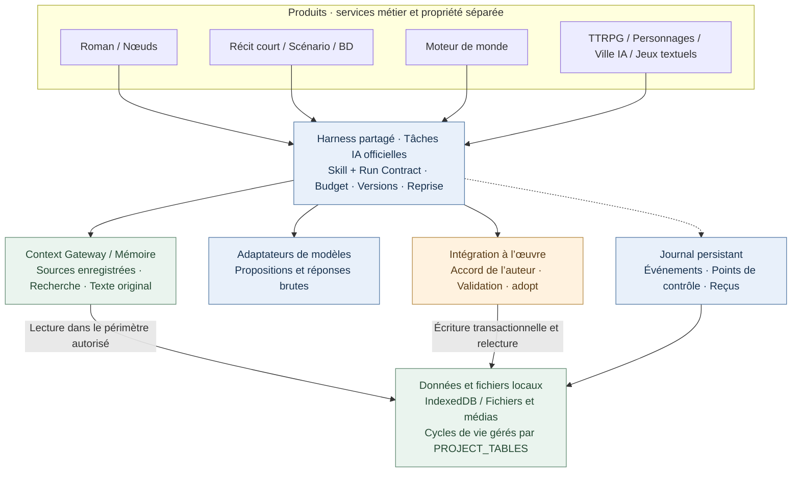
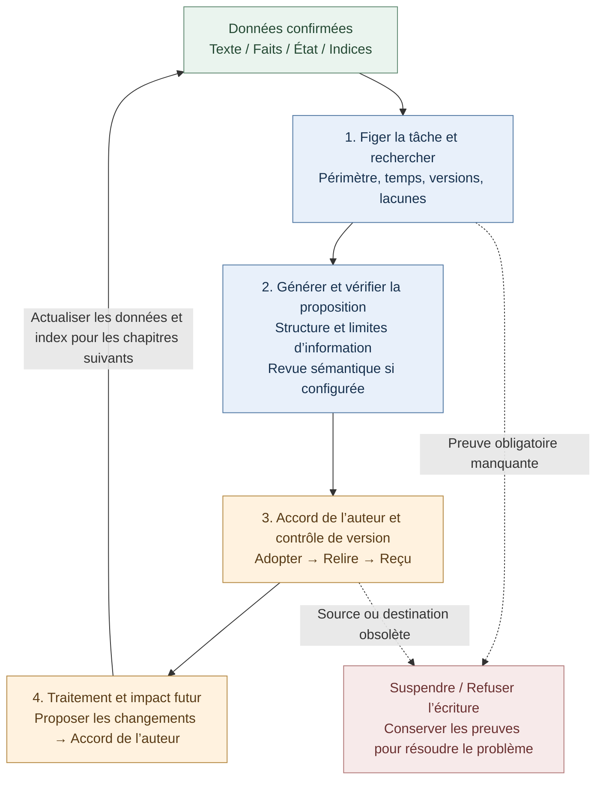

# StoryForge · 故事熔炉

**Écrivez des histoires. Entrez dans leur univers.**

<!-- readme-languages:start -->
[简体中文](./README.md) · [English](./README.en.md) · [Français](./README.fr.md) · [Deutsch](./README.de.md) · [Italiano](./README.it.md) · [Español](./README.es.md) · [Português](./README.pt.md) · [日本語](./README.ja.md) · [한국어](./README.ko.md)
<!-- readme-languages:end -->

**Tutoriels et communauté en chinois :** [Vidéo Bilibili](https://www.bilibili.com/video/BV1q37j6QExh/) · [Présentation Zhihu](https://zhuanlan.zhihu.com/p/2038714210188780594) · **Groupe QQ : 1082374587** · [Autres liens](#community)

[Commencer à créer](#quick-start) · [Découvrir Fog Harbor](#try-a-story) · [Explorer l’architecture](#architecture)

StoryForge est un outil open source de création et d’expérience narrative assistées par IA, conçu pour conserver les données en local. Écrivez des romans ou des récits courts, adaptez un roman en scénario ou en bande dessinée, créez des mondes réutilisables et explorez des histoires interactives. Vous choisissez le parcours et validez les propositions de l’IA avant leur intégration à votre œuvre.

> État vérifié sur `main` le 9 septembre 2026 : roman, récit court, scénario, bande dessinée et moteur de monde disposent d’entrées officielles. Le mode nœuds et les produits interactifs sont en préversion. Ce README est traduit ; cela ne signifie pas que toute l’interface ou les documents liés sont disponibles en français. Les captures et de nombreux guides sont en chinois.

<a id="try-a-story"></a>

## Découvrez une histoire originale

### Fog Harbor: The Last Light — préversion communautaire de jeu de rôle

Enquêtez sur un ancien naufrage avec deux compagnons IA, protégez les secrets de votre personnage et décidez du retour des navires de cette nuit. Un meneur de jeu IA (KP) anime l’aventure avec des règles originales à **2d6**, **7 scènes, 6 indices et 3 fins**.


Le jeu et ses médias sont inclus dans le dépôt. Configurez votre propre API de modèle pour commencer. La capture montre l’entrée réelle de l’aventure.

**Boucle de jeu :** proposer une action → résoudre les règles → lire la réponse du meneur → consulter les indices → sauvegarder et continuer.

<details>
<summary>Accès et limites actuelles</summary>

Lancez le code actuel de `main`, ouvrez **TTRPG** (`跑团`) et choisissez l’aventure sous la section de production, ou utilisez `/storyforge/play`. Configurez le modèle puis choisissez un personnage. Jouez seul avec des compagnons IA ou à plusieurs en vous passant le même appareil. La progression, la reprise et les points de contrôle sont locaux. Le multijoueur public en ligne n’est pas déployé ; les secrets sur un appareil partagé ne sont pas protégés contre son propriétaire.

[Guide du joueur](./examples/ttrpg/README.md) · [Traces de production et de parties](./examples/ttrpg/fog-harbor/production-status.md)

</details>

## Pourquoi StoryForge ?

- **Une mémoire reliée au manuscrit.** Texte original, faits, résumés et recherche permettent de retrouver les premiers indices ; les changements confirmés après un chapitre alimentent les suivants.
- **Un parcours propre à chaque œuvre.** Le récit court vérifie longueur et achèvement ; le scénario conserve les décisions d’adaptation ; la bande dessinée sépare cases, images et lettrage.
- **L’auteur garde la décision.** Les résultats officiels de création sont d’abord des propositions. Harness ajoute des contrôles de révision, des traces d’exécution et la reprise des états sauvegardés.

[Démarrage](#quick-start) · [Choisir un produit](#products) · [Première session](#first-session) · [Mondes](#worlds) · [Harness](#architecture) · [Confidentialité](#privacy) · [Communauté](#community)

<a id="quick-start"></a>

## Démarrage rapide

Ouvrez [l’application web](https://yuanbw.vercel.app/storyforge/) ou lancez le code localement. La création locale de base ne nécessite pas de compte StoryForge. L’IA utilise vos identifiants de fournisseur ; les frais d’API sont distincts. Le site peut être en retard sur `main` et les anciennes Releases sont des versions figées.

Utilisez **Node.js 24** et npm, comme dans la CI :

```bash
git clone https://github.com/yuanbw2025/storyforge.git
cd storyforge
npm ci
npm run dev
```

Ouvrez l’adresse affichée par Vite avec le chemin `/storyforge/` et gardez le terminal ouvert. Une archive ZIP du code nécessite les mêmes commandes après extraction : ce n’est pas un installateur.

Sur l’accueil, ouvrez le bouton de réglages en haut à droite (`模型与本地设置`). Choisissez un fournisseur, renseignez API Key, Base URL et un modèle accessible, puis testez la connexion et une petite génération. Une connexion réussie ne garantit ni qualité, ni solde, ni capacité de contexte. En cas d’erreur CORS du navigateur, suivez les instructions de proxy local du panneau.

<a id="products"></a>

## Choisissez votre point de départ


| Objectif | Entrée | Résultat et état |
|---|---|---|
| Écrire un roman | Nouveau → Roman | Personnages, plans, chapitres, continuité et révision ; parcours technique actuel validé |
| Terminer un récit court | Nouveau → Récit court | Conception, fiches de chapitres, rédaction, revue, édition figée ; Markdown/TXT/JSON |
| Adapter en scénario | Nouveau → Roman vers scénario | Sources figées, décisions, scènes structurées, revues ; Fountain/FDX/impression |
| Adapter en BD | Nouveau → Roman vers BD | Pages, cases, références visuelles, lettrage, éditions ; PNG/WebP/CBZ/PDF |
| Créer un monde | Nouveau → Moteur de monde | Contenu sémantique, dérivation explicite, versions figées et lecture |
| Composer un parcours visuel | Mode nœuds | Préversion ; même moteur et mêmes données que le roman |
| Jouer ou créer des expériences | TTRPG / Personnages / Ville IA / Jeux textuels | Préversions avec leurs propres cycles de production et d’exécution |

Écrire un roman ne nécessite pas de monde. L’auteur peut explicitement dériver un monde d’un roman ou récit court confirmé. Les scénarios et BD sont des adaptations indépendantes et n’offrent pas cette dérivation. Une aventure publiée peut se jouer sans créer de monde.

<a id="first-session"></a>

## Votre première session d’écriture

1. Choisissez **Nouveau** (`新建`) → **Roman** (`长篇小说`), puis saisissez titre et description.
2. Notez votre intention, vos références et vos règles d’écriture ; ajoutez les éléments de contexte utiles.
3. Préparez conflit et personnages, puis volumes et chapitres. Écrivez vous-même ou modifiez et validez les propositions de l’IA.
4. Développez les scènes et le texte de chaque chapitre. Vérifiez les changements de faits, d’états, de relations et d’indices avant de poursuivre.
5. Dans **Gestion des données** (`数据管理`), exportez le texte et une sauvegarde JSON complète.


## Ce que chaque produit apporte à votre travail

### Roman et mode nœuds

L’espace de roman réunit références, univers, personnages, relations, intrigues, plans, chapitres, indices, faits, inventaires, style, modèles de prompts et historique.

La mémoire conserve le **texte original comme preuve**, des faits et états structurés, des résumés de chapitre/volume/ensemble et des index de recherche. Context Gateway repère les ressources avant d’en lire le détail et consigne les sources effectivement utilisées. Les résumés et index dérivés sont vérifiés par empreinte ; leur absence ou obsolescence permet un retour au texte original. Le périmètre de l’œuvre et les limites temporelles filtrent la recherche.

Après un chapitre, un traitement propose les changements de faits, personnages, relations, objets, chronologie, indices et intrigues. L’auteur les confirme. L’analyse d’impact vise les plans futurs sans réécrire silencieusement l’histoire confirmée. Les contrôles de version empêchent une ancienne proposition d’écraser une modification récente.

Le mode nœuds expose des étapes plus petites en réutilisant les mêmes Skills, données et validations. Les brouillons expérimentaux ne peuvent pas rejoindre le contenu officiel. L’interopérabilité complète entre interfaces reste en validation.

[Recherche narrative](./src/lib/context-gateway/narrative-retrieval.ts) · [Traitement après chapitre](./src/lib/ai/chapter-memory/run-chapter-memory.ts) · [Contrat roman/nœuds](./docs/products/LONGFORM-AND-NODE.md)

### Récit court : un chemin explicite vers une œuvre terminée

Le parcours vise **5 000 à 25 000 caractères chinois, répartis sur 3 à 8 chapitres** : brief, conception, fiches, rédaction, revue, réécriture, publication. Il vérifie la longueur réelle, la structure, les passages manquants et les propositions en attente. Les problèmes de revue citent les chapitres et le texte ; la revue est liée à l’empreinte du manuscrit et doit être actualisée après modification. Les réécritures ciblent les chapitres concernés. Les problèmes bloquants empêchent la publication ; chaque édition acceptée est figée et préserve les précédentes.

[Production et critères d’achèvement](./src/lib/short-novel/service.ts) · [Exécutions IA persistantes dédiées](./src/lib/agent/run/short-novel-durable.ts)

### Scénario : des choix d’adaptation traçables

Les sources sélectionnées sont figées, puis reliées aux faits, causalités, décisions d’adaptation, temps forts, fiches de scènes et scènes. On peut comprendre pourquoi un événement a été supprimé, fusionné ou transformé. Les scènes utilisent un **AST**, représentation structurée des blocs de scénario, validé par le code et exporté vers Fountain, FDX ou l’impression.

Fidélité à la source et efficacité dramatique ont des revues séparées. Une correction cible une scène et sa révision attendue ; une scène verrouillée doit être déverrouillée et une correction obsolète est bloquée. L’édition fige sources, décisions et scènes : modifier ensuite le roman ne change pas le scénario publié.

[Production et révisions](./src/lib/screenplay/production.ts) · [Éditions figées](./src/lib/screenplay/release.ts) · [Rendu](./src/lib/screenplay/renderers.ts)

### Bande dessinée : narration, images et lettrage séparés

Construisez d’abord les temps forts, pages et cases, puis les images et le lettrage. Des identifiants stables et un ordre de lecture explicite relient cadrages, actions, dialogues et sources. Les sujets visuels donnent une identité aux personnages, lieux et objets ; chaque image candidate conserve sa provenance et les preuves des références réellement transmises au fournisseur.

Le **lettrage SVG local** ajoute bulles, légendes et effets sonores modifiables au-dessus de l’image. Corriger un dialogue ne nécessite pas de régénérer la case. Les contrôles détectent débordements, chevauchements et marges dangereuses ; l’auteur vérifie encore ce que les bulles masquent. Storyboard et édition visuelle ont des critères distincts ; les éditions conservent des références fortes aux Blob des images sélectionnées.

**Limite actuelle :** l’adaptateur d’image générique compatible OpenAI n’envoie que du texte et ne déclare aucune prise en charge des images de référence, graines fixes ou retouches par masque. Mentionner une référence dans un prompt ne constitue pas son envoi. La production visuelle nécessite un service d’image configuré ou des ressources appropriées de l’auteur, avec sélection et revue de continuité humaines.

[Production](./src/lib/comic/production.ts) · [Preuves des médias](./src/lib/comic/media-service.ts) · [Lettrage](./src/lib/comic/renderers.ts) · [Contrôles qualité](./src/lib/comic/qa.ts)

Les parcours techniques de ces produits sont implémentés sur `main` ; la qualité des modèles et des contenus reste évaluée. Consultez le [bilan des capacités](./docs/roadmap/CAPABILITY-BASELINE.md).

<a id="worlds"></a>

## Mondes et produits interactifs

Créez ou dérivez explicitement un monde, figez sa version, puis configurez et démarrez la production dans le produit choisi. Le moteur conserve uniquement du **contenu sémantique versionné**. Chaque produit possède ses médias, sauvegardes et évolutions privées. Ni les modifications ultérieures du roman ni les parties ne réécrivent automatiquement le monde partagé.

La dérivation enregistre œuvre source, révision, plage et empreinte. Chaque adaptateur produit déclare les ressources obligatoires, facultatives et interdites, puis fige un **SourcePlan**. Les lectures progressives `describe / search / read` laissent un Context Manifest par exécution et un SourceManifest final des lectures réelles. Une aventure peut rester sur la version 1 pendant que l’auteur prépare la version 2.

[Client de ressources du monde](./src/lib/context-gateway/world-release-client.ts) · [Contrat du monde](./docs/products/WORLD-ENGINE.md)

**Tous les produits ci-dessous sont en préversion :**

| Produit | Mécanisme concret | Limite actuelle |
|---|---|---|
| [TTRPG / meneur IA](./src/lib/ttrpg/information-boundary.ts) | Règles et dés résolus par code, contextes séparés meneur/joueur/PNJ, secrets filtrés par destinataire, événements et points de contrôle | Fog Harbor dispose de traces avec un vrai modèle ; pas de multijoueur public déployé |
| [Dialogue de personnages](./src/lib/character-interaction/runtime.ts) | Profils et voix figés, objectifs de scène, mémoire des engagements/secrets/conflits, confiance/proximité/méfiance/respect | Qualité des personnages à long terme en évaluation |
| [Ville IA Afterstory](./src/lib/ai-town/runtime.ts) | Six créneaux par jour, déplacements, connaissances, mémoire, relations, gestion légère et rattrapage hors ligne | Rejeu sur 14 jours validé ; modèles sur la durée et médias non simulés encore évalués |
| [Aventure textuelle](./src/lib/adventure/runtime.ts) | Prérequis, inventaire, ressources, compétences, quêtes et conséquences contrôlés par code | Validation nécessaire pour chaque œuvre |
| [AVG](./src/lib/avg/runtime.ts) | Indications déclaratives, couches de décors/personnages/audio, contrôles des médias et instantanés de scène | Livraison audiovisuelle complète en validation |
| [Monde ouvert textuel](./src/lib/open-world/runtime.ts) | Régions, voyages, ressources, factions, emplois du temps et changements régionaux dans le temps | Production complète et jeu prolongé en développement |

Les services communautaires en ligne et commerciaux sont prévus pour une étape ultérieure.

<a id="architecture"></a>

## Architecture partagée et cohérence à long terme

**Harness est le système d’exécution et de validation qui entoure les appels de modèle.** Il relie contrats de tâche, entrées réelles, propositions, versions, points de contrôle et résultats à l’œuvre. Chaque produit garde ses services métier et ses données.



Les flèches représentent des dépendances ou accès aux données, pas un ordre d’exécution. Les romans et récits courts ne dépendent pas du moteur de monde. Les expériences interactives utilisent leurs propres commandes et machines à états.

### Comment la cohérence se prolonge d’un chapitre à l’autre

Le cycle consiste à **retrouver les preuves, confirmer les changements et fournir la bonne version à la tâche suivante**. Génération, traitement de mémoire, audit et révision future contribuent chacun à ce cycle.



Chaque exécution officielle conserve son journal et ses points de contrôle. Traitement après chapitre et révision future sont des exécutions distinctes, bornées, avec leurs propres contrôles et validations. Le cycle peut couvrir plusieurs sessions.

- Les sources obligatoires manquantes interrompent la progression ; les manifestes consignent périmètre, empreintes, lectures et lacunes. Les limites d’œuvre, de monde et de temps évitent les mélanges et les révélations prématurées.
- L’adoption revérifie les révisions d’entrée et de destination. Une proposition obsolète ne peut pas écraser un texte plus récent. La relecture des données écrites et le reçu vérifient la persistance.
- Les audits de cohérence explicites sont liés à l’empreinte du texte. Modifier le manuscrit invalide les anciennes preuves d’audit.
- La reprise restaure les états persistés avec contrôle de version. Une issue inconnue chez un fournisseur ne déclenche pas de nouvelle tentative aveugle.

Exemple : le chapitre 8 établit qui détient un objet unique. Au chapitre 80, la recherche peut retrouver le passage et l’état confirmé. Si l’auteur change le propriétaire avant d’accepter une proposition, le contrôle de révision bloque cette proposition devenue obsolète. Après confirmation du nouveau chapitre et des changements de mémoire, les chapitres suivants peuvent les utiliser.

### Des preuves consultables

- [Recherche à grande échelle et isolation des mondes/du futur](./tests/regression/R-PHASE4-long-form-scale-gate.test.ts)
- [Blocage sans preuve obligatoire et ciblage exact des modifications](./tests/regression/R-CTXG7-gateway-execution.test.ts)
- [Refus des propositions obsolètes après modification du texte ou des réglages](./tests/regression/R-HARNESS7-prose-generation-durable.test.ts)
- [Récupération du traitement de chapitre sans nouvel appel au modèle](./tests/regression/R-HARNESS20-chapter-post-adoption-durable.test.ts)
- [Invalidation des audits après édition et absence de relance sur résultat inconnu](./tests/regression/R-MEMORY-CLOSE1-consistency-audit-durable.test.ts)
- [Préservation de l’histoire écrite et invalidation des plans futurs](./tests/regression/R-FUTURE1-continuous-evolution.test.ts)

[Exécutions de prose](./src/lib/agent/run/prose-generation-durable.ts) · [Reçus de vérification](./src/lib/agent/run/verification-receipt.ts) · [Architecture](./docs/ARCHITECTURE.md) · [Standard Harness](./docs/HARNESS-QUALITY-STANDARD.md)

**Portée des garanties :** le code contrôle versions, périmètres, structure, transitions et règles d’écriture. La revue sémantique dépend de la configuration ou d’une action explicite de l’auteur. Sous-entendus, métaphores, indices non enregistrés et qualité littéraire nécessitent encore un jugement humain et celui du modèle. Les tests sur **100 000 / 300 000 / 1 000 000 de caractères** démontrent un comportement technique, pas la cohérence littéraire garantie d’un roman d’un million de mots. La reprise concerne les états sauvegardés ; les entrées auxiliaires et expérimentales gardent leurs limites déclarées.

<a id="privacy"></a>

## Modèles, stockage et confidentialité

- Utilisez votre fournisseur cloud ou un service local compatible, comme Ollama ou LM Studio. Un préréglage ne certifie pas la qualité de tous les modèles pour tous les produits.
- La génération cloud transmet le contexte sélectionné au fournisseur configuré. Le stockage local ne rend pas tous les appels IA hors ligne.
- Œuvres et sauvegardes de partie résident dans IndexedDB, pour le profil et l’origine du navigateur. Changer de navigateur, hôte ou port ne transfère pas les données.
- Les clés API durent par défaut le temps de la session. Choisir explicitement de les mémoriser sur l’appareil les place dans localStorage.
- Exportez une **sauvegarde JSON complète** avant de changer d’appareil ou d’effacer les données du navigateur. Markdown/TXT ne la remplacent pas ; utilisez les exports produit/espace de travail pour les médias.
- L’accès à un dossier local nécessite l’autorisation de l’utilisateur : [guide de l’espace mémoire](./docs/MEMORY-WORKSPACE-GUIDE.md).
- La sauvegarde facultative GitHub Gist envoie le JSON complet du projet dans votre Gist privé. Elle n’est pas chiffrée de bout en bout.

<a id="community"></a>

## Communauté et contributions

[GitHub Issues](https://github.com/yuanbw2025/storyforge/issues) · [Site du développeur](https://yuanbw.vercel.app/) · [Profil Zhihu du développeur](https://www.zhihu.com/people/dan-ran-xing-yuan-59) · Groupe QQ : **1082374587**

[Tutoriel Bilibili](https://www.bilibili.com/video/BV1q37j6QExh/) et [présentation Zhihu](https://zhuanlan.zhihu.com/p/2038714210188780594) : ressources historiques en chinois, dont les menus peuvent différer. Pour signaler un problème, indiquez version, navigateur/système, étapes et résultat attendu/observé ; retirez clés et textes privés des captures et journaux. Étoiles, exemples, vidéos, traductions et contributions sont bienvenus.

Le projet utilise **React, TypeScript, Vite, Zustand, TipTap et Dexie**. Trois registres gouvernent le socle : `CONTEXT_SOURCES` + `assembleContext()` pour les lectures IA ; `FIELD_REGISTRY` + `AdoptionSchema` + `adopt()` pour les écritures approuvées ; `PROJECT_TABLES` pour le cycle de vie des tables.

```bash
npm run ci
npm run ci:e2e
```

Avant de contribuer, lisez [AGENTS.md](./AGENTS.md), [CONTRIBUTING.md](./CONTRIBUTING.md), le [processus de collaboration](./docs/COLLAB-WORKFLOW.md) et la [charte du projet](./docs/PROJECT-MASTER-CHARTER.md).

## Étoiles, soutien et licence

[](https://www.star-history.com/?repos=yuanbw2025%2Fstoryforge&type=date&legend=top-left)

Le soutien est volontaire et ne modifie pas l’accès aux fonctions ou aux mises à jour. Il aide à financer abonnements aux modèles et maintenance. [Détails du soutien](./README.md#自愿赞助).

Code sous licence [MIT](./LICENSE). Œuvres originales, modèles, médias tiers et sorties conservent leurs conditions respectives. Consultez la [notice de licence du SRD TTRPG](./docs/ttrpg/licenses/SRD-5.2.1-CC-BY-4.0.md) si elle s’applique.
