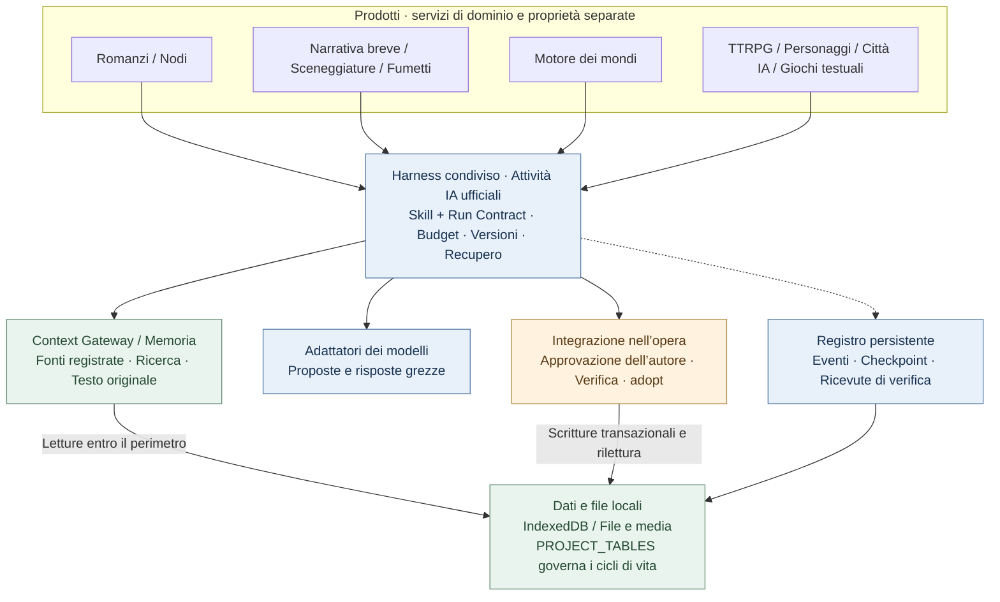
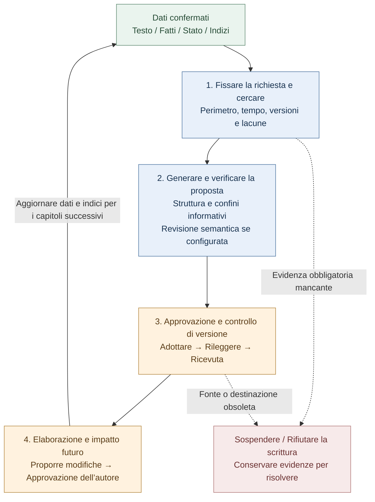

# StoryForge · 故事熔炉

**Scrivi storie. Entra nei loro mondi.**

<!-- readme-languages:start -->
[简体中文](./README.md) · [English](./README.en.md) · [Français](./README.fr.md) · [Deutsch](./README.de.md) · [Italiano](./README.it.md) · [Español](./README.es.md) · [Português](./README.pt.md) · [日本語](./README.ja.md) · [한국어](./README.ko.md)
<!-- readme-languages:end -->

**Tutorial e comunità in cinese:** [Video Bilibili](https://www.bilibili.com/video/BV1q37j6QExh/) · [Introduzione Zhihu](https://zhuanlan.zhihu.com/p/2038714210188780594) · **Gruppo QQ: 1082374587** · [Altri contatti](#community)

[Inizia a creare](#quick-start) · [Prova Fog Harbor](#try-a-story) · [Esplora l’architettura](#architecture)

StoryForge è uno strumento open source per creare e vivere storie con l’IA, progettato per conservare i dati in locale. Scrivi romanzi e narrativa breve, adatta un romanzo in sceneggiatura o fumetto, costruisci mondi riutilizzabili ed esplora esperienze interattive. Scegli il percorso e approvi le proposte dell’IA prima che entrino nella tua opera.

> Stato verificato su `main` il 9 settembre 2026: romanzi, narrativa breve, sceneggiature, fumetti e motore dei mondi hanno accessi ufficiali. La modalità a nodi e i prodotti interattivi sono anteprime. Questo README è tradotto; non implica una traduzione completa dell’interfaccia o dei documenti collegati. Le schermate e molte guide sono in cinese.

<a id="try-a-story"></a>

## Prova una storia originale

### Fog Harbor: The Last Light — anteprima comunitaria di gioco di ruolo

Indaga su un vecchio naufragio con due compagni IA, proteggi i segreti del tuo personaggio e decidi come torneranno le navi stanotte. Un narratore IA (KP) conduce l’avventura con regole originali **2d6**, **7 scene, 6 indizi e 3 finali**.


Il gioco e i contenuti multimediali inclusi sono nel repository. Configura la tua API del modello per iniziare. L’immagine mostra il vero punto di accesso all’avventura.

**Ciclo di gioco:** proponi un’azione → risolvi le regole → leggi la risposta del narratore → esamina gli indizi → salva e continua.

<details>
<summary>Come giocare e limiti attuali</summary>

Avvia il codice aggiornato di `main`, apri **TTRPG** (`跑团`) e scegli l’avventura sotto la sezione di produzione, oppure visita `/storyforge/play`. Configura il modello e scegli un personaggio. Puoi giocare da solo con compagni IA o passandovi lo stesso dispositivo. Progressi, ripresa e checkpoint sono locali. Il multigiocatore pubblico online non è disponibile; sullo stesso dispositivo i segreti non sono protetti dal proprietario.

[Guida del giocatore](./examples/ttrpg/README.md) · [Evidenze di produzione e partite](./examples/ttrpg/fog-harbor/production-status.md)

</details>

## Perché StoryForge

- **Memoria collegata al manoscritto.** Testo originale, fatti, riassunti e ricerca aiutano a recuperare indizi lontani; i cambiamenti confermati dopo un capitolo alimentano il lavoro successivo.
- **Percorsi dedicati a ogni prodotto.** La narrativa breve controlla lunghezza e completamento, la sceneggiatura conserva le scelte di adattamento, il fumetto separa vignette, immagini e lettering.
- **La decisione resta all’autore.** La creazione ufficiale produce prima proposte. Harness aggiunge protezione delle revisioni, evidenze di esecuzione e recupero degli stati salvati.

[Avvio rapido](#quick-start) · [Prodotti](#products) · [Prima sessione](#first-session) · [Mondi](#worlds) · [Harness](#architecture) · [Privacy](#privacy) · [Comunità](#community)

<a id="quick-start"></a>

## Avvio rapido

Apri [l’app web](https://yuanbw.vercel.app/storyforge/) o esegui il codice in locale. Per la creazione locale di base non serve un account StoryForge. L’IA usa le tue credenziali del fornitore e i costi API sono separati. Il sito può essere meno aggiornato di `main`; le vecchie Release sono versioni fisse.

Usa **Node.js 24** e npm, come nella CI:

```bash
git clone https://github.com/yuanbw2025/storyforge.git
cd storyforge
npm ci
npm run dev
```

Apri l’indirizzo indicato da Vite con il percorso `/storyforge/` e lascia il terminale in esecuzione. Uno ZIP del codice richiede gli stessi comandi dopo l’estrazione: non è un programma di installazione desktop.

Dalla home, apri le impostazioni del modello in alto a destra (`模型与本地设置`). Scegli il fornitore e inserisci API Key, Base URL e un modello accessibile. Prova la connessione e una piccola generazione prima di attività lunghe. La connessione riuscita non certifica qualità, credito o capacità di contesto. Per errori CORS segui le istruzioni del proxy locale nel pannello.

<a id="products"></a>

## Scegli da dove iniziare


| Obiettivo | Accesso | Risultato e stato |
|---|---|---|
| Scrivere un romanzo | Nuovo → Romanzo | Personaggi, scalette, capitoli, continuità e revisione; percorso tecnico attuale validato |
| Concludere un’opera breve | Nuovo → Narrativa breve | Progetto, schede dei capitoli, stesura, revisione, edizione immutabile; Markdown/TXT/JSON |
| Adattare in sceneggiatura | Nuovo → Romanzo in sceneggiatura | Fonti fissate, decisioni, scene strutturate, verifiche; Fountain/FDX/stampa |
| Adattare in fumetto | Nuovo → Romanzo in fumetto | Pagine, vignette, riferimenti visivi, lettering, edizioni; PNG/WebP/CBZ/PDF |
| Creare un mondo | Nuovo → Motore dei mondi | Contenuto semantico, derivazione esplicita, versioni immutabili e lettura |
| Comporre un flusso visivo | Modalità a nodi | Anteprima; condivide logica e dati del romanzo |
| Giocare o creare esperienze | TTRPG / Chat con personaggi / Città IA / Giochi testuali | Anteprime con cicli propri di produzione ed esecuzione |

Scrivere un romanzo non richiede il motore dei mondi. L’autore può derivare esplicitamente un mondo da contenuti confermati di romanzi o opere brevi. Sceneggiature e fumetti sono adattamenti indipendenti, senza questa esportazione. Un’avventura pubblicata può essere giocata senza creare prima un mondo.

<a id="first-session"></a>

## La tua prima sessione di scrittura

1. Scegli **Nuovo** (`新建`) → **Romanzo** (`长篇小说`), inserisci titolo e descrizione.
2. Annota intenzioni, riferimenti e regole di scrittura; aggiungi le informazioni utili alla storia.
3. Progetta conflitto e personaggi, poi volumi e capitoli. Scrivi a mano o modifica e approva le proposte dell’IA.
4. Sviluppa scene e testo. Controlla i cambiamenti a fatti, stati, relazioni e anticipazioni prima di continuare.
5. Apri **Gestione dati** (`数据管理`) ed esporta il testo e un backup JSON completo.


## Cosa fa ogni prodotto per la tua opera

### Romanzi e nodi

Lo spazio del romanzo comprende riferimenti, ambientazione, personaggi e relazioni, trame, scalette, capitoli, anticipazioni, fatti, inventari, stile, modelli di prompt e cronologia.

La memoria mantiene il **testo originale come evidenza**, fatti e stati strutturati, riassunti di capitolo/volume/opera e indici di ricerca. Context Gateway individua le risorse prima di leggerne i dettagli e registra le fonti effettivamente usate. Riassunti e indici derivati vengono confrontati con gli hash delle fonti; se mancanti o obsoleti, si può tornare al testo originale. Il perimetro dell’opera e i confini temporali filtrano il recupero.

Dopo un capitolo, l’elaborazione propone cambiamenti a fatti, personaggi, relazioni, oggetti, cronologia, indizi e trame, da confermare. L’analisi d’impatto riguarda i piani futuri senza riscrivere silenziosamente la storia confermata. I controlli di versione impediscono a proposte vecchie di sovrascrivere modifiche recenti.

I nodi ufficiali riutilizzano gli stessi Skills, dati e processi di approvazione, rendendo componibili passaggi e risultati intermedi. Le bozze sperimentali non possono entrare nel contenuto ufficiale. L’interoperabilità completa tra le due interfacce è ancora in validazione.

[Ricerca narrativa](./src/lib/context-gateway/narrative-retrieval.ts) · [Elaborazione dopo il capitolo](./src/lib/ai/chapter-memory/run-chapter-memory.ts) · [Contratto romanzo/nodi](./docs/products/LONGFORM-AND-NODE.md)

### Narrativa breve: un percorso verificabile fino alla conclusione

Il percorso dedicato mira a **5.000–25.000 caratteri cinesi in 3–8 capitoli**: brief, progetto, schede, stesura, revisione, riscrittura e pubblicazione. Controlla lunghezza reale, struttura, testo mancante e proposte in sospeso. I problemi di revisione citano capitoli e brani; la revisione è legata all’hash del manoscritto e deve essere aggiornata dopo modifiche. Le riscritture sono mirate a singoli capitoli. I problemi bloccanti impediscono la pubblicazione; ogni edizione accettata diventa immutabile e conserva quelle precedenti.

[Produzione e criteri di completamento](./src/lib/short-novel/service.ts) · [Esecuzioni IA persistenti dedicate](./src/lib/agent/run/short-novel-durable.ts)

### Sceneggiature: adattamenti tracciabili e scene strutturate

Il percorso fissa le fonti selezionate e le collega a fatti, causalità, scelte di adattamento, passaggi narrativi, schede e scene. Si può vedere perché un evento è stato eliminato, unito o trasformato. Le scene usano un **AST**, una rappresentazione strutturata dei blocchi di sceneggiatura che il codice verifica e converte in Fountain, FDX o stampa.

Fedeltà alla fonte e struttura drammatica hanno revisioni separate. Le correzioni indicano scena e revisione attesa; le scene bloccate richiedono sblocco e le proposte obsolete vengono respinte. Le edizioni fissano fonti, decisioni e scene: modificare poi il romanzo non cambia automaticamente la sceneggiatura pubblicata.

[Produzione e revisioni](./src/lib/screenplay/production.ts) · [Edizioni](./src/lib/screenplay/release.ts) · [Rendering](./src/lib/screenplay/renderers.ts)

### Fumetti: immagini e lettering su livelli distinti

Si sviluppano prima struttura narrativa, pagine e vignette, poi immagini e lettering. Identificativi stabili e ordine di lettura esplicito collegano inquadrature, azioni, dialoghi e fonti. I soggetti visivi danno un’identità a personaggi, luoghi e oggetti; le immagini candidate conservano provenienza ed evidenze dei riferimenti realmente inviati al fornitore.

Il **lettering SVG locale** aggiunge fumetti, didascalie e onomatopee modificabili sopra le immagini. Correggere un dialogo non richiede una nuova immagine. I controlli segnalano testo fuori spazio, sovrapposizioni e margini insicuri; l’autore verifica comunque cosa viene coperto. Storyboard ed edizione visiva hanno criteri di completamento separati. Le edizioni visive conservano riferimenti forti ai Blob delle immagini selezionate.

**Limite attuale:** l’adattatore generico di immagini compatibile OpenAI invia solo testo e dichiara assenza di supporto per immagini di riferimento, seed fissi e inpainting. Citare un riferimento nel prompt non equivale a trasmettere l’immagine. Occorre un servizio di immagini configurato o materiale appropriato dell’autore, con selezione e controllo umano della continuità.

[Produzione](./src/lib/comic/production.ts) · [Evidenze dei media](./src/lib/comic/media-service.ts) · [Lettering](./src/lib/comic/renderers.ts) · [Controlli qualità](./src/lib/comic/qa.ts)

I percorsi tecnici attuali sono implementati su `main`; prestazioni dei fornitori e qualità dei contenuti restano in valutazione. Vedi il [quadro delle capacità](./docs/roadmap/CAPABILITY-BASELINE.md).

<a id="worlds"></a>

## Mondi e prodotti interattivi

Crea o deriva esplicitamente un mondo, fissane una versione, poi configura e avvia la produzione nel prodotto scelto. Il motore conserva solo **contenuti semantici versionati**. Ogni prodotto possiede media, salvataggi ed evoluzione privata. Modifiche successive al romanzo e partite non riscrivono automaticamente il mondo condiviso.

La derivazione registra opera d’origine, revisione, intervallo e hash. Gli adattatori specifici dichiarano risorse obbligatorie, facoltative e vietate, fissando un **SourcePlan**. Le letture progressive `describe / search / read` producono un Context Manifest per esecuzione e un SourceManifest finale delle letture reali. Un’avventura può continuare sulla versione 1 mentre l’autore prepara la 2.

[Client delle risorse del mondo](./src/lib/context-gateway/world-release-client.ts) · [Contratto del mondo](./docs/products/WORLD-ENGINE.md)

**Tutti i prodotti seguenti sono anteprime:**

| Prodotto | Meccanismi implementati | Limite attuale |
|---|---|---|
| [TTRPG / narratore IA](./src/lib/ttrpg/information-boundary.ts) | Regole, dadi ed effetti risolti dal codice; contesti separati narratore/giocatore/PNG, segreti filtrati per destinatario, eventi e checkpoint | Fog Harbor ha evidenze con modelli reali; nessun multigiocatore pubblico online |
| [Chat con personaggi](./src/lib/character-interaction/runtime.ts) | Profili e voce fissati, obiettivi di scena, memoria di impegni/segreti/conflitti, fiducia/vicinanza/cautela/rispetto | Qualità dei personaggi a lungo termine in valutazione |
| [Città IA Afterstory](./src/lib/ai-town/runtime.ts) | Sei fasce giornaliere, luoghi e spostamenti, conoscenze, ricordi, relazioni, gestione leggera e recupero del tempo offline | Replay di 14 giorni validato; modelli nel lungo periodo e media non simulati ancora valutati |
| [Avventura testuale](./src/lib/adventure/runtime.ts) | Prerequisiti, inventario, risorse, abilità, missioni e conseguenze verificati dal codice | Ogni opera richiede una validazione completa propria |
| [AVG](./src/lib/avg/runtime.ts) | Indicazioni dichiarative, livelli di sfondo/personaggi/audio, controlli dei media e snapshot di scena | Esperienza audiovisiva completa in validazione |
| [Mondo aperto testuale](./src/lib/open-world/runtime.ts) | Regioni, viaggi, risorse, fazioni, programmi dei personaggi e cambiamenti regionali nel tempo | Produzione completa e gioco prolungato in sviluppo |

Comunità online e servizi commerciali sono previsti in fasi successive.

<a id="architecture"></a>

## Architettura condivisa e coerenza nel lungo periodo

**Harness è il sistema di esecuzione e validazione che circonda le chiamate al modello.** Collega all’opera contratti, input reali, proposte, versioni, checkpoint e risultati. Ogni prodotto mantiene i propri servizi di dominio e dati.



Le frecce mostrano dipendenze o accessi ai dati, non l’ordine di esecuzione. Romanzi e narrativa breve non richiedono il motore dei mondi. Le esperienze interattive usano comandi e macchine a stati propri.

### Come mantenere la coerenza tra i capitoli

Il ciclo continuo è: **recuperare evidenze, approvare cambiamenti e rendere disponibile la versione corretta all’attività successiva**. Generazione, aggiornamento della memoria, audit e pianificazione futura contribuiscono al risultato.



Ogni esecuzione ufficiale conserva registro e checkpoint. L’elaborazione del capitolo e le revisioni future sono attività separate e limitate, con controlli di versione e approvazioni proprie. Il ciclo può attraversare più sessioni.

- Fonti obbligatorie mancanti bloccano l’avanzamento. I manifesti registrano ambito, hash, letture e lacune. Confini di opera, mondo e tempo impediscono mescolanze e conoscenze premature.
- L’adozione ricontrolla revisioni degli input e della destinazione. Una proposta obsoleta non sovrascrive un testo recente; rilettura e ricevuta verificano il salvataggio.
- Gli audit espliciti di coerenza sono legati all’hash del testo. Le modifiche invalidano le precedenti evidenze di audit.
- Il recupero ripristina stati persistenti verificandone le versioni. Esiti sconosciuti del fornitore non provocano nuovi invii alla cieca.

Esempio: il capitolo 8 stabilisce chi possiede un oggetto unico. Al capitolo 80, la ricerca può riportare il passaggio originale e lo stato confermato. Se l’autore cambia il proprietario prima di approvare una proposta, il controllo di revisione ne blocca l’adozione diretta. Una volta confermati il nuovo capitolo e gli aggiornamenti della memoria, i capitoli successivi possono utilizzarli.

### Evidenze consultabili

- [Ricerca su larga scala e isolamento di mondi e informazioni future](./tests/regression/R-PHASE4-long-form-scale-gate.test.ts)
- [Blocco senza evidenze obbligatorie e destinazioni di modifica precise](./tests/regression/R-CTXG7-gateway-execution.test.ts)
- [Rifiuto di proposte obsolete dopo modifiche a testo o impostazioni](./tests/regression/R-HARNESS7-prose-generation-durable.test.ts)
- [Recupero dell’elaborazione del capitolo senza nuove chiamate al modello](./tests/regression/R-HARNESS20-chapter-post-adoption-durable.test.ts)
- [Invalidazione degli audit dopo modifiche e nessun reinvio per esiti ignoti](./tests/regression/R-MEMORY-CLOSE1-consistency-audit-durable.test.ts)
- [Conservazione della storia scritta e invalidazione dei piani futuri](./tests/regression/R-FUTURE1-continuous-evolution.test.ts)

[Esecuzioni ufficiali di prosa](./src/lib/agent/run/prose-generation-durable.ts) · [Ricevute di verifica](./src/lib/agent/run/verification-receipt.ts) · [Architettura](./docs/ARCHITECTURE.md) · [Standard Harness](./docs/HARNESS-QUALITY-STANDARD.md)

**Ambito delle garanzie:** il codice controlla versioni, perimetri, struttura, transizioni e regole di scrittura. La revisione semantica dipende dalla configurazione o da un’azione esplicita dell’autore. Sottintesi, metafore, indizi non registrati e qualità letteraria richiedono ancora giudizio umano e del modello. I test su **100.000 / 300.000 / 1.000.000 di caratteri** dimostrano il comportamento tecnico, non garantiscono la coerenza letteraria di un romanzo da un milione di parole. Il recupero riguarda gli stati salvati; accessi ausiliari e sperimentali mantengono i limiti dichiarati.

<a id="privacy"></a>

## Modelli, archiviazione e privacy

- Usa il tuo fornitore cloud o un servizio locale compatibile, come Ollama o LM Studio. I preset non certificano la qualità di ogni modello per tutti i prodotti.
- La generazione cloud invia il contesto selezionato al fornitore configurato. Conservare i dati in locale non rende ogni chiamata IA offline.
- Opere e salvataggi risiedono in IndexedDB per profilo e origine del browser. Cambiare browser, host o porta non trasferisce i dati.
- Le chiavi API durano per impostazione predefinita quanto la sessione del browser. Solo la scelta esplicita di memorizzarle sul dispositivo le salva in localStorage.
- Esporta un **backup JSON completo** prima di cambiare dispositivo o cancellare i dati del browser. Markdown/TXT non lo sostituiscono; per i media usa gli export del prodotto o dello spazio di lavoro.
- L’accesso a cartelle locali richiede autorizzazione: [guida dello spazio di memoria](./docs/MEMORY-WORKSPACE-GUIDE.md).
- Il backup facoltativo GitHub Gist carica il JSON completo del progetto nel tuo Gist privato. Non è cifrato end-to-end.

<a id="community"></a>

## Comunità e contributi

[GitHub Issues](https://github.com/yuanbw2025/storyforge/issues) · [Sito del progetto](https://yuanbw.vercel.app/) · [Profilo Zhihu dello sviluppatore](https://www.zhihu.com/people/dan-ran-xing-yuan-59) · Gruppo QQ: **1082374587**

[Tutorial Bilibili](https://www.bilibili.com/video/BV1q37j6QExh/) e [introduzione Zhihu](https://zhuanlan.zhihu.com/p/2038714210188780594) sono risorse storiche in cinese; i menu possono differire. Per i bug indica versione, browser/sistema, passaggi e risultato previsto/effettivo. Rimuovi chiavi e manoscritti privati da schermate e registri. Stelle, esempi, video, traduzioni e contributi sono benvenuti.

StoryForge usa **React, TypeScript, Vite, Zustand, TipTap e Dexie**. Tre registri governano la base condivisa: `CONTEXT_SOURCES` + `assembleContext()` per le letture IA; `FIELD_REGISTRY` + `AdoptionSchema` + `adopt()` per le scritture approvate; `PROJECT_TABLES` per il ciclo di vita delle tabelle.

```bash
npm run ci
npm run ci:e2e
```

Prima di contribuire leggi [AGENTS.md](./AGENTS.md), [CONTRIBUTING.md](./CONTRIBUTING.md), il [processo di collaborazione](./docs/COLLAB-WORKFLOW.md) e la [carta del progetto](./docs/PROJECT-MASTER-CHARTER.md).

## Stelle, sostegno e licenza

[](https://www.star-history.com/?repos=yuanbw2025%2Fstoryforge&type=date&legend=top-left)

Il sostegno è volontario e non cambia l’accesso a funzioni o aggiornamenti futuri. Aiuta a finanziare abbonamenti ai modelli e manutenzione. [Dettagli del sostegno](./README.md#自愿赞助).

Codice con licenza [MIT](./LICENSE). Opere originali, modelli, media di terzi e output mantengono le rispettive condizioni. Consulta l’[avviso di licenza SRD TTRPG](./docs/ttrpg/licenses/SRD-5.2.1-CC-BY-4.0.md) dove applicabile.
