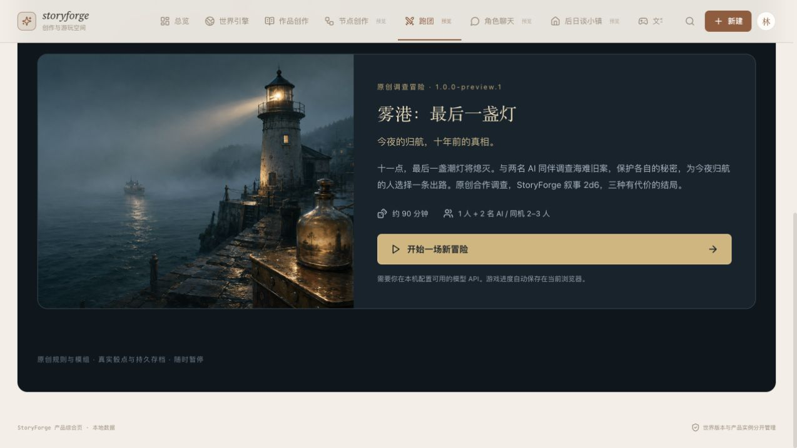
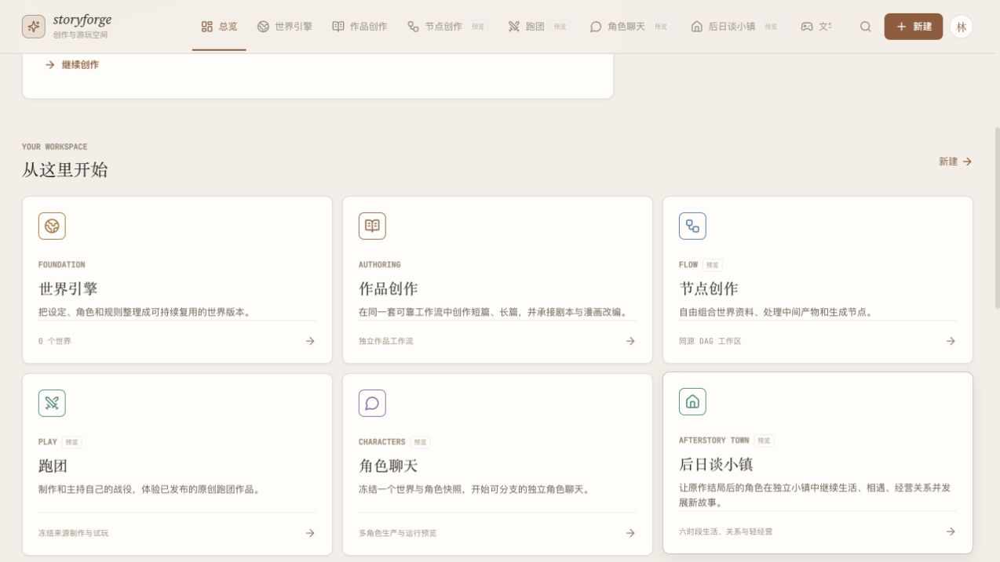
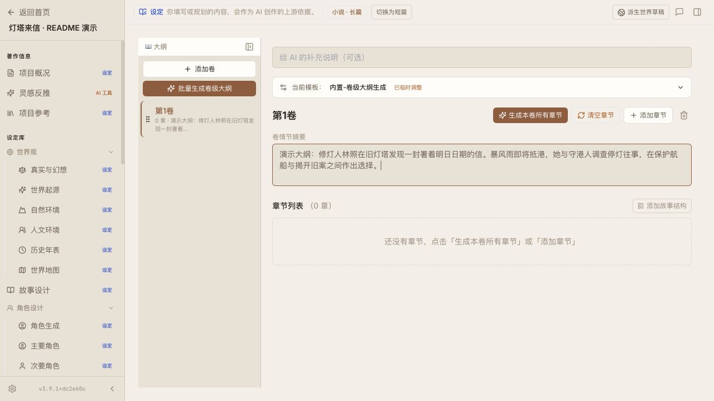
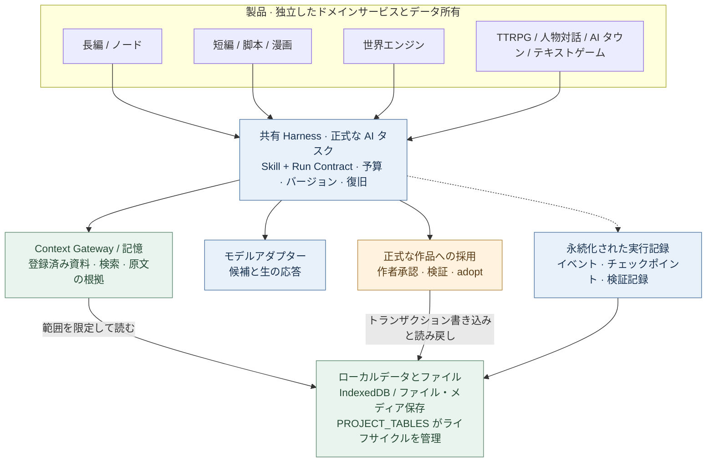
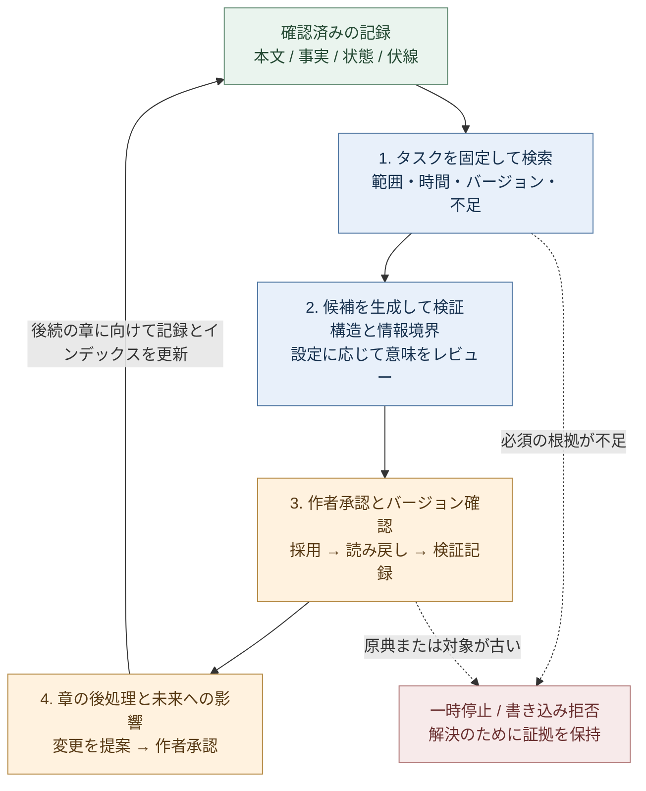

# StoryForge · 故事熔炉

**物語を書く。その世界に入る。**

<!-- readme-languages:start -->
[简体中文](./README.md) · [English](./README.en.md) · [Français](./README.fr.md) · [Deutsch](./README.de.md) · [Italiano](./README.it.md) · [Español](./README.es.md) · [Português](./README.pt.md) · [日本語](./README.ja.md) · [한국어](./README.ko.md)
<!-- readme-languages:end -->

**中国語のチュートリアル・コミュニティ：** [Bilibili 動画](https://www.bilibili.com/video/BV1q37j6QExh/) · [Zhihu 紹介記事](https://zhuanlan.zhihu.com/p/2038714210188780594) · **QQ グループ：1082374587** · [その他の連絡先](#community)

[創作を始める](#quick-start) · [Fog Harbor を体験する](#try-a-story) · [アーキテクチャを見る](#architecture)

StoryForge は、ローカルでのデータ保持を基本とする、オープンソースの AI 物語制作・体験ツールです。長編や短編の執筆、小説の脚本化・漫画化、再利用できる世界の構築、対話型の物語体験に取り組めます。制作方法は作者が選び、AI の提案は確認・承認してから作品に取り込みます。

> 2026 年 9 月 9 日の `main` に基づく説明です。長編、短編、脚本、漫画、世界エンジンには正式な入口があります。ノードモードと対話型製品はプレビューです。この README の翻訳は、画面やリンク先の資料すべてが日本語対応していることを意味しません。スクリーンショットや多くのガイドは中国語です。

<a id="try-a-story"></a>

## オリジナルの物語を体験する

### Fog Harbor: The Last Light（霧の港：最後の灯）— TRPG コミュニティプレビュー

2 人の AI の仲間と古い海難事故を調べ、キャラクターの秘密を守りながら、今夜の船の帰還を左右する選択をします。AI のゲーム進行役（KP）が、独自の **2d6 ルール**で **7 シーン・6 つの手がかり・3 つの結末**を進行します。



ゲームと同梱メディアはリポジトリに含まれています。利用するモデルの API を設定して開始してください。画像は実際のアドベンチャー入口です。

**プレイの流れ：** 行動を提案 → ルールで判定 → KP の応答を読む → 手がかりを確認 → 保存して続行。

<details>
<summary>始め方と現在の範囲</summary>

最新の `main` を起動し、**TTRPG**（`跑团`）を開いて制作欄の下にあるアドベンチャーを選びます。`/storyforge/play` からも開けます。モデルを設定し、キャラクターを選んでください。AI の仲間とのソロプレイ、または同じ端末を交代で使うプレイに対応します。進行状況、再開、チェックポイントはローカル保存です。公開オンラインマルチプレイは未提供で、共有端末上の秘密は端末所有者から保護されません。

[プレイヤーガイド](./examples/ttrpg/README.md) · [制作・実プレイの検証記録](./examples/ttrpg/fog-harbor/production-status.md)

</details>

## StoryForge の特徴

- **原稿までたどれる記憶。** 原文、事実、要約、検索によって序盤の伏線を探せます。章の後で確認した変化は、その後の執筆に引き継がれます。
- **作品の種類ごとに専用の制作工程。** 短編は分量と完成条件、脚本は改編の根拠、漫画はコマ・画像・文字組みをそれぞれ扱います。
- **最終判断は作者に。** 正式な創作では、AI 出力はいったん候補になります。Harness がリビジョン保護、実行記録、保存済み状態の復旧を支えます。

[クイックスタート](#quick-start) · [製品を選ぶ](#products) · [最初の執筆](#first-session) · [世界](#worlds) · [Harness](#architecture) · [プライバシー](#privacy) · [コミュニティ](#community)

<a id="quick-start"></a>

## クイックスタート

[Web アプリ](https://yuanbw.vercel.app/storyforge/)を開くか、ソースをローカルで実行します。基本的なローカル創作に StoryForge アカウントは不要です。AI は自分のプロバイダー認証情報を使い、API 料金は別途発生します。公開サイトは `main` より遅れる場合があります。過去の Release は固定されたバージョンです。

CI と同じ **Node.js 24** と npm を使います。

```bash
git clone https://github.com/yuanbw2025/storyforge.git
cd storyforge
npm ci
npm run dev
```

Vite が表示するアドレスの `/storyforge/` を開き、使用中はターミナルを動かしたままにしてください。ソース ZIP も展開後に同じ手順が必要です。デスクトップ用インストーラーではありません。

ホーム右上のモデル設定（`模型与本地设置`）でプロバイダーを選び、API Key、Base URL、利用可能なモデルを入力します。接続テスト後に小さな生成を試してください。接続成功だけでは品質、残高、コンテキスト容量は確認できません。ブラウザーの CORS エラーが出た場合は、設定欄のローカルプロキシ手順に従います。

<a id="products"></a>

## 目的から製品を選ぶ



| 目的 | 入口 | 得られるもの・現在の状態 |
|---|---|---|
| 長編小説を書く | 新規 → 長編小説 | 人物、構成、章、連続性、改稿。現行の技術的な制作フローは検証済み |
| 短い作品を完成させる | 新規 → 短編小説 | 設計、章カード、執筆、レビュー、固定版の公開。Markdown/TXT/JSON |
| 小説を脚本にする | 新規 → 小説から脚本 | 固定した原典、改編判断、構造化シーン、レビュー。Fountain/FDX/印刷 |
| 小説を漫画にする | 新規 → 小説から漫画 | ページ、コマ、画像参照、文字組み、公開版。PNG/WebP/CBZ/PDF |
| 世界を作る | 新規 → 世界エンジン | 意味内容、明示的な派生、固定バージョン、読み取り |
| 視覚的に工程を組む | ノードモード | プレビュー。長編と同じ制作ロジック・作品データを利用 |
| 遊ぶ・体験を制作する | TTRPG / キャラクター対話 / AI タウン / テキストゲーム | それぞれ独自の制作・実行ライフサイクルを持つプレビュー |

小説の執筆に世界エンジンは必須ではありません。作者は、確認済みの長編・短編から明示的に世界を派生させられます。脚本・漫画は独立した改編製品で、この世界への派生経路はありません。公開済みアドベンチャーは世界を先に作らずに遊べます。

<a id="first-session"></a>

## 最初の執筆セッション

1. **新規**（`新建`）→ **長編小説**（`长篇小说`）を選び、タイトルと紹介を入力します。
2. 創作意図、参考資料、執筆ルールを記録し、物語に必要な設定を加えます。
3. 対立と人物を考え、巻と章を構成します。手動で書くか、AI 候補を編集・承認します。
4. シーンと本文を作り、事実・状態・関係・伏線の変化を確認してから次へ進みます。
5. **データ管理**（`数据管理`）から本文と完全な JSON バックアップを出力します。



## 各製品が具体的に支えること

### 長編とノードモード

長編の作業環境は、資料、世界設定、人物と関係、筋書き、構成、章編集、伏線、事実、所持品、文体、プロンプトテンプレート、履歴を扱います。

記憶は **原文を根拠として保持**し、構造化した事実と状態、章・巻・全体の要約、検索インデックスを組み合わせます。Context Gateway はリソースを探してから必要な詳細を読み、実際に使った出典を記録します。派生要約・インデックスは原典のハッシュで確認し、欠落や古さがあれば原文に戻れます。作品の範囲と時間境界で検索を絞り込みます。

章の後処理は、事実、人物、関係、物品、時系列、伏線、筋書きの変更を候補として提示し、作者が確認します。影響分析は未来の計画を対象とし、確定済みの過去を黙って書き換えません。バージョン確認により、古い候補が最新の編集を上書きすることを防ぎます。

正式なノード操作は同じ Skills、データ、採用処理を再利用し、工程や中間成果物を細かく組み合わせられます。実験用ドラフトは正式な作品内容に採用できません。両モード間の完全な UI・ライフサイクル連携は引き続き検証中です。

[物語検索](./src/lib/context-gateway/narrative-retrieval.ts) · [章の後処理](./src/lib/ai/chapter-memory/run-chapter-memory.ts) · [長編・ノードの契約](./docs/products/LONGFORM-AND-NODE.md)

### 短編：完成までの条件が見える制作

専用工程は **中国語の文字数で 5,000〜25,000 字、3〜8 章**を対象に、ブリーフ、設計、章カード、執筆、レビュー、改稿、公開へ進みます。実際の分量、章構成、本文の欠落、未処理候補を確認します。レビュー指摘は章と根拠の文章に結び付き、原稿ハッシュに固定されるため、編集後は新しいレビューが必要です。改稿は対象章を指定します。重大な未解決事項は公開を止め、受理された版は変更不可で保存され、過去の版も残ります。

[制作と完成条件](./src/lib/short-novel/service.ts) · [専用の永続化 AI 実行](./src/lib/agent/run/short-novel-durable.ts)

### 脚本：改編判断を追える構造化シーン

選択した原典を固定し、事実と因果関係、改編判断、ビート、シーンカード、脚本シーンをつなぎます。出来事を削除・統合・変換した理由を確認できます。シーンは脚本ブロックの構造を表す **AST** を使い、コードが形式を検証して Fountain、FDX、印刷に出力します。

原典への忠実さとドラマ構成は別々にレビューします。修正はシーンと期待リビジョンを指定し、ロックされたシーンは先に解除が必要です。古い修正候補は拒否します。公開版は原典・判断・シーンを固定するため、その後の小説編集が公開脚本を自動変更することはありません。

[制作と修正](./src/lib/screenplay/production.ts) · [公開版](./src/lib/screenplay/release.ts) · [レンダラー](./src/lib/screenplay/renderers.ts)

### 漫画：画像と文字組みを別のレイヤーで扱う

まずビート、ページ、コマを設計し、その後に画像と文字組みを作ります。安定したページ・コマ ID と明示的な読む順序が、構図、行動、台詞、原典をつなぎます。視覚的な対象には人物・場所・小道具の識別情報を持たせ、画像候補には来歴と実際にプロバイダーへ送信した参照画像の証拠を残します。

**ローカルの SVG 文字組み**で、吹き出し、説明、効果音を画像の上に編集可能な形で配置します。台詞の修正だけでコマ画像を作り直す必要はありません。文字のはみ出し、重なり、危険な余白を確認しますが、絵の隠れ方は作者も点検します。絵コンテ版とビジュアル版には別々の完成条件があり、ビジュアル公開版は選択画像の Blob への強い参照を保持します。

**現行の制限：** 汎用 OpenAI 互換画像アダプターはテキストのみを送信し、参照画像・固定シード・インペインティングには対応しないと明示しています。プロンプトに参照名を書くことは、画像を送信した証拠にはなりません。画像制作には設定済みの画像サービス、または作者が用意した適切な素材と、人による選定・連続性の確認が必要です。

[制作](./src/lib/comic/production.ts) · [メディアの証拠](./src/lib/comic/media-service.ts) · [文字組み](./src/lib/comic/renderers.ts) · [品質チェック](./src/lib/comic/qa.ts)

これらの現行の技術的フローは `main` に実装されています。プロバイダー性能や内容の品質は継続評価中です。[能力の基準と制限](./docs/roadmap/CAPABILITY-BASELINE.md)を参照してください。

<a id="worlds"></a>

## 世界と対話型製品

世界を新規作成または明示的に派生させ、バージョンを固定した後、利用する製品の中で設定し、制作開始を指示します。世界エンジンが保持するのは **バージョン管理された意味内容**だけです。メディア、セーブデータ、個別の進行は各製品が所有します。小説の後の編集やプレイ結果が共有世界を自動で書き換えることはありません。

派生時に元作品、リビジョン、範囲、ハッシュを記録します。製品別アダプターが必須・任意・禁止リソースを宣言し、**SourcePlan** を固定します。`describe / search / read` による段階的な読み取りは、実行ごとの Context Manifest と、実際の参照をまとめた SourceManifest に残ります。作者がバージョン 2 を編集中でも、アドベンチャーはバージョン 1 を使い続けられます。

[世界リソースクライアント](./src/lib/context-gateway/world-release-client.ts) · [世界の契約](./docs/products/WORLD-ENGINE.md)

**以下の製品はすべてプレビューです。**

| 製品 | 実装済みの仕組み | 現在の制限 |
|---|---|---|
| [TTRPG / AI KP](./src/lib/ttrpg/information-boundary.ts) | コードによるルール・ダイス・効果処理、KP/プレイヤー/NPC の文脈分離、受信者別の秘密、イベント、チェックポイント | Fog Harbor は実モデルでの記録あり。公開オンラインマルチプレイは未提供 |
| [キャラクター対話](./src/lib/character-interaction/runtime.ts) | 固定プロフィール、話し方、場面目標、約束・秘密・対立の記憶、信頼・親密さ・警戒・尊重 | 長期の人物表現は評価中 |
| [Afterstory AI タウン](./src/lib/ai-town/runtime.ts) | 1 日 6 区分、場所と移動、知識、記憶、関係、軽い管理、オフライン時間の追いつき処理 | 14 日間のリプレイ検証あり。長期モデル挙動とテスト用以外のメディア品質は評価中 |
| [テキストアドベンチャー](./src/lib/adventure/runtime.ts) | 前提条件、所持品、資源、能力、クエスト、結果をコードで確認 | 完成体験には作品ごとの検証が必要 |
| [AVG](./src/lib/avg/runtime.ts) | 宣言的な演出指示、背景・人物・音声レイヤー、素材検証、舞台スナップショット | 音と映像を含む完全な提供は検証中 |
| [テキストオープンワールド](./src/lib/open-world/runtime.ts) | 地域、移動、資源、勢力、行動予定、時間経過による地域変化 | 制作全体と長期プレイは開発中 |

オンラインコミュニティや商用サービスは後の段階の計画です。

<a id="architecture"></a>

## 共有アーキテクチャと長期的な一貫性

**Harness はモデル呼び出しを囲む実行・検証システムです。** タスク契約、実際の入力、候補、バージョン、チェックポイント、結果を作品と関連付けます。各製品のドメインサービスとデータは独立しています。



矢印は依存関係やデータアクセスを表し、実行順序ではありません。長編・短編に世界エンジンは不要です。対話型の実行環境は各製品のコマンドと状態機械を使います。

### 章を越えて一貫性を支える流れ

**根拠を取得し、変更を確認し、次のタスクへ正しい版を渡す**循環を続けます。本文生成、記憶の整理、監査、将来計画はそれぞれこの循環の一部です。



正式な実行は記録とチェックポイントを保存します。章の後処理と未来の改稿は、それぞれ上限と独自のバージョン確認・承認を持つ別の実行です。循環は複数の執筆セッションにまたがります。

- 必須資料が足りなければ進行を止めます。マニフェストには範囲、ハッシュ、実際の読み取り、不足を記録し、作品・世界・時間境界で混入や先の情報の漏れを防ぎます。
- 採用時に入力と書き込み先のリビジョンを再確認します。古い候補は新しい本文を上書きできません。読み戻しと受領記録で保存後の状態を検証します。
- 明示的な一貫性監査は本文ハッシュに結び付き、本文が変われば古い監査証拠は無効になります。
- 復旧は保存済みの状態をバージョン確認付きで戻します。外部サービスの結果が不明なときに、無条件で再送することはありません。

例えば第 8 章で唯一の品物の所有者が確定した場合、第 80 章では原文と確認済み状態を検索できます。候補の承認待ち中に作者が所有者を変更すると、リビジョン確認が古い候補の直接採用を止めます。新しい章と記憶の変更が確認された後、次の章がそれを利用できます。

### 確認できる検証根拠

- [大規模テキスト検索と別世界・未来情報の分離](./tests/regression/R-PHASE4-long-form-scale-gate.test.ts)
- [必須資料不足時の停止と正確な編集対象](./tests/regression/R-CTXG7-gateway-execution.test.ts)
- [本文・上流設定変更後の古い候補の採用拒否](./tests/regression/R-HARNESS7-prose-generation-durable.test.ts)
- [モデルを再呼び出しせずに章の後処理候補を復旧](./tests/regression/R-HARNESS20-chapter-post-adoption-durable.test.ts)
- [本文変更による監査無効化と結果不明時の再送抑止](./tests/regression/R-MEMORY-CLOSE1-consistency-audit-durable.test.ts)
- [執筆済み履歴の保持と未来計画の無効化](./tests/regression/R-FUTURE1-continuous-evolution.test.ts)

[正式な本文実行](./src/lib/agent/run/prose-generation-durable.ts) · [検証の受領記録](./src/lib/agent/run/verification-receipt.ts) · [アーキテクチャ](./docs/ARCHITECTURE.md) · [Harness 標準](./docs/HARNESS-QUALITY-STANDARD.md)

**保証の範囲：** コードが検証するのはバージョン、範囲、構造、状態遷移、書き込み規則です。意味面のレビューは設定または作者の明示操作によります。含意、比喩、未登録の伏線、文学的な品質にはモデルと人の判断が必要です。**10 万・30 万・100 万文字**のテストは技術的挙動を示すもので、100 万語の小説の文学的一貫性を保証しません。復旧対象は保存済み状態です。補助・実験用入口には、それぞれ宣言された制限があります。

<a id="privacy"></a>

## モデル、保存、プライバシー

- 自分のクラウドプロバイダー、または Ollama・LM Studio などの互換ローカルサービスを利用できます。接続プリセットは、すべてのモデルが全製品で同じ品質になるという認証ではありません。
- クラウド生成では選択されたタスクの文脈を設定済みプロバイダーへ送ります。ローカル優先でも、すべての AI 呼び出しがオフラインになるわけではありません。
- 作品とプレイ保存はブラウザープロファイル・オリジンごとの IndexedDB に置かれます。ブラウザー、ホスト、ポートを変えてもデータは移りません。
- API キーは既定でブラウザーセッション中のみ保持します。「この端末に記憶」を明示的に選ぶと localStorage に保存します。
- 端末変更やブラウザーデータ削除の前に **完全な JSON バックアップ**を出力してください。Markdown/TXT は代わりになりません。メディアは製品・ワークスペースの出力経路を使います。
- ローカルフォルダーへのアクセスにはユーザー許可が必要です。[記憶ワークスペースガイド](./docs/MEMORY-WORKSPACE-GUIDE.md)を参照してください。
- 任意の GitHub Gist バックアップはプロジェクト全体の JSON を自分の非公開 Gist に送ります。エンドツーエンド暗号化ストレージではありません。

<a id="community"></a>

## コミュニティと貢献

[GitHub Issues](https://github.com/yuanbw2025/storyforge/issues) · [開発者サイト](https://yuanbw.vercel.app/) · [開発者の Zhihu プロフィール](https://www.zhihu.com/people/dan-ran-xing-yuan-59) · QQ グループ：**1082374587**

[Bilibili 動画](https://www.bilibili.com/video/BV1q37j6QExh/)と[Zhihu 紹介](https://zhuanlan.zhihu.com/p/2038714210188780594)は過去の中国語資料です。現在とメニューが異なる場合があります。不具合報告にはバージョン、ブラウザー・OS、再現手順、期待結果・実際の結果を添え、画像やログからキーと私的な原稿を除いてください。Star、作例、動画、翻訳、開発への参加を歓迎します。

技術構成は **React、TypeScript、Vite、Zustand、TipTap、Dexie** です。共有基盤は 3 つの登録簿で管理します。`CONTEXT_SOURCES` + `assembleContext()` が AI の読み取り、`FIELD_REGISTRY` + `AdoptionSchema` + `adopt()` が承認後の書き込み、`PROJECT_TABLES` がテーブルのライフサイクルを担当します。

```bash
npm run ci
npm run ci:e2e
```

貢献前に [AGENTS.md](./AGENTS.md)、[CONTRIBUTING.md](./CONTRIBUTING.md)、[共同作業フロー](./docs/COLLAB-WORKFLOW.md)、[プロジェクト憲章](./docs/PROJECT-MASTER-CHARTER.md)を確認してください。

## Star、支援、ライセンス

[](https://www.star-history.com/?repos=yuanbw2025%2Fstoryforge&type=date&legend=top-left)

支援は任意で、機能や将来の更新へのアクセス条件は変わりません。モデルの契約費用や保守に役立てます。[支援の詳細](./README.md#自愿赞助)。

コードは [MIT](./LICENSE) ライセンスです。オリジナル作品、モデル、第三者メディア、出力にはそれぞれの条件が適用されます。該当する場合は [TTRPG SRD ライセンス表記](./docs/ttrpg/licenses/SRD-5.2.1-CC-BY-4.0.md)も確認してください。
