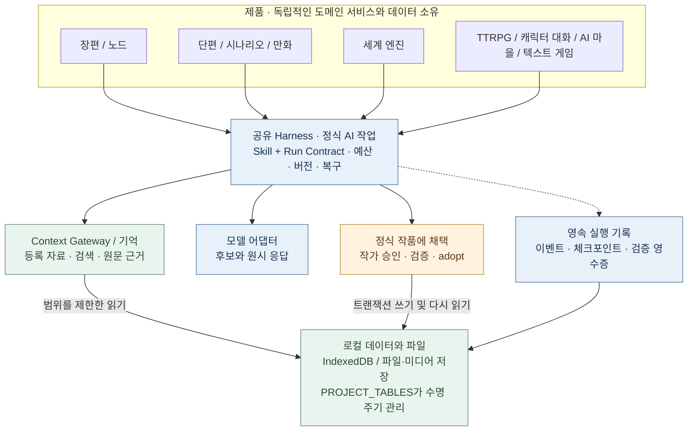
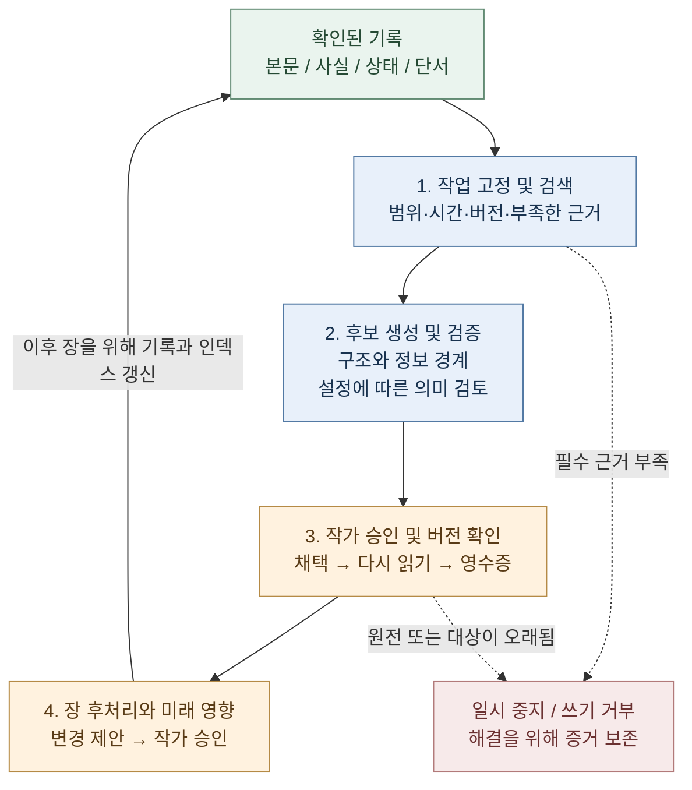

# StoryForge · 故事熔炉

**이야기를 쓰고, 그 세계로 들어가세요.**

<!-- readme-languages:start -->
[简体中文](./README.md) · [English](./README.en.md) · [Français](./README.fr.md) · [Deutsch](./README.de.md) · [Italiano](./README.it.md) · [Español](./README.es.md) · [Português](./README.pt.md) · [日本語](./README.ja.md) · [한국어](./README.ko.md)
<!-- readme-languages:end -->

[창작 시작하기](#quick-start) · [Fog Harbor 체험하기](#try-a-story) · [아키텍처 살펴보기](#architecture)

StoryForge는 데이터를 로컬에 보관하는 방식을 기본으로 하는 오픈 소스 AI 서사 창작·체험 도구입니다. 장편과 단편을 쓰고, 소설을 시나리오나 만화로 각색하고, 재사용할 세계를 만들고, 상호작용형 이야기를 탐색할 수 있습니다. 작업 방식은 작가가 선택하며, AI 제안은 작가의 확인과 승인을 거쳐 작품에 반영됩니다.

> 2026년 9월 9일의 `main`을 기준으로 확인했습니다. 장편, 단편, 시나리오, 만화, 세계 엔진에는 정식 진입점이 있습니다. 노드 모드와 상호작용형 제품은 미리보기입니다. 이 README의 번역이 전체 화면과 연결 문서의 한국어 지원을 뜻하지는 않습니다. 스크린샷과 많은 안내서는 중국어입니다.

<a id="try-a-story"></a>

## 오리지널 이야기를 체험하세요

### Fog Harbor: The Last Light(안개 항구: 마지막 등불) — TRPG 커뮤니티 미리보기

AI 동료 두 명과 오래된 해난 사고를 조사하고, 캐릭터의 비밀을 지키며, 오늘 밤 배들이 어떻게 돌아올지 결정하세요. AI 진행자(KP)가 독자적인 **2d6 규칙**으로 **장면 7개, 단서 6개, 결말 3개**를 진행합니다.


게임과 함께 제공되는 미디어는 저장소에 포함되어 있습니다. 자신의 모델 API를 설정하고 시작하세요. 이미지는 실제 모험 진입 화면입니다.

**플레이 흐름:** 행동 제안 → 규칙 판정 → KP 응답 읽기 → 단서 확인 → 저장하고 계속하기.

<details>
<summary>시작 방법과 현재 범위</summary>

최신 `main`을 실행하고 **TTRPG**(`跑团`)에서 제작 영역 아래의 모험을 선택하거나 `/storyforge/play`로 접속하세요. 모델을 설정하고 캐릭터를 고릅니다. AI 동료와 혼자 플레이하거나 같은 기기를 번갈아 사용할 수 있습니다. 진행 상황, 재개, 체크포인트는 로컬에 저장됩니다. 공개 온라인 멀티플레이는 배포되지 않았으며, 공유 기기의 비밀은 기기 소유자로부터 보호되지 않습니다.

[플레이어 안내](./examples/ttrpg/README.md) · [제작 및 실제 플레이 검증 기록](./examples/ttrpg/fog-harbor/production-status.md)

</details>

## StoryForge의 장점

- **원고까지 추적할 수 있는 기억.** 원문, 사실, 요약, 검색으로 초반 단서를 찾고, 장을 마친 뒤 확인한 변화를 이후 집필에 반영합니다.
- **제품마다 전용 제작 과정.** 단편은 분량과 완성 조건, 시나리오는 각색 근거, 만화는 컷·이미지·레터링을 각각 관리합니다.
- **최종 결정권은 작가에게.** 정식 창작의 AI 출력은 먼저 후보가 됩니다. Harness가 리비전 보호, 실행 증거, 저장된 상태의 복구를 지원합니다.

[빠른 시작](#quick-start) · [제품 선택](#products) · [첫 집필](#first-session) · [세계](#worlds) · [Harness](#architecture) · [개인정보](#privacy) · [커뮤니티](#community)

<a id="quick-start"></a>

## 빠른 시작

[웹 앱](https://yuanbw.vercel.app/storyforge/)을 열거나 소스를 로컬에서 실행하세요. 기본적인 로컬 창작에는 StoryForge 계정이 필요하지 않습니다. AI는 자신의 제공업체 인증 정보를 사용하며 API 요금은 별도입니다. 웹 사이트가 `main`보다 늦게 업데이트될 수 있고, 과거 Release는 고정된 버전입니다.

CI와 같은 **Node.js 24** 및 npm을 사용합니다.

```bash
git clone https://github.com/yuanbw2025/storyforge.git
cd storyforge
npm ci
npm run dev
```

Vite가 표시하는 주소의 `/storyforge/` 경로를 열고, 사용하는 동안 터미널을 실행 상태로 두세요. 소스 ZIP도 압축을 푼 뒤 같은 단계가 필요하며, 데스크톱 설치 프로그램이 아닙니다.

홈 오른쪽 위 모델 설정(`模型与本地设置`)에서 제공업체를 선택하고 API Key, Base URL, 사용할 수 있는 모델을 입력하세요. 연결 테스트와 작은 생성부터 시도하세요. 연결 성공만으로 품질, 잔액, 컨텍스트 용량을 확인할 수는 없습니다. 브라우저 CORS 오류가 나면 설정 패널의 로컬 프록시 안내를 따르세요.

<a id="products"></a>

## 목적에 맞는 시작점 선택


| 목적 | 진입점 | 결과와 현재 상태 |
|---|---|---|
| 장편 소설 쓰기 | 새로 만들기 → 장편 소설 | 인물, 구성, 장, 연속성, 개정. 현재 기술적 제작 흐름 검증 완료 |
| 짧은 작품 완성하기 | 새로 만들기 → 단편 소설 | 설계, 장 카드, 집필, 검토, 불변 판본. Markdown/TXT/JSON |
| 소설을 시나리오로 각색 | 새로 만들기 → 소설에서 시나리오 | 고정 원전, 각색 판단, 구조화 장면, 검토. Fountain/FDX/인쇄 |
| 소설을 만화로 각색 | 새로 만들기 → 소설에서 만화 | 페이지, 컷, 시각 참조, 레터링, 판본. PNG/WebP/CBZ/PDF |
| 세계 만들기 | 새로 만들기 → 세계 엔진 | 의미 콘텐츠, 명시적 파생, 불변 버전, 읽기 |
| 시각적으로 과정 구성 | 노드 모드 | 미리보기. 장편과 같은 제작 로직 및 작품 데이터 사용 |
| 플레이하거나 체험 제작 | TTRPG / 캐릭터 대화 / AI 마을 / 텍스트 게임 | 독자적인 제작·실행 수명 주기를 가진 미리보기 |

소설 집필에 세계 엔진은 필수가 아닙니다. 작가는 확정된 장편·단편 내용에서 명시적으로 세계를 파생할 수 있습니다. 시나리오와 만화는 독립적인 각색 제품으로, 이 세계 파생 경로를 제공하지 않습니다. 공개된 모험은 세계를 먼저 만들지 않아도 플레이할 수 있습니다.

<a id="first-session"></a>

## 첫 집필 세션

1. **새로 만들기**(`新建`) → **장편 소설**(`长篇小说`)에서 제목과 소개를 입력합니다.
2. 창작 의도, 참고 자료, 집필 규칙을 기록하고 필요한 설정을 채웁니다.
3. 갈등과 인물을 계획한 뒤 권과 장을 구성합니다. 직접 쓰거나 AI 후보를 편집하고 승인합니다.
4. 장면과 본문을 작성하고, 사실·상태·관계·복선의 변화를 확인한 뒤 이어갑니다.
5. **데이터 관리**(`数据管理`)에서 본문과 전체 JSON 백업을 내보냅니다.


## 각 제품이 작품에 제공하는 구체적인 지원

### 장편과 노드 모드

장편 작업 공간에는 자료, 세계 설정, 인물과 관계, 이야기 줄기, 구성, 장 편집, 복선, 사실, 소지품, 문체, 프롬프트 템플릿, 변경 이력이 있습니다.

기억은 **원문을 근거로 유지**하면서 구조화한 사실과 상태, 장·권·전체 요약, 검색 인덱스를 함께 사용합니다. Context Gateway는 먼저 자료를 찾고 필요한 세부 내용을 읽으며 실제 사용한 출처를 기록합니다. 파생 요약과 인덱스는 원전 해시로 확인하고, 없거나 오래되면 원문으로 돌아갈 수 있습니다. 작품 범위와 시간 경계로 검색을 제한합니다.

장 후처리는 사실, 인물, 관계, 물건, 연표, 복선, 이야기 줄기의 변화를 후보로 제안하고 작가가 확인합니다. 영향 분석은 향후 계획을 대상으로 하며 확정된 과거를 조용히 다시 쓰지 않습니다. 버전 검사로 오래된 후보가 최신 편집을 덮어쓰지 못하게 합니다.

정식 노드 작업은 같은 Skills, 데이터, 채택 과정을 재사용하여 단계와 중간 결과물을 세밀하게 조합합니다. 실험용 초안은 정식 작품 내용으로 채택할 수 없습니다. 두 모드의 완전한 UI·수명 주기 연동은 계속 검증 중입니다.

[서사 검색](./src/lib/context-gateway/narrative-retrieval.ts) · [장 후처리](./src/lib/ai/chapter-memory/run-chapter-memory.ts) · [장편·노드 계약](./docs/products/LONGFORM-AND-NODE.md)

### 단편: 완성 조건이 보이는 제작 과정

전용 과정은 **중국어 글자 수 기준 5,000~25,000자, 3~8장**을 대상으로 브리프, 설계, 장 카드, 집필, 검토, 재작성, 출판으로 이어집니다. 실제 분량, 장 구조, 빠진 본문, 대기 중인 후보를 검사합니다. 검토 지적은 장과 근거 문장에 연결되며 원고 해시에 묶이므로 수정 후에는 최신 검토가 필요합니다. 재작성은 특정 장을 대상으로 합니다. 진행을 막는 미해결 문제는 출판을 중단시키며, 승인된 판본은 변경 불가로 저장되고 이전 판본도 유지됩니다.

[제작과 완성 조건](./src/lib/short-novel/service.ts) · [전용 영속 AI 실행](./src/lib/agent/run/short-novel-durable.ts)

### 시나리오: 각색 판단을 추적하는 구조화 장면

선택한 원전을 고정하고 사실과 인과관계, 각색 판단, 비트, 장면 카드, 시나리오 장면을 연결합니다. 사건을 삭제·통합·변형한 이유를 확인할 수 있습니다. 장면은 시나리오 블록의 구조를 표현하는 **AST**를 사용하며, 코드가 형식을 검사하고 Fountain, FDX, 인쇄로 출력합니다.

원전에 대한 충실도와 극적 구조는 따로 검토합니다. 수정은 대상 장면과 기대 리비전을 지정하고, 잠긴 장면은 먼저 해제해야 하며 오래된 수정 후보는 차단합니다. 공개 판본은 원전·판단·장면을 고정하므로 이후 소설 편집이 공개 시나리오를 자동으로 바꾸지 않습니다.

[제작과 수정](./src/lib/screenplay/production.ts) · [판본](./src/lib/screenplay/release.ts) · [렌더러](./src/lib/screenplay/renderers.ts)

### 만화: 이미지와 레터링을 별도 레이어로 관리

먼저 비트, 페이지, 컷을 설계한 다음 이미지와 레터링을 만듭니다. 안정적인 페이지·컷 ID와 명시적인 읽기 순서가 구도, 행동, 대사, 원전을 연결합니다. 시각 대상에는 인물·장소·소품의 식별 정보를 부여하고, 이미지 후보에는 출처와 실제 제공업체에 전송한 참조 이미지의 증거를 기록합니다.

**로컬 SVG 레터링**은 말풍선, 설명, 효과음을 이미지 위에 편집 가능한 형태로 배치합니다. 대사 수정 때문에 컷 이미지를 다시 생성할 필요가 없습니다. 글자 넘침, 겹침, 위험한 여백을 검사하지만 그림이 가려지는 부분은 작가도 확인해야 합니다. 스토리보드 판본과 시각 판본은 완성 조건이 다르고, 시각 공개 판본은 선택한 이미지 Blob에 강한 참조를 유지합니다.

**현재 제한:** 범용 OpenAI 호환 이미지 어댑터는 텍스트만 전송하며 참조 이미지, 고정 시드, 인페인팅을 지원하지 않는다고 명시합니다. 프롬프트에서 참조를 언급하는 것은 이미지를 보낸 증거가 아닙니다. 시각 제작에는 설정된 이미지 서비스 또는 작가의 적절한 자료와 사람의 선택·연속성 검토가 필요합니다.

[제작](./src/lib/comic/production.ts) · [미디어 증거](./src/lib/comic/media-service.ts) · [레터링](./src/lib/comic/renderers.ts) · [품질 검사](./src/lib/comic/qa.ts)

현재 기술적 과정은 `main`에 구현되어 있습니다. 제공업체 성능과 콘텐츠 품질은 계속 평가 중입니다. [능력 기준과 한계](./docs/roadmap/CAPABILITY-BASELINE.md)를 참고하세요.

<a id="worlds"></a>

## 세계와 상호작용형 제품

세계를 새로 만들거나 명시적으로 파생하고 버전을 고정한 뒤, 선택한 제품 안에서 설정하고 제작 시작을 지시합니다. 세계 엔진은 **버전 관리되는 의미 콘텐츠**만 보관합니다. 미디어, 저장 데이터, 개별 진행은 각 제품이 소유합니다. 이후 소설 수정이나 플레이 결과가 공유 세계를 자동으로 다시 쓰지 않습니다.

파생은 원본 작품, 리비전, 범위, 해시를 기록합니다. 제품별 어댑터가 필수·선택·금지 자료를 선언하고 **SourcePlan**을 고정합니다. `describe / search / read`의 단계적 읽기는 실행별 Context Manifest와 실제 참조를 모은 최종 SourceManifest로 남습니다. 작가가 버전 2를 편집하는 동안 모험은 버전 1을 계속 사용할 수 있습니다.

[세계 자료 클라이언트](./src/lib/context-gateway/world-release-client.ts) · [세계 계약](./docs/products/WORLD-ENGINE.md)

**다음 제품은 모두 미리보기입니다.**

| 제품 | 구현된 방식 | 현재 한계 |
|---|---|---|
| [TTRPG / AI KP](./src/lib/ttrpg/information-boundary.ts) | 코드로 규칙·주사위·효과 처리, KP/플레이어/NPC 맥락 분리, 수신자별 비밀, 이벤트와 체크포인트 | Fog Harbor의 실제 모델 검증 기록 있음. 공개 온라인 멀티플레이 미제공 |
| [캐릭터 대화](./src/lib/character-interaction/runtime.ts) | 고정 프로필과 말투, 장면 목표, 약속·비밀·갈등의 기억, 신뢰·친밀감·경계·존중 | 장기적인 캐릭터 품질 평가 중 |
| [Afterstory AI 마을](./src/lib/ai-town/runtime.ts) | 하루 6개 시간대, 장소와 이동, 지식, 기억, 관계, 가벼운 관리, 오프라인 시간 보정 | 14일 리플레이 검증 있음. 장기 모델 동작과 테스트용이 아닌 미디어 품질 평가 중 |
| [텍스트 어드벤처](./src/lib/adventure/runtime.ts) | 전제 조건, 소지품, 자원, 능력, 퀘스트, 결과를 코드로 확인 | 완성된 체험에는 작품별 검증 필요 |
| [AVG](./src/lib/avg/runtime.ts) | 선언형 연출 지시, 배경·인물·음향 레이어, 자료 검사, 무대 스냅샷 | 완전한 시청각 제공은 검증 중 |
| [텍스트 오픈 월드](./src/lib/open-world/runtime.ts) | 지역, 여행, 자원, 세력, 행동 일정, 시간에 따른 지역 변화 | 전체 제작과 장기 플레이 개발 중 |

온라인 커뮤니티와 상용 서비스는 이후 단계의 계획입니다.

<a id="architecture"></a>

## 공유 아키텍처와 장기 일관성

**Harness는 모델 호출을 둘러싼 실행·검증 시스템입니다.** 작업 계약, 실제 입력, 후보, 버전, 체크포인트, 결과를 작품과 연결합니다. 각 제품의 도메인 서비스와 데이터는 독립적입니다.



화살표는 의존 관계나 데이터 접근을 나타내며 실행 순서가 아닙니다. 장편·단편에는 세계 엔진이 필요하지 않습니다. 상호작용형 실행 환경은 제품 고유의 명령과 상태 머신을 사용합니다.

### 장을 넘어 일관성을 유지하는 과정

**근거를 찾고, 변경을 확인하고, 다음 작업에 올바른 버전을 전달하는** 순환을 이어갑니다. 본문 생성, 기억 정리, 감사, 향후 계획이 각각 이 순환에 기여합니다.



정식 실행은 기록과 체크포인트를 저장합니다. 장 후처리와 향후 개정은 각각 실행 한도, 버전 검사, 승인을 갖는 별도 실행입니다. 순환은 여러 집필 세션에 걸칠 수 있습니다.

- 필수 자료가 없으면 진행을 멈춥니다. 매니페스트는 범위, 해시, 실제 읽기, 부족한 근거를 기록하며 작품·세계·시간 경계로 혼입과 이른 정보 노출을 막습니다.
- 채택 시 입력과 쓰기 대상의 리비전을 다시 확인합니다. 오래된 후보는 최신 본문을 덮어쓸 수 없습니다. 다시 읽기와 검증 영수증으로 저장 상태를 확인합니다.
- 명시적 일관성 감사는 본문 해시에 연결됩니다. 본문이 바뀌면 이전 감사 증거는 무효가 됩니다.
- 복구는 저장된 상태를 버전 확인과 함께 되돌립니다. 외부 서비스의 결과가 불명확할 때 무조건 재전송하지 않습니다.

예를 들어 8장에서 유일한 물건의 소유자가 확정되면, 80장에서 원문과 확인된 상태를 검색할 수 있습니다. 후보 승인 대기 중 작가가 소유자를 바꾸면 리비전 검사가 오래된 후보의 직접 채택을 막습니다. 새 장과 기억 변경이 확인된 후에는 다음 장에서 이를 사용할 수 있습니다.

### 직접 확인할 수 있는 검증 근거

- [대규모 텍스트 검색과 다른 세계·미래 정보 분리](./tests/regression/R-PHASE4-long-form-scale-gate.test.ts)
- [필수 근거 부족 시 중단 및 정확한 편집 대상](./tests/regression/R-CTXG7-gateway-execution.test.ts)
- [본문·상위 설정 변경 후 오래된 후보 채택 거부](./tests/regression/R-HARNESS7-prose-generation-durable.test.ts)
- [모델을 다시 호출하지 않고 장 후처리 후보 복구](./tests/regression/R-HARNESS20-chapter-post-adoption-durable.test.ts)
- [본문 변경 시 감사 무효화 및 결과 불명 시 재전송 억제](./tests/regression/R-MEMORY-CLOSE1-consistency-audit-durable.test.ts)
- [작성된 과거 보존 및 미래 계획 무효화](./tests/regression/R-FUTURE1-continuous-evolution.test.ts)

[정식 본문 실행](./src/lib/agent/run/prose-generation-durable.ts) · [검증 영수증](./src/lib/agent/run/verification-receipt.ts) · [아키텍처](./docs/ARCHITECTURE.md) · [Harness 표준](./docs/HARNESS-QUALITY-STANDARD.md)

**보장 범위:** 코드는 버전, 범위, 구조, 상태 전이, 쓰기 규칙을 검증합니다. 의미 검토는 설정이나 작가의 명시적 작업에 따릅니다. 함의, 비유, 등록되지 않은 단서, 문학적 품질에는 모델과 사람의 판단이 필요합니다. **10만·30만·100만 글자** 테스트는 기술적 동작을 보여 주며, 100만 단어 소설의 문학적 일관성을 보장하지 않습니다. 복구 대상은 저장된 상태입니다. 보조·실험용 진입점에는 각자 선언된 한계가 적용됩니다.

<a id="privacy"></a>

## 모델, 저장, 개인정보

- 자신의 클라우드 제공업체나 Ollama·LM Studio 같은 호환 로컬 서비스를 사용할 수 있습니다. 연결 프리셋이 모든 모델의 모든 제품에 대한 품질을 인증하는 것은 아닙니다.
- 클라우드 생성은 선택된 작업 맥락을 설정한 제공업체에 전송합니다. 로컬 우선이라고 모든 AI 호출이 오프라인인 것은 아닙니다.
- 작품과 플레이 저장은 브라우저 프로필·오리진별 IndexedDB에 보관됩니다. 브라우저, 호스트, 포트를 바꿔도 데이터가 이동하지 않습니다.
- API 키는 기본적으로 브라우저 세션 동안만 유지합니다. 이 기기에 기억하기를 명시적으로 선택하면 localStorage에 저장합니다.
- 기기를 바꾸거나 브라우저 데이터를 지우기 전에 **전체 JSON 백업**을 내보내세요. Markdown/TXT는 이를 대신하지 않습니다. 미디어는 제품·작업 공간의 내보내기 경로를 사용하세요.
- 로컬 폴더 접근에는 사용자 허용이 필요합니다. [기억 작업 공간 안내](./docs/MEMORY-WORKSPACE-GUIDE.md)를 참고하세요.
- 선택 기능인 GitHub Gist 백업은 프로젝트 전체 JSON을 자신의 비공개 Gist로 전송합니다. 종단 간 암호화 저장소는 아닙니다.

<a id="community"></a>

## 커뮤니티와 기여

[GitHub Issues](https://github.com/yuanbw2025/storyforge/issues) · [개발자 사이트](https://yuanbw.vercel.app/) · QQ 그룹: **1082374587**

[Bilibili 동영상](https://www.bilibili.com/video/BV1q37j6QExh/)과 [Zhihu 소개](https://zhuanlan.zhihu.com/p/2038714210188780594)는 과거의 중국어 자료로 현재 메뉴와 다를 수 있습니다. 오류 보고에는 버전, 브라우저·OS, 재현 단계, 예상 결과와 실제 결과를 적고 이미지·로그에서 키와 비공개 원고를 제거하세요. Star, 예제, 영상, 번역, 개발 기여를 환영합니다.

기술 구성은 **React, TypeScript, Vite, Zustand, TipTap, Dexie**입니다. 공유 기반은 세 레지스트리로 관리합니다. `CONTEXT_SOURCES` + `assembleContext()`는 AI 읽기, `FIELD_REGISTRY` + `AdoptionSchema` + `adopt()`는 승인 후 쓰기, `PROJECT_TABLES`는 테이블 수명 주기를 담당합니다.

```bash
npm run ci
npm run ci:e2e
```

기여 전에 [AGENTS.md](./AGENTS.md), [CONTRIBUTING.md](./CONTRIBUTING.md), [협업 과정](./docs/COLLAB-WORKFLOW.md), [프로젝트 헌장](./docs/PROJECT-MASTER-CHARTER.md)을 확인하세요.

## Star, 후원, 라이선스

[](https://www.star-history.com/?repos=yuanbw2025%2Fstoryforge&type=date&legend=top-left)

후원은 자발적이며 기능이나 향후 업데이트 접근 조건을 바꾸지 않습니다. 모델 구독과 유지보수 비용에 도움이 됩니다. [후원 안내](./README.md#自愿赞助).

코드는 [MIT](./LICENSE) 라이선스입니다. 원작, 모델, 제3자 미디어, 출력물에는 각자의 조건이 적용됩니다. 해당하는 경우 [TTRPG SRD 라이선스 고지](./docs/ttrpg/licenses/SRD-5.2.1-CC-BY-4.0.md)도 확인하세요.
