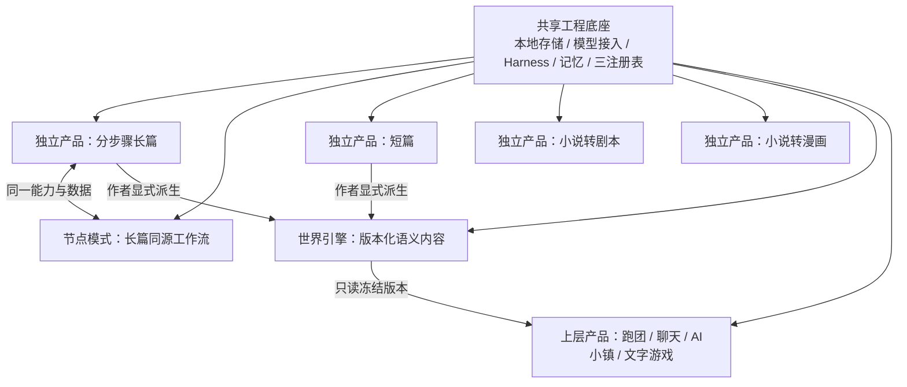

# StoryForge · 故事熔炉

StoryForge 是一个开源、本地优先的 AI 叙事创作与叙事体验项目。当前最重要、用户实际使用最多的是独立的分步骤长篇创作；项目同时在建设同源节点模式、短篇、小说转剧本、小说转漫画、可版本化世界引擎，以及基于冻结世界版本的跑团、角色聊天和文字游戏。

项目不把这些功能都塞进“世界引擎”：

- 分步骤长篇、短篇、剧本和漫画是可独立成立的创作产品；长篇和短篇可由作者显式一键派生世界，剧本和漫画当前不提供该路径；
- 节点模式是同一长篇生产链更自由、更细粒度、更可视和可组合的表达；
- 世界引擎只保存语义内容、编号、版本和可查询出口，不保存上层媒资或运行状态；
- 跑团、聊天和文字游戏拥有自己的生产、媒资、发布、运行和私域演化；运行结果不会自动回写共享世界。

世界衍生产品统一经过“封存世界版本 → 用户在具体产品内引用、配置并明确开始 → 产品自主生产、发布、运行和私域演化”。统一的是版本化资源协议与治理，不是让所有产品共用相同表单、数据包或 Agent 流程。

完整产品边界见 [项目总纲](./docs/PROJECT-MASTER-CHARTER.md)。

## 当前状态

StoryForge 的工程底座已经很深，但“模块存在”不等于“产品完成”。当前诚实状态如下：

| 领域 | 状态 | 说明 |
|---|---|---|
| 分步骤长篇 | Phase 5 工程主链已完成 | 世界观、故事、角色、主支线、大纲、细纲、正文、章后/未来演化、长程记忆和 10万/30万/100万字符工程规模门已有验收；真实作者长期文学质量继续观察，但不重新列为功能缺口 |
| 节点模式 | 部分实现 | 有 DAG、节点工作区和运行/生命周期基础；尚未完整证明与全部分步骤能力同源互操作 |
| 短篇 | 部分实现 | 有独立 profile、规模和结构基础；完整轻量产品体验仍需收口 |
| 小说转剧本 | 部分实现 | 有 source/brief/plan/scene 与工作台基础；完整长文改编、审校和导出尚待验收 |
| 小说转漫画 | 部分实现 | 有 page/panel/visual/media 数据基础；真实生图、一致性、排版和成品闭环未完成 |
| 世界引擎 | 部分实现 | 有世界编号、投影、完整度、release/分享基础；中立版本化资源协议和独立作品边界需纠正 |
| 跑团、角色聊天、文字游戏 | 多个部分实现 | 生产、运行、保存和测试设施很多，但仍按完整垂直产品逐一验收 |
| 社区、平台、商业化 | 实验/后置 | 现有相关代码必须门控；当前优先完善核心功能 |

逐项证据和缺口见 [能力基线](./docs/roadmap/CAPABILITY-BASELINE.md) 与
[架构治理对齐审计](./docs/audits/PROJECT-CHARTER-ALIGNMENT-AUDIT-20260826.md)。

## 产品全景



## 分步骤长篇

分步骤长篇不依赖世界引擎，是完整创作产品。目标流程包含：

```text
项目与创作意图
→ 世界观 / 故事 / 角色
→ 主线与支线
→ 全书 / 卷 / 章大纲
→ 场景细纲
→ 正文生成、续写、扩写、重写、润色和人工编辑
→ 事实、关系、时间线、伏笔、状态和未来影响持续演化
```

模型结果先成为候选，作者确认后才进入正式作品。刷新恢复、stale 阻断、Context Gateway、原文回查和持久化 run 共同服务长篇一致性。Phase 5 已完成分步骤主链、真实 API 纵切面以及 10万/30万/100万字符工程规模门，因此可以声明具备理论工程扩展基础；真实百万字作者项目与长期文学一致性仍作为持续质量研究诚实记录，不代表功能主体未完成。

## Agent + Harness

正式 AI 路径遵循：

```text
产品入口 / Skill
→ Run Contract
→ 注册上下文与渐进式披露
→ 模型 / 只读工具
→ 原始输出 + CreativeArtifact 候选
→ schema / 确定性验证 / 有界修复
→ 作者预览、编辑、采纳或拒绝
→ adopt() + post-state + terminal receipt
```

三个单一事实源负责防止同类漏接反复出现：

1. `CONTEXT_SOURCES` + `assembleContext()`：AI 读什么；
2. `FIELD_REGISTRY` + `AdoptionSchema` + `adopt()`：AI 写什么；
3. `PROJECT_TABLES`：表的导出、导入、删除、迁移、作用域和引用重映射。

Harness 保障权限、预算、恢复、stale 和证据，不承诺任何模型每次都能生成完美文学内容。

## 数据与隐私

- 核心项目和手稿保存在浏览器 IndexedDB；可选本地文件工作区用于内容和记忆文件。
- API Key 由用户配置；不要把 Key 提交到 Git、日志或公开截图。
- AI 请求会把当前任务所需上下文发送给用户选择的模型服务商，请按服务商隐私条款选择。
- 导出/备份、迁移和删除受 `PROJECT_TABLES` 生命周期治理；重要项目仍建议定期导出备份。
- 世界封存版本与上层运行实例隔离；上层运行不自动改写世界。

## 本地运行

要求：Node.js 20+ 与 npm。

```bash
git clone https://github.com/aloneonez/storyforge.git
cd storyforge
npm install
npm run dev
```

默认开发地址由 Vite 输出。打开设置页配置模型服务和 API Key；连接测试只证明端点可访问，正式生成仍会校验模型、任务协议、错误和上下文窗口。

生产构建：

```bash
npm run build
npm run preview
```

## 开发与验证

```bash
npm run check:architecture
npm run check:required-tables
npm run check:ai-manual
npx tsc --noEmit
npm run test
npm run build
```

完整交付运行：

```bash
npm run ci
npm run ci:e2e   # 涉及真实 UI/恢复/跨产品纵切面时
```

贡献前请读 [AGENTS.md](./AGENTS.md)、[开发宪法](./CLAUDE.md) 和
[贡献指南](./CONTRIBUTING.md)。`main` 没有 staging，不能直接推送。

## 文档入口

| 文档 | 用途 |
|---|---|
| [项目总纲](./docs/PROJECT-MASTER-CHARTER.md) | 项目全貌、产品关系和长期方向 |
| [文档权威](./docs/DOCUMENT-AUTHORITY.md) | 现行文档白名单和 WPS 历史归档 |
| [架构总览](./docs/ARCHITECTURE.md) | 当前代码、数据和执行架构 |
| [数据治理](./docs/DATA-GOVERNANCE.md) | 三注册表、owner、版本与生命周期 |
| [Harness 标准](./docs/HARNESS-QUALITY-STANDARD.md) | Agent、上下文、候选、恢复和长程标准 |
| [工程质量标准](./docs/ENGINEERING-QUALITY-STANDARD.md) | 测试、数据、安全、CI/E2E 与发布门 |
| [产品契约](./docs/products/README.md) | 长篇/节点、独立创作、世界引擎和上层产品 |
| [路线图](./docs/roadmap/README.md) | 按总纲依赖排序的当前施工顺序 |
| [能力基线](./docs/roadmap/CAPABILITY-BASELINE.md) | implemented / partial / missing / experimental |
| [AI 行为清单](./docs/AI-FUNCTIONS-MANUAL.generated.md) | 由代码生成的正式 AI 行为事实 |

旧 Blueprint、施工卡、评测流水和路演材料已从主干文档库移除，完整清理前快照保存在 WPS；链接和哈希见文档权威索引。

## 许可

代码依据仓库 [LICENSE](./LICENSE) 开源。使用第三方模型、素材、规则或输出时，还需遵守对应服务与内容许可。TTRPG SRD 引用见
[`docs/ttrpg/licenses/SRD-5.2.1-CC-BY-4.0.md`](./docs/ttrpg/licenses/SRD-5.2.1-CC-BY-4.0.md)。

## 支持项目

如果 StoryForge 对你的创作有帮助，可以通过 issue、测试、文档、代码贡献或传播项目参与建设。
