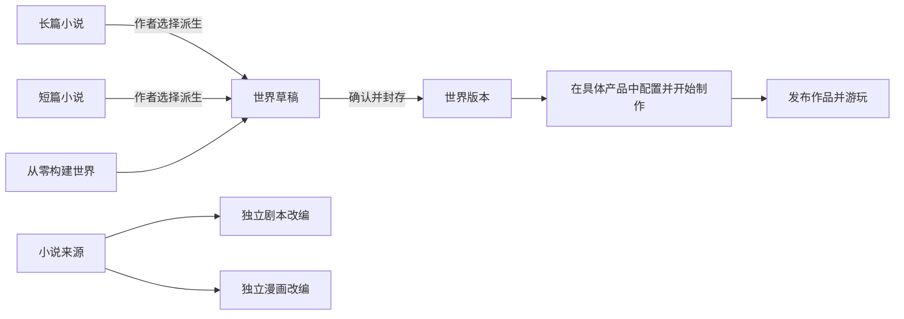

<p align="center">
  
</p>

<h1 align="center">StoryForge · 故事熔炉</h1>

<p align="center"><strong>让想法成为作品，让故事拥有更长的生命。</strong></p>
<p align="center">开源、本地优先的 AI 叙事创作与体验工具。从长短篇小说、剧本和漫画创作，到世界构建、角色互动与可游玩的故事。</p>

<p align="center">
  <a href="https://yuanbw.vercel.app/storyforge/">在线打开</a> ·
  <a href="#快速开始">本地运行</a> ·
  <a href="#先体验一个故事">原创跑团试玩</a> ·
  <a href="https://www.bilibili.com/video/BV1q37j6QExh/">视频教程</a> ·
  <a href="./README.en.md">English</a>
</p>

<p align="center">
  <a href="https://github.com/yuanbw2025/storyforge/stargazers"></a>
  <a href="./LICENSE"></a>
  
  
</p>

你可以只用 StoryForge 写小说，也可以把已有小说改编成剧本或漫画。想进一步探索时，可以构建和封存世界，让角色在独立的跑团、聊天或游戏中继续经历新的故事。**创作路线由你选择，AI 的候选内容由你确认。**


> **版本说明**：本文与截图按 2026-09-09 的 `main` 核对。长篇、短篇、剧本、漫画和世界引擎已提供正式入口；节点与互动产品标为预览。旧 Release 是固定版本，不包含后续主干全部功能；在线站点可能有部署时差。体验本文新功能，推荐使用最新主干源码。

## 从你的目标开始

| 你想做什么 | 从哪里进入 | 你能得到什么 |
|---|---|---|
| 写长篇小说、网文或系列故事 | 新建 → 长篇小说 | 从设定、角色、卷章大纲到正文，并持续管理伏笔、事实和角色状态 |
| 完成一篇结构紧凑的故事 | 新建 → 短篇小说 | 故事设计、章节卡、逐章创作、审校与成稿导出 |
| 把已有小说改成剧本 | 新建 → 小说转剧本 | 来源分析、改编规划、场景写作与 Fountain / FDX / 打印导出 |
| 把已有小说改成漫画 | 新建 → 小说转漫画 | 分页、分镜、角色视觉资料、图像与排字、分镜版或视觉版导出 |
| 搭建可复用的故事世界 | 新建 → 世界引擎 | 独立设定、角色与规则；确认后封存为可引用的世界版本 |
| 自由组合长篇创作步骤 | 节点创作（预览） | 在可视节点中连接资料与生成动作，复用长篇的数据与能力 |
| 先玩一段现成的故事 | 跑团 → 跑团作品（预览） | 《雾港：最后一盏灯》：AI KP、调查、同伴、秘密与结局选择 |
| 制作角色互动或文字游戏 | 角色聊天 / 后日谈小镇 / 文字游戏（预览） | 基于已封存世界制作自己的独立体验，按各产品成熟度试用 |

**只写小说不需要先建立世界引擎。** 长篇和短篇可以在作者确认后派生世界；剧本、漫画有各自独立的改编流程。游玩已提供的跑团作品也不需要先制作世界。

**本页导航：** [快速开始](#快速开始) · [第一次创作](#第一次创作) · [长篇与节点](#长篇与节点) · [短篇剧本与漫画](#短篇剧本与漫画) · [世界与互动体验](#世界与互动体验) · [模型与费用](#模型与费用) · [备份与隐私](#备份与隐私) · [常见问题](#常见问题) · [交流与支持](#交流与支持)

## 快速开始

### 在线打开

访问 **[StoryForge 在线版](https://yuanbw.vercel.app/storyforge/)**。核心本地创作无需注册 StoryForge 账号；AI 生成需要你配置模型服务。第一次使用可以先手工创建作品、填写设定，再接入 AI。

如在线版与本文界面不同，或模型接口受浏览器跨域限制，请使用下面的本地方式。网站和本地地址拥有各自的浏览器数据，切换前请先导出备份。

### 本地运行

推荐 **Node.js 24**（与 CI 一致）和 npm。Windows、macOS、Linux 都可通过源码运行。

```bash
git clone https://github.com/yuanbw2025/storyforge.git
cd storyforge
npm ci
npm run dev
```

打开终端显示的地址，应用路径为 `/storyforge/`。例如默认端口可用时是 `http://localhost:5173/storyforge/`；端口被占用时以终端输出为准。使用期间保持终端运行，退出时按 `Ctrl+C`。

不使用 Git 也可以[下载最新 main 源码 ZIP](https://github.com/yuanbw2025/storyforge/archive/refs/heads/main.zip)，解压后在项目目录运行 `npm ci` 和 `npm run dev`。

[已发布版本与更新说明](https://github.com/yuanbw2025/storyforge/releases)用于查看固定历史版本。**源码 ZIP 需要上述运行步骤，不是双击安装包。**

### 第一次接入 AI

1. 点击首页右上角 **“模型与本地设置”**，或在长篇工作区左侧进入 **“设置”**。
2. 选择服务商，填写自己的 API Key、Base URL 和模型名称；模型需在你的账户中实际可调用。
3. 使用连接测试检查配置，再以一次小规模生成验证任务效果。连接成功不代表余额、输出长度和所有任务能力都已满足。
4. 出现跨域错误时，按设置页提示使用本地代理。不要把 API Key 填进作品简介、提示词或公开反馈。

详细说明见下方[模型与费用](#模型与费用)。

## 第一次创作


以长篇为例，你可以这样完成第一轮：

1. **创建作品**：首页点击“新建”，选择“长篇小说”，输入名称与简介。项目文件夹可以稍后设置。
2. **说明想写什么**：在“项目概况”“项目参考”“创作规则”中整理目标、参考和要求。只填这次创作需要的内容，不必先填满全部设定。
3. **建立故事骨架**：在“故事设计”“角色设计”中确定冲突、人物和动机，再进入“大纲”安排卷与章节。可以手写，也可以请求 AI 候选后修改和确认。
4. **写第一章**：进入“章节”，从大纲和细纲推进正文，使用生成、续写或编辑工具。先看候选，再决定是否采纳。
5. **整理后续影响**：检查本章带来的事实、人物状态、关系和伏笔变化，确认需要保留的内容，为下一章准备依据。
6. **带走作品**：进入“数据管理”，用 Markdown / TXT 导出正文，用 JSON 保存完整备份。

截图使用隔离的“灯塔来信 · README 演示”项目与手工填写的大纲，展示真实操作界面，不代表模型生成质量。

## 长篇与节点

### 从设定到正文的分步骤创作


长篇工作区把创作过程中需要反复查看的内容放在一起：

| 创作环节 | 主要工具 | 对作者的帮助 |
|---|---|---|
| 构思与资料 | 灵感反推、项目参考、文档解析、资料与检索库 | 把零散想法和参考资料转成后续创作依据 |
| 世界与背景 | 世界起源、自然/人文环境、历史年表、世界地图、重要地点 | 管理作品内部的设定与空间关系 |
| 故事与人物 | 故事设计、主支线、角色生成与档案、关系网、角色驱动 | 让人物动机、冲突和情节规划相互关联 |
| 大纲与写作 | 卷纲、章纲、细纲、章节编辑、续写、扩写、重写、润色 | 在整体规划与逐章写作之间来回调整 |
| 连续性管理 | 伏笔、事实库、状态表、物品栏、故事年表、章后整理 | 跟踪写过的事实与变化，减少长篇中的遗漏和冲突 |
| 风格与控制 | 文风学习、创作规则、提示词库、上下文查看、AI 对话副驾 | 明确自己的写作要求，检查并决定 AI 的输入与结果 |
| 保存与恢复 | 自动保存、版本历史、完整备份、本地记忆工作区 | 保留作品与创作过程，便于备份和继续工作 |

**AI 先给候选，作者决定成稿。** 你可以修改、拒绝或确认生成结果；角色、事实、伏笔等变化也需要在相应流程中确认。上下文、运行记录和错误可供检查，出错后按界面处理配置或恢复任务。

长篇已完成当前工程主链与 10 万 / 30 万 / 100 万字符规模验证。它证明数据与检索链路具备工程扩展基础；实际文学质量、长程一致性与费用仍取决于作品、模型和作者审校，不能理解为“一键生成百万字精品”。

### 节点创作：把长篇流程摆在画布上

节点模式用于查看、拆解和组合中间产物：连接资料、生成步骤和后续处理，检查每一步的输入输出。它与分步骤长篇共用正式领域能力和作品数据，不需要把小说复制进另一套系统。

当前为**预览**，完整跨模式互操作仍在持续验证。日常写作可从分步骤模式开始，熟悉后再探索节点工作流。

## 短篇、剧本与漫画

三种产品在“新建”中各有入口，拥有自己的作品结构、审校和导出方式。

### 短篇小说

面向约 **5,000～25,000 字**的独立故事，工作台覆盖创作要求、故事设计、章节卡、逐章正文、全篇审校、定向重写与发布。

- 逐章预览、编辑并确认候选，按目标篇幅检查进度。
- 把审校问题定位到具体内容，修改后重新检查。
- 确认完成后冻结作品版本，导出 **Markdown、TXT、JSON**。

### 小说转剧本

从本地小说作品选择来源，冻结本次改编使用的内容，再推进来源分析、改编决定、节拍、场景卡、场景正文与审查。

- 保留原文事实、因果和删改决定，方便追踪改编依据。
- 对照来源与戏剧结构进行审查，并定点修订场景。
- 导出 **Fountain、FDX 或打印版本**，供后续编剧工作继续使用。

### 小说转漫画

从小说来源出发，经过漫画脚本、分页、阅读顺序、分镜、角色视觉资料、媒资与排字，分别形成分镜版和视觉版。

- 按页与格组织画面、对白和叙事节奏。
- 管理角色参考图与候选图片，进行叙事/视觉审查和定点修复。
- 在对应完成检查通过后，导出 **PNG、WebP、CBZ 或 PDF**。

漫画视觉制作需要单独配置图像服务，或使用符合要求的作者素材。参考图、局部重绘等能力按服务商实际支持检查；只有文本 API 并不等于能完成视觉版。

以上三个产品已完成当前主干的工程闭环，内容质量和不同服务商的实际效果仍持续评测。各格式的具体适用条件以产品工作台为准。

## 先体验一个故事

### 《雾港：最后一盏灯》· 原创跑团社区预览

> 今夜的归航，十年前的真相。最后一盏潮灯即将熄灭，你与同伴需要调查旧海难，为今夜归航的人选择一条出路。


- **AI KP 主持**，可单人配两名 AI 同伴，或同一设备上多人交接。
- 原创 **2d6 规则**，包含调查、线索、角色秘密与有代价的结局选择。
- 7 个场景、6 条线索、3 种结局；可以暂停、刷新继续和读取检查点。
- 游戏包、封面和随包媒资已在仓库中，无需另找模组。

**开始方式：**运行最新主干 → 首页“跑团” → 下方“跑团作品” → “开始一场新冒险”。也可打开本站 `/storyforge/play`。配置自己的模型 API，选择角色与参与方式后开始。

本作是本地社区预览，公共联网多人尚未部署。同机交接也不提供针对设备拥有者的秘密保护。详见[玩家说明](./examples/ttrpg/README.md)与[真实制作及试玩记录](./examples/ttrpg/fog-harbor/production-status.md)。

## 世界与互动体验

世界引擎用于把设定、角色、关系与规则整理成可以被重复引用的世界。你可以从零构建，也可以由长篇或短篇显式派生；封存后，互动产品使用确定的世界版本。



小说本身就是完整作品；派生世界是可选的下一步。原作品的后续修改不会自动同步到派生世界，游戏进度也不会自动改写共享世界。

| 产品 | 体验方向 | 当前阶段 |
|---|---|---|
| 世界引擎 | 设定编辑、独立世界身份、作者显式派生、封存版本与查询 | 正式入口，语义与版本工程基线已完成 |
| 跑团 | 制作战役、AI 主持、规则判定、线索与存档 | 预览；可先体验《雾港》，完整多人体验继续验证 |
| 角色聊天 | 使用确定的角色与世界背景展开对话，保留独立会话与分支 | 预览；长期记忆、角色表现与完整体验继续验收 |
| 后日谈 AI 小镇 | 让原作结局后的角色继续生活、相遇，发展关系与新故事 | 预览；已有日程、关系、轻经营与恢复链路，长期模型与媒资质量继续验证 |
| 文字冒险 | 通过行动与选择推进情节、规则和结局 | 预览；按具体作品验证完整流程 |
| AVG | 结合文字、背景、立绘与声音组织叙事演出 | 预览；完整视听交付继续验证 |
| 文字开放世界 | 探索地区、角色与任务，在独立存档中推进故事 | 预览；完整生产与长期运行体验仍在建设 |

在线社区、交易与全平台商业服务仍是后续方向。最新逐项状态见[能力基线](./docs/roadmap/CAPABILITY-BASELINE.md)；界面入口及预览标记由[产品目录](./src/lib/product/product-catalog.ts)控制。

## 模型与费用

StoryForge 使用你自己的模型服务，API 费用由相应服务商收取。开源代码和本地数据管理不意味着云端生成免费。

| 接入方式 | 设置页提供的选项 |
|---|---|
| 云端文本服务 | DeepSeek、通义千问、豆包、MiniMax、智谱、文心、Kimi、OpenAI、Claude、Gemini 等 |
| 聚合与兼容接口 | Poe、NVIDIA NIM、魔搭等预设，以及自定义 Base URL |
| 本地模型 | Ollama、LM Studio 等本地兼容服务 |
| 图像与其他媒资 | 在具体产品中配置对应 provider；与文本生成能力分别验证 |

这些是当前接入选项，**不是每个模型都已通过所有产品的效果测试**。模型名称、可用额度与能力以服务商账户为准。完整设置实现见 [AIConfigPanel](./src/components/settings/AIConfigPanel.tsx)。

- **提示词可查看与调整**：可使用提示词库、创作规则和补充要求来控制任务。
- **上下文按任务组织**：从作品设定、角色、大纲、正文与记忆等来源选取；可检查上下文和运行证据。
- **费用可观察**：通过消耗统计了解调用；先用小任务验证，再扩大篇幅。
- **本地模型取决于设备与模型能力**：不需要购买某个指定云服务，但复杂规划、结构化输出和生成速度可能存在差异。

## 备份与隐私


| 数据与操作 | 保存位置或去向 |
|---|---|
| 作品、设定与本地存档 | 当前站点地址下的浏览器 IndexedDB |
| 模型 API Key | 默认仅本次浏览器会话；明确勾选“在本机记住”后写入 localStorage |
| 云端 AI 请求 | 当前任务所需内容发送到你配置的模型服务 |
| 本地模型请求 | 发送到你配置的本地服务地址 |
| JSON 备份、正文导出 | 下载到你选择的位置；正文导出不能替代完整备份 |
| 本地记忆工作区 | 用户授权的文件夹；按界面手动核对和确认读写 |
| 可选 GitHub Gist 备份 | 完整项目 JSON 上传至自己的私密 Gist；它不是端到端加密存储 |

**第一次创作后就做一次 JSON 备份。** 在长篇工作区打开“数据管理 → 导出 / 导入 → 导出 JSON”。换电脑、换域名、切换本地端口或清理浏览器数据前，先确认备份已保存；应用自动保存不等于跨设备同步。

本地文件夹的配置与恢复见[本地记忆工作区指南](./docs/MEMORY-WORKSPACE-GUIDE.md)。涉及漫画等媒资时，应使用对应产品和工作区提供的完整导出方式，不能仅备份正文。

## 常见问题

**我必须会编程才能用吗？**

在线版可以直接打开；本地源码版需要安装 Node.js 并运行几条命令。创作主要在界面中进行。旧视频的菜单可能与新版不同，请对照本页“第一次创作”。

**为什么下载 Release 后没有这里的新功能？**

Release 对应发布当时的固定代码。本文描述当前主干，使用最新源码才能取得后续更新；运行中的版本号也包含提交标识，反馈时可以一起提供。

**为什么模型连接失败，或测试成功却生成失败？**

检查 API Key、账户额度、Base URL、模型访问权限与上下文限制。跨域问题按设置页提示使用本地代理。连接测试与实际创作任务不同；先读取错误说明，修正配置后再明确继续。

**换浏览器以后为什么作品不见了？**

本地数据属于特定浏览器配置和站点地址，`localhost`、`127.0.0.1` 与不同端口也不共享数据。回原地址查看，并通过完整备份迁移。

**能不能只写小说，不碰世界引擎或游戏？**

可以。长篇、短篇和两种改编产品独立成立。世界与互动路线是可选能力。

**AI 会自动覆盖我的正文或设定吗？**

正式创作流程先产生候选，由作者编辑、采纳或拒绝；涉及来源变化的旧候选会接受过期检查。重要调整前仍建议保存完整备份。

**可不可以拿去商用？**

仓库代码使用 MIT 许可；模型服务、第三方素材、原作授权与生成内容另按各自条款处理。代码开源许可不代替原作与素材授权。

## 交流与支持

| 入口 | 用途 |
|---|---|
| [B 站项目视频说明书](https://www.bilibili.com/video/BV1q37j6QExh/) | 历史视频教程，帮助了解分步骤创作；新版入口以当前界面为准 |
| [知乎项目介绍](https://zhuanlan.zhihu.com/p/2038714210188780594) | 历史功能介绍与创作思路 |
| [开发者知乎主页](https://www.zhihu.com/people/dan-ran-xing-yuan-59) | 项目与开发内容 |
| [悬象 · 开发者项目主页](https://yuanbw.vercel.app/) | StoryForge 与其他作品入口 |
| **QQ 交流群：1082374587** | 交流使用经验、反馈问题与分享创作 |
| [GitHub Issues](https://github.com/yuanbw2025/storyforge/issues) | 可复现的问题、需求与改进建议 |

反馈时请提供：使用版本、浏览器/系统、具体操作、预期结果与实际结果；模型问题可附服务商和模型名称。分享截图或日志前移除 API Key、私密原文和个人信息。也欢迎展示自己愿意公开的作品片段与使用过程。

如果这个项目对你有帮助，欢迎 **Star、分享教程、提交问题或参与贡献**。

## 给开发者

StoryForge 使用 React、TypeScript、Vite、Zustand、TipTap 与 Dexie / IndexedDB。正式 AI 任务由 Agent Skill、运行契约与 durable Harness 管理上下文、候选、恢复和采纳。

| 工程入口 | 职责 |
|---|---|
| `CONTEXT_SOURCES` + `assembleContext()` | AI 从哪些登记来源读取内容 |
| `FIELD_REGISTRY` + `AdoptionSchema` + `adopt()` | 候选如何校验并进入正式作品 |
| `PROJECT_TABLES` | 数据的导出、导入、删除、作用域与生命周期 |

世界只保存可版本化的语义内容。跑团、聊天和游戏引用冻结版本，分别拥有自己的媒资、发布与运行数据；共享世界不会被一次游戏自动改写。

```bash
npm run ci       # 注册表、架构、文档、类型、覆盖率与生产构建
npm run ci:e2e   # 隔离快照中的浏览器用户路径
```

单独构建并预览：

```bash
npm run build
npm run preview
```

欢迎改进产品体验、模型兼容性、回归测试、文档、翻译和示例作品。贡献前阅读 [AGENTS.md](./AGENTS.md)、[贡献指南](./CONTRIBUTING.md)和[协作流程](./docs/COLLAB-WORKFLOW.md)；在独立分支工作，通过 PR 交付。

<details>
<summary>架构、产品契约与维护文档</summary>

| 文档 | 用途 |
|---|---|
| [项目总纲](./docs/PROJECT-MASTER-CHARTER.md) | 产品关系与长期方向 |
| [能力基线](./docs/roadmap/CAPABILITY-BASELINE.md) / [路线图](./docs/roadmap/README.md) | 当前实现与下一步 |
| [架构总览](./docs/ARCHITECTURE.md) | 代码、数据与执行架构 |
| [数据治理](./docs/DATA-GOVERNANCE.md) | 三注册表与数据生命周期 |
| [Harness 标准](./docs/HARNESS-QUALITY-STANDARD.md) | Agent、候选、恢复与长程上下文 |
| [工程质量标准](./docs/ENGINEERING-QUALITY-STANDARD.md) | 测试、数据与发布质量 |
| [产品契约](./docs/products/README.md) | 各独立产品的边界 |
| [AI 行为清单](./docs/AI-FUNCTIONS-MANUAL.generated.md) | 代码生成的 AI 行为事实 |
| [文档权威](./docs/DOCUMENT-AUTHORITY.md) | 现行文档与历史归档 |
| [界面多语言维护](./docs/guides/I18N.md) | 翻译与维护规则 |

</details>

## 收藏趋势

[](https://www.star-history.com/?repos=yuanbw2025%2Fstoryforge&type=date&legend=top-left)

图表由 GitHub stargazer 时间数据生成，每 15 分钟刷新至独立的 `readme-assets` 分支。维护方式见 [star-history.yml](./.github/workflows/star-history.yml)。

## 自愿赞助

StoryForge 的全部功能与后续更新不会因是否赞助而有区别。赞助款主要用于缓解开发者的大模型订阅和项目维护成本，并帮助项目继续迭代。

感谢每一份支持。希望 StoryForge 能帮助更多人把脑海中的想法完成为真正的作品，再让作品中的世界获得被阅读、游玩、共同创造和持续演化的生命。

<p align="center">
  
</p>

## 许可

代码使用 [MIT License](./LICENSE)。第三方模型、素材与输出须遵守各自许可；TTRPG SRD 引用见 [SRD 许可说明](./docs/ttrpg/licenses/SRD-5.2.1-CC-BY-4.0.md)。
