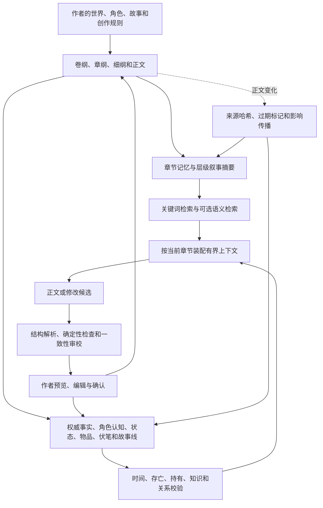
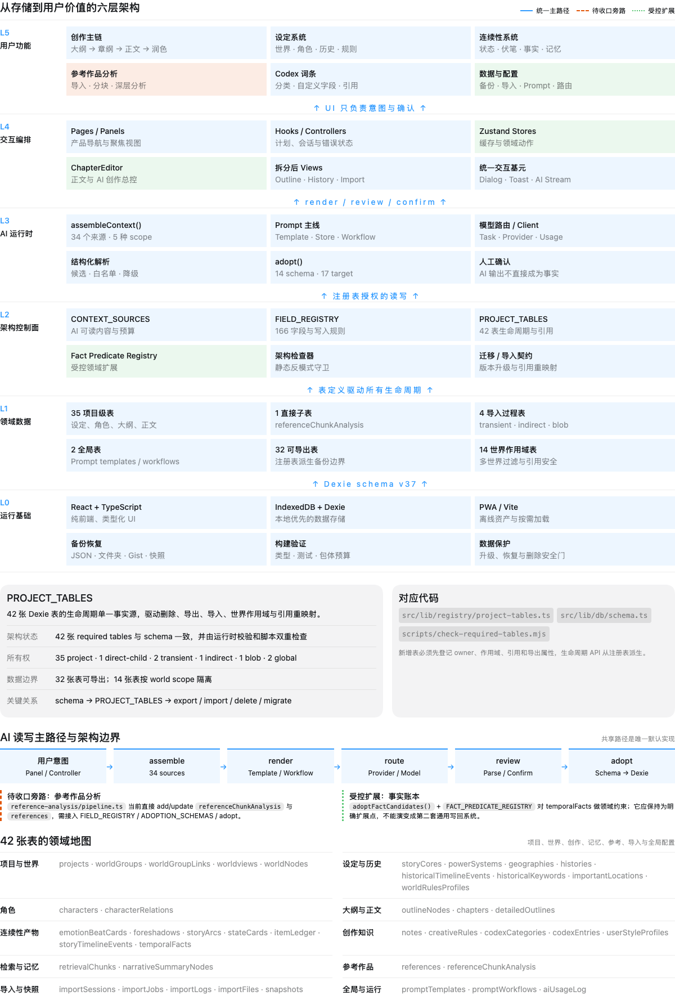
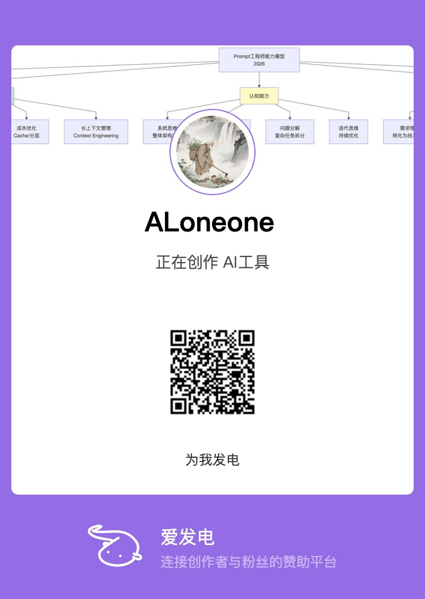

# StoryForge · 故事熔炉

[简体中文](./README.md) · [English](./docs/readme/README.en.md) · [Français](./docs/readme/README.fr.md) · [Deutsch](./docs/readme/README.de.md) · [日本語](./docs/readme/README.ja.md) · [Español](./docs/readme/README.es.md)

> 从一个想法开始，完成一部真正的作品；再以世界引擎为基座，让作品继续生长为小说、多人跑团、角色互动、文字游戏，以及可分享、可游玩、可共同创造的叙事世界。

StoryForge 是一个开源、本地优先的人工智能叙事创作与世界运行系统。项目当前以长篇小说创作为主要入口，已经形成分步骤创作、长期一致性、世界知识、节点编排、单机跑团和单角色聊天等能力；统一 Agent + Harness 将上下文、生成、校验、恢复、用量证据和作者确认收进同一条可审计链路。下一阶段将继续打通文字游戏制作、多人互动、世界版本发布和社区生态。

**交流与教程**

- GitHub：https://github.com/yuanbw2025/storyforge
- 项目主页：https://yuanbw.vercel.app/
- 知乎主页：https://www.zhihu.com/people/dan-ran-xing-yuan-59
- 知乎专栏文档：https://zhuanlan.zhihu.com/p/2038714210188780594
- B 站项目视频说明书：https://www.bilibili.com/video/BV1q37j6QExh/
- QQ 交流群：1082374587

---


---

## 项目愿景

人工智能已经能够生成一段文字，但完成一部长篇作品仍然需要长期规划、事实一致性、角色成长、伏笔回收、文风控制和持续审校。作品完成之后，其中建立的世界、人物、关系、规则和故事结构，也往往被锁在正文里，难以继续进入游玩、互动、改编和共同创作。

StoryForge 希望建立一条完整的叙事生产路径：

```text
一个想法
  ↓
完整故事与作品
  ↓
世界引擎
  ├── 长篇小说与系列作品
  ├── 多人跑团与长期战役
  ├── 角色聊天与互动冒险
  └── 分支、系统和社区衍生文字游戏
  ↓
发布、游玩、改编、协作与共同创造
  ↓
持续存在和演化的叙事世界
```

这条路径包含三个连续阶段：

1. **让想法成为故事**：把主题、角色、冲突和世界种子组织成可规划、可写作、可审校的完整作品。
2. **让故事成为可运行的世界资产**：用世界引擎沉淀事实、角色、规则、叙事结构和状态边界，让同一世界支撑不同创作与游玩实例。
3. **让世界进入共同生态**：以明确版本、来源和授权发布世界，让其他人阅读、游玩、派生、改编和协作。

长篇故事本身是核心价值。世界引擎和互动产品延长作品的生命周期，并始终保留小说创作的核心地位。

---

## 当前阶段一览

StoryForge 仍处于快速迭代阶段。以下状态用于区分已经可用的功能、正在验证的入口和未来规划，避免把路线图当成现成功能。

| 产品形态 | 当前状态 | 当前可以做什么 | 下一阶段 |
|---|---|---|---|
| 世界引擎 | **第一阶段可用** | 聚合世界基础、资产、叙事、结构和运行实例；单世界无需开启多世界模式 | 显式世界/作品归属、可执行叙事、不可变版本和统一实例 |
| 长篇小说创作 | **已可用 · 主要入口** | 分步骤模式完成从灵感到正文的完整流程；节点模式提供自由编排；主助手在分步骤模式中提供对话式协助 | 继续提升数百万字长期一致性、评测与创作闭环 |
| 跑团 | **本地单机战役已可用** | 人工智能或真人主持辅助、骰子与判定、战斗遭遇、任务、非玩家角色日程、检查点和分支 | 多人房间、席位、同步状态、权限与协作主持 |
| 角色聊天 | **单角色最小可用版本已完成** | 冻结角色快照、设置用户身份和场景、流式对话、重生成、检查点与分支 | 长期记忆、多角色房间、关系演化和冒险模式 |
| 文字游戏 | **实验入口** | 选择并绑定世界；当前默认只读，不创建正式游戏 | 选择、状态、分支、结局编辑器，以及发布和游玩闭环 |
| 世界分享 | **本地世界包已可用** | 选择许可、署名、用途和内容警告，导出并校验本地世界包 | 在线发布、发现、游玩、派生图、协作与社区治理 |

---

## 目录

- [项目愿景](#项目愿景)
- [当前阶段一览](#当前阶段一览)
- [一套世界底座，多种独立用法](#一套世界底座多种独立用法)
- [世界引擎](#世界引擎)
- [长篇小说创作](#长篇小说创作)
- [跑团与长期战役](#跑团与长期战役)
- [角色聊天与互动冒险](#角色聊天与互动冒险)
- [文字游戏](#文字游戏)
- [世界发布与社区生态](#世界发布与社区生态)
- [如何保证功能效果](#如何保证功能效果)
- [完整功能全景](#完整功能全景)
- [人工智能、模型与提示词系统](#人工智能模型与提示词系统)
- [数据、隐私与安全边界](#数据隐私与安全边界)
- [技术架构](#技术架构)
- [快速启动](#快速启动)
- [开发与验证](#开发与验证)
- [适合谁](#适合谁)
- [路线图与文档入口](#路线图与文档入口)
- [开源许可](#开源许可)
- [收藏趋势](#收藏趋势)

---

## 一套世界底座，多种独立用法

每位用户都可以只使用自己需要的部分。小说作者不必进入跑团，跑团玩家不必学习长篇工作流，角色聊天用户也不必先制作文字游戏。不同入口共享世界事实和安全边界，但保持各自独立的界面、状态和使用路径。

| 你的目标 | 推荐入口 | 可以忽略的其他部分 |
|---|---|---|
| 只想写长篇小说或网文 | 分步骤创作、章节编辑、事实库、伏笔、故事线、文风学习 | 跑团、聊天、文字游戏、社区 |
| 想搭建完整世界设定 | 世界引擎、设定库、角色与资产、世界地图、历史和规则 | 正文写作和互动入口可暂时不使用 |
| 想自由组合人工智能创作流程 | 节点创作、资料与检索库、提示词库 | 可以不改变原有分步骤工作流 |
| 想在自己的世界里跑团 | 世界引擎、互动运行时、跑团 | 不需要先完成整部长篇小说 |
| 想和自己创作的角色聊天 | 世界与角色设定、角色聊天 | 不需要使用战斗、节点图或长篇编辑 |
| 想制作叙事游戏 | 世界、故事结构与文字游戏入口 | 当前仍处于实验阶段，完整制作闭环尚在建设 |

共享底座包含五层：

1. **世界基础与权威事实**：定义这个世界中哪些事实、规则、人物和关系成立。
2. **叙事结构**：描述主题、主线、支线、任务、场景、选择和结局。
3. **世界状态机**：管理时间、状态、事件、规则、随机、检查点、分支和回放。
4. **独立实例**：小说、战役、聊天和游戏绑定同一世界版本，但拥有相互隔离的发展线。
5. **发布与社区**：将确认后的世界版本发布、授权、发现、派生和协作。

---

## 世界引擎

世界引擎位于产品能力的第一层。它负责保存世界事实、叙事结构和运行规则，让同一份世界资产能够被长篇小说、跑团、角色互动和文字游戏复用。


### 世界引擎的三个组成部分

#### 世界基础与权威事实

这一层回答“这个世界是什么、哪些事实成立”：

- 元规则、真实与幻想边界、物理与超自然规则。
- 起源、宇宙结构、位面、信仰和世界生命周期。
- 自然、人文、地理、历史、力量体系和社会制度。
- 角色、组织、势力、地点、物品、物产、生物和知识词条。
- 角色、地点、势力、血缘、从属、敌友和知识关系。

#### 可执行叙事蓝图

这一层回答“这个世界中可以发生什么”：

- 世界主题、核心矛盾、时代危机和故事种子。
- 主线、支线、任务链、角色线、势力线和探索线。
- 卷纲、章纲、细纲、场景、关键事件、选择和结局。
- 进入条件、触发条件、失败条件、状态效果和后续解锁。
- 预设开局、推荐角色、默认时间点和自由探索入口。

当前项目已经具备故事、大纲、细纲和故事线等创作结构；把它们统一升级为带条件、效果和版本的可执行叙事模块，属于后续世界引擎阶段。

#### 世界状态机

这一层回答“世界如何在不乱套的前提下继续发展”：

- 绑定一个冻结世界快照或未来的不可变发布版本。
- 将用户和人工智能的行动先转换为候选。
- 用代码检查权限、规则、前置条件、资源上下限和事件顺序。
- 通过事件归约器产生新状态，保存检查点并支持分支和回放。
- 将有价值的运行结果整理为候选，由作者决定是否回流创作层。

### 当前已经完成的世界工作台

- 单世界用户无需开启多世界模式即可使用完整世界入口。
- 世界基础、世界资产、叙事设计、世界结构、状态与实例共享现有数据。
- 世界内容覆盖度从登记领域派生，不再把正文进度当作世界完整度。
- 分步骤创作继续作为稳定基线，新工作台复用同一份权威数据，不复制第二套设定和大纲。
- 本地世界包可以携带署名、许可、内容警告和允许用途，并在导入前验证哈希与分享范围。

### 当前边界

- 数据库中的 `Project` 仍兼容承担本地存储边界；显式的世界、作品和多作品所有权仍在后续重构。
- 世界完整度目前表示领域覆盖，不等于已经完成全部引用校验、冲突检查或发布准备度。
- 可执行叙事蓝图、不可变版本、第二版发布包和四类统一实例仍按路线图分阶段实现。

---

## 长篇小说创作

长篇创作是 StoryForge 当前最完整、最稳定的产品入口，也是许多社区用户使用项目的主要原因。

### 长篇小说的三种创作方式

这三种方式服务于同一个长篇小说产品，共享世界、角色、大纲、正文和连续性数据。

| 创作方式 | 定位 | 适合用户 | 与其他方式的关系 |
|---|---|---|---|
| **分步骤模式** | 长篇小说的主工作流 | 希望从灵感、设定、大纲逐步推进到正文的作者 | 功能最完整，也是当前稳定基线 |
| **节点模式** | 长篇小说的自由编排工作流 | 希望重新组合生成步骤、资料和控制节点的进阶作者 | 读取和写入同一份作品数据，不复制另一套小说 |
| **主助手** | 分步骤模式中的对话式辅助 | 希望用自然语言组织世界、角色、大纲和正文任务的作者 | 嵌入分步骤创作，调用已有能力并保留候选确认 |

#### 分步骤模式

作者按照灵感、世界、故事、角色、大纲、细纲、正文和章后整理逐项推进。每一步都能手工编辑、查看相关资料并决定是否采纳人工智能结果。这是当前最适合长期连载和完整作品管理的入口。

#### 节点模式

节点模式把同一套长篇能力变成可自由编排的创作图：

- 添加世界、故事、角色、大纲、正文、连续性和控制节点。
- 使用语义端口连接步骤，运行整张图或指定节点的依赖闭包。
- 使用官方完整创作链和多种起始模板。
- 自动布局、迷你地图、框选、复制子图、对齐、分组和收藏。
- 记录执行顺序、调用预算、真实输入输出和运行证据。
- 支持暂停、取消、断点恢复、过期下游提示和运行快照。
- 节点结果先成为候选，作者确认后才写入角色、大纲、细纲或正文。

节点图只保存编排、稳定绑定和运行证据。作品内容继续由分步骤模式使用的同一套权威数据管理。

#### 主助手

主助手是分步骤模式内部的对话流，与分步骤工作区共享同一套创作能力和作品数据：

- 根据作者的自然语言请求规划世界、灵感、角色、大纲和正文任务。
- 在调用前确定任务依赖、模型连接和上下文档位。
- 保存候选、确认、拒绝、错误和执行状态，刷新后可以继续处理。
- 将未采纳的上游结果标为非正式资料，避免它们悄悄变成后续事实。
- “整理本章”可以生成角色状态、事实、物品、年表、关系和伏笔候选，再由作者逐项确认。

当前主助手按依赖顺序执行任务，尚未发展为完全并行的自治团队。

### 从想法到正文的完整工作流

```text
灵感与参考资料
  → 故事核心与主题冲突
  → 世界观、规则、历史与地理
  → 角色、关系、动机与弧光
  → 主线、支线与故事阶段
  → 卷纲、章纲与场景细纲
  → 正文生成、续写和编辑
  → 事实、状态、伏笔、物品与年表整理
  → 一致性审校、影响分析与后续规划
```

作者可以从一句想法开始，也可以导入已有大纲、设定或原稿继续创作。系统提供分阶段生成和手工编辑，不要求把整部作品交给一次模型调用。


### 已有创作能力

#### 1. 灵感、资料与故事设计

- 将短梗、片段、主题或冲突反推为故事核心、世界观、角色和大纲候选。
- 保存灵感碎片、来源和确认版本，比较新旧方案差异后再决定是否采纳。
- 导入故事参考、风格参考和历史资料，按分析版本隔离结果。
- 管理一句话故事、故事概念、主题、核心冲突、故事模式、主线和复线。

#### 2. 世界与角色

- 世界起源、自然环境、人文环境、历史年表、规则、力量体系和世界地图。
- 主要角色、次要角色、NPC、路人、关系网、动机、弧光和知识边界。
- 重要地点、势力、物品、物产、种族和知识词条。
- 单世界、多位面和多世界结构可以按作品需要选择，不强迫普通小说使用多世界。

#### 3. 大纲与正文

- 卷纲、章纲、场景细纲和正文的分阶段创作。
- 富文本编辑、自动保存、续写、润色、扩写、弱化机器生成痕迹、审校、便签和上下文查看。
- 角色驱动工作区根据人物变化分析后续剧情影响，并由作者选择需要重规划的范围。
- 故事线跟踪主线和支线阶段，避免大纲与正文长期脱节。

#### 4. 连续性与长期记忆

- 伏笔的埋设、呼应、回收、状态和紧急度管理。
- 角色、地点、物品、势力等状态卡和事件时间线。
- 物品获得、持有、转移和消耗账本。
- 从正文提取时序事实候选，作者确认后进入权威事实库。
- 角色认知账本区分“世界真实发生了什么”和“角色在当时知道什么”。
- 章节记忆、层级摘要和检索索引帮助系统按需读取相关历史，而非每次回灌整本正文。

#### 5. 风格与修改

- 从作者确认的章节和有界改前/改后样本中学习文风画像。
- 通过互动校准决定哪些表达特征进入后续生成。
- 支持全书查找替换、角色/地点/词条安全改名、项目快照和会话撤销。
- 人工智能输出先作为候选显示，作者可以编辑、拒绝或确认采纳。

### 面向数百万字长篇的一致性架构

StoryForge 的目标是让数百万字作品在长期连载中仍能追踪前因后果。分层架构、结构化记忆、按需检索和作者确认共同支撑这个目标，避免用一条提示词承载整本小说。



#### 已经建立的关键措施

| 措施 | 系统做了什么 | 提供的保障 | 作者能获得的效果 |
|---|---|---|---|
| 分层规划 | 用卷纲、章纲、细纲和场景组织长篇，规范章节顺序 | 后续生成能够定位当前章节在全书中的结构位置 | 连载数百章时仍能知道本章承接什么、推进什么 |
| 章节记忆与层级摘要 | 保存章节摘要和下一章交接信息，并按章、卷、全书逐层汇总 | 历史被压缩为可检索结构，同时保留来源指针 | 不需要每次回灌全部正文，也能找回相关前情 |
| 权威事实与时序 | 将正文事实先提取为候选，确认后记录有效时间和来源 | 区分当前事实、历史事实、冲突候选和已失效状态 | 降低角色复活、时间错位、设定前后矛盾等问题 |
| 角色认知账本 | 分开记录世界真相和角色在特定章节知道的内容 | 检查角色是否获得了超出其经历的知识 | 减少提前知情、泄露秘密和视角越界 |
| 状态与物品流水 | 记录角色、地点、势力状态以及物品获得、转移、消耗 | 持有关系和关键状态可以按章节追溯 | 减少物品凭空出现、重复消耗和状态跳变 |
| 故事线与伏笔 | 跟踪主线、支线阶段和伏笔埋设、呼应、回收 | 提醒长期未推进的线索和需要兑现的承诺 | 连载周期很长时仍能管理叙事节奏和回收计划 |
| 有界上下文装配 | 根据当前任务选择登记资料，记录纳入、裁剪和省略 | 上下文来源可见，超出预算时按规则裁剪 | 作者能理解模型为什么读到这些资料，而非依赖黑箱记忆 |
| 关键词与可选语义检索 | 章节默认使用关键词和层级摘要，也可配置向量检索 | 从长历史中召回与当前章节更相关的片段 | 在控制成本的同时提高远距离情节召回能力 |
| 确定性检查与只读审校 | 用代码检查存亡、持有、认知等硬规则，用模型补充软问题报告 | 硬规则不交给模型猜测，软问题不会自动改稿 | 发现问题后由作者判断，不会静默覆盖正文 |
| 统一 Agent + Harness | 冻结任务、上下文、模型和执行版本；保存检查点、候选、问题、用量与终态回执 | 默认一次生成，只对可定位问题允许最多一次定向修复；刷新后可恢复且不重复已结算调用 | 长任务失败时仍能保留可编辑草稿和证据，作者知道系统为何停止、花费多少、还能做什么 |
| 候选与确认写回 | 生成结果先进入候选，检查目标和来源是否已经变化 | 未确认内容不能成为正式作品数据，旧候选不能覆盖新稿 | 作者始终保留最终决定权和修改空间 |
| 备份与生命周期 | 项目表统一参与导出、导入、删除、迁移和引用重映射 | 新增的记忆和账本不会只存在于某个界面里 | 长篇项目可以备份、恢复和迁移，降低手稿托付风险 |

#### 哪些属于硬保障，哪些属于持续优化

- **硬保障**：未经确认的候选不写入正式资料；运行实例不反写小说；表生命周期统一登记；作用域、引用、并发变化和确定性规则由代码检查。
- **工程保障**：章节记忆、层级摘要、检索、事实账本、认知账本、物品流水、故事线和伏笔共同提高长期召回与一致性检查能力。
- **质量边界**：人工智能生成质量仍受模型、提示、资料完整度和作者判断影响；系统能够减少错误、暴露来源和提供修正入口，但不会承诺自动消除所有文学与逻辑问题。
- **目标说明**：数百万字是一致性架构和评测的目标尺度。当前项目已经完成主要地基，仍需要持续扩充长篇夹具、公开评测和真实作品验证。

对长篇作者来说，这套架构的核心意义是：作品越长，系统持续积累的都是可定位、可追溯、可检查、可备份的创作证据。

---

## 跑团与长期战役

跑团入口让作者或玩家选择一个 StoryForge 世界，建立独立战役存档，在其中进行行动、判定、战斗和长期推进。

### 当前已具备

- 选择世界、角色、地点、物品和规则，冻结为独立战役来源。
- 建立本地单机战役，由真人或人工智能辅助主持。
- 场景、回合顺序、玩家行动和技能检定。
- 人工智能生成成功或失败的叙事候选，骰点和状态变化由代码决定。
- 遭遇候选、确定性先攻、攻击、伤害、资源上下限和状态效果。
- 战役摘要、任务状态、优先级、期限和 NPC 日程。
- 统一世界时钟、事件日志、检查点、恢复和战役分支。
- 刷新恢复、项目备份和导入导出。

### 多人跑团方向

跑团的目标形态是多人共同进入同一个世界版本：一人或人工智能主持，多位玩家分别拥有角色、秘密、行动和后果。多人阶段需要账号、房间、席位、同步状态、权限、冲突处理和服务端协作能力，因此不会在纯前端本地数据库上冒充已经完成的实时联机。

多人功能将复用现有战役、规则、骰子、战斗、事件和回放基座，而不会另建一套跑团引擎。

### 运行边界

- 战役事件只改变当前实例，不修改小说正文或世界权威事实。
- 人工智能可以提出行动解释和叙事候选，不能私自选择骰点或绕过确定性规则。
- 战役中的精彩事件可以整理成创作候选，是否进入故事线或作品由作者确认。

---

## 角色聊天与互动冒险

角色聊天让用户以自定义身份进入一个冻结的世界场景，与自己创作的角色建立可保存、可重生成、可分支的互动关系。

### 当前单角色最小可用版本

- 选择世界版本和其中的角色快照。
- 设置会话名称、用户身份和场景信息。
- 基于角色身份、世界事实和当前会话生成流式回复。
- 保存消息、重生成角色回复并建立不同对话分支。
- 创建检查点，从指定状态恢复为独立分支。
- 聊天存档与原始角色主档隔离，不自动改写角色设定。

### 后续方向

- 长期会话摘要、事件记忆、关系变化和知识边界。
- 多角色房间、发言调度、角色间行动与冲突判定。
- 地点移动、物品、能力、任务、选择和随机事件。
- 从纯聊天平滑进入角色互动冒险。
- 将有价值的互动整理为灵感、角色关系或故事支线候选。

世界、身份、记忆和状态共同约束角色互动，让每一轮对话能够承接此前发生的事情。

---

## 文字游戏

文字游戏将故事结构转化为玩家可以操作的选择、状态、分支和结局。它是 StoryForge 从“辅助创作”走向“生成叙事产品”的关键阶段。

### 计划支持的三类形态

| 类型 | 核心体验 | 典型内容 |
|---|---|---|
| 分支冒险 | 作者设置关键节点和结局，玩家选择改变关系、资源和路线 | 互动小说、视觉小说式文本、角色路线 |
| 系统叙事 | 规则、状态和事件共同组织世界运行 | 生存、经营、推理、养成、开放探索 |
| 社区衍生 | 用户基于已发布世界制作新的可玩版本 | 番外、支线、角色故事、平行世界和改编游戏 |

### 当前状态

- 产品导航已经提供文字游戏实验入口和世界绑定。
- 世界分享许可已经可以声明是否允许文字游戏用途。
- 共享模拟运行时已经具备事件、状态、随机、检查点、分支和回放地基。
- 正式的选择编辑器、状态设计器、分支图、结局管理、发布和游玩闭环尚未完成。

### 为什么可以从故事继续生成游戏

长篇创作已经沉淀世界事实、角色、关系、地点、物品、主线、支线、大纲和场景。后续可执行叙事蓝图会为这些内容补充前置条件、触发方式、可选行动、状态效果、后继路径和失败结局。文字游戏因此可以复用作品结构，而不必从空白游戏工程重新录入全部设定。

---

## 世界发布与社区生态

StoryForge 的社区愿景围绕“世界版本”组织内容，形成可追溯的发布、游玩、派生和协作网络。

### 当前本地发布能力

- 作者选择署名、许可、内容警告和允许用途。
- 分享范围由项目表注册信息统一控制，避免私有数据误入世界包。
- 世界包携带来源编号、版本、哈希和用途声明。
- 导入前检查格式、哈希、私有表泄漏和篡改。
- 导入后创建新的本地世界编号副本，保留来源信息，不覆盖现有项目。
- 章节、笔记、智能助手会话、运行时存档、接口配置和个人文风默认不进入世界包。

### 未来社区循环

```text
创作与发布
  → 发现与游玩
  → 改编与共同创作
  → 反馈与世界演化
  → 新的不可变版本
```

计划中的社区能力包括：

- 世界目录、搜索、标签、玩法和内容警告。
- 不可变世界版本、差异、依赖和兼容信息。
- 小说、跑团、角色互动和文字游戏的统一发现入口。
- 派生、再创作、共同祖先、来源追溯和许可证链。
- 收藏、关注、评论、评分和游玩统计。
- 邀请、成员角色、结构化变更提案、审阅和版本合并。
- 作者身份、权限、下架、申诉和治理记录。

本地草稿继续由用户掌控。社区服务只处理用户明确发布的内容和元数据，不静默同步或覆盖浏览器中的私有手稿。

---

## 如何保证功能效果

StoryForge 的功能共享一套治理和运行基础。长篇、节点、跑团、聊天和未来文字游戏之间可以互相复用，同时避免事实污染、状态串线和人工智能黑箱写入。

### 统一 Agent + Harness 生成链路

核心创作任务沿同一条可审计、可恢复的链路运行：

1. **任务与能力声明**：主助手或领域能力明确本轮目标、读写权限、执行版本和完成条件。
2. **受治理上下文**：只通过登记来源读取当前世界、作品、权威事实、直接前文和任务资料，并按预算分层裁剪。
3. **有界生成**：提示词、工具和模型身份冻结进本次运行；创作产物默认一次生成，只有系统准确定位到可修问题时才允许最多一次定向修复。
4. **验证与降级交付**：代码检查结构、作用域、引用、过期输入和写入权限；普通质量问题变成可见警告，合法片段和原始草稿不会因一个软问题整批丢失。
5. **作者确认与正式采纳**：作者可以预览、编辑、拒绝或接受警告；只有确认后的候选才进入正式作品数据。
6. **恢复与费用证据**：运行记录、检查点、父子依赖、终态回执、token、延迟和失败原因进入统一账本，刷新或中断后可以恢复，不重复已经结算的调用。

这套架构保障执行边界和创作证据，不承诺任何模型每次都生成完美文学结果。本轮 Agent + Harness / CREL 已阶段性开发完成，工程控制面、可编辑产物交付和费用停止策略已经收口，创作可靠性现以实验性入口进入社区观察。独立作者 A/B 与原预注册质量门已由产品决策关闭，不再是本轮待开发项；这不表示历史评测已经通过，也不支持“替作者完成 80%”等量化承诺。详见 [Agent + Harness 架构更新说明](./docs/AI-HARNESS-REBUILD-RELEASE-20260817.md)与[社区观察产品决策](./docs/adr/HARNESS-COMMUNITY-VALIDATION.md)。

### 1. 结构化权威事实

世界、角色、关系、大纲、伏笔、事实、状态、物品和年表以结构化记录保存。正文仍是作品主体，结构化数据负责提供可检索、可验证、可追踪的长期记忆。

### 2. 按任务装配上下文

人工智能不会无边界读取整个项目。每项能力登记自己允许读取的来源，系统按照当前任务、世界、角色、章节和预算装配上下文，并记录纳入、省略和裁剪情况。

### 3. 候选、验证与作者确认

人工智能输出默认进入候选区。解析器检查结构，确定性校验关口检查范围、引用、并发变化和业务规则，作者编辑或确认后才写入正式数据。

```text
登记来源 → 上下文装配 → 人工智能候选 → 解析与确定性校验 → 作者确认 → 正式采纳
```

### 4. 创作权威事实与运行实例隔离

跑团、聊天和游戏从冻结快照建立独立实例。运行时事件不会自动杀死小说中的角色、改变世界发布版本或覆盖作者草稿。需要回流时先形成可审计候选。

### 5. 确定性规则与事件回放

时间、骰子、事件序号、资源上下限、战斗状态和分支由代码处理。相同初始状态和事件流应重放为相同结果；非法事件、序号缺口和未知转换会失败关闭。

### 6. 来源、版本和过期保护

候选和运行实例记录来源标识、更新时间或内容哈希。正文、角色或世界来源变化后，旧结果会被标记过期，避免用旧上下文覆盖新内容。

### 7. 本地优先和完整生命周期

项目数据默认保存在浏览器 IndexedDB。导出、导入、删除、迁移、世界作用域和引用重映射由统一表注册表管理，避免新功能只写入数据却无法备份或删除。

### 8. 三个单一事实源

| 注册表 | 负责的问题 |
|---|---|
| `CONTEXT_SOURCES` + `assembleContext()` | 人工智能可以读什么、怎样组合上下文 |
| `FIELD_REGISTRY` + `AdoptionSchema` + `adopt()` | 人工智能可以写什么、怎样验证与采纳 |
| `PROJECT_TABLES` | 数据表怎样参与导出、导入、删除、迁移和作用域生命周期 |

这三条主路径让功能扩展继续复用同一套数据和安全边界，减少组件各自拼接上下文、直接写库或漏掉备份生命周期的风险。

---

## 完整功能全景

### 项目与资料

- 项目列表、新建、删除和本地文件夹恢复。
- 名称、简介、流派、目标字数、创作状态和多世界选项。
- 灵感碎片、增量融合、版本差异和作者确认。
- 故事参考、风格参考、历史资料、文件上传和多维分析。
- 文档粘贴、分块解析、大文档断点续跑、暂停、取消和日志。
- JSON/Markdown/TXT/HTML 导出、版本快照、Gist 云备份和需作者手动核对的本地记忆工作区。

### 世界与设定

- 世界起源、自然环境、人文环境、历史、规则和地图。
- 世界维度、区域、位面、多世界关系和能力继承规则。
- 势力、种族、物产、器物、力量阶段、修炼体系和知识词条。
- 重要地点树、地点关系和空间约束。
- 真实与幻想来源边界，以及场景考证。

### 故事与角色

- 故事核心、主题、冲突、故事模式、主线和复线。
- 主要角色、次要角色、NPC、路人和关系网。
- 角色动机、弧光、状态、认知和角色驱动规划。
- 主线/支线阶段、进度、交汇与影响分析。

### 大纲与正文

- 卷/章树、卷纲、章纲、细纲、场景和正文。
- TipTap 富文本编辑、自动保存、上下文查看和章节便签。
- 生成、续写、润色、扩写、审校和作者确认写回。
- 全文查找替换、实体补全、悬浮档案和安全改名。

### 连续性网络

- 伏笔列表和看板、埋设/呼应/回收状态。
- 状态卡、物品流水、时序事实、角色认知和故事年表。
- 章节记忆、叙事摘要、检索索引和一致性审校。
- 正文变更后的事实、关系、物品、大纲和伏笔候选整理。

### 人工智能与工作流

- 提示词模板、参数、条件块、示例、反例、克隆和预览。
- 题材包、模型预设、任务路由、上下文档位和消耗统计。
- 分步骤生成、主助手对话和领域节点创作。
- 可见输入输出、运行证据、候选版本和确认采纳。

### 互动体验

- 共享世界模拟运行时、逻辑时间、实体状态和事件日志。
- NPC 演进候选与作者确认。
- 单机跑团、规则判定、战斗遭遇和长期战役。
- 单角色聊天、重生成、检查点和分支。
- 文字游戏世界绑定实验入口。

### 导出、备份和恢复

- JSON 完整备份、Markdown/TXT/HTML 导出。
- 本地文件夹自动备份和 GitHub Gist 云备份。
- 自动快照、手动快照和恢复为新项目。
- 导入前结构预检、版本兼容提示和失败零写入。
- 世界发布包、哈希校验、许可与来源保留。

完整图文说明见 [docs/FEATURE-GUIDE.md](./docs/FEATURE-GUIDE.md)。

---

## 人工智能、模型与提示词系统

### 支持的模型服务商

| 类型 | 服务商 |
|---|---|
| 国际与聚合 | OpenAI、Anthropic Claude、Google Gemini、Poe、NVIDIA NIM |
| 国内与兼容服务 | DeepSeek、通义千问、豆包、MiniMax、智谱 GLM、文心一言、Kimi、魔搭社区、Agnes AI、LongCat、OpenCode Go |
| 本地与自定义 | Ollama、LM Studio 等 OpenAI-compatible 本地服务、自定义 Base URL |

浏览器跨域访问受限的服务可以通过本地开发代理转发。自定义接口需要兼容 OpenAI `chat/completions`；向量检索使用兼容的 `embeddings` 接口。

### 提示词透明性

- 系统提示词、用户模板、参数和示例可以查看。
- 系统模板可以克隆为用户模板再修改。
- 支持 `{{var}}` 变量、`{{#if var}}...{{/if}}` 条件块和多种参数控件。
- 运行前可以预览最终提示词、相关上下文和预算。
- 不同任务、团队角色和节点可以绑定不同连接预设。

### 生成边界

- 云端模型会接收到当前任务所需的相关内容。
- 本地模型可以让正文生成留在本机，但实际能力和速度取决于本地模型与硬件。
- 关键词检索默认不产生额外模型费用；向量检索默认关闭，可选择本地或云端向量模型。
- 模型窗口和输出上限可以按 provider/model 配置，系统会在调用前做预算和裁剪判断。

---

## 数据、隐私与安全边界

StoryForge 当前是纯前端应用，没有自建应用后端。

| 数据或动作 | 默认去向 |
|---|---|
| 项目、正文、设定和运行存档 | 浏览器 IndexedDB |
| 人工智能接口密钥 | `sessionStorage`；用户明确选择“记住本机”后才进入 `localStorage` |
| GitHub PAT | sessionStorage；用户明确选择“记住本机”后才进入 localStorage |
| 人工智能生成请求 | 发送当前任务相关上下文到用户配置的模型服务 |
| 云端向量模型 | 发送被建立索引的文本到用户配置的向量服务 |
| 本地 Ollama / LM Studio | 发送到用户配置的本地服务地址 |
| Gist 云备份 | 上传完整项目 JSON 到用户自己的 GitHub 私密 Gist |
| 本地文件夹备份与记忆工作区 | 只在作者手动检查或确认后读写用户明确授权的本地目录，不在后台自动覆盖 |
| 世界包 | 只导出注册为可分享且由用户选择的世界内容 |

需要注意：

- “本地优先”不等于所有人工智能调用都自动离线；使用云端模型时，相关上下文会发送给该服务商。
- 未发布草稿、接口密钥、私有参考、智能助手运行记录和个人文风不会自动进入世界分享包。
- 生产环境检测到 IndexedDB schema 缺表时不会自动删库。
- 启动时会申请浏览器持久化存储，但重要项目仍应定期导出备份。

---

## 技术架构

### 从存储到用户价值的七层架构

StoryForge 按“底层能力向上支撑用户价值”的方向分为七层：本地数据与作用域、三注册表、上下文与采纳、Agent Skill、durable Harness、产品入口、作者确认。UI 只表达用户意图和确认；模型调用、失败恢复和正式写入不能由面板各自形成平行管线。

[](./docs/assets/architecture/storyforge-architecture-overview.png)

旧六层图仍用于展示注册表和领域数据分布；当前 Agent + Harness 执行层以 [架构总览](./docs/ARCHITECTURE.md) 和 [本次架构更新说明](./docs/AI-HARNESS-REBUILD-RELEASE-20260817.md) 为准。对应实现见 [`src/lib/registry`](./src/lib/registry)、[`src/lib/agent`](./src/lib/agent)、[`src/lib/agent/run`](./src/lib/agent/run)、[`src/lib/db/schema.ts`](./src/lib/db/schema.ts) 与 [`scripts/check-architecture.mjs`](./scripts/check-architecture.mjs)。

### 主要技术

- React 19、TypeScript、Vite、Zustand。
- Dexie / IndexedDB 本地数据层。
- TipTap 富文本编辑器。
- Vitest、Playwright、ESLint 和架构检查脚本。
- PWA、File System Access API、JSZip、PDF.js、Mammoth。

### 领域分层

```text
用户入口
  ├── 世界引擎
  ├── 长篇小说创作
  │     ├── 分步骤模式
  │     ├── 节点模式
  │     └── 分步骤模式中的主助手
  └── 跑团 / 角色聊天 / 文字游戏
        ↓
候选、规则、确认与运行时
        ↓
Agent Skill / durable Harness / 检查点与用量证据
        ↓
CONTEXT_SOURCES / FIELD_REGISTRY / PROJECT_TABLES
        ↓
Dexie / IndexedDB 本地数据
```

架构约束和施工规则见 [AGENTS.md](./AGENTS.md)、[CLAUDE.md](./CLAUDE.md) 与 [docs/MASTER-BLUEPRINT.md](./docs/MASTER-BLUEPRINT.md)。

---

## 快速启动

### macOS / Linux / Windows

```bash
git clone https://github.com/yuanbw2025/storyforge.git
cd storyforge
npm install
npm run dev
```

打开：

```text
http://localhost:1111/storyforge/
```

### Windows 零基础用户

StoryForge 当前不提供 `.bat`、`.exe` 或 Windows Portable 启动器。Windows 用户可以：

1. 在 GitHub Release 下载 `Source code (zip)`。
2. 解压并进入包含 `package.json` 的目录。
3. 安装 Node.js LTS：https://nodejs.org/
4. 在项目目录打开 PowerShell。
5. 执行 `npm install` 和 `npm run dev`。
6. 浏览器打开 `http://localhost:1111/storyforge/`。

详细步骤见 [使用npm指令启动项目.md](./使用npm指令启动项目.md)。

### 第一次使用建议

1. 先进入设置页配置模型服务商、模型和接口密钥，测试连接。
2. 新建一个小型测试项目，熟悉灵感、故事、角色、大纲和章节工作流。
3. 在数据管理中导出一次 JSON 备份，确认自己的恢复方式。
4. 再导入正式作品或开始长篇项目。

---

## 开发与验证

开始贡献前请先阅读 [CONTRIBUTING.md](./CONTRIBUTING.md) 和 [AGENTS.md](./AGENTS.md)。

常用命令：

```bash
npm run dev
npm run build
npm run test
npm run test:coverage
npm run test:e2e
npm run check:required-tables
npm run check:ai-manual
npm run check:architecture
npm run ci
```

完整 `npm run ci` 会依次检查表生命周期、人工智能功能手册、架构、来源可达性、路线图、智能助手上下文、权威事实覆盖、项目指标、依赖、代码规范、类型检查、测试覆盖率、构建和产物体积。

涉及数据库结构、迁移、删除、合并、导入导出和引用重映射的变更，需要补充反例测试并验证真实项目往返。新的人工智能读取、写入或数据表必须分别登记到三个单一事实源。

---

## 适合谁

| 适合 | 使用建议 |
|---|---|
| 长篇、网文、系列文和群像作者 | 从分步骤创作、事实、伏笔、故事线和章节工作流开始 |
| 世界观、架空历史和桌面角色扮演设定创作者 | 重点使用世界引擎、角色、地点、历史、规则和世界包 |
| 希望掌控提示词、上下文和模型的人工智能创作者 | 使用提示词库、节点创作、资料检索和任务路由 |
| 希望在自己世界里跑团或与角色互动的人 | 使用互动运行时、跑团和角色聊天；注意当前多人能力边界 |
| 想制作互动小说和叙事游戏的人 | 可以关注文字游戏路线；当前入口仍处于实验阶段 |
| 重视本地数据、可换模型和可导出备份的人 | 使用本地存储、JSON、文件夹和自选模型服务 |

如果你的目标是完全不配置模型、不维护任何设定，并由系统一次生成可直接发布的整部长篇，当前 StoryForge 的工作方式可能并不合适。项目更强调过程透明、结构治理和作者确认。

---

## 路线图与文档入口

| 文档 | 时效与用途 |
|---|---|
| [用户图文功能说明](./docs/FEATURE-GUIDE.md) | 已更新产品层级；详细截图目前以长篇小说分步骤模式为主，新产品入口仍在补充 |
| [Agent + Harness 架构更新说明](./docs/AI-HARNESS-REBUILD-RELEASE-20260817.md) | 当前有效；说明统一生成链路、验证证据和诚实边界 |
| [当前架构总览](./docs/ARCHITECTURE.md) | 当前有效；查看代码、运行架构与统一 Agent + Harness 主路径 |
| [当前开发路线图](./docs/roadmap/README.md) | 当前有效；查看功能体系、状态、依赖和施工顺序 |
| [当前能力基线](./docs/roadmap/CAPABILITY-BASELINE.md) | 当前有效；区分已有能力、尚未完成边界和禁止重复建设内容 |
| [世界引擎与社区目标架构](./docs/WORLD-ENGINE-COMMUNITY-ARCHITECTURE.md) | 当前目标基线；描述世界、作品、实例、版本和社区的未来领域结构，不代表全部已经实现 |
| [互动运行时路线](./docs/INTERACTIVE-RUNTIME-ROADMAP.md) | 已修正完成状态；查看跑团、角色聊天和共享模拟运行时的现状与后续阶段 |
| [已完成开发索引](./docs/roadmap/COMPLETED.md) | 历史证据入口；只记录已经完成且有回归证据的功能单位 |
| [人工智能行为说明书](./docs/AI-FUNCTIONS-MANUAL.generated.md) | 由代码自动生成并由持续集成校验；面向开发者，用户说明请查看图文功能说明 |
| [重构施工蓝图](./docs/MASTER-BLUEPRINT.md) | 大型工程施工与完成定义；按任务读取相关章节，开头的历史诊断不能代替当前产品状态 |
| [贡献指南](./CONTRIBUTING.md) | 当前开发、测试、分支和提交要求 |
| [版本记录](./CHANGELOG.md) | 已发布版本与未发布变更；不承担未来路线图职责 |
| [安全策略](./SECURITY.md) | 漏洞报告、响应流程与支持版本 |

路线图中的未来功能不代表当前版本已经可用。判断当前事实时，以代码、测试、能力基线和应用实际界面为准。

---

## 开源许可

StoryForge 使用 [MIT License](./LICENSE) 开源。你可以自由使用、复制、修改、分发和商用项目代码，请保留原始版权和许可声明。

---

## 收藏趋势

[](https://www.star-history.com/?repos=yuanbw2025%2Fstoryforge&type=date&legend=top-left)

折线图由 GitHub 官方 stargazer 时间数据生成，并由 [`star-history.yml`](./.github/workflows/star-history.yml) 每 15 分钟刷新到独立的 `readme-assets` 分支；也可在 Actions 中手动触发，不会产生主干提交或应用部署。

---

## 自愿赞助

StoryForge 的全部功能与后续更新不会因是否赞助而有区别。赞助款主要用于缓解开发者的大模型订阅和项目维护成本，并帮助项目继续迭代。

感谢每一份支持。希望 StoryForge 能帮助更多人把脑海中的想法完成为真正的作品，再让作品中的世界获得被阅读、游玩、共同创造和持续演化的生命。

<p align="center">
  
</p>
