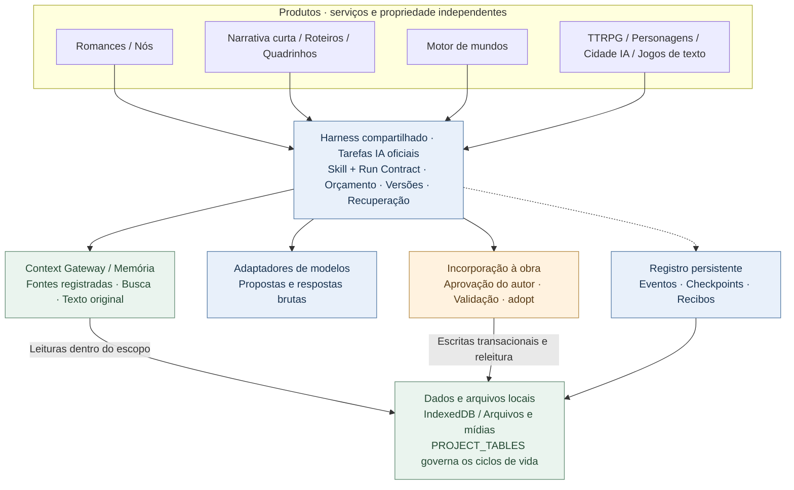
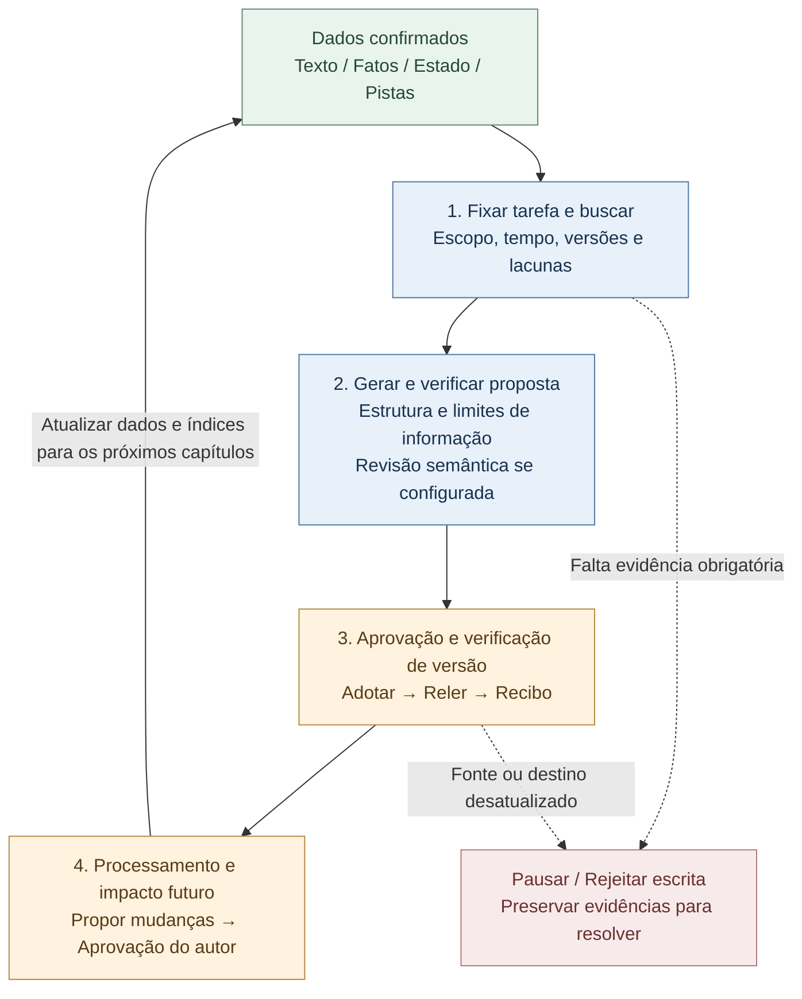

# StoryForge · 故事熔炉

**Escreva histórias. Entre nos seus mundos.**

<!-- readme-languages:start -->
[简体中文](./README.md) · [English](./README.en.md) · [Français](./README.fr.md) · [Deutsch](./README.de.md) · [Italiano](./README.it.md) · [Español](./README.es.md) · [Português](./README.pt.md) · [日本語](./README.ja.md) · [한국어](./README.ko.md)
<!-- readme-languages:end -->

[Comece a criar](#quick-start) · [Experimente Fog Harbor](#try-a-story) · [Explore a arquitetura](#architecture)

StoryForge é uma ferramenta de código aberto para criar e vivenciar narrativas com IA, projetada para manter os dados localmente. Escreva romances e narrativas curtas, adapte um romance para roteiro ou quadrinhos, construa mundos reutilizáveis e explore experiências interativas. Você escolhe o processo e aprova as propostas da IA antes de incorporá-las à sua obra.

> Estado de `main` verificado em 9 de setembro de 2026: romance, narrativa curta, roteiro, quadrinhos e motor de mundos têm entradas oficiais. O modo de nós e os produtos interativos são prévias. Este README está traduzido; isso não significa que toda a interface ou os documentos vinculados estejam disponíveis em português. As capturas e muitos guias estão em chinês.

<a id="try-a-story"></a>

## Experimente uma história original

### Fog Harbor: The Last Light — prévia comunitária de RPG

Investigue um antigo naufrágio com dois companheiros de IA, proteja os segredos do seu personagem e decida como os navios voltarão nesta noite. Um mestre de jogo IA (KP) conduz a aventura com regras originais **2d6**, **7 cenas, 6 pistas e 3 finais**.


O jogo e os arquivos de mídia incluídos estão no repositório. Configure sua própria API de modelo para começar. A captura mostra a entrada real da aventura.

**Ciclo de jogo:** propor uma ação → resolver as regras → ler a resposta do mestre → consultar pistas → salvar e continuar.

<details>
<summary>Como jogar e limites atuais</summary>

Execute o código atual de `main`, abra **TTRPG** (`跑团`) e escolha a aventura abaixo da seção de produção, ou acesse `/storyforge/play`. Configure o modelo e escolha um personagem. Jogue sozinho com companheiros de IA ou revezando o mesmo dispositivo. Progresso, retomada e checkpoints são locais. O modo multijogador público on-line não está implantado; os segredos em um dispositivo compartilhado não ficam protegidos contra seu proprietário.

[Guia do jogador](./examples/ttrpg/README.md) · [Evidências de produção e partidas](./examples/ttrpg/fog-harbor/production-status.md)

</details>

## Por que StoryForge

- **Memória ligada ao manuscrito.** Texto original, fatos, resumos e busca ajudam a recuperar pistas antigas; mudanças confirmadas após um capítulo alimentam os seguintes.
- **Um processo específico para cada produto.** A narrativa curta verifica extensão e conclusão; o roteiro preserva decisões de adaptação; os quadrinhos separam painéis, imagens e letreiramento.
- **O autor mantém o controle.** A criação oficial produz primeiro propostas. Harness acrescenta proteção de revisões, evidências de execução e recuperação de estados salvos.

[Início rápido](#quick-start) · [Produtos](#products) · [Primeira sessão](#first-session) · [Mundos](#worlds) · [Harness](#architecture) · [Privacidade](#privacy) · [Comunidade](#community)

<a id="quick-start"></a>

## Início rápido

Abra o [aplicativo web](https://yuanbw.vercel.app/storyforge/) ou execute o código localmente. A criação local básica não exige uma conta StoryForge. A IA usa suas credenciais do provedor, com custos de API separados. O site pode estar atrás de `main`; Releases antigas são versões fixas.

Use **Node.js 24** e npm, como na CI:

```bash
git clone https://github.com/yuanbw2025/storyforge.git
cd storyforge
npm ci
npm run dev
```

Abra o endereço informado pelo Vite com o caminho `/storyforge/` e mantenha o terminal em execução. Um ZIP do código exige os mesmos passos após a extração; não é um instalador de desktop.

Na página inicial, abra as configurações de modelo no canto superior direito (`模型与本地设置`). Escolha o provedor, informe API Key, Base URL e um modelo acessível, depois teste a conexão e uma geração pequena. Conectar não comprova qualidade, saldo ou capacidade de contexto. Para erros CORS do navegador, siga as instruções do proxy local no painel.

<a id="products"></a>

## Escolha por onde começar


| Objetivo | Entrada | Resultado e estado |
|---|---|---|
| Escrever um romance | Novo → Romance | Personagens, planos, capítulos, continuidade e revisão; processo técnico atual validado |
| Concluir uma narrativa curta | Novo → Narrativa curta | Projeto, fichas de capítulos, escrita, revisão, edição imutável; Markdown/TXT/JSON |
| Adaptar para roteiro | Novo → Romance para roteiro | Fontes fixadas, decisões, cenas estruturadas, revisões; Fountain/FDX/impressão |
| Adaptar para quadrinhos | Novo → Romance para quadrinhos | Páginas, painéis, referências visuais, letreiramento, edições; PNG/WebP/CBZ/PDF |
| Criar um mundo | Novo → Motor de mundos | Conteúdo semântico, derivação explícita, versões imutáveis e leitura |
| Montar um processo visual | Modo de nós | Prévia; compartilha lógica e dados do romance |
| Jogar ou criar experiências | TTRPG / Conversa com personagens / Cidade IA / Jogos de texto | Prévias com ciclos próprios de produção e execução |

Escrever romances não exige o motor de mundos. O autor pode derivar explicitamente um mundo de conteúdo confirmado de romances ou narrativas curtas. Roteiros e quadrinhos são adaptações independentes sem essa exportação. Uma aventura publicada pode ser jogada sem criar um mundo antes.

<a id="first-session"></a>

## Sua primeira sessão de escrita

1. Escolha **Novo** (`新建`) → **Romance** (`长篇小说`) e informe título e descrição.
2. Registre intenção, referências e regras de escrita; preencha a ambientação necessária.
3. Planeje conflito e personagens, depois volumes e capítulos. Escreva manualmente ou edite e aprove as propostas da IA.
4. Desenvolva cenas e texto. Confira mudanças em fatos, estados, relações e pistas antes de continuar.
5. Em **Gerenciamento de dados** (`数据管理`), exporte o texto e um backup JSON completo.


## O que cada produto faz pela sua obra

### Romances e nós

O espaço do romance inclui referências, ambientação, personagens e relações, tramas, planos, capítulos, antecipações, fatos, inventários, estilo, modelos de prompts e histórico.

A memória mantém o **texto original como evidência**, fatos e estados estruturados, resumos de capítulo/volume/obra e índices de busca. Context Gateway descobre recursos antes de ler detalhes e registra as fontes realmente usadas. Resumos e índices derivados são verificados pelos hashes das fontes; quando ausentes ou desatualizados, o texto original serve de alternativa. O escopo da obra e os limites temporais filtram a recuperação.

Após um capítulo, o processamento propõe alterações em fatos, personagens, relações, objetos, cronologia, pistas e tramas para confirmação do autor. A análise de impacto considera planos futuros e preserva a história confirmada. Verificações de versão impedem que propostas antigas sobrescrevam edições recentes.

Os nós oficiais reutilizam os mesmos Skills, dados e processos de aprovação, permitindo compor etapas e resultados intermediários. Rascunhos experimentais não podem entrar no conteúdo oficial. A interoperabilidade completa entre interfaces continua em validação.

[Busca narrativa](./src/lib/context-gateway/narrative-retrieval.ts) · [Processamento após o capítulo](./src/lib/ai/chapter-memory/run-chapter-memory.ts) · [Contrato romance/nós](./docs/products/LONGFORM-AND-NODE.md)

### Narrativa curta: um caminho visível até a conclusão

O processo dedicado visa **5.000–25.000 caracteres chineses em 3–8 capítulos**: brief, projeto, fichas, escrita, revisão, reescrita e publicação. Verifica extensão real, estrutura, texto ausente e propostas pendentes. Os problemas de revisão apontam capítulos e trechos; a revisão é vinculada ao hash do manuscrito e precisa ser atualizada após alterações. As reescritas se concentram em capítulos específicos. Problemas bloqueadores impedem a publicação; cada edição aceita fica imutável e preserva as anteriores.

[Produção e critérios de conclusão](./src/lib/short-novel/service.ts) · [Execuções IA persistentes dedicadas](./src/lib/agent/run/short-novel-durable.ts)

### Roteiros: decisões de adaptação rastreáveis

O processo fixa as fontes selecionadas e as conecta a fatos, causalidade, decisões de adaptação, momentos narrativos, fichas e cenas. É possível verificar por que um evento foi removido, combinado ou transformado. As cenas usam uma **AST**, representação estruturada dos blocos do roteiro, validada pelo código e convertida para Fountain, FDX ou impressão.

Fidelidade à fonte e estrutura dramática têm revisões separadas. Uma correção identifica cena e revisão esperada; cenas bloqueadas precisam ser desbloqueadas e correções desatualizadas são rejeitadas. As edições fixam fontes, decisões e cenas. Alterações posteriores no romance não mudam automaticamente o roteiro publicado.

[Produção e revisões](./src/lib/screenplay/production.ts) · [Edições](./src/lib/screenplay/release.ts) · [Renderizadores](./src/lib/screenplay/renderers.ts)

### Quadrinhos: imagens e letreiramento em camadas separadas

Primeiro são desenvolvidos momentos narrativos, páginas e painéis; depois, imagens e letreiramento. Identidades estáveis e ordem de leitura explícita conectam enquadramentos, ações, diálogos e fontes. Sujeitos visuais dão identidade a personagens, lugares e objetos. Imagens candidatas registram procedência e evidências das referências realmente enviadas ao provedor.

O **letreiramento SVG local** acrescenta balões, legendas e efeitos sonoros editáveis sobre as imagens. Corrigir um diálogo não exige gerar outro painel. As verificações sinalizam transbordamento, sobreposições e margens inseguras; o autor ainda confere partes da imagem encobertas. Storyboard e edição visual têm critérios separados. As edições visuais mantêm referências fortes aos Blob das imagens selecionadas.

**Limite atual:** o adaptador genérico de imagens compatível com OpenAI envia apenas texto e declara não oferecer imagens de referência, seeds fixos ou inpainting. Citar uma referência no prompt não equivale a enviar a imagem. A produção visual precisa de um serviço de imagens configurado ou materiais adequados do autor, com seleção e revisão humana da continuidade.

[Produção](./src/lib/comic/production.ts) · [Evidências de mídia](./src/lib/comic/media-service.ts) · [Letreiramento](./src/lib/comic/renderers.ts) · [Verificações de qualidade](./src/lib/comic/qa.ts)

Os processos técnicos atuais estão implementados em `main`; desempenho dos provedores e qualidade do conteúdo continuam em avaliação. Veja a [base de capacidades](./docs/roadmap/CAPABILITY-BASELINE.md).

<a id="worlds"></a>

## Mundos e produtos interativos

Crie ou derive explicitamente um mundo, fixe uma versão e configure e inicie a produção dentro do produto escolhido. O motor mantém somente **conteúdo semântico versionado**. Cada produto é dono de suas mídias, partidas e evolução privada. Alterações posteriores do romance e partidas não reescrevem automaticamente o mundo compartilhado.

A derivação registra obra de origem, revisão, intervalo e hash. Adaptadores específicos declaram recursos obrigatórios, opcionais e proibidos e fixam um **SourcePlan**. Leituras progressivas por `describe / search / read` deixam um Context Manifest por execução e um SourceManifest final das leituras reais. Uma aventura pode continuar na versão 1 enquanto o autor prepara a 2.

[Cliente de recursos do mundo](./src/lib/context-gateway/world-release-client.ts) · [Contrato do mundo](./docs/products/WORLD-ENGINE.md)

**Todos os produtos abaixo são prévias:**

| Produto | Mecanismos implementados | Limite atual |
|---|---|---|
| [TTRPG / mestre IA](./src/lib/ttrpg/information-boundary.ts) | Regras, dados e efeitos resolvidos pelo código; contextos separados mestre/jogador/PNJ, segredos por destinatário, eventos e checkpoints | Fog Harbor tem evidências com modelos reais; sem multijogador público on-line |
| [Conversa com personagens](./src/lib/character-interaction/runtime.ts) | Perfis e voz fixados, objetivos de cena, memória de compromissos/segredos/conflitos, confiança/proximidade/cautela/respeito | Qualidade de personagens a longo prazo em avaliação |
| [Cidade IA Afterstory](./src/lib/ai-town/runtime.ts) | Seis períodos diários, lugares e deslocamentos, conhecimento, memórias, relações, gestão leve e compensação do tempo offline | Replay de 14 dias validado; modelos a longo prazo e mídias não simuladas ainda avaliados |
| [Aventura textual](./src/lib/adventure/runtime.ts) | Pré-requisitos, inventário, recursos, habilidades, missões e consequências verificados pelo código | Cada obra precisa de validação específica |
| [AVG](./src/lib/avg/runtime.ts) | Indicações declarativas, camadas de fundos/personagens/áudio, verificações de mídia e snapshots de cena | Experiência audiovisual completa em validação |
| [Mundo aberto textual](./src/lib/open-world/runtime.ts) | Regiões, viagens, recursos, facções, agendas e mudanças regionais ao longo do tempo | Produção completa e jogo prolongado em desenvolvimento |

Comunidade on-line e serviços comerciais são trabalho de etapas posteriores.

<a id="architecture"></a>

## Arquitetura compartilhada e coerência a longo prazo

**Harness é o sistema de execução e validação ao redor das chamadas ao modelo.** Vincula contratos de tarefa, entradas reais, propostas, versões, checkpoints e resultados à obra. Cada produto mantém seus próprios serviços de domínio e dados.



As setas indicam dependências ou acessos a dados, não a ordem de execução. Romances e narrativas curtas não exigem o motor de mundos. As experiências interativas usam comandos e máquinas de estados próprios.

### Como manter a coerência entre capítulos

O ciclo contínuo consiste em **recuperar evidências, aprovar mudanças e disponibilizar a versão correta para a próxima tarefa**. Geração, atualização da memória, auditoria e planejamento futuro contribuem para isso.



Cada execução oficial preserva seu registro e checkpoints. Processamento após o capítulo e revisões futuras são execuções separadas e limitadas, com verificações de versão e aprovações próprias. O ciclo pode abranger várias sessões.

- Fontes obrigatórias ausentes bloqueiam o avanço. Os manifestos registram escopo, hashes, leituras e lacunas. Limites de obra, mundo e tempo evitam misturas e conhecimento prematuro.
- A adoção verifica novamente as revisões de entrada e destino. Uma proposta desatualizada não pode sobrescrever texto recente. Releitura e recibo verificam o resultado salvo.
- Auditorias explícitas de coerência se vinculam ao hash do texto. Alterações invalidam evidências antigas de auditoria.
- A recuperação restaura estados persistidos com verificação de versão. Um resultado desconhecido do provedor não provoca novos envios às cegas.

Exemplo: o capítulo 8 estabelece quem possui um objeto único. No capítulo 80, a busca pode trazer o trecho original e o estado confirmado. Se o autor mudar o proprietário antes de aprovar uma proposta, a verificação de revisão bloqueia sua adoção direta. Depois de confirmar o novo capítulo e suas atualizações de memória, os capítulos seguintes podem utilizá-los.

### Evidências que você pode consultar

- [Busca em grande escala e isolamento de mundos e informações futuras](./tests/regression/R-PHASE4-long-form-scale-gate.test.ts)
- [Bloqueio sem evidência obrigatória e destinos exatos de edição](./tests/regression/R-CTXG7-gateway-execution.test.ts)
- [Rejeição de propostas desatualizadas após alterações de texto ou ajustes](./tests/regression/R-HARNESS7-prose-generation-durable.test.ts)
- [Recuperação do processamento do capítulo sem nova chamada ao modelo](./tests/regression/R-HARNESS20-chapter-post-adoption-durable.test.ts)
- [Invalidação de auditorias após edições e sem reenvios para resultados desconhecidos](./tests/regression/R-MEMORY-CLOSE1-consistency-audit-durable.test.ts)
- [Preservação da história escrita e invalidação de planos futuros](./tests/regression/R-FUTURE1-continuous-evolution.test.ts)

[Execuções oficiais de prosa](./src/lib/agent/run/prose-generation-durable.ts) · [Recibos de verificação](./src/lib/agent/run/verification-receipt.ts) · [Arquitetura](./docs/ARCHITECTURE.md) · [Padrão Harness](./docs/HARNESS-QUALITY-STANDARD.md)

**Alcance das garantias:** o código verifica versões, escopos, estrutura, transições e regras de escrita. A revisão semântica depende da configuração ou de ação explícita do autor. Subtexto, metáforas, pistas não registradas e qualidade literária ainda exigem julgamento humano e do modelo. Testes de **100.000 / 300.000 / 1.000.000 de caracteres** demonstram comportamento técnico, sem garantir a coerência literária de um romance de um milhão de palavras. A recuperação cobre estados salvos; entradas auxiliares e experimentais mantêm os limites declarados.

<a id="privacy"></a>

## Modelos, armazenamento e privacidade

- Use seu provedor de nuvem ou um serviço local compatível, como Ollama ou LM Studio. Predefinições não certificam que todo modelo tenha qualidade igual para cada produto.
- A geração em nuvem envia o contexto selecionado ao provedor configurado. Armazenamento local não torna toda chamada IA offline.
- Obras e partidas ficam no IndexedDB do perfil e origem do navegador. Mudar navegador, host ou porta não transfere os dados.
- Chaves API duram por padrão a sessão do navegador. Somente a escolha explícita de lembrá-las no dispositivo as salva no localStorage.
- Exporte um **backup JSON completo** antes de trocar de dispositivo ou apagar dados do navegador. Markdown/TXT não o substituem; para mídias use os exports do produto ou espaço de trabalho.
- Acesso a pastas locais exige autorização: [guia do espaço de memória](./docs/MEMORY-WORKSPACE-GUIDE.md).
- O backup opcional GitHub Gist envia o JSON completo do projeto ao seu Gist privado. Não há criptografia de ponta a ponta.

<a id="community"></a>

## Comunidade e contribuições

[GitHub Issues](https://github.com/yuanbw2025/storyforge/issues) · [Site do desenvolvedor](https://yuanbw.vercel.app/) · Grupo QQ: **1082374587**

[Tutorial Bilibili](https://www.bilibili.com/video/BV1q37j6QExh/) e [introdução Zhihu](https://zhuanlan.zhihu.com/p/2038714210188780594) são recursos históricos em chinês; menus podem diferir. Para relatar bugs, informe versão, navegador/sistema, passos e resultados esperado/real. Remova chaves e textos privados das capturas e registros. Estrelas, exemplos, vídeos, traduções e contribuições são bem-vindos.

StoryForge usa **React, TypeScript, Vite, Zustand, TipTap e Dexie**. Três registros governam a base: `CONTEXT_SOURCES` + `assembleContext()` para leituras IA; `FIELD_REGISTRY` + `AdoptionSchema` + `adopt()` para escritas aprovadas; `PROJECT_TABLES` para o ciclo de vida das tabelas.

```bash
npm run ci
npm run ci:e2e
```

Antes de contribuir, leia [AGENTS.md](./AGENTS.md), [CONTRIBUTING.md](./CONTRIBUTING.md), o [processo de colaboração](./docs/COLLAB-WORKFLOW.md) e a [carta do projeto](./docs/PROJECT-MASTER-CHARTER.md).

## Estrelas, apoio e licença

[](https://www.star-history.com/?repos=yuanbw2025%2Fstoryforge&type=date&legend=top-left)

O apoio financeiro é voluntário e não muda o acesso a funções ou atualizações futuras. Ajuda a financiar assinaturas de modelos e manutenção. [Detalhes de apoio](./README.md#自愿赞助).

Código sob licença [MIT](./LICENSE). Obras originais, modelos, mídias de terceiros e saídas mantêm seus respectivos termos. Veja o [aviso de licença SRD TTRPG](./docs/ttrpg/licenses/SRD-5.2.1-CC-BY-4.0.md) quando aplicável.
