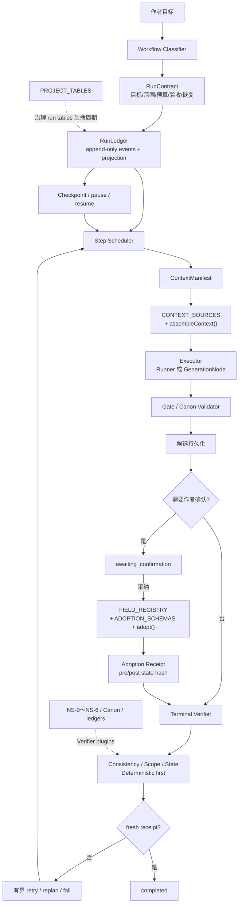
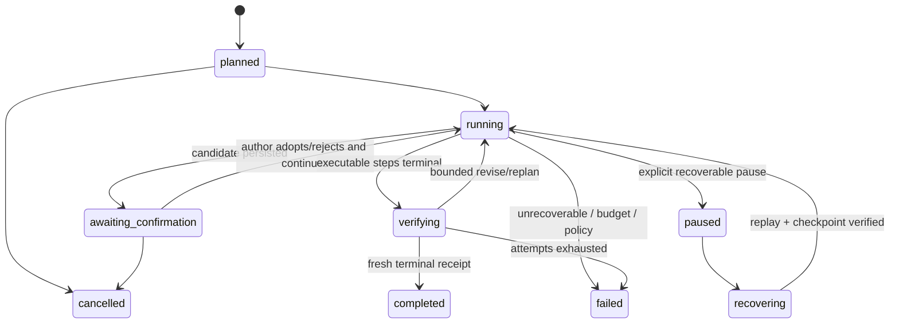

# StoryForge AI Harness 架构研究与工程改造方案

> 状态：提案（PROPOSED），不是已实现能力
>
> 研究截止：2026-08-03
>
> 源码审计基线：[`271fb39f14e37eef324642bf85270fda828b0f52`](https://github.com/yuanbw2025/storyforge/tree/271fb39f14e37eef324642bf85270fda828b0f52)
>
> 目标：在不破坏三注册表和作者数据主权的前提下，把 StoryForge 已有的生成、Canon、Agent、评测和运行时能力统一为可恢复、可验证、可观测的生产级 AI Harness。

## 0. 结论先行

StoryForge 的长期一致性问题，根因已经不再是“缺少一层记忆”。项目已有章节交接、计划—正文对账、时序事实、角色认知、持有物品、检索块、层级摘要、stale 传播和证据化一致性检查。继续增加一套平行向量库、角色记忆表或多 Agent 记忆层，会制造新的事实源和迁移风险，不能解决完成判定与长期运行漂移。

当前真正缺少的是一条统一、持久、可验证的运行闭环：

```text
任务契约
  -> 可恢复运行状态机
  -> 每步上下文/预算/输入快照
  -> 候选、确认与受控写回
  -> 真实 IndexedDB 终态验证
  -> 与输入/输出 hash 绑定的完成回执
  -> 长运行 trace、恢复和 held-out 评测
```

建议新增 `StoryForge Agent Run Harness`，但它必须是现有三注册表之上的控制面，而不是第四套数据通道：

1. AI 读取仍只走 `CONTEXT_SOURCES + assembleContext()`。
2. AI 结构化写回仍只走 `FIELD_REGISTRY + ADOPTION_SCHEMAS + adopt()`；领域生命周期扩展继续显式登记。
3. 新增运行表必须进入 `PROJECT_TABLES`，由注册表派生导出、导入、删除、世界作用域和引用重映射。
4. `GenerationNode + gate + adopt()` 继续承担领域执行；Harness 只增加任务契约、状态、证据和验证，不复制生成链。
5. 默认使用单 Agent 或确定性工作流；只有子任务具备独立验收边界、无共享写冲突且收益可度量时才 fan-out。
6. 模型返回 `final`、领域节点生成候选、或 Agent 自报成功，都不构成任务完成。`completed` 必须由代码侧 verifier 根据真实终态签发 fresh receipt。
7. Claude 5 的提示词瘦身原则应采用，但“自动记忆”不能直接照搬到作者手稿。偏好或工作记忆必须显式、可查看、可删除、受注册表治理。

### 0.1 当前成熟度判断

| 维度 | 当前判断 | 证据摘要 |
|---|---|---|
| 数据与写入治理 | 强 | 58 张 `PROJECT_TABLES`、285 个登记字段、`adopt()`、FK/CAS/迁移/往返反例测试 |
| 上下文治理 | 强 | 45 个 `CONTEXT_SOURCES`、L0–L3、单源和总预算、世界/章节边界、included/omitted/trimmed 证据 |
| 候选与 Canon 分层 | 强 | 候选可编辑、作者确认、下游依赖采纳、写后 Canon 刷新、陈旧快照拒绝 |
| 单轮 Agent 安全 | 中强 | 严格 JSON、只读白名单、参数拒绝、作用域锁、循环和预算停止 |
| 多任务编排 | 中 | 有领域路由、DAG、预算和一次 Canon 打回；任务契约过薄、执行为顺序内存循环 |
| 长运行恢复 | 弱 | conversation/candidate 可刷新查看，但 active run、attempt、checkpoint 和逐步恢复不是正式状态 |
| 完成证明 | 弱 | Runner 接受 `final` 即 `completed`；领域任务成功主要表示候选生成成功，没有统一终态 verifier |
| 长篇效果评测 | 中 | development/held-out、配对 A/B 和泄漏指标已存在；held-out 只有 4 个短夹具，覆盖面和独立性不足 |

### 0.2 不建议做的事

- 不照抄 Kimi K3 的模型内部 KDA、Attention Residual、MoE 或训练系统层级到前端应用。
- 不把 `claw-code` 当成经过独立验证的生产框架；其 README 明确说它是展示品。
- 不先增加更多领域 Agent，再补验证和恢复。Agent 数量不是成熟度指标。
- 不让同一个生成模型在同一上下文里同时担任生成者、唯一裁判和完成签发者。
- 不把 `agentEvents.payload` 继续扩成无边界运行时 JSON，混淆用户可见对话和机器运行账本。
- 不用自动摘要、embedding、LLM observation 覆盖 Canon，不自动级联重写作者正文。
- 不以“上下文窗口更大”代替检索、时序过滤、证据回查和终态验证。

## 1. 研究口径与证据等级

本文将“事实”“工程推断”和“采用建议”分开：

| 等级 | 定义 | 本文如何使用 |
|---|---|---|
| A | 官方技术报告、正式论文、官方工程文章、源码中的可执行契约 | 可作为事实依据；仍检查适用边界和实验限制 |
| B | 官方仓库 README、设计说明、源码与测试，但未经第三方生产验证 | 可证明实现了什么，不能证明宣传的效果或成熟度 |
| C | 社区 Harness 的自述、benchmark、stars、社交媒体或二手解读 | 只作为候选机制和检索线索，不单独支持效果结论 |
| D | 本文基于外部机制与 StoryForge 源码作出的工程推断 | 必须在路线图中转化为可证伪指标，不冒充既成事实 |

关键术语：

- **模型架构**：模型参数、注意力、MoE、训练和推理基础设施。
- **Agent Harness**：围绕模型的工具接口、系统提示、上下文策略、技能、记忆、预算、状态、恢复、验证和观测系统。
- **工作流**：针对某类任务选择的步骤拓扑。工作流是 Harness 的运行配置，不等于 Harness 全部。
- **Run ledger**：任务执行事实和证明流，不是作品事实、角色记忆或用户对话。
- **Verifier**：独立于 Agent 自报的终态判定器；优先用确定性代码，必要时才用受约束语义裁判。
- **Receipt**：verifier 针对特定 contract/input/output/state hash 签发的完成证据；源或状态变化后必须 stale。

### 1.1 可复核快照

- StoryForge 源码结论固定在 commit `271fb39f14e37eef324642bf85270fda828b0f52`。若远端链接因权限或 commit 尚未推送而不可见，在本地运行 `git show 271fb39f -- <path>` 可查看同一版本。
- 本文核验的社区仓库快照为：Claw Code `4ea31c1b`、LazyCodex `fb48ddc4`、oh-my-openagent `55ea9490`、Gajae-Code `38e026c7`、AgentENV `281a8bd0`；支撑关键结论的文件链接均固定到这些 commit。
- 三注册表数量按 TypeScript 数组声明的 AST element 数复算，并与注册表测试交叉检查；不使用 README、路线图或正则命中数替代运行时声明。
- 官方网页和论文在 2026-08-03 核验；对会更新的官方网页保留核验日期，对论文保留 arXiv ID，对可变社区源码固定 commit。

## 2. 外部架构研究

### 2.1 `claw-code`：应该研究生成它的 Harness，不应照搬展示仓库

`ultraworkers/claw-code` 的 [README](https://github.com/ultraworkers/claw-code/blob/4ea31c1bc91c4e9bcbd67d51c550c01e127e6d0d/README.md) 明确写道：

> “Claw Code is not the serious production project here.”

它把自己定位为 “museum exhibit”，并指向 [LazyCodex](https://github.com/code-yeongyu/lazycodex/tree/fb48ddc4bc8be02a0cfe0a509a30cf3543edf72a) 和 [Gajae-Code](https://github.com/Yeachan-Heo/gajae-code/tree/38e026c785968e722e5b3a1b8025cadfc54c8c84) 作为真正应研究的 Harness。这一点必须覆盖 stars、宣传语和二手文章带来的成熟度错觉。

不过，`claw-code` 的 Rust 源码包含两类可迁移的工程契约：

1. [`TaskPacket`](https://github.com/ultraworkers/claw-code/blob/4ea31c1bc91c4e9bcbd67d51c550c01e127e6d0d/rust/crates/runtime/src/task_packet.rs) 把 objective、scope、worktree、branch policy、acceptance criteria、resources、permission profile、reporting、recovery 和 verification plan 放进类型化任务包，并对缺失字段 fail-closed。
2. [`GreenContract`](https://github.com/ultraworkers/claw-code/blob/4ea31c1bc91c4e9bcbd67d51c550c01e127e6d0d/rust/crates/runtime/src/green_contract.rs) 区分 targeted/package/workspace/merge-ready，merge-ready 除测试通过外还要求命令来源、基线新鲜度和恢复上下文；已知 blocking flaky 仍会阻断完成。

可迁移结论是“任务与完成必须契约化、证据化”，不是复制它的 tmux/Discord/多进程形态。

### 2.2 LazyCodex / OmO：项目地图、持久进度和角色分工有价值，宣传指标需降级

[LazyCodex](https://github.com/code-yeongyu/lazycodex/tree/fb48ddc4bc8be02a0cfe0a509a30cf3543edf72a) 是 [oh-my-openagent](https://github.com/code-yeongyu/oh-my-openagent/tree/55ea9490b70b2f2017077e3f78d4bf7db3555bc8) 的 Codex 分发层。其公开能力包括：

- 分层 `AGENTS.md` 项目地图；
- 只规划不修改的 `$ulw-plan`；
- 持久执行计划的 `$start-work`；
- 循环到独立角色验证完成的 `$ulw-loop`；
- explorer、planner、critic、reviewer 等专门角色；
- 按任务类型和成本路由模型；
- skills、hooks 和安装诊断。

对 StoryForge 的价值是：上下文地图、计划/执行分离、持久进度、独立审查和成本纪律。其 README 中的 benchmark、stars 和“唯一 Harness”等措辞不是独立实验，不能用于承诺 StoryForge 的效果。

### 2.3 Gajae-Code：durable goal、ledger、fresh receipt 是最有价值的社区实现

[Gajae-Code](https://github.com/Yeachan-Heo/gajae-code/tree/38e026c785968e722e5b3a1b8025cadfc54c8c84) 自称 experimental/beta。其 `deep-interview -> ralplan -> ultragoal` 流程强调先澄清、再计划、证据化执行，必要时才并行。

[`ultragoal/SKILL.md`](https://github.com/Yeachan-Heo/gajae-code/blob/38e026c785968e722e5b3a1b8025cadfc54c8c84/packages/coding-agent/src/defaults/gjc/skills/ultragoal/SKILL.md) 中最值得迁移的不是 CLI，而是以下不变量：

- `goals.json` 是目标与状态事实源；`ledger.jsonl` 是 checkpoint、receipt、blocker、steering、review 的证明流。
- 行内或模型自报状态不构成完成证明；完成只依据 durable state 和 fresh receipt。
- receipt 绑定变更集和 source hash；目标或源码变化会使旧证据失效。
- pause/resume、损坏恢复、失败重试和 blocker 分类是正式状态。
- 多审查 lane 必须针对同一冻结 `sourceHash` 并在 checkpoint 前 join。
- 并行仅用于真正独立、可分别验收且无共享文件冲突的子域。

StoryForge 不应复制其重型 goal CLI、tmux 团队和多层 review ceremony。应把“durable state + fresh receipt + frozen input”缩减成浏览器本地应用所需的最小实现。

### 2.4 Claude 5 上下文工程：从堆规则转向设计环境

Anthropic 官方文章 [The new rules of context engineering for Claude 5](https://claude.com/blog/the-new-rules-of-context-engineering-for-claude-5-generation-models) 与用户截图中的六项变化一致：

| 旧方式 | 新方式 | StoryForge 采用方式 |
|---|---|---|
| 给大量规则 | 给判断原则 | 根 `AGENTS.md` 保留宪法与三注册表，任务细节按路由读取 |
| 给工具调用示例 | 设计清晰接口 | 严格 schema、明确参数、错误提示和状态，让正确动作成为最容易动作 |
| 一次性注入全部上下文 | 渐进披露 | 用 `sourceKeys`、层级预算和按需工具加载，不默认全量 assemble |
| 系统提示和工具描述重复 | 简化工具说明 | 每条规则只有一个权威归属，工具描述聚焦用途、参数和失败语义 |
| 手工把记忆写进项目说明 | 自动记忆 | 只迁移为受治理、可审查的偏好/工作记忆；作者手稿不得静默写入 |
| 只给 Markdown 规格 | 丰富参考 | 提供真实代码、测试、fixture、页面、rubric 和可交互产物 |

官方披露的“删除超过 80% system prompt 且内部编码评测未见损失”只适用于 Claude Code 的 system prompt，不包括 `CLAUDE.md`、skills、用户历史或 StoryForge 的完整输入，也不能直接外推为本项目可以删 80%。StoryForge 必须用自己的 A/B 和非劣效门槛决定瘦身幅度。

Anthropic 的 [A harness for every task](https://claude.com/blog/a-harness-for-every-task-dynamic-workflows-in-claude-code) 说明工作流应该按任务动态选择，包括 classify-and-act、fan-out-and-synthesize、adversarial verification、generate-and-filter、tournament、loop-until-done 和 planner-generator-evaluator。这支持“动态 Harness”，但不支持所有任务都使用最多 Agent。

[Harness design for long-running application development](https://www.anthropic.com/engineering/harness-design-long-running-apps) 还给出三类长期失败：提前收工、自我偏好和目标漂移；并用结构化 handoff、上下文 reset、真实浏览器操作和硬阈值 evaluator 缓解。它同时提醒：Harness 的每个组件都编码了对模型能力的假设，这些假设会随模型进步而过期，必须持续消融。

### 2.5 OpenAI Harness Engineering：仓库和可观测性也是产品接口

OpenAI 的 [Harness Engineering](https://openai.com/zh-Hans-CN/index/harness-engineering/) 强调：

- 仓库是记录系统；`AGENTS.md` 应是地图而不是百科全书；
- 规则、文档和实现按渐进披露组织，并用 freshness lint 防止漂移；
- 为 Agent 设计依赖方向、边界解析和带修复指导的 lint；
- worktree、日志、指标、trace 和真实 UI 验证是 Harness 的一部分；
- 人类定义目标与验收，Agent 执行并循环验证。

StoryForge 的 `AGENTS.md + CONTEXT-ROUTING.md + 三注册表检查器` 已经符合这一路线。下一步不应继续扩写入口文档，而应把同样的可追溯性延伸到产品内每次 AI run。

### 2.6 Kimi K3：可迁移的是环境与验证原则，不是模型内部层级

Kimi K3 官方 [发布仓库](https://github.com/MoonshotAI/Kimi-K3/tree/7c5be9599120d7993748de66a76128614f15f210)、[Quickstart](https://platform.kimi.ai/docs/guide/kimi-k3-quickstart) 和 [技术报告](https://github.com/MoonshotAI/Kimi-K3/blob/7c5be9599120d7993748de66a76128614f15f210/k3_tech_report.pdf) 把多个不同层级放在一起；模型与训练对应报告 §2、§4.1，可配置多 Harness 对应 §4.2.1，AET 与多 scaffold 评测对应 §4.2.6–§4.2.7，AgentENV 生命周期对应 §5.3.2，消息和工具协议对应 Appendix F：

- 模型内部：Kimi Delta Attention、Attention Residual、Stable LatentMoE、1M context；
- 训练：长任务 RL、不同 reasoning effort、工具调用和多教师蒸馏；
- Harness 环境：tool interfaces、system prompts、context strategies、skills、memories、subagents；
- sandbox：AgentENV 的隔离、pause/resume、fork、snapshot 和增量 checkpoint；
- 任务与验证：initial state、constrained goal、action space、budget、independent verifier、public/hidden verifier；
- Provider 协议：preserved thinking history、动态 tool declaration、reasoning effort，以及为保持历史 KV cache 稳定而区分 global/one-shot/input options。

固定 commit 的仓库树只有 README、LICENSE、logo 和技术报告 PDF，不包含 Kimi Code、统一白盒 RL 环境或 AgentENV 的实现。README 推荐 Kimi Code CLI 是官方使用建议，不是可审计的 Harness 源码；本文只把报告披露的机制当作设计证据。

因此，“K3 是多层架构”不能直接推导出 StoryForge 也应建立模型层、Agent 层、子 Agent 层和记忆层。真正可迁移的工程原则是：

1. 单一固定 Harness 会导致模型对工具 schema、system prompt 和 context protocol 过拟合；应按任务选择受控配置并做跨配置评测。
2. 成功按 verifier 检查的最终环境状态判定，不按 Agent 自报完成。
3. public verifier 给诊断反馈，hidden verifier 检查未见场景，降低 reward hacking 和评测过拟合。
4. 长任务需要环境状态与模型状态分离保存，支持 pause/resume、fork 和 snapshot。
5. 同一模型在不同 Harness 下成绩不同，模型升级不能替代 Harness 回归。
6. Executor 必须显式协商 provider 的 history、reasoning effort、动态工具和 cache 能力；不能假定所有 OpenAI/Anthropic-compatible API 的多轮协议相同。
7. K3 要求多轮/工具调用原样回传 assistant message，包括 `reasoning_content` 和 `tool_calls`。这类内容若为恢复所必需，只能作为有版本、有保留/删除策略的 opaque provider state；不得进入用户可见对话、通用 run ledger、长期记忆或语义评测证据。
8. 动态加载工具只能从 `RunContract` 已授权的工具全集中按需声明，不能扩大权限或绕过 Tool Registry；context cache 也必须绑定 source/tool/contract/provider hash，cache hit 不能绕过 freshness 检查。

K3 报告中的具体 benchmark 来自不同 Harness、部分内部任务和特定评测配置，本文不把它们当作 StoryForge 效果承诺。

### 2.7 Agent 与长期记忆基础论文

| 来源 | 经验证机制 | 对 StoryForge 的工程价值 | 不应过度外推 |
|---|---|---|---|
| [ReAct](https://arxiv.org/abs/2210.03629) | 推理与行动交错，行动从外部环境取证并更新计划 | 只读巡检和复杂检索可保留 tool-observation 循环 | 不证明长 transcript 自然可靠；仍需预算、循环检测和 verifier |
| [Reflexion](https://arxiv.org/abs/2303.11366) | 从反馈生成语言反思，写入 episodic buffer，不更新权重 | 失败 attempt 可生成受限的下次策略提示 | 自我反思不是独立验证，错误反思不得写 Canon |
| [Generative Agents](https://arxiv.org/abs/2304.03442) | observation、reflection、planning；按 recency/relevance/importance 检索 | 说明记忆应区分原始观察、派生反思和行动计划 | 其模拟人格记忆不是小说 Canon 数据模型 |
| [MemGPT](https://arxiv.org/abs/2310.08560) | 类操作系统的分层虚拟上下文和中断 | 支持把 context window 看作受调度缓存，而非全部知识仓库 | 分层上下文不等于多建事实表；StoryForge 已有正式账本和检索层 |
| [SWE-agent ACI](https://arxiv.org/abs/2405.15793) | Agent-computer interface 设计显著影响任务表现 | 工具 schema、错误恢复、紧凑输出和状态可见性是核心产品设计 | 编码 benchmark 不能直接外推叙事质量 |
| [LongMemEval](https://arxiv.org/abs/2410.10813) | 评测提取、跨会话推理、时序、知识更新和 abstention；将记忆拆为 indexing/retrieval/reading | NS-5 评测要覆盖更新与拒答，不能只测召回 | 对话记忆不等于长篇叙事一致性 |
| [LoCoMo](https://arxiv.org/abs/2402.17753) | 约 300 turns、9K tokens、最多 35 sessions 的时序/因果长期记忆 benchmark | 补充跨会话、因果和事件摘要评测方法 | 规模仍远小于百万字作品，且任务形态不同 |

### 2.8 长篇叙事架构与一致性研究

#### DOME

[DOME](https://arxiv.org/abs/2412.13575) 将粗粒度全局大纲与写作过程中的动态细纲结合，并用时序知识图谱存取已生成内容，再用 Temporal Conflict Analyzer 评估冲突。可迁移点是“宏观目标稳定、局部计划可根据已写事实修订”和“时序冲突单独验证”。StoryForge 已有动态计划、NS-2/NS-4 和历史修改影响分析，不应新建 DOME 的平行 KG；应把其动态细纲思想接到现有 outline/plan reconciliation。

#### CHIRON

[CHIRON](https://arxiv.org/abs/2406.10190) 用 Dialogue、Physical/Personality、Knowledge、Goals 等维度生成角色 sheet，再用推理和专用 entailment 模型过滤不真实事实。可迁移点是“生成角色陈述”和“验证陈述真实性”必须分离。StoryForge 的角色维度、认知账本、存亡和物品账本已覆盖主要数据，不应再建 CHIRON 表；可把 CHIRON 类验证作为角色候选 gate 和长篇评测分类器。

#### Agents' Room

[Agents' Room](https://arxiv.org/abs/2410.02603) 把复杂叙事写作分解给专业角色，并用长叙事评价框架比较。它支持在高复杂度任务中使用角色分工，但没有证明所有故事任务都需要多 Agent。StoryForge 应先按验收边界分类；只有情节、角色、语言等输出可独立生成且能在统一 verifier 汇合时才启用专业 Agent。

#### SuperWriter

[SuperWriter](https://arxiv.org/abs/2506.04180) 使用显式计划与 refinement，并通过 MCTS 和 hierarchical DPO 把最终质量反馈传播到中间步骤。计划—生成—评价—修订对产品 Harness 有价值；MCTS/DPO 属于模型训练方法，前端应用不能直接复制。StoryForge 可做有界一次或两次修订，但必须受预算、证据和作者确认约束。

#### ConStory-Bench / ConStory-Checker

[Lost in Stories](https://arxiv.org/abs/2603.05890) 提供当前最直接相关的长篇一致性证据：

- 2,000 prompts，四种任务，目标输出 8,000–10,000 words；
- 五类、19 子型：时间线/情节、角色、世界/设定、事实/细节、叙事/风格；
- 方法章节定义四步 checker：分类提取、矛盾配对、证据链、带精确字符 offset 的 JSON 报告；论文图注把前三步称为核心检测 pipeline，因此“3 阶段”和“4 阶段”是口径差异，不是两个实现；
- 错误随长度增加，事实与时间错误突出，矛盾位置多聚集在全文 40%–60%，地理/时间更偏远距，风格错误更局部；
- error-bearing span 的 entropy 较高，但只在两个可复现实验模型上验证，适合作为触发信号，不适合作为错误判定器。

论文也明确限制：英文与西方叙事、二元一致/矛盾判断，不能区分惊奇结局、延迟揭示等作者有意安排。StoryForge 若采用 taxonomy，必须增加中文网文、作者意图和不可靠叙述者校准，不能把所有表面矛盾自动升级为 hard error。

## 3. StoryForge 当前能力审计

### 3.1 三注册表规模与边界

审计基线 `271fb39` 的静态事实：

| 单一事实源 | 数量 | 已有保障 | 审计结论 |
|---|---:|---|---|
| `CONTEXT_SOURCES` | 45 | L0–L3、protected、单源预算、总预算、scope requirements、included/omitted/trimmed | 保留并扩展运行证据，不建第二套 retrieval/context API |
| `FIELD_REGISTRY` | 285 个字段 | 类型、别名、枚举、sanitize、未知字段与类型错误 | 所有新的 AI 业务写入继续登记；运行时账本本身不是 AI 业务字段 |
| `ADOPTION_SCHEMAS` | 23 个集合写回 schema | identity、duplicate policy、required、FK、array member、replace scope | 继续作为正式业务写回策略；Harness 不绕过它直接散写 Canon |
| `PROJECT_TABLES` | 58 张表 | owner、world scope、refs、export/remap、defaults、派生生命周期 | 新 run 表必须先登记并补迁移/往返/删除/世界测试 |

数量通过源码声明和现有注册表测试交叉核验，不代表功能全部成熟；它只说明治理覆盖面。

### 3.2 只读 AgentRunner

入口：[`runReadOnlyAgent()`](https://github.com/yuanbw2025/storyforge/blob/271fb39f14e37eef324642bf85270fda828b0f52/src/lib/agent/runner.ts#L174-L333)。

已有能力：

- 模型每轮只能返回一个严格 JSON `tool` 或 `final` 动作；
- 只读工具白名单、顶层/call/arguments 额外字段拒绝；
- project/world scope 来自执行上下文，不由模型提供；
- max steps/tool calls/model tokens/tool-result tokens/protocol errors 有硬上限；
- 同一调用签名重复即停止，批内重复也拒绝；
- 工具结果标记为不可信项目数据，防止手稿中的提示注入；
- 物理上下文不足时拒绝静默裁掉目标或工具证据；
- stop reason 明确区分 completed、budget、protocol、loop、abort 和 model error。

H1 现状（2026-08-08）：`runDurableReadOnlyAgentV1()` 复用同一 Runner 和 Tool Registry，
把模型请求/响应、工具调用/返回和预算结算映射到 durable run；严格 `read-only-audit`
契约的上下文权限由只读工具 source 闭包派生，写集合固定为空。最终答复以 32,000 字符上限的
checkpoint 结果保存，不保存完整 transcript、工具正文或隐藏推理；四个中断边界各 5 次恢复
对照已证明 checkpoint 后不重复模型调用，checkpoint 前按整步重试。模型协议中的
`reason: 'completed'` 仍只表示 Runner 执行成功，账本停在 `paused` 等待 H2 terminal verifier，
不会因此签发 `verification.accepted` 或进入 run `completed`。

### 3.3 主 Agent 与领域执行

入口：[`createMasterAgentPlan()` / `executeMasterAgentPlan()`](https://github.com/yuanbw2025/storyforge/blob/271fb39f14e37eef324642bf85270fda828b0f52/src/lib/agent/orchestrator.ts#L304-L404) 和 [`useMasterCopilot()`](https://github.com/yuanbw2025/storyforge/blob/271fb39f14e37eef324642bf85270fda828b0f52/src/components/agent/useMasterCopilot.ts#L30-L86)。

已有能力：

- 主 Agent 最多调度五个领域，每领域最多一个任务；
- 模型规划失败时有确定性 fallback router；
- 用户授权域限制，描述里出现角色或世界元素不会自动扩大写入；
- DAG 拓扑和循环检查，上游输出可作为下游补充上下文；
- 领域节点复用 `GenerationNode`、output gate、受总预算约束的一次 Canon 打回；
- 团队共享 token/call/retry 预算，不让每个节点各拿满上限；
- 候选持久展示、可编辑，最终采纳重新解析和 gate；
- base snapshot/CAS 防止旧候选覆盖新数据；
- 下游候选在上游候选确认前不能写入；
- 写入复用 `adopt()` 或已登记的受控领域入口。

关键缺口：

1. [`MasterAgentTask`](https://github.com/yuanbw2025/storyforge/blob/271fb39f14e37eef324642bf85270fda828b0f52/src/lib/agent/orchestrator.ts#L87-L97) 只有 `id/agentId/instruction/dependsOn`，没有 scope、允许读写、验收 rubric、预算、失败/恢复策略和验证计划。
2. [`executeMasterAgentPlan()`](https://github.com/yuanbw2025/storyforge/blob/271fb39f14e37eef324642bf85270fda828b0f52/src/lib/agent/orchestrator.ts#L390-L411) 是顺序内存循环；任务事件只有 running/completed/failed，不足以恢复到特定 attempt/step。
3. [`runtimeCandidates`](https://github.com/yuanbw2025/storyforge/blob/271fb39f14e37eef324642bf85270fda828b0f52/src/components/agent/useMasterCopilot.ts#L40-L52) 在 React ref 中，切换 scope 或刷新会清空。系统能从持久候选重建部分写回路径，但不能恢复整个 active run、模型 transcript 和预算。
4. “领域任务 completed”主要表示生成候选成功；需要作者确认的任务应进入 `awaiting_confirmation`，而不是终态完成。
5. 没有统一 terminal verifier，也没有在同一冻结输入/输出 hash 上的独立审查。

### 3.4 上下文装配

入口：[`CONTEXT_SOURCES`](https://github.com/yuanbw2025/storyforge/blob/271fb39f14e37eef324642bf85270fda828b0f52/src/lib/registry/context-sources.ts#L552-L1006) 与 [`assembleContext()`](https://github.com/yuanbw2025/storyforge/blob/271fb39f14e37eef324642bf85270fda828b0f52/src/lib/registry/assemble-context.ts#L33-L104)。

已有能力：

- source key 是统一读取事实源；只读 Agent 工具全部映射正式 source；
- source 按 L0–L3、protected、requirements、enabled 和 budget 受控；
- sourceKeys 支持选择式装配；模型窗口、输出预留和安全边际决定输入上限；
- 世界、章节、outline、simulation session 等作用域由代码检查；
- 返回 included、omitted、trimmed、tokens、before/after over-budget 证据；
- 连续性 source 共用 canonical chapter sequence 和准备快照。

关键缺口不是读取旁路，而是证据粒度：当前 evidence 适合一次上下文请求，但没有统一绑定到 run/step/attempt，缺少每个 source 的内容 hash、scope boundary、reader version 和生成时点。复杂 Agent 也可能先固定组装较大 source 列表，再在模型内决定是否使用；应该把更多 source 延迟到工具或 step 需要时加载。

### 3.5 写回与数据生命周期

入口：[`adopt()`](https://github.com/yuanbw2025/storyforge/blob/271fb39f14e37eef324642bf85270fda828b0f52/src/lib/registry/adopt.ts#L37-L61)、[`FIELD_REGISTRY`](https://github.com/yuanbw2025/storyforge/blob/271fb39f14e37eef324642bf85270fda828b0f52/src/lib/registry/field-registry.ts) 和 [`ADOPTION_SCHEMAS`](https://github.com/yuanbw2025/storyforge/blob/271fb39f14e37eef324642bf85270fda828b0f52/src/lib/registry/adoption-schema.ts#L9-L240)。

已有能力：

- 未登记 target 直接跳过或报错，未知字段、类型、FK 和重复策略均结构化返回；
- record patch 检查项目归属；章节记忆写入使用正文 hash CAS；
- 集合替换在同一事务内“清理旧范围 -> 完整写入”，失败回滚；
- Canon source 写后刷新 assertion source 状态；
- `PROJECT_TABLES` 统一派生项目/世界删除、备份往返和引用重映射。

关键缺口是“adoption receipt”还不是 run 级正式证据。现有 `AdoptResult` 能说明写了哪些 id/fields，但没有统一记录 pre-state hash、post-state hash、contract generation、candidate hash、调用入口和 verifier 结果。Harness 必须在不修改 `adopt()` 权威边界的前提下，把这些数据写入 run ledger。

### 3.6 conversation event 不是 run ledger

[`AgentConversation/AgentEvent`](https://github.com/yuanbw2025/storyforge/blob/271fb39f14e37eef324642bf85270fda828b0f52/src/lib/types/agent-session.ts) 当前服务用户可见的消息、计划、任务、候选、确认和错误：

```text
message | plan | task | candidate | confirmation | error
```

这套模型适合前台历史，也已进入 `PROJECT_TABLES`，支持导出、导入、删除和世界 remap。但它缺少 run identity、contract generation、step、attempt、checkpoint、receipt、verification、pause/resume、recovery 和 fail-closed projection。其 payload 是版本化 JSON 字符串，解析失败会返回 fallback；对 UI 历史合理，对完成状态投影过于宽松。

结论：保留 conversation/events 作为人类可见记录；新增专用 run 表，通过可选 `conversationId` 关联。不要把两种职责继续混在同一个宽松 payload 中。

### 3.7 可复用的仓库内先例

StoryForge 已经有两套比外部社区框架更贴近本项目的数据模式：

1. [`nodeRuns`](https://github.com/yuanbw2025/storyforge/blob/271fb39f14e37eef324642bf85270fda828b0f52/src/lib/registry/project-tables.ts#L304-L321) 保存逐节点输入快照、结果、错误和确认，保证刷新后可见。
2. [`simulationSessions/events/checkpoints`](https://github.com/yuanbw2025/storyforge/blob/271fb39f14e37eef324642bf85270fda828b0f52/src/lib/registry/project-tables.ts#L323-L363) 已实现严格追加事件、`[sessionId+sequence]` 唯一约束、事件回放、状态 hash、checkpoint 校验、分支和生命周期；[`verifySimulationCheckpoint()`](https://github.com/yuanbw2025/storyforge/blob/271fb39f14e37eef324642bf85270fda828b0f52/src/lib/simulation/runtime.ts#L541-L554) 会将重放状态与 checkpoint 内容/hash 对比。

Run Harness 应复用这两种模式，而不是把 Gajae 的 JSONL 或 K3 的 microVM 概念原样搬进浏览器。

### 3.8 长期一致性引擎

[`MASTER-BLUEPRINT §16`](./MASTER-BLUEPRINT.md#十六长期一致性引擎ns-0ns-6--2026-06-23-定稿) 已建立完整路线：

- NS-0：development/held-out、配对 A/B、泄漏与召回阈值；
- NS-1：chapter handoff、summary、hash/CAS、规范章序、未来/错世界隔离；
- NS-2：计划—正文动态对账；
- NS-3：Fast Guard / Deep Audit 与证据链；
- NS-4：Observation/Canon、时序事实、异常状态和数据生命周期；
- NS-5：关键词/embedding 混合检索、硬过滤、层级摘要；
- NS-6：历史修改 stale 传播和影响分析；
- 认知账本、持有物品、角色生命周期和故事线进度已形成额外硬约束。

因此 Harness 只负责在正确时点调用并验证这些能力：preflight、候选后、采纳前、写后。它不能另建“长期记忆服务”取代 NS-0～NS-6。

### 3.9 一致性 Agent

[`consistency-agent.ts`](https://github.com/yuanbw2025/storyforge/blob/271fb39f14e37eef324642bf85270fda828b0f52/src/lib/agent/consistency-agent.ts) 已有：

- background 零 token 确定性检查；
- fast/deep 最多一次模型调用；
- 正文 hash 与 `assembleContext()` source evidence；
- 认知、存亡、物品等代码判定；
- 模型引文回查原文；
- 结果持久化、同章/同 hash/同模式去重和 stale 检查。

缺口是它仍是只读报告候选，没有绑定主 run terminal state，也没有跨多个章节的分段 checkpoint、远距 contradiction pair 或修复后的 fresh receipt。最合理的演化是让它成为 `VerifierPlugin`，保留当前只读边界。

### 3.10 NS-0 评测现状

当前 `src/lib/evals/long-consistency` 有 17 个 development 和 4 个 held-out 合成夹具，覆盖 completion/continuation/expansion、事实、约束、未来泄漏、错世界泄漏和语义裁判。结果保存在 browser `localStorage`，held-out 只显示 aggregate。

主要局限：

- fixture 用“关键事实 + 40 句长尾填充”验证 NS-1 的前文携带能力，不是 8,000–10,000 词完整长篇；
- 未覆盖 ConStory 五类/19 子型、全文中段和远距地理/时间专项；
- 当前配置模型既可能生成又可能裁判，存在相关性偏差；
- 结果不是带 benchmark/version/model/prompt/hash 的可导出版本化 artifact；
- 不测进程中断、刷新恢复、trace 完整性、预算越界恢复和多 Harness 对照；
- 没有统一 evidence span + character offset schema。

## 4. 入口 -> 读写 -> 生命周期 -> 调用方 -> 测试闭包

| 能力 | 入口 | 读取 | 写入 | 生命周期/调用方 | 现有测试与缺口 |
|---|---|---|---|---|---|
| 只读 Agent | `runReadOnlyAgent` + `runDurableReadOnlyAgentV1` | Tool Registry -> `CONTEXT_SOURCES` -> `assembleContext()` | 无业务写入；标准 usage log + run ledger/checkpoint | 首次执行可返回内存 transcript；恢复只读取有界结果 checkpoint | `R-AGENT1-readonly-runner`、`R-HARNESS1-readonly-durable-runner` 覆盖安全/预算/四边界恢复/篡改；仍缺 H2 terminal verifier |
| 主 Agent 规划 | `createMasterAgentPlan` | `read_project_status` | plan event | `useMasterCopilot` | `R-AGENT2` 覆盖路由、授权、DAG；缺完整 RunContract 和持久 attempt |
| 领域执行 | `executeMasterAgentPlan` | 各领域 context profile + 正式 sources | 仅生成候选 | `GenerationNode`、team budget、candidate event | `R-AGENT1-*`、`R-AGENT4`；缺 checkpoint/resume 和统一 completion |
| 候选采纳 | `adoptMasterCandidate` | base/current snapshot、上游确认 | `adopt()` 或登记入口 | confirmation event、Canon refresh | 覆盖 stale、依赖、gate；缺统一 adoption receipt/post-state verifier |
| 上下文 | `assembleContext` | 45 个正式 source | 无 | 所有生成/工具调用方 | registry/context/budget/world tests；缺 step manifest/hash |
| 长期一致性 | chapter memory、NS-2～NS-6 | 章节、Canon、ledger、retrieval | 候选或 `adopt()` | chapter/character/world 生命周期 | NS-1～NS-6 回归丰富；缺 run 级强制组合与长文 taxonomy |
| 一致性 Agent | background/fast/deep | 正式 context + 原文证据 | 只写 Agent 报告事件 | conversation/events | `R-AGENT6` 覆盖零 token、引文、stale；缺 terminal receipt 和跨章修复循环 |
| 自由节点 | Node run | 正式 sources/RAG selection | 确认后 `adopt()` | `nodeFlows/nodeRuns` 已注册 | `R-FLOW2/R-RAG1`；可复用 input/output snapshot 设计 |
| 模拟运行时 | simulation runtime | 冻结 Canon snapshot | 独立 runtime event，不反写 Canon | 3 表完整生命周期 | `R-SIM1` 覆盖回放/hash/分支/删除；可复用 event/checkpoint 模式 |
| NS-0 eval | settings panel/runner | 冻结 fixtures + 生产 builders | localStorage 结果 | 浏览器本地 | 专项测试覆盖 A/B 和阈值；缺版本化 artifact、长篇/恢复/过程评测 |

## 5. 差距矩阵与采用决策

| 优先级 | 外部机制 | StoryForge 已有 | 真实缺口 | 决策 | 主要落点 | 风险与验证 |
|---|---|---|---|---|---|---|
| P0 | TaskPacket / AET task spec | `MasterAgentTask` + 用户授权域 | 无验收、允许资源/写入、恢复和验证计划 | 采用精简 `RunContract` | `agent/run/contract.ts`、orchestrator adapter | schema fail-closed；反例拒绝越界读写和空 acceptance |
| P0 | Final-state verifier | gate、Canon validator、一致性报告 | `final`/候选成功可被当完成 | 采用统一 terminal verifier | Runner、GenerationNode adapter、`agent/run/verifier.ts` | property test：无 fresh receipt 永不 completed |
| P0 | Durable ledger | conversation event、nodeRuns、simulation event | active run/attempt/checkpoint 不可恢复 | 新建 run/events/checkpoints 三表 | schema、types、`PROJECT_TABLES` | 旧库迁移、崩溃点恢复、序列竞争、导入导出/删除 |
| P0 | Fresh receipt | CAS、正文/报告 hash | 没有 contract/source/output/post-state 全链 hash | 采用 verification/adoption receipt | event payload + verifier | 任一 hash 改变 100% stale；旧 receipt 不能签发完成 |
| P1 | Context manifest | included/omitted/trimmed/tokens | 未绑定 run/step/attempt，缺 source hash | 增加 manifest event，不建 context 表 | `assembleContext` evidence adapter | 不持久化不必要全文；hash/作用域/版本可核查 |
| P1 | Pause/resume/snapshot | candidate history、simulation checkpoints | active plan 和预算不能续跑 | 采用浏览器级 checkpoint/replay | run projection/checkpoint | 刷新、关闭、异常 JSON、缺事件、重复事件反例 |
| P1 | Public/hidden verifier | development/held-out NS-0 | runtime 诊断与 release gate 未系统分离 | 采用双层评测，不把隐藏标签给 Agent | eval runner/artifact | 防 label leakage；相同 model judge 偏差分层报告 |
| P1 | 独立审查/frozen hash | 一次 Canon retry | 审查可能针对不同输入代际 | 高风险任务采用 verifier generation + frozen hash | verifier receipt | 修订后旧 verdict 必须失效；同代审查 join |
| P1 | Dynamic Harness | 固定主 Agent + 确定性 fallback | 任务类型和工作流形态绑定过紧 | 采用 classifier + 有界 workflow catalog | `workflow-classifier.ts` | 分类可解释；简单任务成本/延迟不得明显回退 |
| P2 | Fan-out/specialists | 最多五领域、顺序 DAG | 没有独立验收与写冲突判定 | 条件采用，默认关闭并行写 | orchestrator scheduler | 只有 read-only 或独立候选并行；共享 Canon 写入串行 |
| P2 | Reflexion/revise loop | 一次 Canon 打回 | 失败策略未按错误类型持久化 | 采用最多 1～2 次 evidence-bound retry | attempt events | 预算上限、相同错误循环检测、不能自评完成 |
| P2 | DOME dynamic outline | outline、plan reconciliation、影响分析 | run 内计划调整没有正式 steering event | 采用显式 replanning，不新建 KG | outline + run steering | 只改未来候选；作者确认；旧 plan generation stale |
| P2 | CHIRON generate/validate | 角色字段、知识/状态账本 | 角色陈述验证未统一成 verifier | 采用 validator 分类，不建角色 sheet 表 | consistency/canon verifier | entailment 只给候选；原文证据回查 |
| P3 | ConStory checker | NS-3、一致性 Agent | 缺 19 子型、跨章 pair、字符 offset 统一格式 | 分阶段采用评测与 deep audit plugin | eval + consistency | 中文/作者意图校准；hard precision 优先 |
| 不采用 | K3 模型内部多层/KDA/MoE | 浏览器应用无模型训练层 | 层级不对应 | 不采用 | 无 | 防止概念误植 |
| 不采用 | Gajae 完整 goal CLI/tmux ceremony | IndexedDB/UI 已有产品状态 | 过重、用户不可见收益低 | 只迁移不变量 | 无 CLI 复制 | 每个阶段做复杂度消融 |
| 不采用 | 无条件 auto-memory | `userStyleProfiles`、正式 Canon/ledger | 隐私、污染和不可解释写入 | 不直接采用 | 偏好必须 opt-in + preview + delete | 备份/导出/删除和错误偏好反例 |

## 6. 目标架构：StoryForge Agent Run Harness



### 6.1 `RunContract`

`RunContract` 是任务身份和授权边界，不是大段 prompt。建议的最小类型：

```ts
interface AgentRunContractV1 {
  version: 1
  objective: string
  workflowKind:
    | 'direct-generation'
    | 'read-only-audit'
    | 'plan-execute'
    | 'generate-verify-revise'
    | 'multi-domain-sequential'
    | 'long-running-resumable'
  scope: {
    projectId: number
    worldGroupId: number | null
    chapterIds?: number[]
    outlineNodeIds?: number[]
  }
  permissions: {
    contextSourceKeys: string[]
    writeTargets: Array<{
      table: string
      fields: string[]
      mode: 'none' | 'candidate-only' | 'author-confirmed'
    }>
  }
  budget: {
    maxModelCalls: number
    maxToolCalls: number
    maxInputTokens: number
    maxOutputTokens: number
    maxAttemptsPerStep: number
    maxToolResultTokens?: number
    maxProtocolErrors?: number
  }
  acceptance: AcceptanceCriterionV1[]
  verificationPlan: VerificationStepV1[]
  failurePolicy: {
    onProtocolError: 'retry' | 'fail'
    onVerificationFailure: 'revise' | 'replan' | 'fail'
    onStaleInput: 'restart-step' | 'pause-for-author'
  }
}
```

约束：

- `contextSourceKeys` 必须全部存在于 `CONTEXT_SOURCE_BY_KEY`；空或未知 key fail-closed。
- `writeTargets.table/fields` 必须分别存在于 `PROJECT_TABLES` 和 `FIELD_REGISTRY`；只读任务必须是空写集。
- 运行时仍从当前工作区注入 project/world，不能信任模型回传 scope。
- contract JSON 使用规范化序列化后计算 `contractHash`；replan 产生新 generation 和新 hash，旧 step/receipt 不再可用于完成。
- acceptance 使用小型 typed predicate catalog，不执行模型生成的脚本或表达式。

### 6.2 状态机



不变量：

1. 只有 `verification.accepted` 事件可以把 projection 变成 `completed`。
2. `candidate.persisted` 只进入 `awaiting_confirmation`，除非 contract 明确是 candidate-only 任务。
3. `paused` 必须有可恢复 checkpoint 或明确 human dependency；关闭页面不等于 fail。
4. `failed` 保留最后成功 checkpoint、错误分类和可重试边界。
5. projection 永远从严格事件回放得到；未知 event version、序列缺口、scope 不匹配或 hash 错误均 fail-closed 到 `recovery_required`，不能乐观完成。

### 6.3 `RunLedger`

建议的核心事件，不要求第一阶段一次实现全部：

```text
run.created
contract.accepted | contract.revised
step.scheduled | step.started | step.succeeded | step.failed
context.assembled
model.requested | model.responded
tool.called | tool.returned
candidate.persisted | candidate.staled
confirmation.recorded
adoption.started | adoption.committed | adoption.rejected
verification.started | verification.accepted | verification.rejected
checkpoint.created | recovery.started | recovery.completed
budget.reserved | budget.settled | budget.exhausted
run.paused | run.cancelled | run.failed
```

事件 payload 必须有 runtime schema/version。与 `parseAgentEventPayload(..., fallback)` 不同，影响状态投影的 run event 解析失败必须中止投影。大文本不应在每个事件重复保存；保存业务记录引用、稳定 hash、必要短摘和调用统计，敏感全文继续留在原业务表。

### 6.4 `ContextManifest`

每次 step 实际装配后写一个 manifest event：

```ts
interface ContextManifestV1 {
  version: 1
  runId: number
  stepId: string
  attempt: number
  scope: { projectId: number; worldGroupId: number | null }
  inputBudget: number
  totalInputTokens: number
  sources: Array<{
    key: string
    status: 'included' | 'omitted' | 'trimmed'
    contentHash?: string
    tokens: number
    boundary?: { chapterId?: number; throughChapterId?: number }
    readerVersion?: string
  }>
  manifestHash: string
}
```

正文全文不复制进 manifest。`contentHash` 基于实际传给模型的标准化片段，`boundary` 记录时间/世界过滤边界。这样可以回答“这次模型究竟看到了什么”，也可以在源变化时精确 stale，而不是把所有历史证据作废。

### 6.5 Executor

Executor 只编排现有执行原语：

- `read-only-audit` 复用 `runReadOnlyAgent()` 和 Tool Registry；
- 结构化创作复用 `GenerationNode.prepare/generate/gate/adopt`；
- 主 Agent 多领域任务继续使用现有领域 copilot 和 team budget；
- 章节记忆、事实抽取和一致性检查继续使用 NS 模块；
- 每次模型调用先 reserve budget，返回或失败后 settle，并持久化 attempt evidence；
- retry 必须引用 verifier 的具体 failure code 和 evidence，不允许只让模型“再试一次”。

Harness 不直接查询 IndexedDB 业务表拼 prompt，也不直接更新业务记录。

Provider 差异由 Executor adapter 处理，不写进领域 prompt。每次 attempt 在执行前解析并记录不可变的 execution binding：`provider`、`model`、`adapterVersion`、`capabilityProfileHash`、`reasoningEffort` 和 `toolSchemaSetHash`。建议 capability profile 至少声明：

```ts
interface ProviderCapabilityProfileV1 {
  version: 1
  historyMode:
    | 'content-only'
    | 'preserved-assistant-message'
    | 'provider-managed'
  reasoningEfforts: Array<'low' | 'medium' | 'high' | 'max'>
  dynamicToolDeclaration: boolean
  contextCache: 'none' | 'explicit' | 'provider-managed'
}
```

- workflow 依赖的能力不满足时在发起调用前 fail-closed，不靠 prompt 猜测兼容性；
- 动态 tool declaration 只优化已授权工具的披露时点，实际调用仍逐次经过 contract 和 Tool Registry 校验；
- preserved assistant message 若是 resume 必需状态，checkpoint 只保存受生命周期治理的 opaque adapter payload 或引用；普通事件只记录 hash、大小、协议版本和调用统计；
- cache key 至少绑定 provider/model/adapter/chat-template 版本、contract generation、context manifest、工具 schema 集和 reasoning effort；任一绑定项变化即 miss；
- trace、导出和调试 UI 默认不展示隐藏 reasoning，语义 verifier 也不得把它当作作品事实或完成证据。

### 6.6 Verifier 与 receipt

Verifier 按以下顺序执行：

1. **Protocol**：输出 schema、required fields、无未知字段。
2. **Scope**：只读 source 和业务写入都在 contract 授权内；project/world/chapter 边界一致。
3. **Freshness**：base snapshot、context manifest、candidate、contract generation 未变化。
4. **Adoption**：需要写入时，确认 event 存在，`AdoptResult` 完整，目标记录属于项目，post-state 可读。
5. **Deterministic domain invariants**：FK、章序、未来/错世界、引用回查、存亡/物品/认知/时序规则。
6. **Semantic rubric**：只有文学质量、动机、因果等无法确定性判断的项目才调用独立 verifier；结果只能在明确阈值和证据结构下通过。
7. **Terminal acceptance**：所有 required criterion 均有 fresh evidence，才签发 receipt。

建议 receipt：

```ts
interface VerificationReceiptV1 {
  version: 1
  runId: number
  generation: number
  contractHash: string
  contextManifestHashes: string[]
  candidateHashes: string[]
  adoptionEventIds: number[]
  postStateHash: string
  verifierSetVersion: string
  semanticVerifier?: {
    provider: string
    model: string
    promptVersion: string
  }
  criteria: Array<{
    id: string
    status: 'passed' | 'failed'
    evidenceRefs: string[]
  }>
  acceptedAt: number
  receiptHash: string
}
```

receipt freshness 规则：contract generation、任一 manifest/candidate/adoption/post-state/verifier version 变化，旧 receipt 立即无效。语义 verifier 不能覆盖确定性失败；没有精确引文回查的冲突不得作为 hard failure。

### 6.7 Workflow Classifier

建议先做代码可解释的分类器，模型只在歧义时提供候选，最终工作流由代码校验：

| 工作流 | 使用条件 | 默认结构 | 完成条件 |
|---|---|---|---|
| direct generation | 单领域、单候选、作者确认 | prepare -> generate -> gate -> wait | 候选确认写入 + post-state receipt |
| read-only audit | 不写业务表、需要多步取证 | ReAct tool loop | grounding/coverage verifier receipt |
| plan-execute | 目标需要多步但验收共享 | contract -> sequential steps | 全部 step + terminal receipt |
| generate-verify-revise | 有可执行 rubric、一次生成风险高 | generate -> verify -> bounded revise | fresh pass 或 attempts exhausted |
| multi-domain sequential | 多领域有数据依赖或共享 Canon | DAG 串行生成/确认 | 每个依赖确认 + terminal receipt |
| long-running resumable | 多次调用、可能刷新/中断 | checkpointed step loop | replay verified + terminal receipt |
| fan-out-synthesize | 子任务只读或候选独立，验收可拆 | parallel leaves -> frozen join | 每叶 receipt + 同代 synth verifier |

fan-out 必须同时满足：

- 子任务没有共享业务写入；或所有输出都只是独立候选，最终写入仍串行确认；
- 每个子任务有独立 acceptance criterion；
- 合并器能在冻结 generation 上验证全部输入；
- 预计收益高于额外 token、延迟、冲突和上下文重建成本。

否则使用单 Agent/顺序 DAG。

### 6.8 数据模型选择

#### 方案 A：扩展 `agentConversations/agentEvents`

优点：少加表，UI 已有读取路径。缺点：把人类对话、候选、机器 trace、预算、checkpoint 和 verifier 混在宽松 payload；投影需要兼容历史 UI 事件；大 trace 会污染项目备份和前台读取。

#### 方案 B：新增 `agentRuns/agentRunEvents/agentRunCheckpoints`（推荐）

职责：

- `agentRuns`：run identity、conversationId 可选关联、scope、workflow、status projection、contract/hash、generation、时间；
- `agentRunEvents`：严格追加、`[runId+sequence]` 唯一、event kind/version、step/attempt、payload/hash；
- `agentRunCheckpoints`：throughSequence、projection JSON/hash、恢复元数据。

推荐理由：

- 与 `simulationSessions/events/checkpoints` 的成功模式一致；
- conversation 保持用户友好，run ledger 可以 fail-closed；
- 运行 trace 可独立设置导出/压缩/保留策略；
- checkpoint 和状态回放有清晰事务边界；
- 未来不同入口（主 Agent、节点、章节整理、长篇审计）可共享 run，而不强行共享 UI conversation。

注册建议：

- 三表都先加入 `PROJECT_TABLES`；`agentRuns` world-scoped、exportable、exportIdField；events/checkpoints 通过 run 引用 remap，run 删除 cascade；
- `conversationId` 若存在，映射到 `agentConversations`，缺失时置 null，不能因此丢 run；
- 具体 Dexie 版本使用实施时的下一个可用版本，不在本文预占版本号，避免与并行 SIM 工作冲突；
- 迁移只建空表，不追认历史 conversation 为可恢复 run，也不伪造旧 receipt；
- 大体积、可重建 model transcript 和 opaque provider state 是否导出，在 H0 用真实体积、恢复需求与敏感性测量后决定；必须显式登记保留、导出和删除策略，不能随 run event 静默进入备份。contract、状态、receipt 和必要证据必须可移植。

### 6.9 与前台对话的关系

```text
AgentConversation 1 ---- 0..n AgentRun
AgentRun          1 ---- n    AgentRunEvent
AgentRun          1 ---- n    AgentRunCheckpoint
AgentEvent(candidate/confirmation) <-- optional refs --> AgentRunEvent
```

前台仍展示简洁消息、计划、候选、确认和错误。调试/高级视图按需展示 run 状态、步数、预算、来源和 verifier，不把内部思维链或敏感全文暴露给 UI。provider 为续轮所需的 preserved thinking 仍属于传输状态，不因本地保存而升级为产品记忆或可展示 trace。

### 6.10 提示词与上下文瘦身

按 Claude 5 规则落地，但以 StoryForge A/B 为准：

1. `AGENTS.md` 继续作为地图；任务专项规则只在 `CONTEXT-ROUTING` 命中后加载。
2. 系统 prompt 只保留角色、全局不变量、动作协议和终止原则；领域细节由 interface/schema/rubric 表达。
3. 工具描述只写用途、关键参数、返回/失败语义，不重复系统 prompt 的安全规则。
4. 复杂任务先给 tool catalog 的紧凑索引，具体 source/skill/tool schema 延迟到选中后加载；provider 支持动态 tool declaration 时也只能声明 contract 已授权子集。
5. examples 只保留边界案例；常规调用靠 schema 和错误信息引导。
6. “丰富参考”优先给现有代码、测试、fixture、页面结构和 rubric，不用更多自然语言复述同一规则。
7. 自动记忆只允许两类：显式确认的作者偏好和可删除的 run 恢复摘要。作品事实继续归 Canon/ledger，不能由 auto-memory 改写。
8. 每个 prompt/tool/skill 记录 owner、version、适用模型、最后验证日期和对应 eval；freshness lint 阻止失效说明长期驻留。

## 7. 长期一致性如何接入 Harness

### 7.1 四个验证时点

| 时点 | 目的 | 复用能力 | 失败处理 |
|---|---|---|---|
| preflight | 确认 source 新鲜、世界/章序边界、前置记忆状态 | NS-1、NS-4、NS-5 | stale source 重建或显式降级；不能静默混入 |
| post-candidate | 在写入前检查硬冲突和证据 | Fast Guard、Canon validator、角色/物品/认知规则 | 带证据的一次有界修订；仍失败则保留候选并提示 |
| pre-adoption | 检查作者编辑后的最终候选和 base snapshot | 现有 re-gate/CAS | 旧基线拒绝；重新生成或重新确认 |
| post-adoption | 检查真实业务终态和引用 | `adopt()` 结果、PROJECT_TABLES refs、NS-3/4 | 事务内错误回滚；语义问题生成 review，不自动改稿 |

### 7.2 ConStory 风格的 Deep Audit

不要把 19 子型一次全部塞进单个 prompt。建议按五大类分片抽取，再做 pair 和 evidence：

1. 分类提取可疑 span，只返回 source id、quote 和候选 subtype；
2. 系统按规范化文本计算 character offset，并拒绝无法逐字定位的 quote；
3. 只对时间/实体/主题相关的候选做 pair，避免全量 O(n²)；
4. 确定性规则优先判定时间、数量、存亡、物品、认知、世界和地理硬约束；
5. 语义 verifier 判断剩余 pair，并输出 reasoning/evidence/conclusion；
6. 作者意图层标记 `hard_conflict | likely_conflict | intentional_or_ambiguous | insufficient_evidence`；
7. JSON 报告绑定 chapter/source hash 和 verifier version，正文变化后 stale。

### 7.3 动态大纲而非自动改纲

DOME 的有效启示是让局部详细计划适应已写内容，但 StoryForge 必须保持作者控制：

- 卷/全书目标作为稳定 contract；
- 每章写后用 NS-2 reconciliation 计算已完成、偏移、未完成和新增约束；
- 下一批未来章纲可生成 patch 候选，绑定原 outline generation；
- 作者确认后才通过现有 outline adoption/lifecycle 写入；
- 已写正文永不自动重写，旧候选在 outline/Canon 变化后 stale。

### 7.4 角色一致性

CHIRON 四类信息可映射到现有结构：

| CHIRON 类别 | StoryForge 现有权威 |
|---|---|
| Dialogue | `characters.speechStyle`、作者风格和正文证据 |
| Physical / Personality | 角色字段、状态卡、时序事实 |
| Knowledge | `knowledgeLedger`，与世界 Canon 分离 |
| Goals / Plot | `characters.goals`、角色驱动方案、storyline progress、plan reconciliation |

需要新增的是验证器和 evidence schema，不是新的角色主表。

## 8. 分阶段工程路线图

阶段必须按顺序证明收益。每个阶段都可独立回滚；H0/H1 没有通过，不进入多 Agent 或大规模长篇评测。

### H0：冻结基线与 trace 契约，不改变产品行为

**范围**

- 冻结当前主 Agent、Runner、GenerationNode、NS-0 的结果、调用数、token、延迟和失败分布；
- 定义 `RunContractV1`、event catalog、projection、receipt、context manifest 的 runtime schema；
- 为现有入口增加内存 shadow trace，和现有行为对照，但不驱动状态；
- 建立 benchmark artifact 格式：代码 commit、schema/version、model/provider、prompt/tool version、fixture split/hash、metrics、cost、trace hash。

**非范围**

- 不加表、不改 UI、不改变 `completed` 行为、不增加 Agent。

**退出门槛**

- 现有代表性路径 100% 能映射为合法 contract 和事件序列；
- 同一输入的 projection hash 确定性一致；
- 任何未知 event/version、序列缺口和 scope 错配均被 schema 测试拒绝；
- 基线 artifact 可导出且不含 API key、完整敏感手稿或隐藏标签；
- shadow trace 对用户结果、调用数和写入表行数零影响。

**回滚**

- 删除 shadow adapter 和 schema 文件即可；无数据迁移。

### H1：durable run ledger、checkpoint 与 resume

**实施状态（2026-08-08）**

- H1 数据地基已落到 DB v51：三表、严格原子追加、物化投影、契约代际、检查点校验、恢复计划、同 run 并发串行和三注册表生命周期均已有回归证据；
- 备份中的契约 scope 使用便携编号，导入会重绑每一代契约/事件/检查点哈希并重新回放；克隆后的旧完成凭证会写入 `verification.staled`，不能继续签发 completed；
- 大纲真实 `GenerationNode` 已进入 durable + H0 shadow 双写：仍只调用一次模型、仍沿原预览/确认/采纳路径，账本只记录契约与输入输出哈希；durable 初始化或追加失败会降级为 shadow，本机可用 `storyforge:harness:outline-durable-v1=disabled` 关闭接入；
- 大纲原始候选已复用 `agentConversations/agentEvents` 持久化，并通过 `agentRuns.conversationId`、run/step/candidate hash 绑定；模型返回后 run 进入 `awaiting_confirmation`，作者确认和既有 `adopt()` 写入分别留下 confirmation/adoption/step 证据，刷新只从通过重放校验且候选哈希匹配的记录恢复，不会重调已完成的模型步骤；
- 大纲采纳已能从确认后、业务写入前和部分批量写入后恢复，重复恢复沿既有 `adopt()` 去重语义补齐；模型返回、候选持久化、确认后和部分写入四组边界各完成 20 次中断对照；
- 只读 Runner 已通过 awaited trace port 接入 durable adapter；运行契约绑定工具 source 闭包、零写权限和既有预算，最终答复进入有界 checkpoint，四个 Runner 边界共完成 20 次中断对照，tamper、scope、预算失败均 fail-closed；
- 主 Agent 的 plan/task/attempt/candidate 已统一进入 durable run：计划检查点、逐任务 Context Manifest、候选恢复、作者确认、受治理采纳、中断恢复和团队预算均有回归证据；H2 terminal verifier 进一步要求正式后状态与 adoption evidence 一致后才签发 receipt。ledger 仍只做控制面和证据，不取代业务表、`adopt()` 或作者确认。

**范围**

- 新增 `agentRuns/agentRunEvents/agentRunCheckpoints`；
- 先接只读 Runner 和一个单领域 `GenerationNode`，再接主 Agent；
- 从 append-only event 投影 run 状态，支持刷新/关闭后的 resume；
- checkpoint 保存投影和 hash，不重复手稿全文；
- checkpoint 按 capability profile 保存最小 provider 恢复状态；对 `preserved-assistant-message` provider 验证 reasoning/tool-call round-trip，但不把隐藏 reasoning 投影到 ledger/UI；
- conversation event 与 run event 建立可选引用。

**数据与迁移**

- 使用实施时下一个可用 Dexie 版本；
- 三表先进入 `PROJECT_TABLES`，补 owner/world/refs/export/remap/defaults；
- 旧库迁移只建空表；不从历史 UI event 猜测 run 或完成状态；
- 运行表的导出策略用 H0 真实体积决定，但 project/world 删除必须从首版完整。

**反例测试**

- 旧库升级、空库、迁移中断重开；
- project/world 删除、导出导入 ID remap、run 删除级联；
- `[runId+sequence]` 重复、序列缺口、scope 污染、tampered checkpoint；
- 在模型返回前、候选持久化后、确认前、adopt 后四个崩溃点恢复；
- resume 不重复调用已成功的非幂等写入。

**退出门槛**

- 四个指定崩溃点各重复 20 次，恢复后 projection、候选和业务表终态与不中断对照 100% 一致；
- 所有 run event 序列唯一、重放确定，tamper 检出率 100%；
- 刷新恢复不额外消耗已完成 step 的模型调用；
- 全部注册表、迁移、备份往返、项目/世界删除闸门通过。

**回滚**

- 功能 flag 关闭 durable execution，旧 UI conversation 继续工作；新增表保留只读或在后续明确迁移中清理，绝不降级 DB 版本或删除用户数据。

### H2：终态 verifier 与 fresh receipt

**旧批量正文旁路收口（HARNESS-12，2026-08-08）**

- 已删除没有产品调用方、仅由自证测试覆盖的 `batchGenerateChapters()`；该入口直接执行 `chat()` 并通过任意 `onSave` 回调写正文，缺少正式上下文装配、候选确认、受治理采纳、信息边界和终态凭证，不能继续作为第二套正文生成体系保留；
- 可达的批量细纲 `batchGenerateDetails()` 保持不变并继续使用 HARNESS-10 durable 父子运行；正文生成统一归属现有章节正文 Harness，不在旧 runner 内复制一条批量路径；
- 回归守卫同时验证“可达批量细纲仍导出”和“旧批量正文不再导出”，防止后续以历史测试为理由恢复旁路。

**章纲实施状态（HARNESS-11，2026-08-08）**

- 可达的“批量生成所有卷章节”入口已按卷复用既有 outline durable run，不再直接 `chat()` 后把候选只放在 React 内存；每卷候选以同一 `batchGroupId` 分组，刷新恢复整组待确认候选，取消、关闭和解析失败均有终止证据；
- 同批次上一卷的未采纳章纲候选已登记为 `priorOutlineCandidate`，由 `assembleContext()` 执行 2,400 token 单源预算并进入 Context Manifest；runner 不再私下拼接并硬截断 800 字；
- 章纲输出只做 JSON/确定性文本解析，结构 gate 失败即 `run.failed`，已删除解析阶段隐藏发起第二次 AI 重构的生产入口；
- 作者确认后仍只经 `adoptGeneratedOutlineItems()` / `adopt()` 写入 `outlineNodes`；终态 verifier 回读正式后状态，并绑定 manifest、candidate、adoption event 与 post-state hash，只有 `verification.accepted` 可将逐卷运行投影为 `completed`。

**范围**

- 先为结构最确定的领域实现 verifier：只读 audit、角色新建、世界来源、outline、章节候选/采纳；
- `adopt()` 外围生成 adoption receipt，记录目标 ids/fields、pre/post state hash；
- 一致性 Agent 作为只读 verifier plugin 接入；
- projection 只有收到 fresh `verification.accepted` 才可 completed。

**非范围**

- 不做自动批量修稿，不让语义 verifier 写业务表，不做面向产品、调试或长期记忆的隐藏思维链归档；provider 协议强制的 preserved thinking 只按 6.5 作为 opaque transport state 处理。

**反例测试**

- 模型自报完成但缺字段、未写入、写错世界、引用悬空；
- 作者编辑候选后复用旧 candidate hash；
- receipt 后修改 contract/source/business state/verifier version；
- 同一模型同时生成和裁判时必须在证据中标注 correlated judge；
- 无精确 quote 或 offset 的模型冲突不得成为 hard verdict。

**退出门槛**

- 测试与抽样真实项目中“无 fresh receipt 却 completed”数量为 0；
- 所有受治理写入均能从 receipt 追到 confirmation、adoption 和 post-state；
- 任一绑定 hash 变化后 receipt 失效率 100%；
- 确定性失败不能被语义 verifier 覆盖；
- 未来泄漏和错世界泄漏保持 0；生产项目数据无自动级联改写。

**回滚**

- verifier 可按 workflow/criterion 单独切到 report-only；ledger 证据保留，completion 临时回到旧语义时 UI 必须显示降级，不能继续宣称 verified。

### H3：动态工作流与有限 fan-out

**Skill 控制面实施状态（HARNESS-13，2026-08-08）**

- 新增类型化 `AGENT_SKILLS` 注册表，为现有世界来源、角色、灵感、大纲、正文五个领域 Agent 登记默认 Skill；同一 Agent 可以继续增加非默认 Skill，但只能有一个默认 Skill；
- 每个 Skill 明确 owner、version、上下文档位、正式只读工具/`CONTEXT_SOURCES`、可选边界源、最大输出预算、`FIELD_REGISTRY` 写目标、最后验证日期和回归证据；未知工具、源、表或字段均 fail-closed；
- 五个真实领域 copilot 的工具选择、上下文源和预算，以及主 Agent durable `RunContract` 的读写权限，已从同一 Skill 注册表派生；正文只有显式叙事视角时才授权 `characterKnowledge`；
- H13 本身不改变生成结果；后续模式拆分必须复用该注册表并用任务分类与 A/B 证据证明收益，禁止重新在 orchestrator 内堆字段清单。卷纲/章纲和正文生成/续写的首批拆分已在 H14 接续完成。

**固定工作流与模式 Skill 实施状态（HARNESS-14，2026-08-08）**

- 新增类型化 `MASTER_WORKFLOWS` catalog 和可解释分类器，当前只有单领域 direct、多领域 sequential、作者确认分阶段、模糊请求保守 sequential 四种固定工作流；模型不能声明 catalog 外的工作流；
- 明确单领域请求直接形成计划并跳过规划模型；多领域、领域不明确或需要解析叙事视角的请求继续走既有规划器及确定性降级。分类结果和 reason codes 进入 plan checkpoint/hash，`RunContract.workflowKind` 从 catalog 派生；
- `outline.volumes`、`outline.chapters`、`prose.generate`、`prose.continue` 已成为真实非默认 Skill。新计划冻结 `skillId`，执行器、候选哈希和恢复校验共同拒绝 Skill/卷章纲模式/正文操作不一致；旧 durable 计划缺省 workflow/skill 时保持旧 hash 和默认 Skill 语义；
- 分类器默认开启，可通过 `storyforge:harness:workflow-classifier-v1=disabled` 回到保守顺序规划；durable run/receipt 格式保持兼容。明确章纲缺少卷纲时直接阻断，不再静默改成卷纲；正文生成/续写不再依赖执行时二次猜测；
- 本阶段尚未实现有限 fan-out、attempt replan/steering、同代 frozen hash join，也尚未完成 H3 的 p95 成本/延迟与质量非劣 A/B，因此 H3 仍未整体退出。

**范围**

- 实现可解释 `WorkflowClassifier` 和固定工作流 catalog；
- 简单任务走 direct，复杂任务按需 plan/verify/revise；
- fan-out 首批仅用于只读检索/审计或完全独立候选；
- 加入 attempt、replan/steering 和同代 frozen hash join。

**非范围**

- 不支持任意模型生成工作流代码；不允许并行写共享 Canon；不无限 retry；不建立可视化通用 Agent 编排器。

**退出门槛**

- 分类测试集每例都有稳定 workflow 和解释，未知类型降级到最保守顺序路径；
- 单领域简单任务相对 H0 的 p95 token/延迟增加不超过 15%，且质量非劣；
- fan-out 任务的子结果均有独立 receipt，合并器只消费同 generation 输入；
- 共享写冲突、重复 adoption、旧代结果混入均为 0；
- retry/replan 不超过 contract 限额，循环检测覆盖同错误重复。

**回滚**

- classifier flag 强制所有路径回到现有 sequential orchestrator；run/receipt 数据仍兼容。

### H4：中文长篇一致性评测扩展

**范围**

- 建立 40 个 development + 20 个 sealed held-out 的中文长篇用例，目标每例 8,000–12,000 中文字符；
- 四类任务覆盖 generation、continuation、expansion、completion；
- development 至少覆盖 ConStory 五类/19 子型两次，held-out 至少覆盖每个子型一次并加入 clean controls；
- 专项覆盖 40%–60% 中段、远距时间/地理、角色知识、存亡、物品、世界规则和视角/风格；
- checker 输出 quote、source id、character offsets、pair、subtype、severity、intent classification；
- 加入中断恢复、trace 完整性、预算、跨世界、不同 Harness A/B。

**数据原则**

- 只使用合成、作者自有或明确授权并去标识文本；
- hidden 标签和注入位置不进入模型可见 context；
- 至少对 held-out 抽样进行双人复核，分歧保留而不是强行二元化；
- 生成模型、语义 verifier、确定性规则的贡献分别报告。

**指标**

- high-severity hard conflict：precision >= 90%，recall >= 80%；
- 所有 hard evidence quote 的程序化回查成功率 100%；
- future leakage = 0，wrong-world leakage = 0；
- 相对 H0，Consistency Error Density 降低至少 20%，并报告 bootstrap 置信区间；
- intentional/ambiguous 样例被错误升级为 hard 的比例 <= 5%；
- 从预设中断点恢复成功率 100%，恢复前后最终状态 hash 一致；
- 指标不足时不调 held-out 标签，回到 development 修实现。

**回滚**

- checker 保持只读/report-only；若净收益或 precision 不达标，不进入自动 gate，只保留离线评测。

### H5：提示词/上下文瘦身与自动治理

**输入状态与交付证据实施状态（HARNESS-15，2026-08-08）**

- `assembleContext()` 在兼容原 `included/omitted/trimmed` 的同时，新增逐来源交付证据：原始 token、实际输入 token、全文/截断/未交付状态。单源预算截断不再只靠正文尾部标记，Context Manifest 也会记录 `delivery/originalTokens`，但仍不复制手稿全文；旧 manifest 缺少新可选字段时继续按原 hash 解析；
- 每个 `AGENT_SKILLS` 条目新增输入策略契约，明确哪些正式 `CONTEXT_SOURCES` 决定 `empty/partial/complete`，并为当前状态选择 `create-from-request`、`reference-and-create`、`grounded-transform`、`require-upstream` 或 `require-author-input`。五个领域 copilot 均从真实装配结果确定状态，提示词只注入命中的一条短策略；
- 输入状态、缺失来源、单源截断和总预算移除证据进入主 Agent 候选 hash/durable trace。首次持久化和恢复都会拒绝来源越权、状态伪造、token 伪报以及与冻结 Skill 不一致的策略；H15 之前没有输入状态字段的历史候选仍可恢复；
- 本单元没有把尾部截断包装成语义压缩，也没有新增压缩模型调用。压缩产物契约、约束保真验证、按来源全文回退、失败后受限升级以及同模型配对 A/B 仍属于 H5 后续交付单元。

**受治理语义压缩实施状态（HARNESS-16，2026-08-08）**

- `AGENT_SKILLS.contextCompression` 冻结每个 Skill 允许压缩的正式来源、触发下限、单任务来源数、单来源修复次数、锚点数、输出预算和全文回退上限。压缩只能发生在 `CONTEXT_SOURCES` reader 返回原文之后、`assembleContext()` 应用单源预算之前；组件、领域 Agent 和压缩执行器均不能自行查询业务表拼装第二套上下文；
- `agent-context-compression-v1` 产物要求结构化摘要、全部锚点 ID 和逐字证据。确定性锚点优先抽取禁止/条件、角色认知边界、时间顺序和身份/标题；装配层重新校验原文 hash、逐字引文、覆盖数、产物预算和 delivery。只有全部通过才记录 `delivery=compressed`，伪造 source hash、漏锚点、非逐字引文或超预算产物均不得进入生成提示词；
- 单来源最多两次压缩调用，默认每个任务只处理一个超额来源。两次失败或没有辅助调用额度时，只允许该来源在 `originalTokens <= inputBudget`、不超过 Skill 全文上限且不超过单源预算两倍时全文升级；否则回到带显式证据的确定性截断，禁止全库全文注入；
- 压缩调用复用当前领域 Agent 的模型路由并计入同一个 `AgentTeamBudgetTracker`。主 Agent 会先为本任务、后续任务和尚未使用的一次 Canon 打回保留调用额度；额度不足时不会发起压缩调用。压缩/回退证据进入候选 hash 和 Context Manifest，首次持久化及恢复会拒绝篡改；H16 之前缺少压缩字段的历史 manifest/candidate 继续兼容；
- `R-HARNESS16-semantic-context-compression` 已覆盖成功压缩、锚点漏失后一次修复、两次失败、单源全文上限、确定性截断、辅助预算不足、Manifest 完整性和 source hash 伪造。该回归证明的是机制与安全边界，不是模型质量收益；不能据此默认扩大压缩来源数或宣称 H5 完成。

**同模型上下文交付评测实施状态（HARNESS-17，2026-08-08）**

- 现有开发评测入口新增 `full-source`、`deterministic-truncation`、`semantic-compression` 三路对照，三路冻结相同 provider、model、生成温度和输出预算。评测直接复用 NS-0 的 generation/continuation/expansion 合成夹具和事实、约束、未来泄漏、错世界泄漏评分器，不把 `requiredFacts`、匹配标签或自动验收脚手架注入模型可见输入；
- 确定性截断变体直接调用生产 `assembleContext()` 共用的单源裁剪函数；语义变体直接调用生产 `agent-context-compression-v1` 和 `prose.generate` Skill 压缩策略，不复制第二套压缩提示词或伪造摘要。压缩无合格交付时该 case fail-closed，不生成名为 semantic 的伪对照记录；
- 评测将“最终生成调用的输入 token”与“压缩辅助调用 + 最终生成的总 token”分开报告，同时记录模型调用数、压缩回退率和延迟。生成输入缩短不再被表述为总成本下降；额外压缩调用造成的总成本倍率会原样展示；
- 发布门在调用真实模型前冻结为：事实召回和约束召回相对全文各最多下降 2 个百分点，未来泄漏和错世界泄漏均为 0，生成阶段输入至少下降 25%，压缩回退率为 0。结果记录绑定 source/delivery/output/score/usage trace hash 和整组 record hash，篡改指标后验证失败；
- `NS0EvalPanel` 只取三种任务各一条 development 夹具运行该对照，避免一次内部评测无限扩张调用量。当前仓库只证明 runner、成本核算、证据完整性和发布门可执行，尚未替作者调用任何真实 provider，也没有产出质量收益结论；在真实结果通过前不扩大生产压缩来源数，不接入“生成质量差即自动全文重生成”。

**执行版本与新鲜度实施状态（HARNESS-18，2026-08-08）**

- 九个 `AGENT_SKILLS` 条目现在声明稳定 `promptVersion`；Tool Registry 从 14 个实际只读工具派生不含执行函数的规范 schema 快照，并以显式 `toolSchemaVersion + SHA-256` 绑定。新主 Agent RunContract 为每个计划步骤冻结 `skillId/skillVersion/promptVersion/toolSchemaVersion/toolSchemaHash`，不再只靠当时内存中的提示词和工具实现推断运行环境；
- 同一 execution binding 同时进入领域候选和 `candidateHash`。首次持久化、刷新恢复和继续执行都会重新核对计划任务、当前 Skill、提示词版本和工具 schema hash；Skill 身份、提示词版本或工具 hash 任一变化都会 fail-closed，不能把旧结果冒充当前版本产物；
- HARNESS-18 之前没有 `executionBindings` 的 RunContract 和候选保持旧 hash 结构并可实际恢复。旧合同恢复后仍生成旧格式候选，避免一条运行中出现无法解释的半旧半新协议；新建运行一律使用版本绑定；
- `check:agent-freshness` 已进入 `npm run ci`，用 TypeScript AST 检查 Skill 的 owner、提示词版本、复核日期和真实存在的回归证据，并在超过 45 天未复核时阻断。`R-HARNESS18-execution-version-freshness` 覆盖合同/候选 hash、三类篡改、实际旧运行恢复和工具 schema 漂移；
- 本单元冻结的是可归因的执行协议，不等于冻结 provider 权重，也不证明压缩或生成质量已提升。真实消息、模型配置、上下文 manifest 和输出证据仍由既有 durable trace 记录；若提示词实现变化，必须显式升级版本、更新验证日期并重跑相应评测。

**范围**

- 建立 system prompt、tool descriptions、skills/source bundles 的 ownership map；
- 去除重复规则，按需加载 source/tool schema；
- 建立 provider capability matrix，对 dynamic tool declaration、context cache 和 history mode 做版本化配对 A/B；
- 为 prompt/tool/skill 添加 version、eval、lastVerifiedAt 和 freshness lint；
- 在相同模型、预算和 fixtures 上做旧/新上下文配对 A/B。

**退出门槛**

- 代表性任务固定前缀和静态项目输入 token 至少下降 25%；
- 关键结果指标相对 H4 baseline 非劣，预设容忍度不超过 2 个百分点；
- future/wrong-world、hard precision、恢复和写入边界不得退化；
- source omission/trim 有完整 manifest，不能靠静默丢上下文换 token；
- cache key 任一绑定 hash 变化时失效率 100%，动态声明之外的工具调用拒绝率 100%；
- freshness lint 能在 CI 阻止无 owner、无版本或过期关键说明。

**回滚**

- prompt/tool bundle 版本可切回上一稳定版；保留 A/B artifact，不以 Claude Code 的 80% 数字作为本项目门槛。

## 9. 验收矩阵

### 9.1 结果正确性

| 指标 | 最低门槛 | 证据 |
|---|---:|---|
| 无 receipt 完成率 | 0% | projection property tests + 真实 trace 抽样 |
| 越权 context source / write target | 0 | contract parser + scope/write adversarial tests |
| future / wrong-world leakage | 0 | NS-0/H4 sealed held-out |
| hard evidence 精确回查 | 100% | normalized source + character offset code check |
| stale receipt 被接受 | 0 | contract/source/candidate/state/verifier mutation tests |
| adoption 后引用悬空 | 0 | PROJECT_TABLES refs + round-trip/lifecycle tests |

### 9.2 过程质量

| 指标 | 最低门槛 | 证据 |
|---|---:|---|
| run event 可解析和 scope 一致 | 100% | runtime schema + replay |
| budget reserve/settle 对账 | 100% | model/tool success/failure/cancel paths |
| step context 可追溯 | 100% | manifest 包含 source/status/hash/tokens/boundary |
| retry 有 verifier failure code | 100% | attempt event schema |
| 同 generation 审查 | 100% | receipt/frozen hash join tests |
| 简单任务额外成本 | <= 15% p95 | H0/H3 paired benchmark |

### 9.3 恢复与数据安全

| 指标 | 最低门槛 | 证据 |
|---|---:|---|
| 预设崩溃点恢复 | 100% | refresh/close/reopen fault injection |
| checkpoint tamper 检出 | 100% | state/hash mismatch tests |
| 恢复后重复业务写入 | 0 | idempotency/adoption receipt tests |
| 旧 DB 升级与项目往返 | 100% | isolated old-db fixture + export/import |
| 项目/世界删除残留 | 0 | PROJECT_TABLES lifecycle tests |
| 作者正文自动重写 | 0 | table diff and UI confirmation tests |

### 9.4 质量统计纪律

- 所有指标同时报告 fixture 数、任务类型、模型/provider、Harness version、预算和 commit。
- 均值之外报告分位数和失败分布；小样本比例给 Wilson 或 bootstrap 区间。
- 模型既生成又裁判时单独标记，不与独立 verifier 结果混合。
- held-out 只用于阶段 gate；失败后不查看或修改标签来调 prompt。
- 真实 API、浏览器和 IndexedDB 验证与纯单测分开记录，不能用 mock 成功冒充产品路径。

## 10. 风险与控制

| 风险 | 触发信号 | 控制 | 停止条件 |
|---|---|---|---|
| 新表迁移丢数据 | 旧库打不开、往返缺表/引用 | 空迁移、隔离旧库、PROJECT_TABLES 派生、反例测试 | 任何真实项目数据无法证明无损时停止扩大 |
| ledger 过度膨胀 | 项目备份/加载显著变慢 | payload 去重、只存 hash/refs、分层保留策略 | 未完成体积基线前不默认导出完整 transcript |
| verifier 误判文学安排 | hard precision 下降、作者频繁驳回 | 意图四态、精确证据、hard/soft 分层、report-only | precision < 90% 不进入强 gate |
| 同模型自评偏差 | 生成/裁判错误高度相关 | 确定性优先、独立模型/配置、相关性标签 | 无独立证据时不得签 hard receipt |
| Agent 数量膨胀 | token/延迟上升而质量不升 | single-agent default、独立验收前置、消融 | fan-out 未证明净收益即关闭 |
| 并行写冲突 | duplicate adoption、stale CAS | 候选可并行，Canon 写串行；scope locks | 任何共享写冲突不能自动合并 |
| prompt 瘦身删掉边界 | leakage/recall/恢复回退 | paired A/B、manifest、非劣效门槛 | 任一安全指标退化即回滚 bundle |
| auto-memory 污染手稿 | 偏好来源不明、无法删除 | opt-in、preview、source/owner、delete/export | 未进入三注册表不得上线 |
| schema 版本并行冲突 | SIM/Harness 同时占版本 | 实施时分配 next version，不在设计文档锁号 | 合并前 schema 顺序无法裁决时先 rebase/决策 |
| 过度工程 | 大量类型/事件无用户收益 | 每阶段 feature flag、指标和非范围 | H1/H2 未证明恢复/误完成收益，不进入 H3 |

## 11. 实施文件地图

建议结构，最终以实施时调用闭包为准：

```text
src/lib/agent/run/
  contract.ts             # runtime schema、规范化和 contractHash
  event-schema.ts         # 严格版本化事件
  event-store.ts          # append transaction / sequence
  projection.ts           # fail-closed replay
  checkpoint.ts           # projection hash / resume
  context-manifest.ts     # assembleContext evidence adapter
  verifier.ts             # criterion catalog / terminal receipt
  workflow-classifier.ts  # 受控工作流选择
src/lib/types/agent-run.ts
src/lib/db/schema.ts
src/lib/registry/project-tables.ts
src/lib/agent/runner.ts                    # 由 Harness adapter 接管 completed
src/lib/agent/orchestrator.ts              # MasterAgentTask -> RunContract step
src/components/agent/useMasterCopilot.ts   # UI 订阅 projection，不再拥有 active run
src/lib/agent/consistency-agent.ts         # VerifierPlugin adapter，保持只读
src/lib/evals/agent-harness/               # trace/recovery/workflow benchmark
src/lib/evals/long-consistency/            # H4 taxonomy/offset/artifact 扩展
```

第一条实现 PR 只应包含 H0 schema/benchmark 或 H1 数据地基之一，不能把表、UI、动态工作流、长篇 checker 和 prompt 瘦身塞进同一提交。

## 12. 首批测试清单

建议稳定 ID：

| ID | 测试目标 |
|---|---|
| `R-HARNESS0-contract-schema` | 未知 source/table/field、空 acceptance、越权 scope fail-closed |
| `R-HARNESS0-event-projection` | 事件版本、序列、状态转换和 completed 唯一入口 |
| `R-HARNESS1-db-migration` | 真实旧库升级、空表、不追认历史完成 |
| `R-HARNESS1-project-lifecycle` | 三表导出/导入/remap/项目与世界删除/级联 |
| `R-HARNESS1-resume` | 四个崩溃点、checkpoint tamper、幂等恢复 |
| `R-HARNESS2-context-manifest` | source hash、边界、included/omitted/trimmed 与实际 prompt 一致 |
| `R-HARNESS2-adoption-receipt` | confirmation/adopt/pre-post hash/引用闭包 |
| `R-HARNESS2-terminal-verifier` | 模型自报完成、缺写、错写、旧 receipt 均不能 completed |
| `R-HARNESS3-workflow-routing` | 简单/审计/多域/长任务/fan-out 的稳定分类和保守降级 |
| `R-HARNESS3-generation-join` | frozen generation、叶子 receipt、旧代输入拒绝 |
| `R-HARNESS4-long-consistency` | 五类/19 子型、中文意图、offset、远距/中段、clean controls |
| `R-HARNESS4-eval-artifact` | split/hash/version/model/cost/trace 可导出且 hidden label 不泄漏 |

提交前仍执行仓库既有闸门：定向测试、`check:architecture`、`check:required-tables`、`check:ai-manual`、TypeScript、build、相关浏览器/API 验证，交付单元执行 `npm run ci`。任何外部依赖审计阻塞必须单列，不得把部分通过写成 CI 全绿。

## 13. 架构决策记录

| 决策 | 结论 | 理由 |
|---|---|---|
| ADR-HARNESS-01 | 新增 run 三表，不扩成 conversation 万能 payload | 人类对话和机器账本的解析/保留/恢复语义不同 |
| ADR-HARNESS-02 | `completed` 只由 fresh terminal receipt 驱动 | 消除 Agent 自报完成和候选成功冒充终态 |
| ADR-HARNESS-03 | Harness 是三注册表之上的控制面 | 防止平行读写和数据生命周期旁路 |
| ADR-HARNESS-04 | 默认单 Agent/顺序，fan-out 条件启用 | 多 Agent 只在独立验收和无写冲突时有工程收益 |
| ADR-HARNESS-05 | deterministic verifier 优先，semantic verifier 从属 | 低成本、可重复、降低自评和 reward hacking |
| ADR-HARNESS-06 | 作者记忆不自动写 Canon | 本地手稿的数据主权和可解释性优先 |
| ADR-HARNESS-07 | K3 模型层不映射为产品 Agent 层 | 避免把模型/训练/应用 Harness 混为一谈 |
| ADR-HARNESS-08 | ConStory taxonomy 用于评测和 deep audit，不直接自动改稿 | 论文存在语言、文化和作者意图限制 |

## 14. 来源清单

以下来源均在 2026-08-03 核验；“官方/论文”不等于无条件适用，采用边界见正文。

### 14.1 官方工程与实现

1. [Claw Code README](https://github.com/ultraworkers/claw-code/blob/4ea31c1bc91c4e9bcbd67d51c550c01e127e6d0d/README.md) 与 [Philosophy](https://github.com/ultraworkers/claw-code/blob/4ea31c1bc91c4e9bcbd67d51c550c01e127e6d0d/PHILOSOPHY.md)（`4ea31c1b`）。
2. [Claw Code TaskPacket](https://github.com/ultraworkers/claw-code/blob/4ea31c1bc91c4e9bcbd67d51c550c01e127e6d0d/rust/crates/runtime/src/task_packet.rs) 与 [GreenContract](https://github.com/ultraworkers/claw-code/blob/4ea31c1bc91c4e9bcbd67d51c550c01e127e6d0d/rust/crates/runtime/src/green_contract.rs)。
3. [LazyCodex](https://github.com/code-yeongyu/lazycodex/tree/fb48ddc4bc8be02a0cfe0a509a30cf3543edf72a)（`fb48ddc4`）与 [oh-my-openagent](https://github.com/code-yeongyu/oh-my-openagent/tree/55ea9490b70b2f2017077e3f78d4bf7db3555bc8)（`55ea9490`）。
4. [Gajae-Code](https://github.com/Yeachan-Heo/gajae-code/tree/38e026c785968e722e5b3a1b8025cadfc54c8c84) 与 [Ultragoal workflow](https://github.com/Yeachan-Heo/gajae-code/blob/38e026c785968e722e5b3a1b8025cadfc54c8c84/packages/coding-agent/src/defaults/gjc/skills/ultragoal/SKILL.md)（`38e026c7`）。
5. Anthropic, [The new rules of context engineering for Claude 5](https://claude.com/blog/the-new-rules-of-context-engineering-for-claude-5-generation-models)。
6. Anthropic, [A harness for every task: dynamic workflows in Claude Code](https://claude.com/blog/a-harness-for-every-task-dynamic-workflows-in-claude-code)。
7. Anthropic, [Harnessing Claude's intelligence](https://claude.com/blog/harnessing-claudes-intelligence)。
8. Anthropic, [Harness design for long-running application development](https://www.anthropic.com/engineering/harness-design-long-running-apps)。
9. OpenAI, [Harness Engineering](https://openai.com/zh-Hans-CN/index/harness-engineering/)。
10. Kimi, [Kimi K3 官方发布仓库](https://github.com/MoonshotAI/Kimi-K3/tree/7c5be9599120d7993748de66a76128614f15f210)（`7c5be959`）、[Quickstart](https://platform.kimi.ai/docs/guide/kimi-k3-quickstart) 与 [Technical Report PDF](https://github.com/MoonshotAI/Kimi-K3/blob/7c5be9599120d7993748de66a76128614f15f210/k3_tech_report.pdf)。
11. [AgentENV](https://github.com/kvcache-ai/AgentENV/tree/281a8bd0f0aac20aab441573fa6a444073e63d23)（`281a8bd0`）。

### 14.2 Agent、记忆与接口论文

1. Yao et al., [ReAct: Synergizing Reasoning and Acting in Language Models](https://arxiv.org/abs/2210.03629), 2022/2023.
2. Shinn et al., [Reflexion: Language Agents with Verbal Reinforcement Learning](https://arxiv.org/abs/2303.11366), 2023.
3. Park et al., [Generative Agents: Interactive Simulacra of Human Behavior](https://arxiv.org/abs/2304.03442), 2023.
4. Packer et al., [MemGPT: Towards LLMs as Operating Systems](https://arxiv.org/abs/2310.08560), 2023.
5. Yang et al., [SWE-agent: Agent-Computer Interfaces Enable Automated Software Engineering](https://arxiv.org/abs/2405.15793), 2024.
6. Wu et al., [LongMemEval: Benchmarking Chat Assistants on Long-Term Interactive Memory](https://arxiv.org/abs/2410.10813), 2024.
7. Maharana et al., [Evaluating Very Long-Term Conversational Memory of LLM Agents (LoCoMo)](https://arxiv.org/abs/2402.17753), 2024.

### 14.3 长篇叙事与一致性论文

1. Wang et al., [Generating Long-form Story Using Dynamic Hierarchical Outlining with Memory-Enhancement (DOME)](https://arxiv.org/abs/2412.13575), 2024/NAACL 2025.
2. Gurung & Lapata, [CHIRON: Rich Character Representations in Long-Form Narratives](https://arxiv.org/abs/2406.10190), 2024.
3. Huot et al., [Agents' Room: Narrative Generation through Multi-step Collaboration](https://arxiv.org/abs/2410.02603), ICLR 2025.
4. Wu et al., [SuperWriter: Reflection-Driven Long-Form Generation with Large Language Models](https://arxiv.org/abs/2506.04180), 2025.
5. Li et al., [Lost in Stories: Consistency Bugs in Long Story Generation by LLMs](https://arxiv.org/abs/2603.05890), 2026.

## 15. 最终建议

StoryForge 下一阶段不应以“增加多层 Agent”立项，而应以 **HARNESS-1：可恢复且可验证的 Agent Run** 立项。第一完整交付边界是：

```text
一个现有单领域创作任务
  -> 有类型化 RunContract
  -> 每步 context manifest 和预算持久化
  -> 页面刷新后从 checkpoint 恢复
  -> 作者确认后仍通过既有 adopt()
  -> verifier 读取真实终态
  -> fresh receipt 是 completed 的唯一依据
  -> 项目/世界/备份/迁移生命周期完整
```

这个闭环证明后，再扩展到主 Agent、多领域、动态 workflow 和 ConStory 风格长篇评测。这样做会把 StoryForge 已有的强数据治理和一致性能力转化为真正稳定的 AI 应用，而不是再叠一层更难验证的提示词与 Agent 网络。
