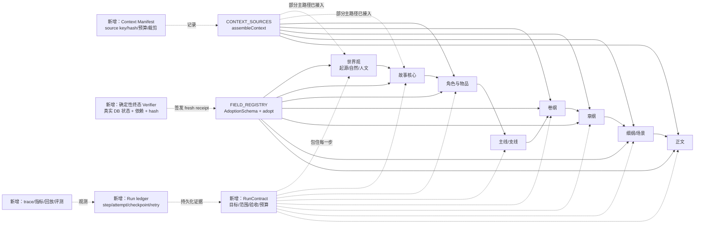

# StoryForge 分步骤创作 AI Harness 现状审计与架构设计

> 审计日期：2026-08-07
> 审计分支：`feat/harness-audit-20260807`
> 审计基线：`774a2ae feat(WORLD-2): close executable world foundation through 2F`
> 范围：仅分步骤创作模式；世界引擎运行时体验不在本轮范围。
> 状态：第一阶段设计成果；不等同于已实现的目标 Harness。
> 目标全流程设计：[AI-HARNESS-FULL-FLOW-DESIGN-20260807](./AI-HARNESS-FULL-FLOW-DESIGN-20260807.md)。

## 0. 任务理解与审计结论

本轮工作的目标不是增加 Agent 数量或堆叠更长提示词，而是确认分步骤创作从世界观、故事核心、角色/物品、主线/支线、卷纲、章纲、细纲到正文的真实读写链路，识别哪些质量能力确实在主路径生效，哪些只是模块、文档或 UI 存在，并据此设计可恢复、可核查、可持续评测的 Agent + Harness。

严格边界如下：

- 保留现有分步骤模式和默认一键创作路径，不删除、架空或替换现有功能。
- 不修复世界引擎 `WORLD-2C C3-C5 → WORLD-2F` 的体验问题，也不把世界状态机引入本轮主流程。
- 所有后续实现必须继续遵守三个单一事实源：`CONTEXT_SOURCES + assembleContext()`、`FIELD_REGISTRY + AdoptionSchema + adopt()`、`PROJECT_TABLES`。
- 研究文档中的 Harness、durable run、receipt、验证器等均是目标提案；只有代码和测试能证明当前能力。

### 0.1 基线与研究材料

事实：工作树干净，`HEAD` 为 `774a2ae`；该提交存在于 `feat/world-2c-ownership-adr`、`origin/feat/world-2c-ownership-adr` 和当前审计分支，尚未被 `origin/main`（当前为 `3b434ae`）包含。因此本审计不修改或推送 `main`。

研究材料通过 KDocs/WPS 定位并核对了文件名、分享链接和仓库镜像；KDocs 对云端 `.md` 直接 `read-file` 返回“需先转智能文档或下载原文”，因此可读取正文的仓库镜像作为逐行证据，KDocs 文件作为来源索引：

| 研究主题 | KDocs 来源 | 仓库镜像/用途 |
|---|---|---|
| AI Harness 架构 | [AI-HARNESS-ARCHITECTURE-20260803](https://www.kdocs.cn/l/cbJgMzoS1dvF) | `docs/AI-HARNESS-ARCHITECTURE-20260803.md`；目标提案，不是实现证明 |
| 长期一致性 | [长期一致性研究](https://www.kdocs.cn/l/cfPWqPtTviTM) | 用于核对 NS-0~NS-6 的目标和证据边界 |
| 生成逻辑 | [生成逻辑研究](https://www.kdocs.cn/l/cdyxyb3kpotl) | 用于核对分阶段创作与产物契约方向 |
| 收敛路线 | [收敛路线](https://www.kdocs.cn/l/cpSeGWrxthCB) | 用于核对质量工程分期，不作为当前代码事实 |
| 上下文路由 | [上下文路由研究](https://www.kdocs.cn/l/cjSkYZLDNONi) | 与 `CONTEXT_SOURCES`/预算治理交叉核对 |

外部技术结论只采用研究文档中可追溯的官方来源或源码契约：Anthropic 的 [Harness design for long-running apps](https://www.anthropic.com/engineering/harness-design-long-running-apps)、[A harness for every task](https://claude.com/blog/a-harness-for-every-task-dynamic-workflows-in-claude-code)、OpenAI 的 [Harness Engineering](https://openai.com/zh-Hans-CN/index/harness-engineering/)，以及 Kimi K3 官方仓库/技术报告。它们支持“契约、状态、验证、观测和按任务选择工作流”的设计原则，不证明 StoryForge 已具备这些能力。

### 0.2 结论先行

1. **数据和单轮生成治理已有较强地基，但没有形成分步骤主 run 的统一控制面。** `CONTEXT_SOURCES`、`assembleContext()`、`FIELD_REGISTRY`、`AdoptionSchema`、`adopt()` 和 `PROJECT_TABLES` 均存在，且有注册表、作用域、CAS、导入导出和反例测试。
2. **主路径接入不一致。** 审计基线中卷纲/章纲、部分细纲和正文已经使用 `assembleContext()` 与 `GenerationNode`，但世界观、故事核心、故事线、普通角色、灵感反推、角色驱动开书规划和中途重规划曾各有组件级拼接、直接写回或双入口。HARNESS-30～36 已逐项收口这些入口；其它基础设定、独立质量入口和完整反馈链仍需继续核对。
3. **`GenerationNode` 不是 durable Harness。** 它冻结一次请求内的消息，支持 gate 和显式 adopt，但没有持久的 run/step/attempt/checkpoint、统一终态 verifier、fresh receipt、Context Manifest 或跨刷新恢复。
4. **长期一致性能力是“模块闭环”，不是“创作主流程闭环”。** NS-0~NS-6、事实/认知/物品/检索/摘要/stale/影响分析和一致性 Agent 有独立测试，但正文接受后的检索、状态提取、记忆和审查是 best-effort 异步任务，没有统一的完成判定和恢复协议。
5. **质量不稳定的主要推断根因是接入断裂和证据断裂，而不是单纯缺少记忆模块。** 该推断由下文逐条代码、测试和调用路径支持，仍需通过后续主流程 held-out 评测验证。

> 2026-08-09 更新：本审计记录的是改造前基线。HARNESS-30～36 已依次收口故事线、故事核心、世界基座、
> 普通角色、灵感反推、角色驱动开书规划和中途重规划入口；正式读取统一进入 Tool Registry / `assembleContext()`，候选进入
> durable Run，作者确认后的 AI 写回只经 `adopt()`，对应旧旁路已删除，人工能力保留。其余审计结论不因这些
> 垂直切片自动失效。

> 2026-08-10 更新：HARNESS-40 将“已写章节故事线进度与交汇映射”接入现有 `outline` Agent 的
> `outline.storyline-progress` Skill。章节选择、故事线展示和作者确认保留；正式上下文经
> `CONTEXT_SOURCES + assembleContext()` 读取 `projectStatus / storyArcs / storylineProgress / chapterContent`，
> 候选只允许闭集故事线/阶段和正文逐字证据，疑似新线仍需作者确认后才登记。候选持久化、编辑/拒绝/刷新恢复、正文
> hash 与故事线投影 snapshot/CAS、`adopt()` 事务写回和正式状态回读已有专项回归；旧面板 `useAIStream`、手工
> Prompt 和逐条直接采纳旁路已删除。该切片不等于正文后处理已进入统一主 run，也不证明真实模型映射质量。

## 1. 审计方法与证据等级

每个结论分为：

- **事实**：可由当前 commit 的源码、测试或运行路径直接复核。
- **推断**：由多个事实解释质量或可靠性问题，必须在后续评测中证伪/证实。
- **建议**：目标架构或实施决策，不描述当前已拥有的能力。

审计闭包按“入口 → 读取 → 生成/解析 → 校验 → 写回 → 失败/恢复 → 反哺 → 日志/评测/回放 → 测试”建立；不把 UI 有按钮或文档有标题当作主路径证据。

## 2. 三个单一事实源审计

### 2.1 上下文读取

**事实：** `src/lib/registry/context-sources.ts` 登记了世界观、故事核心、角色、故事线、章纲、细纲、事实、认知、物品、摘要、检索、规则等来源；`src/lib/registry/assemble-context.ts:35-71` 按显式 `sourceKeys`、作用域、源要求和预算装配，返回 `included/omitted/trimmed/totalInputTokens/inputBudget`。

**限制：** `assembleContext()` 的单源超预算路径仍可使用字符级 `slice()`；结果不是带 source hash、边界版本、run/step/attempt 标识的持久 Context Manifest。`ChapterEditor.tsx:570` 的日志只写控制台，刷新后没有运行证据。

### 2.2 AI 写回

**事实：** `FIELD_REGISTRY`、`ADOPTION_SCHEMAS` 和 `adopt()` 提供字段白名单、结构化校验、CAS/作用域检查和作者确认后的写回。`GenerationNode` 的接口注释也明确要求 `assembleInput` 复用 `assembleContext`，默认不自动 adopt（`src/lib/generation/generation-node.ts:15-30,75-120`）。

**审计时限制（已由 HARNESS-30 修复）：** 2026-08-07 的故事线 AI 生成曾调用 `addArc()`，而 `src/stores/story-arc.ts` 直接 `db.storyArcs.add()`；该主路径当时绕过了 `adopt()`。当前 AI 入口已改走 `outline.story-arcs` 候选与受治理采纳，store 直写只保留给明确的人工 CRUD。

### 2.3 数据生命周期

**事实：** `PROJECT_TABLES` 当前测试断言 66 张表（`tests/registry/project-tables.test.ts:23-33`），并派生世界作用域、项目作用域、删除事务、导出表和引用重映射；`agentConversations`、`agentEvents`、`nodeFlows`、`nodeRuns` 已登记（`src/lib/registry/project-tables.ts:437-481`）。

**测试证据：** `R-export-fullcoverage` 覆盖所有 exportable 表及双世界往返和外键重映射；`R-INV1-export-roundtrip` 覆盖角色引用 remap；注册表测试覆盖删除/导入事务派生。由此可证明生命周期治理存在，不能据此证明分步骤 Harness 已有 run ledger。

## 3. 分步骤创作功能清单与真实接入状态

状态定义：

- **A 主路径已使用**：入口在默认分步骤流程中调用该能力，并有路径证据。
- **B 已实现但未统一接入**：能力/Agent 有实现和测试，但默认入口仍有另一条路径。
- **C 仅文档或 UI**：没有可执行的生产闭环证据。
- **D 部分实现/旁路**：主路径有能力，但存在手工上下文、直接写库、异步无终态等缺口。
- **E 缺失**：当前没有足够的实现证据。

| 产物/能力 | 入口与事实 | 读/生成/写回证据 | 失败、反馈、观测 | 状态 |
|---|---|---|---|---|
| 世界观：起源/自然/人文 | `WorldviewOriginPanel.tsx`、`WorldviewNaturalPanel.tsx`、`WorldviewHumanityPanel.tsx` | HARNESS-32 后 17 个世界基座字段的 AI 生成统一路由到 `world-foundation-agent` 的 `world-origin.worldview-field` Skill；上下文只经 `CONTEXT_SOURCES + assembleContext()`，每次生成一个严格 `{field,value}` 候选，确认后经 `adopt(worldviews)` 写回。人工编辑、词条、历史年表和 Prompt 配置入口保留 | 空/部分/完整状态、反推方向、预算压缩/全文救援、完整快照/CAS、durable 刷新恢复、编辑/拒绝/确认和终态回读均有专项回归与 Chromium 证据；旧 `world-origin.complete` 仅保留历史 durable Run 兼容。当前证据证明工程闭环和模拟模型合同，不证明真实模型文学质量收益 | A（HARNESS-32） |
| 故事核心 | `StoryCorePanel.tsx`、`story-core-copilot.ts` | HARNESS-31 后 AI 入口只提交 `world-origin.story-core` 单字段任务；Skill 声明上下文并经 `assembleContext()` 读取，严格候选为 `{field,value}`，确认后经 `adopt(storyCores)` | durable 候选支持刷新恢复、编辑/拒绝/确认；完整故事核心 snapshot/CAS、正式字段回读和 terminal verifier 已接入；人工编辑仍经原 store/adopt | A（HARNESS-31） |
| 灵感反推 | `InspirationPanel.tsx`、`useIncrementalInspiration.ts`、`inspiration-copilot.ts` | HARNESS-34 后生成按钮只提交固定 `inspiration.reverse` 任务；作者勾选的碎片 ID 进入 durable plan，Skill 只经 `read_inspiration_workspace → assembleContext()` 读取，确认后经 `adopt(inspirationWorkspaces)` 新增版本 | 候选可刷新恢复、编辑、拒绝和确认；工作区 snapshot/CAS、空壳/长度/多世界结构 gate、来源碎片证据和终态回读生效。旧 `useAIStream` 与面板级上下文装配已删除；确认版本不自动写世界观、故事核心或角色，后续 Canon 采纳仍需作者单独操作 | A（HARNESS-34） |
| 角色普通生成 | `CharacterPanel.tsx`、`character-copilot.ts` | HARNESS-33 后普通 AI 按钮只提交 `character.create`；Skill 经正式只读工具和 `assembleContext()` 装配世界、故事核心、角色、规则与历史，返回严格闭集 JSON 候选，确认后经 `adopt(characters)` | durable 候选可刷新恢复、编辑/拒绝/确认；roster snapshot/CAS、同名、非法枚举、未知字段和正式写回终验均生效。旧 `useAIStream → parseCharacterOutput` 自由文本旁路及死代码已删除；人工 CRUD、轴和维度选择、Prompt 配置保留 | A（HARNESS-33） |
| 角色 Copilot | `src/lib/agent/character-copilot.ts` | 与普通分步骤 AI 按钮共用 `character.create` Skill、输入策略、压缩预算、候选合同和采纳入口 | 当前只生成一个新角色，不自动创建关系边、物品、状态卡或大纲；真实模型角色质量仍需固定评测 | A（HARNESS-33 复用） |
| 角色补全 | `CharacterSupplementAction.tsx`、`character-supplement-copilot.ts` | HARNESS-38 后按钮只提交固定 `character.supplement` 任务；`targetCharacter` 精确读取目标角色完整设定，其余世界/故事来源只经 `assembleContext()`，事实与正文表现只在作者开启反向哺喂时纳入；确认后只经 `adopt(characters, recordId, merge-diffs)` | 角色 ID、字段闭集和证据开关冻结进 durable plan；严格候选、原始来源 hash stale、刷新候选恢复、编辑/拒绝/确认和正式状态终验已接入。旧组件直调模型、立即写入和宽松空补丁 parser 已删除 | A（HARNESS-38） |
| 主线/支线 | `StoryArcPanel.tsx`、`story-arc-copilot.ts` | HARNESS-30 后 AI 入口只提交 `outline.story-arcs`；上下文经 `assembleContext()`，严格多阶段候选确认后经 `adopt(storyArcs)` | durable 候选、snapshot/CAS、结构 gate 和正式状态终验已接入；人工 CRUD 保留 | A（HARNESS-30） |
| 已写章节故事线进度/交汇 | `StorylineProgressPanel.tsx`、`storyline-progress-copilot.ts`、`storyline-progress.ts` | HARNESS-40 后章节映射只提交固定 `outline.storyline-progress` 任务；经 `assembleContext()` 读取 `projectStatus / storyArcs / storylineProgress / chapterContent`，输出 `{progress,crossings,newArcs}`，闭集 ID、阶段、状态、去重和正文逐字引文由确定性 parser 校验；确认后事务内经 `adopt()` 写 `storylineProgress / storylineCrossings / storyArcs` | durable 候选可编辑、拒绝、刷新恢复；章节正文 hash、故事线投影版本和作用域组成 snapshot/CAS；正式状态回读和 terminal receipt 接入主 Agent；疑似新线不会自动获得进度。旧 `useAIStream`、手工 Prompt 和逐条直接采纳入口已删除 | A（HARNESS-40） |
| 角色驱动开书规划 | `CharacterDrivenPlotPanel.tsx`、`character-driven-copilot.ts` | HARNESS-35 后生成按钮只提交固定 `outline.character-driven` 任务；方案输入经 `read_character_driven_plan`，其它上游经 `assembleContext()`；第一次确认经 `adopt(characterDrivenPlans)` 保存候选，第二次勾选卷才经 `adopt(outlineNodes)` | durable 刷新恢复、编辑/拒绝/确认、方案 snapshot/CAS、严格结构、未知角色/重复标题/弧光覆盖 gate 和终态回读已接入。旧 `useAIStream`、自动保存与弱 parser 已删除；版本、激活参考和 Prompt 配置保留，中途重规划由 HARNESS-36 的独立 Skill 接管 | A（HARNESS-35） |
| 角色中途重规划 | `CharacterRevisionPanel.tsx`、`character-revision-copilot.ts` | HARNESS-36 后只提交 `outline.character-revision`；作者变更、保护章序、过渡区、锚点、目标角色和方案 ID 冻结进 durable plan，其余资料只经 `assembleContext()`；作者选定具体档位和 patch 后才经 `adopt(outlineNodes.title/summary)`，已有空正文行只同步 `chapters.title` | 严格三档 JSON、已写区/保护区/未知节点/锚点硬过滤、完整 snapshot/CAS、刷新恢复、部分写入恢复和终态回读已接入。正文、故事主线、伏笔与影响建议保持只读；旧 `useAIStream`、Prompt service 和非 durable 写入 helper 已删除 | A（HARNESS-36） |
| 卷纲/章纲 | `OutlinePanel.tsx`、`useOutlineGenerationController.ts`、`outline/harness.ts` | 显式 source keys；`GenerationNode` 负责 prepare/run；确认后通过既有 `adopt()` 写 `outlineNodes` | 默认启用 durable trace；候选与确认后中断可刷新恢复，批量逐卷章纲有 HARNESS-11 checkpoint/receipt/终态验证。账本不可用时仍会显式降级为内存影子，因此不等于所有失败场景都可恢复 | A（durable 主路径） |
| 细纲/场景 | `DetailedOutlinePanel.tsx`、`ScenePanel.tsx`、`useDetailedOutlineGenerationController.ts`、`detailed-outline-*-durable.ts` | HARNESS-37 后两个界面的单章 AI 生成统一进入 `outline.details`；只经 Skill 声明的 `CONTEXT_SOURCES + assembleContext()` 读取章纲、相邻章、当前细纲、世界、故事、角色、规则、历史、地点和伏笔，确认后只经 `adopt()` 写细纲 | 单次与批量均有 durable candidate、刷新恢复、确认/拒绝和 terminal receipt；单章入口另有严格闭集 JSON、Skill execution binding、完整 Context Manifest stale 和正式后状态匹配。旧 `ScenePanel` 组件级 AI/上下文/二次模型解析已删除；人工场景 CRUD 与五阶段工坊保留 | A（HARNESS-37 单章入口；HARNESS-10 批量） |
| 正文生成/续写 | `ChapterEditor.tsx` | `runDurableChapterGeneration()` 通过 `assembleContext()` 读取章纲、细纲、连续性、事实、认知、物品、检索、故事线等；`GenerationNode`/prose copilot 生成候选，作者确认后经 `adopt(chapters)` 写回 | 正文生成/语义评审有 durable receipt；采纳后进入同一父子关联的 post-adoption Run。新 V2/V3 合同把信息边界列为必需 acceptance，缺少 boundary manifest 或包含未来/私人认知泄漏的候选会在当前性检查和终态 verifier 双重阻断；历史 V1 Run 仅保留兼容读取。旧手动入口仍保留为显式质量工作流 | A（生成与采纳），A（新章后主路径） |
| 章节记忆/计划对账 | `run-chapter-memory.ts`、`chapter-post-adoption-durable.ts` | 正文 hash + 计划 hash CAS，采纳后作为 post-adoption 的 memory step；解析失败不写回 | 新 Run 记录 step/attempt/manifest/output，失败可识别；统一“失败后从当前 step 继续”执行器仍待 HARNESS-42 | A（独立任务），A（四步主路径），D（统一恢复） |
| 检索/层级摘要重建 | `retrieval/retrieval.ts`、`ChapterEditor.tsx` | memory 成功后以确定性代码重建章节 chunks 与章/卷/书摘要；embedding 为可选后台派生 | 关键词检索是可用基线，embedding 失败不阻塞；现在已纳入 post-adoption retrieval step，失败后的用户续跑入口仍待 HARNESS-42 | A（新章后主路径） |
| 一致性 Agent | `consistency-agent.ts`、`chapter-post-adoption-durable.ts` | background Fast Guard 零 token；fast/deep 一次模型调用；新章后守卫候选写入同一 post-adoption Run 的 `agentEvents` 并绑定 durable 证据 | 候选、正文 hash、Context Manifest、step attempt 和作用域可验证；V2 terminal verifier 已接入。语义 Fast/Deep 仍作者显式触发，不自动改 Canon | A（确定性主路径守卫），B（语义深审） |
| 章节组织 Agent | `chapter-organization.ts` | 可将状态/认知/故事线/角色关系保存为候选事件，确认后 `adopt()` | 独立质量 workflow，不是正文生成必经阶段 | B |
| 反向反馈 | `impact-analysis.ts`、`impact-remediation-plan.ts`、`impact-patch-durable.ts`、`impact-remediation-durable.ts`、`ChapterEditor.tsx`、`R-HARNESS44-impact-patch-durable`、`R-HARNESS46-impact-remediation-plan`、`R-HARNESS47-impact-remediation-durable`、`R-AUDIT6-chapter-editor-toolbar` | HARNESS-43 的影响图作为只读证据；HARNESS-44 durable `plan-execute` Run 将图/正文 hash 绑定到作者确认候选；HARNESS-45 已接入正文编辑器，选择受影响后续大纲并创建/恢复/确认/拒绝候选，确认后经 `adopt()` 写回 terminal receipt；HARNESS-46 对图中每个节点生成绑定 graph/source hash 的确定性处理计划；HARNESS-47 把计划中的检索块/摘要项接入零模型 durable Run，重建后签发 receipt | 当前只执行确定性派生缓存；不自动执行正文改写、事实权威改写、作者确认项目或通用依赖重跑；正文/图 stale、候选篡改、越界和 locked 目标会阻断 | A（受限 patch、计划与派生缓存主路径）；D（通用反馈执行与重跑仍缺） |
| Run ledger / receipt / replay | `agentRuns`/`agentRunEvents`、`chapter-post-adoption-durable.ts`、`chapter-post-adoption-resume.ts` | post-adoption 四步均有 `step.scheduled/started/context.assembled/candidate.persisted/step.succeeded|failed` 证据；一致性候选另绑定 `agentEvents.durableRunId`；失败事件有分类、动作和 fingerprint | HARNESS-42 已接入纯确定性恢复计划和编辑器继续入口：成功步骤跳过、可重试失败按 attempt 重跑、不可重试/过期/运行中未知窗口阻断；真实浏览器关闭重开和完整回放视图仍待补证 | A（四步与恢复计划），D（浏览器回放） |
| 离线评测 | `NS-0`、NS/AGENT/PIPELINE 回归 | 有 development/held-out fixture、预算、事实/约束/泄漏/证据指标 | 多数是模块级或 builder/eval 级；缺少真实分步骤从世界观到正文的端到端 held-out | B |

## 4. 现有分步骤链式流程（现状与新增能力同图）

下图中的实线是当前可执行路径；虚线是建议新增/调整的 Harness 控制面。新增节点不替换现有产物和默认快速入口，而是包住现有生成节点。



### 4.1 新增/调整节点的工程契约

| 新增/调整 | 要做什么 | 解决什么问题 | 输入 | 输出 | 负责方 | 生效验证 |
|---|---|---|---|---|---|---|
| `RunContract` | 为一次分步骤创作声明目标产物、范围、依赖、预算、允许写入、验收器、重试和人工确认点 | 防止“模型返回 final 就算完成”、防目标漂移 | 项目/世界/作品作用域、step graph、用户请求、基线 hash | 不可变 contract + `runId` | Harness 控制面 | contract schema 反例；拒绝缺字段；contract hash 写入 run |
| `Context Manifest` | 在每个 step/attempt 固化 `sourceKeys`、source hash、included/omitted/trimmed、预算、prompt hash | 让“AI 到底读了什么”可复核、可重放 | `assembleContext()` 结果 | manifest + message hash | Context adapter/Harness | 同输入重放 hash 一致；源变化使 receipt stale |
| `step/attempt/checkpoint` | 将当前步骤、候选、错误、重试次数、可恢复输入和确认状态持久化 | 刷新/取消/网络失败后可恢复，避免重复生成或丢失中间结果 | contract、manifest、候选、错误 | durable state | Harness runner | 中断后 resume；失败不重复写 Canon |
| 终态 `Verifier` | 用确定性代码核查真实 DB 产物、依赖采纳、作用域、字段契约和 hash；语义评审只作 advisory 或受约束 gate | 消除“看起来完成但数据未写/过期/不一致” | contract、manifest、candidate、真实 DB | pass/block + fresh receipt | 独立 verifier 模块 | 伪造模型成功、过期候选、缺依赖反例必须阻断 |
| post-step barrier | 将检索块、状态提取、章节 memory、consistency review 定义为可重试子步骤，并明确 `completed` 条件 | 消除正文后处理 best-effort 造成的假完成 | 正文 hash、计划 hash、步骤依赖 | 每个子步骤 receipt + run terminal | Harness runner | 任一步失败时 run 为可恢复/部分完成而非 completed |
| feedback patch workflow | 影响分析只生成受治理候选 patch，由作者确认后按依赖方向重跑 | 让下游发现冲突后能回溯上游，而非静默级联改写 | stale fact、来源引用、下游章节、受影响产物 | patch candidate + impact graph | Consistency/Review agent + adopt | 只写允许字段；作者拒绝后 Canon 不变；重跑有新 run |

## 5. 下游反哺上游路径

当前已有“下游读回上游”和“正文修改后 stale/影响提示”，但还没有统一的反向修正工作流。目标路径必须保留作者确认，不自动级联重写正文。

```mermaid
flowchart TD
  P[正文/续写] --> X[事实抽取、认知、持有物、摘要]
  X --> F[事实账本/认知账本/检索块]
  P --> I[impact-analysis]
  I --> S[标记 stale + 列出后续章节\n现状：只提示作者]
  S -.新增.-> G[影响图\n来源→依赖产物→受影响步骤]
  G -.新增.-> Q[上游修正候选\n事实/角色状态/大纲/上下文 patch]
  Q --> R[确定性 gate + 语义 advisory]
  R --> U[作者确认]
  U --> A[adopt() 受治理写回]
  A --> C[新 Context Manifest + 新 run]
  C --> D[按依赖重跑下游步骤]
  D --> P
  P --> V[一致性 Agent\n现状：独立候选事件]
  V -.新增绑定.-> G
```

### 5.1 反哺边界

- 事实：`propagateChapterEditStale()` 会把证据已不在新正文中的非 locked confirmed fact 标为 `stale`；`analyzeEditImpact()` 只列事实和后续章节（`src/lib/consistency/impact-analysis.ts:23-74`）。
- 事实：`R-downstream-reverse` 证明显式传 `sourceKeys: ['storyCore','characters','storyArcs']` 且提供 `worldGroupId` 时可以用下游内容反推上游；不提供世界作用域时角色源会被省略。
- 建议：将“影响图”和“上游 patch”作为 Harness 候选，不新增事实源；patch 必须使用现有字段注册表和 `adopt()`，并在 receipt 中记录受影响来源和作者决定。
- 禁止：自动删除事实、改写 locked 事实、无作者确认级联改正文，或把模型自报冲突直接写入 Canon。

## 6. 当前质量问题、失效点与根因

| 问题/失效点 | 代码或测试证据 | 结论类型 | 影响 |
|---|---|---|---|
| 注册表存在但主路径不统一 | 审计基线中的故事线、故事核心、世界观、普通角色、灵感反推、角色驱动开书/中途重规划和独立场景旁路已由 HARNESS-30～40 收口；卷章纲及细纲批量已有更早的 durable 基座，不能重复开发。其它基础设定与反馈入口仍未全部统一 | 事实 → 推断 | 剩余入口仍可能使用不同来源、预算、校验和写回标准，模型输入/输出质量受入口影响 |
| 上下文可登记但不可完整复核 | `assembleContext()` 返回内存 `included/omitted/trimmed`；正文只打印控制台日志 | 事实 → 推断 | 无法可靠回答某次生成实际读了哪些源、何时被裁剪；问题难以回放 |
| 结构化契约强弱不一致 | 世界基座、故事核心、故事线（含 HARNESS-40 动态映射）、普通角色、角色驱动卷章方案和中途重规划已改为严格候选合同；其它入口的 parser/gate 强度仍不一致 | 事实 | 剩余弱入口中的缺字段、类型错和 Canon 冲突仍可能进入正式数据 |
| 正文后处理无统一完成屏障 | `handleAutoPostGenerate()` 依次重建检索、状态提取、memory；失败仅 `console.error`/降级，调用方 `void` 启动 | 事实 → 推断 | UI/作者可能看到正文已保存，却不知道派生记忆、状态和检索是否完成；失败无法按步骤恢复 |
| 质量 Agent 未绑定主 run | 一致性候选写入 `agentEvents`，有 hash current；post-adoption 一致性已绑定 durable Run；正文信息边界也已纳入 V2/V3 终态条件 | 事实 | 审查结果可查且可成为对应 Run 的终态证据；仍不能自动触发上游修正 |
| 下游反馈只有提示没有闭环 | HARNESS-43 的 `impact-analysis` 只读；HARNESS-44/45 已提供正文编辑器中的作者确认式 `outlineNodes.summary` patch 主路径；HARNESS-46 已把影响节点分类为系统重建或作者确认计划，但尚未执行计划 | 事实 | 第一条安全路径可追溯地修订后续大纲摘要，且现在能明确列出后续处理责任；其它冲突仍需作者手工判断、修改和重跑，不能宣称反馈闭环已完成 |
| 测试多为模块级闭环 | NS/AGENT/PIPELINE 测试覆盖 adapter、CAS、gate、registry、roundtrip；未见跨世界观→正文的真实主路径 held-out | 事实 → 推断 | 单模块绿不能证明真实分步骤流程长期一致 |
| 目标文档与实现成熟度混淆风险 | Harness 文档自标“提案”，但包含完整目标架构；当前代码只有节点级运行时 | 事实 | 若按文档标题重复开发，会形成平行入口或过早新增表 |

### 6.1 根因判断

**推断 1：质量能力分散在多个工程批次，缺少统一执行控制面。** NS-0~NS-6、Agent、透明管线分别交付了局部能力；每个模块能证明自己的不变量，但没有一个 run 负责把步骤依赖、重试、终态和证据连接起来。

**推断 2：主路径接入断裂比“记忆不足”更可能解释实际效果不稳。** 审计时的直接证据包括故事线旁路写库、世界观/故事核心手工上下文、普通角色双入口、灵感与角色驱动面板级调用，以及章节页独立场景生成绕过 durable run；这些证据对应的入口已由 HARNESS-30～40 修复。卷章纲和细纲批量经复核已有 durable 基座。该根因仍适用于其它基础设定和反馈入口，不能因为这些切片完成就宣称全流程质量已经稳定。

**推断 3：失败可见性不足导致错误继续向后传播。** 正文后处理失败只记录日志并保留 tail/旧状态，没有 durable attempt 和明确的“部分完成/待恢复”状态，后续步骤可能继续读取旧的派生记忆。

**推断 4：测试证据与产品路径粒度不匹配。** 现有测试能证明 CAS、作用域、解析和导出安全，但不能回答“用户从世界观一路到正文是否每一步都经过同一治理入口”。

这些推断不得作为最终效果承诺；应在路线图阶段用端到端 fixture、失败注入、重放一致性和 held-out 质量指标验证。

## 7. 目标 Agent + Harness 分层架构

```mermaid
flowchart TB
  UI[分步骤创作 UI\n快速模式/深度模式/作者确认] --> WF[产品流程图与产物契约\nworldview→storyCore→characters→arcs→outline→detail→prose]
  WF --> H[Harness 控制面]
  H --> RC[RunContract\n目标/范围/预算/验收/回滚]
  H --> SM[Run state machine\nqueued→running→awaiting-review→retryable/blocked/completed]
  H --> EX[Step executor\n顺序/DAG/取消/重试/恢复]
  EX --> N[GenerationNode\n现有执行抽象]
  N --> CTX[Context plane\nCONTEXT_SOURCES + assembleContext\n按需路由/预算/压缩/manifest]
  N --> AG[专业 Agent\n仅在需要语义判断/创意推理时使用]
  N --> OUT[结构化/非结构化候选\n产物契约]
  OUT --> VG[Verifier / Review\n确定性优先，语义 advisory]
  VG --> AD[作者确认 + adopt()\nFIELD_REGISTRY/AdoptionSchema]
  AD --> CANON[正式 Canon 与派生记忆]
  CANON --> LIFE[PROJECT_TABLES 生命周期\n导出/导入/删除/迁移/remap]
  H --> OBS[Run ledger / trace / metrics / replay]
  OBS --> EVAL[离线评测与回归集\n开发/held-out/失败注入]
  CANON --> FB[影响分析与反向反馈]
  FB --> H
```

### 7.1 分层职责与约束

| 层 | 责任 | 不负责什么 |
|---|---|---|
| 产品流程与产物契约 | 定义每一步的输入、输出、依赖、作者确认点和允许降级 | 不在组件中手拼第二套上下文或写库 |
| Harness 控制面 | 运行状态、step/attempt、取消、重试、恢复、完成判定、回放 | 不复制 `assembleContext()`、parser 或 `adopt()` |
| Context plane | 只通过注册表路由、预算、压缩、来源 hash 和 manifest 提供输入 | 不静默加入未登记 DB 字段 |
| GenerationNode/专业 Agent | 领域提示词、语义推理、创意候选、窄职责协作 | 不自报完成，不绕过 gate/adopt |
| Verifier/Review | 确定性 schema/作用域/hash/依赖检查；必要时调用受约束语义评审 | 不把 LLM 自评作为唯一完成证明 |
| Canon/Adoption | 作者确认后按字段注册表写入正式数据，产出来源追踪 | 不自动级联重写 locked 或作者正文 |
| 观测/评测 | 记录输入、输出、成本、延迟、失败、receipt，支持 replay 和 held-out | 不把日志当事实源，不改变 Canon |

## 8. 当前架构与目标架构差距矩阵

| 能力 | 当前 | 目标 | 差距 | 依赖/优先级 |
|---|---|---|---|---|
| 产品步骤图 | UI 分散在多个面板，默认一键路径存在 | 有版本化 step graph 与产物契约，保留快速模式 | 缺统一 contract | H0/H1，高 |
| 上下文路由 | 注册表、预算、裁剪已存在；部分入口手拼 | 所有 AI 主入口统一 `assembleContext()`；每 attempt 有 manifest | 入口迁移 + hash/manifest | H1/H2，高 |
| 长期事实/状态/记忆 | NS-1~NS-6 局部能力已实现 | 作为步骤输入且与 run/receipt 绑定 | 运行状态绑定缺失 | H2/H3，高 |
| 执行控制 | `GenerationNode` 请求内 prepare/run/gate/adopt | durable state machine、取消、重试、resume | 缺持久 run ledger | H1，高 |
| Agent 协作 | 有 orchestrator/DAG/预算和领域 Agent | 动态选择但窄职责、依赖可验证、共享写冲突受控 | 现有 orchestrator 不是分步骤主入口 | H2，中高 |
| 产物契约 | 故事核心/故事线已有版本化严格候选；其余入口强弱不一 | 每个步骤有 versioned schema 和 migration/compat 策略 | 剩余 parser/gate 不一致 | H2，高 |
| 校验 | 一致性 Agent、硬 guard、局部 gate | verifier 独立签发 fresh receipt；语义评审与确定性检查分层 | 无统一终态 | H3，高 |
| 反馈 | stale + 后续章节提示；HARNESS-44/45 已有只改 `outlineNodes.summary` 的作者确认 patch candidate；HARNESS-46 已有只读处理计划 | 通用影响图、更多受限 patch、作者确认、按依赖重跑 | 计划尚不执行，仍缺正文/事实/角色状态的受限 patch 和重跑编排 | H4，中高 |
| 写入治理 | 三注册表强；故事核心/故事线 AI 已收口，剩余入口继续核查 | 所有 AI 写回统一 adopt；人工路径显式标注 | 需要逐入口证明无旁路 | H2，高 |
| 观测与回放 | 控制台日志、agent events、透明预览 | run trace、manifest、成本/延迟、失败分类、replay | 缺 run 级持久证据 | H1/H5，高 |
| 评测 | 模块级 NS/AGENT/PIPELINE 和少量 held-out | 真实分步骤端到端、失败注入、回放等价、质量/成本门槛 | 缺主链证据 | H0/H5，高 |
| 数据生命周期 | `PROJECT_TABLES` 66 表，导入导出/remap 有测试 | 新 run 表（如需要）也必须注册表派生完整生命周期 | 尚未决定是否新增表 | H1 先复用现有表，避免扩表 |

## 9. 分阶段实施路线图

本路线图先从不新增表的控制面开始；任何新增 durable 表都必须先补 `PROJECT_TABLES`、schema/迁移、导出导入、删除、作用域、引用 remap 和反例测试。

| 阶段 | 范围与依赖 | 主要风险 | 验收标准 | 回滚边界 | 测试证据 |
|---|---|---|---|---|---|
| H0 基线与路径锁定 | 本审计文档；为每个主入口建立真实路径 fixture；依赖三注册表现状 | 把文档/Agent 当主路径 | 状态表逐项可复核；至少一条从世界观到正文的 trace fixture；确认不混入世界引擎 | 仅删除审计 fixture/文档，不动 Canon | `check:architecture`、`check:required-tables`、定向 registry/NS/AGENT/PIPELINE 测试 |
| H1 最小 RunContract + 证据 | 复用 `agentEvents`/`agentConversations` 或先用受控临时存储；定义 run/step/attempt 状态、contract hash、失败分类；不改变写入语义 | 把对话事件扩成无边界 ledger；旧数据兼容 | 能创建、取消、重试、恢复一个 outline/prose run；完成不再由模型返回决定；无 Canon 变更时回滚安全 | 默认入口仍走旧逻辑；Harness 仅 opt-in，旧入口可快速关闭 | contract/schema 反例、刷新 resume、重复 adopt、失败注入、旧数据回放 |
| H2 主入口收口与 Context Manifest | 先故事线/故事核心/世界观，再普通角色；将手工上下文迁移到 `assembleContext()`，AI 写回改为 `adopt()`；每 attempt 保存来源/预算/prompt hash | 大范围迁移造成生成行为漂移；字符裁剪改变结果 | 主入口所有 AI 调用都有 manifest；故事线无直接 DB add；旧快速模式输出契约保持兼容 | 按入口 feature flag 回退到迁移前调用，但保留审计数据只读 | 主路径 spy/trace、parser/gate 反例、`R-downstream-reverse`、端到端 fixture |
| H3 统一终态与后处理屏障 | 把正文检索、状态提取、章节 memory、一致性 review 变成可重试 steps；独立 verifier 签发 receipt | 延迟/成本上升；历史章节缺派生数据；并发编辑冲突 | 任一步失败显示 retryable/partial；只有所有必需 receipt fresh 才 completed；正文 hash/CAS 保护不变 | 保留正文已保存，后处理可单独重跑；关闭 barrier 不得删除正文 | 失败注入、CAS/stale、重复运行幂等、终态伪造阻断、成本/延迟指标 |
| H4 反向反馈闭环 | 影响图、受限 patch candidate、作者确认、按依赖重跑；复用事实/角色/大纲字段和 `adopt()`。HARNESS-44 先落地 `outlineNodes.summary` | 自动级联改稿、影响范围过大、循环重跑 | 当前 patch 可追溯到正文/图 hash，拒绝不改 Canon，确认后新 run 有 receipt；通用目标和依赖重跑仍待实现 | 只保留 stale/提示模式；patch 不自动写入 | stale/locked/引用消失、patch schema、拒绝/重放/循环上限测试 |
| H5 评测、回放与渐进发布 | 端到端 held-out、失败注入、输入重放、质量/成本/延迟指标；快速模式与深度模式 A/B | 评测 fixture 泄漏；把局部指标冒充质量提升 | 每阶段有非劣效阈值；run 可回放并解释差异；按入口逐步启用 | feature flag 逐步关闭新 Harness，不回滚作者已确认 Canon | `npm run ci`、`npm run ci:e2e`、固定 held-out、replay hash、独立浏览器数据验证 |

### 9.1 H1 的最小状态机建议

```text
queued
  → running(step/attempt)
  → awaiting-review
  → adopted
  → verifying
  → completed(receipt)

running → retryable(error class, next attempt)
running → blocked(gate/contract/作用域)
verifying → stale(source/state changed)
```

`completed` 必须同时满足：contract 未变、所有必需步骤 receipt 新鲜、目标数据真实存在且作用域正确、所有依赖候选已采纳、post-step barrier 通过。模型的 `final`、UI 的“接受”或单个 Agent event 都不单独满足该条件。

## 10. 旧入口收口与保留清单

| 入口 | 处理 | 边界 |
|---|---|---|
| 世界观三面板组件级 `worldCtx` | 收口到 `assembleContext()`；保留面板 UI 和字段编辑 | 普通人工编辑可继续走 store；AI 生成必须有 manifest |
| `StoryCorePanel.worldCtx()` + historical 拼接 | 登记完整 story-core 输入源并统一装配 | 纯文本字段仍可保留，但需结构化长度/冲突 gate |
| `StoryArcPanel → addArc()` | AI 候选改为 `adopt()`；`addArc/updateArc` 仅作为显式人工编辑入口 | 不复制第二个 arc 写回 service |
| ~~`CharacterPanel` 普通生成自由文本旁路~~ | HARNESS-33 已迁移到 `character.create`，旧弱 parser 与死代码已删除 | 手动角色 CRUD、轴/维度选择和 Prompt 配置保留；不自动创建关系、物品或下游规划 |
| ~~`InspirationPanel` 面板级 `useAIStream` / 上下文装配~~ | HARNESS-34 已迁移到 `inspiration.reverse` 定向 durable 任务，碎片选择进入计划和候选证据 | 保留碎片库、版本差异、多世界预览与显式 Canon 采纳；确认反推候选只写灵感版本 |
| ~~`CharacterDrivenPlotPanel` 的 `useAIStream` / 自动保存 / 弱 parser~~ | HARNESS-35 已迁移到固定方案的 `outline.character-driven` durable 任务；第一次确认只写方案，第二次确认才写正式大纲 | 保留人工弧光输入、方案版本、激活参考、中途重规划和 Prompt 配置；“角色反推世界基座”仍属于另一 Foundation Skill |
| ~~`CharacterRevisionPanel` 的 `useAIStream` / Prompt service / 非 durable patch helper~~ | HARNESS-36 已迁移到冻结保护边界与方案输入的 `outline.character-revision` durable 任务；作者选择先固化到候选，再进行受治理采纳 | 只允许未来大纲标题/摘要和已有空正文行标题；正文、主线、伏笔和影响建议只读 |
| ~~`ScenePanel` 的组件级 `useAIStream` / 上下文装配 / 二次模型解析~~ | HARNESS-37 已与独立细纲页统一到 `outline.details` + 单章 durable 控制器；严格候选、刷新恢复、Manifest stale、`adopt()` 和 terminal receipt 共用 | 保留人工场景 CRUD、五阶段工坊与 HARNESS-10 批量入口；不恢复解析失败后的隐藏模型调用 |
| ~~`CharacterSupplementAction` 的组件级模型调用、生成后立即写入和宽松空补丁 parser~~ | HARNESS-38 已迁移到固定角色/字段/证据开关的 `character.supplement` durable 任务；候选先持久化并可编辑、拒绝或确认 | 保留四个角色面板的入口、维度选择、反向哺喂开关与人工角色编辑；不新建角色、关系边或修改正文 |
| ~~`StorylineProgressPanel` 的组件级 `useAIStream`、手工 Prompt 和逐条直接采纳~~ | HARNESS-40 已迁移到固定章节的 `outline.storyline-progress` durable 任务；候选聚合后由作者一次确认，闭集/逐字引文/快照 CAS/事务 `adopt()` 形成完整写回 | 保留章节选择、进度/交汇展示、人工故事线 CRUD；疑似新线仍需作者确认，不自动补进度 |
| `GenerationNode` | 继续作为领域执行抽象，由 Harness 调度 | 不把它误命名为 durable run，不另造第二套生成运行器 |
| `agentConversations/agentEvents` | 继续承载对话/候选/确认/错误；可作为兼容投影 | 不无限扩展为 run ledger；字段扩展须先审计生命周期 |
| `nodeFlows/nodeRuns` | 继续服务 FLOW-3 自由节点 | 不直接冒充分步骤主流程 run，除非新增明确 contract/作用域/终态语义 |
| 正文 `handleAutoPostGenerate` best-effort 链 | 迁移为 H3 post-step barrier；保留正文先保存和 CAS | 失败不能删除正文；旧手动重建入口需收口到同一 step executor |
| `impact-analysis` 只提示 | HARNESS-44/45 已增加并接入仅写 `outlineNodes.summary` 的 H4 第一条 patch candidate/作者确认；继续保留安全默认 | 不自动级联重写正文、事实权威状态或 locked 数据 |
| 透明管线/章纲工坊 | 继续作为 `GenerationNode` 的 opt-in 深度模式 | 快速模式默认保留；不新增平行 AI/DB 入口 |

## 11. 验收与交付边界

第一阶段完成不代表 Harness 已上线。当前交付仅包括本审计文档和可复核证据。进入 H1 前必须先通过：

```text
npm run check:architecture
npm run check:required-tables
npm run check:ai-manual
npx tsc --noEmit
npm run build
npm run ci
```

适用时另跑 `npm run ci:e2e`，并使用隔离浏览器数据；不得修改作者当前预览项目。提交前运行 `git diff --check`，确认工作树只包含本审计文档。

## 12. 尚未证明的事项

- 研究文档提出的目标 Harness 是否能提高真实长篇质量，尚无本项目端到端因果证据。
- 当前 `agentEvents` 是否足以承载 H1 ledger，需先做容量、查询、并发和迁移评估；不能默认扩展。
- 世界基座字段、故事核心和故事线结构化合同现已用旧数据兼容、定向回归和浏览器刷新闭环验证；这些证据只证明工程闭环与模拟模型合同，真实模型质量收益仍需固定 fixture 与 A/B 证据，不能由工程测试推断。
- 反向 patch 的最小影响范围和人工确认 UX 尚未定稿；在 H4 之前不应自动修改上游或下游 Canon。
