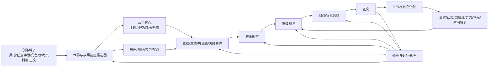
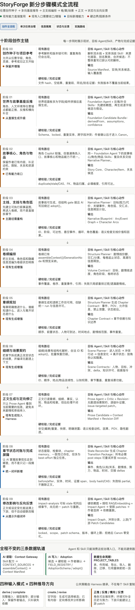
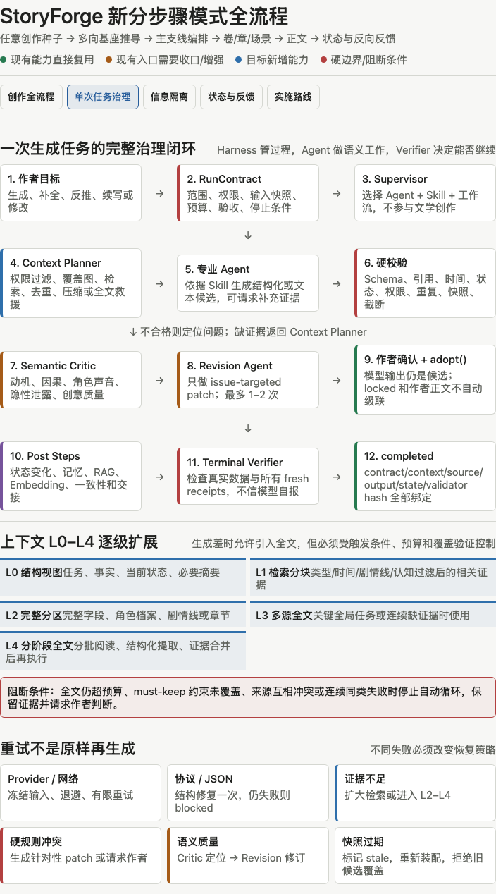
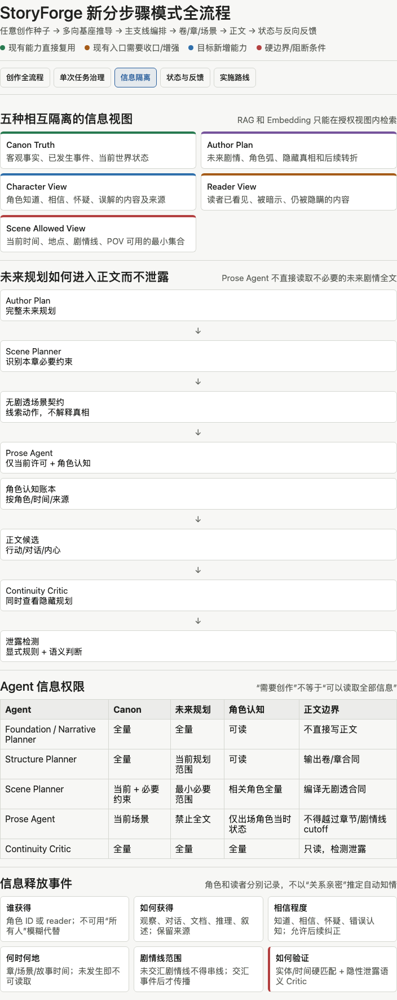
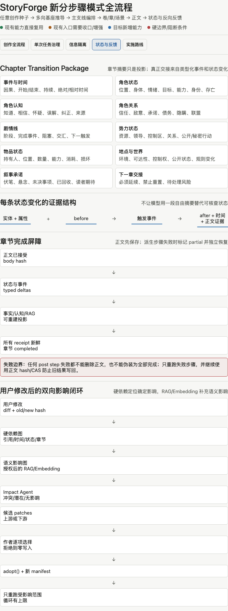
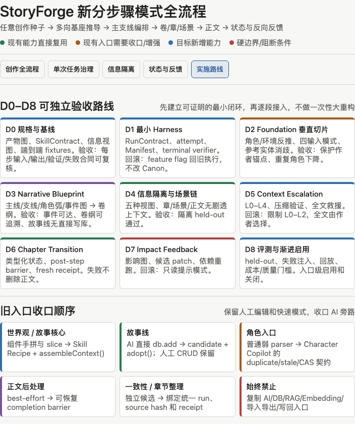
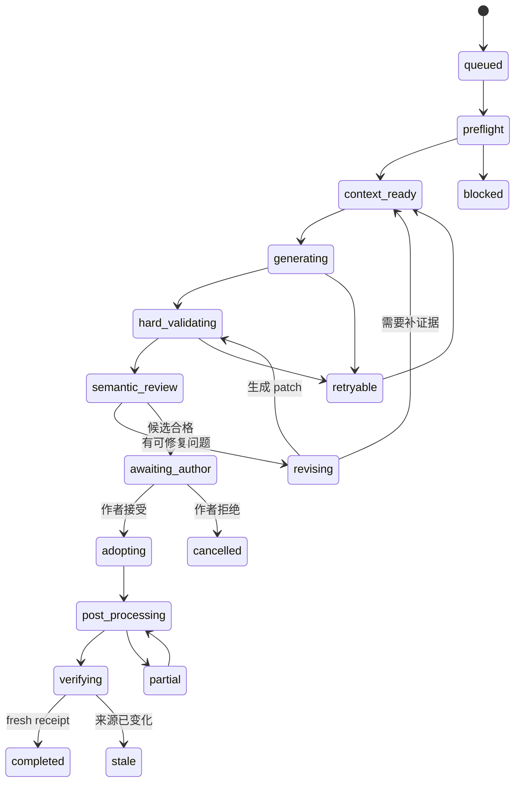

# StoryForge 分步骤创作 Agent + Harness 全流程方案设计

> 设计日期：2026-08-07
> 状态：`PROPOSED`，是第一阶段目标设计，不代表已经实现。
> 唯一范围：分步骤创作模式。世界引擎、角色聊天、跑团和文字游戏只保留未来迁移边界，不进入本轮实施。
> 现状证据：[AI-HARNESS-AUDIT-20260807](./AI-HARNESS-AUDIT-20260807.md)。
> 约束：继续以 `CONTEXT_SOURCES + assembleContext()`、`FIELD_REGISTRY + AdoptionSchema + adopt()`、`PROJECT_TABLES` 为三个单一事实源。

## 0. 设计结论

StoryForge 的目标不是把所有 AI 按钮改成多 Agent，也不是把字段拼接移动到 Skill。目标是把分步骤创作改造成一条由专业 Agent 执行、Skill 约束方法、Harness 管理过程、代码验证结果、作者决定 Canon 的完整生产链。

本设计采用十条不可破坏的原则：

1. **世界基座是数据，不是 Agent。** 用户填写的世界观、故事、角色、物品等继续由三注册表治理；AI 只提供候选、补全、反推和修订。
2. **创作路径不是单向表单，而是部分已知的产物图。** 一个灵感、一个角色、一段人文环境或一条剧情线都可以成为种子，系统必须支持正推、反推和横向补全。
3. **Agent 是语义责任主体，Skill 是可版本化的任务方法。** 不为每个字段建立 Agent；按专业认知边界建立少量 Agent，用 Skill 区分具体任务。
4. **Harness 不负责拼 Prompt。** Harness 负责选择 Agent/Skill、状态、预算、重试、恢复、停止条件、完成判定和证据。
5. **上下文是受治理的证据视图。** Skill 声明需要什么，Context Gateway 通过 `assembleContext()` 装配；RAG、Embedding、摘要和全文只作为分级证据来源。
6. **RAG 不是新的事实源。** 正式字段和作者正文仍在原表；检索块、向量和摘要是可重建投影，必须保留来源、版本、范围和权限。
7. **信息隔离是数据权限，不是提示词提醒。** 世界真相、作者未来规划、角色认知、读者已知和当前场景许可必须分开。
8. **确定性工作交给代码。** Schema、引用、顺序、作用域、版本、重复、时间计算、状态转换和完成条件优先硬校验；语义 Agent 只处理动机、因果、创意质量和隐性冲突。
9. **模型输出永远是候选。** 只有通过验证、作者确认并经 `adopt()` 写入的数据才进入 Canon；锁定事实和作者正文不得自动级联修改。
10. **完成必须可证明。** UI 显示“生成成功”或模型返回 `final` 不等于完成；只有必需步骤均有新鲜 receipt，真实数据与派生状态一致，run 才能进入 `completed`。

## 1. 全局分层

```text
作者目标与分步骤产品流程
  ↓
Harness Supervisor：任务契约、Agent/Skill 选择、状态、预算、重试、恢复
  ↓
专业 Agent + Skill：反推、规划、编排、场景、正文、评审、修订、状态对账
  ↕
Context Gateway：三注册表、分级检索、压缩、全文救援、Context Manifest
  ↕
Tool / Memory / RAG / Embedding：受限工具、事实账本、认知账本、检索投影
  ↓
硬校验 + 语义评审 + 定向修订
  ↓
作者确认 + adopt() + PROJECT_TABLES 生命周期
  ↓
章节状态变化、索引更新、影响分析、回放与评测
```

| 层 | 核心责任 | 明确禁止 |
|---|---|---|
| 产品产物图 | 定义灵感到正文的产物、依赖、作者确认点 | 把 UI 页签顺序冒充唯一创作顺序 |
| Agent | 承担创意推理、复杂语义判断和多步目标 | 自报完成、直接写 Canon、无限自主循环 |
| Skill | 声明任务方法、上下文配方、输出契约、验证与修订策略 | 手写数据库读取、字段字符串拼接、隐藏写回 |
| Harness | 选择工作流，管理 run/step/attempt/checkpoint/receipt | 复制 Context、RAG、AgentRunner 或 Adoption 服务 |
| Context Gateway | 生成授权、预算化、可追溯的上下文视图 | 静默加入未登记字段、无限制全文注入 |
| Memory/RAG | 保存可重建的检索投影和任务证据 | 覆盖 Canon、把向量结果当事实 |
| Verifier/Critic | 硬规则判定与语义评审分层 | 让生成模型同时做唯一裁判和完成签发者 |
| Adoption/Canon | 作者确认、CAS、作用域、字段白名单和正式写入 | 绕过 `adopt()`，自动修改 locked 内容 |
| Trace/Eval | 记录实际输入、输出、成本、错误、修订和结果 | 只记录成功日志、不保存失败证据 |

## 2. 产品产物图：从任意种子到正文

分步骤 UI 仍按熟悉顺序展示，但底层不再假设用户必须从世界起源开始填。任何已填写内容都先进入“创作种子识别”，再决定正推、反推、补全或修订。



### 2.1 产物层级

| 层级 | 正式产物 | 作用 |
|---|---|---|
| 创作种子 | 用户灵感、局部字段、参考资料、现有作品片段 | 表达作者已知内容和创作意图 |
| 世界基座 | 真实/幻想、起源、自然、人文、规则、地点、势力等 | 定义故事可发生的环境和边界 |
| 故事基座 | 故事核心、主题、核心冲突、目标、限制 | 定义作品要讲什么、为何发生 |
| 实体资产 | 角色、关系、角色弧候选、物品、组织 | 定义行动者、资源和约束 |
| 叙事蓝图 | 主线、支线、交汇点、关键事件、因果、信息释放计划 | 把设定转化为可执行故事结构 |
| 结构规划 | 卷纲、章纲、细纲、场景契约 | 分层分配剧情、角色、节奏和信息 |
| 文本产物 | 正文、修订稿 | 作者最终阅读和编辑的作品文本 |
| 运行投影 | 章节状态变化、事实、认知、时间线、剧情线进度、交接 | 让下一步知道故事现在走到了哪里 |

### 2.2 全流程可视化

以下五个视图使用同一套设计合同：绿色表示现有能力直接复用，橙色表示现有入口需要收口或增强，蓝色表示目标新增能力，红色表示必须由代码阻断的边界。它们分别展开产品主链、单次执行治理、信息隔离、章节状态与反馈，以及渐进实施路线。

#### 2.2.1 创作全流程



#### 2.2.2 单次任务治理



#### 2.2.3 信息隔离



#### 2.2.4 状态与反馈



#### 2.2.5 实施路线



## 3. Agent 与 Skill 拓扑

Agent 按专业责任划分，而不是按页面或字段划分。简单 Skill 可以只执行一次模型调用；只有目标需要检索、分解、验证和修订时才进入多步 Agent run。

| Agent | 主要 Skill | 典型产物 | 是否默认多步 |
|---|---|---|---|
| Foundation Authoring Agent | 灵感解析、角色驱动反推、环境驱动反推、缺失字段补全、跨字段一致性修订 | 世界/故事基座候选包 | 反推和跨字段修订是；单字段润色否 |
| Reference Analysis Pipeline | 文档提取、实体识别、关系提取、角色消歧、参考融合 | 带来源的参考分析和实体候选 | 保留现有解析主链；仅消歧/冲突时调用语义能力 |
| Narrative Planner Agent | 故事核心深化、主线规划、支线规划、角色弧、关键事件、交汇编排 | 叙事蓝图 | 是 |
| Structure Planner Agent | 卷纲规划、章纲拆分、节奏与覆盖、剧情线分配 | 卷/章结构候选 | 是 |
| Scene Planner Agent | 细纲、场景拆分、视角、出场角色、认知范围、线索释放 | 场景契约 | 是 |
| Prose Agent | 章节正文、续写、局部重写、风格执行 | 正文候选 | 生成可单步；修订为有界循环 |
| Continuity/Critic Agent | 动机、因果、角色一致性、隐性剧透、遗漏和设定冲突 | 证据化问题清单 | 是，但只读 |
| Revision Agent | 针对问题定位修订、局部 patch、差异解释 | 修订候选 | 有界 1–2 次 |
| State Reconciler | 章节事件、状态变化、认知变化、剧情线进度、连续性交接 | Chapter Transition Package | 是，输出必须结构化 |
| Impact/Feedback Agent | 修改影响、上下游候选 patch、重规划建议 | Impact Graph + Patch Candidates | 是，只生成候选 |

Supervisor 只负责选择上述 Agent 和 Skill，并检查它们是否满足任务契约。它不参与文学创作，也不把所有 Agent 固定串成最长链。

## 4. 通用输入模式与推导方向

### 4.1 四种输入覆盖模式

每个 Skill 继承统一的 Coverage Policy，不重复编写四套相同逻辑。

| 模式 | 输入状态 | 必须行为 | 禁止行为 |
|---|---|---|---|
| `derive` | 用户提供明确、较完整内容 | 提取、组织和推导，保留作者原意 | 擅自替换作者设定 |
| `complete` | 只填写部分字段 | 建立覆盖图，保留已填内容，只补缺失依赖 | 把补全内容伪装成用户事实 |
| `create` | 基本没有字段，但有明确创作意图 | 生成多个候选方向，暴露关键假设 | 无依据自动写 Canon |
| `revise` | 已有正式内容，用户要求调整 | 生成目标差异和影响范围，定向修改 | 顺手重写未授权内容 |

没有任何有效种子且作者意图不明确时，系统应请求最小澄清或提供可选择的创作方向，不应无限自由补全。

### 4.2 四种推导方向

| 方向 | 示例 | 权威关系 |
|---|---|---|
| 正向推导 | 世界规则 → 能力体系 → 角色限制 → 剧情冲突 | 上游约束下游 |
| 反向推导 | 一个角色 → 社会结构/势力/规则 → 世界基座 | 新内容都是候选，不能改写原种子 |
| 横向补全 | 人文环境 ↔ 自然环境 ↔ 历史 ↔ 经济/势力 | 以用户字段为锚，补足互相依赖 |
| 下游反馈上游 | 正文冲突 → 事实/角色状态/大纲修正建议 | 只生成 patch，作者确认后写入 |

反推不应通过一段长 Prompt 猜完整世界。Foundation Agent 应先生成依赖图，再逐组推断，并为每项候选保存 `derivedFrom`、`assumptions`、`confidence` 和冲突证据。

## 5. Skill 契约

Skill 不是字段拼接模板，而是受版本控制的任务说明。建议的逻辑合同如下，具体物理格式在实施阶段决定：

```yaml
id: narrative.plan-main-and-subplots
version: 1
agent: narrative-planner
intent: 依据作者基座规划主线、支线、角色弧和交汇点

modes: [derive, complete, create, revise]
directions: [forward, reverse, lateral]

context:
  required: [storyCore, worldviewRules, characters]
  optional: [items, factions, locations, references]
  retrieval: [relatedCharacterFacts, relevantReferenceChunks]
  knowledgeView: author-planning
  escalation: [structured, chunks, full-section, staged-fulltext]

output:
  schema: NarrativeBlueprintV1
  authority: candidate

verification:
  deterministic: [schema, entityRefs, uniqueIds, causalReachability]
  semantic: [motivation, conflictStrength, subplotRelevance]

revision:
  maxAttempts: 2
  strategy: issue-targeted-patch

adoption:
  confirmation: required
  targets: [storyArcs]

postSteps: [reindex, impactBaseline]
stopConditions: [budget, repeatedFailure, unresolvedAuthorDecision]
```

所有 `context.*` 必须解析为 `CONTEXT_SOURCES` 中已登记来源；所有 `adoption.targets` 必须解析为 `FIELD_REGISTRY`/`AdoptionSchema`；涉及的新持久数据必须先进入 `PROJECT_TABLES`。

## 6. Context Gateway：检索、压缩与全文救援

### 6.1 标准装配流程

```text
Skill Context Recipe
  → 权限与作用域检查
  → 输入覆盖图（已填/缺失/冲突/锁定）
  → 必读结构化事实与摘要
  → 类型过滤 + 时间过滤 + 剧情线过滤
  → 关键词/ID/Embedding 混合检索
  → 去重、排序、预算分配
  → 必要时压缩或扩大原文
  → 压缩覆盖验证
  → assembleContext()
  → Context Manifest
```

生成 Agent 可以请求补充证据，但不能自行扩大数据权限、绕过作用域或突破 RunContract 预算。

### 6.2 上下文分级

| 级别 | 内容 | 默认用途 |
|---|---|---|
| L0 结构视图 | 任务契约、结构化事实、当前状态、必要摘要 | 每次必读 |
| L1 检索分块 | 相关字段块、事实证据、前文章节片段、参考资料块 | 普通生成 |
| L2 完整分区 | 某个完整设定字段、角色档案、剧情线或章节 | 关键依据不足时 |
| L3 多源全文 | 多个原始字段/参考/章节的完整文本 | 高复杂度全局任务或连续失败 |
| L4 分阶段全文 | 分批阅读 → 结构化提取 → 证据合并 → 再执行 | 全文超过可用预算时 |

全文救援必须是受控升级，而不是默认策略。触发条件包括：关键实体覆盖不足、Critic 判断摘要损失关键约束、检索证据冲突、Agent 明确提出缺证据、同类问题修订后再次出现。

### 6.3 压缩验证

压缩结果必须保留并可验证：

- 任务所需实体、别名和身份。
- 锁定事实、世界规则和禁止事项。
- 角色关系、因果链、时间点和状态前后值。
- 角色认知与客观事实的差异。
- 原文定位、source hash 和版本。
- Skill 声明的 must-keep constraints。

验证失败时按 `L0 → L1 → L2 → L3/L4` 扩大证据；不能只提高 token 上限后原样重试。

### 6.4 RAG 与 Embedding 的边界

RAG 分块至少携带：

```text
sourceType / sourceId / fieldKey / entityIds / storyArcIds
timelineRange / volumeId / chapterId / sceneId
knowledgeAudience / readerDisclosure / authority / locked
world/work scope / sourceVersion / sourceHash / chunkLevel
```

检索采用“硬过滤优先，语义召回补充”：先按世界、作品、时间、剧情线、角色权限和内容类型过滤，再做 ID/关键词/Embedding 混合召回与重排。Embedding 不能突破信息隔离边界。

## 7. 信息隔离与信息释放

### 7.1 五种信息视图

| 视图 | 内容 | 主要消费者 |
|---|---|---|
| Canon Truth | 客观世界事实、已发生事件、当前状态 | Planner、Critic、Verifier |
| Author Plan | 尚未发生的剧情、角色未来弧线、隐藏真相 | Narrative/Structure Planner、Critic |
| Character Epistemic View | 某角色当前知道、相信、怀疑或误解的内容 | Scene/Prose Agent |
| Reader Disclosure View | 正文已经向读者展示、暗示或隐瞒的内容 | Scene Planner、Prose、Critic |
| Scene Allowed View | 当前时间、地点、剧情线、视角允许使用的最小信息集合 | Prose Agent |

作者规划信息与角色“内心想法”不是同一概念。角色未来发展路径属于 Author Plan；除非剧情中角色已经形成明确目标，否则不能进入角色认知。

### 7.2 Agent 权限矩阵

| Agent | Canon | 未来规划 | 角色认知 | 读者已知 | 原始隐藏信息 |
|---|---:|---:|---:|---:|---:|
| Foundation/Narrative Planner | 全量 | 全量 | 可读 | 可读 | 按任务授权 |
| Structure Planner | 全量 | 当前规划范围 | 可读 | 可读 | 按卷/章范围 |
| Scene Planner | 当前及必要未来约束 | 只读必要约束 | 全量相关角色 | 全量 | 不直接下发给正文 |
| Prose Agent | 当前场景事实 | 不提供未来剧情全文 | 仅出场角色当时认知 | 当前已释放 | 禁止 |
| Continuity Critic | 全量 | 全量 | 全量 | 全量 | 可读，用于检测泄露 |
| State Reconciler | 生成前后范围 | 不需要远期规划 | 相关角色 | 本章变化 | 禁止 |

Scene Planner 应把未来规划编译为“无剧透场景契约”，例如“本章埋入一个与旧徽章有关但不可解释来源的视觉线索”，而不是把后续反转全文交给 Prose Agent。

### 7.3 信息释放事件

每次角色或读者获得信息时记录逻辑事件：

```text
informationId
recipientType: character | reader
recipientId
source: observation | dialogue | document | inference | narration
chapter/scene/time
contentRef
certainty: knows | believes | suspects | false-belief
supersedes
evidenceSpan
```

因此可以检查：角色提前知道未来事件、未交汇剧情线串线、配角未告知却被主角使用、叙述提前揭露隐藏真相、错误认知被无事件地自动纠正。

## 8. 分步骤全流程

### 8.1 阶段 0：创作种子与项目参考

| 项目 | 设计 |
|---|---|
| 输入 | 任意已填字段、灵感、导入参考、现有正文 |
| 执行 | 确定性格式解析和分段；必要时模型提取实体、关系、事件和主题 |
| 特别处理 | 保留当前已获认可的参考解析主路径，不整体替换；新增角色/实体消歧、别名聚类、来源对照和作者合并确认 |
| 输出 | Source Manifest、实体候选、关系候选、创作种子覆盖图 |
| 硬校验 | 文件/文本完整性、来源 hash、空结果、重复段、实体 ID、同名/别名候选 |
| 失败恢复 | 原分析版本不覆盖；失败版本可重试；重复角色进入 merge candidate |

### 8.2 阶段 1：世界与故事基座反推/补全

| 项目 | 设计 |
|---|---|
| 输入 | 覆盖图、用户锚点字段、参考分析、锁定设定 |
| Agent/Skill | Foundation Agent；灵感反推、角色驱动反推、环境驱动反推、缺失补全 |
| 核心过程 | 识别依赖 → 正推/反推/横向补全 → 生成假设 → 检查跨字段冲突 → 呈现候选组合 |
| 输出 | Foundation Candidate Bundle，逐字段带来源、假设、置信和影响 |
| 硬校验 | 字段 schema、未知实体、重复名称、作用域、locked 冲突、候选覆盖 |
| 语义评审 | 世界规则自洽、环境因果、设定与角色互相支撑、创意同质化 |
| 写入 | 作者逐项/整组确认后 `adopt()`；未确认内容不进入 Canon |

### 8.3 阶段 2：故事核心、角色、物品与关系

| 项目 | 设计 |
|---|---|
| 输入 | 已确认基座、用户已有故事/角色/物品、参考证据 |
| Agent/Skill | Foundation Agent 的故事核心/角色/物品 Skill；复杂角色关系可调用 Narrative Planner |
| 核心过程 | 保留已有内容 → 补足动机、限制和冲突 → 建立角色/物品/势力关系 → 标记未知和假设 |
| 输出 | Story Core Candidate、Character/Item Candidate、关系候选 |
| 硬校验 | 去重、别名、FK、唯一性、物品归属、必填维度、引用可达 |
| 语义评审 | 角色动机与世界条件一致、物品不是无代价解法、核心冲突可持续 |
| 写入 | 统一 Adoption；Character Copilot 的重复/stale/CAS 能力成为普通 AI 入口的共享契约 |

**HARNESS-32 已交付边界（2026-08-09）：** 世界基座 17 个字段的 AI 入口归属现有
`world-foundation-agent` 的 `world-origin.worldview-field` Skill。Skill 根据空/部分/完整基座选择创建、参考创建或受约束变换策略，并允许故事核心、角色、故事线和卷纲作为反推证据；每次只生成一个严格 `{field,value}` 候选，确认前不写 Canon，确认后只经 `adopt(worldviews)`。正式上下文、预算压缩/全文救援、完整快照/CAS、durable 恢复、作者编辑/拒绝/确认和终态回读已闭合。旧 `world-origin.complete` 仅保留历史 durable Run 兼容，人工编辑、词条、历史年表和 Prompt 配置入口保留。当前证据只证明工程闭环和模拟模型合同，不证明真实模型文学质量收益。

**HARNESS-31 已交付边界（2026-08-09）：** 故事核心七字段保留原人工编辑，AI 入口归属现有
`world-foundation-agent` 的 `world-origin.story-core` Skill。每次只生成一个 `{field,value}` 候选；
empty/partial/complete 输入策略、正式登记上下文、预算压缩/全文救援、完整故事核心 snapshot/CAS、durable
恢复、作者编辑/拒绝/确认、`adopt(storyCores)` 和正式字段终验已闭合。角色、物品、关系的普通入口收口及
完整 Foundation 反推仍未由本单元交付。

**HARNESS-33 已交付边界（2026-08-09）：** 普通分步骤角色 AI 入口已统一到现有 Character Agent 的
`character.create` Skill。Skill 经正式只读工具与 `assembleContext()` 读取世界、故事核心、角色、世界规则和
历史，继续支持 empty/partial/complete 输入策略、压缩预算和完整 roster snapshot/CAS；严格闭集 JSON 候选可
刷新恢复、编辑、拒绝或确认，确认后只经 `adopt(characters)`。旧 `useAIStream → parseCharacterOutput` 自由
文本解析旁路及死代码已删除，人工 CRUD、角色轴、维度选择和 Prompt 配置保留。当前不自动创建关系边、物品、
状态卡或大纲，也不证明真实模型角色质量已经提升。

**HARNESS-34 已交付边界（2026-08-09）：** 分步骤灵感反推入口已统一到现有 Inspiration Agent 的
`inspiration.reverse` Skill。作者选中的碎片 ID 被固定到主 Agent durable plan，刷新恢复后仍使用同一输入
边界；读取只经 `read_inspiration_workspace → assembleContext()`。结构化候选在主 Agent 事件中可编辑、拒绝
或确认，确认只经 `adopt(inspirationWorkspaces)` 新增版本，不自动写入世界观、故事核心、角色或世界组。碎片
填写、来源、版本差异、多世界预览及后续显式 Canon 采纳保持不变；旧面板级 `useAIStream` 和手工上下文装配已删除。

### 8.4 阶段 3：主线、支线、角色弧与关键事件

| 项目 | 设计 |
|---|---|
| 输入 | 故事核心、角色/关系、世界约束、作者目标、可用篇幅 |
| Agent/Skill | Narrative Planner；主线规划、支线规划、角色弧、交汇点、信息释放规划 |
| 核心过程 | 建立目标/阻力/代价 → 规划关键状态转换 → 分配角色弧 → 设计支线价值和交汇条件 → 检查因果可达 |
| 输出 | Narrative Blueprint：剧情线图、事件图、角色弧、交汇点、隐藏信息计划 |
| 硬校验 | Arc ID、阶段顺序、入口/出口、悬空事件、循环、角色引用、关键目标覆盖 |
| 语义评审 | 支线是否服务主题或角色、冲突递进、动机、因果、节奏和冗余 |
| 写入 | 故事线 AI 入口必须从直接 `db.storyArcs.add()` 收口到 `adopt()` |

**HARNESS-30 已交付边界（2026-08-09）：** `outline.story-arcs` 已完成主线/支线多阶段候选、正式上下文装配、
输入状态/压缩策略、结构 gate、durable 候选、作者确认、`adopt(storyArcs)`、stale 保护和终态验证；旧 AI
直接写入入口已删除，人工 CRUD 保留。上表中的角色弧、事件图、交汇条件、信息释放规划和完整语义评审
仍是后续能力，不能由本单元冒充完成。

**HARNESS-35 已交付边界（2026-08-09）：** 现有“角色驱动剧情”开书规划属于大纲 Agent 的
`outline.character-driven` Skill，不是 Foundation Agent 的“由单角色反推世界基座”。作者选定方案 ID 被固定到
durable plan；Skill 只读取该方案的角色起点、终点和要求，旧生成结果不会污染重新生成，上游设定与规划统一经
`assembleContext()` 进入受预算上下文。严格候选检查卷章结构、未知角色、重复标题和角色弧覆盖，并要求通过剧情动作
释放角色信息。第一次作者确认只更新 `characterDrivenPlans.generatedVolumes/status`，第二次勾选卷才采纳到
`outlineNodes`；任一步拒绝都不改下一级数据。旧流式旁路、自动落方案和弱 parser 已删除，方案管理、激活参考、
中途重规划与 Prompt 配置保留。完整 Narrative Blueprint、角色反推世界基座和真实模型质量 A/B 尚未由本单元交付。

**HARNESS-36 已交付边界（2026-08-09）：** “中途重规划”现在属于同一大纲 Agent 的
`outline.character-revision` Skill。变更说明、目标角色、保护区、过渡区、策略、锚点和方案 ID 固定到 durable
任务；世界/故事/角色/故事线/大纲/事实/连续性交接/摘要/检索/伏笔/Canon/规则/词条统一经 `assembleContext()`。
模型只返回严格三档方案，代码在候选边界拒绝未知节点、重复节点、已写或受保护节点和锚点改名。作者选择具体
档位与 patch 后才允许写回未来大纲；正文、主线、伏笔和影响建议始终只读。刷新恢复、完整 snapshot/CAS、
确认后部分中断恢复和正式状态终验已闭合。它交付的是受控反向反馈切片，不等于完整影响图、自动级联修订或
真实模型质量提升。

**HARNESS-37 已交付边界（2026-08-09）：** 单章场景/细纲 AI 现在属于大纲 Agent 的
`outline.details` Skill。章节正文页与独立细纲页共用同一个 durable 控制器；Skill 声明章纲、相邻章、
当前细纲及世界/故事/角色/规则等正式来源和唯一细纲写权限。输出必须先通过闭集 JSON 与字段、枚举、
数量、ID 硬门才会持久为候选；解析失败不再隐藏发起模型重构。候选可跨页面与刷新恢复，确认前零业务
写入；确认时重算 Context Manifest，来源变化即 stale，确认后只经 `adopt(detailedOutlines)`，正式字段
匹配后才完成。人工场景编辑、五阶段工坊和 durable 批量细纲均保留；语义评审、真实模型质量 A/B 和
更完整的 Scene Planner 多步推演仍未由本单元交付。

### 8.5 阶段 4：卷纲编排

| 项目 | 设计 |
|---|---|
| 输入 | Narrative Blueprint、角色弧、信息释放约束、目标卷数/篇幅 |
| Agent/Skill | Structure Planner；剧情线混编、卷级节奏、卷终状态 |
| 核心过程 | 分配主支线份额 → 安排交汇/分离 → 定义每卷起止状态、主题功能和高潮 → 检查全局覆盖 |
| 输出 | Volume Contract：卷目标、剧情线进度、角色阶段、信息释放、卷终状态 |
| 硬校验 | 所有必需事件有归属、卷序、覆盖率、重复事件、角色/剧情线引用 |
| 语义评审 | 每卷独立推进、高潮不重复、支线不挤压主线、角色弧节奏合理 |
| 失败恢复 | 针对未覆盖/过密剧情线局部重排，不整部重生成 |

### 8.6 阶段 5：章纲规划

| 项目 | 设计 |
|---|---|
| 输入 | 当前卷合同、上一章状态、剧情线进度、角色认知、章节预算 |
| Agent/Skill | Structure Planner；章节拆分、视角分配、事件与转折安排 |
| 核心过程 | 选择本章推进目标 → 分配事件和视角 → 定义进入/离开状态 → 指定允许释放的信息 |
| 输出 | Chapter Contract：目标、事件、出场角色、视角、状态前后、允许信息、禁止泄露 |
| 硬校验 | 顺序、前置状态、角色可到达性、时间/地点、剧情线范围、事件重复 |
| 语义评审 | 章节功能、悬念、因果、角色动机、与前后章节衔接 |

### 8.7 阶段 6：细纲与场景契约

| 项目 | 设计 |
|---|---|
| 输入 | Chapter Contract、当前状态快照、角色认知、读者已知、场景相关原文 |
| Agent/Skill | Scene Planner；场景拆分、行动/反应、对话目标、线索释放、POV 约束 |
| 核心过程 | 为每场景定义进入状态 → 冲突/行动 → 信息变化 → 离开状态；编译无剧透上下文 |
| 输出 | Scene Contracts：地点、时间、角色、目标、冲突、状态 delta、知识许可、线索指令 |
| 硬校验 | 合法实体 ID、场景顺序、地点/物品连续性、认知权限、章节覆盖 |
| 语义评审 | 场景是否改变状态、重复功能、对话目的、节奏、信息释放自然度 |

### 8.8 阶段 7：正文生成与定向修订

| 项目 | 设计 |
|---|---|
| 输入 | 当前 Scene Contract、上一场景 tail、角色认知视图、读者已知、文风、相关原文证据 |
| Agent/Skill | Prose Agent；正文生成/续写；Critic + Revision 处理明确问题 |
| 信息隔离 | 不提供不必要的未来剧情全文；只提供无剧透线索指令和当前允许信息 |
| 输出 | Prose Candidate + source citations/manifest + unresolved issues |
| 硬校验 | 非空/截断/重复、字数、格式、角色/地点/物品、明确禁用信息、快照新鲜度 |
| 语义评审 | 动机、因果、POV、语气、隐性剧透、角色声音、叙述质量 |
| 修订 | Issue-targeted patch，最多 1–2 次；上下文不足时逐级扩大，不盲目同 Prompt 重试 |
| 写入 | 作者接受后保存正文；正文保存和后处理状态分开，不因后处理失败删除正文 |

### 8.9 阶段 8：章节状态对账与完成屏障

| 项目 | 设计 |
|---|---|
| 输入 | 已接受正文、生成前状态快照、章纲/场景合同、正文 hash |
| Agent/Skill | State Reconciler；事件提取、状态 delta、信息释放、计划—正文对账 |
| 输出 | Chapter Transition Package + 章节连续性交接 |
| 硬校验 | before/after、实体引用、时间、证据 span、互斥状态、正文 hash/CAS |
| 语义评审 | 隐含状态变化、剧情线真实推进、角色心理/关系变化是否有证据 |
| 完成屏障 | 检索块、状态投影、章节 memory、一致性报告等必需子步骤都有 fresh receipt 后才完成 |
| 失败恢复 | 标记 `partial/retryable`，只重跑失败子步骤；正文保持已保存 |

### 8.10 阶段 9：用户修改、影响分析与反向反馈

| 项目 | 设计 |
|---|---|
| 输入 | 用户修改 diff、旧/新 hash、依赖关系、语义检索结果 |
| Agent/Skill | Impact Agent；依赖分析、语义影响、候选 patch、重规划建议 |
| 核心过程 | 硬引用影响 → 时间/状态传播 → RAG 语义相关 → Critic 分类 → 作者选择 |
| 输出 | Impact Graph、受影响产物、候选 patch、建议重跑范围 |
| 硬校验 | locked、作用域、引用、循环、patch schema、版本新鲜度 |
| 写入 | 每个 patch 单独确认并走 `adopt()`；拒绝后 Canon 不变 |
| 边界 | 下游可建议修正上游，但不得自动重写作者正文或锁定事实 |

## 9. 章节状态变化与长期记忆

章节完成后不生成一段无结构摘要，而是生成类型化变化包。逻辑类别包括：

| 域 | 变化内容 |
|---|---|
| 事件与时间 | 事件、因果、开始/结束、持续时间、绝对/相对时间 |
| 角色状态 | 位置、身体、情绪、目标、资源、能力、身份、存亡 |
| 角色认知 | 知道、相信、怀疑、误解、被纠正、信息来源 |
| 关系 | 信任、敌意、承诺、债务、控制、联盟、隐瞒 |
| 剧情线 | 当前阶段、完成事件、阻塞条件、交汇/分离、下一触发条件 |
| 势力 | 资源、领导、控制区、关系、目标、公开/秘密行动 |
| 物品 | 持有人、位置、状态、数量、能力、损坏/消耗/销毁 |
| 地点/世界 | 环境、可达性、控制权、规则变化、公开状态 |
| 叙事承诺 | 伏笔、悬念、未决问题、已回收内容、读者期待 |
| 交接 | 下一章必须延续的状态、禁止重置的变化、待处理风险 |

每项 delta 使用：

```text
entity + predicate + before + event + after + chapter/scene/time + evidenceSpan + confidence
```

事实账本保存可核查状态和来源；章节摘要、角色摘要和连续性交接是从账本和正文派生的上下文投影。模型提取结果先是候选，验证通过后才能更新正式账本或派生索引。

## 10. Harness 执行状态机



### 10.1 RunContract

一次 run 至少固定：目标产物、允许读写范围、Agent/Skill/version、输入快照、信息权限、预算、最大 attempts、必需 validator、作者确认点、post-step barrier 和完成条件。

### 10.2 重试策略

| 失败类型 | 策略 |
|---|---|
| 网络/Provider 暂时错误 | 保持冻结输入，指数退避，有限重试 |
| 协议/JSON 错误 | 结构化修复一次；仍失败则 blocked |
| 缺少证据 | 扩大检索或进入 L2/L3/L4，不重复同一输入 |
| 硬规则冲突 | 生成针对冲突的 patch；不可修复则请求作者决定 |
| 语义质量不达标 | Critic 生成可定位问题，Revision 有界修订 |
| 快照过期 | 标记 stale，重新装配上下文，不允许旧候选覆盖 |
| 连续同类失败 | 停止自动循环，保留证据并交给作者 |

### 10.3 完成回执

Receipt 绑定 `contractHash + contextManifestHash + sourceHashes + candidateHash + adoptedStateHash + validatorVersion`。任一来源、正式数据或 validator 版本变化都使旧回执过期。

## 11. 硬校验、语义评审和修订

| 闸门 | 确定性检查 | 语义检查 |
|---|---|---|
| 生成前 | 作用域、必需来源、锁定内容、预算、快照、信息权限 | 任务是否需要澄清、证据是否足够 |
| 输出契约 | JSON/Schema、枚举、必填、唯一 ID、FK、长度、截断、重复 | 候选是否回答目标、是否偷换作者意图 |
| 连续性 | 时间计算、章节顺序、位置/物品/存亡、明确未获知实体 | 动机、因果、隐性知识泄露、角色声音 |
| 结构规划 | 事件覆盖、可达性、悬空节点、阶段顺序、交汇条件 | 节奏、主题、主支线价值、角色弧合理性 |
| Adoption | 字段白名单、schema、CAS、locked、scope、duplicate | 修改影响是否可接受 |
| Post-step | 正文 hash、delta refs、索引版本、必需 receipt | 隐含状态变化和遗漏 |

正则适合检测禁止词、显式隐藏实体名、格式、重复段和已知模板泄露；隐喻、改写和间接剧透必须由语义 Critic 检查。任何语义问题都要附正文/设定证据，不允许只给泛化评分。

## 12. 修改影响与反向反馈

```text
用户修改/新正文
  → Change Event（目标、diff、旧/新 hash）
  → 硬依赖图（字段引用、章节顺序、实体/状态/时间）
  → 语义相关图（RAG/Embedding，仍受作用域和信息权限过滤）
  → 影响分类：确定冲突 / 潜在影响 / 无影响 / 需作者判断
  → 受限 Patch Candidates
  → 作者选择
  → adopt()
  → 新 Context Manifest 和新 run
  → 只重跑真正受影响的下游范围
```

影响分析既要覆盖“设定改动影响后文”，也要覆盖“正文证明设定或大纲需要修正”。但下游到上游永远是建议关系；Author Plan 和 Canon 的修改权仍属于作者。

## 13. 参考资料解析的保留与优化

现有参考解析已获得用户认可，因此不以“Agent 化”为理由整体重写。优化集中在重复角色和实体身份：

1. 确定性标准化姓名、空格、称谓、大小写和常见别名。
2. 同一来源内按名字、关系、属性和出现位置生成 duplicate candidates。
3. 跨来源使用 Embedding/语义判断进行实体聚类，但不自动合并。
4. 对每个候选展示支持合并和反对合并的证据。
5. 作者确认后统一实体 ID；原始来源和别名保留。
6. 后续解析复用 identity map，避免同一角色反复新建。

这是一条“解析流水线 + 实体消歧 Skill + 作者确认”的混合流程，不需要建立独立自治解析 Agent。

## 14. 观测、回放与离线评测

每个 attempt 至少记录：

- RunContract、Skill/version、Agent/model/provider。
- Context Manifest、来源 hash、检索 query、included/omitted/trimmed、压缩级别。
- 信息权限视图和 temporal/storyline cutoff。
- 输出、parser 结果、硬校验、Critic 问题、Revision diff。
- token、延迟、失败类型、重试原因和上下文升级路径。
- 作者接受/拒绝/编辑、Adoption diff、post-step receipts。

核心评测集必须覆盖：

| 评测域 | 关键样例 |
|---|---|
| 多向基座 | 单角色反推世界、单人文环境补全、部分字段保护、空字段候选 |
| 参考消歧 | 同名不同人、同人多别名、描述冲突、跨文档重复 |
| 上下文 | 摘要足够、摘要丢失、全文救援、超长全文分阶段阅读 |
| 信息隔离 | 未发生未来、未交汇剧情线、配角未告知、错误认知、读者/角色差异 |
| 规划 | 主支线覆盖、角色弧、事件可达、卷章拆分、支线交汇 |
| 连续性 | 时间、位置、存亡、物品、势力、关系、事实更新 |
| 恢复 | 刷新、取消、Provider 错误、过期快照、post-step 部分失败 |
| 反馈 | 上游修改影响后文、正文反推上游、locked 拒绝、循环传播上限 |

效果指标至少区分：硬冲突率、信息泄露率、关键约束覆盖率、重复实体率、作者候选接受率、修订后通过率、回放等价率、成本、首字延迟、完成延迟和人工介入率。不能只用模型自评分数证明质量提升。

## 15. 现有能力如何进入新体系

| 现有能力 | 目标位置 | 处理 |
|---|---|---|
| 三注册表 | Canon/Context/生命周期基座 | 原样保留并增强证据，不复制 |
| `GenerationNode` | 单步执行原语 | 由 Harness 调度，不冒充 durable run |
| Character Copilot | Foundation Agent 的角色 Skill 执行器 | 普通角色入口收口到同一重复/stale/adopt 契约 |
| 参考分析版本链 | 阶段 0 输入流水线 | 保留主链，补实体 identity resolution |
| RAG-1/Embedding | Context Gateway 的派生检索层 | 增加类型、时间、剧情线和知识权限元数据 |
| 事实/认知/物品/故事线账本 | Canon 与状态视图 | 纳入 Scene/Prose 输入和 Chapter Transition Package |
| 章纲/细纲/正文生成 | Structure/Scene/Prose Skill | 复用 UI 和现有执行，逐入口纳入 run contract |
| 一致性 Agent | Continuity Critic | 绑定 run 和 source hash，仍保持只读 |
| chapter memory/状态提取 | State Reconciler 的 post steps | 从 best-effort 收口为可恢复 completion barrier |
| impact-analysis | Impact/Feedback 起点 | 保留只提示默认，增加受治理 patch candidates |

## 16. 必须收口的旧入口

1. 世界观组件内的手工上下文与 `slice()` 已由 HARNESS-32 收口到 `world-origin.worldview-field` → `assembleContext()`；旧 `world-origin.complete` 仅保留历史 durable Run 兼容，人工编辑、词条、历史年表和 Prompt 配置入口保留。~~故事核心手工上下文~~已由 HARNESS-31 收口到 `world-origin.story-core`，旧 `story-adapter` 已删除，人工编辑保留。
2. ~~故事线 AI 生成的直接 `db.storyArcs.add()`~~：HARNESS-30 已收口为 `outline.story-arcs` durable 候选并统一经 `adopt()`；人工 CRUD 保留。
3. ~~普通角色弱 parser 与 Character Copilot 双入口~~已由 HARNESS-33 统一为 `character.create`；旧弱 parser 删除，手动角色编辑、轴/维度选择和 Prompt 配置保留。
4. ~~灵感反推的面板级 `useAIStream` 与组件上下文装配~~已由 HARNESS-34 统一为 `inspiration.reverse` 定向 durable 任务；碎片库、版本差异和显式 Canon 采纳保留。
5. ~~角色驱动开书规划的 `useAIStream`、自动保存和弱 parser~~已由 HARNESS-35 统一为 `outline.character-driven`；两次作者确认分别控制方案保存与正式大纲采纳。
6. ~~角色中途重规划的 `useAIStream`、Prompt service 和非 durable patch helper~~已由 HARNESS-36 统一为 `outline.character-revision`；选择先固化到 durable 候选，再只写未来大纲授权字段。
7. ~~章节页 `ScenePanel` 的组件级 AI、上下文和二次模型解析~~已由 HARNESS-37 与独立细纲页统一为 `outline.details` durable 控制器；人工场景编辑与五阶段工坊保留。
8. 正文接受后的 best-effort 后处理，收口为可恢复 post-step barrier。
9. 独立一致性候选和章节整理候选，绑定统一 run/source hash，不再形成无法追踪的平行质量入口。
10. 任何新的 Skill 不得复制数据库读取、Prompt runner、RAG、Embedding、导入导出或写回实现。

## 17. 分阶段实施路线

| 阶段 | 主要范围 | 依赖 | 验收标准 | 主要风险 | 回滚边界 |
|---|---|---|---|---|---|
| D0 规格与评测基线 | 冻结产物图、SkillContract、信息视图、端到端 fixtures | 当前审计 | 每个步骤有输入/输出/验证/失败合同；基线评测可重复 | 纸面设计脱离主路径 | 只删除设计/fixture，不改 Canon |
| D1 最小 Harness 与 Manifest | RunContract、step/attempt、Context Manifest、硬完成判定；先包住现有 outline/prose | D0、GenerationNode | 取消/重试/刷新恢复；模型 final 不可自报完成 | ledger 设计过重 | feature flag 退回旧执行，作者数据不变 |
| D2 Foundation 垂直切片 | 角色/环境反推、四输入模式、候选来源；参考实体消歧 | D1、三注册表 | 单角色和单环境 fixture 可生成可审查候选；不覆盖用户字段；重复角色下降 | 反推扩张过度 | 关闭反推，保留原按钮和手动编辑 |
| D3 Narrative Blueprint | 主线/支线/角色弧/事件图，再接卷纲 | D2、故事线 Adoption 收口 | 全局事件覆盖和可达；卷纲可追溯到剧情线；无直接写库 | 规划合同改变旧行为 | 保留旧快速模式，只关闭深度规划 |
| D4 信息隔离与场景链 | Character/Reader/Plan/Scene views、章纲/细纲/正文无剧透上下文 | D3、认知账本、RAG metadata | 隔离 held-out 通过；Prose 不读取无关未来全文；Critic 可检出泄露 | 隔离过强导致文采/伏笔下降 | 退回兼容上下文配方，不改已写正文 |
| D5 Context Escalation | 压缩验证、L0–L4、全文救援、Agent 补检索 | D1、RAG-1 | 摘要失败可受控扩大；超长全文不截断；manifest 可解释 | 成本/延迟失控 | 限制到 L0–L2，人工选择全文 |
| D6 Chapter Transition | 类型化状态变化、post-step barrier、fresh receipt | D4、现有 facts/memory | 正文保存后可独立恢复派生步骤；下一章读取新鲜状态 | 历史章节缺状态 | 旧章节按需补建，失败不删除正文 |
| D7 Impact Feedback | 影响图、候选 patch、依赖重跑 | D6、Adoption | 拒绝零写入；确认只改授权范围；循环有上限 | 自动级联失控 | 退回只读提示模式 |
| D8 评测与渐进启用 | held-out、失败注入、回放、成本/质量阈值、入口级发布 | D1–D7 | 每个入口非劣效且有关闭开关；`ci`/`ci:e2e` 和隔离浏览器通过 | fixture 泄漏、指标误导 | 按入口关闭新 Harness，不回滚已确认 Canon |

## 18. 尚需通过原型或评测决定的问题

以下事项不应在设计阶段假装已经确定：

- Skill 的物理存储格式和是否需要用户可编辑。
- Run ledger 是否复用现有表或新增专用表；若新增必须先完成 `PROJECT_TABLES` 生命周期设计。
- 不同模型的 Agent 分工、上下文窗口和成本阈值。
- L2/L3 全文升级的具体 token/覆盖阈值。
- 哪些低风险章节 delta 可以自动确认，哪些必须逐项由作者确认。
- Prose Agent 最小未来约束是否足以维持伏笔质量，需要通过隔离 A/B 评测。
- 端到端 held-out 的作品类型、长度、中文网文体裁和人工评分标准。

这些问题按 D0–D8 的验证结果逐步决定，不能提前扩成一次大规模重构。
