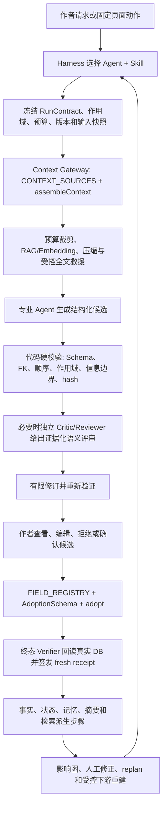

# StoryForge Agent + Harness 全面重构交接文档

> 更新日期：2026-08-14
>
> 交接分支：`feat/harness-rebuild-20260807`
>
> 远端分支：`origin/feat/harness-rebuild-20260807`
>
> 最新功能单元：`HARNESS-75 Prompt 示例生成 authoring-draft 风险裁决`（具体提交以 `git log -1` 为准）
>
> 世界引擎基线：`774a2ae feat(WORLD-2): close executable world foundation through 2F`
>
> 当前结论：重构主体约完成 82%～87%。这是工程范围估算，不是质量评分，也不代表可以合并发布。

本文用于把当前开发交给另一个模型或另一台电脑继续。代码、测试和提交历史仍是实现事实源；本文负责说明目标、边界、已完成范围、未完成范围、当前验证状态和下一步入口，避免接手者重新发明体系或偏离用户目标。

## 1. 接手者先做什么

新电脑首次接续：

```bash
git clone https://github.com/yuanbw2025/storyforge.git
cd storyforge
git fetch origin
git switch --track -c feat/harness-rebuild-20260807 origin/feat/harness-rebuild-20260807
npm ci
```

已经有本地仓库：

```bash
git fetch origin
git switch feat/harness-rebuild-20260807
git pull --ff-only
```

然后按顺序读取，不要无差别预载整个文档目录：

1. 根目录 `AGENTS.md`。
2. `docs/CONTEXT-ROUTING.md` 中与当前小单元匹配的路由。
3. 本交接文档。
4. `docs/roadmap/README.md` 的 HARNESS 段和 `docs/roadmap/CAPABILITY-BASELINE.md` 的 AGENT/HARNESS 段。
5. 需要核对目标设计时，再读 `docs/AI-HARNESS-FULL-FLOW-DESIGN-20260807.md` 对应阶段。
6. 需要核对审计事实时，再读 `docs/AI-HARNESS-AUDIT-20260807.md` 对应表格和源码/测试。

本交接文档提交后，当前分支相对 `origin/main` 为落后 1 个提交、领先 74 个提交。不要直接推 `main`，不要在接续前擅自 rebase 或合并；先完成当前功能单元和验证，再按 `docs/COLLAB-WORKFLOW.md` 串行处理。

## 2. 用户的最终目标

只针对“分步骤创作模式”，把 StoryForge 从大量独立 AI 按钮和局部质量功能，改造成成熟、稳定、可核查、可恢复、可持续演进的 Agent + Harness 创作系统。

完整产物链是：

```text
创作种子/项目参考
  -> 世界观与基础设定
  -> 故事核心
  -> 角色、物品与关系
  -> 主线、支线、角色弧与关键事件
  -> 卷纲
  -> 章纲
  -> 细纲/场景契约
  -> 正文
  -> 章节事实、状态、记忆和检索投影
  -> 影响分析、人工修正、重规划和受控下游重建
```

最终系统必须同时解决：

- 长期世界事实、角色状态、物品、势力、时间线、故事线和叙事承诺的一致性。
- 主角、配角、剧情线和前后章节之间的信息隔离与按剧情释放。
- 上下文预算、压缩、RAG/Embedding 检索、全文救援和压缩保真验证。
- 结构化候选、硬校验、语义评审、有限修订、重试、降级、恢复和完成判定。
- 作者确认后的受治理采纳、来源追踪、上下游影响分析和反向反馈。
- 日志、回放、指标、离线评测、失败注入、成本和延迟证据。

这不是“把更多字段拼进提示词”，也不是“为了多 Agent 而多 Agent”。Agent 是语义责任主体；Skill 是版本化任务方法；Harness 是过程控制与证据系统；确定性代码负责可以确定完成的验证和状态转换。

## 3. 不得改变的边界

### 3.1 产品范围

- 本轮只改分步骤创作模式。
- 世界引擎是另一条架构线。`WORLD-2C C3-C5 -> WORLD-2F` 的本地基座已经完成，但其体验问题不进入本轮 Harness 重构。
- 必须保留现有分步骤功能、人工编辑、Prompt 配置和已有可用工作流。新入口取代旧 AI 旁路时才同步删除旧旁路。
- 参考资料解析已经获得用户认可，不因“Agent 化”整体推倒重写；只针对重复角色、实体身份和版本证据做增量优化。
- 新基础设施未来应可迁移到世界引擎、角色聊天、跑团和文字游戏，但本轮不扩大实现范围。

### 3.2 三注册表铁律

每个新单元动手前必须回答：

1. AI 读什么，是否登记在 `CONTEXT_SOURCES`，是否只经 `assembleContext()`？
2. AI 写什么，是否登记在 `FIELD_REGISTRY + AdoptionSchema`，是否只经 `adopt()`？
3. 涉及哪些表，是否由 `PROJECT_TABLES` 派生导出、导入、删除、迁移、作用域和引用重映射生命周期？

禁止组件或 Service 手拼上下文、绕过采纳系统写受治理数据、手写第二份表清单、复制 AI/DB/RAG/导入导出入口，或只接 UI 不接数据和测试闭环。

### 3.3 Agent、Skill、Harness 的职责

| 层 | 应负责 | 不应负责 |
|---|---|---|
| 产品流程 | 作者目标、产物依赖、确认与回退体验 | 隐藏写库或隐藏模型调用 |
| Harness Supervisor | RunContract、step/attempt、预算、取消、重试、恢复、stale、终态 receipt | 拼接领域 Prompt、代替 Agent 创作 |
| 专业 Agent | 创意推理、因果权衡、语义判断 | 自报完成、直接写 Canon |
| Skill | 上下文配方、输入模式、输出合同、验证和修订策略 | 自建数据库读取、RAG 或写回系统 |
| Context Gateway | 注册源读取、预算、裁剪、压缩、检索和证据 Manifest | 扩大 Skill 权限 |
| Validator/Verifier | Schema、作用域、引用、hash、信息边界、真实 DB 终验 | 用模型自评代替硬证据 |
| Adoption | 作者确认后的唯一正式写回 | 自动接受模型候选 |
| Memory/RAG | Canon 投影、检索和派生记忆 | 冒充事实权威或 Skill |

## 4. 目标架构全貌



关键约束：模型返回文本不等于任务完成；候选持久化不等于业务写入；作者点击确认也不等于最终状态正确。只有独立终态 Verifier 对真实数据签发当前 receipt，Run 才能进入 `completed`。

## 5. 当前完成度如何理解

“约 80%”表示：核心运行底座、主要生成主路径和反向反馈从分析、交接、人工保存证明到修正后当前 replan 已经落地；受控下游重跑、剩余入口收口和真实模型质量发布证据还没有完成。

不能把以下事实误解为“全面完成”：

- 已有 57 个 HARNESS 编号，不代表 57 个产品阶段全部完成。
- 自动化测试通过只证明当前工程合同和回归，不证明真实模型文学质量。
- RAG、Embedding、事实账本和一致性 Agent 已存在，不代表每个入口都正确使用。
- `needs-manual-action` 已能跳到目标记录并证明同一正式记录发生了人工保存变化，但不代表旧影响已解决，也不代表下游已经重建。

## 6. 已完成的工作

截至最新功能提交 `f5615a8`，本分支在 `774a2ae` 之后共有 69 个提交；本交接文档另占后续一个 docs commit。完整历史可执行：

```bash
git log --oneline --reverse 774a2ae..HEAD
```

### 6.1 HARNESS-0～12：可恢复、可验证的运行底座

- 严格 RunContract、Context Manifest、verification receipt 和事件投影。
- `agentRuns / agentRunEvents / agentRunCheckpoints` durable ledger、连续序号、检查点、恢复和防篡改。
- 大纲生成、只读 Agent、主 Agent 候选和采纳中断恢复。
- 终态 verifier 回读真实数据，阻止模型自报完成、缺写、错写和旧 receipt。
- 正文视角字段和角色作用域治理。
- 整理本章、章节状态变化、正文生成、细纲生成、批量细纲和批量章纲 durable 化。
- 未来章、私人认知和视角信息边界。
- 旧批量正文旁路已下线。

核心入口：

- `src/lib/agent/run/contract.ts`
- `src/lib/agent/run/event-store.ts`
- `src/lib/agent/run/context-manifest.ts`
- `src/lib/agent/run/verification-receipt.ts`
- `src/lib/agent/run/master-durable.ts`
- `src/lib/agent/run/prose-generation-durable.ts`
- `src/lib/agent/run/detailed-outline-generation-durable.ts`
- `src/lib/outline/harness.ts`

### 6.2 HARNESS-13～29：Skill、上下文、语义评审和可靠协作

- 建立受治理 Agent/Skill Registry 和固定工作流分类。
- 为 empty/partial/complete 等输入状态建立统一 intake policy。
- 语义压缩、must-keep 锚点、来源 hash 和单来源全文救援；压缩只能发生在正式 reader 读出原文之后。
- 上下文交付评测、执行版本绑定和 45 天 Skill 新鲜度 CI。
- 正文 `review -> revise -> review` 有界语义闭环，blocking 必须提供候选和登记来源逐字证据。
- 正文采纳后的六域整理、章节记忆、检索/摘要和一致性守卫进入统一 post-adoption Run。
- 正文 Run 与章后 Run 通过 parent receipt 和正文 hash 建立 lineage。
- 主 Agent 同代依赖 join、最多两路的有限 fan-out、最多一次有限 replan 和候选级 fresh receipt。
- 顺序/fan-out 配对评测门和首批领域语义终验；真实外部模型证据不足，因此 fan-out 和原生 tool transport 默认关闭。
- H4 长篇一致性证据协议、40+20 合成长文目录、可恢复 runner 和聚合评分。
- provider 原生 `tool_calls` 只作为唯一只读 Runner 的默认关闭 transport 优化，没有复制第二套 Agent 系统。

核心入口：

- `src/lib/agent/skill-registry.ts`
- `src/lib/agent/workflow-catalog.ts`
- `src/lib/agent/context-policy.ts`
- `src/lib/agent/context-compression.ts`
- `src/lib/agent/information-boundary.ts`
- `src/lib/agent/prose-semantic-review.ts`
- `src/lib/agent/run/chapter-post-adoption-durable.ts`
- `src/lib/agent/run/master-step-verification.ts`
- `src/lib/evals/agent-harness/`
- `src/lib/evals/long-consistency/`

### 6.3 HARNESS-30～40：主要分步骤 AI 入口收口

| 分步骤能力 | 当前受治理 Agent/Skill | 已完成边界 |
|---|---|---|
| 主线/支线 | `outline.story-arcs` | 正式上下文、严格多阶段候选、durable 恢复、确认后 `adopt(storyArcs)` |
| 故事核心 | `world-origin.story-core` | 七字段逐字段严格候选、empty/partial/complete、CAS、终态回读 |
| 世界起源/自然/人文 | `world-origin.worldview-field` | 17 个字段统一 Skill、反推证据、压缩/全文救援、逐字段采纳 |
| 普通角色生成 | `character.create` | 一个严格角色候选、roster CAS、同名和枚举硬门、受治理采纳 |
| 灵感反推 | `inspiration.reverse` | 冻结作者选择碎片、版本化候选、确认后新增灵感版本，不自动写其它 Canon |
| 角色驱动开书 | `outline.character-driven` | 冻结方案、严格卷章候选、两次确认边界、只写所选卷 |
| 角色中途重规划 | `outline.character-revision` | 保护已写正文、三档方案、只 patch 未来大纲 |
| 单章细纲/场景 | `outline.details` | 章节页和细纲页共用 durable 控制器、严格 JSON、全文 Manifest stale |
| 已有角色补全 | `character.supplement` | 精确目标角色、字段闭集、可选剧情反哺、只 merge 所选字段 |
| 创作规则 | 既有世界基座 Agent 的固定 Skill | durable 候选、受治理写回、旧直调入口收口 |
| 已写章节故事线进度/交汇 | `outline.storyline-progress` | 正文逐字证据、闭集 ID/阶段、事务内三目标 `adopt()`、终态回读 |

卷纲、章纲、批量细纲和正文已有更早的 durable 主路径，不能按新标题重复开发。

### 6.4 HARNESS-41～58：正文后处理与反向反馈人工修正/重规划

- HARNESS-41/42：四步 post-adoption 屏障和可恢复失败步骤计划。
- HARNESS-43：确定性影响图覆盖来源事实、记录、后续大纲/章节、摘要、检索、故事线和派生状态。
- HARNESS-44/45：第一条受限反向 patch，只允许作者确认后经 `adopt()` 修改 `outlineNodes.summary`。
- HARNESS-46：把影响图分类成系统确定性重建项和作者确认项，冻结 source/graph/plan hash。
- HARNESS-47：零模型重建检索块和层级摘要，不改正文、事实或大纲。
- HARNESS-48：信息边界成为新正文合同的必需 acceptance。
- HARNESS-49：正文或影响图变化后重新生成当前 plan，旧计划只保留历史证据。
- HARNESS-50/51：作者 `acknowledged / needs-manual-action` 决定进入 durable receipt，并可按当前 plan 回放和重挂载恢复。
- HARNESS-52～54：把 `needs-manual-action` 交接到既有人工入口；地址必须绑定当前 review Run/receipt，并在目标工作区重新验签 source/graph/plan/item。
- HARNESS-55：进一步验证目标表、记录、World/Work 作用域和当前模块；章节/细纲 ID 归一为 `outlineNodeId`；既有面板会解除初始筛选、展开层级并高亮具体记录，但不会自动编辑或写 Canon。
- HARNESS-56：可信 handoff 建立零模型 child Run 并冻结正式目标 pre-state；只有作者在既有面板保存、显式终验且同一记录业务状态确实变化后才签发 receipt。刷新、覆盖、篡改、作用域、导入和终验后变化均 fail-closed。
- HARNESS-57：以 H56 fresh receipt/post-state 为父证据复用 HARNESS-49 planner，重建当前 graph/plan 并保守分类 resolved/remaining/new；工作区即时执行、来源编辑器可恢复，旧 review 不再冒充当前。
- HARNESS-58：来源编辑器重新验证 fresh H57 后，将其 current plan 的确定性余项交给 H47；child 绑定 H57 receipt/output，真实 output checkpoint 支持刷新、重复点击和 10 个 durable 边界恢复，只写检索块与层级摘要。
- HARNESS-59：以 AST 注册表冻结 UI 直调模型 census；初始 29 个文件 / 44 个静态入口，HARNESS-60～75 完成后为 14 个文件 / 26 个入口，分为 7 governed、5 auxiliary、2 migration；CI 拒绝未登记新增、计数漂移、残留和无迁移归属。
- HARNESS-60：将角色关系 AI 提取收口到 `character.relationships` Skill；上下文只经注册源读取并按 World 隔离，严格候选持久化后由作者勾选，确认才经 `adopt()` 写关系表与角色摘要，支持八个采纳中断点恢复、baseline stale、导入取消和 terminal receipt。
- HARNESS-61：情感节拍进入 `prose.emotion-beats` durable Skill；七个 Context Gateway 源、严格 3–6 拍候选、作者确认后 `adopt(emotionBeatCards)`、八边界恢复、baseline/context stale、导入取消与 terminal receipt 过期已闭合。
- HARNESS-62：重要地点进入 `world-origin.locations` durable 长任务；只读当前 Work/World 登记上下文，冻结章节/分块/模板/地点 baseline，每个已完成分块 checkpoint、只续跑剩余分块；模型结果不确定窗口不自动重试。全部调用后持久化严格候选，冻结作者选择后只经 `adopt(importantLocations)` 写入；八采纳边界、导入取消、作用域隔离和 terminal stale 已闭合。
- HARNESS-63：物品栏进入 `prose.inventory-extraction` durable 长任务；只读当前 Work 正文/流水与当前 World 角色，冻结提取范围、章节/分块/模板/roster/正式 baseline。全部调用后才形成严格候选，作者确认后按 `itemLedger.replaceScope=['chapterId']` 逐章事务替换；空候选可明确清理目标章，唯一姓名才绑定角色 FK。分块/跨章恢复、八采纳边界、导入取消、作用域隔离与 terminal stale 已闭合。
- HARNESS-64：故事年表进入 `prose.story-timeline-extraction` durable 长任务；模型只经 `chapterContent` 读取当前 Work 正文，完整正式年表仅由治理层回读作 CAS。计划冻结章节/Manifest/分块、提示词和正式 baseline；全部调用后形成按 `chapterId + title` 去重的严格候选，作者确认后按 `storyTimelineEvents.replaceScope=['chapterId']` 逐章事务替换并压缩 order。空选择清理目标已写章，八采纳边界、写后 checkpoint 恢复、导入取消、Work 隔离与 terminal stale 已闭合。
- HARNESS-65：正文浮动工具栏进入 `prose.selection-edit / prose.selection-check`。模型只经 `manualText` 读取冻结选区；编辑候选同时绑定 TipTap 范围、完整 HTML/正文/Prompt/Manifest，并在作者确认后以文本 + 精确 HTML 双 CAS 经 `adopt(chapters)` 写回。查漏只读；模型结果未知不重试；八采纳边界、写后恢复、终态 stale、导入取消与 Work/章节隔离已闭合。
- HARNESS-66：世界地图生成进入 `world-origin.map-config`。模型只经 `worldview / geography / codex / locations` 登记源读取当前 World；严格地图 JSON 先成为不可便携 durable 候选，作者确认后才以区分“字段缺失/null”的 exact-field CAS 经 `adopt(worldNodes.mapConfigJSON)` 定点写回。未知结果不重试；节点名、来源、Prompt、原配置、八采纳边界、导入取消、World/世界组/节点隔离与 terminal stale 已闭合，人工地图参数编辑保留。
- HARNESS-67：世界组详情七字段扩写进入 `world-origin.worldview-expand`。模型只经 `manualText / worldGroups / storyCore / worldview` 登记源读取已保存目标草稿、当前 Work 和当前 World；strict exact-key 七字段先成为不可便携 durable 候选。作者确认且目标组、完整正式 baseline、Context 与 Prompt 仍一致后，才在事务中经 `adopt(worldviews)` 原子写七字段。未知结果不重试；非目标字段、八采纳边界、首次创建、写后恢复、导入取消、World/Work/世界组隔离与 terminal stale 已闭合，人工世界组编辑保留。
- HARNESS-68：多世界总览建议进入 `world-origin.world-suggest`。模型只经 `manualText / worldGroups / storyCore` 登记源读当前 World/Work；strict 2～4 项结果先成为不可便携整批 durable 候选。作者选择非空子集，冻结选择和顺序，且项目提示、完整世界目录/关系、故事核心、Context 与 Prompt 仍 fresh 后，才在事务中经 `FIELD_REGISTRY + AdoptionSchema + adopt(worldGroups)` 原子新增八字段记录。同名、未知结果、八采纳边界、写后恢复、导入取消、World/Work 隔离与 terminal stale 已闭合；人工世界/关系 CRUD 保留，旧 `buildAllWorldsOverview()` 死路已删除。
- HARNESS-69：世界宪法设定扫描进入 `world-origin.constitution-extract`。模型只经 `constitutionScanSources` 登记源读当前 World 设定、当前 Work 故事核心、登记主题和主体；无损闭集不一致或超预算时在模型调用前失败。strict 0～80 项候选先持久化，作者批次确认且来源/主体/事实 baseline/Context/Prompt 仍 fresh 后，才在事务中经 `fact-ledger` Adoption Extension 原子写入 `temporalFacts(status=candidate)`。这只是第一层确认；每条仍须在既有 UI 中逐条确认或明确取代后才能成为 Canon。未知结果、八采纳边界、导入取消、World/Work 隔离和 terminal stale 已闭合，旧组件直调、直接查库、宽松 parser 与模型返回后立即写候选旁路下线。
- HARNESS-70：Codex 内容拆词条进入 `world-origin.codex-extract`。模型只经 `manualText / codexExtractionBaseline` 登记源读作者来源、目标分类/schema 和同世界组既有词条；长来源逐分块 checkpoint，只续跑剩余调用，未知模型结果不自动重试。strict 0～200 项候选先持久化，作者子集与顺序冻结后不可改选或取消；只有分类/schema、完整既有词条 baseline、Context 与 Prompt 仍 fresh，才在事务中经 `FIELD_REGISTRY + AdoptionSchema + adopt(codexEntries)` 原子新增。零候选、八采纳边界、导入取消、World/Work/世界组/分类隔离和 terminal stale 已闭合，旧组件直调、组件内 Context、宽松 parser、内存候选与直接写入旁路下线。
- HARNESS-71：修炼进度分析进入 `prose.cultivation-progress-extraction`。模型只经 `chapterContent / cultivationProgressExtractionBaseline` 读取目标正文、当前 World 角色、体系 DAG、规范章序和当前 Work 全量进度 baseline；严格候选不允许模型决定 transition。作者子集冻结后，事务内二次 CAS 并由系统按 DAG/章序确定新增与既有后续事件 transition，再经登记采纳层原子提交。空结果、未知模型窗、候选崩溃窗、八采纳边界、上游/正式状态 stale、World/Work/世界组隔离与 terminal receipt 已闭合；旧组件直调、宽松 parser、内存逐条写入旁路下线。
- HARNESS-72：伏笔建议进入 `outline.foreshadow-suggestions`。模型只经登记的 Canon、世界、故事、角色、规则、历史、地点与 `foreshadowSuggestionBaseline` 读取当前 Work；一次 strict exact-key JSON 调用直接生成 0～12 项规划候选，不再先生成自由文本、再调用第二个模型结构化。作者可选择子集，冻结后只有项目、完整伏笔 baseline、上游 Context 与 Prompt 仍 fresh，才在事务内二次 CAS 并经 `FIELD_REGISTRY + AdoptionSchema + adopt(foreshadows)` 原子新增 `planned` 伏笔，章节引用固定为空。未知模型窗、候选崩溃窗、八采纳边界、空结果、导入取消、Work 隔离与 terminal stale 已闭合；旧组件双模型直调、内存候选和逐条写入旁路下线，人工伏笔 CRUD 保留。
- HARNESS-73：历史事件/关键词的考据与风暴分别进入 `world-origin.history-consult / world-origin.history-storm`。模型只经 `worldview / historyAgentBaseline` 读取当前 World/世界组、已保存历史总述/纪年、精确目标与作者边界；严格 Markdown 先成为不可便携持久候选。作者确认且来源、Context、Prompt 与原结果字段 presence/value CAS 仍 fresh 时，才只经 `adopt()` 写 `aiConsult` 或 `aiBrainstorm`，另一路结果可独立变化。未知模型窗、候选恢复、八采纳边界、目标删除、导入取消、World/Work/世界组隔离与 terminal stale 已闭合；旧两路 `useAIStream`、组件内 Context 和即时写回旁路下线，人工历史 CRUD 与结果清除保留。
- HARNESS-74：参考分析总结/角色聚合分别进入 `inspiration.reference-summary / inspiration.reference-characters`。模型只经 `referenceDerivedBaseline` 读取当前 Work 的精确参考、精确分析版本、分块派生输入与来源声明；strict JSON 先成为不可便携持久候选。作者确认且来源、Context、Prompt、版本字段及兼容投影字段 presence/value CAS 仍 fresh 时，才先经 `adopt(referenceAnalysisRuns)` 写版本字段；仅 active 版本同步 `adopt(references)` 投影，ready/superseded 不污染当前参考。未知模型窗、候选恢复、版本/投影分段写入、十个采纳边界、目标删除、导入取消、Work/版本隔离与 terminal stale 已闭合；旧两处组件 `chat()`、内存输出和即时写回旁路下线。
- HARNESS-75：`PromptExamplesEditor` 经实际数据路径复核后归 `authoring-draft` auxiliary，而非机械建立 durable Agent。模型只读 Prompt 编辑器当前未保存 draft，输出只经父组件 `onChange` 进入内存；生成后 `promptTemplates` 和 Agent ledger 零写，作者另点顶部「保存」后才经原 Prompt store 写全局本机配置。`promptTemplates` 已由 PROJECT_TABLES 登记为 `owner=global / exportable=false`；未保存离开丢弃、系统模板只读、配置缺失零调用与显式保存由专项反例闭合。

HARNESS-58 最新代码入口：

- `src/lib/consistency/impact-handoff.ts`
- `src/lib/agent/run/impact-handoff-durable.ts`
- `src/lib/agent/run/impact-manual-correction-durable.ts`
- `src/lib/agent/run/impact-post-correction-replan-durable.ts`
- `src/lib/agent/run/impact-post-correction-remediation-durable.ts`
- `src/lib/agent/run/impact-remediation-durable.ts`
- `src/lib/agent/run/impact-review-durable.ts`
- `src/lib/agent/run/ledger-portability.ts`
- `src/pages/WorkspacePage.tsx`
- `src/components/shared/initial-record-target.ts`
- `tests/regression/R-HARNESS55-impact-target-validation.test.ts`
- `tests/regression/R-HARNESS55-impact-target-ui.test.tsx`
- `tests/regression/R-HARNESS56-impact-manual-correction.test.ts`
- `tests/regression/R-HARNESS57-impact-post-correction-replan.test.ts`
- `tests/regression/R-HARNESS58-impact-post-correction-remediation.test.ts`

## 7. 分步骤全链的真实现状

| 阶段 | 已完成 | 仍缺失或不应误报 |
|---|---|---|
| 创作种子 | 灵感反推已统一到 durable Skill；参考分析有来源、版本和断点基座 | 参考解析重复角色/实体消歧未完成；不应整体重写已获认可的解析器 |
| 世界基座 | 起源/自然/人文 17 字段和故事核心已统一 Agent/Skill；支持空、部分、完整输入 | “只给一个角色或一个环境字段，先生成依赖图再反推出成套世界设定”的多字段候选包尚未交付；当前逐字段反推不能冒充完整反推工程 |
| 角色/物品/关系 | 普通角色、角色补全和从现有大纲/正文提取角色关系已闭环；已有物品、关系、状态账本与人工入口 | 物品创作、从零角色关系编排和由单角色反推整套世界尚未交付；不得用“证据提取”冒充“创意编排” |
| 主线/支线 | 静态故事线和已写章动态进度/交汇已收口；角色驱动开书和中途重规划已闭环 | 更完整的 Narrative Blueprint、主支线混编质量和真实模型评测仍不足 |
| 卷纲/章纲 | 单次和批量 durable 主路径存在，候选和采纳可恢复 | 个别历史路径允许账本不可用时显式降级为内存 shadow；需继续审计，不得静默扩张降级 |
| 细纲/场景 | 单章和批量 durable；章节入口旁路已收口 | 真实模型的场景质量、信息释放和上下文救援 A/B 未完成 |
| 正文 | 生成/续写、信息隔离、语义 review/revise/review、作者确认采纳和父子 Run已完成；局部润色/扩写/缩写/改写已进入 durable 候选与精确采纳，查漏保持只读 | 不覆盖已有手稿；长期文学质量和真实 provider 发布证据未完成 |
| 章后状态 | 六域候选、章节记忆、检索/摘要和确定性一致性守卫进入统一 Run | 语义 Fast/Deep 仍是显式动作；所有状态类型的通用自动采纳不应实现 |
| 反向反馈 | 影响图、受限 patch、确定性重建、作者复核、可信精确交接、人工保存 pre/post receipt、修正后 resolved/remaining/new 当前计划及其确定性余项 child 执行已完成 | AI 下游重新生成和通用依赖重跑尚未完成；每次只允许按一个目标类型扩展 |
| 评测/发布 | 大量模块回归、H4 工程基座、配对 gate 和防篡改证据存在 | 真实外部模型 H4 40+20 artifact、人工 held-out 复核、真实质量/成本/延迟净收益未完成 |

## 8. 当前停点：HARNESS-75 已完成，当前验证证据

### 8.1 已通过

- HARNESS-47/57/58 定向回归：20 项通过；其中 H58 7 项覆盖父子 lineage、真实输出复用、frozen output 篡改和 10 个 durable 中断边界。
- HARNESS-59 AST census 守卫通过：HARNESS-60～75 后为 14 个文件 / 26 个入口，7 governed、5 auxiliary、2 migration。
- HARNESS-60 定向回归 10 项通过：候选零写入、严格 parser/精确实体、刷新恢复、baseline stale、拒绝、八个持久化边界中断恢复、导入取消和多世界隔离。
- HARNESS-61 定向回归 14 项通过：七源真实 prompt、候选零写入、严格 parser、刷新/拒绝、八边界恢复、写前二次 CAS、写后上游 stale 拒绝终验、adoption 后正式卡漂移暂停、terminal 后卡/上游改变撤销 receipt、导入取消和作用域隔离。
- HARNESS-62 定向回归 14 项通过：多分块全完成后候选、零正式写入、只续跑剩余分块、候选事件与检查点间中断重建、模型结果不确定禁止重试、任一分块协议失败时无部分候选、上游 CAS、候选/冻结选择恢复、严格 parser、八采纳边界、导入取消、Work/World 隔离、terminal stale 和旧旁路下线。与 H59/C 组合计 24 项定向回归通过。
- HARNESS-63 定向回归 14 项通过：范围与分块冻结、候选前零正式写入、只续跑剩余调用、候选崩溃窗重建、模型不确定与协议失败、上游/baseline CAS、空候选清理、唯一姓名/同名角色 FK、逐章事务替换、八采纳边界、导入取消、Work/World 隔离、terminal stale 和旧旁路下线。与 H59 组合计 17 项通过。
- HARNESS-64 定向回归 14 项通过：RunContract/Manifest、分块前零写入与安全续跑、候选崩溃窗重建、模型不确定与严格协议、正文/Prompt/baseline CAS、`chapterId + title` 去重、逐章 order 压缩与范围外冻结、空选择清理、八采纳边界、正式写后 checkpoint 恢复、导入取消、Work 隔离、terminal stale 和旧旁路下线。与 H59/H63 联合计 31 项通过。
- HARNESS-65 定向回归 21 项通过，另有 RichEditor 2 项与真实浏览器 E2E：只向模型发送冻结选区、候选刷新恢复不重复调用、作者确认后才精确替换且刷新持久化；真实 UI 复核发现并修复工具栏异步挂载/延迟隐藏时序缺口。
- HARNESS-66 定向回归 22 项通过，和地图读全、空间约束、导出重映射、H59 census 组合为 36 项：登记 Context、确认前零正式写入、严格 exact-key JSON、模型未知窗口、候选崩溃窗、Context/Prompt/节点名/原配置 CAS、拒绝、八采纳边界、写后恢复、导入取消、World/世界组/节点隔离、terminal stale 与旧旁路下线均闭合。真实浏览器证明候选刷新恢复不重复模型调用，确认后才换图，人工比例尺仍可持久化。
- HARNESS-67 durable 专项 22 项、组件 UI 5 项与 H59/H13 合计 37 项通过：登记四源 Context、确认前七字段零写、strict exact-key JSON、模型未知窗口、候选崩溃窗、世界组/Context/Prompt/完整 baseline CAS、非目标字段冻结、拒绝、八采纳边界、首次创建、确认后 UI 恢复终验、导入取消、World/Work/世界组隔离、terminal stale 与旧旁路下线均闭合。真实浏览器证明候选刷新恢复不重复模型调用，确认前正式世界来源保持旧值，确认后七字段持久化。
- HARNESS-68 durable 专项 22 项、组件 UI 5 项与 H59/H67 合计 52 项通过：三源 Context、候选前零正式写、刷新整批恢复/子集选择、strict 2～4 项 JSON、批内/已有同名、模型未知窗口、候选崩溃窗、项目/目录/关系/故事核心/Context/Prompt stale、拒绝、八采纳边界、terminal stale、导入取消、World/Work 隔离、活跃作用域切换与旧旁路下线均闭合。定向真实浏览器用例证明候选刷新恢复不重复模型调用，作者只选两项时仅新建该子集。
- HARNESS-69 durable 专项 23 项、组件 UI 5 项、既有 CONSISTENCY-3 4 项和 H59 3 项共 35 项通过：登记闭集实际进入模型、候选前零事实写入、刷新恢复、strict 0～80 项 JSON、空结果、重复事实拒绝、模型未知窗、候选崩溃窗、来源/主体/事实 baseline/Context/Prompt stale、事务内二次 CAS、拒绝、八采纳边界、terminal stale、导入取消、World/Work 隔离、活跃作用域切换与旧旁路下线均闭合。批次确认只写 `status=candidate`，逐条 Canon 确认保持独立。
- HARNESS-70 durable 专项 21 项、组件 UI 5 项和 H59 3 项共 29 项通过：两登记 Context 实际进入模型、分类/schema/既有词条 baseline、候选前零正式写入、长来源只续跑剩余分块、strict 0～200 项 JSON、select/number/ref 类型语义、标签选项、已有/跨块重名严格拒绝、零候选回执、模型未知窗、候选崩溃窗、来源/分类/schema/既有词条/Prompt stale、事务内二次 CAS、选择冻结、八采纳边界、terminal stale、导入取消、World/Work/世界组/分类隔离与旧旁路下线均闭合。
- HARNESS-71 durable 专项 22 项与原修炼领域/UI 7 项通过：两登记 Context 实际进入模型、候选前零正式写入、strict exact-key JSON、闭集 ID/唯一逐字证据、transition 系统确定、空结果、模型未知窗、候选崩溃窗、正文/章序/角色/体系 DAG/完整进度 baseline/Prompt stale、事务内二次 CAS、选择冻结、八采纳边界、既有后续事件原子归一化、导入取消、World/Work 隔离、terminal stale 与旧旁路下线均闭合。
- HARNESS-72 durable 专项 18 项、组件 UI 2 项、H59 3 项与 Context Gateway 通用预算反例 3 项通过：登记 Canon/角色/完整伏笔 baseline 实际进入一次模型调用、候选前零正式写入、strict exact-key 0～12 项 JSON、枚举/空白/重复名拒绝、空结果、模型未知窗、候选崩溃窗、项目/正式伏笔/故事核心/角色/Context/Prompt stale、事务内二次 CAS、选择冻结、八采纳边界、导入取消、Work 隔离、terminal stale、通用空项目装配与旧双模型旁路下线均闭合。
- HARNESS-73 durable 专项 18 项，更新后的控制器/UI/既有历史 17 项与注册表 11 项共 46 项定向回归通过：两登记 Context 实际进入模型、事件/关键词 × 考据/风暴目标闭集、确认前正式结果零写入、有序标题严格 Markdown、模型未知窗、候选崩溃窗、来源/Context/Prompt/原结果字段 stale、另一路结果独立变化、八采纳边界、目标删除、导入取消、World/Work/世界组隔离、terminal stale 与旧两路组件旁路均闭合。
- HARNESS-74 durable 专项 20 项、控制器 3 项、组件 UI 3 项与 H59 3 项共 29 项定向回归通过：登记版本 baseline 实际进入模型、总结/角色两模式严格协议、恢复完成前快速点击阻断、缺少模型配置时零 Run、重试真实创建新 Run、确认前版本与参考投影零写入、模型未知窗、候选崩溃窗、来源/Context/Prompt/版本及投影字段 stale、active 双写/ready 单写、版本/投影分段写入后的十个采纳边界、目标删除、导入取消、Work/版本隔离、terminal stale 与旧两处组件直调旁路均闭合。
- HARNESS-75 专项 3 项与 H59 3 项共 6 项定向回归通过：模型只读当前 Prompt draft 并保留 `prompt.examples` 消耗分类；生成后 DB/Agent ledger 零写，作者显式保存后才写全局模板；未保存离开丢弃、系统模板只读、配置缺失零调用和 PROJECT_TABLES 全局生命周期均已闭合。
- `npx tsc --noEmit`：通过。
- 改动范围 ESLint 与全仓 `npm run lint`：通过。
- `git diff --check`：通过。
- `npm run test:coverage` 独占资源重跑：365 个测试文件、1728 项测试全部通过。
- 覆盖率：statements 81.78%、branches 73.79%、functions 79.15%、lines 81.78%。
- `npm run build`：通过，3765 个模块完成生产构建。
- `npm run check:bundle-size`：通过；入口约 669.7 KiB，gzip 约 207.1 KiB。
- `npm run ci`：完整通过，包括 required tables、AI manual/entry registry、architecture、source reachability、roadmap、agent context/freshness、Canon coverage、project metrics、生产依赖审计、全仓 lint、TypeScript、全量 coverage、生产构建和 bundle budget。

### 8.2 CI / 工作树状态

原先阻断 CI 的 `nanoid` 公告已在同一主版本内修复：直接依赖从 `5.1.11` 升至 `5.1.16`，没有运行 `npm audit fix` 或 `npm audit fix --force`。当前生产依赖检查为：

```text
> npm audit --omit=dev --audit-level=moderate
found 0 vulnerabilities
```

H64～H74 在独立 worktree 中完成；原工作树的作者改动及未跟踪 `output/` / `tmp/` 未被读取、修改或提交。H74 的最终架构、CI 与 E2E 数字以本节最新记录为准。

### 8.3 E2E 状态

HARNESS-66 最终 `npm run ci:e2e` 使用项目指定 Playwright Chromium、单 worker 和独立浏览器数据原样运行，43/43 通过，耗时约 3.4 分钟。地图用例冻结实际 OpenAI-compatible API 请求，证明候选可刷新恢复、模型只调一次、确认前正式地图不变、确认后地图生效且人工比例尺刷新持久化。首次全量运行还稳定暴露城池重要地点异步自动保存与立即刷新的竞态（重复 5 次为 4/5）；Codex 同记录写入改为串行并显示真实保存状态后，该用例重复 5/5、最终全量 43/43。没有使用或修改作者当前预览项目。

HARNESS-67 最终 `npm run ci:e2e` 使用项目指定 Playwright Chromium、单 worker 和独立浏览器数据原样运行，44/44 通过，耗时约 3.5 分钟。新增主路径用例约 8.7 秒：创建项目、经备份安全门开启多世界、保存目标世界草稿、拦截真实 OpenAI-compatible 请求、生成候选、确认前回读旧正式世界观、刷新恢复候选、作者确认后回读新七字段并再次刷新持久化；全过程模型只调用一次。没有使用或修改作者当前预览项目。

HARNESS-68 最终 `npm run ci:e2e` 使用项目指定 Playwright Chromium、单 worker 和独立浏览器数据原样运行，45/45 通过，耗时 3.7 分钟。新增主路径用例约 7.1 秒：创建项目、经备份安全门开启多世界、拦截真实 OpenAI-compatible 请求、生成整批候选、确认前回读正式世界零增量、刷新恢复候选、作者勾选两项后确认，再回读只有该子集持久化；全过程模型只调用一次。没有使用或修改作者当前预览项目。

HARNESS-69 最终 `npm run ci:e2e` 使用项目指定 Playwright Chromium、单 worker 和独立浏览器数据原样运行，46/46 通过，耗时 3.8 分钟。新增主路径用例约 6.8 秒：创建项目与已登记世界观来源、拦截真实 OpenAI-compatible 请求并验证请求正文包含该来源、生成扫描批次、确认前事实表零写入、刷新恢复同一批候选、作者确认后只新增 `status=candidate` 的待确认事实，再次刷新后候选与逐条确认入口仍存在；全过程模型只调用一次。没有使用或修改作者当前预览项目。

HARNESS-70 最终 `npm run ci:e2e` 使用同一项目 Chromium、单 worker 和独立浏览器数据原样运行，47/47 通过，耗时 3.9 分钟。新增主路径用例约 6.0 秒：从零创建项目并进入自然环境的世界结构 Codex，拦截真实 OpenAI-compatible 请求并证明登记分类/schema/作者来源进入实际 Prompt；候选生成后刷新，正式词条仍为零且同一候选从 ledger 恢复，模型调用保持一次；作者确认后才原子新增词条，再次刷新仍持久化。没有使用或修改作者当前预览项目。

HARNESS-71 最终 `npm run ci:e2e` 使用同一项目 Chromium、单 worker 和独立浏览器数据原样运行，47/47 通过，耗时 3.9 分钟。修炼主路径用例约 11.3 秒：从零创建项目、章节、角色与修炼 DAG，拦截真实 OpenAI-compatible 请求并验证登记正文与 baseline 进入实际 Prompt；候选生成后刷新，正式进度保持零写入且同一候选从 ledger 恢复，模型调用保持一次；作者确认后才由系统计算 transition 并原子写入，再次刷新仍恢复 terminal 状态。没有使用或修改作者当前预览项目。

HARNESS-72 最终 `npm run ci:e2e` 使用同一项目 Chromium、单 worker 和独立浏览器数据原样运行，48/48 通过，耗时 4.0 分钟。伏笔主路径用例约 5.8 秒：从零创建项目并进入伏笔面板，拦截真实 OpenAI-compatible 请求并验证项目、正式伏笔 baseline 与严格协议进入实际 Prompt；候选生成后刷新，正式伏笔仍为零且同一候选从 ledger 恢复，模型调用保持一次；作者确认后才原子新增 `planned` 伏笔，再次刷新仍持久化。没有使用或修改作者当前预览项目。

HARNESS-73 最终 `npm run ci:e2e` 使用同一项目 Chromium、单 worker 和独立浏览器数据原样运行，49/49 通过，耗时 4.2 分钟。历史考据主路径用例约 6.3 秒：从零创建项目和历史事件，拦截真实 OpenAI-compatible 请求并验证登记世界观、精确历史 baseline 与严格协议进入实际 Prompt；候选生成后刷新，正式考据结果仍为空且同一候选从 ledger 恢复，模型调用保持一次；作者确认后才只写目标 `aiConsult`，再次刷新仍持久化。没有使用或修改作者当前预览项目。

HARNESS-74 最终 `npm run ci:e2e` 使用同一项目 Chromium、单 worker 和独立浏览器数据原样运行，50/50 通过，耗时 4.3 分钟。参考派生主路径约 8.1 秒：从零创建项目并在独立浏览器 IndexedDB 构造 active 参考分析版本，拦截真实 OpenAI-compatible 请求并验证精确版本 baseline、分块取样与 HARNESS-74 严格协议进入实际 Prompt；候选生成后刷新，版本和参考投影仍为空且同一候选从 ledger 恢复，模型调用保持一次；作者确认后版本与 active 参考投影同步写入，再次刷新仍持久化。配置前置修正后的最终代码又精确复跑该路径 1/1 通过（9.4 秒）。没有使用或修改作者当前预览项目。

HARNESS-75 把完整项目 Chromium 套件扩展为 51 条并整套重跑，51/51 通过，耗时 4.3 分钟。Prompt 示例路径在完整运行中 3.9 秒：从设置页创建全局用户模板，在不保存 Prompt 字段的情况下拦截真实 OpenAI-compatible 流式请求，验证模型只看到当前 draft 且看不到项目内容；结果显示后直接读取 IndexedDB，证明模板正式字段/examples 与 Agent ledger 均未变化；作者点击保存后示例才写入，刷新重新选择模板仍可见，模型调用保持一次。独立精确复跑也 1/1 通过（5.5 秒）。没有使用或修改作者当前预览项目。

### 8.4 测试负载注意事项

第一次把 `lint`、`tsc` 和 `test:coverage` 并行执行时，两个旧长链测试文件有 9 项固定 5 秒超时；两个文件单独运行 31/31 通过，随后独占资源的完整覆盖率 1393/1393 通过。接手者不要把全量覆盖率与类型检查并行跑，以免制造资源争用假失败。

## 9. 下一步应该怎么做

下面编号是交接建议，尚未作为正式 roadmap 任务冻结。接手者开始前应先在路线图登记小单元、输入/输出、三注册表影响、测试和回滚边界。

### 9.1 已完成：人工修正完成证据

目标：用户从可信 handoff 到达具体记录、使用既有面板完成保存后，系统能证明“哪个目标从什么状态变成什么状态”，而不是把导航或点击当成修正完成。

已交付边界：

- 不调用模型。
- 不新增通用修正表单，不替代既有面板。
- 不自动写 Canon；人工编辑继续走各面板原有受治理入口。
- 复用 `agentRuns / agentRunEvents / agentRunCheckpoints` 记录零模型完成证明，没有新增表。
- 完成证明至少绑定：来源章节、来源章纲、review Run/receipt、itemId、source/graph/plan hash、目标 table/record、目标 pre-state hash、目标 post-state hash、当前 World/Work 和 verifier 版本。
- 仅“打开目标”不得产生完成 receipt；必须重新读取正式目标并验证状态变化。
- 目标缺失、作用域变化、review 被新决定覆盖、source/graph/plan stale、pre/post 相同、证据篡改都应 fail-closed。
- 是否允许“无需改动但人工确认已正确”必须先作为显式产品决策；不能偷偷把相同 hash 当修复成功。

建议入口：

- `src/lib/agent/run/impact-handoff-durable.ts`
- `src/lib/agent/run/impact-review-durable.ts`
- `src/lib/consistency/impact-remediation-plan.ts`
- `src/pages/WorkspacePage.tsx`
- 各面板的正式保存回调和现有 target resolver

建议测试先行：

- 导航但未保存，不得完成。
- 合法保存后 pre/post hash 不同，可签发 receipt。
- 修改错误记录、跨 Work 记录、目标被删除或 review 被覆盖均拒绝。
- 刷新后可回放完成证明，不重复生成 Run。
- 篡改 candidate/receipt/target hash 时拒绝恢复。
- 项目导出导入后明确按不可便携证据处理：待处理 Run 取消，terminal receipt stale。

### 9.2 已完成：修正后的 stale 与 replan

目标：人工修正完成后重新计算当前影响图和处理计划，明确哪些旧项已解决、哪些仍存在、哪些是新影响；旧 handoff 和旧计划不得继续冒充当前。

要求：

- 复用 `replanImpactRemediationV1()`，不要建立第二个计划器。
- 先检查现有影响图是否真的包含目标记录状态 hash；如果没有，先补确定性输入和反例测试，不能假设上游保存一定改变 graph hash。
- 新 plan 必须绑定修正完成 receipt 和当前 source/graph/target state。
- 旧 review/handoff/plan 保留历史证据但进入 stale，不物理删除。
- 只有当前图不再包含等价问题或新 verifier 明确通过时，才可显示 resolved。
- 不在本单元自动重跑任何模型任务。

### 9.3 当前第一优先：受控下游重建与重新生成

先分两条路径：

1. 确定性派生：继续复用 HARNESS-47，只在白名单内扩展可重建摘要、检索和其它纯派生投影。
2. 生成式下游：必须创建新的 Agent Run 和候选，重新装配当前上下文，作者确认后才写回；绝不自动覆盖正文、大纲、事实或锁定数据。

每次只增加一个目标类型，必须冻结依赖图、允许写字段、目标 CAS、最大重试和终态 verifier。不要一次实现“自动级联所有下游”。

### 9.4 第四优先：剩余分步骤入口与完整反推

反馈闭环稳定后，重新沿真实 UI 做一次剩余入口 census，重点核对：

- 单角色或单环境字段反推完整世界基座的依赖图和多字段候选包。
- 力量体系、修炼体系、物品创作、角色关系编排等仍由旧直接生成路径承担的部分。
- 参考解析重复角色和实体 identity resolution。
- 仍存在的手工上下文、直接模型调用、弱 parser、内存 shadow 和直接写库旁路。

反推能力不能用一条超长 Prompt 一次猜完整世界。目标流程应是：识别种子 -> 构建依赖图 -> 分组推断 -> 为每个候选记录 `derivedFrom / assumptions / confidence / conflicts` -> 作者逐组确认 -> 经既有注册表采纳。

### 9.5 第五优先：真实模型质量、成本与发布证据

工程闭环完成后才做真实 provider 评测：

- 固定世界观、角色、主支线、卷纲、细纲和正文端到端回归集。
- 对比旧入口与 Agent/Harness 新入口，而不是只比较 Prompt 长短。
- 验证事实/约束覆盖、信息泄漏、状态连续性、证据精度、人工修改量、完成率、p95 延迟、token 和成本。
- 跑满 H4 development 40 + held-out 20 的真实独立 generator/verifier artifact，并进行人工 held-out 复核。
- 没有达到预注册门槛时，不默认开启更宽 fan-out、原生 tool transport 或自动语义审查。

## 10. 仍未解决的重要产品问题

- Skill 的物理格式是否继续代码注册、是否允许高级用户编辑，尚未决策。
- 多字段反推是一次候选包还是分组多 Run，需要用恢复复杂度和作者确认体验验证。
- 全文救援的触发阈值、最大成本和不同模型窗口策略需要真实评测。
- “人工确认无需修改”是否可以关闭影响项，需要明确的独立状态和理由，不能复用 `acknowledged` 冒充修复。
- 只分析但未产生任何 durable 动作的临时 impact plan 是否值得跨浏览器持久化，尚未决策。
- 语义 Agent 只应提供证据化建议；事实权威、顺序、引用、作用域、状态转换和完成判定继续由代码负责。

## 11. 禁止接手者做的事

- 不要把 Harness 继续做成提示词拼接器。
- 不要为每个字段新建一个 Agent；同一专业 Agent 下用不同 Skill。
- 不要让 Skill 复制数据库 reader、RAG、Embedding、Prompt runner 或写回实现。
- 不要把 RAG 当权威事实库；它是 Canon 和长文的分块检索投影。
- 不要默认整本全文回灌；全文只能受预算、证据和失败原因控制地升级。
- 不要让 Prose Agent 看到未来剧情全文或角色不应知道的私密信息。
- 不要让模型自评替代 Schema、FK、hash、作用域、信息边界和真实 DB 终验。
- 不要自动采纳、自动覆盖手稿或自动级联重写全部下游。
- 不要重复开发已有的卷章纲、细纲批量、事实、状态、认知、物品、检索、摘要和影响分析能力。
- 不要把世界引擎体验问题混入当前分步骤 Harness。
- 不要直接推 `main`，不要创建平行 AI/DB/导入导出系统，不要执行 `npm audit fix --force`。

## 12. 每个后续小单元的完成定义

每个小单元必须在开始时写清：

| 项目 | 必填内容 |
|---|---|
| 用户路径 | 从哪个真实分步骤入口开始，到哪个可见结果结束 |
| 输入 | 登记的 source keys、作用域、快照和预算 |
| 输出 | 严格候选或确定性结果合同 |
| 写入 | FIELD_REGISTRY/AdoptionSchema 目标，或明确零写入 |
| 表生命周期 | PROJECT_TABLES 影响，或明确不新增表 |
| 状态机 | step、attempt、暂停、重试、stale、终态条件 |
| 硬验证 | Schema、FK、hash、顺序、信息边界、作用域、CAS |
| 语义验证 | 是否需要模型；需要时必须有独立证据和预算 |
| 作者边界 | 何时查看、编辑、拒绝、确认；何时才写 Canon |
| 回滚 | 关闭开关、拒绝候选或回到旧人工入口的边界 |
| 证据 | 定向测试、反例、生命周期、刷新恢复、必要的 E2E |

完成不等于“代码写了”或“测试文件存在”。必须证明真实入口使用、旧旁路下线、三注册表完整、失败可恢复、终态可核验且文档同步。

## 13. 建议验证顺序

先小后大，不要并行跑重型任务：

```bash
npx vitest run tests/regression/R-HARNESS56-impact-manual-correction.test.ts tests/regression/R-HARNESS55-impact-target-validation.test.ts tests/regression/R-HARNESS55-impact-target-ui.test.tsx
npm run check:architecture
npm run check:required-tables
npm run check:ai-manual
npx tsc --noEmit
npm run lint
npm run test:coverage
npm run build
npm run check:bundle-size
npm run ci:e2e
git diff --check
```

提交交付前仍以根 `AGENTS.md` 的最新闸门为准。不得以历史通过记录代替当前单元应执行的定向回归、完整 CI 与适用 E2E。

## 14. 关键事实源和排查入口

| 要查什么 | 先看哪里 |
|---|---|
| 目标设计与全流程图 | `docs/AI-HARNESS-FULL-FLOW-DESIGN-20260807.md` |
| 现状审计和真实接入表 | `docs/AI-HARNESS-AUDIT-20260807.md` |
| 运行合同和 ADR | `docs/AI-HARNESS-ARCHITECTURE-20260803.md` |
| 当前 backlog 和已交付边界 | `docs/roadmap/README.md` |
| 防止重复开发 | `docs/roadmap/CAPABILITY-BASELINE.md` |
| AI 读什么 | `src/lib/registry/context-sources.ts`、`assemble-context.ts` |
| AI 写什么 | `src/lib/registry/field-registry.ts`、`adoption-schema.ts`、`adopt.ts` |
| 表生命周期 | `src/lib/registry/project-tables.ts` |
| Agent/Skill | `src/lib/agent/skill-registry.ts`、`workflow-catalog.ts`、各 `*-copilot.ts` |
| durable 运行 | `src/lib/agent/run/` |
| 信息隔离 | `src/lib/agent/information-boundary.ts`、`R-HARNESS9`、`R-HARNESS48` |
| 事实/认知/物品/检索 | `src/lib/fact-ledger/`、`knowledge-ledger/`、`retrieval/`、相关 registry tests |
| 影响反馈 | `src/lib/consistency/impact-*`、`src/lib/agent/run/impact-*` |
| 当前 HARNESS-57 UI/重规划 | `WorkspacePage.tsx`、`ChapterEditor.tsx`、`impact-manual-correction-durable.ts`、`impact-post-correction-replan-durable.ts` |

## 15. Git 交接状态

- 2026-08-13 跨电脑交接前的代码提交为 `757ce47`，已推送到 `origin/feat/harness-rebuild-20260807`；本交接文档随后作为独立 docs commit 推送，接手时以远端 `git log -1` 为准。
- 没有创建 PR，没有修改或推送 `main`。
- 接手者拉取后先执行 `git status --short --branch` 和 `git log -5 --oneline --decorate`，确认没有本地脏改动或分支偏移。
- 合并前必须处理 `origin/main` 的 1 个新提交，并重新生成可能漂移的 AI manual/project metrics；不要手改生成文件冲突。

## 16. 最终交接结论

当前重构已经从“提示词字段拼接 + 零散质量检查”推进到真正的 Agent/Skill + durable Harness 主体：主要生成入口有明确职责、上下文证据、结构化候选、作者确认、受治理采纳、终态验证、恢复和回放；正文也具备信息隔离、语义评审、章后状态和影响图。

当前最关键的未闭环不是再造 Agent。HARNESS-56～58 的反向反馈后半链、HARNESS-59 census、HARNESS-60～74 的高风险入口与 HARNESS-75 的 Prompt 草稿风险裁决已经分别闭合。接手者应按 census 继续清理剩余 2 个文风 migration，每次只扩展一个真实目标类型；随后完成生成式下游重建与通用依赖闭环，最后取得真实模型质量/成本/延迟、真实 E2E 和完整 CI 发布证据。任何接续工作都应沿这个顺序推进。

## 17. 2026-08-14 跨电脑接续状态（当前权威入口）

### 17.1 接续目标与非范围

目标保持为：按照原计划原方案，全部完成 StoryForge 当前 Agent + Harness 重构工作；闭合反向反馈后半链，收口剩余分步骤入口，完成三注册表与数据生命周期治理，并取得真实模型质量、成本、延迟、E2E 与 CI 发布证据；不迁移或引入平行外部 Harness 运行时。

- OpenCode、Pi 等外部 Harness 只作为后续对标/优化方向；本轮不迁移、不引入，也不因此改变原设计。
- 继续使用 `feat/harness-rebuild-20260807`，不得直接修改或推送 `main`。
- 不要改写已推送历史或 force-push；从远端最新提交继续追加。
- 用户本机未跟踪的 `output/`、`tmp/` 不属于项目交付，禁止删除、暂存或提交。
- 未完成剩余入口、真实模型、E2E 和 CI 证据前，不得把总目标标记为完成。

### 17.2 拉取与状态确认

新电脑执行：

```bash
git fetch origin
git switch -c feat/harness-rebuild-20260807 --track origin/feat/harness-rebuild-20260807
# 若本地已有该分支，则改为：
# git switch feat/harness-rebuild-20260807
# git pull --ff-only

git status --short --branch
git log -10 --oneline --decorate
```

若 GitHub HTTPS 在代理环境中连接异常，可对单次命令使用 `git -c http.version=HTTP/1.1 fetch origin`；不要为此静默改写全局配置。

交接时分支上的连续实现提交：

```text
631818e HARNESS-56 手工影响修正验证
ae6725a HARNESS-57 修正后重规划
e947dba HARNESS-58 修正后派生重建
55f0b9b HARNESS-59 AI 入口 census
42216d1 HARNESS-60 角色关系 durable 治理
b8ae29d HARNESS-61 情感节拍 durable 治理
87fcb11 HARNESS-62 重要地点 durable 治理
dba6670 HARNESS-63 物品栏 durable 提取
757ce47 HARNESS-64 故事年表 durable 提取 WIP
```

### 17.3 HARNESS-64 已完成的内容

`757ce47` 是最初的 WIP 实现；后续完成提交补齐专项反例、权威文档、生成物和交付闸门。当前已完成：

- 新增 `prose.story-timeline-extraction` Skill 和 `story-timeline-extraction` 执行模式。
- Skill 只声明 `chapterContent` 模型上下文；写目标严格登记为 `storyTimelineEvents` 的 `title / storyTime / importance / description / chapterId / chapterTitle / order` 七字段。
- `story-timeline-adapter.ts` 新增提示词模板快照和 exact-key/exact-type 严格 JSON parser；旧容错 parser 暂留给未迁移调用方。
- 新增 `src/lib/agent/run/story-timeline-extraction-durable.ts`，包含 Work 级正文/正式年表 baseline 冻结、章节 Context Manifest、分块计划与 hash、逐分块 checkpoint、未知模型结果不自动重试、严格协议失败、全部调用后候选、候选崩溃窗恢复、作者选择冻结、按 `replaceScope=['chapterId']` 逐章事务替换、空结果清理、跨章采纳恢复、terminal receipt/stale 和 `portable:false` 边界。
- `StoryTimelinePanel` 已移除组件级 `chat()`、组件内 `assembleContext()`、分块/parser、吞掉单章错误及 `deleteByChapter + adopt()` 先删后写旁路；已接入刷新恢复、继续、放弃、候选勾选和冻结采纳 UI，人工 CRUD 保留。
- `src/lib/agent/ai-entry-registry.json` 已移除年表旧 UI 直调项；当前 census 为 `24 files / 39 calls`，其中 `7 governed / 4 auxiliary / 13 migration`。

最小登记证据继续通过：

```bash
node scripts/check-ai-entry-registry.mjs
npx vitest run tests/regression/R-HARNESS59-ai-entry-registry.test.ts tests/regression/R-HARNESS13-agent-skill-registry.test.ts
npx tsc --noEmit --pretty false
npx eslint src/components/timeline/StoryTimelinePanel.tsx src/lib/ai/adapters/story-timeline-adapter.ts src/lib/agent/skill-registry.ts src/lib/agent/run/story-timeline-extraction-durable.ts
```

两组登记回归共 10 项通过；H64 领域验收另由专项 14 项与 H59/H63/H64 联合 31 项证明。

### 17.4 HARNESS-64 专项验收证据

专项回归文件：

```text
tests/regression/R-HARNESS64-story-timeline-extraction-durable.test.ts
```

已覆盖以下反例和恢复边界：

1. Skill/RunContract 只声明 `chapterContent` 读取和年表七字段确认写入。
2. 全部分块完成前正式表零写入；安全中断只从下一个分块继续。
3. `candidate.persisted` 与候选 checkpoint 之间崩溃可从完整进度重建同一候选。
4. 模型结果不可判定时暂停且不自动重试；非 JSON、额外/缺失字段、非 1～3 整数 importance 等严格协议错误使整次 Run 失败。
5. 正文、提示词或正式年表 baseline 漂移时，恢复/采纳 fail-closed。
6. 候选去重必须与 AdoptionSchema 的 `chapterId + title` 身份一致，不能等到正式采纳才隐式合并。
7. 作者选择后逐章原子替换；每章 `order` 必须压缩为 `0..n-1`；未写/范围外正式行保持冻结。
8. 空候选或作者空选择必须在明确确认后清理所有目标已写章节，而不是保留旧结果。
9. 以下八个采纳边界逐一中断后均收敛到同一 Run 和同一冻结正式结果：`intent.checkpoint`、`confirmation.recorded`、`adoption.started`、`formal.chapter`、`adoption.committed`、`step.succeeded`、`verification.started`、`verification.accepted`。
10. 正式章节写入完成但 checkpoint 未完成时，恢复识别已写状态并前进，不得重复改写。
11. `portable:false` 的 progress/candidate 导入后明确取消。
12. 只读取当前 Work 的章节和正式年表，隔离同项目其它 Work。
13. terminal 后正文、目标章正式行或范围外正式行漂移均令旧 receipt stale。
14. 静态源码反例证明旧组件旁路下线且人工 CRUD 保留。

重点复核：Context Manifest 必须对应真实模型可见输入；正式 baseline 可由治理层读取做 CAS，但不得绕过 Context Gateway 塞进模型 Prompt；数据库生成的 `id/createdAt` 不得破坏正式意图等价判断；完成 Run 再次调用时必须同时验证上游与完整正式状态。

H64 专属回归、H59/H63/H64 联合回归通过；`docs/roadmap/README.md`、`docs/roadmap/CAPABILITY-BASELINE.md`、`docs/AI-HARNESS-AUDIT-20260807.md`、本文、`docs/AI-FUNCTIONS-MANUAL.md`、生成版 AI manual、`docs/DATA-FLOW-DIAGRAM.md` 和项目指标均随独立完成提交同步，不 amend `757ce47`。

### 17.5 H75 完成后的总路线

H75 已完成；继续读取 `src/lib/agent/ai-entry-registry.json`，按真实写入风险与可复用 durable 模式清理剩余 2 个文风 migration。不要为追求数字机械搬运辅助入口，也不要建立平行 runtime。随后继续闭合生成下游/通用依赖、三注册表和数据生命周期遗漏，最后取得：

- 真实外部模型的质量、人工修改量、完成率、token、成本、延迟和 p95 证据；H4 development 40 + held-out 20 必须使用真实独立 generator/verifier artifact，并完成人工 held-out 复核。
- 独立浏览器数据中的真实 UI/API E2E，不得修改作者当前预览项目。
- 根 `AGENTS.md` 要求的全部架构、表、AI manual、TypeScript、相关测试、构建、bundle、`npm run ci` 与适用的 `npm run ci:e2e` 证据。

当前交付基线已经更新：

- 全仓 `npm run lint` 与完整 `npm run ci` 通过；生产依赖审计为 0 漏洞，`nanoid` 公告已通过同主版本 `5.1.16` 修复，未使用强制审计修复。
- 项目指定 Playwright Chromium 在 H75 最终交付重跑为 51/51；Prompt authoring-draft 与参考派生 durable 主路径均包含在内。后续单元仍须按适用范围重跑，不能借用历史结果。
- 最近一次全量 coverage 为 365 files / 1728 tests，全部通过；覆盖率为 81.78% statements / 73.79% branches / 79.15% functions / 81.78% lines。
- 原工作树仍属于作者且保持未触碰；后续继续使用独立 worktree，不得把其未跟踪文件带入提交。

提交前以根 `AGENTS.md` 的最新闸门为准，至少运行当前单元定向回归、H59 census 回归、三注册表/architecture/roadmap/freshness/source reachability/canon 检查、`npx tsc --noEmit`、`npm run build`、bundle 检查和 `git diff --check`。所有文档、生成物和源码必须提交到当前功能分支，工作树除明确属于用户的本地未跟踪文件外不得留下交接改动。
