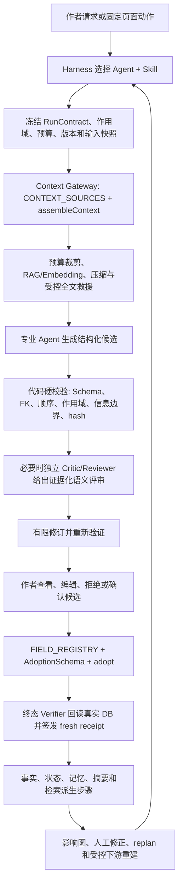

# StoryForge Agent + Harness 全面重构交接文档

> 更新日期：2026-08-13
>
> 交接分支：`feat/harness-rebuild-20260807`
>
> 远端分支：`origin/feat/harness-rebuild-20260807`
>
> 最新功能单元：`HARNESS-63 物品栏 durable 分块提取与逐章原子替换`（具体提交以 `git log -1` 为准）
>
> 世界引擎基线：`774a2ae feat(WORLD-2): close executable world foundation through 2F`
>
> 当前结论：重构主体约完成 80%～85%。这是工程范围估算，不是质量评分，也不代表可以合并发布。

本文用于把当前开发交给另一个模型或另一台电脑继续。代码、测试和提交历史仍是实现事实源；本文负责说明目标、边界、已完成范围、未完成范围、当前验证状态和下一步入口，避免接手者重新发明体系或偏离用户目标。

## 1. 接手者先做什么

新电脑首次接续：

```bash
git clone https://github.com/yuanbw2025/storyforge.git
cd storyforge
git fetch origin
git switch --track -c feat/harness-rebuild-20260807 origin/feat/harness-rebuild-20260807
npm ci
```

已经有本地仓库：

```bash
git fetch origin
git switch feat/harness-rebuild-20260807
git pull --ff-only
```

然后按顺序读取，不要无差别预载整个文档目录：

1. 根目录 `AGENTS.md`。
2. `docs/CONTEXT-ROUTING.md` 中与当前小单元匹配的路由。
3. 本交接文档。
4. `docs/roadmap/README.md` 的 HARNESS 段和 `docs/roadmap/CAPABILITY-BASELINE.md` 的 AGENT/HARNESS 段。
5. 需要核对目标设计时，再读 `docs/AI-HARNESS-FULL-FLOW-DESIGN-20260807.md` 对应阶段。
6. 需要核对审计事实时，再读 `docs/AI-HARNESS-AUDIT-20260807.md` 对应表格和源码/测试。

本交接文档提交后，当前分支相对 `origin/main` 为落后 1 个提交、领先 74 个提交。不要直接推 `main`，不要在接续前擅自 rebase 或合并；先完成当前功能单元和验证，再按 `docs/COLLAB-WORKFLOW.md` 串行处理。

## 2. 用户的最终目标

只针对“分步骤创作模式”，把 StoryForge 从大量独立 AI 按钮和局部质量功能，改造成成熟、稳定、可核查、可恢复、可持续演进的 Agent + Harness 创作系统。

完整产物链是：

```text
创作种子/项目参考
  -> 世界观与基础设定
  -> 故事核心
  -> 角色、物品与关系
  -> 主线、支线、角色弧与关键事件
  -> 卷纲
  -> 章纲
  -> 细纲/场景契约
  -> 正文
  -> 章节事实、状态、记忆和检索投影
  -> 影响分析、人工修正、重规划和受控下游重建
```

最终系统必须同时解决：

- 长期世界事实、角色状态、物品、势力、时间线、故事线和叙事承诺的一致性。
- 主角、配角、剧情线和前后章节之间的信息隔离与按剧情释放。
- 上下文预算、压缩、RAG/Embedding 检索、全文救援和压缩保真验证。
- 结构化候选、硬校验、语义评审、有限修订、重试、降级、恢复和完成判定。
- 作者确认后的受治理采纳、来源追踪、上下游影响分析和反向反馈。
- 日志、回放、指标、离线评测、失败注入、成本和延迟证据。

这不是“把更多字段拼进提示词”，也不是“为了多 Agent 而多 Agent”。Agent 是语义责任主体；Skill 是版本化任务方法；Harness 是过程控制与证据系统；确定性代码负责可以确定完成的验证和状态转换。

## 3. 不得改变的边界

### 3.1 产品范围

- 本轮只改分步骤创作模式。
- 世界引擎是另一条架构线。`WORLD-2C C3-C5 -> WORLD-2F` 的本地基座已经完成，但其体验问题不进入本轮 Harness 重构。
- 必须保留现有分步骤功能、人工编辑、Prompt 配置和已有可用工作流。新入口取代旧 AI 旁路时才同步删除旧旁路。
- 参考资料解析已经获得用户认可，不因“Agent 化”整体推倒重写；只针对重复角色、实体身份和版本证据做增量优化。
- 新基础设施未来应可迁移到世界引擎、角色聊天、跑团和文字游戏，但本轮不扩大实现范围。

### 3.2 三注册表铁律

每个新单元动手前必须回答：

1. AI 读什么，是否登记在 `CONTEXT_SOURCES`，是否只经 `assembleContext()`？
2. AI 写什么，是否登记在 `FIELD_REGISTRY + AdoptionSchema`，是否只经 `adopt()`？
3. 涉及哪些表，是否由 `PROJECT_TABLES` 派生导出、导入、删除、迁移、作用域和引用重映射生命周期？

禁止组件或 Service 手拼上下文、绕过采纳系统写受治理数据、手写第二份表清单、复制 AI/DB/RAG/导入导出入口，或只接 UI 不接数据和测试闭环。

### 3.3 Agent、Skill、Harness 的职责

| 层 | 应负责 | 不应负责 |
|---|---|---|
| 产品流程 | 作者目标、产物依赖、确认与回退体验 | 隐藏写库或隐藏模型调用 |
| Harness Supervisor | RunContract、step/attempt、预算、取消、重试、恢复、stale、终态 receipt | 拼接领域 Prompt、代替 Agent 创作 |
| 专业 Agent | 创意推理、因果权衡、语义判断 | 自报完成、直接写 Canon |
| Skill | 上下文配方、输入模式、输出合同、验证和修订策略 | 自建数据库读取、RAG 或写回系统 |
| Context Gateway | 注册源读取、预算、裁剪、压缩、检索和证据 Manifest | 扩大 Skill 权限 |
| Validator/Verifier | Schema、作用域、引用、hash、信息边界、真实 DB 终验 | 用模型自评代替硬证据 |
| Adoption | 作者确认后的唯一正式写回 | 自动接受模型候选 |
| Memory/RAG | Canon 投影、检索和派生记忆 | 冒充事实权威或 Skill |

## 4. 目标架构全貌



关键约束：模型返回文本不等于任务完成；候选持久化不等于业务写入；作者点击确认也不等于最终状态正确。只有独立终态 Verifier 对真实数据签发当前 receipt，Run 才能进入 `completed`。

## 5. 当前完成度如何理解

“约 80%”表示：核心运行底座、主要生成主路径和反向反馈从分析、交接、人工保存证明到修正后当前 replan 已经落地；受控下游重跑、剩余入口收口和真实模型质量发布证据还没有完成。

不能把以下事实误解为“全面完成”：

- 已有 57 个 HARNESS 编号，不代表 57 个产品阶段全部完成。
- 自动化测试通过只证明当前工程合同和回归，不证明真实模型文学质量。
- RAG、Embedding、事实账本和一致性 Agent 已存在，不代表每个入口都正确使用。
- `needs-manual-action` 已能跳到目标记录并证明同一正式记录发生了人工保存变化，但不代表旧影响已解决，也不代表下游已经重建。

## 6. 已完成的工作

截至最新功能提交 `f5615a8`，本分支在 `774a2ae` 之后共有 69 个提交；本交接文档另占后续一个 docs commit。完整历史可执行：

```bash
git log --oneline --reverse 774a2ae..HEAD
```

### 6.1 HARNESS-0～12：可恢复、可验证的运行底座

- 严格 RunContract、Context Manifest、verification receipt 和事件投影。
- `agentRuns / agentRunEvents / agentRunCheckpoints` durable ledger、连续序号、检查点、恢复和防篡改。
- 大纲生成、只读 Agent、主 Agent 候选和采纳中断恢复。
- 终态 verifier 回读真实数据，阻止模型自报完成、缺写、错写和旧 receipt。
- 正文视角字段和角色作用域治理。
- 整理本章、章节状态变化、正文生成、细纲生成、批量细纲和批量章纲 durable 化。
- 未来章、私人认知和视角信息边界。
- 旧批量正文旁路已下线。

核心入口：

- `src/lib/agent/run/contract.ts`
- `src/lib/agent/run/event-store.ts`
- `src/lib/agent/run/context-manifest.ts`
- `src/lib/agent/run/verification-receipt.ts`
- `src/lib/agent/run/master-durable.ts`
- `src/lib/agent/run/prose-generation-durable.ts`
- `src/lib/agent/run/detailed-outline-generation-durable.ts`
- `src/lib/outline/harness.ts`

### 6.2 HARNESS-13～29：Skill、上下文、语义评审和可靠协作

- 建立受治理 Agent/Skill Registry 和固定工作流分类。
- 为 empty/partial/complete 等输入状态建立统一 intake policy。
- 语义压缩、must-keep 锚点、来源 hash 和单来源全文救援；压缩只能发生在正式 reader 读出原文之后。
- 上下文交付评测、执行版本绑定和 45 天 Skill 新鲜度 CI。
- 正文 `review -> revise -> review` 有界语义闭环，blocking 必须提供候选和登记来源逐字证据。
- 正文采纳后的六域整理、章节记忆、检索/摘要和一致性守卫进入统一 post-adoption Run。
- 正文 Run 与章后 Run 通过 parent receipt 和正文 hash 建立 lineage。
- 主 Agent 同代依赖 join、最多两路的有限 fan-out、最多一次有限 replan 和候选级 fresh receipt。
- 顺序/fan-out 配对评测门和首批领域语义终验；真实外部模型证据不足，因此 fan-out 和原生 tool transport 默认关闭。
- H4 长篇一致性证据协议、40+20 合成长文目录、可恢复 runner 和聚合评分。
- provider 原生 `tool_calls` 只作为唯一只读 Runner 的默认关闭 transport 优化，没有复制第二套 Agent 系统。

核心入口：

- `src/lib/agent/skill-registry.ts`
- `src/lib/agent/workflow-catalog.ts`
- `src/lib/agent/context-policy.ts`
- `src/lib/agent/context-compression.ts`
- `src/lib/agent/information-boundary.ts`
- `src/lib/agent/prose-semantic-review.ts`
- `src/lib/agent/run/chapter-post-adoption-durable.ts`
- `src/lib/agent/run/master-step-verification.ts`
- `src/lib/evals/agent-harness/`
- `src/lib/evals/long-consistency/`

### 6.3 HARNESS-30～40：主要分步骤 AI 入口收口

| 分步骤能力 | 当前受治理 Agent/Skill | 已完成边界 |
|---|---|---|
| 主线/支线 | `outline.story-arcs` | 正式上下文、严格多阶段候选、durable 恢复、确认后 `adopt(storyArcs)` |
| 故事核心 | `world-origin.story-core` | 七字段逐字段严格候选、empty/partial/complete、CAS、终态回读 |
| 世界起源/自然/人文 | `world-origin.worldview-field` | 17 个字段统一 Skill、反推证据、压缩/全文救援、逐字段采纳 |
| 普通角色生成 | `character.create` | 一个严格角色候选、roster CAS、同名和枚举硬门、受治理采纳 |
| 灵感反推 | `inspiration.reverse` | 冻结作者选择碎片、版本化候选、确认后新增灵感版本，不自动写其它 Canon |
| 角色驱动开书 | `outline.character-driven` | 冻结方案、严格卷章候选、两次确认边界、只写所选卷 |
| 角色中途重规划 | `outline.character-revision` | 保护已写正文、三档方案、只 patch 未来大纲 |
| 单章细纲/场景 | `outline.details` | 章节页和细纲页共用 durable 控制器、严格 JSON、全文 Manifest stale |
| 已有角色补全 | `character.supplement` | 精确目标角色、字段闭集、可选剧情反哺、只 merge 所选字段 |
| 创作规则 | 既有世界基座 Agent 的固定 Skill | durable 候选、受治理写回、旧直调入口收口 |
| 已写章节故事线进度/交汇 | `outline.storyline-progress` | 正文逐字证据、闭集 ID/阶段、事务内三目标 `adopt()`、终态回读 |

卷纲、章纲、批量细纲和正文已有更早的 durable 主路径，不能按新标题重复开发。

### 6.4 HARNESS-41～58：正文后处理与反向反馈人工修正/重规划

- HARNESS-41/42：四步 post-adoption 屏障和可恢复失败步骤计划。
- HARNESS-43：确定性影响图覆盖来源事实、记录、后续大纲/章节、摘要、检索、故事线和派生状态。
- HARNESS-44/45：第一条受限反向 patch，只允许作者确认后经 `adopt()` 修改 `outlineNodes.summary`。
- HARNESS-46：把影响图分类成系统确定性重建项和作者确认项，冻结 source/graph/plan hash。
- HARNESS-47：零模型重建检索块和层级摘要，不改正文、事实或大纲。
- HARNESS-48：信息边界成为新正文合同的必需 acceptance。
- HARNESS-49：正文或影响图变化后重新生成当前 plan，旧计划只保留历史证据。
- HARNESS-50/51：作者 `acknowledged / needs-manual-action` 决定进入 durable receipt，并可按当前 plan 回放和重挂载恢复。
- HARNESS-52～54：把 `needs-manual-action` 交接到既有人工入口；地址必须绑定当前 review Run/receipt，并在目标工作区重新验签 source/graph/plan/item。
- HARNESS-55：进一步验证目标表、记录、World/Work 作用域和当前模块；章节/细纲 ID 归一为 `outlineNodeId`；既有面板会解除初始筛选、展开层级并高亮具体记录，但不会自动编辑或写 Canon。
- HARNESS-56：可信 handoff 建立零模型 child Run 并冻结正式目标 pre-state；只有作者在既有面板保存、显式终验且同一记录业务状态确实变化后才签发 receipt。刷新、覆盖、篡改、作用域、导入和终验后变化均 fail-closed。
- HARNESS-57：以 H56 fresh receipt/post-state 为父证据复用 HARNESS-49 planner，重建当前 graph/plan 并保守分类 resolved/remaining/new；工作区即时执行、来源编辑器可恢复，旧 review 不再冒充当前。
- HARNESS-58：来源编辑器重新验证 fresh H57 后，将其 current plan 的确定性余项交给 H47；child 绑定 H57 receipt/output，真实 output checkpoint 支持刷新、重复点击和 10 个 durable 边界恢复，只写检索块与层级摘要。
- HARNESS-59：以 AST 注册表冻结 UI 直调模型 census；初始 29 个文件 / 44 个静态入口，HARNESS-60/61/62/63 收口后为 25 个文件 / 40 个入口，分为 7 governed、4 auxiliary、14 migration；CI 拒绝未登记新增、计数漂移、残留和无迁移归属。
- HARNESS-60：将角色关系 AI 提取收口到 `character.relationships` Skill；上下文只经注册源读取并按 World 隔离，严格候选持久化后由作者勾选，确认才经 `adopt()` 写关系表与角色摘要，支持八个采纳中断点恢复、baseline stale、导入取消和 terminal receipt。
- HARNESS-61：情感节拍进入 `prose.emotion-beats` durable Skill；七个 Context Gateway 源、严格 3–6 拍候选、作者确认后 `adopt(emotionBeatCards)`、八边界恢复、baseline/context stale、导入取消与 terminal receipt 过期已闭合。
- HARNESS-62：重要地点进入 `world-origin.locations` durable 长任务；只读当前 Work/World 登记上下文，冻结章节/分块/模板/地点 baseline，每个已完成分块 checkpoint、只续跑剩余分块；模型结果不确定窗口不自动重试。全部调用后持久化严格候选，冻结作者选择后只经 `adopt(importantLocations)` 写入；八采纳边界、导入取消、作用域隔离和 terminal stale 已闭合。
- HARNESS-63：物品栏进入 `prose.inventory-extraction` durable 长任务；只读当前 Work 正文/流水与当前 World 角色，冻结提取范围、章节/分块/模板/roster/正式 baseline。全部调用后才形成严格候选，作者确认后按 `itemLedger.replaceScope=['chapterId']` 逐章事务替换；空候选可明确清理目标章，唯一姓名才绑定角色 FK。分块/跨章恢复、八采纳边界、导入取消、作用域隔离与 terminal stale 已闭合。

HARNESS-58 最新代码入口：

- `src/lib/consistency/impact-handoff.ts`
- `src/lib/agent/run/impact-handoff-durable.ts`
- `src/lib/agent/run/impact-manual-correction-durable.ts`
- `src/lib/agent/run/impact-post-correction-replan-durable.ts`
- `src/lib/agent/run/impact-post-correction-remediation-durable.ts`
- `src/lib/agent/run/impact-remediation-durable.ts`
- `src/lib/agent/run/impact-review-durable.ts`
- `src/lib/agent/run/ledger-portability.ts`
- `src/pages/WorkspacePage.tsx`
- `src/components/shared/initial-record-target.ts`
- `tests/regression/R-HARNESS55-impact-target-validation.test.ts`
- `tests/regression/R-HARNESS55-impact-target-ui.test.tsx`
- `tests/regression/R-HARNESS56-impact-manual-correction.test.ts`
- `tests/regression/R-HARNESS57-impact-post-correction-replan.test.ts`
- `tests/regression/R-HARNESS58-impact-post-correction-remediation.test.ts`

## 7. 分步骤全链的真实现状

| 阶段 | 已完成 | 仍缺失或不应误报 |
|---|---|---|
| 创作种子 | 灵感反推已统一到 durable Skill；参考分析有来源、版本和断点基座 | 参考解析重复角色/实体消歧未完成；不应整体重写已获认可的解析器 |
| 世界基座 | 起源/自然/人文 17 字段和故事核心已统一 Agent/Skill；支持空、部分、完整输入 | “只给一个角色或一个环境字段，先生成依赖图再反推出成套世界设定”的多字段候选包尚未交付；当前逐字段反推不能冒充完整反推工程 |
| 角色/物品/关系 | 普通角色、角色补全和从现有大纲/正文提取角色关系已闭环；已有物品、关系、状态账本与人工入口 | 物品创作、从零角色关系编排和由单角色反推整套世界尚未交付；不得用“证据提取”冒充“创意编排” |
| 主线/支线 | 静态故事线和已写章动态进度/交汇已收口；角色驱动开书和中途重规划已闭环 | 更完整的 Narrative Blueprint、主支线混编质量和真实模型评测仍不足 |
| 卷纲/章纲 | 单次和批量 durable 主路径存在，候选和采纳可恢复 | 个别历史路径允许账本不可用时显式降级为内存 shadow；需继续审计，不得静默扩张降级 |
| 细纲/场景 | 单章和批量 durable；章节入口旁路已收口 | 真实模型的场景质量、信息释放和上下文救援 A/B 未完成 |
| 正文 | 生成/续写、信息隔离、语义 review/revise/review、作者确认采纳和父子 Run 已完成 | 不覆盖已有手稿；局部任意改写、长期文学质量和真实 provider 发布证据未完成 |
| 章后状态 | 六域候选、章节记忆、检索/摘要和确定性一致性守卫进入统一 Run | 语义 Fast/Deep 仍是显式动作；所有状态类型的通用自动采纳不应实现 |
| 反向反馈 | 影响图、受限 patch、确定性重建、作者复核、可信精确交接、人工保存 pre/post receipt、修正后 resolved/remaining/new 当前计划及其确定性余项 child 执行已完成 | AI 下游重新生成和通用依赖重跑尚未完成；每次只允许按一个目标类型扩展 |
| 评测/发布 | 大量模块回归、H4 工程基座、配对 gate 和防篡改证据存在 | 真实外部模型 H4 40+20 artifact、人工 held-out 复核、真实质量/成本/延迟净收益未完成 |

## 8. 当前停点：HARNESS-63 已实现，当前验证证据

### 8.1 已通过

- HARNESS-47/57/58 定向回归：20 项通过；其中 H58 7 项覆盖父子 lineage、真实输出复用、frozen output 篡改和 10 个 durable 中断边界。
- HARNESS-59 AST census 守卫与 3 项回归通过：HARNESS-60/61/62/63 后为 25 个文件 / 40 个入口，7 governed、4 auxiliary、14 migration。
- HARNESS-60 定向回归 10 项通过：候选零写入、严格 parser/精确实体、刷新恢复、baseline stale、拒绝、八个持久化边界中断恢复、导入取消和多世界隔离。
- HARNESS-61 定向回归 14 项通过：七源真实 prompt、候选零写入、严格 parser、刷新/拒绝、八边界恢复、写前二次 CAS、写后上游 stale 拒绝终验、adoption 后正式卡漂移暂停、terminal 后卡/上游改变撤销 receipt、导入取消和作用域隔离。
- HARNESS-62 定向回归 14 项通过：多分块全完成后候选、零正式写入、只续跑剩余分块、候选事件与检查点间中断重建、模型结果不确定禁止重试、任一分块协议失败时无部分候选、上游 CAS、候选/冻结选择恢复、严格 parser、八采纳边界、导入取消、Work/World 隔离、terminal stale 和旧旁路下线。与 H59/C 组合计 24 项定向回归通过。
- HARNESS-63 定向回归 14 项通过：范围与分块冻结、候选前零正式写入、只续跑剩余调用、候选崩溃窗重建、模型不确定与协议失败、上游/baseline CAS、空候选清理、唯一姓名/同名角色 FK、逐章事务替换、八采纳边界、导入取消、Work/World 隔离、terminal stale 和旧旁路下线。与 H59 组合计 17 项通过。
- `npx tsc --noEmit`：通过。
- 改动范围 ESLint：通过；全仓 `npm run lint` 受用户未跟踪 `tmp/` 脚本的 7 个既有错误阻断，未改动这些文件。
- `git diff --check`：通过。
- `npm run test:coverage` 独占资源重跑：341 个测试文件、1410 项测试全部通过。
- 覆盖率：statements 79.25%、branches 73.37%、functions 76.78%、lines 79.25%。
- `npm run build`：通过，3746 个模块完成生产构建。
- `npm run check:bundle-size`：通过；入口约 647.6 KiB，gzip 约 200.2 KiB。
- `npm run ci` 在依赖审计之前的 required tables、AI manual、architecture、source reachability、roadmap、agent context、agent freshness、Canon coverage 和 project metrics 均通过。

### 8.2 已知 CI / 工作树阻断

`npm run ci` 被既有依赖公告截断：

```text
nanoid 4.0.0 - 5.1.15
GHSA-28wg-ghj8-5hjv
1 high severity vulnerability
```

没有执行 `npm audit fix` 或强制升级。接手者必须把这个依赖问题作为独立、可审查的小单元处理，不得为了让 CI 变绿直接运行 `npm audit fix --force`。

当前工作树还有作者自己的未跟踪 `output/` 与 `tmp/`，HARNESS 单元未读取、修改或提交它们。由于 ESLint 会扫描 `tmp/`，其中演示文稿脚本的 `console` / `structuredClone` / 未使用变量共造成 7 个错误；不得为了本单元擅自改写或删除这些用户文件。

### 8.3 E2E 状态

默认 Playwright Chromium `1228` 在本机缺失。2026-08-12/13 再次原样运行 `npm run ci:e2e`，42 项均在启动时 0ms 失败，统一错误为缺少 `chromium_headless_shell-1228`，因此不能算产品测试失败或通过。Playwright CDN 与 Chrome for Testing 官方存储的同版本 `149.0.7827.55` 均可连通，但当前网络持续只有约 1～7 MiB/30 分钟，下载在不改变仓库文件的情况下终止。此前系统 Chrome 的临时验证与配置状态如下，仍只作历史参考。

系统 Chrome 结果：42 项中 38 项通过，4 项在 60 秒附近失败：

1. 一致性 Agent：`page.reload()` 等待 `load` 超时，约在 `tests/e2e/core-workflow.spec.ts:706`。
2. 本地 OpenAI 兼容设置：刷新后找不到“设置”导航，约在 `:990`。
3. 故事核心 durable 恢复：`page.reload()` 等待 `load` 超时，约在 `:1150`。
4. 已有角色补全：刷新后找不到“角色生成”叶节点，约在 `:1614`。

这 4 项不能记录为通过，也还没有证明是产品回归。它们具有系统 Chrome 下导航/刷新变慢的共同特征，且其余 38 项包括主 Agent、故事线、灵感、角色、正文、角色驱动和中途重规划均通过。接手者应安装项目指定 Chromium 后原样重跑，再决定是否需要修代码或只稳定测试等待条件：

```bash
npx playwright install chromium
npm run ci:e2e
```

不要把 `channel: 'chrome'` 永久写入配置，除非作为独立测试基础设施变更审查。

### 8.4 测试负载注意事项

第一次把 `lint`、`tsc` 和 `test:coverage` 并行执行时，两个旧长链测试文件有 9 项固定 5 秒超时；两个文件单独运行 31/31 通过，随后独占资源的完整覆盖率 1393/1393 通过。接手者不要把全量覆盖率与类型检查并行跑，以免制造资源争用假失败。

## 9. 下一步应该怎么做

下面编号是交接建议，尚未作为正式 roadmap 任务冻结。接手者开始前应先在路线图登记小单元、输入/输出、三注册表影响、测试和回滚边界。

### 9.1 已完成：人工修正完成证据

目标：用户从可信 handoff 到达具体记录、使用既有面板完成保存后，系统能证明“哪个目标从什么状态变成什么状态”，而不是把导航或点击当成修正完成。

已交付边界：

- 不调用模型。
- 不新增通用修正表单，不替代既有面板。
- 不自动写 Canon；人工编辑继续走各面板原有受治理入口。
- 复用 `agentRuns / agentRunEvents / agentRunCheckpoints` 记录零模型完成证明，没有新增表。
- 完成证明至少绑定：来源章节、来源章纲、review Run/receipt、itemId、source/graph/plan hash、目标 table/record、目标 pre-state hash、目标 post-state hash、当前 World/Work 和 verifier 版本。
- 仅“打开目标”不得产生完成 receipt；必须重新读取正式目标并验证状态变化。
- 目标缺失、作用域变化、review 被新决定覆盖、source/graph/plan stale、pre/post 相同、证据篡改都应 fail-closed。
- 是否允许“无需改动但人工确认已正确”必须先作为显式产品决策；不能偷偷把相同 hash 当修复成功。

建议入口：

- `src/lib/agent/run/impact-handoff-durable.ts`
- `src/lib/agent/run/impact-review-durable.ts`
- `src/lib/consistency/impact-remediation-plan.ts`
- `src/pages/WorkspacePage.tsx`
- 各面板的正式保存回调和现有 target resolver

建议测试先行：

- 导航但未保存，不得完成。
- 合法保存后 pre/post hash 不同，可签发 receipt。
- 修改错误记录、跨 Work 记录、目标被删除或 review 被覆盖均拒绝。
- 刷新后可回放完成证明，不重复生成 Run。
- 篡改 candidate/receipt/target hash 时拒绝恢复。
- 项目导出导入后明确按不可便携证据处理：待处理 Run 取消，terminal receipt stale。

### 9.2 已完成：修正后的 stale 与 replan

目标：人工修正完成后重新计算当前影响图和处理计划，明确哪些旧项已解决、哪些仍存在、哪些是新影响；旧 handoff 和旧计划不得继续冒充当前。

要求：

- 复用 `replanImpactRemediationV1()`，不要建立第二个计划器。
- 先检查现有影响图是否真的包含目标记录状态 hash；如果没有，先补确定性输入和反例测试，不能假设上游保存一定改变 graph hash。
- 新 plan 必须绑定修正完成 receipt 和当前 source/graph/target state。
- 旧 review/handoff/plan 保留历史证据但进入 stale，不物理删除。
- 只有当前图不再包含等价问题或新 verifier 明确通过时，才可显示 resolved。
- 不在本单元自动重跑任何模型任务。

### 9.3 当前第一优先：受控下游重建与重新生成

先分两条路径：

1. 确定性派生：继续复用 HARNESS-47，只在白名单内扩展可重建摘要、检索和其它纯派生投影。
2. 生成式下游：必须创建新的 Agent Run 和候选，重新装配当前上下文，作者确认后才写回；绝不自动覆盖正文、大纲、事实或锁定数据。

每次只增加一个目标类型，必须冻结依赖图、允许写字段、目标 CAS、最大重试和终态 verifier。不要一次实现“自动级联所有下游”。

### 9.4 第四优先：剩余分步骤入口与完整反推

反馈闭环稳定后，重新沿真实 UI 做一次剩余入口 census，重点核对：

- 单角色或单环境字段反推完整世界基座的依赖图和多字段候选包。
- 力量体系、修炼体系、物品创作、角色关系编排等仍由旧直接生成路径承担的部分。
- 参考解析重复角色和实体 identity resolution。
- 仍存在的手工上下文、直接模型调用、弱 parser、内存 shadow 和直接写库旁路。

反推能力不能用一条超长 Prompt 一次猜完整世界。目标流程应是：识别种子 -> 构建依赖图 -> 分组推断 -> 为每个候选记录 `derivedFrom / assumptions / confidence / conflicts` -> 作者逐组确认 -> 经既有注册表采纳。

### 9.5 第五优先：真实模型质量、成本与发布证据

工程闭环完成后才做真实 provider 评测：

- 固定世界观、角色、主支线、卷纲、细纲和正文端到端回归集。
- 对比旧入口与 Agent/Harness 新入口，而不是只比较 Prompt 长短。
- 验证事实/约束覆盖、信息泄漏、状态连续性、证据精度、人工修改量、完成率、p95 延迟、token 和成本。
- 跑满 H4 development 40 + held-out 20 的真实独立 generator/verifier artifact，并进行人工 held-out 复核。
- 没有达到预注册门槛时，不默认开启更宽 fan-out、原生 tool transport 或自动语义审查。

## 10. 仍未解决的重要产品问题

- Skill 的物理格式是否继续代码注册、是否允许高级用户编辑，尚未决策。
- 多字段反推是一次候选包还是分组多 Run，需要用恢复复杂度和作者确认体验验证。
- 全文救援的触发阈值、最大成本和不同模型窗口策略需要真实评测。
- “人工确认无需修改”是否可以关闭影响项，需要明确的独立状态和理由，不能复用 `acknowledged` 冒充修复。
- 只分析但未产生任何 durable 动作的临时 impact plan 是否值得跨浏览器持久化，尚未决策。
- 语义 Agent 只应提供证据化建议；事实权威、顺序、引用、作用域、状态转换和完成判定继续由代码负责。

## 11. 禁止接手者做的事

- 不要把 Harness 继续做成提示词拼接器。
- 不要为每个字段新建一个 Agent；同一专业 Agent 下用不同 Skill。
- 不要让 Skill 复制数据库 reader、RAG、Embedding、Prompt runner 或写回实现。
- 不要把 RAG 当权威事实库；它是 Canon 和长文的分块检索投影。
- 不要默认整本全文回灌；全文只能受预算、证据和失败原因控制地升级。
- 不要让 Prose Agent 看到未来剧情全文或角色不应知道的私密信息。
- 不要让模型自评替代 Schema、FK、hash、作用域、信息边界和真实 DB 终验。
- 不要自动采纳、自动覆盖手稿或自动级联重写全部下游。
- 不要重复开发已有的卷章纲、细纲批量、事实、状态、认知、物品、检索、摘要和影响分析能力。
- 不要把世界引擎体验问题混入当前分步骤 Harness。
- 不要直接推 `main`，不要创建平行 AI/DB/导入导出系统，不要执行 `npm audit fix --force`。

## 12. 每个后续小单元的完成定义

每个小单元必须在开始时写清：

| 项目 | 必填内容 |
|---|---|
| 用户路径 | 从哪个真实分步骤入口开始，到哪个可见结果结束 |
| 输入 | 登记的 source keys、作用域、快照和预算 |
| 输出 | 严格候选或确定性结果合同 |
| 写入 | FIELD_REGISTRY/AdoptionSchema 目标，或明确零写入 |
| 表生命周期 | PROJECT_TABLES 影响，或明确不新增表 |
| 状态机 | step、attempt、暂停、重试、stale、终态条件 |
| 硬验证 | Schema、FK、hash、顺序、信息边界、作用域、CAS |
| 语义验证 | 是否需要模型；需要时必须有独立证据和预算 |
| 作者边界 | 何时查看、编辑、拒绝、确认；何时才写 Canon |
| 回滚 | 关闭开关、拒绝候选或回到旧人工入口的边界 |
| 证据 | 定向测试、反例、生命周期、刷新恢复、必要的 E2E |

完成不等于“代码写了”或“测试文件存在”。必须证明真实入口使用、旧旁路下线、三注册表完整、失败可恢复、终态可核验且文档同步。

## 13. 建议验证顺序

先小后大，不要并行跑重型任务：

```bash
npx vitest run tests/regression/R-HARNESS56-impact-manual-correction.test.ts tests/regression/R-HARNESS55-impact-target-validation.test.ts tests/regression/R-HARNESS55-impact-target-ui.test.tsx
npm run check:architecture
npm run check:required-tables
npm run check:ai-manual
npx tsc --noEmit
npm run lint
npm run test:coverage
npm run build
npm run check:bundle-size
npm run ci:e2e
git diff --check
```

提交交付前仍以根 `AGENTS.md` 的最新闸门为准。`npm run ci` 如继续只被已知 `nanoid` 公告阻断，应单独报告，不能写成 CI 全绿；其后闸门必须像本轮一样单独补跑。

## 14. 关键事实源和排查入口

| 要查什么 | 先看哪里 |
|---|---|
| 目标设计与全流程图 | `docs/AI-HARNESS-FULL-FLOW-DESIGN-20260807.md` |
| 现状审计和真实接入表 | `docs/AI-HARNESS-AUDIT-20260807.md` |
| 运行合同和 ADR | `docs/AI-HARNESS-ARCHITECTURE-20260803.md` |
| 当前 backlog 和已交付边界 | `docs/roadmap/README.md` |
| 防止重复开发 | `docs/roadmap/CAPABILITY-BASELINE.md` |
| AI 读什么 | `src/lib/registry/context-sources.ts`、`assemble-context.ts` |
| AI 写什么 | `src/lib/registry/field-registry.ts`、`adoption-schema.ts`、`adopt.ts` |
| 表生命周期 | `src/lib/registry/project-tables.ts` |
| Agent/Skill | `src/lib/agent/skill-registry.ts`、`workflow-catalog.ts`、各 `*-copilot.ts` |
| durable 运行 | `src/lib/agent/run/` |
| 信息隔离 | `src/lib/agent/information-boundary.ts`、`R-HARNESS9`、`R-HARNESS48` |
| 事实/认知/物品/检索 | `src/lib/fact-ledger/`、`knowledge-ledger/`、`retrieval/`、相关 registry tests |
| 影响反馈 | `src/lib/consistency/impact-*`、`src/lib/agent/run/impact-*` |
| 当前 HARNESS-57 UI/重规划 | `WorkspacePage.tsx`、`ChapterEditor.tsx`、`impact-manual-correction-durable.ts`、`impact-post-correction-replan-durable.ts` |

## 15. Git 交接状态

- 功能提交 `f5615a8` 已推送到 `origin/feat/harness-rebuild-20260807`。
- 没有创建 PR，没有修改或推送 `main`。
- 本交接文档已作为独立 docs commit 推送到同一分支；具体 SHA 以远端 `git log -1` 为准。
- 接手者拉取后先执行 `git status --short --branch` 和 `git log -5 --oneline --decorate`，确认没有本地脏改动或分支偏移。
- 合并前必须处理 `origin/main` 的 1 个新提交，并重新生成可能漂移的 AI manual/project metrics；不要手改生成文件冲突。

## 16. 最终交接结论

当前重构已经从“提示词字段拼接 + 零散质量检查”推进到真正的 Agent/Skill + durable Harness 主体：主要生成入口有明确职责、上下文证据、结构化候选、作者确认、受治理采纳、终态验证、恢复和回放；正文也具备信息隔离、语义评审、章后状态和影响图。

当前最关键的未闭环不是再造 Agent。人工修正确实发生及修正后 resolved/remaining/new 当前计划已经由 HARNESS-56/57 证明；下一步是以该新计划为输入，用确定性或作者确认的 Agent Run 重建受影响下游。完成这条链后，再审计剩余基础设定/参考解析入口，并用真实模型评测证明质量、成本和延迟收益。任何接续工作都应沿这个顺序推进。
