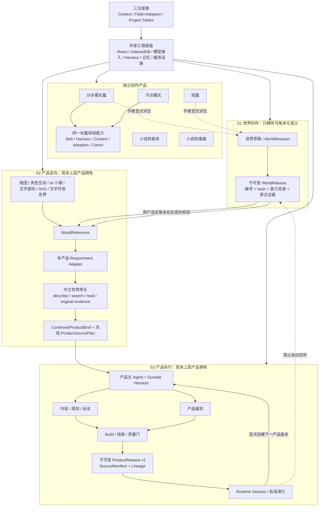
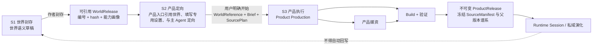

# StoryForge 当前架构总览

> 版本：2.8.0 · 更新：2026-09-10 · 权威层级：L1
> 本文描述当前主干代码事实与目标架构接缝。产品边界以项目总纲为准；代码偏差见对齐审计。

## 1. 运行形态

StoryForge 当前是 React + TypeScript + Vite 的本地优先单页应用，核心业务数据保存在浏览器 IndexedDB，文件工作区可使用 File System Access / OPFS。AI 请求发送到用户配置的模型服务。应用没有自建核心业务后端，也没有 staging；`main` 进入生产发布链。

路由壳入口：

- `/`：真实首页 `HomePage`，聚合本地作品、世界、创作任务与发布记录；历史 `?tab=` 链接由兼容解析器转向当前产品入口，`legacy=1` 不再启用旧界面；
- `/community/:pageId?`：新版外壳中的社区市场、发行与在线招募；保留服务成熟度闸门。
- `/adventure/:pageId?`：文字冒险真实 S2/S3 生产、质量/媒资、发布与确定性玩家入口，明确标为可验证预览并继续受产品目录成熟度闸门限制。
- `/openworld/runtime`：文字开放世界现有引擎的开发入口，明确标注非正式功能，生产环境仍受产品目录闸门限制。
- `/home/:pageId?`：作品总览、对象详情、封面、搜索、任务、设置和备份；对象与业务仍由所属产品管理。
- `/play`：社区跑团目录和本地存档；
- `/play/mist-harbor`：雾港内置作品介绍、明确开始、恢复存档；使用现行世界封存、生产与产品发布链，无模型调用；
- `/play/:gameKey`：冻结社区模组的介绍与明确开始入口；
- `/play/session/:sessionId`：绑定正式发布或受治理预览的沉浸跑团桌面；
- `/settings`：模型与应用设置；
- `/long`：长篇作品库与产品内创建入口。
- `/short/:pageId?`：短篇作品库、六阶段生产、版本导出与显式扩展；`project` 查询参数选择作品，未选择仍可浏览。
- `/chat/:pageId?`：角色聊天独立草稿、S2 会谈、冻结世界来源、统一生产/发布与会话；外层按作品库、世界引擎、制作台、发布与版本、游玩、社区与发行、通用设置排列，细分类放在页内左侧。
- `/avg/:pageId?`：AVG 独立作品库、可恢复 S2 方案、冻结世界引用、真实制作与版本修订、玩家舞台；未选择世界可浏览和填写，正式制作需引用冻结版本。外侧按作品库、世界引擎、制作台、发布与版本、游玩、通用设置组织；S2/S3 内容位于制作台左侧，玩家舞台与存档位于游玩左侧，原有深链保持有效。
- `/town/:pageId?`：AI 小镇作品库、独立 S2 草稿与会谈、世界出口选择、制作检查与发布，以及分区游玩和存档；未选择世界也可浏览与保存配置。
- `/ttrpg/:pageId?`：跑团作品库、可保存的九步配置、世界出口选择、提案比较、制作检查与发布、团局和游玩；内容分类位于页面内左侧，未选择世界仍可浏览和保存配置。
- `/world/:pageId?`：世界内容编辑、地图、封存、版本资源出口与分享导入；`project` 选择世界工作区，未选择仍可浏览。一级目录按我的世界、世界设定、版本与封存、数据出口、分享与导入、社区与发行、通用设置组织；设定分类及其编辑模块在页面内左侧分层排列，原有内容深链保持有效。旧世界工作区链接重定向到此入口。
- `/motion/:pageId?`：漫剧素材制作、质量审查和版本交付；输出参考素材与工具提示词包。
- `/comic/:pageId?`：小说转漫画真实作品库、来源方案、脚本、页格排版、视觉素材、审校阅读和版本记录；外侧按作品库、漫画制作台、阅读预览、版本与导出分层，内容分类在制作台页内左侧，`work` 选择独立漫画 Work。
- `/script/:pageId?`：小说转剧本作品库、来源与改编规划、场次生产、审查及版本导出；`work` 查询参数选择独立剧本 Work，未选择仍可浏览。
- `/workspace/:projectId`：作品工作区；独立长篇使用作品库、工作台、版本与导出、派生、导入、社区与设置导航，分步骤与节点复用原领域组件与数据。

各产品使用当前独立页面与统一产品导航；`PRODUCT_CATALOG_V1` 保留能力成熟度和所有权定义，开发引擎入口按环境与 opt-in 校验是否可进入。不得用页面可见性代替正式能力验收。分步骤工作区仍是当前主要、最完整的作者路径，其 Phase 5 工程主链已经验收完成。

## 2. 产品与共享底座



共享底座允许复用执行、存储、模型、记忆和媒资设施，不意味着产品数据混合。世界引擎只拥有语义内容；上层产品拥有自己的 production、media、build、release、session 和 evolution。用户可见文字游戏严格只有文字冒险、AVG、文字开放世界三种；状态推演只能是具体产品的内部能力，不另立产品、release 或 session 身份。

## 3. 当前工程指标

<!-- project-metrics:start -->
> 本区块由 `npm run gen:project-metrics` 从当前代码生成；`npm run check:project-metrics` 在 CI 中防止漂移。

| 当前事实 | 数值 | 单一事实源 |
|---|---:|---|
| 应用语义版本 | `3.9.1` | `package.json` |
| TypeScript 生产源码 | 1164 个文件 / 389884 行 | `tsconfig.json` |
| IndexedDB schema | v10 / 123 张 required tables | `schema.ts` / `REQUIRED_TABLES` |
| PROJECT_TABLES | 123 张表 | `project-tables.ts` |
| Prompt 主线 | 65 个 moduleKey / 210 条内置模板 | `PromptModuleKey` / `prompt-seeds*.ts` |
| CONTEXT_SOURCES | 109 个上下文源 | `context-sources.ts` |
| 写回治理 | 53 个通用 adopt target / 58 个领域扩展 | `adoption-schema.ts` |
<!-- project-metrics:end -->

## 4. 分层架构

| 层 | 职责 | 主要实现 |
|---|---|---|
| 产品与 UI | 收集意图、展示候选、作者确认、运行体验 | `src/pages`、`src/components` |
| Workspace / Work / Scope | 中立本地容器、作品身份、作用域、创建切换与生命周期 | `src/lib/workspace` |
| 产品应用服务 | 长篇、改编、世界、跑团、聊天、文字上层产品生产与运行 | `src/lib/{novel,adaptation,screenplay,comic,world-engine,ttrpg,character-interaction,product-production,...}` |
| Agent / Skill | 任务分类、能力契约、读写权限、Prompt/Tool 版本 | `src/lib/agent` |
| Durable Harness | run、event、checkpoint、attempt、stale、receipt | `src/lib/agent/run` |
| Context Gateway / 记忆 | 目录、预选、按需读取、原文与长期记忆 | `src/lib/context-gateway`、`src/lib/memory`、`src/lib/retrieval` |
| 三注册表 | AI 读取、候选采纳、表生命周期 | `src/lib/registry` |
| 领域一致性 | Canon、事实、关系、时间、主支线、状态和冲突 | `src/lib/consistency`、`fact-ledger`、`storyline`、`knowledge-ledger` |
| 数据与文件 | 唯一当前 Dexie schema、严格备份/导入导出、OPFS | `src/lib/db`、`export`、`storage`、`media` |

## 5. 正式 AI 主路径

```text
产品入口 / 作者意图
→ AI Entry Registry 中的 formal 入口
→ 登记 Skill + Run Contract
→ CONTEXT_SOURCES / Context Gateway
→ provider adapter / 闭集只读工具
→ 原始输出 + CreativeArtifact
→ schema / 确定性验证 / 有界 repair
→ durable candidate + checkpoint
→ 作者预览、编辑、采纳或拒绝
→ FIELD_REGISTRY / AdoptionSchema / adopt()
→ post-state + terminal receipt
```

AI 入口注册表同时允许有明确边界的 `auxiliary`、`evaluation` 和 `experimental` 调用。它们不得直接写 Canon，也不得在 UI 中冒充正式 durable 流程。架构扫描器阻止未登记直连。

## 6. 三注册表

### 6.1 `CONTEXT_SOURCES`

登记稳定 source key、owner、作用域和加载器。`assembleContext()` 与 Context Gateway 是正式读取接缝；Skill 只声明 keys，不在组件中维护字段清单。Context Manifest 保存实际读取、哈希、预算和遗漏。

### 6.2 `FIELD_REGISTRY` / Adoption

Field Registry 决定 AI 可写字段；Adoption Schema/Extension 决定集合身份、外键、替换范围和领域事务。候选不是正式数据；stale 校验、作者确认和 post-state 回读构成采纳闭环。

### 6.3 `PROJECT_TABLES`

当前 required tables 与 `PROJECT_TABLES` 数量由检查器保持一致。注册表派生导出、导入、删除、迁移、作用域和引用重映射，覆盖普通记录、运行账本和共享 blob object。任何新表先登记再使用。

## 7. 数据域

### 7.1 `Project` / `World` / `Work`

`Project` 只是 LocalWorkspace 壳：只保存稳定工作区身份、用途、活动 `World`/`Work` 指针和工作区级开关。它不保存或镜像作品标题、简介、流派、状态、目标/当前字数、封面、文风、方法论或活动叙事计划；这些语义只属于 `Work`。创建边界可以一次接收工作区和初始作品输入，但在同一事务中分别构造 Project/World/Work；切换或编辑 Work 只改变活动指针或 Work 本身，绝不回写 Project 镜像。

`World` 是世界身份、公共 code、当前世界版本和导入来源的唯一权威；`Work` 是独立作品 owner，`Work.worldId` 只绑定内部语义 scope。`workspacePurpose` 与 `World.identityKind` 将独立作品的内部 scope 和可分享 `world-draft` 分开；只有后者拥有公共 world code、进入世界目录并可封存。长篇/短篇通过显式派生动作形成独立世界草稿/release，保存 source work/revision/range/hash，源作品 owner 与后续版本保持独立；剧本/漫画被确定性拒绝。备份导入只接受这一当前字段闭集；WorldRelease 的中立快照也只携带 Project 壳和独立 Work 语义，不恢复旧镜像。

### 7.2 长篇与节点

分步骤工作区保存世界观、故事、角色、大纲、细纲、正文、事实、关系、伏笔、状态、检索和 run 数据，Phase 5 已完成该主链的工程验收。节点模式拥有 DAG、节点输入输出和运行记录，可以比标准步骤更细、更自由、更可视和可调，但必须调用同一长篇能力；任何平行节点 AI/DB 写入都是架构缺陷。

### 7.3 改编产品

短篇通过 Work kind/profile 区分规模；剧本与漫画使用 adaptation source/plan、screenplay scene、comic page/panel/visual subject 等独立表。漫画媒资由共享 blob 存储承载但 owner 在漫画产品。

### 7.4 世界引擎

世界领域提供显式 world-draft、按 `World/Work` scope 隔离的语义能力投影、稳定 world code、revision/release、显式作品派生、多世界关系以及不可变资源目录。`WorldRelease` 只从 `PROJECT_TABLES.worldSemantic` 派生确认 Canon，并记录选入/遗漏、候选、冲突、证据和 hash；不含媒资、production、build、可执行蓝图或 runtime。

上层产品先通过 `listWorldReferenceCatalogV1` 取得只读、中立的可选世界来源，不获取物理 `WorldRelease` 行、manifest 或 Provider。资源出口由 `describeWorldReleaseV1`、`searchWorldReleaseV1`、`readWorldResourceV1` 和 `readWorldOriginalEvidenceV1` 构成；产品侧只依赖 `world-release-client` / Context Gateway 的中立接口。目录按稳定 resource UID、release/hash 和关系导航；有界缓存只缓存已校验 release 投影，千级资源规模回归阻止逐行 IndexedDB 游标退化。跑团、角色互动、AI 小镇、文字冒险、AVG、文字开放世界分别拥有需求适配器，证明统一协议不等于统一 payload。

### 7.5 上层产品

上层产品生产使用 consultation、brief、command、build、artifact、media、release 与质量证据。Production 和 Release 根记录都以索引化 `productType` 冻结产品身份；工作台、查询、Build、Release 和 Session 按该身份隔离。`ProductRuntimeSession` 及事件/checkpoint 保存私域运行。媒资通过共享设施存储：发布媒资绑定 `ProductRelease`，运行中新生成的媒资绑定 `ProductRuntimeSession`，二者均不归 `WorldRelease`。

这些数据逻辑上分成两个由上层产品拥有的阶段：`S2 产品定向`中引用世界、配置并确认方向形成 product draft/Brief；用户明确开始后进入 `S3 产品执行`的 production/build/release/runtime。S2、S3 都属于上层产品，不属于世界引擎。通用 runtime 内核拒绝从世界草稿或 WorldRelease 直接启动正式上层产品；正式运行必须从产品自己的不可变 ProductRelease 或同一生产链的可验证 Build Preview 启动，并在 session 中持久化来源 hash。当前生产身份闭集为跑团、角色互动、AI 小镇、文字冒险、AVG、文字开放世界。共享工厂不改变各产品分别拥有需求适配器、生产模块、质量门和玩家运行面的事实；AI 小镇另有时间、语义地图、日程、知识、关系、轻经营和离线演化合同。

## 8. 世界到产品的单向流



世界读取统一的是 `describe/search/read` 的版本、资源、来源和遗漏协议；每个产品用自己的 requirement adapter 生成 SourcePlan。production 的每个 run 只在 plan 锁定的 WorldRelease 内渐进读取并保存 Context Manifest，ProductRelease 聚合为不可变 SourceManifest 快照；不同产品不共享固定 payload。运行时绑定 ProductRelease，任何继续读取世界的权限也从该 release 的 SourcePlan 继承，新证据归 session/run manifest，不追写 release。若未来把衍生内容转成世界新版本，应走另一个显式创作/采纳流程。

## 9. 失败与恢复

Durable Harness 将运行状态写入 ledger/checkpoint；provider 调用有 attempt identity；候选保存输入/目标 revision；采纳使用事务和 post-state。网络结果未知、认证/配额、stale、协议错误和不可恢复错误分开处理。

UI 刷新后必须从 durable 状态恢复。没有 checkpoint 的辅助调用只能返回内存结果或只读报告，不得静默写正式数据。

## 10. 关键目录

```text
src/
├── pages/                  路由壳与产品综合页
├── components/             产品 UI、候选、设置与运行面板
├── stores/                 UI 投影与领域状态
└── lib/
    ├── agent/              Skill、AI 入口与 durable run
    ├── context-gateway/    渐进式上下文目录和读取
    ├── registry/           三注册表
    ├── workspace/          中立 Project/World-scope/Work 根、作用域与生命周期
    ├── db|export|storage/
    ├── novel|outline|prose|storyline/
    ├── adaptation|screenplay|comic/
    ├── world-engine/          只负责可分享世界语义、派生、冻结与引用
    ├── product/               产品身份、成熟度和 ProductRelease/Build 运行入口
    ├── product-production|product-platform/  上层产品共享生产和发布设施
    ├── ttrpg|character-interaction/          跑团与角色互动产品域
    ├── text-game|adventure|avg|open-world/  三种文字游戏及共享文字内容设施
    └── media/              跨产品媒资设施，不是世界引擎模块
```

## 11. 当前诚实边界

- 代码中已存在大量上层产品、市场和托管能力，但除产品目录标为 `released` 的条目外均不等于已经完整交付；preview/internal/experimental 的可见性由机器门控。
- Project/World/Work 可以位于同一本地物理工作区，但身份权威已经拆分：Project 只管理工作区，World 管理世界身份，Work 管理独立作品；存在内部 World 语义 scope 不等于建立了可分享世界。
- 分步骤长篇 Phase 5 工程主链和 10万/30万/100万字符规模门已经完成；真实作者长期文学一致性仍需持续研究，但不是尚未完成的功能施工项。
- 世界 Release、中立资源协议、六类上层产品的需求适配器、五项逻辑契约校验、`S1 世界封存 → S2 产品定向 → S3 产品执行` runtime 闸门和产品成熟度门已经形成共享架构基线；它们规定接入方式，不替代各上层产品的 Brief/production/media/runtime 专项实现。
- 当前 schema v10 直接表达 Product Production/Build/Release、Product Runtime、World、Work、独立创作产品、漫剧前期生产与 AVG 作者方案/媒资草稿与跑团、AI 小镇及角色聊天 S2 草稿；保留 v1→v2→v3→v4→v5→v6→v7→v8→v9→v10 的受支持加表与索引迁移（v8 允许不同 Brief revision 使用同一内容 hash，已有记录不改写；v9 新增小镇草稿表，v10 集成角色聊天草稿表）以保护作者数据，不包含旧字段投影、双读或退役运行入口。非受支持数据库版本和非当前备份明确拒绝。
- ProductRelease 谱系已经有跨产品逻辑 validator，并在角色互动参考纵切面落地；其它上层产品在转为 released 前仍需按自己的物理 schema 接入同一逻辑闸门。
- 节点官方模板已绑定正式长篇领域 action，通用生成仅限显式 experimental draft 且不能采纳 Canon；完整跨模式真实 UI 体验仍是节点产品维护事项。
- 账户、云端社区、支付和商业平台不是当前核心运行前提；相关代码必须 capability gate / experimental，不能掩盖主产品未完成。

当前能力与缺口以 [`roadmap/CAPABILITY-BASELINE.md`](./roadmap/CAPABILITY-BASELINE.md) 和
[`audits/CURRENT-ARCHITECTURE-AUDIT-20260903.md`](./audits/CURRENT-ARCHITECTURE-AUDIT-20260903.md) 为准。

## 12. 交付门

代码提交前执行定向测试和最低架构门；交付运行 `npm run ci`，适用时运行 `npm run ci:e2e`。详细要求见
[`ENGINEERING-QUALITY-STANDARD.md`](./ENGINEERING-QUALITY-STANDARD.md)。

### AVG 产品页面与作者修订

`AvgPage` 将作品库、S2 故事/路线/方案会谈、S3 制作与编辑、发布和游玩接入同一产品。`Work.kind=avg` 拥有 `avgAuthoringDrafts` 和 `avgDraftMedia`；无世界时可以保存方案，正式生产继续要求作者确认、冻结世界来源和生产授权。草稿及媒资仅通过注册表参与导出、引用重映射、删除与恢复胶囊，不声明磁盘直接编辑能力。

跨工作区选择世界使用世界模块的 `reference-cache`：只复制已验证不可变 Revision/Release，保留 UID、内容 hash 与原文；缓存落在消费者的私有存储 scope，不复制可变语义表，不回写源世界，源工作区删除后仍可复验和备份恢复。版本资源页显示已选择版本；进入世界草稿修改需回到世界引擎并封存新版本。

AVG 会谈使用 `avg.consult.v1` 和 `avg.authoring` 注册上下文，经 durable Run、manifest、候选 checkpoint 与验证 receipt 保存。会谈只起草产品定向，正式世界读取仍由生产需求适配器执行。作者确认后回填同一 S2 草稿，历史会谈可归档后继续讨论。

作者修改叙事图、对白、条件、变量和演出，先保存带基线 previewHash 的草稿。提交修订冻结到 Brief 的 AVG 专项 `avgRevision`；同一生产 scheduler 执行素材引用验证、运行包装配和质量检查。旧 Build/Release/存档保持不变，新版本仍需明确开始和发布。没有新增第二套叙事或模型调用系统；商业候选仍受真实试玩、媒资与性能回执限制。

### 角色聊天接入

`Work.kind=character-interaction` 拥有 `chatAuthoringDrafts`；统一 schema v10 接入该表；v8/v9 兼容桥保留独立聊天分支已有草稿，且保留所有既有版本。设置及会谈由注册表进行完整生命周期管理。`chat.consult.v1` / `chat.authoring` 与 AVG 共用可恢复会谈运行器，各产品独立定义设置及上下文源。会谈不开始制作，候选由作者确认后回填草稿。正式 `characterChat` Brief 配置控制角色私密知识、初始信任、场景回合及回复预算。

玩家页对消息听众和记忆证据进行可见性过滤；作者人物快照明确区分公开/私密知识。失败和取消清理 UI 生成状态，多角色导演的结束决策由实例命令执行。当前角色聊天生成发布以纯文字内容为边界；不把未生成的画像或语音标为已完成。

## 当前 UI 开发基线（2026-09-15）

当前重构 UI 是应用的唯一外壳，默认使用青绿山水、奶油纸面；水墨远山是同一布局的可选皮肤。新功能沿用各产品的导航和编辑区域：主要操作在产品左侧，内容分类在页内左侧；创建位于各自产品页，浏览不以先有作品或世界为前置条件。

- `src/styles/themes.css` 是全站配色、字体、山水背景和编辑器变量的单一来源，由主应用与独立预览共用的 `src/lib/theme-bootstrap.ts` 引入，包括 portal 弹窗；`src/components/longform/longform.css` 提供已确认的共享页面样式。共享外框和产品制作面板通过语义变量换肤，局部 fallback 保留原青绿细节。新增皮肤应扩展统一变量和主题注册表，不得恢复旧主题系统或独立应用外壳。
- 功能工作区的尺寸规范由 `src/styles/workspace-layout.css` 统一维护，覆盖世界引擎、长短篇、改编产品、上层产品与共享工具页。桌面一级导航 144px、内容分类栏 136px，顶部全局导航 64px，页标题与模式/阶段切换合并为约 48px 的工具栏；平板缩窄导航，手机沿用抽屉与横向分类条。内容边距 8px，字段面板使用可用宽度，正文阅读宽度保持编辑器自身设置。独立预览与开发中产品同步采用紧凑尺寸；导航动作、保存、AI 调用和数据 owner 不因布局调整改变。
- 首页“今天”直接显示主视觉，不显示面包屑条；顶部、侧栏和主视觉共用连续的整页背景，内容纸面从主视觉下方开始；主视觉基准最小高度为桌面 260px、手机 220px，长内容可自然撑高。通用设置填满可用内容宽度，主题缩略图按容器宽度自动分列。
- `src/components/navigation/ProductFrame.tsx` 为跨产品工具提供相同的页面外壳；现有产品保留各自更完整的导航和操作。`retired-routes.ts` 只转换旧书签，不渲染旧页面。
- `ProductHubPage`、旧 `Sidebar` 视图、旧全局创建弹层与旧引导已下线。模块类型树继续供现行编辑器、内容分类和 AI 元信息使用；它不是另一套 UI。
- `src/components/world-engine/panels.css` 仅维护现行世界分享、版本和资源控件；不依赖已删除的 `product-hub.css`。
- `ui-preview/` 是本轮获认可的设计参考，且仍支撑两个开发中产品的预览页；它不是已退役的旧 UI。首页不再宣传尚待上线的整站预览。共享山水背景和真实作品、漫画、游戏媒资保留。
- 通用设置提供 14 套皮肤：青绿山水、水墨远山、雾青桃陶、纸与墨、暖杏书笺、羊皮古卷、古卷鎏金、青绿金笺、熔炉余烬、银蓝书房、暮紫星灯、星夜萤黄、星夜萤黄全暗版、星穹透光版，可按浅色 / 深色 / 混合筛选。`THEME_OPTIONS` 是主题 ID、名称、说明和分组的统一注册表。`src/lib/theme.ts` 只保存本机 `storyforge-theme` 偏好并通知编辑器，刷新后恢复。水墨山景用于外框和留白，正文纸面不透明；星夜萤黄使用深色工具区与象牙白正文，全暗版和星穹透光版使用深色正文。星穹工作面板约 94%–96% 不透明，模糊仅用于外框与面板，减少透明度偏好或浏览器不支持模糊时回退实色。主按钮使用独立 on-accent 前景色保证明亮强调色上的文字对比度；作品媒资和状态色保持其原语义。Shadow DOM 预览继承同一套变量，独立预览仅读取已有偏好并加载同一来源，不写本机数据。旧保存主题值仍迁移为青绿默认，不改正文格式和用户数据。项目文件夹设置、作品导入导出、版本和存档仍使用原领域服务。

UI 清理回归覆盖：历史查询入口与对象参数、设置安全返回、世界封存与交接、真实跑团存档恢复、独立作品创建、文件夹绑定及示例体验。不得为兼容旧测试而恢复旧页面或全局创建流程。

品牌图标统一通过 `BrandIcon` 引用作者提供的透明图形 `public/brand/xuanxiang-mark.svg#mark`，沿用其矢量轮廓，导航配色由主题变量继承，不附带底板或图内文字。浏览器图标直接使用该 SVG；安装图标和 README 的透明 PNG 由 `node scripts/generate-brand-icons.mjs` 从同一 SVG 生成。应用名称继续为 StoryForge / 故事熔炉。新增产品页面复用该组件，不重新引入火焰标志。
