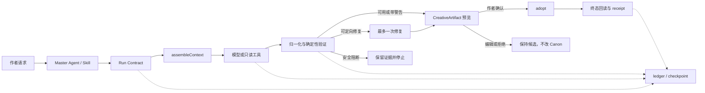

# StoryForge 当前架构总览

> 最后更新：2026-08-17
>
> 适用版本：`main@5021094` / 应用语义版本 `3.9.1`
>
> 本文描述当前代码事实；历史设计与施工过程不作为运行架构权威。

## 1. 系统定位

StoryForge 是 React + TypeScript + IndexedDB 的纯前端、本地优先创作应用。用户项目、手稿、Canon、运行记录和设置保存在浏览器；AI 请求只发送到用户配置的服务商。项目没有自建业务后端，也没有 staging，`main` 会直接进入生产构建。

当前架构的核心不是“把更多提示词拼给模型”，而是把所有正式 AI 创作收进一条受治理的 Agent + Harness 主路径：

```text
产品入口 / 作者意图
  -> Master Agent 或登记的领域 Skill
  -> Run Contract + 执行版本 + 预算
  -> CONTEXT_SOURCES + assembleContext()
  -> 模型 / 只读工具
  -> CreativeArtifact + 确定性验证
  -> durable ledger / checkpoint / receipt
  -> 作者预览、编辑和确认
  -> FIELD_REGISTRY + AdoptionSchema + adopt()
  -> Canon / 正文 / 派生影响处理
```

## 2. 七层架构

| 层 | 主要职责 | 关键实现 |
|---|---|---|
| 产品与交互 | 世界引擎、分步骤创作、节点创作、Agent 对话、互动运行时；只表达用户意图和确认 | `src/pages`、`src/components` |
| Agent 与 Skill | 意图分类、领域能力、读写权限、提示词/工具版本、依赖计划 | `src/lib/agent/orchestrator.ts`、`skill-registry.ts`、`workflow-catalog.ts` |
| Durable Harness | Run 合同、事件账本、checkpoint、恢复、父子 lineage、候选与终态回执 | `src/lib/agent/run`、`src/lib/types/agent-run.ts` |
| 创作可靠性 | 分级产物、1+1 调用策略、归一化、定向修复、NarrativeBrief、调用证据 | `src/lib/agent/creative-reliability.ts`、`creative-execution.ts`、`narrative-brief.ts` |
| 上下文与采纳 | 受治理读取、预算裁剪、字段白名单、集合策略、作者确认写回 | `src/lib/registry` |
| 领域与运行时 | Canon、一致性、检索、世界/作品归属、发布、节点图、SIM 回放 | `src/lib/consistency`、`retrieval`、`world-engine`、`node-*`、`simulation` |
| 本地数据与生命周期 | Dexie schema、迁移、导入导出、删除、引用重映射、作用域 | `src/lib/db`、`src/lib/migrations`、`src/lib/export`、`PROJECT_TABLES` |

## 3. 三注册表仍是单一事实源

### 3.1 AI 读什么

`CONTEXT_SOURCES` 登记来源、作用域、owner、预算和加载方式；`assembleContext()` 是正式项目上下文的唯一入口。Agent Skill 只能声明注册表内来源或由闭集工具间接取得登记来源，不能在组件中查询数据库后手拼隐藏上下文。

### 3.2 AI 写什么

`FIELD_REGISTRY` 登记允许写入的字段，`ADOPTION_SCHEMAS` 登记集合身份、去重、外键和替换范围；`adopt()` 负责校验、作用域和正式写回。模型输出、候选 payload 或组件状态本身都不是 Canon。

### 3.3 表如何活完整个生命周期

`PROJECT_TABLES` 覆盖当前 69 张 required tables，派生项目/World/Work 作用域、导出、导入、删除、迁移、分享范围和引用重映射。新增表不能只改 Dexie schema；运行账本表同样受该注册表治理。

## 4. Agent 执行模型

### 4.1 Master Agent

Master Agent 负责把作者请求映射为登记的领域任务，冻结任务顺序、依赖、预算与完成条件。它不能创造不存在的 Skill、工具或写权限，也不能直接修改 Canon。

### 4.2 领域 Skill Registry

每个 Skill 固定：

- 所属领域 Agent 与执行模式；
- 必需、可选上下文来源和不完整输入策略；
- 上下文压缩边界；
- Prompt / Skill / Tool schema 版本；
- 最大输出预算；
- 可写表、字段和 Adoption Extension；
- freshness 日期与回归证据。

世界来源、角色、灵感、大纲和正文是当前五个领域 Agent；故事核心、故事线、世界观字段、关系、地点、历史、伏笔、章纲、细纲、正文、抽取、文风等能力以 Skill 形式登记。

### 4.3 Tool Registry

当前工具层以闭集只读能力为主。参数、作用域、风险和返回结构由代码定义，模型只能选择登记名称。工具调用不会因此获得数据库写权限；正式写回仍需候选、作者确认和 Adoption。

## 5. Durable Harness

Harness 不负责“写得更有文采”，它负责一次创作运行能够被解释、恢复和安全收口。

| 能力 | 保证 |
|---|---|
| Run Contract | 冻结 workflow、Skill、读源、写目标、预算、验收和执行版本 |
| Event ledger | 消息、计划、任务、候选、确认、错误和状态转换可回放 |
| Checkpoint | 刷新或中断后从持久化状态继续，不依赖组件内存 |
| Hash / CAS / stale | 输入、候选、目标或父证据变化时拒绝旧写入 |
| Parent lineage | 章后处理、影响修复和下游生成能证明来自哪个已完成上游 |
| Verification receipt | 协议、作用域、确定性、采纳和终态证据可回读 |
| Failure policy | 区分协议、provider、预算、stale 和不可恢复错误，阻止盲目重试 |

运行记录主要由 `agentRuns / agentRunEvents / agentRunCheckpoints / agentEvents` 承载。它们不是新的 Canon；候选只有通过正式采纳后才改变业务数据。

## 6. 创作可靠性控制面

`CreativeArtifactV1` 同时保存原稿、可编辑稿、合法/拒绝片段、问题、临时假设、Canon 证据、调用用量与修复记录。状态分为 `ready`、`usable-with-warnings`、`manual-repair`、`blocked`。

默认政策：

- 一个产物一次生成；
- 只有确定性定位到可修问题时最多一次定向修复；
- 相同失败停止；
- 非重试型 4xx、授权、余额、权限、stale 和网络结果未知不自动重发；
- 普通文学质量问题作为警告，不冒充数据安全硬失败；
- 即使不能采纳，也尽量保留原稿、合法片段和问题说明。

## 7. World / Work / Runtime 作用域

`Project` 仍是 IndexedDB 的物理兼容工作区；显式 `World` 与 `Work` 提供逻辑归属，`Work.worldId` 是作品绑定权威。`WorkspaceScope` owner gate 贯穿 Store、Context、Adoption、Agent ledger、导入导出和删除。

- World Canon 可供同一世界下多个作品引用。
- Work 内容、正文、候选和运行记录必须隔离。
- NarrativeModule / Release / 世界包使用稳定依赖与 hash 冻结。
- SIM 运行时读取冻结 Canon 快照，事件、存档和回放不会自动改写创作 Canon。

## 8. AI 入口分类

所有生产源码中的模型调用由 `src/lib/agent/ai-entry-registry.json` 和架构检查器登记为：

- `governed`：进入 durable Run、GenerationNode 或专用确定性运行时；
- `auxiliary`：只读审校、评测、内存草稿或临时可视化，不直接写 Canon；
- `migration`：正在迁移的明确临时入口，必须有理由和退出边界。

未登记的新直连会使 CI 失败。评测调用与生产创作调用必须物理区分，不能用 verifier 结果冒充 generator 质量。

## 9. 数据流与失败流



## 10. 目录索引

```text
src/
├── components/          产品面板、候选预览、作者确认与运行状态
├── pages/               产品首页、工作区与路由
├── stores/              Zustand 领域状态与本地投影
└── lib/
    ├── agent/           Master Agent、Skill、Tool、创作可靠性与 durable Run
    ├── registry/        Context / Field / Adoption / Project Tables 三注册表
    ├── db/              Dexie schema 与启动安全
    ├── migrations/      版本与 owner 迁移
    ├── consistency/     事实、持有物、影响图与确定性守卫
    ├── retrieval/       章节记忆、摘要与原文检索
    ├── generation/      透明 GenerationNode 执行接口
    ├── world-engine/    World / Work / Narrative / Release / 分享包
    ├── node-authoring/  自由节点创作
    ├── simulation/      互动事件、回放、检查点与分支
    ├── evals/           去内容化评测、checkpoint 与评分
    └── export/          备份、导入导出和便携重映射
```

## 11. 架构守卫与交付门

提交前至少运行：

```bash
npm run check:architecture
npm run check:required-tables
npm run check:ai-manual
npx tsc --noEmit
npm run build
```

完整交付运行 `npm run ci`；涉及真实 UI/API 时再在隔离浏览器数据中运行 `npm run ci:e2e`。架构守卫会检查三注册表、AI 入口、来源可达性、Agent freshness、项目指标、Canon 覆盖和 bundle budget。

## 12. 当前诚实边界

- Harness 能保证权限、状态、成本停止、恢复和证据，不能保证随机模型每次达到文学质量目标。
- CREL 工程控制面已完成，但 sealed held-out 的 token 倍率 `1.514404` 略超 `1.5` 门槛，独立作者 A/B 为 0/6；社区体验门保持关闭。
- 有限 fan-out、自动语义审查和更宽的多 Agent 能力必须经过独立真实模型成本/质量证据后才能默认开放。
- 账号、云同步、社区发现、协作和治理不属于当前纯前端运行架构。

本次更新的完整说明与验证证据见 [AI-HARNESS-REBUILD-RELEASE-20260817.md](./AI-HARNESS-REBUILD-RELEASE-20260817.md)。
