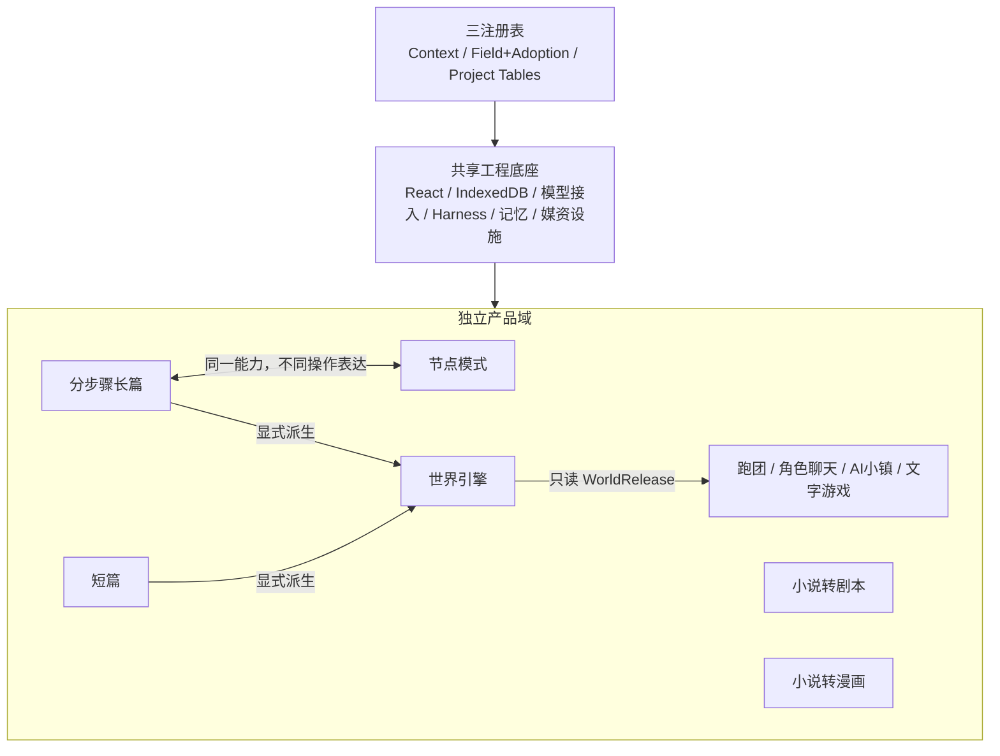
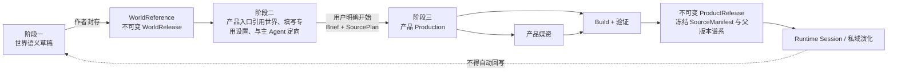

# StoryForge 当前架构总览

> 版本：2.2.0 · 更新：2026-08-27 · 权威层级：L1
> 本文描述当前主干代码事实与目标架构接缝。产品边界以项目总纲为准；代码偏差见对齐审计。

## 1. 运行形态

StoryForge 当前是 React + TypeScript + Vite 的本地优先单页应用，核心业务数据保存在浏览器 IndexedDB，文件工作区可使用 File System Access / OPFS。AI 请求发送到用户配置的模型服务。应用没有自建核心业务后端，也没有 staging；`main` 进入生产发布链。

路由只有四个壳入口：

- `/`：产品综合页 `ProductHubPage`；
- `/projects`：项目列表与传统入口；
- `/settings`：模型与应用设置；
- `/workspace/:projectId`：分步骤长篇工作区。

综合页承载世界引擎、作品、节点、跑团、角色聊天、文字游戏与市场实验入口；分步骤工作区仍是当前主要、最完整的作者路径，其 Phase 5 工程主链已经验收完成。

## 2. 产品与共享底座



共享底座允许复用执行、存储、模型、记忆和媒资设施，不意味着产品数据混合。世界引擎只拥有语义内容；上层产品拥有自己的 production、media、build、release、session 和 evolution。

## 3. 当前工程指标

<!-- project-metrics:start -->
> 本区块由 `npm run gen:project-metrics` 从当前代码生成；`npm run check:project-metrics` 在 CI 中防止漂移。

| 当前事实 | 数值 | 单一事实源 |
|---|---:|---|
| 应用语义版本 | `3.9.1` | `package.json` |
| TypeScript 生产源码 | 993 个文件 / 356456 行 | `tsconfig.json` |
| IndexedDB schema | v79 / 115 张 required tables | `schema.ts` / `REQUIRED_TABLES` |
| PROJECT_TABLES | 115 张表 | `project-tables.ts` |
| Prompt 主线 | 65 个 moduleKey / 210 条内置模板 | `PromptModuleKey` / `prompt-seeds*.ts` |
| CONTEXT_SOURCES | 86 个上下文源 | `context-sources.ts` |
| 写回治理 | 39 个通用 adopt target / 44 个领域扩展 | `adoption-schema.ts` |
<!-- project-metrics:end -->

## 4. 分层架构

| 层 | 职责 | 主要实现 |
|---|---|---|
| 产品与 UI | 收集意图、展示候选、作者确认、运行体验 | `src/pages`、`src/components` |
| 产品应用服务 | 长篇、改编、世界、跑团、聊天、文字游戏生产与运行 | `src/lib/{novel,adaptation,screenplay,comic,world-engine,ttrpg,character-interaction,game-production,...}` |
| Agent / Skill | 任务分类、能力契约、读写权限、Prompt/Tool 版本 | `src/lib/agent` |
| Durable Harness | run、event、checkpoint、attempt、stale、receipt | `src/lib/agent/run` |
| Context Gateway / 记忆 | 目录、预选、按需读取、原文与长期记忆 | `src/lib/context-gateway`、`src/lib/memory`、`src/lib/retrieval` |
| 三注册表 | AI 读取、候选采纳、表生命周期 | `src/lib/registry` |
| 领域一致性 | Canon、事实、关系、时间、主支线、状态和冲突 | `src/lib/consistency`、`fact-ledger`、`storyline`、`knowledge-ledger` |
| 数据与文件 | Dexie schema、迁移、备份、导入导出、OPFS | `src/lib/db`、`migrations`、`export`、`storage`、`media` |

## 5. 正式 AI 主路径

```text
产品入口 / 作者意图
→ AI Entry Registry 中的 formal 入口
→ 登记 Skill + Run Contract
→ CONTEXT_SOURCES / Context Gateway
→ provider adapter / 闭集只读工具
→ 原始输出 + CreativeArtifact
→ schema / 确定性验证 / 有界 repair
→ durable candidate + checkpoint
→ 作者预览、编辑、采纳或拒绝
→ FIELD_REGISTRY / AdoptionSchema / adopt()
→ post-state + terminal receipt
```

AI 入口注册表同时允许有明确边界的 `auxiliary`、`evaluation` 和 `experimental` 调用。它们不得直接写 Canon，也不得在 UI 中冒充正式 durable 流程。架构扫描器阻止未登记直连。

## 6. 三注册表

### 6.1 `CONTEXT_SOURCES`

登记稳定 source key、owner、作用域和加载器。`assembleContext()` 与 Context Gateway 是正式读取接缝；Skill 只声明 keys，不在组件中维护字段清单。Context Manifest 保存实际读取、哈希、预算和遗漏。

### 6.2 `FIELD_REGISTRY` / Adoption

Field Registry 决定 AI 可写字段；Adoption Schema/Extension 决定集合身份、外键、替换范围和领域事务。候选不是正式数据；stale 校验、作者确认和 post-state 回读构成采纳闭环。

### 6.3 `PROJECT_TABLES`

当前 required tables 与 `PROJECT_TABLES` 数量由检查器保持一致。注册表派生导出、导入、删除、迁移、作用域和引用重映射，覆盖普通记录、运行账本和共享 blob object。任何新表先登记再使用。

## 7. 数据域

### 7.1 `Project` / `World` / `Work`

`Project` 目前仍是本地物理容器和大量旧功能的兼容根；`World` 与 `Work` 提供显式语义 owner，`Work.worldId` 绑定来源世界。该兼容结构尚未完全表达总纲中的“独立长篇不等于世界引擎”，因此新增代码不能继续默认每个 Project 都是可发布世界。目标入口允许长篇/短篇显式一键派生世界快照，同时保持源作品 owner 和后续版本独立。

### 7.2 长篇与节点

分步骤工作区保存世界观、故事、角色、大纲、细纲、正文、事实、关系、伏笔、状态、检索和 run 数据，Phase 5 已完成该主链的工程验收。节点模式拥有 DAG、节点输入输出和运行记录，可以比标准步骤更细、更自由、更可视和可调，但必须调用同一长篇能力；任何平行节点 AI/DB 写入都是架构缺陷。

### 7.3 改编产品

短篇通过 Work kind/profile 区分规模；剧本与漫画使用 adaptation source/plan、screenplay scene、comic page/panel/visual subject 等独立表。漫画媒资由共享 blob 存储承载但 owner 在漫画产品。

### 7.4 世界引擎

世界领域提供投影、完整度、world code、release、source selection 和可运行世界包设施。目标出口是稳定世界编号与不可变版本，而不是直接暴露可变 Project 表。

### 7.5 上层产品

游戏生产使用 consultation、brief、command、build、artifact、media、release 与质量证据；角色互动和跑团有各自 production/runtime 数据。`SimulationSession` 及事件/checkpoint 保存私域运行。媒资通过共享设施存储，归具体 build/product release，不归 WorldRelease。

这些数据逻辑上分成两个产品阶段：用户引用世界、配置并确认方向形成 product draft/Brief；用户明确开始后进入 production/build/release/runtime。两阶段都属于上层产品，不属于世界引擎。当前不同产品已经拥有部分对应结构，但顶层 handoff 和共同阶段闸门尚未完全收口。

## 8. 世界到产品的单向流



世界读取统一的是 `describe/search/read` 的版本、资源、来源和遗漏协议；每个产品用自己的 requirement adapter 生成 SourcePlan。production 的每个 run 只在 plan 锁定的 WorldRelease 内渐进读取并保存 Context Manifest，ProductRelease 聚合为不可变 SourceManifest 快照；不同产品不共享固定 payload。运行时绑定 ProductRelease，任何继续读取世界的权限也从该 release 的 SourcePlan 继承，新证据归 session/run manifest，不追写 release。若未来把衍生内容转成世界新版本，应走另一个显式创作/采纳流程。

## 9. 失败与恢复

Durable Harness 将运行状态写入 ledger/checkpoint；provider 调用有 attempt identity；候选保存输入/目标 revision；采纳使用事务和 post-state。网络结果未知、认证/配额、stale、协议错误和不可恢复错误分开处理。

UI 刷新后必须从 durable 状态恢复。没有 checkpoint 的辅助调用只能返回内存结果或只读报告，不得静默写正式数据。

## 10. 关键目录

```text
src/
├── pages/                  路由壳与产品综合页
├── components/             产品 UI、候选、设置与运行面板
├── stores/                 UI 投影与领域状态
└── lib/
    ├── agent/              Skill、AI 入口与 durable run
    ├── context-gateway/    渐进式上下文目录和读取
    ├── registry/           三注册表
    ├── db|migrations|export|storage/
    ├── novel|outline|prose|storyline/
    ├── adaptation|screenplay|comic/
    ├── world-engine/
    ├── ttrpg|character-interaction|game-production/
    ├── simulation|text-game|adventure|avg|open-world/
    └── media/              跨产品媒资设施，不是世界引擎模块
```

## 11. 当前诚实边界

- 代码中已存在大量上层产品、市场和托管能力，但存在“实现领先于总纲发展顺序”和实验入口可见的问题；不等于这些产品已完整交付。
- Product/World/Work 的兼容关系仍会把独立作品与世界引擎混在同一 Project 表达，需要按对齐审计渐进纠正，不能再扩大耦合。
- 分步骤长篇 Phase 5 工程主链和 10万/30万/100万字符规模门已经完成；真实作者长期文学一致性仍需持续研究，但不是尚未完成的功能施工项。
- 世界 Release、上层 Production/Release 与媒资 owner 已有基础，但“中立世界资源协议 + 产品需求适配器 + SourcePlan/run manifests/发布 SourceManifest”仍需收口；不能用统一固定 payload 解决差异。
- 部分深层 production 已绑定 WorldRelease ID/hash，但顶层入口仍可能展示可变 Project worldVersion；三阶段 handoff 和 ProductRelease 谱系尚未成为所有上层产品共同闸门。
- 账户、云端社区、支付和商业平台不是当前核心运行前提；相关代码必须 capability gate / experimental，不能掩盖主产品未完成。

当前能力与缺口以 [`roadmap/CAPABILITY-BASELINE.md`](./roadmap/CAPABILITY-BASELINE.md) 和
[`audits/PROJECT-CHARTER-ALIGNMENT-AUDIT-20260826.md`](./audits/PROJECT-CHARTER-ALIGNMENT-AUDIT-20260826.md) 为准。

## 12. 交付门

代码提交前执行定向测试和最低架构门；交付运行 `npm run ci`，适用时运行 `npm run ci:e2e`。详细要求见
[`ENGINEERING-QUALITY-STANDARD.md`](./ENGINEERING-QUALITY-STANDARD.md)。
