# StoryForge 数据流大图（可视化总览）

> 配套 `DATA-FLOW-MAP.md`（文字总表）。这里用 Mermaid 把整个项目的功能、上下文注入、读写/提取/反推关系画出来。
> GitHub / VS Code Markdown Preview Mermaid 等会自动渲染成图。
> 创建：2026-06-04｜本文档与 DATA-FLOW-MAP 同步更新。

---

## 〇、图例与约定

- 🟦 蓝 = 📥 上游设定（作者填、AI 写作时读）
- 🟧 橙 = ✍️ 正文创作（章节）
- 🟪 紫 = 📤 下游产物（AI 从正文提取）
- 🟩 绿 = 🛠️ 工具/反推（用户给料 → AI 反向生成 → 写回上游）
- 🟦 青 = 🧩 共享上下文构建函数
- 🟥 红 = 🌍 多世界系统

**箭头含义**：`==注入==>` AI 上下文注入  ·  `==写==>` 落库  ·  `-.反推.->` 反向流  ·  `==提取==>` 从正文派生产物

---

## 一、总览大图

```mermaid
flowchart TB
    subgraph TOP["📁 著作信息"]
        PROJ["项目概况 projects<br/>name · genre · enableMultiWorld<br/>writingStyleId · targetWordCount"]
        INSP["🛠️ 灵感反推 InspirationPanel"]
        REFER["🛠️ 项目参考 references<br/>+ referenceChunkAnalysis"]
    end

    subgraph MW["🌍 多世界系统"]
        WG["世界组 worldGroups<br/>主世界 · 斗破 · 遮天 · …"]
        WGL["世界关系 worldGroupLinks<br/>fromGroupId · toGroupId · linkType"]
    end

    subgraph UPSTREAM["📥 上游设定层"]
        WV["世界观 worldviews<br/>worldOrigin · powerHierarchy · divineDesign<br/>worldStructure · continentLayout · climateByRegion<br/>races · factionLayout · politicsEconomyCulture<br/>itemDesign · naturalResources · worldEvents 等<br/>worldGroupId"]
        SC["故事核心 storyCores<br/>theme · centralConflict · plotPattern<br/>mainPlot · subPlots · logline · concept"]
        PS["力量体系 powerSystems<br/>name · description · levels JSON · rules<br/>worldGroupId"]
        WR["真实与幻想 worldRulesProfiles<br/>entries 各节点 · customNodes · globalNote<br/>项目级单例·待 Phase40 多世界化"]
        HIST["历史年表<br/>histories overview<br/>historicalTimelineEvents · historicalKeywords<br/>worldGroupId"]
        WMAP["世界地图<br/>worldNodes 世界树<br/>worldGroupId · mapConfigJSON"]
        CODEX["📦 设定词条 codex<br/>codexCategories 树 · codexEntries<br/>7 内置类·fields schema 驱动·refs 关联<br/>worldGroupId"]
        ITEM["道具系统 itemSystems<br/>Phase35-b 将并入 codex.artifact"]
        LOC["重要地点 importantLocations<br/>tags · 树状 · 无 worldGroupId"]
        CHAR["角色 characters<br/>name · role · shortDescription · appearance<br/>personality · background · motivation · abilities · arc<br/>homeWorldGroupId · isCrossWorld"]
        REL["角色关系 characterRelations<br/>fromCharacterId · toCharacterId · relationType"]
        RULES["创作规则 creativeRules<br/>writingStyle · narrativePOV · atmosphere<br/>prohibitions · consistencyRules · specialRequirements<br/>citedReferenceIds · citedInsightIds"]
        OUTL["大纲 outlineNodes<br/>volume · storyBlock · chapter<br/>parentId · order · worldGroupId"]
        SARC["故事线 storyArcs<br/>name · type main/sub · stages"]
        FORE["伏笔 foreshadows<br/>type · status · plant/echo/resolveChapterId<br/>importance · urgency"]
    end

    subgraph CTX["🧩 共享上下文构建层"]
        FMTWV["formatWorldviewBlock"]
        FMTSC["formatStoryCoreBlock"]
        FMTPS["formatPowerSystemBlock"]
        BLDWV["buildWorldContext 单世界"]
        BLDCW["buildCurrentWorldContext 多世界"]
        BLDNODE["buildNodeWritingContext 章节级"]
        BLDCODEX["buildCodexContext"]
        BLDCHAR["buildCharacterContext"]
        BLDRULES["buildCreativeRulesContext"]
        BLDFORE["buildForeshadowContext"]
        BLDHIST["buildHistoricalContext"]
        BLDLOC["buildLocationContext"]
        BLDWRC["buildWorldRulesContext"]
        BLDREF["buildRefAnalysisContext"]
        BLDINS["buildMasterInsightContext"]
        BLDMEM["buildMemory 三层记忆"]
    end

    subgraph WRITE["✍️ AI 写作链"]
        AIOUTL["AI 生成卷/章大纲"]
        AIDETAIL["AI 生成细纲"]
        AICHAP["AI 生成章节正文"]
        CHAPTERS["📖 章节正文 chapters"]
        DETAILS["细纲 detailedOutlines"]
        EBEAT["情感节拍 emotionBeatCards"]
    end

    subgraph DOWN["📤 下游产物"]
        STATE["状态表 stateCards"]
        LEDGER["物品栏 itemLedger<br/>项目级·诸天流跨世界携带"]
        TIME["故事年表 storyTimelineEvents"]
    end

    subgraph TOOLS["🛠️ 工具/反推流"]
        CDP["角色驱动剧情"]
        SVERIFY["场景考证"]
        WGAI["AI 建议世界"]
        REVIEW["章节审校"]
        READAB["追读力评估"]
        SUMMARY["章节摘要"]
    end

    PROJ -.开启多世界.-> WG
    INSP -.反推.-> WV
    INSP -.反推.-> SC
    INSP -.反推.-> CHAR
    INSP -.多世界反推.-> WG
    REFER -.采纳到 citedRefIds.-> RULES

    WG -.worldGroupId.-> WV
    WG -.worldGroupId.-> PS
    WG -.worldGroupId.-> HIST
    WG -.worldGroupId.-> WMAP
    WG -.worldGroupId.-> CODEX
    WG -.worldGroupId.-> OUTL
    WG -.homeWorldGroupId.-> CHAR

    WV ==读==> FMTWV
    SC ==读==> FMTSC
    PS ==读==> FMTPS
    FMTWV --> BLDWV
    FMTSC --> BLDWV
    FMTPS --> BLDWV
    FMTWV --> BLDCW
    FMTSC --> BLDCW
    FMTPS --> BLDCW
    BLDCW --> BLDNODE
    CODEX ==读==> BLDCODEX
    BLDCODEX --> BLDCW
    BLDCODEX --> BLDNODE
    CHAR ==读==> BLDCHAR
    RULES ==读==> BLDRULES
    FORE ==读==> BLDFORE
    HIST ==读==> BLDHIST
    LOC ==读==> BLDLOC
    WR ==读==> BLDWRC
    REFER ==读==> BLDREF

    BLDWV ==注入==> AIOUTL
    BLDNODE ==注入==> AIOUTL
    BLDCHAR ==注入==> AIOUTL
    BLDWRC ==注入==> AIOUTL
    BLDWV ==注入==> AIDETAIL
    BLDNODE ==注入==> AIDETAIL
    BLDCHAR ==注入==> AIDETAIL
    BLDFORE ==注入==> AIDETAIL

    BLDWV ==> BLDMEM
    BLDCHAR ==> BLDMEM
    BLDFORE ==> BLDMEM
    STATE -.episodic.-> BLDMEM
    EBEAT -.working.-> BLDMEM
    BLDMEM ==注入==> AICHAP
    BLDRULES ==注入==> AICHAP
    BLDLOC ==注入==> AICHAP
    BLDREF ==注入==> AICHAP
    BLDINS ==注入==> AICHAP

    OUTL --挂在节点上--> CHAPTERS
    OUTL --挂在节点上--> DETAILS
    AIOUTL ==写==> OUTL
    AIDETAIL ==写==> DETAILS
    AICHAP ==写==> CHAPTERS
    CHAPTERS --关联--> EBEAT

    CHAPTERS ==提取==> STATE
    CHAPTERS ==提取==> LEDGER
    CHAPTERS ==提取==> TIME
    CHAPTERS ==提取==> REL

    STATE -.按需召回.-> AICHAP

    BLDWV --> CDP
    BLDCHAR --> CDP
    BLDWV --> SVERIFY
    BLDHIST --> SVERIFY
    BLDWRC --> SVERIFY
    WG ==全世界概览==> WGAI
    WGAI ==写==> WG
    WGAI ==写==> WV
    CHAPTERS --> REVIEW
    BLDWV --> REVIEW
    BLDCHAR --> REVIEW
    BLDFORE --> REVIEW
    STATE --> REVIEW
    CHAPTERS --> READAB
    CHAPTERS --> SUMMARY
    SUMMARY ==写==> CHAPTERS

    classDef up fill:#1d4ed8,stroke:#1e40af,color:#fff;
    classDef write fill:#ea580c,stroke:#c2410c,color:#fff;
    classDef down fill:#7c3aed,stroke:#6d28d9,color:#fff;
    classDef tool fill:#16a34a,stroke:#15803d,color:#fff;
    classDef ctx fill:#0891b2,stroke:#0e7490,color:#fff;
    classDef mw fill:#dc2626,stroke:#b91c1c,color:#fff;
    classDef top fill:#9ca3af,stroke:#6b7280,color:#fff;

    class WV,SC,PS,WR,HIST,WMAP,CODEX,ITEM,LOC,CHAR,REL,RULES,OUTL,SARC,FORE up
    class AIOUTL,AIDETAIL,AICHAP,CHAPTERS,DETAILS,EBEAT write
    class STATE,LEDGER,TIME down
    class CDP,SVERIFY,WGAI,REVIEW,READAB,SUMMARY,INSP,REFER tool
    class FMTWV,FMTSC,FMTPS,BLDWV,BLDCW,BLDNODE,BLDCODEX,BLDCHAR,BLDRULES,BLDFORE,BLDHIST,BLDLOC,BLDWRC,BLDREF,BLDINS,BLDMEM ctx
    class WG,WGL mw
    class PROJ top
```

---

## 二、上游 → AI 写作的上下文注入路径（放大）

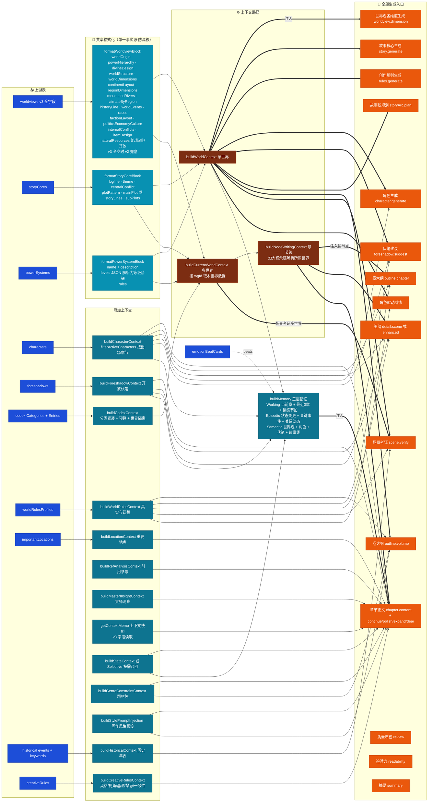

---

## 三、章节正文生成完整调用栈（时序）

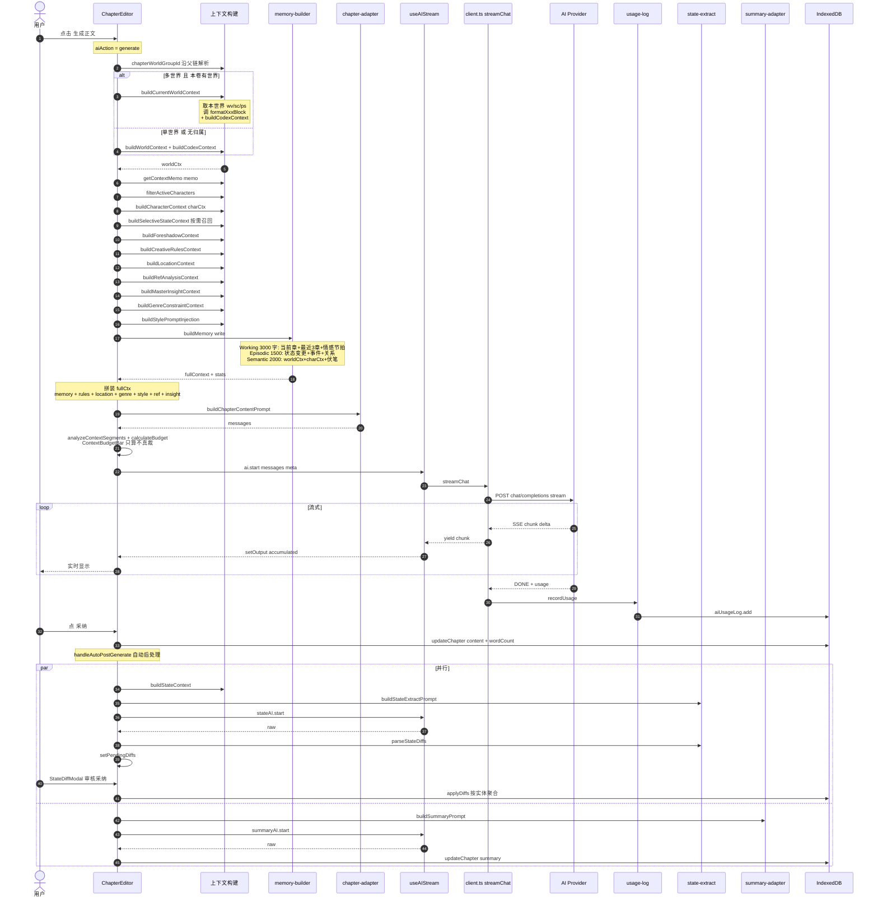

---

## 四、下游产物提取

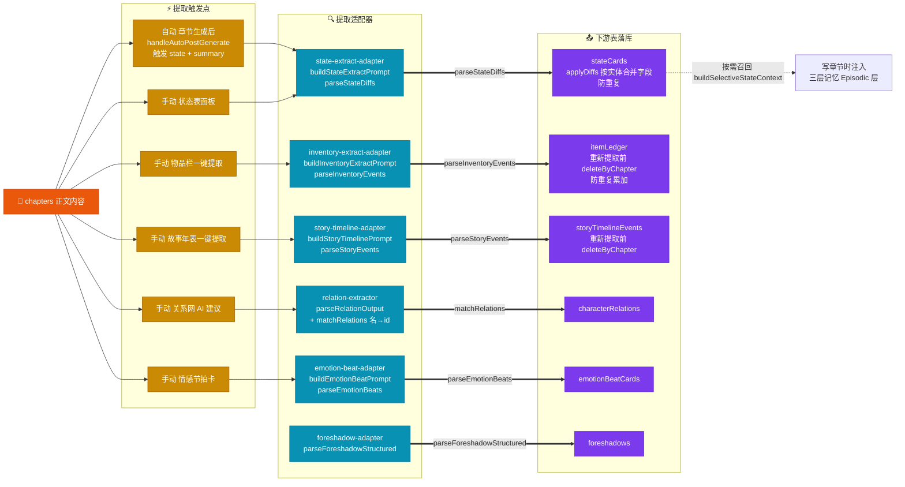

---

## 五、反推 / 工具流

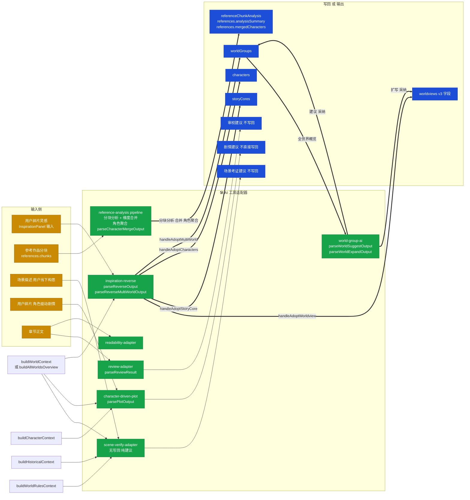

---

## 六、多世界系统：数据隔离 + 生命周期

```mermaid
flowchart TB
    WG["🌍 worldGroups<br/>主世界 + N 个并列世界<br/>type primary/parallel/instance/ascension"]
    WGL["worldGroupLinks<br/>fromGroupId · toGroupId · linkType<br/>诸天/穿越/飞升/分支"]

    subgraph WGTABLES["✅ 带 worldGroupId 的表 按世界隔离"]
        T1["worldviews"]
        T2["powerSystems"]
        T3["geographies"]
        T4["histories"]
        T5["worldNodes 世界地图"]
        T6["historicalTimelineEvents"]
        T7["historicalKeywords"]
        T8["outlineNodes 卷可挂世界"]
        T9["codexCategories 自定义"]
        T10["codexEntries 词条"]
        TC["characters<br/>homeWorldGroupId · isCrossWorld 跨世界"]
    end

    subgraph PROJTABLES["⚠️ 项目级 不隔离"]
        P1["storyCores"]
        P2["creativeRules"]
        P3["foreshadows"]
        P4["storyArcs"]
        P5["stateCards"]
        P6["itemLedger 物品栏<br/>诸天流跨世界携带 设计如此"]
        P7["storyTimelineEvents"]
        P8["characterRelations"]
        P9["importantLocations<br/>无 worldGroupId 全局注入"]
        P10["worldRulesProfiles<br/>项目级单例 待 Phase40 多世界化"]
        P11["codex 内置分类<br/>worldGroupId null 全局共用结构"]
    end

    subgraph LIFE["🔄 多世界生命周期 world-group store"]
        MIG["migrateToMultiWorld<br/>stamp wv/ps/geo/hist/wn<br/>+ HTE/HK/codexEntries<br/>分类保持 null 全局"]
        DEL["deleteGroup 级联<br/>删 wv/ps/geo/hist/wn<br/>+ HTE/HK + codexEntries<br/>+ 该世界自定义 codexCategories<br/>清 characters.homeWGId<br/>清 outlineNodes.wgId<br/>删 worldGroupLinks"]
        ENS["ensurePrimaryGroup<br/>确保主世界 type primary"]
        SETACT["setActiveGroup 切换编辑世界"]
    end

    WG -.stamp.-> MIG
    WG -.被删时.-> DEL

    MIG ==> T1
    MIG ==> T2
    MIG ==> T3
    MIG ==> T4
    MIG ==> T5
    MIG ==> T6
    MIG ==> T7
    MIG ==> T10
    DEL ==> T1
    DEL ==> T2
    DEL ==> T3
    DEL ==> T4
    DEL ==> T5
    DEL ==> T6
    DEL ==> T7
    DEL ==> T8
    DEL ==> T9
    DEL ==> T10
    DEL ==> TC

    subgraph CTX2["📥 按世界读取上下文"]
        BCW["buildCurrentWorldContext<br/>按 wgId 取本世界 wv/ps<br/>+ 项目级 sc + 本世界 codex"]
        BNW["buildNodeWritingContext<br/>沿父链解析所属世界<br/>未归属 走单世界路径"]
        BAW["buildAllWorldsOverview<br/>跨世界规划 灵感反推用"]
    end

    T1 --> BCW
    T2 --> BCW
    P1 --> BCW
    T10 --> BCW
    BCW --> BNW
    WG ==全世界摘要==> BAW

    subgraph EXP_S["📦 导出/导入"]
        EXP_OUT["exportProjectJSON<br/>worldGroups 用 _exportId index<br/>BUG-EXPORT-WG<br/>其它表 worldGroupId 是原始 id<br/>导入 remap 键不匹配<br/>多世界归属丢失"]
        IMP_OUT["importProjectJSON<br/>newWorldGroupIds index 新 id<br/>section 27 remap"]
    end

    EXP_OUT -.待修.-> IMP_OUT

    classDef wg fill:#dc2626,stroke:#b91c1c,color:#fff;
    classDef wgt fill:#1d4ed8,stroke:#1e40af,color:#fff;
    classDef pj fill:#7c2d12,stroke:#9a3412,color:#fff;
    classDef life fill:#16a34a,stroke:#15803d,color:#fff;
    classDef ctx fill:#0891b2,stroke:#0e7490,color:#fff;
    classDef bug fill:#991b1b,stroke:#7f1d1d,color:#fff;

    class WG,WGL wg
    class T1,T2,T3,T4,T5,T6,T7,T8,T9,T10,TC wgt
    class P1,P2,P3,P4,P5,P6,P7,P8,P9,P10,P11 pj
    class MIG,DEL,ENS,SETACT life
    class BCW,BNW,BAW ctx
    class EXP_OUT,IMP_OUT bug
```

---

## 七、设定词条系统 Codex

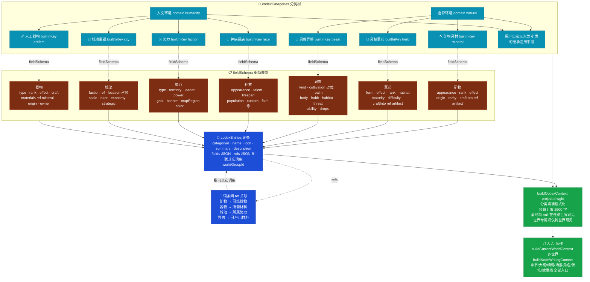

---

## 八、生命周期操作 × 表 矩阵（数据完整性根因图）

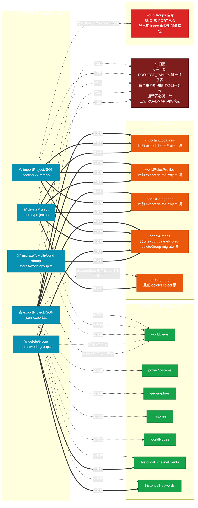

---

## 九、AI 客户端 + 消耗统计

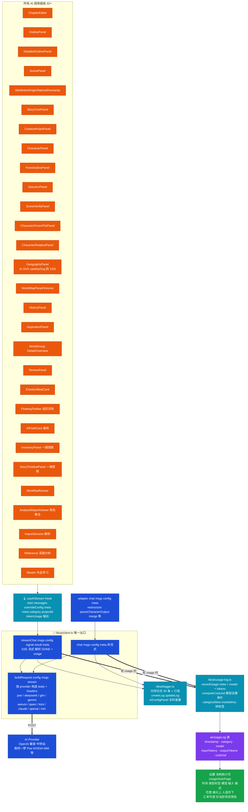

---

## 十、三层记忆系统

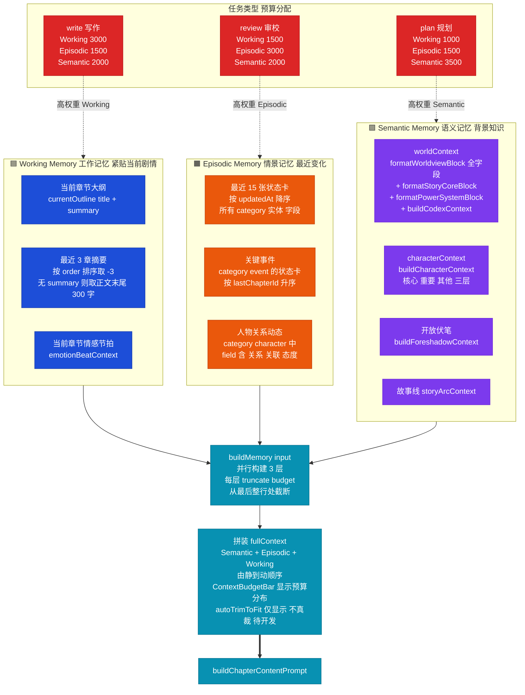

---

## 十一、自动保存 / 备份 / 导出 / 导入 数据安全链

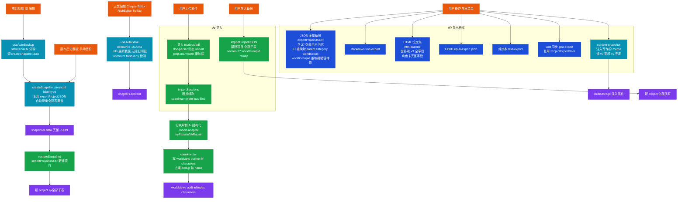

---

## 十二、删除引用完整性

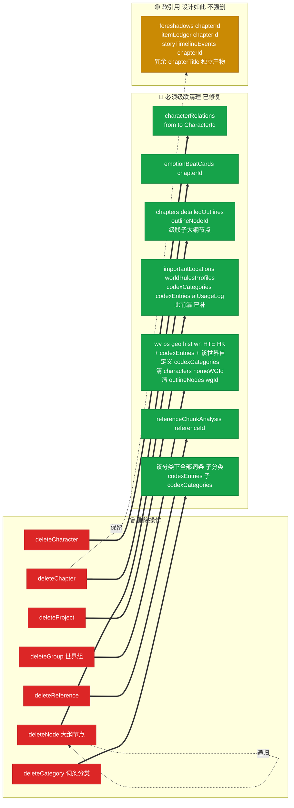

---

## 十三、Stores 全景（zustand store 责任划分）

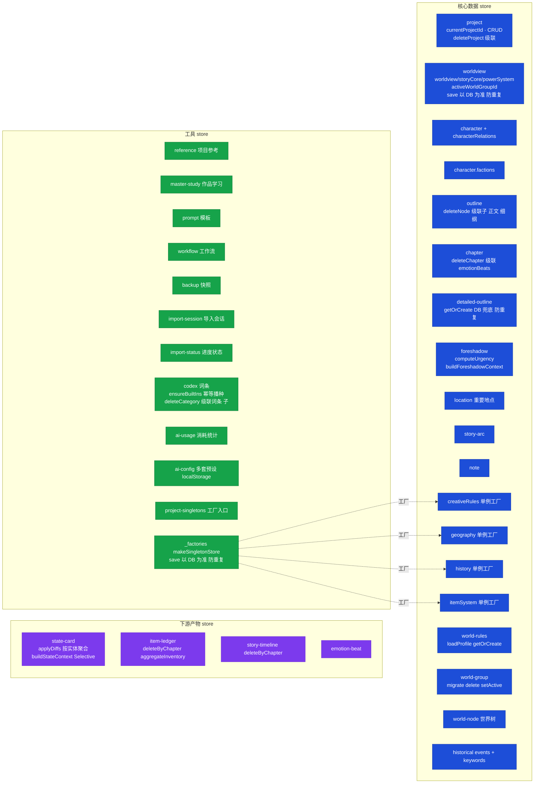

---

## 十四、已修复 bug 与待开发清单可视化

```mermaid
flowchart LR
    subgraph BUGS["🟢 已修复关键 bug 本轮审计"]
        B1["导出漏 3 表<br/>importantLocations worldRulesProfiles codex"]
        B2["单世界世界观读 v2<br/>面板写 v3 喂不进 AI"]
        B3["创作规则不注入正文"]
        B4["场景 细纲 角色 多世界串台"]
        B5["灵感反推采纳为空<br/>save 内存 null 新建重复"]
        B6["单例工厂 save 重复记录<br/>geo hist itemSystem creativeRules"]
        B7["detailed-outline 重复细纲"]
        B8["状态 applyDiffs 同实体多字段<br/>重复 或 覆盖"]
        B9["deleteNode 漏删正文 细纲"]
        B10["deleteCharacter 漏删关系"]
        B11["deleteProject 漏 5 表"]
        B12["deleteGroup 漏删 HTE HK codex"]
        B13["migrateToMultiWorld 漏盖章 codex"]
        B14["HTML 导出世界观为空<br/>只渲染世界树"]
        B15["context-snapshot 读 v2 字段"]
        B16["AI SVG 未清洗 XSS"]
        B17["storyLines 遗留字段"]
    end

    subgraph TODO_H["🔴 待开发 高优先"]
        T1["BUG-INPUT-WITH-GEN<br/>文本框可输入 AI 带上当前值<br/>工作流步骤卡无输入"]
        T2["Phase 40<br/>真实与幻想多世界联动<br/>设计已就绪"]
        T3["BUG-EXPORT-WG<br/>多世界 worldGroupId remap 错位"]
        T4["Phase 38 AI 一致性检测"]
        T5["Phase 39 多故事线进度追踪"]
    end

    subgraph TODO_M["🟠 待开发 中优先"]
        TM1["PROJECT_TABLES 唯一注册表<br/>结构性根治新表漏接生命周期"]
        TM2["R-1 统一上下文装配层<br/>+ 数据源注册表"]
        TM3["R-2 统一采纳写回层<br/>+ 规范字段 schema"]
        TM4["autoTrimToFit 真裁剪<br/>token-aware 降级"]
        TM5["Phase 34 力量阶段追踪"]
        TM6["Phase 35-b 词条迁移落地<br/>势力合并 物产 器物"]
        TM7["Phase 35-c 导入 AI 分类"]
        TM8["Phase 36 上下游标记"]
        TM9["Phase 37 修炼体系 DAG"]
    end

    subgraph TODO_L["🔵 待开发 低优先"]
        TL1["Phase 27 AI Agent 化<br/>对话副驾 + 后台 Agent"]
        TL2["Phase 27.2b 写作时自动检索"]
        TL3["Phase 27.3 NPC 自动演进"]
        TL4["React.lazy 懒加载重面板"]
        TL5["提示词内容质量审查"]
        TL6["UI 运行时走查"]
        TL7["D AI 建议世界字段不全"]
        TL8["E 重要地点无 worldGroupId"]
        TL9["G/I 伏笔 历史多世界"]
        TL10["死代码 WorldviewPanel 已清"]
        TL11["filterActiveCharacters 章节 ID vs order"]
    end

    classDef fix fill:#16a34a,stroke:#15803d,color:#fff;
    classDef hi fill:#dc2626,stroke:#b91c1c,color:#fff;
    classDef mid fill:#ea580c,stroke:#c2410c,color:#fff;
    classDef lo fill:#0891b2,stroke:#0e7490,color:#fff;
    class B1,B2,B3,B4,B5,B6,B7,B8,B9,B10,B11,B12,B13,B14,B15,B16,B17 fix
    class T1,T2,T3,T4,T5 hi
    class TM1,TM2,TM3,TM4,TM5,TM6,TM7,TM8,TM9 mid
    class TL1,TL2,TL3,TL4,TL5,TL6,TL7,TL8,TL9,TL10,TL11 lo
```

---

## 附录：所有 DB 表速查 v26

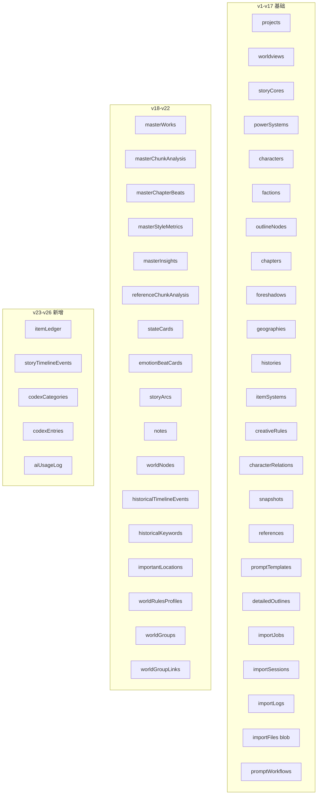

---

## 维护说明

- **本图与 `docs/DATA-FLOW-MAP.md` 文字总表同步更新**，是同一份数据的两种视图。
- 任何新增 **功能 / 表 / AI 调用入口**，必须在两份文档同步登记，并：
  - 在图二注册"被哪个共享构建函数读"
  - 在图四登记"是否提取下游"
  - 在图八的生命周期矩阵更新覆盖情况
  - 在图九登记 category 消耗类型
- 这是项目的**唯一事实源**，今后审查 / 重构以此为基准。
