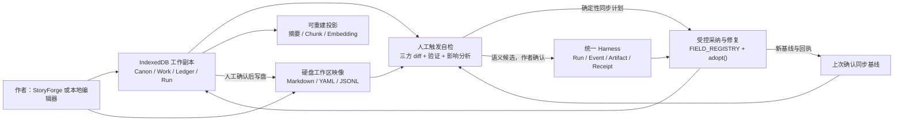

# StoryForge 记忆工程完整施工方案

> 日期：2026-08-17
> 状态：✅ `MEMORY-0～10` 已完成施工与验收；本方案已封版，不再作为待开工计划
> 主体系：Memory Engineering / Durable Authoring Memory
> 基线分支：`feat/harness-creative-reliability`
> 基线提交：`d2ecf9f docs(CREL-13): freeze real evaluation outcome`
> 主干落点：PR #66（`bc77d12`）完成主体工程；PR #71（`ad3d25b`）完成收口与项目自有存储位置
> 后续权威：[记忆工程收口纲领](./MEMORY-ENGINEERING-CLOSURE-CHARTER-20260817.md) 与 [本地记忆工作区指南](./MEMORY-WORKSPACE-GUIDE.md)
> 施工原则：不建立平行 Agent、平行数据库、平行采纳入口或独立向量事实源。

## 一、最终结论

记忆工程已经按本方案完成施工、真实文件系统验收和主干合并。后续任务应复用现有能力，不得再以本方案
“可以开工”的历史判断重建第二套记忆库、同步器或 Harness 结算入口。

施工基线已经具备统一 Agent + Harness、版本化 RunContract、事件账本、候选与采纳、完成回执、
World/Work 作用域、三注册表、章节采纳后记忆沉淀、确定性影响图、项目全量导入导出和本地文件夹授权。
最终实现继续以这些能力为唯一基础，没有等待或复制 Harness 重构。

施工没有把原有“每五分钟覆盖一个完整 JSON 备份”直接扩成双向同步，而是先完成了三个前置收口：

1. 关闭绑定文件夹后的静默覆盖，改为作者手动触发核对与同步。
2. 为 LocalWorkspace 和 Work 增加不随本机自增 ID、标题或导入重映射改变的稳定身份。
3. 冻结“哪些内容是可编辑记忆、哪些是只读证据、哪些只是可重建缓存”的投影合同。

完成后，StoryForge 的长期记忆不再是“模型偶尔检索到的一段文本”，而是作者、Harness、
IndexedDB 和本地文件共同维护的一套可见、可编辑、可核对、可恢复、可追溯的创作状态。

---

## 二、冻结的最终目标

本体系最终必须同时实现以下目标；任何阶段性实现如果破坏其中一项，都不能称为记忆工程完成。

1. **Harness 成果沉淀为记忆**
   每次生成、验证、作者修改、采纳、拒绝、失败、恢复与下游整理，都留下可定位的成果、来源、状态和回执；
   后续任务能复用已确认成果，不把历史重新猜一遍。

2. **确定内容在浏览器与硬盘同时存在**
   作者填写的内容、AI 形成的可恢复候选、作者作出的决定、已采纳 Canon/正文/状态和完整性证据，
   同时存在于 IndexedDB 与绑定硬盘工作区。硬盘不是只在灾难时使用的压缩备份。

3. **硬盘内容可读、可编辑**
   正文使用 Markdown，适合人工维护的结构化资料使用 YAML，机器回执使用 JSON/JSONL；
   作者可以用普通编辑器理解并修改允许编辑的内容。

4. **双向影响，但不静默互相覆盖**
   IndexedDB 是应用运行中的工作副本，硬盘是可编辑的持久映像。任一侧都可以产生变化，
   但两侧分歧时没有一侧无条件获胜，必须由作者主动触发三方核对。

5. **人工触发自检是唯一同步入口**
   作者修改硬盘后，主动点击自检；作者在 StoryForge 中修改项目后，同样主动点击自检。
   页面进入、定时器、模型完成和后台事件都不得悄悄覆盖另一侧。

6. **自检不只是复制文件**
   系统要比较变化前基线、当前 IndexedDB、当前硬盘，识别冲突，检查 schema、作用域、引用、
   锁和前后依赖，并列出需要重算、复核或重新生成的内容。

7. **自动修正受治理，语义改写需确认**
   哈希、格式、索引、计数、引用重映射和可重建投影可以确定性自动处理；涉及正文、设定、事实、
   人物动机或叙事含义的修改只能形成候选，由作者确认后经既有 `adopt()` 正式写入。

8. **长期一致性不押注 embedding + RAG**
   结构化 Canon、状态账本、时间事实、来源证据、依赖图、摘要层级和 Harness 回执是权威基础；
   embedding 只允许作为可删除、可重建、可关闭的召回索引，不能决定事实真伪或覆盖作者决定。

9. **成本可见且受控**
   文件扫描、哈希、三方差异、schema 校验、依赖失效、同步和恢复必须零模型调用；
   只有作者明确选择语义合并、语义影响分析或生成式修复时才消耗 token，并在调用前显示范围与预算。

10. **作者最终感知的是连续性，而不是“记忆库”**
    作者应看到“已同步/有改动/有冲突/需复核/正在恢复”，能查看某条内容从哪里来、影响什么，
    并能在换电脑、清空浏览器数据或长期停更后恢复同一创作状态。

### 2.1 “确定内容”的工程定义

以下内容属于必须双份持久化的“确定内容”：

- 作者主动输入或修改并保存的领域内容；
- AI 已完成、能够被恢复或复核的候选成果；
- 作者的采纳、拒绝、修改后采纳、撤销与冲突解决决定；
- 正式 Canon、正文、纲要、人物、设定、时序、状态、物品、知识和交接信息；
- Harness 的契约、事件、产物引用、验证结果、成本证据和终态回执；
- 同步基线、文件身份、冲突解决和恢复回执。

以下内容不属于需要双份保存的语义记忆：

- 流式输出尚未完成的临时片段；
- 模型隐藏推理；
- API Key、会话凭证、文件夹授权句柄；
- embedding 向量、检索 chunk、UI 缓存和可从正式内容确定性重建的投影。

这不是缩小目标，而是防止“把缓存复制两份”冒充长期记忆。可重建投影必须登记来源和重建器；
如果不能证明可重建，就按确定内容持久化。

---

## 三、2026-08-17 当前项目基线审计

### 3.1 已完成并可直接复用

| 能力 | 当前实现 | 记忆工程中的用途 |
|---|---|---|
| 统一 AI 读取 | `CONTEXT_SOURCES + assembleContext()` | 后续模型只能读取已登记的记忆来源 |
| 统一 AI 写回 | `FIELD_REGISTRY + AdoptionSchema + adopt()` | 硬盘改动和语义修复候选不能绕过采纳边界 |
| 数据全生命周期 | `PROJECT_TABLES` | 文件投影、导出、导入、删除、迁移、作用域和引用重映射由同一表登记派生 |
| Durable Harness | `agentRuns / agentRunEvents / agentCheckpoints` | 复用 Run、Step、Attempt、事件、崩溃恢复和终态回执，不建第二套同步运行时 |
| 候选正文与会话 | `agentEvents` | 已完成候选及作者修订可形成磁盘产物，不另存一份权威正文 |
| 流程成果 | `nodeRuns` 中的 `CreativeArtifactV1[]` | 流程型生成成果通过引用进入记忆目录 |
| 章节采纳后沉淀 | `chapter-post-adoption-durable.ts` | 已有 retrieval → organization → memory → consistency → receipt 原型，应泛化而非复制 |
| 长期状态 | `temporalFacts`、`knowledgeLedger`、`stateCards`、`itemLedger`、`storyTimelineEvents` 等 | 结构化长期一致性的正式事实层 |
| 派生检索 | `retrievalChunks`、`narrativeSummaryNodes` | 可重建召回和层级摘要，不升级为事实源 |
| 反向影响 | H50～H81 影响图、当前计划、确定性重建和受控生成式 child | 外部文件改动后的依赖核对和修复调度基础 |
| 项目便携性 | 注册表派生的 JSON 导出/导入与引用重映射 | 灾难恢复和旧项目迁移的基础，不直接作为可编辑工作区格式 |
| 文件系统授权 | File System Access API + 独立句柄库 | 绑定作者选择的硬盘目录；句柄继续留在本机基础设施库 |

### 3.2 已完成但不应误判

- Agent + Harness 重构已经完成，不再是记忆工程的阻塞项。
- CREL-0～14 工程链已经完成；真实评测中存在诚实保留的质量/成本发布门失败，
  这限制的是对外质量承诺，不代表 Harness 仍未建成。
- `agentRuns` 严格事件账本主要保存契约、哈希和回执；候选正文位于 `agentEvents`、`nodeRuns`
  或正式领域表。记忆工程应建立稳定产物引用，不应再造一个万能正文表复制所有内容。

### 3.3 当前真实缺口

1. `Project` 没有独立的稳定 workspace 身份；`Work` 没有稳定 code，当前 `WorkspaceScope`
   仍以本机数值 ID 为主。直接拿数值 ID 做文件身份会在导入、合并和重映射后失效。
2. 现有 `useFolderAutoBackup` 会在进入项目时立即写盘，之后每五分钟覆盖完整 JSON。
   这会无提示抹掉作者在硬盘上的修改，必须在双向同步前下线。
3. 当前备份是单个机器 JSON，不是按 World/Work/正文/资料组织的可编辑工作区。
4. 没有共同基线，因此无法区分“只有 DB 改了”“只有文件改了”和“两侧都改了”。
5. 没有文件到正式字段的白名单映射，也没有外部编辑的 CAS、作用域和依赖检查。
6. Harness 的成果能够恢复，但尚未统一投影成作者可浏览的长期记忆目录。
7. `ContextManifestV1` 能证明来源 key/hash/token/boundary，尚不能精确指向文件文档、正式记录
   和其同步版本。
8. 现有影响图已覆盖核心叙事链，但仍是若干任务专用读模型，尚未形成文件变更的通用影响入口。

---

## 四、目标架构



### 4.1 权威关系

本体系不采用简单的“DB 永远权威”或“文件永远权威”。权威按内容类别和当前状态决定：

| 内容类别 | IndexedDB | 硬盘 | 分歧处理 |
|---|---|---|---|
| 正式领域内容 | 运行时正式副本 | 可编辑持久映像 | 三方核对；任何正式改动都经 schema、作用域、引用和采纳边界 |
| 待确认候选 | Harness 恢复副本 | 可编辑候选文件 | 候选可从任一侧修订；确认时 CAS，不能直接变成 Canon |
| Run/事件/回执 | 正式事件账本 | 只读证据映像 | 任意磁盘改动视为完整性冲突，不反向写入账本 |
| 同步基线 | `workspaceDocuments` 记录 | `.storyforge/manifest.json` | 二者必须互相验签；不一致时进入恢复，不猜最新 |
| 摘要/chunk/embedding | 派生投影 | 默认不镜像 | 丢失后从正式内容重建 |
| 文件夹句柄/凭证 | 本机基础设施存储 | 不写入工作区 | 不参与项目导出和模型上下文 |

### 4.2 五层记忆，而非一个万能 memories 表

1. **Canon memory**：世界规则、人物身份、地理、组织、世界发布版本等 World 所有内容。
2. **Work memory**：作品纲要、章节、伏笔、时间事实、人物在本作的弧线与状态。
3. **Operational memory**：Harness 契约、候选、作者决定、验证、失败、恢复与成本证据。
4. **Experience memory**：作者明确允许学习的偏好、修订模式和风格规则；可见、可删除、可关闭。
5. **Derived retrieval memory**：层级摘要、关键词、chunk、embedding；无权改写前四层。

禁止新增一个松散 `memories` 表，把不同权威级别的文本混在一起。现有领域表继续是事实源；
记忆工程增加的是稳定身份、文件投影、基线、产物引用和闭环协议。

---

## 五、数据合同与注册表收口

### 5.1 三注册表四问

| 问题 | 本体系答案 |
|---|---|
| AI 读什么 | 仍只能通过 `CONTEXT_SOURCES + assembleContext()`；文件不能被组件直接塞进 Prompt |
| AI 写什么 | 仍只能写 `FIELD_REGISTRY / AdoptionSchema` 允许的候选，确认后用 `adopt()` |
| 哪些表参与 | 所有正式表、Run 表和新增基线表必须登记 `PROJECT_TABLES`，完整派生导出/删除/迁移/重映射 |
| 文件如何映射 | 在 `PROJECT_TABLES` 的 TableSpec 上增加可选 `workspaceProjection` 描述，并派生只读投影视图；不另建平行领域注册表 |

`workspaceProjection` 至少声明：

- `documentKind`：正文、人物、规则、事实账本、候选或证据；
- `scopeOwner`：workspace / world / work；
- `codec`：markdown-frontmatter / yaml / json / jsonl；
- `editPolicy`：author-editable / candidate-editable / machine-readonly / derived-none；
- `pathPolicy`：稳定路径生成规则；
- `readMapper` / `writeMapper`：领域记录与文件文档之间的纯转换；
- `schemaVersion`：磁盘格式版本；
- `dependencyEmitter`：内容变更后产生的影响节点。

架构检查器必须拒绝以下旁路：

- 组件自行决定表名、路径或字段；
- 文件解析器直接 `db.table.update()`；
- 未登记字段从 YAML/Markdown 写入正式表；
- 未登记表出现在工作区 manifest；
- 直接把整个本地文件读入模型上下文；
- 给 derived-only 表赋予 author-editable 文件。

### 5.2 最小新增数据，不复制正文

计划新增一张基础设施表：`workspaceDocuments`（最终命名在 MEMORY-1 冻结）。它只保存绑定和基线，
不保存第二份正文，字段概念如下：

```ts
interface WorkspaceDocumentBindingV1 {
  id?: number
  projectId: number
  workspaceUid: string
  documentId: string
  documentKind: string
  tableName: string
  recordExportId?: string
  worldCode?: string
  workCode?: string
  relativePath: string
  codec: 'markdown-frontmatter' | 'yaml' | 'json' | 'jsonl'
  editPolicy: 'author-editable' | 'candidate-editable' | 'machine-readonly'
  schemaVersion: number
  baselineCanonicalHash: string
  lastDbCanonicalHash: string
  lastFileCanonicalHash: string
  lastSyncRevision: number
  lastSyncRunId?: number
  updatedAt: number
}
```

要求：

- 表登记在 `PROJECT_TABLES`，随项目删除；是否进入旧式 JSON 导出必须显式决定，不能靠默认值。
- 正文和领域内容仍只在原表；绑定表删除后能从磁盘 manifest 与正式表重建。
- 同步、自检、修复和文件事务优先复用 `agentRuns / agentRunEvents / agentCheckpoints`，
  以 `modelPolicy: none` 表示确定性 Run；若当前 RunContract 类型不能表达，版本化扩展合同，
  不新增 `syncRuns` 平行状态机。
- 不默认新增“通用产物正文表”。先以 `MemoryArtifactRefV1` 指向 `agentEvents`、`nodeRuns`、
  `agentRunEvents` 或正式领域表；只有实现普查证明某类产物没有耐久载体时，才登记专用表。

### 5.3 稳定身份

首个 schema 迁移需要补齐：

- `Project.workspaceUid`：LocalWorkspace 的不可变 UUID；
- `Work.code`：作品的不可变公开/便携 code；
- `World.code`：复用当前已存在字段；
- `documentId`：每个磁盘文档的不可变 UUID，写入 front matter 和 manifest；
- `recordExportId`：沿用/扩展当前 JSON 导入导出的可重映射身份，禁止把 Dexie 数值 ID 写成便携身份。

旧项目惰性迁移时一次性生成并持久化；项目名、书名、章节名改变不得改变上述身份。
目录使用稳定 code，显示标题写在文档内容中，避免重命名被误判为删除加新增。

当前主库为 v53；实现时使用下一个尚未占用的 schema 版本，并在合入前重新核对，不能把“v54”写死在旁路迁移中。

### 5.4 Canonical hash

- 结构化文档：严格解析 → schema 校验 → key 稳定排序 → canonical JSON → SHA-256。
- 正文：只统一换行符后计算内容 hash；不自动 trim，不自动 Unicode 归一化，不改作者标点和空白。
- Front matter 元数据和正文分别 hash，避免机器字段重排伪装成正文改动。
- 同一 canonical 内容的格式化差异判为 `same-content`，允许只规范化文件而不触发语义影响图。
- Hash 版本写入 manifest；升级算法必须保留旧版本读取和一次性重算回执。

---

## 六、硬盘工作区表现形式

```text
<作者选择的目录>/
├── storyforge.workspace.json
├── worlds/
│   └── <world-code>/
│       ├── world.yaml
│       ├── rules.yaml
│       ├── characters/
│       │   └── <document-id>.yaml
│       ├── locations/
│       └── canon-ledgers/
├── works/
│   └── <work-code>/
│       ├── work.yaml
│       ├── story-core.yaml
│       ├── outlines/
│       ├── chapters/
│       │   └── <sequence>-<document-id>.md
│       ├── continuity/
│       ├── handoffs/
│       └── candidates/
└── .storyforge/
    ├── manifest.json
    ├── bindings.json
    ├── runs/
    │   └── <run-export-id>/
    │       ├── contract.json
    │       ├── events.jsonl
    │       ├── artifacts/
    │       └── receipt.json
    ├── transactions/
    ├── history/
    ├── quarantine/
    └── trash/
```

### 6.1 格式规则

- `.md`：章节正文、长篇说明和人工交接，YAML front matter 只保存稳定身份和有限元数据。
- `.yaml`：人物、规则、纲要节点等适合人工编辑的结构化内容。实现时把 `yaml` 加为直接依赖，
  不依赖当前 lockfile 中的传递依赖。
- `.json`：manifest、合同、回执和需要严格机器校验的快照。
- `.jsonl`：只追加事件的可读映像。
- 二进制附件：按内容 hash 保存，manifest 中引用；不得 base64 塞进 YAML。

### 6.2 编辑权限

每个文件都必须能在自检面板显示权限：

- **可编辑正式内容**：外部修改会形成受控导入候选。
- **可编辑候选**：外部修改只修订候选，不直接影响正式内容。
- **只读证据**：外部修改视为篡改/损坏，允许从 IndexedDB 重建，不允许反向采用。
- **派生文件**：默认不生成；若为可观察性生成，标注“可删除、不可反向同步”。

机器目录不是安全边界，不能只靠“请勿编辑”文字。解析器必须按 editPolicy 拒绝越权写回。

### 6.3 浏览器支持边界

- Chrome/Edge 等支持 File System Access API 的桌面浏览器提供完整的目录绑定、扫描和受控写回。
- 不支持该 API 的浏览器只提供显式“导出工作区包 / 导入并自检”，不得伪装成持续绑定。
- StoryForge 仍是纯前端、本地优先应用；本方案不引入服务器托管作者手稿。

---

## 七、人工触发自检协议

### 7.1 入口

工作区顶栏提供唯一主入口：`检查记忆与本地文件`。状态徽标只提示，不自动执行：

- 已同步；
- 项目内有改动；
- 硬盘有改动；
- 两侧都有改动；
- 存在冲突；
- 上次同步未完成；
- 文件夹权限失效。

项目内保存只标记 DB dirty；文件变化只有在作者点击检查后扫描。可选的文件系统观察器只能改变提示状态，
不能读取并采纳内容，更不能自动写盘。

### 7.2 三方比较

对每个 `documentId` 比较：

- `B`：作者上次确认同步的 canonical baseline；
- `D`：当前 IndexedDB 投影；
- `F`：当前硬盘文件。

| 条件 | 分类 | 默认动作 |
|---|---|---|
| `D=B` 且 `F=B` | clean | 无操作 |
| `D≠B` 且 `F=B` | project-changed | 提议 DB → 文件 |
| `D=B` 且 `F≠B` | file-changed | 解析、校验并形成文件 → DB 候选 |
| `D=F≠B` | same-change | 更新基线，不重复写内容 |
| `D≠B`、`F≠B`、`D≠F` | conflict | 展示三方差异；作者选择或请求语义合并候选 |
| DB 有、文件无 | file-missing | 区分误删与明确删除；默认恢复文件，不静默删 DB |
| 文件有、DB 无 | file-extra | 校验身份；允许导入、隔离或忽略 |
| 任一侧格式/哈希非法 | invalid | 隔离并停止该文档，不连带覆盖其它文件 |

删除必须是显式操作：作者确认后先移入 `.storyforge/trash/<sync-run-id>/`，
完成下一次成功基线后才允许人工清理，系统不做不可恢复硬删除。

### 7.3 五段自检流水线

1. **扫描**：枚举登记文档、拒绝未知路径穿越、计算 hash；零模型。
2. **结构核对**：格式、schema、稳定身份、World/Work 作用域、引用、重复 documentId；零模型。
3. **三方差异**：分类新增/修改/移动/删除/冲突，生成确定性变更集；零模型。
4. **影响分析**：映射到领域字段和依赖节点，列出确定性重建、人工复核、生成式修复；默认零模型。
5. **作者确认**：冻结同步计划；确定性操作直接执行，语义操作先生成候选并再次确认。

任何一步失败都保留已扫描证据，但不得部分更新共同基线。

### 7.4 文件改动写回 IndexedDB

文件不能直接导入成正式数据。每个文件改动必须经过：

1. front matter / YAML schema 严格解析；
2. `documentId + recordExportId + worldCode/workCode` 绑定核对；
3. `workspaceProjection` 把文档变化映射为登记字段；
4. 当前记录 CAS，确认扫描后没有被页面再次修改；
5. 作用域、引用、锁、所有权和删除策略检查；
6. 生成可解释候选与影响清单；
7. 作者确认；
8. 通过 `AdoptionSchema + adopt()` 写正式字段；
9. 运行既有或新增的采纳后沉淀链；
10. 文件回写规范格式、read-back 验证并更新共同基线。

批量核对可以一次确认多个互不冲突的确定性项，但语义冲突必须能逐项展开和排除。

### 7.5 项目内改动写回硬盘

作者在 StoryForge 中保存后：

- 正式表立即保存到 IndexedDB，保持当前离线优先体验；
- 对应 `documentId` 标记为 `project-changed`；
- 依赖投影可以在 DB 内按既有规则更新，但不自动写硬盘；
- 作者点击自检后，系统先确认硬盘仍等于 B，再写 D；若硬盘也变了则升级为冲突；
- 写盘完成、回读 hash 相同、manifest 最后提交后，状态才变为已同步。

### 7.6 语义冲突与自动修复边界

允许自动执行：

- 重新计算字数、排序号、索引和摘要树状态；
- 重建 retrieval chunk、层级摘要缓存和 embedding；
- 按注册表规则重映射引用；
- 规范 YAML/JSON 格式；
- 使已登记的确定性依赖节点 stale 并排队人工处理。

必须形成候选并由作者确认：

- 合并两份正文；
- 因人物设定变化重写章节；
- 改变事件因果、人物动机、时间线语义或世界规则；
- 删除仍被其它内容引用的正式记录；
- 把一次作者修改推断成长期风格偏好。

---

## 八、跨 IndexedDB 与文件系统的一致性事务

浏览器数据库与硬盘不能组成真正的原子事务，因此采用可恢复 saga，而不是宣传“强一致”。

### 8.1 提交顺序

1. 冻结 `SelfCheckPlanV1`，记录 B/D/F hash、目标、顺序、预期 CAS 和影响图 hash。
2. 写 Harness Run 与 checkpoint；此时尚未改正式内容。
3. 执行经确认的 DB adoption，并记录 adoption receipt。
4. Run 进入 `filesystem-pending`，逐文件写事务标记和目标内容。
5. 逐文件 read-back，核对内容与权限。
6. 最后写 `.storyforge/manifest.json` 和 DB binding baseline。
7. 生成 `WorkspaceSyncReceiptV1`，Run 才能 terminal complete。

### 8.2 崩溃恢复

| 崩溃点 | 恢复行为 |
|---|---|
| 冻结计划前 | 重新扫描，无正式变化 |
| 计划后、DB adoption 前 | 从 checkpoint 恢复；CAS 失效则作废计划 |
| DB adoption 后、写盘前 | 不重复 adopt；继续 `filesystem-pending` |
| 写了部分文件 | 用事务清单核对已写 hash，只补未完成项 |
| 文件全写、manifest 前 | 回读全部目标，再提交 manifest |
| manifest 后、DB baseline 前 | 用 manifest receipt 补记 DB baseline |
| 终态回执后 | 重复点击返回同一结果，不再写入或调用模型 |

若原文件需要替换，先把旧内容保存到 `.storyforge/history/<run-id>/`；File System Access API
不保证跨多文件原子替换，因此事务日志、manifest-last 和幂等恢复是完成门槛。

---

## 九、Harness 成果如何沉淀成记忆

### 9.1 统一沉淀屏障

每条正式生成链在“作者采纳”后必须经过统一 Memory Settlement Barrier：

1. **Evidence close**：RunContract、Context manifest、候选 hash、作者决定、usage 和 verifier receipt 完整。
2. **Canon adoption**：正式字段只由既有 `adopt()` 或受治理人工写入口更新。
3. **Memory materialization**：更新现有 temporal fact、knowledge、state、item、timeline、chapter handoff 等正式记忆。
4. **Dependency invalidation**：把受影响摘要、检索、下游章纲/正文/状态标为 stale，生成可执行计划。
5. **Workspace dirty**：标记需镜像的文档，但不自动写盘。
6. **Terminal receipt**：只有上述步骤完成或明确进入 awaiting-confirmation，Run 才能宣告完成。

`chapter-post-adoption-durable.ts` 已经实现了这一模式的章节版本。施工应抽取共享合同，
再让其它正式创作入口接入，不复制一套“记忆 Agent”。

### 9.2 产物引用，不复制产物正文

```ts
interface MemoryArtifactRefV1 {
  artifactId: string
  sourceKind: 'agent-event' | 'node-run' | 'agent-run-event' | 'domain-record'
  sourceExportId: string
  runExportId?: string
  stepId?: string
  attempt?: number
  contentHash: string
  authority: 'candidate' | 'accepted' | 'rejected' | 'evidence'
  worldCode?: string
  workCode?: string
}
```

作者在“记忆来源”中看到的是这个引用解析出的内容、状态和来源。正式正文继续属于 chapter，
候选继续属于 `agentEvents/nodeRuns`，运行证据继续属于 Harness ledger。

### 9.3 ContextManifestV2

在保持 V1 永久可读的前提下，版本化增加：

- `workspaceUid / worldCode / workCode`；
- 每个 Context source 实际读取的 `documentId / artifactId / recordExportId`；
- `baselineRevision / canonicalHash / freshnessStatus`；
- 来源的 authority 和 edit policy；
- 本次是否使用 derived retrieval，以及其正式上游 hash。

这样后续能回答“AI 当时读的是哪一版人物设定和哪一版章节”，而不只是知道读过 `characters`。
V2 仍由 `assembleContext()` 产生，文件目录不能成为第四条上下文入口。

### 9.4 经验记忆

作者偏好只能按以下规则形成：

- 明确开关，默认不从单次失败自动推广；
- 至少来自作者可查看的修订对或明确输入；
- 区分全局、World、Work 和具体任务范围；
- 显示来源样本、置信度、最后确认时间和使用次数；
- 可编辑、删除、停用，并能查看它影响了哪些生成；
- 进入模型前仍作为登记 Context source，受 token 预算控制。

---

## 十、长期一致性与检索策略

### 10.1 一致性优先级

模型构造上下文时按以下顺序取证：

1. 当前 World/Work 的明确作用域与稳定身份；
2. 已采纳 Canon、时间事实、知识、状态、物品、年表和当前纲要；
3. 与目标节点存在显式依赖的章节、交接和来源证据；
4. 层级摘要与关键词/全文检索；
5. 可选 embedding 召回；
6. 仍不足时明确报告缺口，不用相似文本补成事实。

### 10.2 embedding 的位置

- embedding 不是过时与否的信仰问题，而是本项目不能把它放在权威层。
- 向量只负责扩大候选召回，结果必须回到正式记录、来源 hash 和作用域校验。
- 向量库可全删后重建；模型版本、维度和源 hash 必须登记。
- 小项目可以完全关闭 embedding，使用结构化查询、全文检索和层级摘要。
- 召回不到内容不代表内容不存在；事实冲突也不能按相似度最高者自动裁决。

### 10.3 一致性检查分层

- **L0 结构**：schema、引用、身份、作用域、缺失文件；确定性。
- **L1 状态**：时序、人物状态、物品持有、章节顺序、stale 派生；确定性为主。
- **L2 规则**：Canon 规则与正文/纲要的可证明冲突；规则引擎 + 来源证据。
- **L3 语义**：动机、语气、主题、隐性因果；作者按需启动模型，并得到候选而非自动写回。

---

## 十一、用户界面与最终可感知效果

### 11.1 记忆中心

记忆中心不展示一堆向量，而展示：

- 当前绑定目录和权限；
- IndexedDB / 硬盘 / 上次基线的同步状态；
- World、Work、章节、Canon、状态账本、候选和运行证据的分层浏览；
- 每条内容的来源、最后修改侧、作者决定、当前 hash、影响对象；
- 冲突、需复核和可重建项；
- “检查”“预览计划”“确认同步”“恢复上次未完成同步”操作。

### 11.2 差异与影响面板

每次自检先给作者一个非技术摘要：

> 硬盘修改 3 项，项目内修改 2 项，1 项双方冲突；2 个摘要可自动重建，1 个章节需要作者复核。

展开后再显示字段级/正文 diff、三方版本、引用与下游影响。默认按钮不能是含混的“全部覆盖”；
必须写明“采用硬盘版本”“保留项目版本”“生成合并候选”“暂不处理”。

### 11.3 最终体验

- 作者在外部编辑器修改章节，回到 StoryForge 点击检查，看到差异和影响；确认后正式内容、状态和文件一起收敛。
- 作者在 StoryForge 中完成一条 Harness 流程，成果、修改决定和回执进入记忆；点击检查后落到硬盘。
- 再次写作时，AI 能引用精确已确认版本，并显示它使用了哪些来源。
- 清空浏览器数据后，作者重新绑定目录，StoryForge 能重建项目、稳定身份、历史决定和可重建索引。
- 两侧同时修改时不会丢内容；崩溃后不会重复付费、重复采纳或把半套文件当成已同步。

---

## 十二、Token 与成本政策

### 12.1 必须零 token 的操作

- 文件枚举、权限与大小检查；
- canonical hash 和三方 diff；
- Markdown/YAML/JSON 解析与 schema 校验；
- 稳定身份、作用域、引用和 CAS 检查；
- 注册表映射、影响图遍历、stale 标记；
- 确定性摘要树/chunk/索引重建；
- DB/文件写入、回读、事务恢复与回执验证。

### 12.2 可能消耗 token 的操作

- 两份正文的语义合并候选；
- 设定变化对远距离章节的语义影响判定；
- 生成式修复或重写；
- 作者主动要求的摘要、归纳或经验提炼；
- 选择启用的 embedding 生成服务。

### 12.3 成本控制

- 自检默认停在确定性结果，不自动启动语义步骤。
- 每次模型调用前显示目标文档、预计上下文范围、最大调用次数和 token/cost 上限。
- 同一冻结输入和候选存在时复用 Harness artifact；刷新、自检和写盘不能重复调用模型。
- Context 只读取任务关联闭包，不因“有硬盘镜像”把整个工作区塞进 Prompt。
- usage、估算与实际成本继续写入 Harness 证据，记忆中心只展示汇总。

因此，保存双份内容本身不消耗模型 token；设计正确时，它还会减少重复解释项目背景、重复生成
和错误后返工。但磁盘容量、浏览器扫描时间和可选 embedding 成本仍需分别统计，不能混成 token 节省。

---

## 十三、安全、隐私与故障边界

- 文件只在作者明确选择的目录内访问；相对路径必须由注册表生成，拒绝 `..`、绝对路径和未知层级。
- API Key、provider preset 的会话凭证、文件句柄不进入工作区、Run artifact 或模型上下文。
- 外部文档中的文字一律视为数据，不因包含“系统指令”而获得 Prompt 权限。
- 单文件和总工作区设大小上限；解析失败进入 quarantine，不能拖垮整个项目。
- 跨 World/Work 的 documentId、recordExportId 或引用立即 fail closed。
- 只读 evidence 的 hash 不符时从 DB 重建或报告损坏，绝不“采用磁盘证据”。
- 未完成 Run、pending candidate、同步事务和 trash 必须在导入/删除/复制时有明确策略和反例测试。
- 真实用户数据迁移先在隔离项目完成全量往返；任何不可解释的记录数、hash 或引用变化都停止发布。
- 不承诺浏览器与文件系统瞬时强一致；产品文案使用“已核对同步”“有未同步改动”“正在恢复”。

---

## 十四、施工分期

施工按唯一主体系顺序推进。每个阶段都必须形成一个主路径可验收的交付单元，不以“表建了”或
“界面有按钮”冒充完成。

### MEMORY-0：施工宪法与旧旁路下线

**目标**：在任何双向能力上线前，保证硬盘编辑不会被现有自动备份抹掉。

**实现**：

- 下线 `useFolderAutoBackup` 的“进入即写 + 五分钟覆盖”；保留显式旧式 JSON 快照入口并改名说明。
- 增加实验开关，记忆工作区默认隐藏到 MEMORY-4 闭环完成。
- 冻结 `WorkspaceProjectionSpec`、`SelfCheckPlanV1`、`WorkspaceSyncReceiptV1` 和错误码。
- 给架构检查器增加“文件写入只能来自同步执行器”的守卫。
- 在路线图把记忆工程登记为当前主体系。

**完成门**：绑定文件夹后，无用户手势和冻结计划时不会发生任何文件写入；回归测试证明外部编辑不会被覆盖。

### MEMORY-1：稳定身份与 schema 生命周期

**目标**：文件身份不依赖本机数值 ID、名称和路径。

**实现**：

- 增加 `Project.workspaceUid`、`Work.code`、`workspaceDocuments`；补下一 schema 版本和旧数据迁移。
- 登记 `PROJECT_TABLES` 的导出、删除、迁移、克隆、World/Work 作用域和引用重映射策略。
- 文件句柄库从 `proj-<number>` 迁移到稳定 workspace key；保留旧 key 的一次性读取兼容。
- 增加重复 UUID/code、跨作用域和导入重映射反例测试。

**完成门**：项目导出后重导入产生新数值 ID，仍能与原磁盘文档正确重绑定；改名不产生删除加新增。

### MEMORY-2：登记驱动的单向可读映像

**目标**：先可靠地把 DB 投影为人可读工作区，不开放反向采纳。

**实现**：

- 在 `PROJECT_TABLES` TableSpec 增加 `workspaceProjection`，先覆盖一个 World aggregate、一个 Work aggregate 和章节正文。
- 实现 Markdown front matter、YAML、JSON/JSONL codec 和 canonical hash。
- 生成目录、manifest、bindings、只读 Harness evidence；写后逐文件回读校验。
- 将 YAML parser 作为直接依赖。

**完成门**：隔离真实项目 DB → 文件 → 解析投影语义往返 hash 一致；未知表或字段不会悄悄丢失。

### MEMORY-3：只读扫描与三方基线

**目标**：识别磁盘变化而不修改任何一侧。

**实现**：

- 建立 `workspaceDocuments` 基线和 manifest 互验。
- 实现扫描、移动识别、重复 identity、缺失/新增/损坏分类。
- 建立 `SelfCheckReportV1` 和可恢复 deterministic Harness Run。

**完成门**：B/D/F 九类核心场景分类稳定；重复扫描同一输入得到相同 hash，零模型、零正式写入。

### MEMORY-4：自检中心与 DB → 硬盘闭环

**目标**：作者在 StoryForge 内修改后，能手动核对并安全同步到硬盘。

**实现**：

- 顶栏状态、记忆中心、差异预览、同步确认和权限恢复 UI。
- 冻结计划、写事务、read-back、manifest-last、崩溃恢复和 history/trash。
- 旧 JSON 快照与新工作区明确区分。

**完成门**：项目内修改、硬盘未变时一键同步；硬盘同时变化时停止覆盖并显示冲突；各崩溃窗可幂等恢复。

### MEMORY-5：硬盘 → 候选 → 受控采纳

**目标**：允许外部编辑真正影响 IndexedDB，但永不绕过三注册表。

**实现**：

- 为已覆盖文档实现严格 parser、field mapper、CAS、scope/ref/lock 检查。
- 将磁盘变化转换为 `AdoptionSchema` 候选；正式更新统一使用 `adopt()`。
- 支持候选文件修订、拒绝和修改后采纳；保存决定与 receipt。
- 先覆盖章节正文与一类结构化 Canon，再逐表扩展。

**完成门**：外部改正文和结构资料均可被识别、预览、确认和写回；非法字段、越权作用域和 stale CAS 零写入。

### MEMORY-6：双边冲突、删除与完整恢复

**目标**：两侧同时修改、移动、删除和浏览器数据丢失时不丢内容。

**实现**：

- 三方字段/正文 diff、逐项选择和可选语义合并候选。
- 显式删除、引用阻断、trash 与恢复。
- 从硬盘工作区重建 IndexedDB，重建后数值 ID/引用正确重映射。
- 不支持 FSA 的显式工作区包导入/导出。

**完成门**：冲突测试不自动选边；清空隔离浏览器 DB 后可恢复正式内容、候选、决定和 Run 证据。

### MEMORY-7：通用影响图与前后核对

**目标**：同步不仅搬运内容，还能指出并处理上下游不一致。

**实现**：

- 将 H50～H81 已有影响节点和执行器策略抽取为文件变化可复用的 change set/plan。
- `workspaceProjection.dependencyEmitter` 产生精确来源记录和字段级变化。
- 区分 deterministic rebuild、manual review、generative candidate，保持单 pending 生成式槽与父子 lineage。
- 修复完成后重新自检，只有剩余影响全部有 fresh proof 才更新基线。

**完成门**：设定、纲要、正文和状态变更都能产生稳定影响计划；不会自动批量重写正文或跨 Work 传播。

### MEMORY-8：Harness 全入口记忆沉淀

**目标**：Harness 的成果都成为后续可追踪、可复用的长期记忆。

**实现**：

- 抽取通用 Memory Settlement Barrier，接入所有正式 generator 共用的 event-store 终态入口。
- 建立 `MemoryArtifactRefV1` 派生目录，不复制正文。
- 实现 ContextManifestV2，并保持 V1 完整读取和验证。
- 所有 generator 的公共终态事务在 `verification.accepted`、失败或取消后原子追加
  `memory.settlement.recorded`；成功结算与失败证据都不能落入崩溃窗口。
- Harness 终态只记录 `workspaceDirty=true`，不自动写盘；作者完成手动同步后，工作区索引再记录当前
  `workspaceDirty=false`，避免把文件同步变成模型运行的隐藏副作用。

**完成门**：任一正式生成入口都能从结果追到输入版本、候选、作者决定、正式记录、下游记忆和磁盘状态。

### MEMORY-9：结构化长期一致性与可选语义辅助

**目标**：后续生成优先使用精确事实和依赖，而非相似文本猜测。

**实现**：

- 统一 Canon/ledger/timeline/state/outline 的任务 dossier 构造。
- 摘要、全文检索、图邻接和可选 embedding 分层召回；所有结果回链正式来源。
- L0～L3 一致性检查及 token 预算 UI。
- 经验记忆的显式学习、作用域、编辑、删除和关闭。

**完成门**：关闭 embedding 后核心一致性路径仍可工作；语义检查未获作者授权时零模型调用。

### MEMORY-10：全表覆盖、真实项目验收与发布

**目标**：把试点闭环扩到所有需要镜像的确定内容并完成生产发布证明。

**实现**：

- 对 `PROJECT_TABLES` 逐表归类：editable、evidence、derived-none、not-applicable；检查器要求 100% 明确。
- 真实隔离项目完成多 World/多 Work、长期历史、大正文、附件、导入、删除、恢复和跨版本迁移。
- 性能预算：增量扫描、worker hash、批量 UI、内存和大文件上限。
- 更新功能指南、数据恢复文档、隐私说明和发布回滚开关。

**完成门**：完成本文第十六节全部验收矩阵、完整 `npm run ci`、适用的 `npm run ci:e2e` 和独立浏览器真实目录验证；
旧静默备份入口已收口，工作树与文档可信。

---

## 十五、依赖和不可并行边界

```text
MEMORY-0
  └─ MEMORY-1
       └─ MEMORY-2
            └─ MEMORY-3
                 └─ MEMORY-4
                      ├─ MEMORY-5 ─ MEMORY-6
                      └─ MEMORY-7
                           └─ MEMORY-8
                                └─ MEMORY-9
                                     └─ MEMORY-10
```

- MEMORY-0～4 是安全底座，完成前不得宣传“硬盘可编辑双向记忆”。
- MEMORY-5 反向采纳依赖稳定身份、三方基线和恢复事务，不能提前做组件级导入。
- MEMORY-7 可以在 MEMORY-5 试点后开始，但全量写回前必须与 MEMORY-6 冲突/删除闭环合并验收。
- MEMORY-8 不阻塞早期文件镜像，但在它完成前不能宣称“所有 Harness 成果均沉淀为记忆”。
- 每次只扩一组投影表；注册表、codec、UI、往返、删除和反例测试同一交付单元完成。

---

## 十六、最终验收矩阵

### 16.1 核心用户路径

1. 项目内改章节 → 状态提示 → 人工自检 → DB→文件 → 回读 → 已同步。
2. 外部改章节 → 人工自检 → 差异/影响 → 候选 → 作者确认 → 采纳后沉淀 → 文件规范化。
3. 两侧改同一章节 → 冲突 → 保留任一侧或生成合并候选 → 无内容丢失。
4. 外部改人物/规则 → 下游纲要/正文/状态影响计划 → 确定性重建与人工复核分流。
5. Harness 生成 → 作者修改并采纳 → Run/候选/决定/正式内容/记忆/文件可串联追溯。
6. 删除/移动/重命名 → 稳定 identity 正确识别，不误删、不跨 Work。
7. 浏览器 DB 丢失 → 重新绑定目录 → 重建正式内容、引用、候选、决定和证据。
8. 同步中崩溃 → 刷新恢复 → 不重复模型调用、adopt 或写坏共同基线。

### 16.2 必须覆盖的反例

- 硬盘文件在扫描后、确认前再次变化；
- 页面记录在扫描后、确认前再次保存；
- 重复 documentId、recordExportId、worldCode 或 workCode；
- YAML 合法但 schema 越权，或正文 front matter 身份被篡改；
- 文件缺失、未知新增、零字节、超大、编码错误、半写状态；
- 删除仍被引用的 Canon，跨 World/Work 引用，导入后的旧数值 ID；
- 只读 Harness evidence 被修改；
- manifest 与 DB baseline 不一致；
- DB adoption 完成但文件授权在中途被撤销；
- 语义合并失败、模型未知结果、重复点击和离线；
- embedding 全部删除后重建，或完全关闭 embedding；
- 旧 v1 Context manifest、旧项目、旧 JSON 备份和旧文件句柄 key。

### 16.3 工程闸门

每个阶段按风险运行定向测试；合入前至少通过：

```bash
npm run check:architecture
npm run check:required-tables
npm run check:ai-manual
npm run check:roadmap
npm run check:agent-context
npx tsc --noEmit
npm run build
git diff --check
```

每个完整交付单元运行 `npm run ci`；涉及真实文件系统和主路径时在独立浏览器数据中运行适用的
`npm run ci:e2e`。不得在作者当前预览项目上做迁移或破坏性验证。

---

## 十七、范围外与后续可能性

本轮记忆工程不包含：

- 云端同步、多人实时协作、Git 自动提交或服务端托管；
- 把整个项目目录直接当 Prompt；
- 自动批量语义重写全部受影响章节；
- 将 embedding、模型摘要或一次性推断提升为 Canon；
- 保存模型隐藏推理；
- 为同步另建后端、第二套数据库或第二套 Agent Harness。

云端、Git 或多人协作以后可以作为同一 Workspace Sync 协议的新 transport，前提是继续服从共同基线、
冲突、作用域、采纳和回执合同，不能绕过本方案另造“云端权威”。

---

## 十八、施工入口与完成记录

本体系按 `MEMORY-0` 起步，不再以 Harness 是否完成作为阻塞条件。

第一批变更只做四件事：

1. 写测试钉死“无人工触发不写文件”；
2. 下线旧自动覆盖并保留显式快照恢复能力；
3. 冻结 Workspace Projection / SelfCheck / Sync Receipt 合同和错误码；
4. 加架构守卫与实验开关。

这批完成后再进入稳定身份和 schema。不得先做一个能把 Markdown 直接写入 Dexie 的演示版本；
那会跳过本项目最重要的三注册表、作用域、恢复和作者确认边界，最终只能推倒重来。

### 18.1 2026-08-17 完成状态

`MEMORY-0～10` 已按顺序完成，且没有建立平行数据库、平行 Harness 或组件级同步旁路：

- 旧的进入即写与定时写路径已删除；功能可在数据管理页整体停用，停用不删除任何现有数据；
- Workspace、World、Work、Chapter 具备稳定身份、可编辑投影和共同基线，其余项目表均有明确的
  editable / evidence / derived / not-applicable 分类；
- 检查是纯本地、零模型、零写入操作；任一方向的改变都先形成冻结差异与影响计划，再由作者确认；
- IndexedDB 写入经 `FIELD_REGISTRY + AdoptionSchema + adopt()` 治理，文件写入经 staging、回读、
  manifest-last、history/trash 和 pending 恢复治理；
- Harness Run、候选、作者决定、采纳、正式内容和验证回执通过引用式记忆索引串联，未确认候选不会成为 Canon；
- 新 Harness Run 在公共终态事务内即时签发显式记忆结算事件；旧 Run 继续只读派生，不做破坏性回填；
- 一致性档案以结构化事实、认知、状态、物品、时间线和来源为核心，不依赖 embedding 裁决；
- 完整恢复胶囊覆盖全部可导出项目表，浏览器数据丢失时可验证并重建新项目；
- 增量扫描复用未变化文件的已提交 hash，单文件 64 MiB、单次 256 MiB 的上限在读取正文前执行。

### 18.2 验收证据

- `npm run ci`：架构、注册表、AI 手册、上下文可达性、路线图、类型检查、lint、依赖审计、构建和
  394 个测试文件 / 1928 个测试全部通过；生产依赖漏洞为 0；
- 覆盖率：statement 82.78%、branch 73.96%、function 81.17%、line 82.78%；
- `npm run ci:e2e`：Chromium 53/53 通过，其中真实 Origin Private File System 用例证明绑定不写、检查不写、
  显式同步写盘、外部手改被发现、人工确认后回写 IndexedDB，并验证 manifest、恢复胶囊和记忆索引；
- `git diff --check` 在提交前执行并保持无空白错误。

用户操作和故障恢复不以本施工文档为入口，统一见
[本地记忆工作区指南](./MEMORY-WORKSPACE-GUIDE.md)。

### 18.3 Harness 即时记忆结算收口

合并发布前的 P0 复核发现，首版 `MemorySettlementBarrier` 只在构建硬盘记忆索引时统一求值，Run ledger
本身完整但没有独立的终态结算事件。现已将该边界收口到唯一公共事件存储：

- `completed`、`failed`、`cancelled` 都在原终态事件的同一 IndexedDB 事务内追加结算；
- 结算失败会整体回滚，不能出现“Run 已完成但记忆回执缺失”的半状态；
- 成功且满足所需采纳的 Run 为 `settled`，失败、取消或缺少所需采纳的 Run 为 `incomplete`；
- 只读作者复核没有业务写目标，合法 terminal receipt 可正常结算，不被误判为缺少 adoption；
- receipt 失效时同步清除当前结算投影，重新终验后签发新的结算，历史事件保持不可变；
- 终态结算只标记磁盘待同步，绝不调用文件句柄；工作区同步完成后，机器索引显示当前 clean 后置状态；
- 没有显式结算事件的旧版 completed Run 仍可验证、读取并以 `derived-current` 进入索引。

### 18.4 后续收口入口

`MEMORY-0～10` 的完成记录保持不变。后续只处理显式 Fast / Deep 审计的 durable Harness 收口、
作者高价值语义内容的选择性硬盘投影和真实长篇作品验收；不以全表可编辑或自动语义改稿为目标。
唯一施工边界见[记忆工程收口纲领](./MEMORY-ENGINEERING-CLOSURE-CHARTER-20260817.md)。

### 18.5 MEMORY-CLOSE-1～3 收口结果

后续收口已于 2026-08-17 完成，原 `MEMORY-0～10` 完成事实不变：

- 作者显式 Fast Guard / Deep Audit 现在创建正式 durable Run，冻结上下文和预算，报告、终态验证、
  stale 生命周期与记忆结算可从同一事件账本追溯；审计不自动改稿；
- `storyCores`、`creativeRules` 成为首批新增 Work 级可编辑中文 YAML，反向写入继续经过
  `FIELD_REGISTRY + AdoptionSchema + adopt()`、CAS 和影响计划；其它 evidence 不因本轮批量开放；
- 基于现有全表 v3 兼容 fixture 扩充的隔离代表性长篇达到 42 章、十万字以上，并加入第二个
  World/Work，完成双向修改、冲突、损坏、引用删除、中断续写、清库恢复、Harness 历史和继续创作验收；
- 长链验收修复了旧 item ledger 缺 `heldByName`、v4 可移植数组泄露本地主键、Harness 传输重绑误改
  时间戳、磁盘记忆索引使用本地 contract hash，以及 completed 历史 Run 恢复不能收敛等真实缺口；
- 真实 Chromium OPFS 用例已覆盖从 UI 创建故事核心/创作规则、首次人工写盘、外部修改两份 YAML、
  字段级核对、确认采纳和回读 clean。

本轮没有取得或复制作者当前生产预览手稿，因此“真实长篇”工程门以隔离的全表真实结构 fixture 加长篇
规模扩充完成，不虚称已做独立作者内容质量验收。该差异不影响协议、数据安全和浏览器文件系统验收，
但若未来需要作品体验研究，应作为独立产品验收，不重开记忆工程协议施工。

最终交付树已通过完整 `npm run ci`（397 个测试文件 / 1942 个测试，以及架构、必需表、AI 人工门、
类型、覆盖率、生产构建和包体积检查）与 `npm run ci:e2e`（Chromium 53/53）。本轮施工因此在
`MEMORY-CLOSE-1～3` 的既定停止边界结束。

### 18.6 MEMORY-STORAGE-1 项目位置体验收口

作者后续明确要求“项目放在哪个硬盘文件夹，记忆就跟随在哪个文件夹”。该产品体验不重开记忆协议施工，
而是复用既有 `workspaceUid`、目录句柄和人工核对流程完成入口收口：

- 首页与产品综合页的正式新建入口都可选择任意本地文件夹；创建后该目录成为项目存储工作区；
- 项目设置页是位置显示、重新授权、更换和解除关联的唯一入口，数据管理只保留核对、同步和恢复；
- 选择、更换和重新授权仍为零写入，旧目录不删除；新位置经人工检查、确认后才建立映像；
- 从真实目录恢复的新项目自动继承该恢复目录；删除项目只清理浏览器句柄，不删除用户硬盘文件；
- 浏览器不提供完整盘符路径给网页，设置页诚实显示目录名，由系统目录选择器展示和决定真实位置。

最终树通过完整 `npm run ci`：398 个测试文件 / 1945 个测试，覆盖率 statements/lines 82.94%、
branches 74.18%、functions 81.17%，架构、必需表、AI 人工门、依赖审计、类型、生产构建与包体积均通过；
`npm run ci:e2e` 为 Chromium 53/53，其中真实 OPFS 路径验证了创建时选目录、设置页显示和迁移、迁移前
零写入、人工核对后在新位置建立完整映像。
