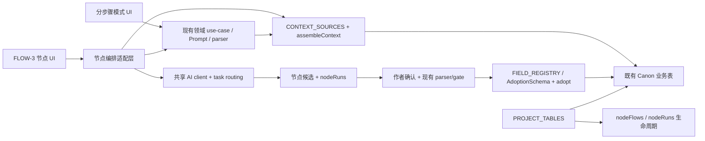

# FLOW-3 · 领域节点创作模式产品与实现方案

> 状态：FLOW-3A/3B/3C 已实现，FLOW-3D 的首个生产闭环已实现（2026-08-05）；官方完整创作链已覆盖世界→故事→角色→卷纲→章纲→细纲→正文，连续性节点与大图工程仍按 FLOW-3D/3E 继续扩展。
>
> 产品定义：分步骤模式与节点模式完成同一套小说创作任务；前者提供固定引导，后者提供
> 可视、自由、可追溯的编排。
>
> 历史边界：`FLOW-1` 是提示词工作流实验，`FLOW-2` 是通用文本 DAG 技术底座；二者均不再
> 代表节点模式的最终产品定义。现有数据和技术证据保留，禁止把历史“完成”结论平移到
> `FLOW-3`。

## 0. 结论先行

`FLOW-3` 不是再造一个小说创作系统，也不是给现有六类通用节点换名字。它要把分步骤模式
已经成熟的世界构建、故事设计、角色、大纲、正文、伏笔、地点、状态、物品、事实与审校能力，
用另一套交互方式呈现出来：

```text
分步骤模式：系统规定模块与顺序，作者逐项填写
节点模式：  作者选择相同能力，自由拆分、连接、组合、运行和写回
```

两种模式必须共享同一份 Canon、同一套 AI 模板与配置、同一套数据生命周期。节点模式只新增
编排表达、运行快照和候选结果，不复制世界观、角色、大纲或正文。

核心架构决定：

1. **继续以三注册表为唯一治理基座。** AI 读取只经 `CONTEXT_SOURCES → assembleContext()`；
   AI 或结构化候选写回只经 `FIELD_REGISTRY / AdoptionSchema → adopt()`；项目级数据生命周期
   只经 `PROJECT_TABLES` 派生。
2. **首版不新增业务表。** 继续使用 `nodeFlows` 保存图，`nodeRuns` 保存冻结输入、输出、错误、
   gate 与采纳证据；图结构升级到 version 2，但数据库 schema 原则上不升版。
3. **节点目录不是第四注册表。** 它只是展示与组合描述层，保存标签、分类、图标、端口和所引用的
   现有注册表键；不得重新声明字段类型、表生命周期或写回规则。
4. **内容节点是领域对象或字段，不只是文本处理器。** 世界来源、河流、行政区域、角色动机、
   卷纲、章节、伏笔等都能成为一等节点。
5. **连线传递有来源的结构化内容。** 每条边都公开来源字段、传递模式、预算、优先级、快照状态
   和下游影响，不能把所有内容无差别拼成一大段 prompt。
6. **AI 输出永远先成为候选。** 只有作者明确确认，且通过既有 parser、gate、CAS/FK 校验和
   `adopt()` 后，结果才进入 Canon。

## 当前实现状态（2026-08-04）

- **FLOW-3A/3B 已交付**：graph v2 合同与旧图迁移、领域节点目录、语义端口、ComfyUI 式画布、
  智能前后置连线、节点级 AI/预算控制、世界/故事候选生成和显式采纳已经接入产品综合页及传统工作区。
- **同源同步基础已交付**：从项目生成的概览图只保存稳定资料键，不复制正文；运行快照保存配置、来源
  evidence 和 source hash；分步骤修改 Canon 后，实时绑定节点及其下游显示需要重跑/来源缺失。
- **采纳冲突保护已交付**：单字段写回在运行时保存目标 hash，采纳前重新读取目标；如果分步骤模式或其它
  入口已经改动目标，则拒绝静默覆盖，要求作者重新运行节点。对应反例见
  `tests/regression/R-FLOW3C-domain-node-sync.test.ts`。
- **FLOW-3C 已交付**：角色档案节点可以在真实浏览器中生成候选、作者确认采纳并进入角色主档；
  角色 23 个维度节点必须绑定稳定资料键，采纳时在写回边界解析当前记录，避免误更新项目中的第一个角色。
  节点检查器支持“运行到此节点”，候选区支持多个原始版本对照。
- **FLOW-3D/3E/3F 已交付**：连续性网络与写后整理、大图效率/模板/断点恢复，以及旧 FLOW-2 兼容收口和
  正式入口统一均已按第 10 节完成；不再把通用六节点 DAG 当作领域节点产品的完成证据。

## 1. 产品定位

### 1.1 与分步骤模式的关系

| 维度 | 分步骤模式 | FLOW-3 节点模式 |
|---|---|---|
| 创作能力 | 世界、故事、角色、大纲、正文与连续性 | 与分步骤模式相同 |
| 数据 | 既有项目 Canon | 同一份项目 Canon |
| 组织方式 | 固定模块、固定页面、系统引导 | 自由节点、自由连线、自由分组 |
| 上下文 | 系统按模块规则装配 | 作者在连线上明确选择和裁剪 |
| AI 参数 | 全局配置与任务级设置 | 全局继承、节点覆盖、控制节点复用 |
| 适用用户 | 新手、线性创作、快速开始 | 复杂世界、长篇、多线、精细推演 |
| 类比 | Stable Diffusion WebUI | ComfyUI |

它们不是上下级，也不是“基础功能与高级插件”的关系。用户可以只使用任意一种，也可以在两种
界面之间切换。同一条世界设定在两个界面中必须指向同一份正式记录。

### 1.2 用户价值

- 看见“哪些设定影响了哪些内容”，不再猜测 AI 为什么得到当前结果。
- 自由决定世界构建的粒度：既可用一个“人文环境”节点，也可拆为政治、经济、宗教、城市、
  行政区域等节点。
- 精确决定上游向下游传递什么，而不是默认发送全部项目资料。
- 对复杂长篇进行分支、汇合、候选比较、批量生成和局部重跑。
- 复用节点级 AI 配置：不同任务使用不同 API 档案、模型、温度、预算和输出规模。
- 在修改上游后看见受影响的下游范围，再由作者决定是否重跑或继续沿用旧结果。

### 1.3 首个正式版本的非目标

- 不做任意 JavaScript/Python 脚本节点和第三方插件执行。
- 不做无限循环、无界 Agent 自主运行或不可预测的自动写回。
- 不复制一套节点专用世界观、角色、大纲、章节数据库。
- 不把“生成成功”等同于“写入项目成功”。
- 不自动把 FLOW-2 的自由文本图猜测成领域图；无法无损判断的旧图保留兼容读取。
- 不因为节点很多就为每个节点写一套独立组件、service、prompt 和数据库入口。

## 2. 信息架构与页面布局

### 2.1 工作区结构

```text
┌─────────────────────────────────────────────────────────────────────┐
│ 图名称 / 世界绑定 / 保存状态 / 撤销重做 / 运行范围 / 成本预估      │
├────────────────┬──────────────────────────────────┬─────────────────┤
│ 节点库          │ 画布                             │ 属性与运行检查器 │
│ 搜索 / 分类     │ 拖拽、连线、框选、分组、缩放     │ 内容 / 输入输出  │
│ 最近 / 收藏     │ 节点状态、脏下游、运行路径       │ AI / 写回 / 历史 │
├────────────────┴──────────────────────────────────┴─────────────────┤
│ 执行记录：实际输入、来源、Token、输出、错误、候选、采纳状态         │
└─────────────────────────────────────────────────────────────────────┘
```

左侧节点库采用 Axure 式分类与搜索；中间保持 ComfyUI 式画布；右侧检查器根据节点类型展示内容、
端口、AI 参数、绑定目标和写回状态。底部执行记录沿用 FLOW-2 的真实输入输出证据，但改为按本次
运行路径和候选版本组织。

### 2.2 节点库分类

节点库以分步骤模式当前模块为母版。下表是首轮完整目录，具体节点可由用户继续复制、改名、
拆分或组合。

#### A. 项目与创作输入

| 分组 | 节点 |
|---|---|
| 项目 | 项目名称、题材标签、项目简介、目标字数、篇幅模式、连载模式 |
| 作者输入 | 自由文本、创作要求、禁写事项、临时设定、参考片段 |
| 参考与灵感 | 项目参考、参考分析、灵感、作者文风、项目内搜索结果 |

#### B. 世界起源、自然与规则

| 分组 | 节点 |
|---|---|
| 世界起源 | 世界来源、力量体系、神明与信仰、世界宪法、真实与幻想规则 |
| 自然环境 | 世界结构、疆域尺寸、地貌分布、山川水系、气候环境、自然资源概述 |
| 自然资源细分 | 珍禽异兽、药材与作物、矿石与金属、其他特产 |
| 地理实体 | 大陆、区域、行政区域、山脉、河流、湖泊、海洋、城市、重要地点、地点层级 |
| 历史 | 世界历史线、历史事件、历史关键词、纪元、因果与影响 |
| 知识词条 | 词条分类、设定词条、词条关系、修炼体系、力量阶段 |

“行政区域”“河流”等细节点不要求新增同名业务表。首版优先落为已有 `codexEntries`、
`importantLocations` 或世界观字段的受治理记录，并通过稳定资料 ID 与分类表达语义；只有现有
模型确实不能承载关系或生命周期时，才单独立项扩展 schema。

#### C. 人文环境

| 分组 | 节点 |
|---|---|
| 人群 | 种族、民族、社会阶层、人口与迁徙 |
| 势力 | 国家、政权、组织、门派、商会、阵营、势力分布、势力关系 |
| 政治 | 政体、行政制度、官制、法律、军事、外交、权力结构 |
| 经济 | 货币、税赋、贸易、产业、资源分配、交通与商路 |
| 文化 | 语言、宗教、教育、礼仪、节庆、艺术、习俗、禁忌 |
| 冲突 | 阶级矛盾、阵营冲突、制度冲突、族群冲突、外部张力 |
| 器物 | 道具体系、武器、法器、工具、科技装备、礼器 |

细分节点采用“领域词条 + 类型模板”的方式承载，不为每一种名词创建一张表或一套执行器。

#### D. 故事设计

| 分组 | 节点 |
|---|---|
| 故事核心 | 一句话故事、故事概念、故事主题、核心冲突、故事模式 |
| 情节方向 | 故事主线、故事复线、开端、发展、转折、高潮、结局方向 |
| 故事线 | 主线、支线、感情线、阵营线、故事线阶段、故事线交汇 |
| 角色驱动 | 初始状态、目标状态、关键阻力、转变节点、角色弧光方案 |

第一阶段只把现有 `storyCores`、`storyArcs` 和角色驱动方案能力映射为节点；开端、高潮等自由
拆分内容可以先作为图内候选或故事线阶段，不凭标题扩张数据库。

#### E. 角色与关系

| 分组 | 节点 |
|---|---|
| 角色主体 | 主要角色、次要角色、NPC、路人、角色档案 |
| 身份 | 一句话简介、身份/职业/势力、年龄/性别/种族、外貌、常驻地点 |
| 性格内核 | 性格、价值观、优点、缺点、恐惧与软肋 |
| 驱动力 | 动机与欲望、短期目标、长期目标、内心冲突 |
| 背景 | 背景故事、关键经历、首次出场 |
| 能力 | 能力与金手指、实力定位、修炼体系、当前阶段 |
| 鲜活细节 | 语言风格、习惯与小动作、标志性物品 |
| 成长与功能 | 角色弧光、故事作用、结局走向 |
| 关系 | 角色关系、关系类型、关系变化、角色知识边界 |

“角色档案”是可折叠的复合节点；23 个角色维度也可作为独立字段节点。用户可以用一个节点
完成轻量 NPC，也可以把主角拆成十几个相连节点。两种粒度最终都写入同一个 `characters`
记录，不产生重复角色副本。

#### F. 大纲、场景与正文

| 分组 | 节点 |
|---|---|
| 结构控制 | 篇幅规划、卷数、每卷章节数、总章节数、叙事节奏 |
| 大纲 | 卷纲、章节节点、章纲摘要、批量卷纲、批量章节 |
| 细纲 | 章节目标、场景、情节拍、视角角色、出场角色、关联伏笔 |
| 正文 | 章节正文、续写、扩写、润色、去 AI 味、重写 |
| 审校 | 内容校验、发展性审校、行文审校、读者视角审校、场景考证、一致性检查 |

卷、章、场景不是普通字符串。批量生成必须输出结构化候选数组，经过现有大纲、章节和细纲
校验后显示差异，作者选择后才写入。

#### G. 连续性与写后产物

| 分组 | 节点 |
|---|---|
| 伏笔 | 伏笔设计、埋设任务、呼应任务、回收任务、逾期检查 |
| 地点与状态 | 重要地点、角色状态、地点状态、势力状态、剧情进度 |
| 物品 | 道具设定、获得、持有、转移、丢失、消耗、当前持有投影 |
| 事实与时间 | 事实候选、已确认事实、故事年表事件、历史事件、影响分析 |
| 连贯性 | 前章结尾、连续性交接、最近摘要、相关前文、计划正文对账 |

写后产物节点默认只生成候选或只读投影。事实、知识、物品、关系、年表和伏笔推进继续遵守
现有二次确认、证据引用、时序与 FK 约束。

#### H. 处理、执行与输出

| 分组 | 节点 |
|---|---|
| 处理 | 字段选择、筛选、摘要、合并、排序、格式化、候选比较、条件分支、冻结快照 |
| AI 执行 | AI 配置档案、Prompt 模板、温度、最大输出 Tokens、上下文预算 |
| 规模控制 | 输出字数、生成数量、卷数、章节数、每卷章节数、候选数量 |
| 运行 | 单节点运行、运行到这里、批量映射、质量 gate、人工确认 |
| 输出 | 保存图内草稿、写入字段、新增记录、更新记录、创建大纲、写入章节正文 |

这些控制节点不是 Canon 内容，只影响连接到它们的生成任务。右侧检查器也可设置同样参数；
连入控制节点时，以控制节点为准，方便一处配置被多个生成节点复用。

## 3. 节点与连线交互

### 3.1 节点卡片

每个节点保持稳定尺寸，信息按以下顺序显示：

1. 分类色条、图标、名称和状态。
2. 绑定对象，例如“世界观 · 山川水系”或“角色：沈砚 · 动机”。
3. 必要的核心内容预览；长内容不撑大画布，展开后在右侧编辑。
4. 左侧输入端口、右侧输出端口；端口显示语义类型而非仅 `text/any`。
5. 运行状态：未配置、可运行、运行中、候选待确认、已采纳、上游已变化、失败。

节点允许折叠、锁定、复制、禁用、添加备注、加入分组和查看影响范围。画布上的悬浮按钮只放
运行、预览、复制等高频图标；完整命令进入右键菜单或检查器。

### 3.2 智能创建与自动连接

用户从端口拉线到空白处松开时，系统执行：

```text
识别方向和端口语义
  → 过滤类型不兼容、会形成非法循环或违反世界作用域的节点
  → 按领域推荐、缺失依赖、最近使用和收藏排序
  → 用户搜索或选择节点
  → 在落点创建节点并自动连接到最匹配端口
```

- 从输出端向后拉：显示兼容的后置内容节点、处理节点、执行节点和输出节点。
- 从输入端向前拉：显示能提供所需类型的前置节点和 Canon 来源节点。
- 多个端口都兼容时，创建后短暂显示端口选择器，不偷偷猜测。
- 无兼容节点时说明原因，例如“该端口需要章节候选，世界设定不能直接写入”。
- 推荐只改善操作，不改变图校验；所有连接最终仍由同一兼容性函数判断。

### 3.3 连线检查器

点击连线后可设置：

- 传递模式：完整内容、指定字段、摘要、列表逐项、冻结快照。
- 字段选择：只显示上游真实输出契约中的字段。
- 上下文预算：Token 上限、截断策略、优先级。
- 缺失策略：阻止运行、传空值、使用上次成功结果。
- 更新策略：实时跟随 Canon、固定到某次运行、手动刷新。
- 标签与说明：例如“角色动机 → 核心冲突的心理来源”。

连接记录必须保存来源 hash 与实际传递证据。预算不足或源被删除时，在运行快照中明确显示
`included / omitted / trimmed`，不能静默换成别的资料。

### 3.4 画布效率

- 节点库搜索同时匹配名称、别名、字段名和用途。
- 支持框选、对齐、等距分布、自动布局、折叠分组、迷你地图、撤销/重做。
- 支持复制选中子图，但复制 Canon 绑定节点时默认仍引用原记录；创建副本必须显式选择。
- 大图按分组和视口虚拟化，节点内容变化不能导致全画布重新布局。
- 提供只读“影响路径”高亮：向前看所有来源，向后看所有受影响节点。
- 首次进入提供从分步骤数据生成的只读概览图和少量正式模板，不以空白画布逼迫新用户。

## 4. 节点语义与数据分层

### 4.1 四类节点

| 类别 | 作用 | 是否直接拥有 Canon |
|---|---|---:|
| 内容节点 | 表示世界字段、词条、角色、卷、章、伏笔等 | 否，只绑定现有 Canon 或保存候选 |
| 处理节点 | 选择、摘要、组合、比较、校验和转换 | 否 |
| 控制节点 | AI 档案、温度、预算、字数、数量等 | 否 |
| 输出节点 | 展示差异并请求作者确认采纳 | 否，确认后调用既有写回入口 |

节点实例不是新的领域记录。一个“河流”节点可以绑定到某条 `codexEntries` 或
`importantLocations`；节点保存的是绑定、位置、端口与草稿状态，河流内容仍以业务表为真相。

### 4.2 五层数据

```text
Canon（既有业务表，唯一真相）
  ↑ 作者确认后 adopt
候选（某次节点运行或作者草稿，可丢弃）
  ↑ AI / 手工 / 处理节点生成
运行快照（冻结输入、配置、hash、输出、错误、成本）
  ↑ executor 记录
节点图（节点、边、绑定、布局、策略）
  ↑ 作者编排
节点目录（代码内展示描述，引用三注册表和现有 Prompt 能力）
```

Canon 与图内候选不能共用一个“content”字段冒充同一状态。UI 必须明确显示“项目当前值”“本次
候选”“上次采纳值”和差异。

### 4.3 稳定绑定

- 能使用现有 `ragDocumentId + fieldKey` 的读取节点一律使用稳定资料键，不保存 Dexie 自增 ID。
- 需要更新具体集合记录时，使用可便携的稳定记录引用；若当前表没有稳定引用能力，先补该表的
  稳定 ID 或在 `PROJECT_TABLES` 增加 JSON 引用与导出重映射支持，再开放该绑定。
- 禁止在 `node.config` 中裸存 `characterId/chapterId/locationId` 后绕过删除和导入生命周期。
- 图属于一个明确的 `projectId + worldGroupId`；跨世界输入必须使用已登记的跨世界语义，不能
  因连线存在就跳过世界隔离。

### 4.4 同步与冲突

内容节点支持三种工作状态：

1. **实时绑定**：运行时读取当前 Canon；适合世界设定、角色和大纲来源。
2. **冻结快照**：固定到一次运行或一次 Canon hash；适合复现、比较和定稿路径。
3. **图内草稿**：尚未进入 Canon 的手工或 AI 候选；适合分支试验。

分步骤模式修改已绑定内容后，节点不保存第二份同步副本，而是通过 source hash 发现变化，显示
“来源已更新”，并把实际受影响的下游标为过期。节点候选写回时使用版本/hash 比较；目标已被
分步骤模式修改则阻止静默覆盖，展示三方差异并让作者重新选择。

## 5. AI、参数与批量执行

### 5.1 配置继承

配置优先级从低到高为：

```text
全局 AI 配置
  < 现有任务路由
  < 节点引用的 AI 配置档案
  < 节点参数
  < 本次运行临时覆盖
```

节点只保存 `presetId` 和非敏感覆盖项，不保存 API Key。配置档案不存在、未配置密钥或导入到
另一台电脑后无法解析时，运行前阻止并要求重新选择；不得把密钥写进图、运行记录或项目导出。

### 5.2 控制节点

首版控制节点至少包括：

- AI 配置档案：provider、Base URL、模型由现有预设提供。
- 温度：按 provider 支持范围复用共享客户端归一规则。
- 最大输出 Tokens 与期望字数：两者分开显示，系统提供估算但不宣称精确相等。
- 上下文预算：总预算和各入边预算。
- 生成数量：产生多个候选，不自动选“最好”的一个。
- 卷数、总章节数、每卷章节数：只连接到支持对应参数的结构生成节点。
- Prompt 模板：引用现有 `PromptModuleKey` 和模板版本，允许本次临时补充说明。
- 质量 gate：确定性 schema/FK/空值/长度检查优先，AI 审校必须显式运行。

### 5.3 执行方式

- 运行当前节点：执行其祖先闭包中的过期或未运行节点。
- 运行到这里：显示预计调用次数、模型档案、输入预算和最大输出预算后确认。
- 运行选中子图：只允许闭合依赖的有向无环子图。
- 运行全部：大图先显示调用计划，批量节点展开真实调用数量。
- 批量映射：对角色列表、卷列表或章节列表逐项执行，必须有硬上限、取消和断点恢复。
- 候选比较：并排显示不同模型/温度/Prompt 的输出与成本，不自动写入项目。

首版继续禁止图循环。需要“每章执行一次”时使用有界批量映射节点，不开放任意循环。

### 5.4 输入与输出契约

端口类型从当前粗粒度 `text/context/candidate/any` 升级为带语义的契约，例如：

```text
world.setting
world.location
story.theme
story.conflict
character.profile
character.list
outline.volume.list
outline.chapter.list
chapter.plan
chapter.prose
continuity.foreshadow
control.ai-profile
control.temperature
control.count
```

契约允许声明兼容转换，例如单个角色可提升为角色列表，世界设定可作为章节生成的上下文；但
“正文”不能自动当成“角色 JSON”，“温度”不能接入“章节正文”。所有隐式转换都必须集中定义、
可测试、可在连线检查器中看见。

## 6. 三注册表与复用架构

### 6.1 唯一数据路径



### 6.2 三注册表在节点模式中的职责

| 问题 | 唯一答案 | FLOW-3 使用方式 |
|---|---|---|
| 节点能读什么 | `CONTEXT_SOURCES` | 节点描述只引用 `sourceKeys`；运行统一调用 `assembleContext()` |
| 节点能写什么 | `FIELD_REGISTRY` + `AdoptionSchema` | 输出契约引用 target/field；确认后统一调用 `adopt()` |
| 表如何导入导出、删除、迁移和重映射 | `PROJECT_TABLES` | 继续管理 Canon、`nodeFlows`、`nodeRuns` 和图内稳定引用 |

节点模式不得直接调用 Dexie 拼上下文，不得从 store 抓全量资料，不得在 executor 中用大段
`if (node.kind)` 分别散写业务表。

### 6.3 节点目录为何不是冗余注册表

实现中需要一份节点目录供左侧节点库和智能连接使用，但它只保存以下展示与组合信息：

```text
稳定 templateId
分类、名称、说明、图标
输入/输出端口语义
引用的 CONTEXT_SOURCES key
引用的 FIELD_REGISTRY target/field 或 AdoptionSchema target
引用的 PromptModuleKey / 既有 use-case
支持的参数与推荐前后置节点
```

它不保存字段类型、数据表、世界作用域、删除策略、Prompt 正文或 API 密钥。能够从
`FIELD_REGISTRY`、`CHARACTER_DIMENSIONS`、Prompt manifest 等现有描述符生成的节点项应直接
派生，只有分类和推荐关系保留手写元数据。

新增架构检查器必须验证：

- 所有 `reads` 都存在于 `CONTEXT_SOURCES`。
- 所有字段写入都存在于 `FIELD_REGISTRY`。
- 所有集合写入都存在于 `AdoptionSchema` 或有未过期的受控 `AdoptionExtension`。
- 所有 target 都存在于 `PROJECT_TABLES`。
- 所有 Prompt 引用都是合法 `PromptModuleKey`，并遵守 AI Manual。
- 节点目录中的稳定 ID、端口 ID 和兼容规则无重复、无悬空。

因此它是三注册表的“可视化菜单和接线说明”，不是新的数据权威。

### 6.4 复用与禁止复制

| 能力 | 必须复用 | 禁止做法 |
|---|---|---|
| 世界/故事字段 | 现有 store use-case、字段注册与 adapter | 再建 nodeWorldviews/nodeStories |
| 角色维度 | `CHARACTER_DIMENSIONS` + 角色 parser/adopt | 节点内维护第二份 23 维列表 |
| 大纲/章节 | 现有 outline/chapter parser、workshop、adopt | 节点 executor 直接 `db.outlineNodes.add()` |
| 上下文 | `assembleContext()`、RAG 稳定字段键 | 组件拼字符串或全表读取 |
| AI 配置 | AI presets、task routing、共享 client | 图内保存 key 或复制 provider client |
| Prompt | `PromptModuleKey`、模板引擎、版本 | 每个节点硬编码一份 system prompt |
| 候选与质量 | `GenerationNode`/现有 parser/gate 的能力 | 生成即写入、用 try/catch 冒充校验 |
| 生命周期 | `PROJECT_TABLES` 派生导入导出与删除 | 手写 node 表清单和孤立迁移 |

## 7. 图模型与执行模型

### 7.1 Graph version 2

version 2 在现有 `NodeFlow.graphJson` 中增加：

- 节点稳定模板 ID、节点类别和 schema 版本。
- 多输出端口及端口语义契约。
- Canon 稳定绑定、草稿状态和来源 hash。
- 连线字段映射、传递模式、预算、优先级和快照策略。
- AI 配置档案引用、Prompt 引用和非敏感参数覆盖。
- 分组、折叠、锁定、备注和画布辅助信息。
- 最近成功运行签名，用于判断节点及下游是否过期。

图 JSON 只保存编排信息和必要草稿，不保存完整 Canon 镜像。大体积输入输出继续放在
`nodeRuns`，避免每次拖动节点都重写历史结果。

### 7.2 通用执行适配层

不为几十个领域节点编写几十套 runner，而是收口为少数执行能力：

1. `read-canon`：按稳定绑定和 `CONTEXT_SOURCES` 读取。
2. `manual-draft`：保存作者图内草稿。
3. `generate-field`：复用字段生成 adapter 和 Prompt 模板。
4. `generate-collection`：生成并解析角色、大纲、伏笔等结构候选。
5. `transform`：选择、摘要、合并、比较与格式化。
6. `validate`：schema、FK、字数、必含/禁用和一致性 gate。
7. `adopt`：展示差异并经统一写回边界采纳。

具体节点通过声明引用这些能力。特殊领域规则只能进入已有 use-case 或带理由、复审日期的受控
扩展，不能继续扩充 executor 的业务分支。

### 7.3 单次运行流程

```text
验证图与世界作用域
  → 计算目标节点祖先闭包
  → 解析 AI 档案与参数继承
  → 通过 assembleContext 读取 Canon
  → 按边的字段选择、优先级和预算形成输入 envelope
  → 冻结来源 ID、hash、实际文本和 token
  → 调用现有 use-case / Prompt / shared AI client
  → 解析为带类型候选
  → 运行确定性 gate
  → 保存 nodeRuns
  → 作者查看、编辑、比较或确认采纳
  → adopt 写回并刷新绑定节点
```

### 7.4 过期传播

每个成功节点保存运行签名：

```text
节点配置 hash
上游输出 hash
Canon 来源 hash
Prompt 模板版本
AI 档案 ID 与非敏感模型参数
执行器版本
```

任何一项变化时，当前节点标记为“需要重跑”，并沿有向边向下传播。系统只标记，不自动消耗
Token。作者可以查看影响范围、忽略一次、冻结旧结果或重跑选定路径。

## 8. 分步骤同步、旧图兼容与数据安全

### 8.1 与分步骤模式同步

- “从当前项目生成节点概览”只创建绑定节点和连线，不复制字段正文。
- 分步骤模式保存后，实时绑定节点立即读取新值，相关下游显示过期。
- 节点模式采纳后，分步骤页面从同一业务表读取新值，无额外同步任务。
- 图内草稿在未采纳前不出现在分步骤模式，也不冒充 Canon 上下文。
- 删除图不会删除绑定的世界设定、角色、大纲或章节；删除 Canon 记录则按绑定策略把节点标为
  来源缺失或解除绑定，不静默改绑同名记录。

### 8.2 FLOW-2 兼容

- parser 同时支持 graph version 1 和 version 2。
- 既有 FLOW-2 图进入“旧节点图兼容模式”，仍可查看和运行原有六类节点。
- 用户可以复制旧图并逐节点转换；原图和历史 `nodeRuns` 保持不变。
- 只有能确定语义的节点可自动转换，例如精确资料来源、手工文本和纯预览输出。
- 自由创作节点不能根据标题猜成世界、角色或章节节点；无法确定时保持通用处理节点。
- FLOW-3 主路径稳定并完成真实数据往返前，不删除 FLOW-2 parser 和旧运行记录。

### 8.3 失败与回滚

- 运行失败只写运行记录，不触碰 Canon。
- 批量采纳必须在既有事务边界内完成；任一必需 FK/schema 检查失败则整体回滚或按现有
  AdoptionSchema 明确报告逐条跳过，不能出现 UI 显示成功但只写了一半。
- 写回前保存目标 hash；目标变化时阻止覆盖并提供重新比较。
- 图格式升级使用纯函数迁移，原 JSON 保留到成功保存 version 2 后；迁移失败时继续只读旧图。

## 9. 实现目录与代码边界

建议新增 `src/lib/node-authoring/`，逐步取代当前 `src/lib/node-flow/` 的产品语义，但保留兼容层：

```text
src/lib/node-authoring/
  contracts.ts          # 图 v2、端口、输入 envelope、候选和运行签名
  catalog.ts            # 展示描述；引用三注册表，不拥有业务真相
  catalog-builders.ts   # 从字段、角色维度、Prompt manifest 派生节点项
  compatibility.ts      # 唯一端口兼容与推荐排序
  graph.ts              # DAG、祖先闭包、脏下游、迁移
  bindings.ts           # 稳定 Canon 引用解析，不直接拼上下文
  executor.ts           # 编排少数通用执行能力
  adoption.ts           # 统一候选差异与 adopt 边界
  legacy-flow2.ts       # graph v1 兼容，不扩张新功能

src/components/node-authoring/
  NodeAuthoringWorkspace.tsx
  NodeLibrary.tsx
  NodeCanvas.tsx
  NodeCard.tsx
  NodeInspector.tsx
  EdgeInspector.tsx
  SmartConnectionMenu.tsx
  RunPlanPanel.tsx
  CandidateDiffPanel.tsx
```

约束：

- 领域节点不按“一个节点一个组件”扩张；同类内容使用 schema 驱动的通用节点卡和检查器。
- `catalog.ts` 不允许包含查询或写入函数。
- `executor.ts` 不直接访问具体业务表；读取、生成、解析、写回分别走共享边界。
- React 组件不直接读写 Dexie。
- 旧 `node-flow` 在 FLOW-3 完成前只接受兼容修复，不继续堆新领域逻辑。
- 新入口稳定后，`WorkspacePage` 只指向 FLOW-3；旧图由兼容层在同一入口打开，不保留两个
  并列“节点模式”。

## 10. 分功能施工计划

每个开发单位都必须形成可验收的垂直功能，不按“先把所有组件写完、以后再接数据”的方式施工。
半成品默认隐藏在 Labs/feature flag 下。

### FLOW-3A · 合同、迁移与架构守卫

目标：建立 graph v2、语义端口、稳定绑定和三注册表交叉校验，并为 FLOW-3B 接入新的领域节点入口；
旧 FLOW-2 图通过同一存储边界兼容迁移。

交付：

- graph v1/v2 双 parser、纯函数迁移和反例夹具。
- 节点目录描述接口与派生 builder。
- 语义端口兼容矩阵、单一 `canConnect()` 和智能推荐查询。
- 稳定 Canon 引用方案；裸数字 ID 架构检查。
- 节点目录对三注册表、Prompt key 和 PROJECT_TABLES 的 CI 守卫。
- 现有 `nodeFlows/nodeRuns` JSON 往返、世界删除、项目删除和旧图运行保持通过。

完成边界：没有可见空壳 UI；所有合同与迁移先有正反例测试。

当前状态（2026-08-04）：已完成。`NodeAuthoringWorkspace` 已接入产品综合页和传统工作区，
FLOW-2 旧图仍可由 `parseAuthoringGraph()` 迁移为 version=2。

### FLOW-3B · 世界与故事设计垂直闭环

当前施工状态：已完成（2026-08-04）。首个可运行闭环与同源同步基础已经落地；角色、大纲、正文深度
闭环转入 FLOW-3C。

目标：证明节点模式能完成与分步骤模式相同的世界构建任务。

交付：

- 新工作区壳、分类节点库、通用内容节点、检查器和智能前后置创建。
- 世界来源、自然环境、人文环境、规则、词条、故事核心第一批领域节点。
- 从当前世界生成绑定概览图；分步骤改动触发 source hash 更新和下游过期。
- 手工草稿、AI 字段生成、差异预览、确认写回完整闭环。
- AI 档案、温度、字数、Tokens、候选数量和上下文预算控制节点。

完成边界：隔离项目中完成“河流/行政区域 → 人文与地理约束 → 故事主题/核心冲突 → 确认
写回”，分步骤页面立即显示同一结果；删除图不伤 Canon；来源变更和目标冲突均有反例测试。

### FLOW-3C · 角色、大纲与正文垂直闭环

当前施工状态：已完成（2026-08-05）。角色复合节点、卷纲/章纲、细纲和正文节点已接入既有 parser、
scope、gate、CAS 与正式采纳；官方“完整创作链”把世界、故事、角色、卷纲、章纲、细纲、正文和
有界执行控制放在同一张可编辑起始图中。节点级多候选对照、逐行差异摘要和细纲多候选均已接入。
2026-08-16 的 CREL 交付审计进一步收口了规划到正文的直接调用旁路：卷纲/章纲和正文复用统一的
一次生成＋最多一次定向修复，细纲保留单次生成；每个版本的产物状态、问题、调用/token/耗时和修复证据
随 `nodeRuns` 保存。阻断候选保留原稿并停止下游，作者编辑后经同一领域 parser 本地复验和采纳，
即可从下一节点继续，不会为已经采纳的上游再次付费。

开工登记卡：

- 用户故事：作者可从空白或已有世界创建一张官方起始图，沿上游到下游逐步运行、编辑、拒绝或确认候选，最终得到正式正文。
- 读取：节点目录声明的既有 `CONTEXT_SOURCES`，统一经 `assembleContext()`；图只保存稳定绑定、参数和运行证据。
- 写回：继续复用 `FIELD_REGISTRY / AdoptionSchema → adopt()` 以及角色、大纲、细纲、正文既有领域采纳器。
- 生命周期：不新增表；`nodeFlows/nodeRuns` 和 `worldviews/storyCores/characters/outlineNodes/detailedOutlines/chapters` 均已由 `PROJECT_TABLES` 治理。
- 非范围：连续性网络归 FLOW-3D，大图/模板/恢复归 FLOW-3E，旧图正式发布收口归 FLOW-3F。

目标：从世界和故事节点一路生成到可编辑正文。

交付：

- 角色复合节点与 23 个维度节点、关系节点。
- 卷纲、章节、细纲、场景、情感节拍和章节正文节点。
- 卷数、章节数、每卷章节数、生成数量等有界批量控制。
- 复用角色、大纲、细纲和正文 parser/workshop/gate。
- 多候选比较、批量差异预览、作者选择和原子写回。

当前实现证据：`src/lib/node-authoring/domain-execution.ts` 只负责领域分派；角色复用
`character-copilot` 的结构化候选与 roster 快照，大纲复用 `outline-copilot` 的父卷作用域/标题重复
保护，细纲复用 `adoptChapterOutlineWorkshopResult` 的场景与 FK 过滤，正文复用 `prose-copilot` 的
目标章节选择、空白章保护、CAS 和检索块重建。`R-FLOW3C-domain-specialized-execution` 覆盖四类节点的
候选解析与采纳。`buildAuthoringCreationChainGraph()` 只根据节点目录构造起始图，不复制 Canon；
`R-FLOW3C-creation-chain` 覆盖图合同和候选差异，`R-FLOW3C-domain-specialized-execution` 真实沿同一张图
逐步采纳世界、故事、角色、大纲、细纲和正文，并覆盖 CREL 1+1、失败原稿保留、无调用人工修复、
版本化回滚和已完成上游复用；Chromium E2E 覆盖创建、关键节点可见和刷新恢复。

完成边界：从已有或空白世界出发，生成角色 → 卷纲 → 章纲 → 章节正文；每一步输入可见，
任一步拒绝均不污染 Canon，不同节点可使用不同 AI 配置档案。

### FLOW-3D · 连续性网络与写后整理

目标：让节点图不仅生成正文，还能表达长篇创作的状态与影响关系。

开工登记卡：读取继续声明既有 `CONTEXT_SOURCES` 并经 `assembleContext()` 装配；写回继续使用六域
整理 parser 和既有 `FIELD_REGISTRY / AdoptionSchema → adopt()`，不新增 AI 写字段；故事线、伏笔、地点、
状态、物品、事实、知识和时间线沿用已登记表及 `nodeFlows/nodeRuns` 生命周期；连续性候选过期保护和作者
确认是本阶段范围，自动改稿和第二套事实账本不在范围内。

交付：

- 故事线、伏笔、地点、状态、物品、事实、知识和时间线节点。
- 章节正文连接“整理本章”六域候选，继续保留证据和二次确认。
- 前章结尾、handoff、最近摘要、相关前文和一致性报告只读节点。
- Canon 改动、删除、角色合并和章节重排后的绑定/过期处理。

完成边界：写后候选、Canon 和运行快照三层清晰；删除/合并/重排反例无悬空引用或静默改稿。

当前交付证据：`chapter.organize` 通过 `assembleContext()` 读取章节和连续性资料，复用既有整理本章
parser 生成状态、事实、物品、年表、角色关系和伏笔六域候选；作者确认后分别调用状态卡、事实账本、
物品流水、故事年表、关系和伏笔既有采纳器。候选冻结正文 hash，正文变化会阻止过期写回；目录同时提供
故事线、地点、状态、物品、事实、角色认知、年表和前章结尾、handoff、最近摘要、相关前文、一致性报告
只读节点。回归证据：`R-FLOW3D-continuity-network`。

### FLOW-3E · 大图效率、模板与可恢复执行

目标：把技术可用提升为复杂项目可长期使用。

开工登记卡：本阶段不增加上下文源或 AI 写字段，执行计划只复用现有节点声明、共享 AI 客户端和
`CONTEXT_SOURCES → assembleContext()`；图和运行证据继续写入已登记的 `nodeFlows/nodeRuns`，由
`PROJECT_TABLES` 负责导出、导入、删除和快照脱敏；模板、布局、断点恢复和脏下游重跑属于编排体验，
不建立第二套执行记录或旁路密钥存储。

交付：

- 分组、自动布局、迷你地图、框选、对齐、复制子图、收藏和最近节点。
- 官方模板：基础世界构建、长篇小说、短篇小说、角色驱动、多线叙事、章节续写与审校。
- 有界批量映射、暂停/取消/断点恢复、调用计划和成本预估。
- 节点/连线版本差异、运行签名和脏下游批量重跑。
- 大图渲染性能与键盘可访问性。

完成边界：百节点画布仍可流畅编辑；刷新可恢复执行证据；模板创建的图没有隐藏上下文或写回。

当前交付证据（2026-08-05）：空状态可直接创建六个官方模板，画布提供自动布局、迷你地图、框选、
子图复制、对齐、分组、收藏和最近节点；执行计划冻结拓扑、模型调用数与最大输出预算，支持暂停、取消、
同一 `nodeRuns` 断点恢复和过期下游批量重跑。运行记录保存图快照和来源证据，节点图/运行快照的嵌套 JSON
在保存与导出边界脱敏，不携带 API Key。回归证据为 `R-FLOW3E-productivity`（模板合同、百节点布局、
子图操作、断点恢复、执行计划与导入导出往返），完整 CI/E2E 作为发布闸门。

### FLOW-3F · 兼容收口与正式发布

目标：替换当前节点入口，同时保护现有用户图和项目数据。

开工登记卡：兼容读取只消费既有图合同和 `CONTEXT_SOURCES` 声明，不新增 AI 读取路径；转换保存不新增
Canon 写字段，正式写回仍经现有 `FIELD_REGISTRY / AdoptionSchema → adopt()`；旧图、graph v2、
`nodeFlows/nodeRuns` 继续由 `PROJECT_TABLES` 派生备份、导入、删除和引用重映射；未知节点拒绝执行、
显式转换和旧入口下线是本阶段范围，自动猜测未知节点语义不在范围内。

交付：

- FLOW-2 旧图兼容入口、复制转换、无法转换项说明。
- 旧入口下线，FLOW-3 成为唯一“节点模式”入口。
- 项目备份往返、世界/项目删除、跨电脑导入与稳定引用验证。
- 完整功能说明、示例图、空态模板和升级说明。
- 生产构建、完整 CI、E2E 和隔离浏览器真实主路径验证。

当前交付证据（2026-08-05）：旧 FLOW-2 图通过 `parseAuthoringGraph()` 在同一节点入口兼容读取，作者可在
提示条中显式“转换并保存”为 graph v2；未知节点类型 fail-closed 并保留原图。项目备份仍按 `PROJECT_TABLES`
派生导出/导入，旧图跨项目往返后可再次解析；产品侧不再挂载旧 `NodeModeWorkspace` 入口。回归证据为
`R-FLOW3F-compat-release`、既有 `R-FLOW3A-domain-node-contract` 和完整发布 CI/E2E。

## 11. 测试与验收矩阵

### 11.1 架构与合同

- 节点目录所有读、写、表、Prompt 引用均能解析到现有单一事实源。
- 删除任一注册项时，引用它的节点描述测试必须失败。
- 组件和 executor 不出现未登记的 AI/DB 旁路。
- 端口兼容矩阵正反例、循环、跨世界和缺失必需输入全部阻断。

### 11.2 数据生命周期

- graph v1 → v2、v1 原样读取、失败迁移不覆盖原图。
- 项目导出 → 新项目导入后，稳定绑定仍指向同一语义记录。
- 删除项目、世界、角色、章节、地点和词条后无孤儿运行或错误改绑。
- 删除节点图只删除其运行记录，不删除 Canon。
- 批量采纳中途失败不留下未报告的半写状态。

### 11.3 AI 与 Token

- 不同节点正确选择各自 AI preset，图和导出中无 API Key。
- 温度、maxTokens、contextWindow 和 provider 限制走共享 client。
- 多入边预算、裁剪、遗漏、RAG 召回和实际 token 快照可见。
- 生成数量、卷数和章节数有硬上限，取消后不再发起新请求。
- 上游没变时不重复运行；上游变化时只标记真实下游过期。

### 11.4 UI / E2E

- 从节点库拖入、双击搜索创建、正向拉线创建、反向拉线创建均可完成。
- 键盘可完成搜索、创建、连接、运行和查看错误。
- 小屏不追求完整画布编辑，但必须能查看图、运行状态和候选；桌面主路径无重叠。
- 世界 → 故事 → 角色 → 卷 → 章 → 正文 → 整理候选 → 确认写回全链路。
- 分步骤修改 → 节点显示来源变化 → 局部重跑 → 分步骤读取采纳结果。

代码提交前仍执行项目统一闸门：定向测试、三项架构检查、TypeScript、build、`npm run ci`；
适用时执行 `npm run ci:e2e` 和隔离浏览器真实验证。

## 12. 性能与规模边界

- 画布只渲染视口及缓冲区节点；节点详情按需加载。
- Canon 内容不复制进每个节点，画布只取摘要；全文在检查器或运行时读取。
- 自动保存对 graph patch 去抖并串行化，不能因拖动产生并发覆盖。
- 批量生成默认串行或小并发，遵守 provider 限流；请求数量在运行前公开。
- 运行记录按图和时间分页；清理历史运行需单独确认，不影响最近采纳证据。
- 大输入优先使用精确字段、层级摘要和相关前文，不因节点连线多就把所有上游全文重复注入。

## 13. 风险与控制

| 风险 | 控制 |
|---|---|
| 节点数量多导致代码膨胀 | schema 驱动目录 + 少数通用执行适配器，不按节点复制组件/service |
| 节点图复制 Canon | 只保存稳定绑定、草稿和运行证据，正式内容仍在业务表 |
| 连线后 Token 暴涨 | 字段选择、边预算、总预算、去重和真实调用计划 |
| 不同 API 配置泄露密钥 | 图只存 presetId，密钥继续由现有本地配置层管理 |
| 分步骤与节点互相覆盖 | source hash、候选差异、CAS/版本冲突阻断、显式采纳 |
| 图内数字 ID 导入后失效 | 稳定资料 ID 或 PROJECT_TABLES 显式 JSON 重映射，禁止裸 ID |
| 批量生成失控 | 有界数量、调用预览、取消、断点恢复、候选不自动写回 |
| 为赶进度保留两套入口 | FLOW-3 完成后同一入口兼容 v1/v2，旧产品入口同步下线 |

## 14. 最终完成判据

`FLOW-3` 只有同时满足以下条件才可标记完成：

1. 用户能从空白图或现有世界开始，用领域节点构建世界、故事、角色、大纲并生成正文。
2. 世界观、人文、地理、故事、角色等节点可自由拆分，前后置智能创建真正可用。
3. 每条连线传递什么、实际读取什么、裁剪什么、消耗多少 Token 全部可见。
4. 不同生成节点可引用不同 AI 配置档案和参数，项目导出不含密钥。
5. 分步骤与节点模式操作同一份 Canon，双向切换无需复制或手工同步。
6. 所有读取、写回和表生命周期均由三注册表治理，没有新增平行 AI/DB 入口。
7. 上游变化、删除、导入、跨世界、批量失败和旧图兼容均有反例测试。
8. FLOW-2 旧图可读取和导出，FLOW-3 成为唯一节点模式主入口。
9. 完整 CI、E2E 和隔离项目“世界 → 正文 → 写后整理”真实主路径通过。

满足这些条件后，节点模式才是分步骤模式真正的“ComfyUI 形态”，而不再只是一个通用文本
流程编辑器。
