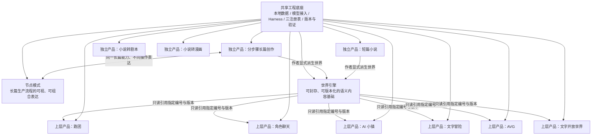
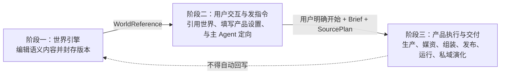

# StoryForge 项目总纲

> 文档版本：1.2.0 
> 生效日期：2026-08-27 
> 状态：现行、最高产品总纲 
> 适用范围：StoryForge 主干、所有开发分支、工作树、产品设计、数据设计、Agent/Harness、测试、文档与未来平台建设

## 1. 文档目的与权威

本总纲用于回答 StoryForge 长期不应反复改变的根本问题：项目是什么、由哪些彼此独立或共享基础的产品组成、数据怎样流动、Agent 怎样参与生产与运行、哪些边界不得跨越，以及开发工作应按什么顺序推进。

本总纲不是阶段施工记录，也不是某一功能的详细设计。它是所有详细架构、产品方案、路线图和开发任务的上位依据。任何分支都不得仅因局部实现方便而改变这里确立的产品关系与数据边界。

### 1.1 规范用语

- “必须”“不得”表示不可绕过的项目约束。
- “应”表示默认必须遵循，只有形成书面理由、影响分析和复审条件后才可例外。
- “可”表示允许选择，不表示已经实现。
- 本文描述的是目标产品边界。当前代码与本文不一致时，应登记为待纠偏项，不得反向用旧代码改写总纲。

### 1.2 文档裁决顺序

发生冲突时，按以下顺序裁决：

1. 本项目总纲。
2. 现行产品地图、能力基线与路线图。
3. 项目开发宪法以及架构、数据、Harness、质量和发布规范。
4. 三个核心注册表及其代码契约：`CONTEXT_SOURCES`、`FIELD_REGISTRY`、`PROJECT_TABLES`。
5. 各独立产品的详细设计、数据契约、Agent/Skill/Run Contract 和测试规范。
6. 当前施工计划、任务卡和历史决策记录。

历史蓝图、旧路线图、完成报告和过时设计只能作为溯源材料，不再具有现行设计权威。

## 2. 项目定位

StoryForge 是面向叙事创作与叙事体验的 AI 原生生产系统。它不是单一小说编辑器，也不是把所有能力塞进“世界引擎”的一个巨大功能；它由多项可独立成立的创作产品、一个可被上层产品引用的世界引擎，以及一套共享工程底座构成。

项目的长期目标是让用户能够：

- 完成从设定、故事、角色、大纲、细纲到百万字级正文的长篇创作；
- 以更轻量的方式完成短篇小说；
- 将已有小说转换为剧本或完整漫画产品；
- 创建、封存、分享和复用具有稳定编号与版本的世界引擎；
- 在某个世界引擎基础上生成并运行跑团、角色聊天、AI 小镇和多类文字游戏；
- 让每种产品都能在用户定向后由主 Agent 自主规划、生产、组装、检查、修复并交付，而不是要求用户逐个管理内部生产步骤。

当前阶段优先完善真实可用的功能和工程质量。网站、账户、社区、市场、平台与商业化属于核心产品能力稳定后的后续阶段，不能反向挤占当前功能完整性建设。

## 3. 产品全景与关系

这张图表达三项不可混淆的关系：

1. 分步骤长篇、短篇、小说转剧本、小说转漫画都是可以独立使用和独立验收的产品。
2. 节点模式不是第二套长篇系统，而是同一套长篇生产能力的可视化、可拆装操作方式。
3. 世界引擎是上层衍生产品的只读内容来源，不是全部创作产品的父模块，也不接收上层产品运行数据的自动回写。
4. 长篇和短篇保持独立 owner，同时允许作者把已确认内容显式、一键派生为世界草稿或封存版本；小说转剧本、小说转漫画当前不提供该派生路径。

## 4. 独立创作产品

### 4.1 分步骤长篇创作

分步骤长篇创作是当前用户正在使用的核心产品，必须保持完整、独立和可单独运行。它不以世界引擎为前置条件，也不得通过隐藏依赖把自己的数据读写、记忆或生成过程迁入世界引擎。

它覆盖完整长篇生产体系：

- 项目与创作目标；
- 世界观及其分层设定；
- 故事核心、主题、冲突与叙事设计；
- 角色、关系、物品、地点、组织等实体；
- 主线、支线及其持续演化；
- 大纲、卷章结构、细纲与场景规划；
- 正文生成、扩写、重写、润色、采纳、版本与人工编辑；
- 事实、伏笔、状态、关系、时间线、叙事承诺和长程记忆；
- 候选生成、刷新恢复、过期阻断、采纳后下游生效和可追溯运行证据。

此前 Harness 重构的首要服务对象就是这条分步骤长篇流程。长篇是否真正完成，不以“按钮可以请求模型”为准，而以完整数据闭环、长程一致性、可恢复性、可验证性和真实创作结果为准。

长篇体系的目标上限是支持百万字级创作。上下文窗口大小不是实现该目标的充分条件；系统必须通过结构化事实、原文留存、按需检索、渐进式披露、事件与版本记录，使晚出现和低频但关键的信息仍有机会被准确召回。

现行 Phase 5 工程基线已经完成世界观、故事、角色、主支线、大纲、细纲、正文、章后/未来演化、长程记忆、真实 API 纵切面和 10万/30万/100万字符工程规模门。长期作者项目与文学一致性继续作为质量研究，不得因此把已经完成的分步骤主链重新列为待开发功能。

### 4.2 节点模式

节点模式与分步骤模式的关系，类似 ComfyUI 与一个封装好的 Stable Diffusion 工作流：分步骤模式提供经过设计的标准操作路径，节点模式把同一生产过程公开为可查看、可填写、可连接、可复用的节点图。节点模式是操作表达上的超集，可以比标准步骤更细、更自由、更可调，但不是领域能力、Canon 或 Harness 上的第二套系统。

节点模式必须遵守以下约束：

- 节点对应真实的长篇能力、数据源、动作或产物，不得只是视觉占位符。
- 分步骤模式与节点模式共用同一数据契约、Skill、Agent/Harness、上下文来源、采纳入口和三注册表。
- 一个模式产生的受治理数据，另一个模式能够按同一版本与作用域读取。
- 不得复制第二套 AI 调用、数据库写入、导入导出、迁移或记忆体系。
- 节点图必须具有类型、作用域、依赖、输入、输出、版本和运行证据；非法连接应在执行前被阻断。
- 标准分步骤流程应能够表达为官方节点模板；用户可在不破坏数据治理的前提下拆分、替换、组合和保存自己的工作流。

### 4.3 短篇小说

短篇小说是从长篇创作能力中提炼出的独立轻量产品。它可以复用共享的模型接入、创作 Skill、候选采纳和质量验证，但不得只是长篇页面的一个开关。

短篇与长篇的主要区别是规模、规划粒度和记忆复杂度，而不是放弃结构和质量。短篇仍应有明确的创作意图、结构规划、正文生产、版本与修改闭环，只是不需要默认承担百万字级持续状态管理。

短篇和长篇一样可由作者显式派生为世界草稿或封存版本。派生保存来源作品、revision、选取范围和 content hash，不改变短篇 owner，也不让后续修改自动同步到已封存世界。

### 4.4 小说转剧本

小说转剧本是一条独立的端到端 Agent 生产流程，不是格式替换工具。它需要将源小说解析为可追踪的叙事事实、场景、人物、动作与对白，再根据目标剧本类型完成结构改编、场次设计、节奏重构、格式化、审校与交付。

详细设计必须单独定义其输入契约、改编策略、场景与角色连续性、源文证据、删改说明、剧本格式、验证器和人工复审点。项目既有实践与数据在该产品开工时作为专门输入审查，不能仅凭通用提示词代替流程设计。

### 4.5 小说转漫画

小说转漫画是独立的完整 Agent 产品，至少包含：

1. 小说理解与可追踪事实提取；
2. 从小说到漫画脚本的改编；
3. 页、格、镜头、节奏、对白与视觉表现设计；
4. 角色、服装、场景、道具和风格资产生产；
5. 人物一致性、表情、动作、构图与镜头连续性控制；
6. 对话框、拟声、文字强调、错位排版、夸张或变形等漫画语言；
7. 生图、选图、修复、排版、审校和成品导出。

它可以复用共享媒资生产设施，但必须拥有自己的漫画语义、产品表、生产状态、验证规则和组装流程。世界引擎不预先为它生产或保存漫画媒资。

## 5. 世界引擎

### 5.1 定义

世界引擎是一个可编辑、可确认、可封存、可版本化、可被引用的叙事语义内容包。它像一部可供继续创作和推演的“书”或“世界档案”，内容丰度由创建者决定，而不是要求所有字段都填满。

世界引擎可以只包含世界观，也可以逐步包含：

- 基础世界设定；
- 故事、主题、冲突与叙事规则；
- 角色、关系、物品、地点和组织；
- 主线、支线及阶段性状态；
- 大纲、细纲、章节和场景；
- 小说正文以及由正文确认的事实与事件。

完整度是一种可声明、可检测的能力画像，不是二元的“完整/不完整”。上层产品读取世界引擎时必须知道所引用版本实际提供了哪些能力，并对缺失内容给出补充设计方案或明确限制。

### 5.2 编号、版本与封存

- 每个可共享世界引擎必须有稳定的唯一编号。
- 每次对外可引用的封存结果必须有不可变版本标识。
- 修改中的草稿与已封存版本必须区分；修改草稿不得静默改变已存在的上层产品。
- 上层产品必须记录所引用的世界编号、版本和完整度画像，从而可重复构建与追溯。
- 未来的复制、分享和社区引用建立在版本化快照上，而不是直接共享可变的浏览器记录。
- 世界可以从空白创建，也可以由作者从已有长篇或短篇的已确认语义内容一键派生；系统自动完成选取、投影和快照，用户不需要复制粘贴。
- 派生关系必须保留来源作品、来源 revision、范围和 hash；原作品继续独立，世界草稿/版本与原作品后续修改互不自动覆盖。
- 小说转剧本、小说转漫画当前不作为世界派生来源；未来若改变必须另行修改产品契约。

### 5.3 明确排除媒资

世界引擎只保存创作语义与必要的结构化内容，不包含面向具体上层产品生产的图片、音乐、音效、配音、视频、UI 皮肤或成品排版。

角色外貌、地点氛围、时代风格等可以作为语义设定存在；据此生成的角色立绘、游戏背景、漫画分镜、音乐和界面资产，必须在引用世界的上层产品生产阶段按具体体验需求创建并归该衍生产品所有。

不得为了“方便复用”重新把产品媒资塞回世界引擎。真正可复用的媒资能力应由共享媒资基础设施提供，而不是污染世界内容边界。

### 5.4 中立的版本化资源出口

世界引擎必须提供稳定、版本化、可查询的资源协议，使上层产品能够描述版本、搜索资源并按需读取详情与原文。这里统一的是 **寻址、版本、来源、权限、充分性和遗漏语义**，不是要求所有产品接收同一个固定数据包。

- 世界引擎公开资源目录、能力画像、稳定 resource ID、来源 release/hash 和可查询关系；
- 每个上层产品用自己的需求适配器表达“本产品当前任务需要什么”，其中可包含稳定必读、建议/选读、随用户目标变化的条件读取和禁止读取；不得把跑团、聊天或某类游戏的字段固化成世界引擎的通用清单；
- 网关根据需求返回匹配、缺失、冲突、未读取和证据位置，先给目录与摘要，再按需渐进式披露详情和原文；
- 在用户确认开始生产时，产品冻结世界版本、需求适配器版本、需求、读取权限及咨询阶段 Context Manifest 证据为 `ProductSourcePlan`；生产中可在该不可变版本内继续渐进式检索，每个 durable run 留下不可变 Context Manifest，发布时聚合并冻结为 `ProductSourceManifest`；后续 runtime 的新读取归 session/run manifest，不能修改已发布 manifest；
- 新产品接入时新增产品侧需求适配器和必要的资源类型登记，不修改一个不断膨胀的“全产品统一 payload”。

需求适配器可以由类型化代码/配置与产品 Skill 协作实现：代码/schema 负责版本、权限、必读、禁止和条件边界，Skill/Prompt 负责把开放式用户目标转换成语义查询。上层产品不得直接查询世界底层表或维护其物理字段清单；世界引擎也不得预先猜测每种未来产品的全部输入需求。

## 6. 世界引擎之上的衍生产品

### 6.1 适用范围

跑团、角色聊天、AI 小镇和各类文字游戏属于“引用世界后产生的上层产品”，统一遵守本章的三阶段主链。分步骤长篇、短篇、小说转剧本和小说转漫画是独立创作产品，不得为了套用这条主链而被强制世界化；它们各自拥有独立生产生命周期。长篇或短篇由作者显式派生世界时，三阶段只从形成 WorldRelease 后开始，不改变源作品的独立产品身份。

### 6.2 三阶段主链

#### 阶段一：世界引擎

用户编辑、确认并封存叙事语义内容。阶段一只负责形成可复用的不可变世界来源，输出至少能够唯一定位 `worldCode + WorldRelease ID + content hash + capability profile`。它不创建某个跑团、聊天或游戏的配置、媒资、运行状态或私域故事。

#### 阶段二：用户交互与发指令

用户进入某个上层产品后，引用世界编号和封存版本，在 **该产品自己的交互空间** 填写所需设定，并与该产品主 Agent 沟通方向。产品可利用世界能力画像提出建议、暴露缺口，但不得修改来源世界。

规模、时长、是否需要结局、参与者、体验风格等是否存在及如何表达，均由具体产品契约决定；总架构不建立一张覆盖所有产品的万能配置表。用户明确下达“开始”指令后，系统冻结本次产品 Brief、`ProductSourcePlan` 和授权证据，才进入阶段三。

#### 阶段三：产品执行与交付

主 Agent 按产品自己的架构完成规划、内容与规则生产、媒资生产、组装、检查、修复、发布和运行。它可按冻结的 SourcePlan 在同一个不可变 WorldRelease 中继续渐进式读取；每个 run 记录自己的 Context Manifest，发布时形成 ProductSourceManifest 快照。运行中的新读取、记忆、状态、用户选择与后续演化全部属于该产品 session/实例。下一轮演化何时触发、怎样推进和何时结束，由具体产品功能决定；总架构只要求新版本具有明确父版本、来源和兼容记录。

### 6.3 跨阶段交接物与闸门

下列名称表示逻辑契约；具体产品可以使用自己的物理表和类型，但必须能无歧义映射、查询和审计：

| 交接物 | 最小语义 | 所有者 | 架构闸门 |
|---|---|---|---|
| `WorldReference` | world code、不可变 release ID/hash、能力画像 | 世界引擎 | 不允许以可变草稿或 `worldVersion` 文案冒充封存来源 |
| `ProductSourcePlan` | 锁定 WorldReference、需求适配器/版本、资源需求、读取权限、缺失策略和咨询 Context Manifest refs | 产品草稿/production | 用户开始时冻结；不得预先假装列全生产阶段会用到的资源 |
| `ConfirmedProductBrief` | 产品类型、用户意图、该产品专用设置、限制和版本 | 产品实例 | 未经用户明确开始，不得进入正式生产 |
| `ProductSourceManifest` | production 各 run 实际读取、采用、缺失、冲突、遗漏的世界资源与证据快照 | 产品 build/release | 只能聚合 SourcePlan 允许的 run manifests；ProductRelease 冻结 hash，runtime 不得继续修改 |
| `ProductReleaseLineage` | 产品 release、父 release、来源 plan/manifest、构建与兼容证据 | 产品实例 | release 不可变；升级不能覆盖旧版本或旧存档 |

这五项首先是跨产品逻辑契约，不要求建立五张万能表，但每次真实生产必须留下可持久化、可重放的具体产物。系统根据用户选择的冻结版本生成并校验 `WorldReference`；主 Agent 可根据交互起草 `ConfirmedProductBrief` 和 `ProductSourcePlan`，Brief 由用户明确确认，plan 由系统校验版本、权限和需求适配器；`ProductSourceManifest` 只能从真实 run Context Manifests 聚合；`ProductReleaseLineage` 由发布系统根据父版本、build、quality 和兼容证据生成并冻结。Agent 不得凭空自报读取历史、hash 或版本关系。

阶段可以由同一界面连续呈现，但所有权和持久化边界不得因此合并。任何从世界页面直接创建正式 runtime、跳过产品 Brief/授权，或让 runtime 读取变化中世界草稿的路径，都是架构绕行。

开放式 runtime 如需继续查询世界，只能继承 ProductRelease 中锁定的 SourcePlan，并为每个 session/run 另存 Context Manifest。它可以成为下一次产品演化的来源证据，但不能追写旧 ProductRelease 的 ProductSourceManifest。

产品自己决定何时触发下一轮演化。若演化仍在既有 Brief/SourcePlan 权限内，可以作为产品运行能力继续；若用户目标、产品配置、世界版本、资源需求或读取权限发生变化，则回到该产品的阶段二形成新 Brief/SourcePlan，再创建新 production/ProductRelease，不得修改旧 plan。

### 6.4 统一规则与产品专用规则

总架构统一规定：阶段顺序、数据所有权、不可变引用、显式开始、来源 plan/manifest、版本谱系、失败恢复、权限与审计、媒资不归世界、运行不回写世界。

总架构不统一规定：某产品要填哪些表单、用小时还是章节表达规模、必须有几个结局、内部有几个 Agent、怎样设计规则和玩法、何时触发下一轮演化、怎样生成具体媒资。这些内容必须在开工时针对具体产品单独分析、形成专用契约和测试，不得被一次总体审计假装设计完成。

### 6.5 媒资生产属于阶段三

媒资是上层产品执行阶段的正式产物。主 Agent 根据已确认的产品目标拆解角色、场景、UI、地图、音乐、环境音、音效、配音或其他资产需求，完成生成、选择、修复、绑定和版本管理。

共享媒资设施可以被多个产品复用，但每份媒资必须归属于明确的 product production/build/release。世界引擎只提供可用于创作媒资的语义依据，不保存这些成品。

### 6.6 产品类别只定义边界，不替代专项设计

- 跑团、角色聊天、AI 小镇、文字冒险、AVG 和文字开放世界是不同上层产品或产品族；不能用一个不断膨胀的页面或通用 `type` 字段冒充全部产品。
- 它们可以共享三阶段外壳、世界资源协议、Harness、媒资设施、版本和恢复基础，但各自拥有产品设置、Agent 组织、生产图、运行状态与演化机制。
- 本总纲只确认这些产品的归属和共同流转方式。任何具体产品开工前，必须另行完成需求、数据、Agent、运行、质量与体验设计。

## 7. Agent、Skill、Harness 与确定性系统

### 7.1 用户面对主 Agent，系统内部专业分工

每个产品对用户提供一个能够理解目标、解释计划、汇报状态和交付结果的主 Agent。开始前，主 Agent负责帮助用户明确“要做什么”；用户确认开始后，主 Agent 自主完成“怎样把它做出来”。

内部可以调度专业 Skill、子 Agent、工作流节点和确定性服务。用户可查看进度、暂停、终止、审查或重做，但正常生产不应在每张图、每个章节或每个内部步骤上反复等待确认。

### 7.2 大模型与代码的职责边界

大模型适合承担意图理解、创意生成、语义判断、方案规划、文本改编和开放式修复。确定性代码必须承担：

- 数据作用域、版本、权限、唯一性和引用完整性；
- schema 校验、状态机、预算、重试上限、幂等与事务；
- 候选与正式数据隔离、过期检测和采纳；
- 事实来源追踪、未读取来源提示和运行证据；
- 文件、媒资、模型调用、错误分类和恢复；
- 可重复执行的质量门与回归测试。

不得把可验证的工程约束只写进提示词后选择相信模型；也不得用大量僵化编排限制本应由模型完成的语义工作。

### 7.3 渐进式上下文披露

用户原文、结构化事实、摘要、索引和运行记忆必须分层保存。上下文组装应像 Skill 的渐进式披露：先提供可导航的内容目录、当前任务相关摘要和硬约束，再由 Agent 或检索器按需读取详细条目与原文证据。

固定前缀、固定条数或 token 裁剪只能作为最终预算保护，不能作为内容选择的主要算法。系统必须记录选择理由、遗漏来源和预算使用，并允许在关键事实核查时回到原文。

## 8. 共享工程底座与三注册表

所有产品可以共享基础设施，但共享不等于混合产品数据。共享层至少包括：

- React + TypeScript 应用壳、路由与统一交互规范；
- IndexedDB 本地优先数据、迁移、导入导出、备份与恢复；
- 多模型提供商接入、模型能力画像、任务路由与成本/配额策略；
- Agent Skill、Run Contract、durable Harness、候选产物与运行证据；
- 结构化记忆、原文索引、事实/实体/关系/事件与版本设施；
- 媒资生成、存储、溯源和绑定基础设施，但媒资归属仍在具体上层产品；
- 统一错误、日志、诊断、评测、性能和发布门禁。

任何功能都必须先通过三个单一事实源回答自己的读写与生命周期：

1. `CONTEXT_SOURCES` + `assembleContext()` 决定 AI 可以读取什么。
2. `FIELD_REGISTRY` + `AdoptionSchema` + `adopt()` 决定 AI 候选可以正式写入什么。
3. `PROJECT_TABLES` 决定表的导出、导入、删除、迁移、世界/产品作用域和引用重映射生命周期。

不得在组件或业务 service 中维护平行来源清单、直接散写受治理数据、复制数据库生命周期或绕过正式 AI 入口。

## 9. 数据所有权与隔离原则

每条持久化数据都必须能回答：谁拥有、属于哪个项目/世界/产品实例、处于草稿还是封存版本、来源是什么、由谁确认、被哪些对象引用。

主要数据域必须隔离：

- 长篇项目数据属于独立长篇产品。
- 节点工作流引用同一长篇数据，但节点定义与运行记录有自己的表。
- 短篇、剧本和漫画分别拥有自己的项目与产物。
- 世界引擎拥有可版本化语义内容，不拥有上层产品运行数据与媒资。
- 每个上层产品实例拥有自己的设计、媒资、构建、运行、记忆和演化数据。
- 共享基础设施表只保存跨产品设施所需的数据，不得成为缺少归属的杂物箱。

跨域转换必须是显式产品动作，并保存来源与版本；不得通过相同字段名或对象引用形成隐式耦合。

## 10. 质量定义

“功能完成”至少同时满足：

- **产品正确**：行为符合本总纲和详细产品契约，用户能完成真实任务。
- **架构闭环**：入口、读取、候选、采纳、表生命周期、调用方与测试形成关联闭包。
- **数据安全**：刷新、崩溃、迁移、导入导出、删除、切换作用域和并发操作不丢失或串改数据。
- **一致性**：关键事实、关系、时间线、主支线和用户修改能够进入正确下游；裁剪不会被误认为不存在。
- **可恢复**：模型错误、非法结构、超长输出、网络失败和中断有有界恢复，且不会隐藏重试或重复写入。
- **可追溯**：知道用了哪些来源、模型、Skill、版本和修复步骤，候选为何有效或过期。
- **可演化**：在不复制平行体系的前提下增加新字段、产品和模型能力。
- **可验证**：有正例、反例、边界、生命周期、真实 UI/API 和回归证据；不能以提示词承诺替代测试。
- **可发布**：架构检查、类型、定向测试、完整 CI、必要 E2E、构建与文档均通过，主干保持可部署。

不存在“没有任何 Bug”的静态终点。项目追求的是：关键路径缺陷在发布前可被发现，未知缺陷可被观测和恢复，同类缺陷由契约与回归测试阻止再次出现。

## 11. 发展顺序

项目按以下依赖顺序推进，避免多个未成形体系齐头扩张：

### 阶段 A：统一权威与主干

- 确立本总纲和现行文档体系。
- 审计并合并所有分支与 PR 的独有成果。
- 清理过时文档与重复入口，建立单一主干事实。
- 登记当前实现与本总纲的偏差，明确后续纠偏顺序。

### 阶段 B：保持分步骤长篇基线并完成节点同源

- Phase 5 已完成分步骤长篇主体、Harness、三注册表、渐进式上下文、版本/候选/采纳、持续演化和百万字符工程规模门；后续只做缺陷修复、模型/技术演进与持续质量研究，不重复建设主链。
- 长篇与世界身份分离及显式一键派生属于阶段 A/D 的架构治理，不作为“长篇尚未完成”的证据。
- 使节点模式完整映射并复用长篇能力，同时保持更自由、更细粒度、更可视和可组合的操作优势，不形成第二套实现。

### 阶段 C：逐个完成独立创作产品

- 短篇小说；
- 小说转剧本；
- 小说转漫画。

每个产品单独达到可交付标准后再扩大下一条复杂生产线。具体先后可由当期路线图调整，但不得把多个半成品的页面数量当作进度。

### 阶段 D：完成世界引擎

- 明确语义内容范围、完整度画像、编号、版本、封存和数据出口。
- 验证世界可以从部分设定逐步发展到完整叙事内容。
- 支持从长篇或短篇已确认内容显式、一键、可追溯地派生世界草稿/版本，无需用户手工复制。
- 去除媒资与上层运行数据的错误归属。

### 阶段 E：逐个完成上层垂直产品

- 先选择一个上层产品建立从引用世界、产品生产、媒资、组装、发布到运行演化的标准纵切面。
- 再把经过验证的共享设施复用于其他上层产品。
- 跑团、角色聊天、AI 小镇和不同文字游戏均按自身产品契约验收。

### 阶段 F：平台与商业化

核心产品稳定后，再建设账户、云同步、网站、社区、分享、市场、计费、运营和商业化。平台能力必须承载已经成立的产品，不得用平台外观掩盖核心流程未完成。

## 12. 分支、任务与开工约束

任何新分支或重要任务开工前必须建立任务卡，至少声明：

1. 对应本总纲的产品和章节。
2. 当前所属发展阶段，以及为什么现在应该做。
3. 用户目标、范围与明确非范围。
4. 入口、上游、下游和用户可见结果。
5. AI 读取源、可写字段和涉及表，即三注册表闭包。
6. 使用的主 Agent、Skill、Harness 节点、确定性服务和模型能力。
7. 是否包含媒资，媒资归哪个产品实例。
8. 世界衍生产品处于三阶段中的哪一段、接收和产出什么交接物；独立产品则声明自己的生产与运行边界。
9. 数据迁移、导入导出、删除、版本与恢复影响。
10. 验收用例、反例、CI/E2E 和文档更新。

一个分支只应承担一个可解释的产品增量。跨产品共享能力必须先证明共同契约，不能通过复制粘贴同时修改多个体系。与本总纲冲突的实现应先报告并请求裁决，不得静默把冲突扩大为既成事实。

## 13. 总纲变更机制

本总纲可以随大模型能力、行业技术或已经验证的产品认知演进，但不能因单个分支实现困难而随意改变。

修改总纲必须：

- 明确旧原则、拟改原则和用户价值；
- 说明受影响产品、数据、迁移、兼容与文档；
- 区分技术能力变化与对产品目标的重新定义；
- 形成单独审查与版本号；
- 在修改生效后同步产品地图、路线图、开发宪法和相关契约。

项目今后的优化目标不是反复重构同一条基础流程，而是在稳定边界和数据契约上，随着模型能力、检索技术、媒资技术和产品经验持续增强实现。

---

本总纲生效后，所有旧文档应被分类为“继续有效并更新”“被本总纲取代并归档”或“历史证据保留”。任何无法判断的旧文档先进入审计清单，不得继续作为默认开发依据。
