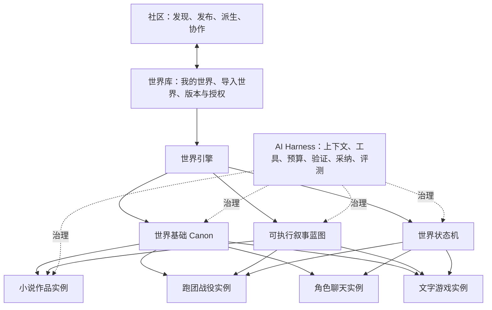
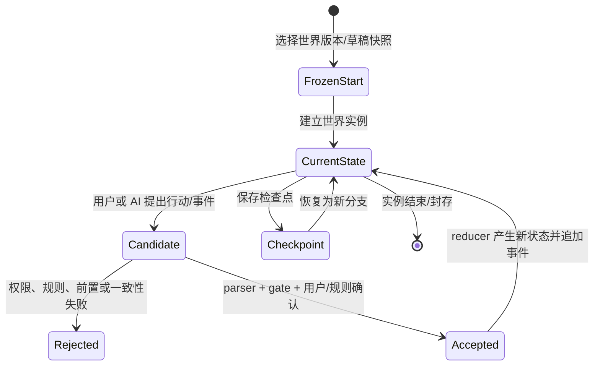
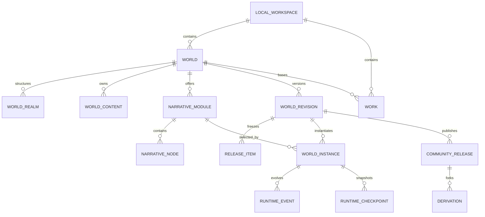
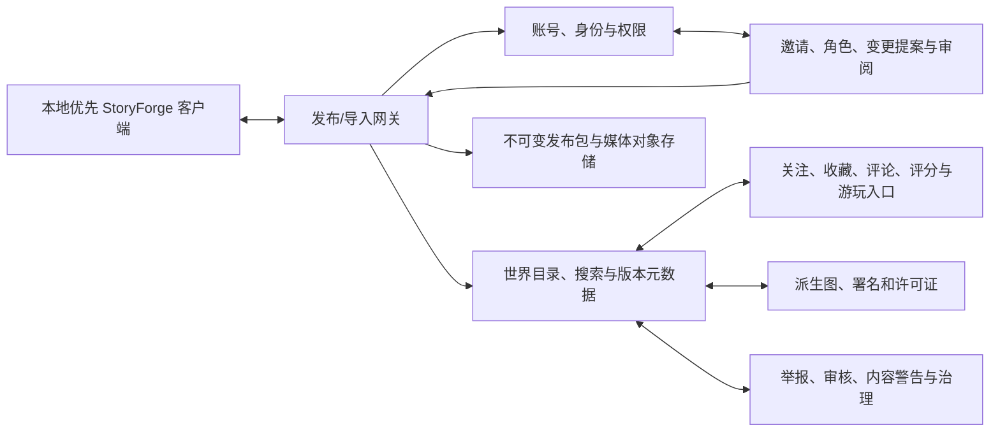

# WORLD-2 / PLATFORM-1 · StoryForge 世界引擎与社区整体架构重构

> 状态：ARCHITECTURE BASELINE / WORLD-2A 至 WORLD-2F 本地世界引擎基座已落地 / PLATFORM-1B 后端未开始
> 决策日期：2026-08-05
> 适用范围：世界引擎、分步骤创作、节点创作、Agent、跑团、角色聊天、文字游戏、世界发布与社区
> 用户核心定义：一个世界必须同时拥有完整的世界基础、可执行叙事和可演化状态；作品与游戏都是该世界的实例。
> 施工边界：先完成世界引擎与社区整体架构重构；Harness/Agent 工程随后单独以分步骤模式为首个对象，不与 WORLD-2 并行扩张。

## 0. 文档权威与纠偏声明

本文是 StoryForge 下一阶段产品领域架构和社区架构的唯一目标基线。它纠正以下旧前提：

1. `Project` 不能继续同时冒充存储容器、作品和世界三个概念。
2. `enableMultiWorld` 只是多世界/多位面能力开关，不能代表“是否启用世界引擎”。
3. `WorldGroupOverview` 只是世界结构与位面关系管理器，不能代表完整世界引擎。
4. 世界状态机是世界引擎的动态内核，不是世界基础本身，也不能直接覆盖作者 Canon。
5. 故事核心、主线、支线、大纲和细纲可以成为世界可复用叙事资产；是否进入世界、作品或发布包由用户决定。
6. 分步骤模式是当前最完整、最稳定的人工创作入口，重构期间必须原样保护并作为验收基线。

本文取代 [AUTHORING-PLATFORM-DESIGN.md](./AUTHORING-PLATFORM-DESIGN.md) 第 1 节中
“项目 = 统一故事世界与 Canon 数据容器”的产品领域层级。该文档关于 Agent、节点、可见检索和
候选确认的能力设计继续有效。本文不会取代三注册表、[MASTER-BLUEPRINT.md](./MASTER-BLUEPRINT.md)
的数据安全规则，也不会把 [SIM-RUNTIME-DESIGN.md](./SIM-RUNTIME-DESIGN.md) 已实现的运行时重新写一套。

## 1. 执行摘要

StoryForge 的核心产品不应是“一个 AI 小说项目”，而应是：

> 用户创建、完善、演化和发布一个真实可信的叙事世界；然后在这个世界中写小说、运行主线或支线、跑团、聊天、冒险和二次创作。

目标架构由五部分组成：

1. **世界基础 Canon**：定义世界是什么以及什么事实成立。
2. **可执行叙事蓝图**：定义世界中可以发生哪些主线、支线、任务、场景、选择和结局。
3. **世界状态机**：确定性推进时间、状态、事件、行动、规则、分支、验证和回放。
4. **世界实例**：小说、跑团、聊天、文字游戏各自从某个世界版本建立独立发展线。
5. **社区发布系统**：发布不可变世界版本，允许用户按授权使用、游玩、派生和追溯来源。

AI Harness 横向约束所有生成和演化操作：模型负责提出候选，代码负责装配上下文、验证、预算、
状态转换、权限和持久化，用户负责最终确认 Canon 与发布边界。

## 2. 不可破坏的产品与数据红线

### 2.1 分步骤模式保护

重构不得以“统一世界引擎”为由重写或删除分步骤模式。以下内容必须保持：

- 旧项目列表与 `/workspace/:projectId` 完整工作区继续可用。
- 世界起源、自然环境、人文环境、规则、地图、历史、故事、角色等面板继续读写原数据。
- 卷纲、章纲、细纲、章节和正文的创建、编辑、生成、采纳、导出与恢复行为不退化。
- 旧项目不强制迁移；任何迁移都必须可预检、可备份、事务化、可验证、失败零写入。
- 新世界引擎首先复用现有面板和能力，不复制第二套世界观、角色、大纲或正文表。
- 新入口替代旧入口前必须达到功能等价；半成品入口默认隐藏并明确实验状态。

分步骤模式是重构的 **Golden Master**。所有阶段都必须证明“旧项目在重构前后产生相同可见内容和
相同 Canon 读写结果”，不能只证明新页面能够打开。

### 2.2 Canon 与运行时隔离

- 世界基础与发布版本是作者确认的 Canon。
- AI 生成结果默认只是候选，必须通过 parser、确定性 gate 和用户确认。
- 世界实例只能读取冻结的世界版本或明确的草稿快照。
- 运行事件只改变实例状态，不自动修改世界 Canon、作品正文或角色主档。
- 运行结果回流时必须形成可审计候选，由用户选择目标作用域后确认。

### 2.3 本地优先与社区边界

- 浏览器 IndexedDB 继续是本地创作权威，社区服务不能静默覆盖本地草稿。
- 发布是显式动作；未发布内容、API Key、私有参考、Agent 思考过程和运行私密记录默认不上传。
- 已发布版本不可原地篡改；修正通过新版本、撤回声明或治理状态完成。
- 社区导入、关注、派生和协作必须保留来源、许可、版本和内容哈希。

## 3. 实现诊断与纠偏状态

| 领域 | 重构前事实 | 问题 | 当前状态 / 后续动作 |
|---|---|---|---|
| 根对象 | `Project` 同时承担作品、世界身份和备份根 | 无法表达一个世界对应多部作品和多个运行实例 | 保留项目作为本地存储边界，引入显式 `World`、`Work` 和绑定关系 |
| 世界身份 | 所有项目加载时都会获得 `worldCode@worldVersion` | 普通作品被自动包装成世界 | 世界编号归 `World`；旧字段仅作兼容镜像 |
| 世界入口 | 世界引擎页只渲染 `WorldGroupOverview` | 把多世界关系管理误当世界内容 | **已纠偏**：完整世界工作台聚合既有领域；世界组只作为“世界结构”模块 |
| 世界内容 | 起源、自然、人文、地图、历史等只在旧工作区 | 内容存在但产品归属和入口断裂 | **已纠偏**：工作台按世界基础、资产、叙事、结构和运行时投影同一份数据 |
| 故事与角色 | 故事核心为项目级；角色可带世界归属 | 世界可复用资产与作品角色作用混在一起 | 增加用户可选作用域和世界角色/作品角色投影 |
| 大纲细纲 | 默认属于作品，世界分享包不包含 | 无法发布可玩的主线和支线 | 抽象为可发布叙事模块，旧大纲作为首个编辑投影 |
| 多世界 | 类型偏向穿越、实例、平行、飞升 | 对单世界构建和普通叙事不自然 | 多世界成为可选子系统；单世界同样拥有完整引擎 |
| 状态机 | SIM 已有事件、检查点、分支和回放 | 被表现为体验产品后台，而非世界动态内核 | 继续保持数据隔离，但纳入世界引擎能力架构 |
| 世界版本 | 当前字段主要作为 `v1` 标签和分享包编号 | 没有不可变快照、差异和依赖锁定 | 引入草稿修订、发布版本和实例绑定 |
| 完整度 | 产品页按正文目标字数估算世界完整度 | 世界与作品语义混淆 | **第一阶段已纠偏**：由登记领域覆盖计算；引用、验证和发布准备度在后续阶段纳入 |
| 社区包 | 只分享注册为 `communityShare='world'` 的设定表 | 不包含故事核心、主线、支线、大纲和玩法 | 升级为用户选模块的世界发布清单；正文默认排除 |

代码证据：

- [ProductHubPage.tsx](../src/pages/ProductHubPage.tsx) 保留 `Project` 作为本地物理兼容根，并通过显式 World/Work
  打开当前世界与作品；完整度由只读世界投影提供，不读取正文进度。
- [domain.ts](../src/lib/world-engine/domain.ts) 从 `PROJECT_TABLES.worldDomains` 批量派生 World / Work / Runtime 兼容投影，不创建平行表或写入旁路。
- [WorldEngineWorkspace.tsx](../src/components/world-engine/WorldEngineWorkspace.tsx) 聚合现有分步骤面板，单世界用户不需要开启多世界。
- [world-group.ts](../src/lib/types/world-group.ts) 的类型和字段来自穿越/无限流多世界设计。
- [WorldGroupDetail.tsx](../src/components/world-group/WorldGroupDetail.tsx) 主要管理描述、穿越和能力继承规则。
- [sidebar-tree.ts](../src/components/layout/sidebar-tree.ts) 仍在旧工作区保存完整设定库入口。
- [project-tables.ts](../src/lib/registry/project-tables.ts) 为 66 张表统一登记物理生命周期、World/Work owner、
  引用重映射和社区分享范围；作品正文仍禁止进入世界包。
- [ownership.ts](../src/lib/world-engine/ownership.ts) 统一处理旧项目惰性迁移、默认根、兼容镜像和活动 scope。

## 4. 目标产品层级

产品导航可以并列，数据依赖必须有根。正确关系如下：



### 4.1 世界库

世界库解决“选择哪个世界和哪个版本”，而不是编辑所有内容。它显示：

- 世界身份、封面、作者、来源和许可。
- 当前草稿、已发布版本、派生来源和本地修改状态。
- 世界基础完整度、叙事模块、可用玩法和内容警告。
- 基于该世界创建作品、主线游玩、支线游玩、自由探索、跑团或聊天的入口。

### 4.2 世界引擎工作台

用户打开世界引擎时，应像进入一个真实世界，而不是只看到几个世界组。一级信息架构为：

1. **世界总览**：世界定位、规则摘要、完整度、冲突、版本和最近变化。
2. **世界基础**：规则、起源、自然、人文、地理、地图、历史、力量、种族、势力、物产。
3. **世界资产**：角色、关系、地点、组织、物品、知识词条、世界事件。
4. **叙事设计**：主题、矛盾、故事种子、主线、支线、任务、故事弧、大纲、细纲、场景和结局。
5. **世界结构**：单世界区域、多位面、多世界、通道、进入/离开和能力继承规则。
6. **状态与时间**：初始状态、规则集、时间线、事件类型、状态变量和实例模板。
7. **验证与影响**：Canon 冲突、引用缺失、时间/空间/角色/物品/知识一致性和下游影响。
8. **版本与发布**：变更差异、模块选择、许可、内容警告、兼容性、发布和撤回。

### 4.3 创作与体验入口

- **分步骤创作**：最完整的人工工作流，继续从世界设定到故事、角色、大纲、细纲、正文逐步创作。
- **节点创作**：同一数据的自由编排视图，不复制 Canon。
- **Agent 创作**：同一能力的自然语言编排与候选确认入口。
- **跑团/聊天/文字游戏**：从世界发布版本或草稿快照创建实例，不直接连接可变 Canon。

## 5. 世界引擎内部架构

### 5.1 世界基础 Canon

世界基础回答“这个世界是什么、哪些事实成立”。它至少包括：

| 分类 | 核心内容 |
|---|---|
| 元规则 | 真实/幻想边界、物理与超自然规则、世界宪法、允许与禁止事项 |
| 起源 | 创世、宇宙结构、位面、神明、信仰、世界生命周期 |
| 自然 | 地形、水文、气候、生态、资源、灾害、天文与尺度 |
| 人文 | 种族、社会、政治、经济、文化、语言、宗教、法律和冲突 |
| 空间 | 大陆、区域、地点、路线、距离、传送关系和地图证据 |
| 时间 | 历法、时代、历史年表、重大事件、因果和存亡区间 |
| 能力 | 能量来源、力量体系、修炼流派、阶段、代价、克制与限制 |
| 实体 | 角色、组织、势力、地点、物品、物产、生物和知识词条 |
| 关系 | 角色、势力、地点、血缘、从属、敌友、贸易和知识关系 |

这些内容以结构化记录与可读叙述共同表达。结构化数据负责校验和引用，叙述负责创作语义；任何摘要、
embedding 或模型记忆都只是派生物，不能成为 Canon 权威。

### 5.2 可执行叙事蓝图

世界不只保存背景，也保存用户允许复用和游玩的故事设计。叙事蓝图分为：

- 世界主题、核心矛盾和时代危机。
- 故事种子与可选故事核心。
- 主线、支线、任务链、角色线、势力线和探索线。
- 卷纲、章纲、细纲、场景卡、关键事件、选择和结局。
- 进入条件、触发条件、失败条件、状态效果和后续解锁。
- 预设开局、推荐角色、默认时间点和自由探索入口。

叙事节点的逻辑合同不是一段纯文本，而是：

```text
NarrativeNode
= 内容与目标
+ 作用域和所属模块
+ 时间与地点
+ 参与实体
+ 前置条件
+ 触发方式
+ 可选行动/选择
+ 确定性或 AI 辅助判定
+ 状态效果
+ 后继与替代路径
+ 失败、退出和结局
+ 来源、版本与作者确认状态
```

小说可以把叙事图投影为线性卷纲、章纲、细纲和正文；互动玩法按实时状态选择可达节点。二者共享叙事
事实和依赖，不要求共享相同的呈现形式。

### 5.3 世界状态机

世界状态机回答“这个世界如何在不乱套的前提下继续发展”。内部沿用事件溯源设计：



职责边界：

- 代码负责时间、状态、规则、随机、事件序号、资源上下限、分支和回放。
- AI 负责解释意图、提出叙事候选、生成表现文本和建议可能行动。
- 用户决定需要主观判断的 Canon、剧情和发布动作。
- 同一初始快照与事件流必须重放为同一状态；未知事件和非法转换失败关闭。

### 5.4 世界实例

每次创作或游玩都创建独立实例，绑定：

- 一个明确的世界草稿快照或不可变发布版本。
- 零到多个叙事模块及其版本。
- 玩法类型、规则集版本、初始角色/地点/物品和开局节点。
- 独立事件流、状态、检查点、分支、记忆和叙事记录。

实例之间不能共享可变状态。小说作品中的角色结局不会自动杀死跑团存档中的同名角色；社区玩家走完支线
也不会修改作者发布的世界版本。

## 6. 内容所有权与用户可选作用域

系统不替用户决定主线、支线或故事核心必须属于哪里。每项可复用内容都应有显式作用域：

| 作用域 | 含义 | 默认行为 |
|---|---|---|
| `world` | 世界 Canon 或世界可复用叙事资产 | 可被多个作品和实例引用；发布时仍需用户选择 |
| `work` | 某部小说/作品专属设计 | 不自动进入世界发布包 |
| `instance` | 某次跑团、聊天或游戏的运行状态 | 只属于该实例；回流必须候选确认 |
| `private-reference` | 参考材料、研究、草稿和未授权内容 | 永不发布，不能冒充 Canon |

用户操作必须支持：

- 将世界级模板派生到作品后独立修改。
- 将作品中的成熟设定提升为世界候选，确认后进入世界草稿。
- 将世界主线复制为自己的改编线，并保留来源。
- 把世界内容从本次发布中排除，而不删除本地内容。
- 查看所有作用域转换的来源、差异、影响范围和可撤销记录。

### 6.1 现有数据的目标归属

| 当前数据 | 目标拆分/归属 | 迁移原则 |
|---|---|---|
| `worldviews`、规则、地理、历史、Codex | 世界基础 Canon | 保留现有记录和 ID，补显式世界归属 |
| `worldGroups`、`worldGroupLinks` | 世界内部位面/子世界结构 | UI 改名，不再充当世界根对象 |
| `characters` | 世界人物身份 + 可选作品角色投影 | 角色身份不复制；戏份、弧光、出场和结局可作品化 |
| 物品定义/Codex artifact | 世界资产 | 与“谁在何时持有”的实例/作品账本分开 |
| `storyCores` | 世界故事种子/故事核心或作品故事核心 | 由用户选作用域；不再固定项目级唯一语义 |
| `storyArcs` | 世界可复用叙事线或作品故事线 | 补叙事模块归属、前置、状态效果和版本 |
| `outlineNodes` | 叙事蓝图的分步骤投影或作品大纲 | 先适配，禁止复制第二棵树；发布只选世界级模块 |
| `detailedOutlines` | 叙事节点的场景/细纲投影 | 保留角色/伏笔引用；增加条件和效果合同 |
| `chapters` | 作品正文 | 默认私有且不进世界包；用户另行发布作品时处理 |
| `stateCards`、事实、认知、物品流水 | 作品连续性证据或实例状态 | 不把运行状态伪装成世界初始 Canon |
| `simulationSessions/events/checkpoints` | 世界实例状态机 | 继续事件溯源，不直接写世界基础 |

## 7. 逻辑领域模型

以下是目标逻辑实体，不代表下一提交必须一次性新增全部表。精确 Dexie schema 必须在 WORLD-2 数据 ADR 中
逐表完成 owner、引用、迁移和反例测试后确定。



关键逻辑实体：

| 实体 | 责任 | 不负责 |
|---|---|---|
| `LocalWorkspace` | 本地数据、备份、权限和迁移边界；兼容当前 `Project` | 不冒充世界或作品 |
| `World` | 稳定世界身份、草稿头、作者和默认规则 | 不保存某次游玩的可变状态 |
| `WorldRealm` | 位面、区域世界、多世界关系和穿越规则 | 不作为世界引擎总根 |
| `WorldContent` | 世界 Canon 内容的统一所有权描述 | 不复制现有业务表正文 |
| `NarrativeModule` | 主线、支线、任务包、故事种子、开局和玩法入口 | 不保存章节正文或运行事件 |
| `NarrativeNode` | 可执行剧情节点合同 | 不直接调用模型或改状态 |
| `Work` | 某部作品、所选世界版本、作品专属故事和正文 | 不拥有共享世界 Canon |
| `WorldRevision` | 草稿修订的来源、差异和依赖 | 未发布时不冒充公共版本 |
| `CommunityRelease` | 不可变发布清单、许可、哈希和兼容信息 | 不包含未选择的本地内容 |
| `WorldInstance` | 一次创作/游玩的冻结输入和状态线 | 不反写发布版本 |

## 8. 版本、发布与社区包 v2

### 8.1 三种版本状态

1. **工作草稿**：可变，属于作者本地世界；每次写入仍走三注册表。
2. **世界修订**：记录父修订、差异、来源和验证结果，可用于审阅。
3. **发布版本**：不可变内容清单，拥有唯一 `worldCode@version`、哈希、许可和依赖锁定。

实例必须绑定具体快照。选择“跟随最新版”只能影响创建下一实例时的默认选择，不能静默升级已有实例。

### 8.2 模块化发布清单

世界发布不再由表级 `communityShare='world'` 一刀切决定。注册表仍决定某类数据是否具备发布资格，用户再从
符合资格的记录/模块中显式选择本次内容。

```json
{
  "format": "storyforge.world-release",
  "schemaVersion": 2,
  "worldCode": "W-EXAMPLE",
  "worldVersion": 2,
  "parentRelease": "W-EXAMPLE@v1",
  "modules": [
    { "kind": "foundation", "id": "foundation.core", "required": true },
    { "kind": "narrative", "id": "mainline.001", "playMode": "mainline" },
    { "kind": "narrative", "id": "sideline.004", "playMode": "sideline" }
  ],
  "allowedUses": ["writing", "mainline-play", "sideline-play", "ttrpg", "chat", "remix"],
  "license": "author-selected",
  "contentWarnings": [],
  "compatibility": { "engine": ">=2", "ruleset": "world-runtime@1" },
  "integrity": { "algorithm": "SHA-256", "digest": "..." }
}
```

默认规则：

- 世界基础、角色身份、地点和规则可被选择发布。
- 主线、支线、大纲和细纲由用户逐模块选择。
- 章节正文、私有参考、API 配置、Agent 对话和未确认候选默认排除。
- 发布预检必须显示缺失依赖、悬空引用、未授权来源、剧透范围和包体积。
- 导入先进入隔离预览，校验通过后创建本地副本或只读订阅，不覆盖现有世界。

### 8.3 社区派生与溯源

- `fork` 创建新的本地世界身份，保存来源世界、版本、作者、许可和共同祖先。
- `remix` 允许只派生某些模块，不默认获得未发布内容。
- 上游新版本通过差异候选提供，不能直接覆盖派生世界的本地修改。
- 署名链、许可证兼容和撤回/治理状态必须随再发布传播。

## 9. 社区整体架构

社区不是把 IndexedDB 搬到服务器，而是围绕不可变发布物建立发现、授权、派生和协作层。



### 9.1 服务边界

| 服务 | 最小责任 | 不得偷带的责任 |
|---|---|---|
| 身份与权限 | 账号、会话、作者身份、世界角色和发布授权 | 不读取用户本地私有项目 |
| 发布网关 | 清单校验、哈希、幂等上传、版本冲突和下载 | 不把上传成功冒充审核通过 |
| 目录与搜索 | 世界/模块元数据、标签、兼容性、可用玩法 | 不把索引摘要当发布原文 |
| 对象存储 | 不可变包、封面、地图和媒体 | 不保存明文 API Key |
| 派生图 | fork/remix 祖先、差异和许可证链 | 不自动合并 Canon |
| 社交层 | 收藏、关注、评论、评分和游玩统计 | 不直接修改世界版本 |
| 协作层 | 邀请、角色、提案、审阅和合并记录 | 不允许无权限直接覆盖作者草稿 |
| 治理层 | 内容警告、举报、审核、下架和申诉 | 不删除用户本地副本 |

### 9.2 社区用户路径

**发布世界**：本地草稿 → 选择模块 → 权利/依赖/一致性预检 → 生成不可变版本 → 上传 → 目录审核/展示。

**使用世界**：发现世界 → 查看内容范围/许可/玩法 → 导入或订阅 → 选择主线、支线、自由探索或创作 → 建立独立实例。

**二次创作**：选择允许 remix 的版本 → fork → 本地修改 → 查看与上游差异 → 按许可再发布 → 保留署名链。

**协作创作**：世界所有者邀请成员 → 成员提交结构化候选/变更集 → 自动验证 → 审阅合并 → 发布新版本。

## 10. 与 AI Harness / Agent 工程的边界

本节只定义世界与社区架构将来如何消费 Harness/Agent 能力，不代表本轮同时施工 Harness/Agent。
正确顺序是：先稳定 World / Work / Instance / Release / Community 领域边界，再在完整保留的分步骤模式上
完成 Harness/Agent 工程；分步骤基线稳定后，世界引擎、节点模式和互动实例才按需迁移同一能力。

### 10.1 Harness 在世界引擎中的位置

Harness 不是一组更长的提示词，也不是新的业务数据源。它是模型与世界数据之间的控制平面：

```text
用户意图
  -> 主 Agent / 显式功能入口
  -> 计划与能力路由
  -> CONTEXT_SOURCES / assembleContext
  -> 有界模型调用或确定性工具
  -> 严格 parser
  -> Canon / 时序 / 空间 / 引用 / 状态 gate
  -> 可编辑候选与差异
  -> 用户确认
  -> FIELD_REGISTRY / AdoptionSchema / adopt
  -> PROJECT_TABLES 生命周期与审计证据
```

### 10.2 领域能力与 Agent 角色

前台保持一个主 Agent，对用户不暴露需要手工选择的多 Agent 标签。幕后能力按职责分层：

| 能力 | 责任 | 典型输出 |
|---|---|---|
| 世界构建 | 起源、自然、人文、规则、地图、历史和词条 | 世界 Canon 候选 |
| 叙事设计 | 故事种子、主线、支线、任务、节点、大纲和细纲 | 叙事模块候选 |
| 角色与资产 | 角色、关系、势力、地点、物品和能力 | 实体与关系候选 |
| 连续性验证 | Canon、时序、认知、持有、空间、主支线进度 | 只读问题报告与返工证据 |
| 状态演化 | 解释行动、建议事件和表现叙事 | 运行事件候选，不提交最终状态 |
| 发布审查 | 依赖、许可、剧透、兼容性和完整度 | 发布阻断/警告报告 |

### 10.3 分层上下文与成本控制

吸收 Agent Harness、Claude Code 类架构和 Kimi-K3 技术报告的共同工程原则时，StoryForge 采用：

- 任务开始只装载稳定入口和能力目录，按需读取具体来源。
- 世界、叙事、作品和实例使用稳定 ID 与版本引用，不重复回灌完整历史。
- 计划、工具结果、候选、验证和用户决定持久化为可恢复工件。
- 主 Agent 负责路由与汇总，领域执行器只拿完成任务所需的最小闭包。
- 确定性代码优先完成查表、约束、状态转换、去重和验证；模型不重复模拟数据库。
- 对长历史进行结构化压缩并保留来源指针，压缩物不覆盖原始 Canon。
- 每次运行保存实际 included/omitted/trimmed 来源、预算、模型、工具、错误和 gate。

这些原则必须落到接口、注册表、测试和可观察记录，不能只写进 system prompt。

### 10.4 评测体系

至少建立四级评测：

1. **合同测试**：schema、parser、作用域、引用、预算和非法输入。
2. **领域测试**：世界规则、时间、空间、角色知识、物品持有、主支线条件和状态 reducer。
3. **轨迹测试**：给定冻结输入，验证计划、工具调用、候选、gate 和写回边界。
4. **端到端黄金项目**：真实旧项目与标准世界样例完成创建、写作、发布、导入和游玩闭环。

质量指标必须区分：硬错误、软风险、模型主观评分和未覆盖区域；不得用单一“AI 评分”冒充工程正确性。

## 11. 数据注册表演进

新架构继续收口到现有三注册表，不建立平行 AI/DB 入口。

### 11.1 `PROJECT_TABLES`

未来表或现有表扩展必须明确：

- `domainOwner`: workspace / world / work / instance / release。
- 世界、作品、实例和发布版本引用及删除策略。
- 是否可备份、可发布、可协作、可派生、可重建。
- 发布时记录级选择、依赖闭包和 ID 重映射策略。
- 旧 `communityShare` 作为 v1 兼容能力，不能继续承担完整发布策略。

### 11.2 `CONTEXT_SOURCES`

- 区分 world draft、world release、work overlay 和 instance snapshot。
- 任何运行时读取必须绑定实例冻结版本，不得回查可变世界草稿。
- 叙事节点只读取其依赖闭包、可见状态和允许剧透范围。
- 发布审查读取内容清单与来源权利，不读取私有参考正文。

### 11.3 `FIELD_REGISTRY + AdoptionSchema + adopt()`

- 写入必须携带目标 owner 与版本基线，防止把作品候选写进世界或把实例状态写进 Canon。
- 作用域提升、派生和合并是显式领域用例，不允许组件直接批量改 owner 字段。
- 发布版本不可走普通 adopt 更新；只能由草稿生成新的不可变 release。
- 叙事节点的条件、效果、引用和图结构需要闭集 schema 与循环/悬空验证。

## 12. 分阶段施工方案

本重构禁止 Big Bang。每阶段必须可独立验收，失败时旧分步骤路径仍可使用。

### WORLD-2A · 基线冻结与语义纠偏

范围：

- 为旧项目、分步骤设定、大纲、细纲、章节、正文和导入导出建立 Golden Master。
- 将当前“世界引擎”能力准确标注为世界身份/多世界结构实验入口。
- 删除“正文进度 = 世界完整度”等错误产品语义。
- 冻结 v1 世界包兼容测试，不扩大分享范围。

完成判据：没有 schema 变更；旧项目逐项可见；新旧入口读到同一 Canon；错误命名不再指导后续开发。

### WORLD-2B · 完整世界引擎工作台

范围：

- 用现有设定库、角色、资产、故事、大纲能力组成新的世界工作台。
- `WorldGroupOverview` 降为“世界结构/位面管理”。
- 建立按领域覆盖、引用和验证计算的世界完整度。
- 分步骤模式与世界工作台共享组件/use-case/store，不复制表。

完成判据：单世界用户无需开启多世界即可完成完整世界设定；旧工作区仍保持原行为。

实施状态（2026-08-06）：**COMPLETE**。完整世界工作台已按世界基础、世界资产、叙事设计、世界结构、
状态与实例聚合既有分步骤面板；单世界无需开启多世界，数据仍由原 store/use-case 和三注册表治理。

### WORLD-2C · 显式世界/作品所有权

正式决策见 [WORLD-2C 世界、作品与本地工作区所有权 ADR](./adr/WORLD-2C-WORLD-WORK-OWNERSHIP.md)。
ADR 已冻结领域边界、逻辑 owner、惰性迁移、回滚、导入重映射和开放门禁。C1/C2 完成 DB v49 空升级、
`domainOwner` 全表分类、逐工作区只读预检、SHA-256 指纹、before-image、默认根、owner 盖章、唯一兼容
resolver、并发幂等和有边界回滚；C3-C5 已继续完成 Store/AI scope gate、严格 v4 owner 往返、删除生命周期、
注册表派生的原子作用域转换与审计，以及同一 World 下多 Work 的创建、切换和删除 UI。

范围：

- 引入逻辑 `World`、`Work` 和绑定关系；`Project` 先保留为本地存储/兼容边界。
- 为故事核心、角色作用、大纲和细纲增加用户可选作用域。
- 设计事务化惰性迁移、预检、备份、回滚和导入重映射。
- `worldCode` 的权威从 Project 迁到 World，旧字段保持只读兼容镜像直至下线。

完成判据：一个世界可创建至少两部互不覆盖的作品；旧项目自动映射后内容与 ID 引用完整。

实施状态（2026-08-06）：**COMPLETE**。DB v50 的 66 张登记表统一由 `PROJECT_TABLES` 派生物理生命周期和
逻辑 owner；v1-v3 兼容导入、v4 便携 ID、损坏 owner 拒绝、World/Work/Workspace 删除、两作品隔离及
`changeRecordScope()` 的跨作用域引用反例均已覆盖。`Project` 只继续承担本地兼容根和当前 Work 镜像。

### WORLD-2D · 可执行叙事蓝图

范围：

- 建立 NarrativeModule / NarrativeNode 领域合同。
- 将现有卷纲、章纲和细纲作为首个分步骤编辑投影接入。
- 支持主线、支线、任务、开局、条件、选择、效果、后继和结局。
- 线性小说投影和互动可达图使用同一叙事来源，不复制正文。

完成判据：同一世界至少可定义一条主线和两条支线；分步骤写作可选择其中一条创作，运行时可从对应入口启动。

实施状态（2026-08-07）：**COMPLETE**。`narrativeModules` / `narrativeNodes` 已进入 schema 与三注册表；用户可
原子创建主线、支线、任务、开局和自由探索五类正式入口，每次创建都同时产生可执行的 `entry -> ending` 最小图。
现有 StoryArc 主线/支线仍可重复同步为同一投影；图验证会拒绝身份错配、重复 key、悬空后继、入口缺失、
不可达节点以及非法条件/效果。Work 保存当前 NarrativeModule，`activeNarrativeBlueprint` 作为登记上下文源按
当前 Work 隔离，并供大纲、细纲、章纲、场景、正文/大纲 Copilot、角色驱动剧情和 Agent 读取；用户也可把
模块从本作品原子提升为整个 World 可复用叙事。

### WORLD-2E · 世界修订、版本与发布包 v2

范围：

- 草稿差异、父修订、不可变发布版本、依赖锁定和哈希。
- 用户逐模块选择世界基础、角色、主线、支线、大纲和细纲。
- 正文、私有参考和未确认候选默认排除。
- v1 包继续可导入；v2 包完成预检、往返和来源保留。

完成判据：发布 v1 后修改草稿不影响旧实例；发布 v2 可显示差异；干净浏览器能导入并选择主线/支线。

实施状态（2026-08-07）：**COMPLETE**。发布范围的世界基础、角色、叙事和大纲四个分区完全由
`PROJECT_TABLES` 派生，用户可选择分区和具体 NarrativeModule；正文与私有参考不属于任何可发布分区。
`worldRevisions` 保存父链、逐表依赖锁、稳定 SHA-256 和最新修订差异：哈希排除导出时间，冻结在覆盖全部
登记表的同一事务中重建 manifest，若源记录在冻结期间变化则整体拒绝。`worldReleases` 事务化幂等发布不可变
manifest。世界包 v2 严格验证表清单、records、portable project、依赖闭包和逐表 hash 一致；历史 v1 使用其
原始表合同继续兼容。隔离浏览器已完成 v2 下载、预检、导入、来源和当前叙事恢复。

### WORLD-2F · 状态机与多产品实例统一

范围：

- SIM 会话显式绑定 WorldRelease/草稿快照和 NarrativeModule。
- 跑团、聊天、文字游戏和 NPC 演进共享事件/reducer/checkpoint，不各建引擎。
- 支持主线游玩、支线游玩、自由探索和作品时间线实例。
- 运行结果回流形成作用域明确的候选。

完成判据：同一发布版本建立四类隔离实例；回放确定；任何实例不能修改世界发布物或其它实例。

实施状态（2026-08-07）：**COMPLETE**。SIM session 显式绑定 World、Work、可验证的 SIM Canon 快照以及
Release 的便携 NarrativeModule ID；草稿实例则绑定草稿快照 hash 和本地 NarrativeModule。节点图、条件、效果、
选择与运行变量在创建实例时冻结，之后修改草稿不会改变旧实例。确定性推进 API 校验允许后继和 base sequence，
应用闭集效果并拒绝伪造叙事事件；事件回放、检查点验证和分支继承都复用同一 reducer。跑团、角色聊天、文字游戏
和 NPC 演进四类实例在同一 Release 上相互隔离，运行结果仍只形成 SIM 提案/事件，不自动改写作者 Canon。

### PLATFORM-1B · 社区发布与发现

范围：

- 后端身份、发布网关、目录搜索、对象存储、许可、内容警告和治理最小闭环。
- 本地客户端只上传用户确认的不可变发布清单。
- 支持发现、导入、订阅、游玩和 fork，保留来源与哈希。

完成判据：两个账号完成发布 → 发现 → 导入 → 主线/支线游玩 → fork → 再发布，许可和来源链可核查。

### PLATFORM-1C · 协作与生态

范围：

- 世界角色权限、邀请、结构化变更提案、审阅和版本合并。
- 评论、收藏、评分、玩法统计、作者更新和派生图。
- 举报、下架、申诉、许可证冲突和删除请求处理。

完成判据：协作不能绕过作者确认和发布版本；社区下架不删除用户合法本地副本；治理记录可审计。

### HARNESS-2 · 分步骤模式后续独立工程

HARNESS-2 不属于本轮 WORLD-2 架构重构。WORLD-2 只维护既有三注册表和确定性安全边界，不新增或扩张
Harness/Agent 执行体系。整体架构达到稳定基线后，HARNESS-2 先只在分步骤模式补齐：

- 工具/能力登记、上下文预算、parser、gate、候选、确认和轨迹。
- 领域 eval、Golden 数据集、回归指标、失败分类和发布门槛。
- 模型/API 可替换，确定性规则和数据合同不绑定单一供应商。
- 提示词与工具说明按需加载、版本化、可回放，禁止无界历史回灌。

分步骤模式达到稳定发布门槛后，再把已经验证的能力迁移到世界引擎、节点、跑团、聊天和文字游戏；
迁移不得反过来改变分步骤 Golden Master。

## 13. 验收矩阵

| 场景 | 必须成功 | 必须失败关闭 |
|---|---|---|
| 旧分步骤项目 | 原设定、大纲、细纲、正文、导出导入均保持 | 迁移失败后出现半项目或内容隐藏 |
| 单世界构建 | 不开多世界也能完成全部世界基础和叙事 | 要求先建立穿越世界才能编辑设定 |
| 多世界 | 每个位面内容隔离且关系可见 | 世界内容串组、删除留下孤儿引用 |
| 故事作用域 | 用户可决定故事核心/主支线属于世界或作品 | 系统静默改作用域或覆盖另一作品 |
| 叙事游玩 | 主线、支线和自由探索从正确节点启动 | 未满足前置仍进入、剧透越权读取 |
| 状态机 | 同初始快照和事件流确定性回放 | AI 自选骰点、越过 reducer 改状态 |
| 发布 | 清单、依赖、许可、哈希和差异可核查 | 未授权材料、正文或 API Key 被上传 |
| 导入/fork | 新本地身份、来源、许可和引用完整 | 覆盖已有世界、丢失父版本或署名 |
| Agent | 真实来源、预算、候选、gate 和确认可见 | 未确认写 Canon、跨世界/作品读写 |
| 社区 | 权限、幂等发布、治理和协作可审计 | 客户端伪造作者、原地修改已发布版本 |

端到端发布闸门至少包括：

1. 真实旧项目往返与可见性对比。
2. 新世界从零完成基础、角色、物品、主线、支线、大纲和细纲。
3. 发布后在独立浏览器数据中导入并分别启动主线、支线和自由探索。
4. 四类实例独立演化、检查点、分支和回放。
5. 世界草稿变化只产生来源过期/升级提示，不改已有实例。
6. 删除世界、作品、叙事模块、实例和本地副本的正反生命周期测试。
7. `npm run ci`、适用的 `npm run ci:e2e` 和隔离真实浏览器项目验证。

本地基座最终证据（2026-08-07）：`npm run ci` 通过三注册表、架构、来源可达性、路线图、Canon、依赖、
lint、类型、265 个测试文件 / 1001 项测试的全量覆盖率、生产构建和包体门禁；
`R-WORLD2D-2F-runtime-closure` 覆盖五类入口、双 Work 上下文、
发布裁剪、防篡改、冻结抗草稿变更、确定推进、回放、检查点、分支与四类实例。`npm run ci:e2e` 在独立
Chromium 数据中 37/37 通过，覆盖完整 WORLD-2 Golden Path 和 390px 窄屏。线上账号、云发布、发现、订阅、fork、协作与
治理没有借此标记完成，仍由 PLATFORM-1B/1C 单独验收。

## 14. 文档迁移与旧方案处理

| 旧文档/能力 | 后续定位 |
|---|---|
| `MULTI-WORLD-DESIGN-V2.md` | 保留为“世界内部多位面/多世界结构”设计，不再代表世界引擎 |
| `AUTHORING-PLATFORM-DESIGN.md` | 保留 Agent/节点/数据层能力；产品领域根由本文取代 |
| `SIM-RUNTIME-DESIGN.md` | 作为世界状态机的已实现运行时内核，继续保持 Canon 隔离 |
| `INTERACTIVE-RUNTIME-ROADMAP.md` | 保留各体验产品阶段，实例绑定改服从本文 |
| `PLATFORM-1-LOCAL-PUBLISHING.md` | 作为世界包 v1 兼容合同；v2 模块发布由本文指导 |
| `MASTER-BLUEPRINT.md` | 继续作为三注册表、迁移、引用和测试工程权威 |
| WPS AI Harness 研究方案 | 作为 Agent/Harness 研究依据；本文负责领域架构落地翻译 |

实施前还需按阶段建立独立 ADR，但以下高层决策已经确定，不应反复摇摆：

- 世界引擎 = 世界基础 + 可执行叙事 + 世界状态机。
- 主线、支线、大纲和细纲可以是世界资产，具体作用域和发布范围由用户决定。
- 小说、跑团、聊天和文字游戏是绑定世界版本的独立实例。
- 分步骤模式完整保留并作为迁移基线。
- 多世界只是世界引擎内部的可选结构。
- 社区发布不可变版本，不直接同步或覆盖本地草稿。

## 15. 研究依据与可核查来源

本文件是领域架构与施工基线，不重复堆叠外部研究全文。关键研究和现有工程依据如下：

- [ultraworkers/claw-code](https://github.com/ultraworkers/claw-code)：Claude Code 类 Agent 组织、任务入口与上下文加载实践参考。
- [MoonshotAI/Kimi-K3](https://github.com/MoonshotAI/Kimi-K3)：Kimi-K3 技术报告及分层 Agent 系统研究依据。
- [Anthropic · Building effective agents](https://www.anthropic.com/engineering/building-effective-agents)：workflow、agent、工具和控制复杂度原则。
- WPS《故事熔炉人工智能运行框架架构研究与工程改造方案（AI-HARNESS-ARCHITECTURE-20260803）》：本项目专项研究汇总。
- [MASTER-BLUEPRINT.md](./MASTER-BLUEPRINT.md)：现有三注册表、数据生命周期、上下文与写回工程基线。
- [AUTHORING-PLATFORM-DESIGN.md](./AUTHORING-PLATFORM-DESIGN.md)：现有 Agent、节点、可见数据和模式能力。
- [SIM-RUNTIME-DESIGN.md](./SIM-RUNTIME-DESIGN.md)：已实现的事件溯源状态机、检查点、分支和回放。
- [PLATFORM-1-LOCAL-PUBLISHING.md](./PLATFORM-1-LOCAL-PUBLISHING.md)：当前本地世界包 v1 的可信导入导出边界。

任何外部理念只有在转化为 StoryForge 的类型合同、注册表登记、持久化证据、验证门槛和用户可见行为后，
才算真正采用。
