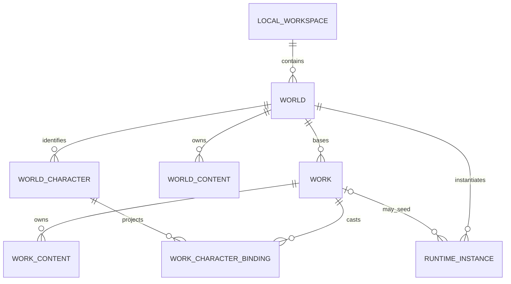
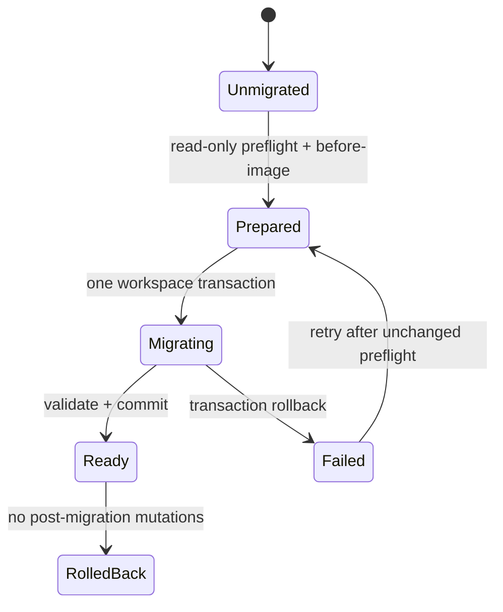

# WORLD-2C ADR：世界、作品与本地工作区所有权

> 状态：ACCEPTED / IMPLEMENTED / C1-C5 COMPLETE
> 决策日期：2026-08-06
> 任务归属：`WORLD-2C`
> 上位架构：[世界引擎与社区整体架构](../WORLD-ENGINE-COMMUNITY-ARCHITECTURE.md)

## 1. 决策摘要

StoryForge 采用“一个本地工作区包含多个世界，一个世界包含多部作品”的领域模型：

- 现有 `projects` 表继续作为 `LocalWorkspace` 的物理兼容根，负责本地备份、删除、迁移和权限边界。
- 新增显式 `World` 与 `Work`；`Work.worldId` 是作品绑定世界的权威关系。
- `Project.worldCode/worldVersion` 和作品属性只保留为当前选择项的只读兼容镜像，权威分别迁到
  `World` 与 `Work`。
- 现有 `projectId` 在 WORLD-2C 内继续表示物理生命周期，不再被解释为逻辑内容归属。
- 逻辑归属登记在现有 `PROJECT_TABLES` 的 `domainOwner` 元数据中，不建立第二套表清单。
- 旧项目确定性映射为一个默认世界和一个默认作品；不根据文本、表是否为空或 AI 判断归属。
- 迁移采用“schema 只加不搬 + 运行时逐工作区惰性迁移”：先只读预检和持久化 before-image，
  再在一个 Dexie 事务内完成根对象、逻辑归属和兼容镜像；失败时业务数据零写入。
- 在全部作品级读写入口完成作用域适配和反例测试前，不开放“创建第二部作品”入口。

该决定允许同一个世界下至少两部作品拥有独立故事核心、大纲、细纲、章节和连续性记录，同时共享同一份
世界 Canon、角色身份和世界资产，不复制现有业务表内容，也不改变分步骤模式的用户流程。

## 2. 背景与问题

当前 `Project` 同时承担四种职责：

1. IndexedDB 中所有业务表的物理删除、导出和迁移根。
2. 小说作品的标题、流派、状态、目标字数和创作偏好。
3. 世界的 `worldCode`、`worldVersion` 和社区来源。
4. 分步骤模式所有设定、大纲、正文和运行记录的隐式共同 owner。

这使“一个世界下创作两部互不覆盖的作品”无法表达。直接复制 Project 会复制世界 Canon，两个副本随后各自
演化；直接在一个 Project 中增加第二部作品，又会让所有只按 `projectId` 查询的 store 和组件读到混合数据。

WORLD-2A/2B 已经完成语义纠偏和只读工作台投影，但
[`domain.ts`](../../src/lib/world-engine/domain.ts) 仍明确是从 `Project` 与业务表派生的兼容视图。WORLD-2C 必须先
确定所有权合同，再改 schema 和 UI。

## 3. 目标与非目标

### 3.1 目标

- 一个工作区可容纳多个世界；一个世界可绑定多部作品。
- 世界 Canon、作品创作和运行实例具有可验证、不可混写的 owner。
- 旧项目无需用户理解迁移即可继续使用，原记录主键和内部引用不变。
- 分步骤模式保持原布局、入口和默认行为；单作品用户不增加必经步骤。
- 删除、导出、导入、迁移和 ID 重映射继续从 `PROJECT_TABLES` 派生。
- 迁移前可预检、有可持久化恢复证据，失败可回滚且不留下半迁移项目。

### 3.2 非目标

- 本 ADR 不实现 `NarrativeModule/NarrativeNode`、条件、效果或可达性；这些属于 WORLD-2D。
- 本 ADR 不实现不可变 `WorldRevision`、世界包 v2 或社区后端；这些属于 WORLD-2E/PLATFORM。
- 本 ADR 不把 SIM 会话改造成完整的多产品实例绑定；这些属于 WORLD-2F。
- 本 ADR 不改造 Harness/Agent；Harness 仍只针对完整保留的分步骤模式独立施工。
- 本 ADR 不授权一次性重写全部 store、组件或业务表。

## 4. 选项评估

| 选项 | 优点 | 致命问题 | 结论 |
|---|---|---|---|
| 每部作品一个 Project，跨 Project 共享 World | 作品隔离看似简单 | 世界数据需要跨项目查询；删除宿主 Project 会伤共享世界；项目备份不再自包含 | 拒绝 |
| Project 直接改名为 World，作品另建 Project | 变更表面较小 | 继续让物理备份根冒充领域对象；旧入口和所有外键语义更混乱 | 拒绝 |
| 一次性删除 Project 语义并重写所有表 | 目标模型最纯 | 生产数据风险和改动面不可接受；无法逐阶段验证 | 拒绝 |
| Project 保留为 LocalWorkspace，内部显式 World/Work | 保留物理生命周期和旧 ID；可逐表收口；备份仍自包含 | 过渡期需要明确兼容镜像和入口门禁 | 采用 |

## 5. 目标领域模型



### 5.1 LocalWorkspace

物理实现继续使用 `projects` 表和 `projectId`。它负责：

- 完整项目 JSON、文件夹、Gist 和快照的本地边界。
- 删除整个本地副本。
- 记录 `activeWorldId`、`activeWorkId` 和 ownership schema 版本。
- 在过渡期为旧路由提供当前 World/Work 的兼容镜像。

它不再负责世界公开身份，也不再是作品内容的逻辑 owner。

### 5.2 World

建议最小合同：

```ts
interface World {
  id?: number
  projectId: number
  code: string
  name: string
  description: string
  currentVersion: number
  communityOrigin?: CommunityWorldOrigin
  createdAt: number
  updatedAt: number
}
```

不变量：

- `code` 是本地世界的稳定公开身份；同一数据库内唯一。
- `projectId` 只声明世界属于哪个本地工作区。
- 世界不保存某部小说的写作进度，也不保存某次游玩的可变状态。
- `currentVersion` 在 WORLD-2C 只承接兼容值；不可变发布修订由 WORLD-2E 建模。

### 5.3 Work

建议最小合同：

```ts
interface Work {
  id?: number
  projectId: number
  worldId: number
  title: string
  description: string
  genres: string[]
  status: ProjectStatus
  targetWordCount: number
  currentWordCount?: number
  coverImage?: string
  writingStyleId?: string
  methodologyId?: string
  activeCharacterDrivenPlanId?: number | null
  createdAt: number
  updatedAt: number
}
```

不变量：

- `Work.projectId` 必须等于其 `World.projectId`。
- 一部作品只直接绑定一个 World；跨世界结构仍由 World 内部的 `worldGroups` 表达。
- 删除 Work 不得删除 World 或世界 Canon。
- 同一 World 下的不同 Work 不能共享可变大纲、正文、连续性账本或 Agent 运行记录。

## 6. 逻辑所有权合同

### 6.1 物理 owner 与逻辑 owner 分离

`TableSpec.owner` 保持现有含义：如何按 `projectId` 找到记录并完成整个工作区的物理生命周期。
在同一个 `TableSpec` 上新增 `domainOwner`，表达产品领域归属：

```ts
type DomainOwnerKind = 'workspace' | 'world' | 'work' | 'instance'

type DomainOwnerLocator =
  | { kind: 'workspace' }
  | { kind: 'field'; owner: 'world' | 'work'; field: 'worldId' | 'workId' }
  | {
      kind: 'exclusive-fields'
      allowed: readonly ['world', 'work']
      worldField: 'worldId'
      workField: 'workId'
      legacyDefault: 'world' | 'work'
    }
  | { kind: 'parent'; owner: DomainOwnerKind; table: string; field: string }
```

约束：

- `domainOwner` 是 `PROJECT_TABLES` 的元数据，不允许建立平行 `WORLD_TABLES` 或 `WORK_TABLES`。
- 双作用域记录用 `worldId` / `workId` 两个可索引字段表达，必须恰好一个非空；不使用无类型的
  `ownerId`。
- 子表优先通过已登记父引用继承 owner，避免重复保存会漂移的 `worldId/workId`。
- 任何查询入口都必须携带 `WorkspaceScope { projectId, worldId, workId }`，并由统一 selector 解析；
  组件不得继续把 `projectId` 当作品筛选条件。

### 6.2 表级归属决策

以下是 WORLD-2C 的迁移默认值，不代表用户以后不能显式调整允许双作用域的内容。

| 逻辑 owner | 当前表/记录组 | 旧数据默认 | 实现策略 |
|---|---|---|---|
| World | `worldviews`、`powerSystems`、`geographies`、`histories`、世界规则、世界地图、历史资料 | 默认 World | 直接 `worldId` |
| World | `worldGroups`、`worldGroupLinks` | 默认 World | 直接/父级 World；继续表示世界内部结构 |
| World | Codex 分类与词条、地点、物种、世界物品定义 | 默认 World | 分类结构可继承 World；具体例外逐表登记，不靠内容猜测 |
| World | `characters` 身份、`characterRelations` | 默认 World | 角色身份直接 `worldId`；作品戏份通过 binding 表达 |
| World 或 Work | `storyCores`、`storyArcs`、`outlineNodes`、伏笔及其细纲 | 默认 Work | 双字段互斥；子记录继承叙事父级 |
| Work | `chapters`、情感节拍、角色驱动方案 | 默认 Work | 直接 `workId` 或从作品大纲父级继承 |
| Work | `stateCards`、`itemLedger`、`storyTimelineEvents`、事实、认知、故事线进度 | 默认 Work | 直接 `workId`；不提升为世界初始 Canon |
| Work | 项目级笔记、参考分析、创作 Agent、节点图与运行 | 默认 Work | 直接或父级 `workId`；全局模板仍保持 global |
| Instance | SIM session/event/checkpoint | 默认 World 实例，`sourceWorkId` 可选 | session 直接绑定；event/checkpoint 从 session 继承 |
| Workspace | 导入任务、迁移凭证、本地诊断等管理记录 | Workspace | 保持物理生命周期，不进入世界发布 |

角色不通过复制解决作用域。新增 `workCharacterBindings` 保存作品内的戏份、角色类型、弧光、出场和结局等
投影；角色姓名、身份和世界 Canon 仍指向同一个世界角色。只在某部作品临时出现的角色也必须由用户明确选择
“提升为世界角色”或保持作品私有投影，系统不自动合并同名人物。

## 7. 兼容镜像和权威字段

| 现有 Project 字段 | WORLD-2C 权威位置 | 过渡规则 |
|---|---|---|
| `worldCode` | `World.code` | 只读镜像当前 World；任何发布读取 World |
| `worldVersion` | `World.currentVersion` | 只读镜像；WORLD-2E 后由修订/发布合同取代 |
| `communityOrigin` | `World.communityOrigin` | 导入后写 World，并镜像当前 World |
| `name/description` | Work 与 World 分别拥有 | 旧项目迁移时两者均复制旧值；之后旧 Project 镜像当前 Work |
| `genres/status/targetWordCount/currentWordCount` | Work | 旧 Project 只为未适配入口提供镜像 |
| `coverImage`、创作偏好、active plan | Work | 作品切换时读取 Work，不跨作品共享 |

兼容镜像只能由领域 service 更新，组件不得双写。完成所有调用方迁移后才能另立 ADR 删除旧字段；WORLD-2C
不会删除它们。

## 8. 惰性迁移协议

### 8.1 为什么不在 Dexie version upgrade 中搬数据

数据库升级阶段无法先给用户展示预检结果，也无法在升级事务外保存可恢复的 before-image。WORLD-2C 的 Dexie
版本升级只新增表和索引，不修改已有记录。首次打开某个工作区时，`ensureWorkspaceOwnership(projectId)` 再执行
可观察、可重试的惰性迁移。

### 8.2 状态机



迁移凭证至少记录：`projectId`、合同版本、状态、源表计数与主键指纹、创建的 World/Work ID、Project 镜像
before-image、逐表 owner 字段 before-image、错误码和时间戳。凭证登记到 `PROJECT_TABLES`，随工作区删除，默认
不导出到世界包。

### 8.3 算法

1. 只读预检：确认 Project 存在；统计注册表派生的全部相关表；检查必填外键、同项目引用和是否已有冲突根。
2. 计算稳定指纹：按表名、记录主键和 owner 字段排序计算 SHA-256；不读取正文内容进入日志。
3. 在独立事务中保存紧凑 before-image 和 `prepared` 凭证。该步骤不修改业务记录。
4. 开启包含 `PROJECT_TABLES` 派生表集合的单一读写事务，并重新计算/核对源指纹。
5. 创建默认 World 和默认 Work；复制 Project 的权威字段，保留全部现有业务主键。
6. 按 `domainOwner.legacyDefault` 补 owner；父级记录从已迁移父记录继承，不进行文本或空表推断。
7. 设置 `Project.activeWorldId/activeWorkId/ownershipSchemaVersion` 及兼容镜像。
8. 在事务内运行引用、互斥 owner、跨工作区绑定、计数和可见性断言；任一失败抛错并整体回滚。
9. 事务提交后把迁移凭证标为 `ready`，保留 before-image 直到用户至少完成一次 v4 完整导出。

幂等规则：已是 `ready` 且合同版本匹配时零写入；存在相同指纹的 `prepared/failed` 可重试；发现未知 World、
Work 或 owner 字段时 fail closed，绝不覆盖。

### 8.4 回滚边界

- 事务内验证失败自动回滚，不需要人工恢复。
- 事务提交后、尚未创建第二部作品或修改 owner 前，可按 before-image 原子删除本次创建的根并恢复镜像/owner。
- 一旦出现迁移后的新 World、Work 或作用域修改，自动回滚必须拒绝，以免删除新内容；此时先导出 v4 备份，再走
  显式领域迁移。
- 回滚不删除或重建原业务记录，因此原主键与正文始终保留。

## 9. 导出、导入和 ID 重映射

### 9.1 完整项目备份 v4

- 备份格式升为 v4，加入 `worlds`、`works` 和所有直接 owner 的便携影子 ID。
- `Project.activeWorldId/activeWorkId`、`Work.worldId`、业务表 `worldId/workId` 都通过
  `PROJECT_TABLES.exportRemap` 派生，禁止导出数据库原始外键作为可移植引用。
- 导入顺序固定为 Workspace root -> World -> Work -> 世界内容/作品内容 -> 间接子表。
- 新格式缺失必填 owner 映射时整个导入失败并零写入，不能退回“默认当前作品”。

### 9.2 v1-v3 旧备份

- 预检允许缺少 World/Work 表并明确报告“将创建默认世界与默认作品”。
- 在同一个导入事务中先创建默认根，再按注册表 `legacyDefault` 盖章。
- 原有导出序号与 FK 重映射继续生效；不信任旧数据库 ID，不从名称匹配角色或世界。

### 9.3 文件夹、Gist、快照和世界包

- 文件夹、Gist 和快照继续调用统一 `exportProjectJSON/importProjectJSON`，不得各自实现 owner 迁移。
- 世界包 v1 继续可导入：导入时建立一个 World 和一个默认空 Work，来源与许可写入 World；私有作品表仍禁止
  进入世界包。
- 世界包 v2 的模块清单、不可变修订和依赖锁定后置到 WORLD-2E。

## 10. 删除与生命周期

| 操作 | 默认行为 | 必须拒绝的情况 |
|---|---|---|
| 删除 LocalWorkspace | 复用现有备份确认，删除全部 World、Work、内容、实例和迁移凭证 | 任一登记表未进入事务 |
| 删除 Work | 只删 Work owner 及其间接子记录；保留 World、角色身份和世界 Canon | 发现未登记引用或跨 Work 引用 |
| 删除 World | 默认先展示依赖；显式选择后级联该 World 的 Work、实例和世界内容 | 未确认级联、存在无法解析的外部依赖 |
| 改变内容作用域 | 领域 service 原子预检、改 owner、修复/拒绝引用并写审计凭证 | 组件批量改字段、跨工作区移动、隐式同名合并 |

`deleteWork()`、`deleteWorld()` 和作用域转换必须从 `PROJECT_TABLES.domainOwner` 与 refs 派生事务表，不能手写
表清单。删除最后一个 Work 可以留下纯世界工作区；分步骤入口进入时明确创建新 Work，而不是偷偷复用已删除 ID。

## 11. 读写入口与开放门禁

统一作用域：

```ts
interface WorkspaceScope {
  projectId: number
  worldId: number
  workId: number
}
```

- `CONTEXT_SOURCES` 的世界来源按 `worldId` 读取，作品连续性来源按 `workId` 读取。
- `FIELD_REGISTRY` / `AdoptionSchema` 的写入目标必须声明 `ownerFrom: 'world' | 'work' | 'record'`，由
  `adopt()` 在事务内验证 owner；不得由 Prompt 返回 owner ID。
- store/service 使用 scope-aware selector；组件只传 scope，不手拼查询条件。
- 旧路由只带 `projectId` 时，由唯一 resolver 解析 active World/Work；不得在各组件各写一套 fallback。

“创建第二部作品”入口只有在以下条件全部满足后才能默认显示：

1. 世界基础查询已按 `worldId` 过滤。
2. 故事核心、大纲、细纲、章节、连续性账本和 Agent 运行已按 `workId` 隔离。
3. 作品切换不修改另一作品记录，刷新后选择保持。
4. 完整备份 v4、旧备份迁移、删除 Work/World 和回滚反例通过。
5. 分步骤 Golden Master 和现有单作品 E2E 无回归。

## 12. 实施切片

| 切片 | 内容 | 可见行为 | 完成证据 |
|---|---|---|---|
| C0 | 本 ADR、表级分类和反例矩阵 | 无产品变化 | 架构/路线图文档一致 |
| C1 | World/Work/迁移凭证表、`domainOwner` 类型与注册表守卫 | 第二作品入口隐藏 | schema、注册表、空升级测试 |
| C2 | 预检、before-image、惰性迁移、兼容 resolver | 旧项目无感进入默认作品 | 真实旧库 fixture、失败零写入、幂等与回滚 |
| C3 | 世界基础和作品创作全链路 scope-aware | 内部可创建两部测试作品 | 两作品不串数据、AI 读写不越界 |
| C4 | v4 导出导入、四入口兼容、World/Work 删除 | 数据管理可核查 owner | 双重往返、损坏 owner 拒绝、删除反例 |
| C5 | 开放多作品 UI，移除已替代 fallback | 用户可在同一世界切换作品 | 隔离浏览器端到端 Golden Project |

每个切片都必须保留独立可核查的测试证据；C1/C2 完成不等于 WORLD-2C 完成，C5 验收通过后才能将路线图标为 COMPLETE。

当前实施状态：C1-C5 已于 2026-08-06 完成。DB v49 仅新增空的 `worlds`、`works`、
`workCharacterBindings`、`ownershipMigrations`，没有 schema upgrade 数据搬迁；当时 62 张表已在同一
`PROJECT_TABLES` 中登记物理与逻辑归属。`ensureWorkspaceOwnership(projectId)` 在首次进入旧工作区时执行
只读预检、SHA-256 主键/owner 指纹、持久化 before-image 和单工作区事务，创建或采纳一组确定性的默认
World/Work，并由 `resolveWorkspaceScope()` 统一解析旧路由。并发、事务中途失败、未知 owner/根、幂等、
可回滚和迁移后新增 Work 拒绝回滚均有反例测试。

C3 已将核心世界/作品表 locator 切换为显式 `field` / `exclusive-fields`，并新增由
`PROJECT_TABLES.domainOwner` 派生的 `scope.ts` selector/owner gate。`assembleContext()`、`adopt()`、核心
上下文源和 Agent 对话/事件流均先验证 `WorkspaceScope`；双作品 Golden Project 已证明故事核心、正文、
结构化写回和 Agent 运行记录不串；核心 Store 读写也已统一携带 scope。C4 已完成严格 v4 owner 影子 ID、
v1-v3 兼容、损坏/越界 owner 写库前拒绝，以及 Workspace/World/Work 的注册表派生删除。C5 已开放同 World
多 Work 创建、切换和确认删除，并由隔离浏览器 E2E 验证刷新后的活动作品。

随后 WORLD-2D/2E 引入的四张表使 DB 升至 v50、`PROJECT_TABLES` 升至 66 张；它们沿用同一 owner 和生命周期
合同。`changeRecordScope()` 仅允许注册表声明的 `exclusive-fields` 记录在当前 Work/World 间原子转换，事务内
检查注册表派生入向引用，发现其它作品引用即拒绝，并把不含正文的转换凭证追加到 ownership receipt。

## 13. 必须覆盖的反例矩阵

| 编号 | 反例 | 期望 |
|---|---|---|
| `R-W2C-01` | 迁移到一半某表写入失败 | World/Work、owner 和 Project 镜像全部回滚 |
| `R-W2C-02` | 两次并发打开同一旧项目 | 只产生一组默认根，第二次幂等读取 |
| `R-W2C-03` | 已存在未知根或互斥 owner 同时非空 | 预检失败，业务数据零写入 |
| `R-W2C-04` | 作品 A/B 使用同一世界并分别改大纲、正文、状态 | 任何读写、AI 上下文和导出均不串作品 |
| `R-W2C-05` | 删除作品 A | 作品 B 和 World Canon 字节不变 |
| `R-W2C-06` | 删除带作品/实例的 World | 未显式确认时拒绝；确认后无孤儿 |
| `R-W2C-07` | v4 owner 影子 ID 缺失或越界 | 导入整体回滚，不绑定碰巧相同的本地 ID |
| `R-W2C-08` | v1-v3 旧备份导入 | 生成一组默认根，内容和既有 FK 完整 |
| `R-W2C-09` | 世界包 v1 含私有作品表 | 预检拒绝；合法包保留来源并分配新 World code |
| `R-W2C-10` | 迁移后已有新作品再请求自动回滚 | fail closed，不删除新内容 |
| `R-W2C-11` | 角色在两部作品拥有不同戏份与弧光 | 身份共享，作品投影隔离且不复制角色主档 |
| `R-W2C-12` | Project 删除遇到间接表/blob/迁移凭证 | 所有本工作区数据清理，其他工作区不受影响 |

## 14. 三注册表影响

### CONTEXT_SOURCES

WORLD-2C 不新增平行上下文装配器。逐源登记 `ownerFrom`，`assembleContext()` 使用 `WorkspaceScope` 解析；
未完成登记的来源不能在多作品模式启用。

### FIELD_REGISTRY / AdoptionSchema

World/Work 根对象由领域 service 创建，不允许 AI 直接生成 ID。现有 AI 可写字段增加 owner 解析规则；采纳时
同时检查记录 owner、目标 scope 和引用目标 scope。

### PROJECT_TABLES

新增 World、Work、角色作品绑定和迁移凭证前必须先登记。现有物理 `owner` 不改语义；逻辑 `domainOwner`、
导出 remap、refs、删除和导入顺序都在同一注册表收口，并由架构检查器验证完整覆盖。

## 15. 结果与风险

正面结果：

- 世界终于成为可复用基座，作品成为明确的下游创作实例。
- 现有分步骤功能继续工作，同时获得向跑团、聊天和文字游戏迁移所需的稳定 scope。
- 旧数据不重建主键，现有引用、正文和用户习惯的风险最低。
- 迁移和开放 UI 解耦，可以在真实数据闸门通过前保持单作品体验。

代价与控制：

- 过渡期存在兼容镜像；通过唯一 resolver、禁止组件双写和下线清单控制漂移。
- 多表 scope 改造量较大；按 C1-C5 切片和第二作品 UI 门禁控制半成品暴露。
- before-image 占用额外空间；只保存 owner 和根字段，不复制正文，并在成功完整导出后允许清理。
- IndexedDB 没有数据库级外键；通过注册表守卫、事务内断言、反例测试和导入预检补足。

## 16. 完成判据

只有以下全部成立，`WORLD-2C` 才能标记 COMPLETE：

- 一个旧项目自动映射为默认 World/Work，全部既有记录 ID、内容和引用完整。
- 一个 World 下创建两部 Work 后，世界 Canon 共享，作品设定、大纲、细纲、章节和连续性互不覆盖。
- 世界/作品的 AI 上下文和结构化写回均有 owner gate，无跨 scope 读取或写入。
- 项目 v4 双重往返、v1-v3 兼容导入、世界包 v1/v2、文件夹、Gist 和快照共用统一边界。
- 删除 Workspace、World、Work 和作用域转换的正反生命周期测试通过。
- 迁移预检、失败零写入、幂等、before-image 和受限回滚有真实旧库 fixture 证据。
- 分步骤 Golden Master、架构检查、类型检查、构建、完整 CI 和适用 E2E 全部通过。

结论（2026-08-06）：以上门槛均已有自动化与浏览器证据，`WORLD-2C` 标记为 **COMPLETE**。兼容镜像的未来
删除需另立 ADR；PLATFORM-1B 社区后端和 HARNESS-2 分步骤 Agent 工程均不属于本 ADR 的遗留。

最终验证证据（2026-08-06）：`npm run ci` 通过全部架构、三注册表、依赖、类型、覆盖率、构建和包体闸门，
264 个测试文件 / 996 项测试全绿；`npm run ci:e2e` 在独立 Chromium 数据中 36/36 通过，覆盖同 World 双 Work
切换、叙事同步、冻结修订、不可变 Release、世界包 v2 往返和绑定文字游戏实例。
