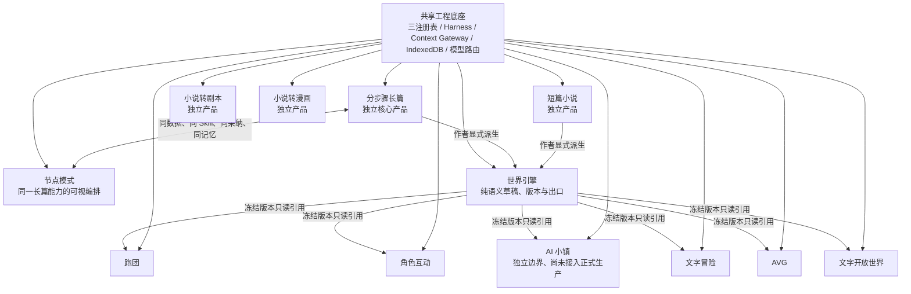
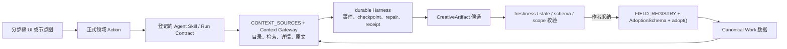
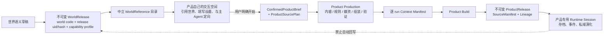

# StoryForge 当前架构清场审计

> 版本：2.2.0
> 审计基线：2026-09-04 当前硬切换工作树
> 权威层级：L4（代码事实与治理证据）
> 裁决依据：`PROJECT-MASTER-CHARTER.md` 1.5.0、三个核心注册表、当前 schema、正式入口与自动检查器

## 1. 审计结论

StoryForge 的现行架构已经收口为“独立创作产品 + 世界引擎 + 上层衍生产品 + 共享工程底座”，不存在仍可从正式页面切回旧 Game/Simulation 协议、旧产品身份、旧世界 reader、可变世界直启 runtime、手写世界表清单或第二套节点生成后端的路径。通用 Workspace/Work/Scope 能力也已从 `world-engine` 命名空间迁入中立 `workspace` 层，独立作品不再在模块依赖上伪装成世界引擎子功能。LocalWorkspace 根进一步完成硬切分：`Project` 仅为工作区壳，全部作品元数据和活动叙事计划由 `Work` 单独拥有，旧镜像读写与导入 fallback 已删除。

本次清场所说的“删除旧架构”，采用以下可验证边界：

- 正式业务源码、类型、页面、Store、service、路由、表注册、AI 入口和现行文档只允许当前协议；
- Dexie 只声明当前 schema v1，不声明或执行任何前代数据库升级链；
- 旧数据库、旧备份、旧字段和旧输出别名一律明确拒绝，不做双读、补字段、猜测转换或静默降级；
- 评测需要的基线方案属于测量工具，不得成为生产候选、写入或运行入口；
- Git 历史与 WPS 过时归档负责追溯，当前文档库不再保存互相竞争的旧方案。

因此，本交付是明确的硬切换：只支持由当前代码创建或通过当前严格导入契约验证的数据。旧浏览器数据库不会被当前应用自动打开、升级或改写；需要历史取证时只查看 Git/WPS 归档，不把历史结构重新带回产品代码。

## 2. 审计方法

本次不是按文件名抽查，而是双向建立完整关联闭包。

### 2.1 自上而下

从总纲产品地图出发，逐项核对：

1. 用户能进入什么产品；
2. 产品属于独立创作、世界引擎，还是上层产品的交互/生产/运行阶段；
3. 数据和媒资由谁拥有；
4. 是否需要不可变 `WorldReference`；
5. 入口最终调用哪个 Agent、Skill、Harness、service 与 runtime；
6. 页面是否可能绕过阶段闸门或恢复已退役身份。

### 2.2 自下而上

从 schema 和三注册表出发，逐表、逐来源、逐字段核对：

1. `PROJECT_TABLES` 是否覆盖导出、导入、删除、迁移、作用域和引用重映射；
2. `CONTEXT_SOURCES` 与 Context Gateway 是否是正式 AI 读取的唯一来源；
3. `FIELD_REGISTRY`、`AdoptionSchema` 与 `adopt()` 是否是 AI 正式写入的唯一入口；
4. WorldRelease 是否只包含世界语义表；
5. Product Production、Build、Release、Media、Runtime 是否具有产品 owner；
6. durable run 是否保存 contract、manifest、checkpoint、stale、repair 和 receipt；
7. 当前物理表是否仍被旧 service、旧 Store 或旧类型访问。

### 2.3 交叉反例

重点搜索并阻断：旧 Game/Simulation 协议、旧产品枚举、世界底表直读、运行结果回写世界、产品媒资进入世界、世界草稿直启运行、节点通用生成回退、固定相邻步骤执行、旧内容字段重新写入、独立作品自动世界化、缺少 owner 的记录以及可关闭正式可靠性链的开关。

## 3. 当前唯一产品地图

用户可见的文字游戏分类只有文字冒险、AVG、文字开放世界。状态推演只是文字开放世界等产品可使用的内部能力，不再拥有产品身份、页面、Production、Release 或 Session。

## 4. 当前唯一运行主链

### 4.1 独立长篇与节点

节点模式只编排与分步骤相同的正式领域 Action。官方模板的世界来源已经明确拆成世界基础、地理、历史、世界规则、故事、角色、关系、主支线、大纲、细纲和正文等节点；正式节点缺少绑定时必须失败，不能退回通用 `chat()`。实验节点只能生成草稿，不能直接采纳 Canon。

分步骤正文不存在组件私有的手写来源清单。正文的读取声明来自 `prose` Skill，Context Gateway 根据注册源执行渐进式披露，其中包括 `activeNarrativeBlueprint`；组件只能增加作者指令，不能重新拼装第二份 Canon 上下文。

### 4.2 世界引擎到上层产品

世界引擎统一的是版本化资源协议，不是固定数据包。当前出口为：

- `describe`：说明冻结世界具有什么能力和资源目录；
- `search`：按产品目标寻找相关资源；
- `read`：按稳定 resource key 和深度读取摘要、聚焦详情或完整内容；
- `readOriginalEvidence`：在需要核查事实、细节或伏笔时读取冻结原文证据。

跑团、角色互动、文字冒险、AVG、文字开放世界分别拥有需求适配器。适配器把用户目标转换成稳定必读、建议/选读、条件读取和禁止读取，随后冻结为 ProductSourcePlan。产品不能查询世界物理表，也不能把自己的字段清单塞回世界网关。AI 小镇只有产品边界，尚无专用适配器和生产/runtime 契约，因此默认隐藏且不得借用其它产品身份。

## 5. 数据所有权与不可跨越边界

| 数据 | 唯一 owner | 可以流向 | 禁止流向 |
|---|---|---|---|
| 长篇/短篇创作内容 | 独立 Work | 本产品下游；作者显式派生世界 | 自动获得公共世界身份 |
| 世界语义草稿与 WorldRelease | World | 经中立协议只读给上层产品 | 产品媒资、session、玩家状态、自动运行回写 |
| Product Brief / SourcePlan / Production / Build | Product instance | 对应 ProductRelease | 世界引擎或其它产品实例 |
| 发布媒资 | Product Production/Build/Release | 对应产品运行 | 世界引擎、无 owner 共享区 |
| 运行时媒资、事件、记忆与存档 | ProductRuntimeSession | 同一 session 与后续显式演化 | 世界引擎、另一用户/session |
| Agent 候选 | 明确 Work 或 Product runtime/run | 通过验证和人工采纳进入 owner 数据 | 直接写 Canon、跨 scope 覆盖 |

`Project` 现在只是本地 Workspace 物理容器；公共世界身份只存在于 `World`，独立作品身份只存在于 `Work`，上层产品身份只存在于 Product Production/Release/Runtime 根。不能再从“某行存在”推断产品身份。

## 6. 已删除或封死的旧架构

本轮清场已完成：

- 删除 `game-production`、`game-platform`、`narrative-simulation`、旧 `simulation` 目录及其旧类型、页面和 Store；
- 将现行生产统一命名为 Product Production/Build/ProductRelease/RuntimePackage，并把平台设施迁入 `product-platform`；
- 删除故事游戏、聊天游戏、文字模拟、文字世界等旧产品身份和入口，文字游戏只保留三类；
- 删除上层产品直接解码 WorldRelease、专用世界 reader、跑团专用目录和 shadow/双读网关；
- 删除世界页面绕过 Brief/SourcePlan/ProductRelease 直接创建 runtime 的路径；
- 删除旧 Product/World 身份镜像、兼容 scope 旁路和运行候选绑定；
- 删除 Project 对 Work 标题、简介、流派、状态、字数、封面、文风、方法论和活动叙事计划的镜像；创建、更新、上下文、导入导出及 WorldRelease 物化均按 owner 单轨处理，并由架构检查器锁定字段闭集；
- 把 Workspace 创建、作品分类、作用域、owner 迁移与生命周期移入中立 `src/lib/workspace`；`src/lib/world-engine` 只剩世界派生、语义、封存、引用和世界包职责；
- 删除产品侧对 WorldRelease 物理 Provider 的依赖；产品只能调用 `world-release-client` / Context Gateway 中立协议，且确定性编译必须携带作者确认的精确 selection 与匹配的 WorldReference hash；
- 删除 Product Runtime 对可变 `worldGroups` 的存在性查询；运行只依赖已验证 Build/ProductRelease 的冻结来源，`worldGroupId` 仅作为产品内部投影标记，不能被解引用为实时世界事实；
- 删除世界观旧混合字段、运行时降级读取与旧字段投影；非当前结构在读取或导入边界明确失败；
- 删除依赖步骤数组相邻关系的工作流降级，PromptWorkflow 必须持久化显式 DAG；
- 删除节点模式的第二套通用生成/直接写入路径，正式节点只能调用登记的领域能力；
- 删除可关闭 Creative Reliability 正式链的设置和运行分支；正式故事线、大纲、正文与节点执行始终经过当前候选、证据和验证协议；
- 删除旧权威审计和分支流水文档；当前文档库只保留文档权威白名单。
- 修复新建/导入第二个世界时由异步投影覆盖用户选中态的竞态；当前以 Workspace 根身份保持选择，投影只负责展示，不再反向夺取选择权；
- 为世界版本发布建立显式刷新信号，分享面板在同页发布后立即读取最新不可变 Release，不再依赖组件重挂载；
- 正式 AI GM 的浏览器验收模拟器也必须返回当前四字段闭集及完整 `GmSynthesisFrame`，测试不再通过旧形状绕过真实 Harness 契约；
- `App.tsx` 的真实路由集合与本架构文档建立自动一致性检查，已删除文档中不存在的 `/projects` 入口。
- 删除全部前代 schema migration 源码、迁移测试和旧导出样本；当前应用只打开 `storyforge-core` 的唯一 schema v1，不触碰旧数据库。
- 把 schema 校验和三注册表校验放在 Store 初始化之前的顶层启动闸门；任一不一致均显示致命启动错误，生产环境不再 fail-open。
- 语义文件工作区只读取并校验当前 Workspace/World/Work 身份；缺失、重复或格式错误时直接停止，不再生成、补写或借用活动 Work。
- 章节、故事核心和创作规则的文件候选必须解析到其精确 Work owner；章节缺少 `workId` 不再回退到 `activeWorkId`。
- 导入时对 Project/World/Work 根执行字段闭集、唯一性和稳定代码验证；多余旧字段、旧 World 代码或非 UUID Work 代码在写库前被拒绝。
- 删除未在 `OutlineNode` 当前类型、schema 和注册表中声明的伪 `locked` 字段读取与伪测试；不允许用“向前兼容”绕过字段闭集。
- 删除旧状态卡迁移谓词、不可见的旧作品学习路由别名和旧多世界迁移符号；当前操作只表达“启用多世界”和“将未归属记录明确分配给主世界”。

## 7. 历史能力硬切换

当前仓库不保留旧 schema、旧迁移执行器、旧格式夹具或旧字段规范化器：

- `src/lib/db/schema.ts` 只声明唯一当前 schema v1；
- `src/lib/migrations/` 与 `tests/migrations/legacy/` 不存在；
- 导入边界只接受当前备份版本、当前字段和当前引用关系；
- 旧数据库、旧备份、旧字段、缺失 owner/identity 以及非当前结构必须返回明确错误；
- 禁止为“先打开再说”恢复默认值填充、字段 alias、双读或隐式迁移。

以后若当前 schema v1 发生正式演进，必须针对届时仍受支持的当前版本另立设计与验证；这不构成恢复本次已删除的前代架构。

## 8. 当前能力与后续产品开发

### 8.1 已形成的架构基线

- 分步骤长篇保持独立，世界观、故事、角色、主支线、大纲、细纲、正文及章后演化走 durable Harness；
- 渐进式上下文具备目录、摘要、按需详情、原文回查、manifest 和预算证据，已设 10 万、30 万、100 万字符工程规模门；
- 节点模式与分步骤模式共享领域后端，关键世界语义来源已显式进入官方图；
- 长篇/短篇可由作者显式派生世界，剧本/漫画不会被自动世界化；
- 世界封存、能力画像、中立资源出口、多世界关系、纯语义边界和不可变引用已建立；
- 上层五项逻辑交接契约、五个现行产品需求适配器、统一生产/发布框架和产品专用 runtime 边界已建立；
- 媒资精确归属 ProductRelease 或 ProductRuntimeSession，不属于世界引擎；
- 产品目录明确 released/preview/experimental，未完成产品不能借已有页面冒充完成。

### 8.2 仍需在具体产品分支完成的内容

以下不是架构漏洞，也不应在共享底座中提前做成万能功能：

- 节点模式完整跨模式编辑、故障恢复与真实 UI E2E；
- 短篇独立体验和导出；
- 小说转剧本的大规模映射、专业格式、审校与交付；
- 小说转漫画的真实生图、人物一致性、漫画语言、排版和成品导出；
- 跑团的完整生产体验、多人权限、AI KP 长期运行和真实体验；
- 角色互动的长期记忆、多人导演与角色可见性；
- AI 小镇的独立时间、地点、日程、群体和离线演化系统；
- 文字冒险、AVG、文字开放世界各自的玩法、媒资、结局与产品级验收；
- 网站、账户、云同步、社区、市场和商业化。

这些分支必须服从同一产品身份、三阶段、世界只读、媒资归属、五项交接语义、三注册表、版本谱系和验证闸门，但可以拥有完全不同的表、Agent、Skill、玩法与 UI。

## 9. 防回退自动闸门

当前 CI 的架构层至少要求：

- 现行业务树不得出现退役协议、旧产品身份、旧目录导入或旧表访问；
- 世界引擎不得依赖上层产品、媒资或运行表；
- 上层产品不得解码物理 WorldRelease 或直读世界表；
- 上层产品不得导入 WorldRelease 物理 Provider；世界语义表集合从 `PROJECT_TABLES.worldSemantic` 派生并逐文件禁止直读；
- 中立 `workspace` 层不得反向依赖世界引擎或任一具体产品，旧 `world-engine/{scope,ownership,works,...}` 路径不得恢复；
- ProductSourcePlan 必须冻结 adapter、permission、WorldReference 与咨询证据；
- 正式 runtime 必须绑定可验证 ProductRelease 或统一 Build Preview，不能从世界草稿启动；
- 世界语义表、上层媒资表和 runtime 表的 owner/生命周期必须由 `PROJECT_TABLES` 登记；
- PromptWorkflow 必须使用显式 DAG；
- 官方节点模板必须绑定正式领域 Action；
- Creative Reliability 不得存在生产关闭开关或旧协议回退；
- 当前文档必须进入唯一白名单，链接到已删除旧文档会让检查失败。

## 10. 验证记录

本审计最终以同一工作树上的以下验证为准：

| 验证 | 目的 | 最终结果 |
|---|---|---|
| `npm run check:architecture` | 产品边界、旧协议、阶段、所有权、路由文档和节点同源 | 通过；正式树未检出退役架构入口 |
| `npm run check:required-tables` | schema 与 PROJECT_TABLES 生命周期闭合 | 通过；唯一 schema v1 与 94 张登记表一致 |
| `npm run check:ai-manual` / `check:ai-entry-registry` | AI 入口与说明同源 | 通过；36 个登记 binding 覆盖 40 个调用点 |
| `npm run check:docs` / `check:roadmap` | 当前文档唯一权威，无失效链接 | 通过；25 份现行文档进入权威清单 |
| `npx tsc --noEmit` / `npm run lint` / `npm run build` | 类型、静态质量与生产构建 | 通过；生产 bundle 大小闸门通过 |
| `npm run ci` | 全部静态闸门、生产依赖审计、Lint、类型、覆盖率、构建与包体 | 通过；499 个测试文件、2436 项测试全部成功；语句/行覆盖率 83.25%，分支 71.52%，函数 80.70%；生产构建及包体闸门通过 |
| `PLAYWRIGHT_USE_SYSTEM_CHROME=1 PLAYWRIGHT_FROZEN_WORKSPACE=1 npm run ci:e2e` | 隔离浏览器真实用户路径 | 通过；系统 Chrome 62/62，耗时 8.3 分钟 |
| `npm audit --omit=dev` | 生产依赖已知漏洞 | 通过；0 项生产漏洞 |

覆盖率运行仍会输出少量已知 React `act(...)` 测试告警和故障注入场景的预期错误日志；它们没有造成失败，但也不被本审计误写为“无告警”。这些是测试清洁度改进项，不是旧架构入口或产品功能失败。

如果任何一项失败，本文件不得把相应能力写成“已验证”；必须记录根因并修复或明确降级能力状态。

## 11. 最终裁决

当前架构的下一步不是再造一套“更新版总架构”，而是在这条基线上开发具体产品。以后只有以下变化需要重新打开项目级架构：

1. 产品边界或三阶段关系发生根本变化；
2. 世界引擎需要新增跨产品语义能力或权限模型；
3. 三注册表、不可变版本、所有权或数据生命周期需要升级；
4. 新技术证明当前 Context Gateway/Harness 无法满足目标，需要更换底层协议；
5. 真实故障证明现有架构闸门存在未覆盖的系统性漏洞。

单个产品缺功能、体验不足、模型输出不好或需要新增专用 Agent，均应在对应产品分支迭代，不再通过改写世界引擎或复制共享体系解决。
