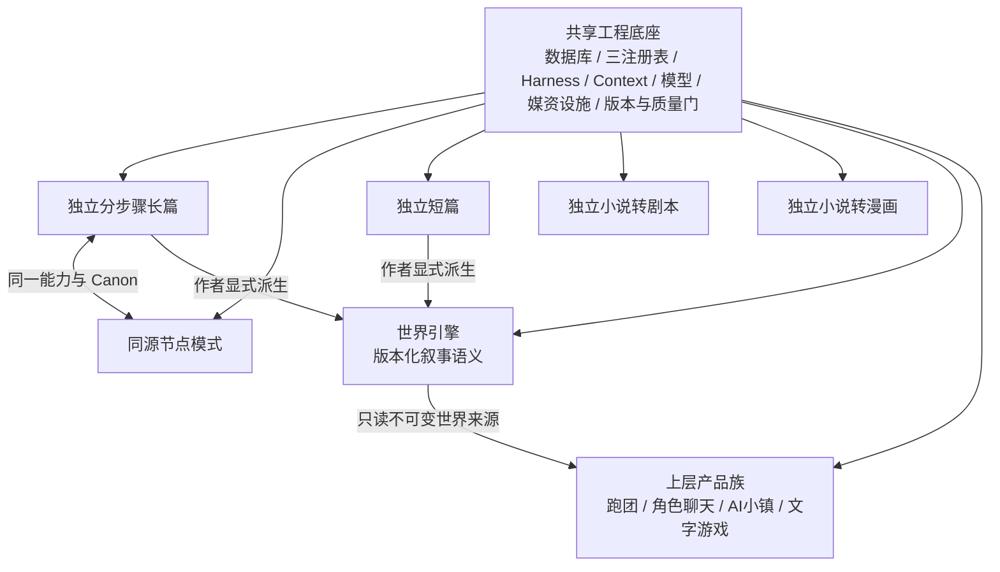
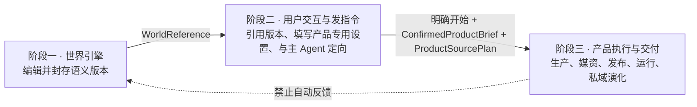
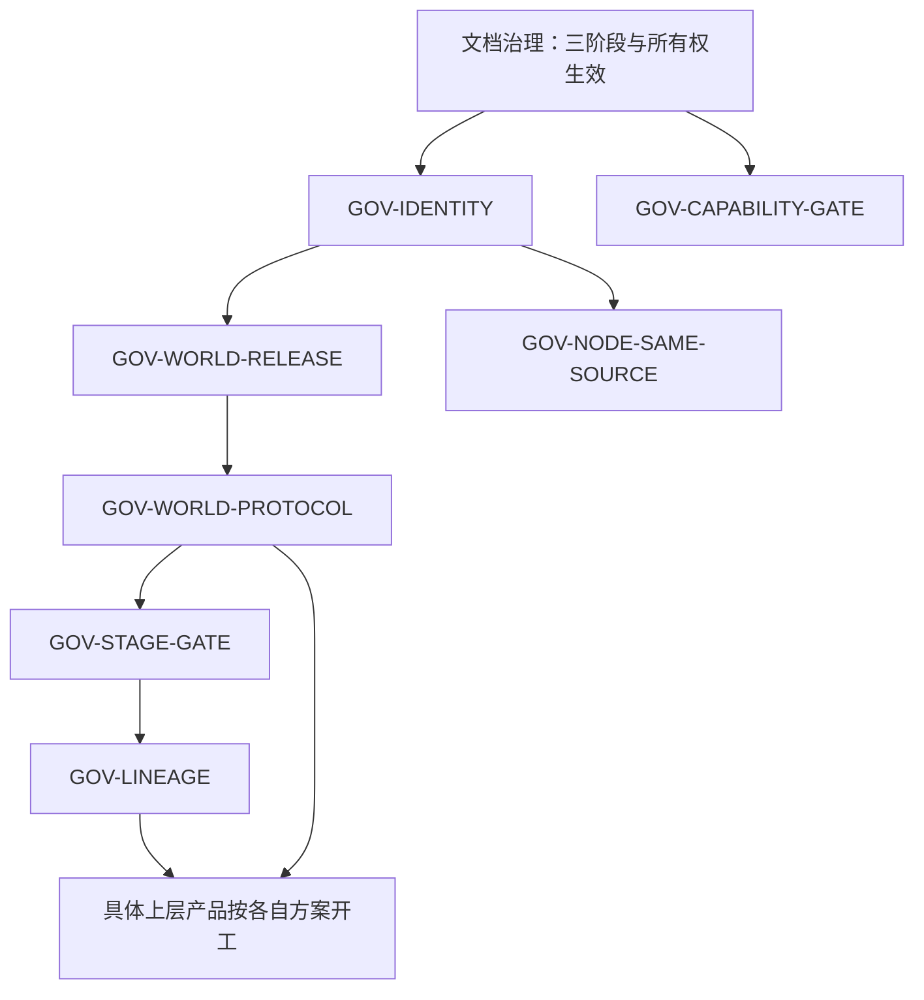

# StoryForge 项目架构治理对齐审计

> 审计版本：3.2.0<br>
> 复审日期：2026-09-02<br>
> 对照权威：[StoryForge 项目总纲](../PROJECT-MASTER-CHARTER.md) 1.3.0<br>
> 审计对象：当前架构治理交付树的产品边界、所有权、阶段流转、版本与共享协议<br>
> 状态：ARCH-01～07 的项目级纠偏已关闭并进入代码、检查器与回归；本文件不把短篇、剧本、漫画、跑团、聊天或文字游戏的专项功能误报为已经完成

## 1. 为什么重做审计

1.0.0 审计发现的代码证据仍然有效，但把三种不同层次混在了一份“项目问题”清单里：

1. 项目级架构冲突，例如独立作品被自动世界化、WorldRelease 混入上层内容、世界入口绕过产品阶段直接运行；
2. 具体产品尚未完成，例如短篇独立体验、剧本/漫画闭环、跑团或聊天纵切面；
3. 产品质量认证，例如真实百万字长篇验证、某类游戏的体验规模与结局设计。

这种混合会让后两类工作被误认为 StoryForge 必须先统一实现的“总架构”，进而诱发万能表、万能 Agent 和万能 Product Contract。复审后的原则是：

> 总架构只规定各产品怎样进入共同框架、数据怎样流转以及哪些边界不能跨越；具体产品怎样做，等该产品开工时专项分析。

因此，本审计保留架构冲突，转交产品实现与质量事项，不再用总体审计替代产品设计。

2.1.0 进一步纠正了另一类口径错误：Phase 5 已经完成分步骤长篇主体、真实 API 纵切面和百万字符工程规模门，不能因长期作者质量研究尚在继续，就把种族字段推广、完整 Harness、持续演化和长程记忆重新列为待施工功能。3.0.0 则记录七项架构纠偏与世界引擎基础闭环的实际关闭证据。3.1.0 进一步完成旧世界 reader 清场，并把五套交接契约、逐 run 来源证据、GameRelease v3 身份链和正式 session 事务边界收口到同一产品生产纵切面，使后续产品分支可以从同一稳定基线开工。3.2.0 再消除确定性编译器的隐形重读：Gateway 与 RuntimePackage 编译共用“选择 + 语义依赖”闭包，并把每个实际输入先冻结为原文级 run 证据；同时删除跑团仅试玩、禁止正式发布的旧入口闸门。

## 2. 审计边界

### 2.1 本次审计负责

- 独立产品、世界引擎、上层产品和共享底座的身份边界；
- 世界引擎衍生产品的“三阶段主链”；
- `Project / World / Work / Product draft / Production / ProductRelease / Runtime` 所有权；
- 跨阶段交接物、显式授权、不可变引用、版本谱系与禁止回写；
- 中立世界资源协议与产品专用需求适配器；
- 长篇分步骤与节点模式必须同源；
- 实验能力、平台能力和正式产品入口的阶段门控；
- 三注册表、schema、迁移、导入导出、删除与架构回归如何承载上述规则。

### 2.2 本次审计不负责

- 跑团的车卡、规则、KP、分队或信息隔离具体如何实现；
- 角色聊天、AI 小镇或某类文字游戏的 Agent 组织与玩法设计；
- 产品应使用小时、章节、回合还是其他规模单位；
- 某产品是否必须有结局以及怎样形成结局；
- 剧本、漫画、短篇和长篇的产品级完整功能方案；
- 文学质量、游戏好玩程度或真实百万字创作是否已经通过认证。

这些事项继续存在，但必须进入对应产品契约、路线图和专项验收，不能被列为通用架构缺陷。

## 3. 目标架构

### 3.1 产品全景边界



独立长篇等产品不经过世界引擎也必须完整可用。作者可以把长篇或短篇已确认内容显式、一键派生为世界草稿/版本而无需复制粘贴；该动作保存来源快照，不改变源作品 owner，也不建立自动同步。小说转剧本、小说转漫画当前不提供这条派生路径。上层产品可以引用世界，但世界不成为它们的 production、媒资或 runtime 容器。

### 3.2 世界衍生产品的三阶段主链



阶段二不是世界引擎的一部分，也不是可以省略的过渡页面。用户在那里配置的是某一个具体产品；阶段三何时迭代、怎样结束，则由该产品内部设计决定。

### 3.3 架构交接契约

| 逻辑契约 | 必须表达 | 所有者 | 不允许 |
|---|---|---|---|
| `WorldReference` | world code、不可变 release ID/hash、能力身份 | 世界引擎 | 用可变 Project/草稿版本代替 |
| `ProductSourcePlan` | 锁定世界版本、需求适配器/版本、需求、权限、缺失策略与咨询 Context Manifest refs | 产品草稿/production | 未开始就假装预知全部实际来源；每个产品手写世界底表清单 |
| `ConfirmedProductBrief` | 产品类型、用户意图、产品专用配置、限制、revision、确认 | 产品实例 | 用一个全产品万能 `ExperienceContract`；未确认先生产 |
| `ProductSourceManifest` | production 各 run 实际读取/采用/缺失/冲突/遗漏的世界资源聚合快照 | product build/release | 超出 SourcePlan；追写旧 release；发布时未冻结 hash |
| `ProductReleaseLineage` | release/hash、父 release、source plan/manifest、brief/build/quality、兼容结论 | 产品实例 | 覆盖旧 release；运行随世界草稿漂移 |

这些是逻辑语义，不强制所有产品共用相同物理表。架构验收的是每个产品都能映射和追溯，而不是它们的数据内容完全相同。它们也不是五份都由主 Agent 自由撰写的文本：系统生成/校验 WorldReference；主 Agent 可起草 Brief/SourcePlan，用户确认 Brief、系统校验 plan；SourceManifest 从真实 run manifests 聚合；lineage 由发布系统按父版本、build、quality 和兼容证据生成并冻结。

### 3.4 世界资源统一协议

统一世界出口的正确含义是 **协议统一、需求与结果按产品变化**：

```text
产品目标与专用配置
→ 产品自己的 WorldRequirementAdapter
→ describe/search/read 指定 WorldRelease
→ matched / missing / conflict / omitted / insufficient
→ 用户开始时冻结 ProductSourcePlan
→ production 每个 run 渐进读取并保存 Context Manifest
→ ProductRelease 聚合并冻结 ProductSourceManifest
```

网关统一版本、寻址、resource ID、来源、权限、充分性、渐进披露和遗漏语义。它不返回一份覆盖所有产品的固定 payload。每个产品适配器可以确定稳定必读、建议/选读、条件读取和禁止读取；类型化代码/schema 约束版本、权限和硬边界，Skill/Prompt 可辅助把开放式用户目标转成语义查询。用户开始时只能冻结世界版本、需求与读取规则；Agent 在该不可变版本内继续发现和读取资源，每个 run 保存不可变 Context Manifest，发布时才形成聚合 source manifest。runtime 后续读取归 session/run，不改写旧 release。新产品接入时增加产品需求适配器和必要资源登记，不修改一个不断扩张的中心清单。

### 3.5 不可破坏的架构不变量

1. 独立作品不会仅因存在内部 `World/Work` scope 就自动成为可分享世界；长篇/短篇只有在作者显式派生时才产生世界草稿/版本，且源作品保持独立。
2. `WorldRelease` 只包含世界叙事语义、目录、能力画像和证据，不包含产品媒资、production、build、session 或运行状态。
3. 正式上层运行必须经过产品阶段二和阶段三，世界页面不能直接创建 runtime。
4. 正式生产绑定不可变 WorldRelease 和 SourcePlan；正式运行绑定不可变 ProductRelease。运行若仍需查询世界，只能沿 ProductRelease 继承的 SourcePlan 读取同一不可变 release，并把证据写入 session/run manifest，不能修改 release manifest。
5. 上层产品拥有自己的设置、补充内容、媒资、运行和演化；任何自动回写世界均禁止。
6. 世界资源协议不暴露底表，也不要求不同产品读取相同 payload。
7. ProductRelease 的升级和演化创建新版本，有父版本与兼容证据；旧版本和旧存档可继续定位。
   产品目标、配置、世界版本、资源需求或读取权限变化时，同时创建新 Brief/SourcePlan，不能改写旧 plan。
8. 节点模式和分步骤长篇共享 Canon、Skill/Harness、Context、Adoption 与生命周期；节点可以更自由、更细粒度、更可视和可组合，但不能以自由度为由建立平行后端。
9. 未完成或发展顺序后置的能力默认实验性门控，不以页面存在宣称正式产品。

## 4. 已有能力与保留裁决

| 能力 | 当前裁决 | 架构意义 |
|---|---|---|
| 三注册表 | 保留并继续作为代码单一事实源 | 能承载世界资源、产品 Brief/候选和表生命周期治理 |
| durable Harness | 保留，不重造 runner | 已有 contract、checkpoint、stale、repair、receipt 基础 |
| Context Gateway | 保留并扩展 immutable WorldRelease provider | 已具备目录、检索、详情/原文和遗漏证据模型 |
| Canon/事实/关系/时间与长程记忆 | 保留 | 独立长篇与世界语义资源均可复用，但 owner 必须分开 |
| 分步骤长篇 Phase 5 主链 | 已完成并保留，不重复施工 | 世界观/故事/角色/主支线/大纲/细纲/正文/持续演化、真实 API 纵切面与百万字符工程规模门已有证据 |
| 节点 DAG、运行与采纳 | 保留 | 需要消除官方节点通用生成 fallback，而不是重建节点系统 |
| World code/release/hash | 保留并升级语义边界 | 已有版本基础，可兼容迁移为纯世界 release |
| product production/build/runtime 设施 | 保留为产品侧基础 | 不迁回世界；是否足够由各产品专项验收 |
| 改编、媒资和上层产品表 | 保留且按 owner 整理 | “代码已存在”不等于具体产品完成，也不构成架构删除理由 |

StoryForge 不需要推倒重构。需要的是把已经存在的底座收口到稳定边界，并为旧数据建立增量迁移。

## 5. 修复前架构偏差总览（现均已关闭）

### 5.1 严重度

- **P0**：继续开发会扩大错误 owner、release 或阶段边界；新功能前必须处理。
- **P1**：不立即污染数据，但会持续产生平行协议、入口绕行或架构漂移。

### 5.2 清单

| ID | 严重度 | 修复前偏差 | 目标不变量 | 当前状态 |
|---|---|---|---|---|
| ARCH-01 | P0 | 每个 Project 被自动赋予并投影为世界身份 | 独立作品与可分享世界显式分离；长篇/短篇可显式一键派生世界 | 已关闭 |
| ARCH-02 | P0 | WorldRelease 打包策略允许产品内容、AVG 媒资和运行模块进入世界 | WorldRelease 纯语义、产品数据完全外置 | 已关闭 |
| ARCH-03 | P0 | 世界页面可以绕过产品交互/生产阶段直接创建诊断 runtime | 所有正式运行经过三阶段交接 | 已关闭 |
| ARCH-04 | P1 | 顶层入口仍可能用可变 `Project.worldVersion` 表达绑定；跨产品 release 谱系没有共同治理闸门 | WorldReference 与 ProductReleaseLineage 可验证 | 已关闭 |
| ARCH-05 | P1 | 各产品拥有不同需求是正确的，但当前还各自解析 WorldRelease/table selection | 产品专用必读/选读/条件规则 + 中立可靠读取网关 + source plan/run/release manifests | 已关闭 |
| ARCH-06 | P1 | 部分官方节点仍回退通用 `chat()`，没有逐能力复用分步骤正式路径 | 节点作为更自由的可视编排超集，同时与分步骤后端同源 | 已关闭 |
| ARCH-07 | P1 | 世界能力画像混入 runtime/assets；产品成熟度又缺少统一入口门控 | 07A 世界语义能力边界与 07B 产品发布状态门分别治理 | 已关闭 |

## 6. 修复前证据与已实施架构包

### ARCH-01 · 产品身份与世界身份混合

**证据**

- `src/pages/ProductHubPage.tsx` 的 `projectToWorld()` 把 Project 投影为产品世界。
- `src/lib/product/world-identity.ts` 的 `ensureProjectWorldIdentity()` 为 Project 补 world code/version。
- `src/lib/world-engine/create-workspace.ts` 同时创建 Project、World、Work；内部 scope 结构随后被 UI 当作可分享世界身份。

**架构修复包 `GOV-IDENTITY`**

1. 定义内部 workspace scope、独立作品、世界草稿、可分享世界四类身份，禁止用“存在 World 行”推断产品身份。
2. 创建命令按产品 owner 分开；只有显式创建/发布世界才生成公共 world code。
3. 为长篇、短篇提供“基于作品创建世界草稿”和“封存为世界版本”的一键入口，自动选取/投影已确认内容并保存 source work、revision、范围和 hash；不移动源作品、不自动同步。
4. 小说转剧本、小说转漫画继续保持独立，不获得隐式世界身份或封装入口。
5. 世界列表只读取显式世界身份，不再对全部 Project 做投影。
6. 旧 Project 先生成只读分类报告；歧义项由用户确认，默认保留为独立作品。
7. 通过 `PROJECT_TABLES` 派生导出、导入、删除、复制和 ID 重映射，并验证两个 owner 互不误删。

**关闭条件**：创建任一独立作品不新增共享世界；长篇/短篇显式派生无需复制粘贴且得到可追溯草稿/release；源作品后续修改不改变旧世界；剧本/漫画保持独立；旧数据无损且来源关系可追溯。

### ARCH-02 · WorldRelease 边界污染

**证据**

- `src/lib/registry/project-tables.ts` 的多张产品/AVG/运行相关表使用 `communityShare: 'world'`。
- `src/lib/world-engine/releases.ts` 的 `buildWorldReleaseManifest()` 以该标记筛选发布集合。
- 同文件的 portable release 构建包含 AVG blob 特例，说明产品媒资已经进入世界包语义。

**架构修复包 `GOV-WORLD-RELEASE`**

1. 把“世界语义可封存”“产品可分发”“绝不打包”拆成不同注册元数据，不能继续复用一个含混标志。
2. 新一代 WorldRelease 仅从世界语义资源注册表派生，包含能力画像、资源目录、稳定 ID、来源与 hash。
3. 对旧 release 兼容读取并执行影子分类：世界语义进入新 release 候选；产品数据/媒资进入相应产品迁移候选，任何一侧都不得静默丢弃。
4. 建立包内容白名单、owner 反例、体积预算、hash 和导入往返门。

**关闭条件**：任何新 WorldRelease 不含 product production/build/media/session/runtime；旧包可读取、分类、迁移和恢复。

### ARCH-03 · 三阶段可以被绕过

**证据**

- `src/components/world-engine/WorldNarrativeReleasePanel.tsx` 可从 WorldRelease 直接创建 `chatgame/NPC` 诊断实例。
- `src/components/world-engine/WorldEngineWorkspace.tsx` 同时承载世界 release 与上层 runtime/状态展示。

**架构修复包 `GOV-STAGE-GATE`**

1. 世界页面只保留编辑、诊断、封存、比较和“转到某产品”的 handoff；handoff 只传 WorldReference。
2. 结构诊断必须是只读/内存/测试命名空间，不能产生正式 product/session 行。
3. 所有正式 product production 入口验证 ConfirmedProductBrief、ProductSourcePlan 和用户开始授权 revision。
4. 所有 runtime 启动验证不可变 ProductRelease；世界 release 不能直接充当运行包。
5. 用架构扫描和 E2E 阻止新的跨阶段快捷入口。

**关闭条件**：世界封存和诊断零写入产品表；未经产品设置与用户开始不能生产；没有 ProductRelease 不能启动正式 runtime。

### ARCH-04 · 不可变来源与产品谱系未形成共同闸门

**证据**

- `src/pages/ProductHubPage.tsx` 的顶层 `BindingBanner` 来自 `Project.worldCode/worldVersion`，可能让可变草稿版本冒充锁定来源。
- 深层跑团、角色互动和游戏生产已经大量使用 `worldReleaseId/contentHash`，证明无需推倒重建；缺口在顶层 handoff 和跨产品共同不变量。
- 不同产品各自表达 parent build/release 或升级候选，尚无项目级检查保证每个正式 ProductRelease 都保存完整 lineage。

**架构修复包 `GOV-LINEAGE`**

1. 统一逻辑 `WorldReference` 校验：release ID/hash 必须同时匹配；UI 不能用草稿 version 替代。
2. 统一逻辑 `ProductReleaseLineage` 最低字段和检查器；物理 schema 可产品专用。
3. 变更 Brief、来源世界、资源需求/权限或旧 ProductRelease 时创建新 Brief/SourcePlan/production/release，不原地覆盖。
4. runtime 升级必须显式兼容检查；未升级实例继续读取旧 ProductRelease。

**关闭条件**：从入口到 runtime 可追溯 WorldReference → source plan → Brief → run Context Manifests → release SourceManifest → build → ProductRelease → parent/compatibility，且世界草稿变化不改变已有链。

### ARCH-05 · 产品需求应独立，但底层世界解析不应复制

**证据**

- `src/lib/context-gateway/world-release-provider.ts` 是唯一中立世界语义 provider，产品代码不再解析物理 manifest。
- `src/lib/game-production/source-contracts.ts` 把用户确认的 Brief 与产品需求适配器编译为冻结 SourcePlan；Scheduler 对模型任务与确定性集成任务使用同一网关和证据边界。
- `src/lib/game-production/world-source.ts` 让 Gateway 与 RuntimePackage 编译器共用选择/依赖闭包；确定性集成在调用编译器前必须为这些资源留下 original 读取证据。
- 跑团专用世界目录、角色互动旧生产线和旧 consultation source 已删除；架构检查器将其列入禁止恢复清单。
- 跑团的 Brief、生产、质量、GameRelease v3 和正式 runtime 已连成同一链，界面不再保留“仅供上层开发试玩”的旧禁止发布旁路。

**架构修复包 `GOV-WORLD-PROTOCOL`**

1. 为不可变 WorldRelease 实现中立 `describe/search/read` provider，复用 Context Gateway，不新建第四套上下文系统。
2. 定义产品需求适配器接口；先以跑团和角色互动两种不同需求建立参考适配器，后续产品分别声明自己的稳定必读、建议/选读、条件读取和禁止读取，不再新增对世界底表与 manifest 内部结构的直接依赖。
3. 允许适配器由类型化代码/配置与产品 Skill 协作，但版本、权限、必读、禁止和条件边界必须机器可校验，不能只靠提示词。
4. 网关返回 matched/missing/conflict/omitted/insufficient 和 provenance；用户开始时产品冻结 ProductSourcePlan，production 每个 run 保存 Context Manifest，ProductRelease 聚合并冻结 ProductSourceManifest；runtime 新证据归 session/run。
5. 先让至少两个需求明显不同的现有产品适配同一协议，以证明协议没有偷偷固化某一产品 payload；这不要求两个产品本身完成。
6. 旧产品 reader、兼容白名单和重复目录类型已全部删除；扫描器禁止任何上层产品恢复物理 manifest 解析、旧 source key 或产品专用世界目录。

**关闭条件**：产品新增需求只修改自己的 adapter/契约；网关无需新增万能字段；两个产品可从同一 release 得到不同且可追溯的 plan/run/release manifests；后续渐进读取不越过锁定版本和权限，也不改写旧 release。

### ARCH-06 · 节点与分步骤尚未完全同源

**证据**

- `src/lib/node-authoring/creation-chain.ts`、`executor.ts` 已有真实 DAG、stale 和受治理采纳基础。
- `src/lib/node-authoring/domain-execution.ts` 只覆盖部分领域动作；其余官方 `generate-field/generate-collection` 可回退通用 `chat()`。

**架构修复包 `GOV-NODE-SAME-SOURCE`**

1. 建立机器可校验的“分步骤 action ↔ Skill/Run Contract ↔ Context ↔ Adoption ↔ node type”映射。
2. 所有官方节点必须调用对应正式领域 action；通用节点只允许作为显式实验草稿且不能直接写 Canon。
3. 允许节点把一个标准步骤拆成检索、生成、验证、比较、采纳等更细节点，并允许用户替换、组合、分支和检查中间产物；自由度属于图层，不复制领域后端。
4. 架构检查器禁止官方模板落入通用 AI fallback。
5. 同一数据在两种入口的 revision、stale、刷新、采纳、导入导出和下游读取一致。

**关闭条件**：官方分步骤模板全部可由节点表达，删除通用 fallback 后仍可运行；用户可以安全地细拆和重组流程；不存在第二套 Prompt/DB/记忆体系。

### ARCH-07 · 世界能力边界与产品入口成熟度需要分别门控

**证据**

- `src/lib/world-engine/domain.ts` 的世界投影包含 `runtime`，并用 `assets` 表达部分语义实体，容易与真实媒体资产混淆。
- `src/pages/ProductHubPage.tsx` 暴露多个成熟度不同的产品和社区/市场入口；代码存在与正式可用状态没有统一机器边界。

**架构修复包 `GOV-CAPABILITY-GATE`**

1. **ARCH-07A · 世界能力边界**：世界能力画像只表达世界观、故事、角色、关系、物品、主支线、大纲、细纲、正文等语义域的覆盖、证据和冲突；移除 runtime，把语义 entity 与 media asset 分开命名。它不定义任何上层产品玩法。
2. **ARCH-07B · 产品入口成熟度**：项目级目录登记 `experimental/internal/preview/released` 等发布状态及进入条件；生产默认不展示未通过正式验收的入口。具体产品用什么标准升级状态，由该产品专项契约决定。
3. 平台、托管、社区和商业能力继续保留代码与安全维护，但阶段 F 前不得成为核心路径依赖。
4. 文档、导航、路由与 capability gate 由同一登记派生或检查，避免只改文案。

**关闭条件**：世界能力画像不包含上层 runtime/media；未完成入口默认不可见或明确实验性；页面存在不再等于产品已发布。

### 6.8 关闭台账

| ID | 已实施结果 | 主要机器证据 |
|---|---|---|
| ARCH-01 | `Project` 仅作物理容器；内部 scope、独立 `Work` 与显式 `world-draft` 分开。长篇/短篇可基于确认内容派生世界并冻结来源，剧本/漫画被确定性拒绝 | `world-engine/derivation.ts`、`ownership.ts`、`R-ARCH01-world-derivation.test.ts`、schema v85 迁移与生命周期登记 |
| ARCH-02 | WorldRelease 只从 `PROJECT_TABLES.worldSemantic` 派生确认语义资源，排除产品 production、媒资、build、可执行蓝图、session 和 runtime | `releases.ts`、`R-ARCH02-world-release-boundary.test.ts`、`R-WORLD2C-2F-completion.test.ts`、`R-WORLD2D-2F-runtime-closure.test.ts` |
| ARCH-03 | 世界 UI 不再提供正式运行快捷入口；所有正式上层 kind 被统一 runtime boundary 拒绝从 WorldRelease/通用 preview 启动 | `product/runtime-boundary.ts`、`world-engine/instances.ts`、`simulation/runtime.ts`、`R-ARCH03-stage-gate.test.ts` |
| ARCH-04 | 五项逻辑契约有确定性创建、hash 与验证；统一产品 Scheduler 按 run 保存 Context Manifest，发布系统聚合 ProductSourceManifest、生成 lineage 并冻结在 GameRelease v3，runtime 只允许从经过完整性验证的 release/build 创建 session | `game-production/source-contracts.ts`、`scheduler.ts`、`adoption.ts`、`runtime-package.ts`、`R-GAMEPROD1C-vertical-slice.test.ts` |
| ARCH-05 | 中立 WorldRelease provider 支持 describe/search/read/original evidence；所有产品由自己的 requirement adapter 生成不同 plan，网关不包含万能产品 payload；旧 reader 和兼容白名单已删除，检查器禁止恢复物理 manifest 解析 | `context-gateway/world-release-provider.ts`、`world-engine/product-requirement-adapters.ts`、`check:architecture`、`R-ARCH05-world-protocol.test.ts` |
| ARCH-06 | 官方节点 action 由机器登记映射至正式长篇领域后端；通用生成只允许实验草稿且不能采纳 Canon | `node-authoring/domain-action-registry.ts`、`domain-execution.ts`、`R-ARCH06-node-same-source.test.ts` |
| ARCH-07 | 世界能力画像限定十类语义域；产品目录登记成熟度、世界引用、媒资/runtime owner，生产只展示 `released` | `world-engine/domain.ts`、`product/product-catalog.ts`、`R-ARCH07-product-maturity-gate.test.ts` |

阶段 D 另由 `R-WORLD-D-phase-d-closure.test.ts` 验证诚实能力画像、missing/omitted 区分、多世界稳定关系，以及千级资源目录的检索、详情、原文、hash 与不可变性。`check:architecture` 将上述边界转为静态拒绝规则；新增产品不能绕开它们。

## 7. 从架构审计转交出去的事项

下表区分“已经完成但继续观察”和“未来由具体产品负责”，不得再次把它们塞回总体架构施工：

| 1.0.0 原事项 | 当前裁决/归属 | 继续保留的架构部分 |
|---|---|---|
| ALIGN-07 真实百万字验证 | 10万/30万/100万字符工程规模门与真实模型纵切面已完成；真实作者长期文学一致性归持续质量研究，不是功能 backlog | 长篇/节点 owner、三注册表与同源 Harness 仍受架构治理 |
| ALIGN-08 短篇完整独立产品 | `C-SHORT-01` 专项产品设计与交付 | 独立作品不能自动世界化，归 ARCH-01 |
| ALIGN-09 剧本/漫画端到端闭环 | `C-SCREENPLAY-01`、`C-COMIC-01` | 独立 owner、来源 manifest、媒资归属受总架构治理 |
| ALIGN-11 上层产品纵切面完成 | 阶段 E 各产品专项路线 | 三阶段、接入槽位、不可变引用与不回写受本审计治理 |
| ALIGN-14 规模、结束与持续体验 | 各产品的阶段二设置和阶段三运行设计 | 用户明确开始、Brief 版本、ProductRelease 谱系由总架构治理 |
| “种族与民族”及全字段推广 | races sealed 金切片、全部现有可生成世界观字段合同、故事/角色治理与 Phase 5 主链均已完成；未来仅按反馈补质量样本 | 节点入口复用同一 races/字段合同仍由 ARCH-06 验证 |
| 分步骤完整 Harness、持续演化与长程记忆 | Phase 5 已完成，不再进入本审计或路线图的待施工队列 | 未来新增字段/入口继续遵守三注册表与 Harness |

转交后，这些工作不得再被实现成跨产品万能表或万能 Agent。每个产品开工时以总架构的扩展槽位为外框，另写自己的需求、数据、Agent、运行和质量方案。

## 8. 施工依赖与顺序



以下施工批次已经按依赖顺序完成；保留它们是为了说明迁移为何没有被改成一次破坏性重构：

1. **身份与迁移基础**：先区分独立作品、世界和产品 owner，所有后续迁移才有可靠目标。
2. **纯世界 release**：迁移时先建立并验证新语义包与网关，等价证据通过后删除旧 reader；现行基线已完成删除，不再保留兼容路径。
3. **中立世界协议**：用两个不同需求适配器验证协议，形成 source plan、per-run Context Manifests 和发布 source manifest。
4. **阶段与谱系闸门**：收口顶层 handoff、显式开始、ProductRelease/runtime 绑定。
5. **同源与入口门控**：节点旁路、世界能力命名、实验产品可见性并行收口。
6. **产品专项开发**：框架稳定后，各具体产品独立设计和验收；这是后续产品工作，不属于本审计的完成范围。

该顺序不包含“重新完成分步骤长篇”。长篇主链已经完成；本次只修身份派生边界和节点同源。真实作者长期研究可以持续进行，但不使已关闭的七项架构纠偏倒退。

## 9. 迁移与兼容原则

- 现行业务代码只能走新架构；旧 reader、旧表访问、旧类型和双写旁路不得作为兼容层保留。Dexie 历史 schema 声明只用于识别旧库并执行一次性升级，不是可调用的产品架构。
- 不把旧 Project 自动公开为世界；歧义项默认保留为独立作品。能够可靠识别的旧数据通过事务性、可验证的单向迁移进入新 owner/契约；无法无损映射时保留可导出备份并明示阻断，不恢复旧运行路径。
- 迁移记录保留 schema、old→new ID、owner、source/release/media hash、冲突、跳过、失败和恢复证据；成功后当前表、导出、删除和运行入口只认新合同。
- 在隔离数据库验证新建、旧库升级、导出导入、删除、复制、引用重映射、失败回滚和恢复；不得使用作者当前浏览器项目做迁移试验。

## 10. 架构完成门

七项偏差只有同时满足以下证据才可关闭：

1. 总纲、开发宪法、数据治理、产品契约和路线图口径一致；
2. 三注册表完整表达新增 source、AI 候选写入和表生命周期；
3. 静态检查阻止世界包污染、世界直达 runtime、产品直读世界底表、官方节点 fallback 和未门控入口；
4. schema/迁移/导入导出/删除/复制/重映射正反例通过；
5. WorldReference、source plan、Brief、per-run Context Manifests、发布 source manifest、ProductRelease lineage 和 runtime binding 可从持久记录重放；
6. 至少两个不同产品需求适配器证明“同协议、不同 payload”，并证明生产期渐进读取仍受锁定 plan 约束，而无需完成这两个产品的全部功能；
7. 多用户/多产品引用同一世界时 owner 隔离，运行不回写，世界升级不静默改变旧产品；
8. 定向测试、`check:architecture`、`check:required-tables`、TypeScript、完整 CI、适用的隔离 E2E 和 `git diff --check` 通过。

这里的“完成”只表示 StoryForge 的大框架稳定：后续功能能够在正确阶段、正确 owner、正确版本和正确协议内开发。它不表示某个具体产品已经好用，也不替代产品自己的真实体验验收。

## 11. 最终裁决

StoryForge 当前没有必要再做一次大重构。已有 Harness、Context Gateway、三注册表、版本和产品设施可以继续使用。真正需要一次做稳的是以下骨架：

> 独立产品保持独立；世界只封存语义；世界衍生产品严格经过“世界来源 → 用户定向与发指令 → 产品执行与交付”；统一的是协议和治理，不是每个产品的数据内容与功能实现。

这套治理完成后，跑团、角色聊天、AI 小镇和各类文字游戏可以按各自需求分头开发，但必须把自己接入相同的身份、交接、来源、版本、媒资 owner、运行隔离和演化谱系。这样才能做到“齐头并进而不互相污染”，同时避免为了追求表面统一再次制造一个庞大而僵硬的单体系统。
