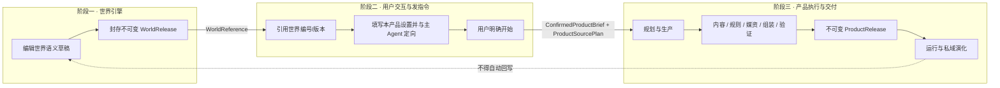

# 世界引擎上层产品跨产品架构契约

> 版本：2.0.0 · 生效：2026-08-27 · 对应总纲：§6、阶段 E
> 本文只规定跑团、角色聊天、AI 小镇和文字游戏共同遵守的架构边界与流转协议，不替代任何一个产品的专项功能设计。

## 1. 契约目的与非范围

上层产品并不是世界引擎里的几个运行按钮，而是引用世界内容后独立生产、发布和运行的产品。本文确保它们在一个共同框架内发展：来源可追溯、阶段不可绕过、所有权不混乱、版本可以演化、未来增加新产品时不复制世界读取和数据生命周期。

本文不决定：

- 跑团怎样车卡、判定、分队或主持；
- 角色聊天怎样调度单人、多角色或小镇居民；
- 某种文字游戏怎样设计玩法、分支、结局和界面；
- 一个产品使用几个 Agent、哪些专用表或怎样生成具体媒资；
- 时长、章节、回合、分支或“无限演绎”等产品设置的具体字段。

这些内容必须在对应产品开工时单独研究和设计。总体架构只规定它们放在哪一阶段、由谁拥有、怎样交接和怎样留下版本证据。

## 2. 三阶段主链



三个阶段可以在产品体验中平滑衔接，但不能因共用页面、数据库或 Agent 而合并所有权。

## 3. 阶段职责

### 3.1 阶段一：世界引擎

世界引擎只负责叙事语义内容的编辑、确认、能力描述、封存、比较和版本化读取。它向产品交付 `WorldReference`，至少包含稳定 world code、不可变 WorldRelease ID/hash 和能力画像。

阶段一不得创建某个上层产品的设置、production、媒资、build、session、玩家状态或聊天记忆。

### 3.2 阶段二：用户交互与发指令

阶段二属于具体上层产品，而不属于世界引擎。用户在该产品入口：

1. 引用并核对世界编号与封存版本；
2. 查看世界能力和与当前产品需求相关的缺口；
3. 填写该产品自己的设置；
4. 与该产品主 Agent 确认目标、限制和方向；
5. 明确下达开始指令。

规模、时长、是否需要结局、参与者或其他体验参数若适用于该产品，应在这里由用户设置；具体字段与单位由产品自己定义。设置保存为产品草稿，不改变来源世界。

用户开始前，系统可以提供只读分析、建议和估算；这些调用也要留下 Context Manifest。不得偷偷启动会产生正式 product production、媒资或 runtime 的工作。开始时冻结 `ConfirmedProductBrief`、`ProductSourcePlan` 和用户授权 revision。SourcePlan 锁定世界版本、需求适配器、读取范围、缺失策略与咨询证据，但不假装预先列出生产阶段可能读取的全部资源。

### 3.3 阶段三：产品执行与交付

阶段三由具体产品的主 Agent 和内部能力完成。内容、规则、媒资、build、质量证据、ProductRelease、runtime、记忆、存档与私域演化全部归产品实例。Agent 可在 SourcePlan 允许的不可变 WorldRelease 内继续渐进式检索；每个 durable run 保存不可变 Context Manifest，发布时聚合为 ProductSourceManifest 快照。

怎样生产、何时进入运行、用户进度何时触发下一轮演化、怎样形成结局，都属于该产品的专项功能。跨产品架构只强制：

- 每次工作有有限、可恢复的运行单元和明确 owner；
- 正式运行绑定不可变 ProductRelease，不读取可变世界草稿；
- 增量版本记录父 ProductRelease、来源和兼容结果，不覆盖旧版本；
- 运行事件只改变产品私域，不能自动反馈到共享世界。

## 4. 跨阶段交接物

以下是逻辑契约，不强制所有产品共用一张物理表：

| 交接物 | 作用 | 最低要求 |
|---|---|---|
| `WorldReference` | 阶段一 → 阶段二 | world code、release ID、release hash、schema/capability identity |
| `ProductSourcePlan` | 阶段二 → 阶段三 | WorldReference、需求适配器/版本、资源需求、允许范围、初始选择、缺失/补充策略和咨询 Context Manifest refs |
| `ConfirmedProductBrief` | 阶段二 → 阶段三 | product kind、用户目标、产品专用设置、限制、revision、确认时间/主体 |
| `ProductSourceManifest` | 阶段三发布证据 | 聚合 production run manifests 中实际读取/采用/缺失/冲突/遗漏的世界资源；发布时冻结 hash |
| `ProductReleaseLineage` | 阶段三内部演化 | product instance、release/hash、parent release、source plan/manifest、brief/build/quality references、兼容结论 |

任何物理 schema 都必须能从记录恢复上述语义。不能因为某产品不用其中某个可选设置，就绕过世界版本、用户开始授权或 release 谱系。

## 5. 世界数据按协议统一、按产品适配

上层产品共享 `describe/search/read` 世界资源协议，但不共享固定数据 payload：

```text
Product-specific goal/config
→ WorldRequirementAdapter
→ describe/search/read immutable WorldRelease
→ matched/missing/conflict/omitted resources
→ frozen ProductSourcePlan
→ progressive reads + immutable per-run Context Manifests
→ ProductRelease freezes aggregated ProductSourceManifest
```

每个产品拥有自己的需求适配器，决定当前任务需要哪些能力、资源类型、细节层级和证据。世界网关负责版本化寻址、检索、读取、充分性和来源语义，不负责理解全部产品业务。

因此：

- 跑团和角色聊天可以从同一世界版本读取完全不同的资源集合；
- 同一产品的不同用户目标也可以产生不同 source plan 和 manifest；
- 新产品通过新增适配器接入，不修改一个全产品万能 payload；
- 任何产品都不得复制世界底层表名、字段名或 release 解析清单；
- 资源不足时由产品决定私域补全、限制功能或请求用户调整，补全结果默认仍归产品。

## 6. 产品注册与扩展槽位

每个上层产品开工前必须登记或明确映射以下槽位：

| 槽位 | 架构要回答的问题 |
|---|---|
| Product identity/owner | 该产品实例、草稿、production、release 和 session 如何唯一归属？ |
| World requirement adapter | 怎样把本产品目标转换为世界资源需求，怎样处理缺失/冲突？ |
| Brief schema | 用户在阶段二确认了什么，怎样版本化和判定 stale？ |
| Production contract | 用户开始后，哪些 Agent/Skill/确定性服务被授权生产什么？ |
| Media ownership | 哪些媒资由哪个 production/build/release 拥有，怎样存储和回收？ |
| Release contract | 什么构成可运行版本，hash、质量证据和不可变性怎样保证？ |
| Runtime contract | 哪些状态可以变化，怎样隔离、保存、恢复和授权查看？ |
| Evolution contract | 新 release/checkpoint 怎样继承旧版本和 source plan，怎样处理兼容与回退？ |

这些是接入框架的槽位，不是要求所有产品复用同一套具体 schema、Agent 图或运行逻辑。只有真实相同且已被至少一个产品验证的设施，才进入共享底座。

## 7. 媒资边界

媒资生产属于阶段三。主 Agent 可按产品方案自动拆解和调度图片、声音、UI 或其他资产，但所有候选、选定资产、绑定和成品都必须归明确的 product production/build/release。

共享 media/blob/生成设施只提供传输、存储、溯源和处理能力，不取得内容 owner。世界引擎保存可供媒资创作使用的语义描述，不保存上层产品生成的媒体资产。

## 8. 演化与世界关系

一次产品演化可以基于当前 ProductRelease、当前私域 session 和新的用户目标，形成新 production、新 ProductRelease 或有限 checkpoint。何时触发和产生什么内容由产品设计决定；项目级架构只管理谱系、不可变版本、兼容、回退和作用域隔离。

开放式 runtime 需要继续读取世界时，必须继承 ProductRelease 的 SourcePlan，并把实际读取写入 session/run 自己的 Context Manifest。这些证据可以进入下一次 production，但不得修改旧 ProductRelease 已冻结的 ProductSourceManifest。

产品自己决定何时提出或自动触发下一轮演化。若仍在既有 Brief/SourcePlan 权限内，可以继续该产品自己的有限 run；若用户目标、产品配置、资源需求或读取权限变化，则重新进入该产品的阶段二，确认新 Brief/SourcePlan 后创建新 production/ProductRelease。

如果用户主动选择新的 WorldRelease，必须走显式来源升级：重新生成 source plan、做影响分析、形成候选 product version，并在生产中记录新的 source manifest；确认兼容后创建新 release。世界草稿更新不自动推动任何已有产品。

衍生内容若要成为世界新版本，必须离开正常产品运行链，进入由世界作者发起的独立创作/采纳流程。默认、批量或隐式回写一律禁止。

## 9. 架构级验收

本契约只验收共同框架是否成立：

- 世界入口不能直接创建正式 product runtime；
- 所有正式产品执行都能追溯到不可变 WorldReference、用户确认的 Brief、冻结的 source plan 和实际 source manifest；
- 不同产品可以通过各自适配器读取不同世界资源，且没有手写世界底表清单；
- 阶段二设置由产品拥有，世界 release 不随产品设置变化；
- 媒资、生产、release、session 和演化均有产品 owner；
- ProductRelease 不可变，升级/演化有父版本、兼容和回退证据；
- 多个用户引用同一世界时数据互相隔离，运行不回写世界；
- 刷新、中断、失败和版本变化后能恢复到正确阶段，不跨阶段重复写入。

“跑团是否好玩”“角色聊天是否自然”“AVG 是否具备完整演出”等不由本契约宣称完成，必须在对应产品专项方案和真实 E2E/体验验收中裁决。
