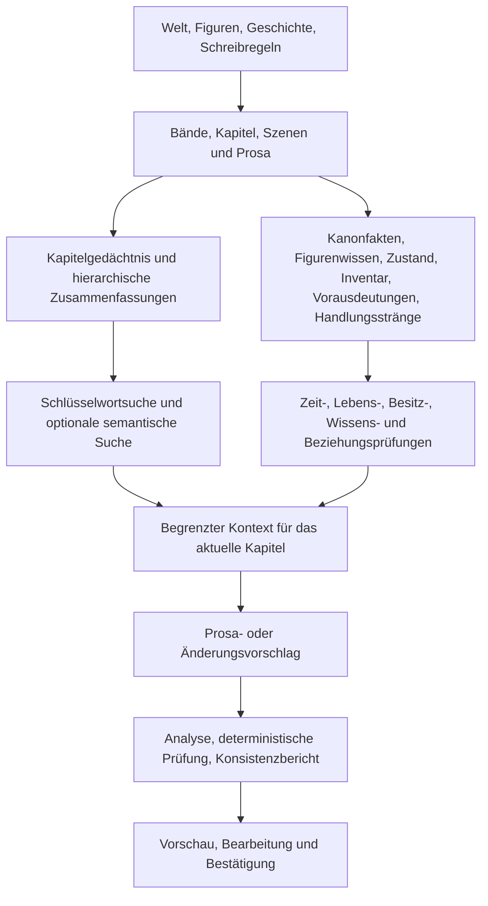

# StoryForge

[简体中文](../../README.md) · [English](./README.en.md) · [Français](./README.fr.md) · [Deutsch](./README.de.md) · [日本語](./README.ja.md) · [Español](./README.es.md)

> Mit einer Idee beginnen, ein echtes Werk vollenden und es anschließend über die Welt-Engine zu Romanen, gemeinsamen Pen-and-Paper-Kampagnen, Figureninteraktionen, Erzählspielen und einer teilbaren, spielbaren, gemeinsam gestalteten Welt weiterentwickeln.

StoryForge ist ein quelloffenes, lokal ausgerichtetes System für KI-gestütztes narratives Schaffen und ausführbare Erzählwelten. Das ausgereifteste Produkt ist derzeit die Langform-Literatur. Bereits vorhanden sind ein schrittweiser Schreibmodus, Infrastruktur für langfristige Konsistenz, ein Welt-Arbeitsbereich, ein Knotenmodus, lokale Einzelspieler-Kampagnen und eine erste Einzelfiguren-Unterhaltung. Vollständige Erzählspiel-Produktion, Online-Mehrspieler, unveränderliche Weltveröffentlichungen und das Community-Ökosystem sind geplante Ausbaustufen.

**Community und Anleitungen**

- Repository: https://github.com/yuanbw2025/storyforge
- Projektseite: https://yuanbw.vercel.app/
- Videoanleitung: https://www.bilibili.com/video/BV1q37j6QExh/
- QQ-Gruppe: 1082374587

---

## Vision

Einen kurzen Text zu erzeugen ist leicht geworden. Ein langes Werk zu vollenden erfordert weiterhin Planung, Faktenkonsistenz, Figurenentwicklung, das Einlösen erzählerischer Versprechen, Stilkontrolle und wiederholte Überarbeitung. Nach der Fertigstellung bleiben Welt, Figuren, Beziehungen, Regeln und Erzählstrukturen oft im Prosatext eingeschlossen.

StoryForge verbindet die gesamte Produktionskette:

```text
Eine Idee
  → eine vollständige Geschichte und ein Werk
  → die Welt-Engine
      ├─ Langromane und Reihen
      ├─ gemeinsame Pen-and-Paper-Kampagnen
      ├─ Figureninteraktion und Abenteuer
      └─ verzweigte, systemische und gemeinschaftlich erzeugte Erzählspiele
  → Veröffentlichung, Spiel, Adaption und Zusammenarbeit
  → eine dauerhaft weiterentwickelbare Erzählwelt
```

Die drei Stufen lauten: Eine Idee wird zu einem Werk, das Werk wird zu einer ausführbaren Weltressource, und veröffentlichte Versionen mit Herkunft und Rechten ermöglichen Lesen, Spielen, Ableiten und Zusammenarbeit.

Die Langform ist selbst ein Kernwert. Welt-Engine und interaktive Produkte verlängern das Leben eines Werks, ohne das Schreiben zu ersetzen.

---

## Aktueller Stand

| Produkt | Stand | Heute verfügbar | Nächste Stufe |
|---|---|---|---|
| Welt-Engine | **Erster vertikaler Ausschnitt verfügbar** | Gemeinsame Ansicht für Grundlagen, Ressourcen, Erzählstrukturen, Teilwelten und Laufzeitinstanzen | Explizite Welt-/Werk-Zuordnung, ausführbare Erzählung, unveränderliche Versionen, vereinheitlichte Instanzen |
| Langform-Literatur | **Verfügbar · Hauptprodukt** | Schrittweiser Modus von der Idee bis zur Prosa, Knotenmodus für freie Orchestrierung, Gesprächsassistent im schrittweisen Ablauf | Konsistenzprüfung und Produktionskreislauf auf Millionenwort-Skala verbessern |
| Pen-and-Paper-Kampagnen | **Lokale Einzelspieler-Kampagne verfügbar** | Spielleitungsunterstützung, deterministische Proben, Kämpfe, Aufgaben, NSC-Zeitpläne, Kontrollpunkte und Verzweigungen | Mehrspielerräume, Plätze, Synchronisierung, Rechte, gemeinsame Spielleitung |
| Figurenunterhaltung | **Einzelfiguren-Minimalversion verfügbar** | Eingefrorene Figur, Benutzerrolle, Szene, gestreamte Antworten, Neugenerierung, Kontrollpunkte und Verzweigungen | Langzeitgedächtnis, mehrere Figuren, Beziehungsentwicklung, Abenteuer |
| Erzählspiele | **Experimenteller Einstieg** | Welt auswählen und binden; der aktuelle Einstieg ist schreibgeschützt | Editoren für Entscheidungen, Zustände, Verzweigungen und Enden; Veröffentlichung und Spielen |
| Weltfreigabe | **Lokales Paket verfügbar** | Namensnennung, Lizenz, erlaubte Nutzungen, Inhaltswarnungen und Integritätsprüfung | Online-Veröffentlichung, Entdeckung, Spiel, Ableitungsgraph, Zusammenarbeit und Moderation |

---

## Eine Weltgrundlage, unabhängige Nutzungsformen

Jede Person kann nur den benötigten Teil verwenden. Wer einen Roman schreibt, muss keine Kampagne öffnen. Wer eine Kampagne baut, muss keinen vollständigen Roman schreiben. Die Oberflächen und veränderlichen Zustände bleiben getrennt, während Weltfakten und Sicherheitsgrenzen gemeinsam genutzt werden.

Die Grundlage hat fünf Ebenen:

1. **Weltkanon:** Fakten, Regeln, Identitäten, Entitäten und Beziehungen.
2. **Erzählstruktur:** Themen, Haupt- und Nebenhandlungen, Aufgaben, Szenen, Entscheidungen und Enden.
3. **Welt-Zustandsmaschine:** Zeit, Zustand, Ereignisse, Regeln, Zufall, Kontrollpunkte, Verzweigungen und Wiedergabe.
4. **Isolierte Instanzen:** Romane, Kampagnen, Unterhaltungen und Spiele entwickeln sich unabhängig aus derselben Weltversion.
5. **Veröffentlichung und Community:** Versionen, Rechte, Auffindbarkeit, Ableitung und Zusammenarbeit.

---

## Welt-Engine

Die Welt-Engine ist die erste Produktebene. Sie bewahrt Fakten, Erzählstrukturen und Laufzeitregeln, damit dieselbe Welt mehrere Werk- und Spielformen tragen kann.


### Weltgrundlage und Kanon

- Metaregeln sowie Grenzen zwischen Realität, Erfindung, Physik und Übernatürlichem.
- Ursprung, Kosmologie, Teilwelten, Glauben und Lebenszyklus.
- Natur, Gesellschaft, Geografie, Geschichte, Machtsysteme und Institutionen.
- Figuren, Organisationen, Fraktionen, Orte, Gegenstände, Arten, Ressourcen und Wissenseinträge.
- Verwandtschaft, Zugehörigkeit, Feindschaft, Handel, Besitz und Wissen.

### Ausführbarer Erzählbauplan

- Themen, zentrale Konflikte, Epochenkrisen und Geschichtenkeime.
- Haupt- und Nebenhandlungen, Aufgabenketten, Figuren-, Fraktions- und Erkundungslinien.
- Bände, Kapitel, detaillierte Szenenpläne, Schlüsselereignisse, Entscheidungen und Enden.
- Eintrittsbedingungen, Auslöser, Fehlschläge, Zustandswirkungen und Freischaltungen.

Geschichten, Gliederungen, Szenenpläne und Handlungsstränge existieren bereits. Ihre Vereinheitlichung zu versionierten, ausführbaren Erzählmodulen mit Bedingungen und Wirkungen ist eine spätere Ausbaustufe.

### Welt-Zustandsmaschine

- Einen eingefrorenen Schnappschuss oder später eine unveränderliche Veröffentlichung binden.
- Menschliche und künstlich erzeugte Aktionen zuerst als Vorschläge behandeln.
- Rechte, Regeln, Voraussetzungen, Ressourcenlimits und Ereignisreihenfolge im Code prüfen.
- Bestätigte Ereignisse deterministisch anwenden.
- Kontrollpunkte speichern, Verzweigungen anlegen und Zustände wiedergeben.
- Wertvolle Laufzeitereignisse nur als prüfbare Vorschläge in das Schreiben zurückführen.

### Vorhanden und noch offen

Einzelwelt-Projekte benötigen keinen Mehrweltmodus. Weltgrundlage, Ressourcen, Erzählung, Struktur und Instanzen verwenden dieselben vorhandenen Daten. Die aktuelle Vollständigkeit misst Domänenabdeckung, nicht vollständige Konfliktfreiheit oder Veröffentlichungsreife. Explizite Eigentümerschaft, unveränderliche Veröffentlichungen und vereinheitlichte Instanzen folgen später.

---

## Langform-Literatur

### Drei Schreibweisen für dasselbe Produkt

| Modus | Aufgabe |
|---|---|
| **Schrittweiser Modus** | Hauptablauf und stabilste Grundlage: Idee, Welt, Geschichte, Figuren, Gliederung, Szenen, Prosa und Nachbearbeitung |
| **Knotenmodus** | Freie Zusammenstellung derselben Fähigkeiten für fortgeschrittene Schreibende, ohne eine zweite Kopie des Romans |
| **Hauptassistent** | Gesprächshilfe innerhalb des schrittweisen Modus, die bestehende Funktionen plant und aufruft, aber die Bestätigung der Vorschläge beibehält |

Der Knotenmodus verbindet Welt-, Geschichten-, Figuren-, Gliederungs-, Prosa-, Kontinuitäts- und Steuerknoten. Er bietet Startvorlagen, Layoutwerkzeuge, Ausführungspläne, Budgets, sichtbare Ein- und Ausgaben, Pause, Abbruch, Fortsetzung und Erkennung veralteter Folgeschritte.

Der Hauptassistent übersetzt natürliche Anfragen in geordnete Aufgaben. Nicht übernommene Zwischenergebnisse bleiben ausdrücklich außerhalb des Kanons.

### Produktionsweg

```text
Ideen und Referenzen
  → Prämisse und thematischer Konflikt
  → Welt, Regeln, Geschichte und Geografie
  → Figuren, Beziehungen, Motive und Bögen
  → Haupt- und Nebenhandlungen
  → Band-, Kapitel- und Szenenpläne
  → Schreiben, Fortsetzen und Überarbeiten
  → Fakten, Zustände, Vorausdeutungen, Inventar und Zeitlinie
  → Konsistenzprüfung und weitere Planung
```


### Konsistenzarchitektur für Werke mit Millionen Wörtern

Die Millionenwort-Skala ist ein Entwicklungs- und Evaluationsziel, keine Behauptung über einen bereits abgeschlossenen öffentlichen Qualitätstest.



| Maßnahme | Schutz | Wirkung |
|---|---|---|
| Hierarchische Planung | Normierte Reihenfolge von Bänden, Kapiteln und Szenen | Jedes Kapitel behält Position und Zweck |
| Gedächtnis und Zusammenfassungen | Kapitel-, Band- und Gesamtzusammenfassungen mit Quellen | Relevante Vergangenheit ohne vollständige Manuskripteinspeisung |
| Zeitlicher Kanon | Faktenvorschläge, Bestätigung, Gültigkeitszeit und Herkunft | Weniger Zeit-, Lebens- und Weltwidersprüche |
| Figurenwissen | Trennung von Weltwahrheit und Figurenwissen | Erkennen verfrühten Wissens und Perspektivlecks |
| Zustands- und Inventarregister | Erwerb, Transfer, Verbrauch und Zustandswechsel | Weniger verschwundene Objekte und unbegründete Sprünge |
| Handlungen und Vorausdeutungen | Fortschritt, Aufbau, Rückbezug und Auflösung | Langfristige erzählerische Versprechen bleiben sichtbar |
| Begrenzte Kontextmontage | Registrierte Quellen, sichtbare Aufnahme und Kürzung | Nachvollziehbar, welche Daten das Modell erhalten hat |
| Deterministische Prüfungen | Harte Regeln im Code, weiche Probleme als Bericht | Keine stille Umschreibung des Manuskripts |
| Vorschlagsübernahme | Quellen- und Paralleländerungsprüfung vor dem Schreiben | Veraltete Ergebnisse überschreiben keine neuen Texte |
| Datenlebenszyklus | Export, Import, Löschung, Migration und Referenzabbildung | Lange Projekte bleiben sicher übertragbar |

Harte Garantien betreffen unbestätigte Schreibvorgänge, Instanztrennung, Referenzen, Bereiche und Lebenszyklen. Gedächtnis, Zusammenfassungen, Suche und Register sind technische Schutzschichten. Literarische Qualität hängt weiterhin von Modell, Material und menschlichem Urteil ab.

---

## Pen-and-Paper-Kampagnen

Die aktuelle Version kann eine Welt einfrieren und lokale Kampagnen mit Szenen, Runden, Aktionen, deterministischen Proben, Erzählvorschlägen, Kämpfen, Ressourcen, Zuständen, Zusammenfassungen, Aufgaben, NSC-Zeitplänen, gemeinsamer Uhr, Ereignisprotokoll, Kontrollpunkten und Verzweigungen verwalten.

Ziel ist echter Mehrspielerbetrieb. Dafür sind Identität, Räume, Plätze, Synchronisierung, Rechte, Konfliktbehandlung und Serverkoordination notwendig; diese Fähigkeiten gelten noch nicht als fertig. Kampagnenereignisse ändern weder Romantext noch Weltkanon.

---

## Figurenunterhaltung und Abenteuer

Die Einzelfiguren-Minimalversion bietet einen eingefrorenen Welt- und Figurenschnappschuss, eine Benutzerrolle, Szenenkonfiguration, gestreamte Antworten, persistente Nachrichten, Neugenerierung, Kontrollpunkte und Verzweigungen. Der Quellcharakter wird nicht verändert.

Spätere Stufen umfassen Langzeitgedächtnis, Beziehungsentwicklung, Wissensgrenzen, mehrere Figuren, Bewegung, Gegenstände, Fähigkeiten, Aufgaben, Entscheidungen und Abenteuer.

---

## Erzählspiele

Geplant sind verzweigte Abenteuer, systemische Erzählungen auf Basis von Regeln und Zuständen sowie gemeinschaftliche Ableitungen. Der aktuelle Einstieg bindet eine Welt schreibgeschützt. Ereignisse, Zustände, Zufall, Kontrollpunkte, Verzweigungen und Wiedergabe sind im gemeinsamen Laufzeitsystem vorhanden; Editoren für Entscheidungen, Zustände, Verzweigungen und Enden sowie Veröffentlichung und Spiel fehlen noch.

---

## Veröffentlichung und Community

Lokale Weltpakete unterstützen bereits Namensnennung, Lizenz, Inhaltswarnungen, erlaubte Nutzungen, registrierten Freigabebereich, Integritätsprüfung, Vorabkontrolle und Herkunft. Manuskripte, private Notizen, Assistentengespräche, Laufzeitstände, Schnittstellenkonfiguration und persönlicher Stil sind standardmäßig ausgeschlossen.

Der spätere Kreislauf verbindet Erstellen, Veröffentlichen, Entdecken, Spielen, Anpassen, gemeinsames Gestalten, Rückmeldung und neue unveränderliche Versionen. Der lokale Entwurf bleibt maßgeblich; Community-Dienste dürfen nur ausdrücklich veröffentlichte Inhalte verarbeiten.

---

## Künstliche Intelligenz, Transparenz und Daten

### Kontrollierte Erzeugung und Wiederaufnahme

Zentrale Kreativaufgaben laufen jetzt über eine einheitlich kontrollierte Ausführungskette. Jeder Lauf fixiert Ziel, Berechtigungen, relevanten Kontext, Eingabevorlage, Werkzeuge und Modellidentität. Standardmäßig gibt es genau einen Erzeugungsversuch; nur wenn eine deterministische Prüfung einen behebbaren Fehler genau bestimmt, ist höchstens eine gezielte Korrektur erlaubt. Ergebnisse bleiben bearbeitbare Vorschläge. Gültige Teile und der ursprüngliche Entwurf bleiben bei weichen Qualitätswarnungen erhalten, und erst die ausdrückliche Bestätigung des Autors schreibt offizielle Daten. Ein dauerhaftes Register speichert Kontrollpunkte, Abhängigkeiten, Abschlussbeleg, Tokenverbrauch, Laufzeit und Stoppgrund, damit ein unterbrochener Lauf ohne erneute Abrechnung bereits abgeschlossener Aufrufe fortgesetzt werden kann.

Diese Architektur sichert Ausführungsgrenzen und prüfbare Nachweise; sie verspricht keine perfekte Literaturausgabe jedes Modells. Technische Wiederaufnahme, bearbeitbare Lieferung und Kostenstopp wurden geprüft, unabhängige Autorenvergleiche und eine gemeinschaftliche Qualitätsschranke stehen noch aus. Siehe die [Versionsnotiz zur Ausführungsarchitektur](../AI-HARNESS-REBUILD-RELEASE-20260817.md).

- Die KI liest nur registrierte, aufgabenbezogene Quellen innerhalb eines sichtbaren Budgets.
- Ausgaben bleiben Vorschläge bis zu Analyse, deterministischer Prüfung und Bestätigung.
- Laufzeitinstanzen schreiben nicht in den Schreibkanon zurück.
- Quellkennungen und Hashes markieren veraltete Ergebnisse nach Änderungen.
- Manuskripte und Laufzeitstände liegen standardmäßig in IndexedDB des Browsers.
- Cloud-Dienste erhalten den aufgabenbezogenen Kontext, den der Benutzer an den gewählten Anbieter sendet.
- Ollama oder LM Studio ermöglichen lokale Modelle.
- JSON-, Ordner-, Schnappschuss-, Gist- und Weltpaket-Sicherungen ermöglichen Übertragung und Wiederherstellung.

Unterstützt werden unter anderem OpenAI, Anthropic Claude, Google Gemini, Poe, NVIDIA NIM, DeepSeek, Qwen, Doubao, MiniMax, GLM, Wenxin, Kimi, ModelScope, Agnes AI, LongCat, OpenCode Go, Ollama, LM Studio und kompatible Endpunkte.

---

## Schnellstart

```bash
git clone https://github.com/yuanbw2025/storyforge.git
cd storyforge
npm install
npm run dev
```

Öffnen Sie `http://localhost:1111/storyforge/`.

StoryForge bietet derzeit kein eigenständiges Windows-Programm. Installieren Sie die stabile Node.js-Version, öffnen Sie PowerShell im Projektordner und führen Sie die Befehle aus.

---

## Entwicklung und Dokumentation

Lesen Sie den [Beitragsleitfaden](../../CONTRIBUTING.md) und die [Repository-Regeln](../../AGENTS.md). Die [aktuelle Roadmap](../roadmap/README.md) trennt vorhandene von künftigen Funktionen; die [Fähigkeitsbasis](../roadmap/CAPABILITY-BASELINE.md) beschreibt den tatsächlich gelieferten Umfang; die [Zielarchitektur für Welt und Community](../WORLD-ENGINE-COMMUNITY-ARCHITECTURE.md) ist keine Liste bereits fertiger Funktionen.

```bash
npm run test
npm run test:e2e
npm run check:architecture
npm run ci
```

---

## Lizenz

StoryForge steht unter der [MIT-Lizenz](../../LICENSE).
