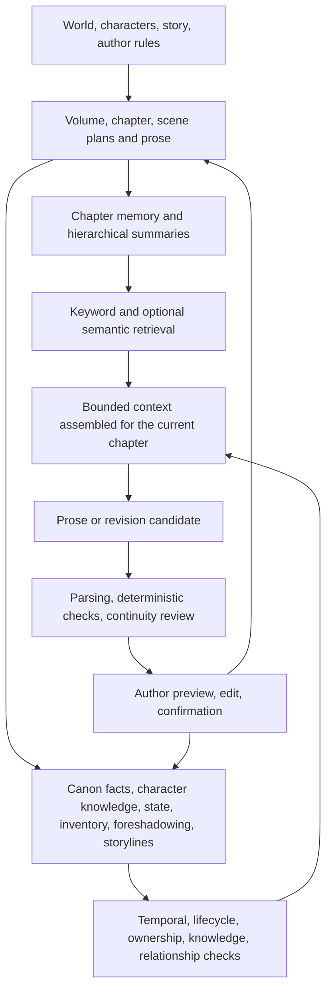

# StoryForge

[简体中文](../../README.md) · [English](./README.en.md) · [Français](./README.fr.md) · [Deutsch](./README.de.md) · [日本語](./README.ja.md) · [Español](./README.es.md)

> Start with an idea, finish a real work, then use the world engine to let that work grow into novels, multiplayer tabletop campaigns, character interactions, narrative games, and a world that people can share, play, and create together.

StoryForge is an open-source, local-first AI narrative creation and world-runtime system. Long-form fiction is currently its most complete product. The project already includes step-by-step authoring, long-range continuity infrastructure, a world workspace, node-based authoring, local single-player campaigns, and a single-character chat MVP. Narrative-game production, online multiplayer, immutable world releases, and the community ecosystem are staged roadmap work.

**Community and tutorials**

- GitHub: https://github.com/yuanbw2025/storyforge
- Project site: https://yuanbw.vercel.app/
- Bilibili video manual: https://www.bilibili.com/video/BV1q37j6QExh/
- QQ group: 1082374587

---

## Vision

Generating a short passage is now easy. Finishing a long work still requires planning, factual continuity, character development, payoff management, style control, and repeated review. After a work is finished, its world, characters, relationships, rules, and narrative structures are often trapped inside prose and cannot easily become playable, adaptable, or collaborative material.

StoryForge aims to connect the whole production path:

```text
An idea
  → a complete story and work
  → the world engine
      ├─ long-form and series fiction
      ├─ multiplayer tabletop campaigns
      ├─ character interaction and adventure
      └─ branching, systemic, and community-made narrative games
  → publishing, play, adaptation, and collaboration
  → a narrative world that can keep evolving
```

The path has three stages:

1. **Turn an idea into a story:** organize themes, characters, conflicts, and world seeds into a work that can be planned, written, and reviewed.
2. **Turn a story into an operational world asset:** preserve facts, characters, rules, narrative structures, and state boundaries in a shared world foundation.
3. **Bring the world into a shared ecosystem:** publish explicit versions with provenance and permissions so other people can read, play, derive, adapt, and collaborate.

Long-form storytelling is itself a core value. The world engine and interactive products extend the life of a work; they do not replace writing.

---

## Current status

| Product | Status | Available now | Next stage |
|---|---|---|---|
| World engine | **First slice available** | A shared view of world foundations, assets, narrative structures, realms, and runtime instances | Explicit world/work ownership, executable narrative, immutable versions, unified instances |
| Long-form fiction | **Available · primary product** | Step-by-step authoring from idea to prose; node mode for free orchestration; a conversational assistant inside the step-by-step workflow | Stronger million-word continuity evaluation and production loops |
| Tabletop campaigns | **Local single-player campaign available** | Assisted game mastering, deterministic checks, combat encounters, quests, NPC schedules, checkpoints, and branches | Multiplayer rooms, seats, synchronized state, permissions, collaborative game mastering |
| Character chat | **Single-character MVP available** | Frozen character snapshots, user identity, scenes, streaming replies, regeneration, checkpoints, and branches | Long-term memory, multi-character rooms, relationship evolution, adventure mode |
| Narrative games | **Experimental entry** | Select and bind a world; the current entry is read-only and does not create a finished game | Choice, state, branch, and ending editors; publishing and play loops |
| World sharing | **Local package available** | Declare attribution, license, allowed uses, and content warnings; export and verify a local world package | Online publishing, discovery, play, derivation graphs, collaboration, governance |

---

## One world foundation, independent ways to use it

Users can adopt only the part they need. A novelist does not need to enter a campaign. A campaign creator does not need to complete a novel. A character-chat user does not need to build a narrative game. Each entry has its own interface and mutable state while sharing world facts and safety boundaries.

The shared foundation contains five layers:

1. **World Canon:** facts, rules, identities, entities, and relationships that define the world.
2. **Narrative structure:** themes, main and side lines, quests, scenes, choices, and endings.
3. **World state machine:** time, state, events, rules, randomness, checkpoints, branches, and replay.
4. **Isolated instances:** novels, campaigns, chats, and games may bind the same world version but evolve independently.
5. **Publishing and community:** explicit versions, permissions, discovery, derivation, and collaboration.

---

## World engine

The world engine is the first product layer. It preserves facts, narrative structures, and runtime rules so the same world can support long-form fiction, campaigns, character interactions, and narrative games.


### World foundation and Canon

- Meta-rules and the boundary between reality, invention, physics, and the supernatural.
- Origins, cosmology, realms, beliefs, and world lifecycle.
- Nature, society, geography, history, power systems, and institutions.
- Characters, organizations, factions, locations, objects, species, resources, and knowledge entries.
- Relationships between people, places, factions, ownership, allegiance, hostility, trade, and knowledge.

### Executable narrative blueprint

- Themes, central conflicts, era-level crises, and story seeds.
- Main lines, side lines, quest chains, character lines, faction lines, and exploration lines.
- Volumes, chapters, detailed scene plans, key events, choices, and endings.
- Entry conditions, triggers, failure conditions, state effects, and unlocks.
- Starting situations, recommended characters, default time points, and free-exploration entries.

StoryForge already has story, outline, detailed-outline, and storyline structures. Turning them into versioned executable narrative modules with conditions and effects remains staged world-engine work.

### World state machine

- Bind an explicit frozen snapshot or, later, an immutable release.
- Convert user and AI actions into candidates.
- Validate permissions, rules, prerequisites, resource limits, and event order in code.
- Apply accepted events through deterministic reducers.
- Save checkpoints, create branches, and replay state.
- Return valuable runtime events to authoring only as reviewable candidates.

### Available now

- Single-world users can open the complete world workspace without enabling multiworld mode.
- Foundations, assets, narrative design, realms, state, and instances reuse existing project data.
- Coverage is derived from registered world domains rather than manuscript progress.
- The step-by-step workflow remains the stable baseline; the world workspace does not duplicate setting or outline data.
- Local world packages include attribution, license, content warnings, allowed uses, and integrity checks.

### Current boundaries

- `Project` still acts as the compatible local storage boundary. Explicit World, Work, and multi-work ownership require later migrations.
- Current completeness means domain coverage, not complete reference validation, conflict freedom, or release readiness.
- Executable narrative, immutable releases, package version 2, and unified product instances remain roadmap stages.

---

## Long-form fiction

Long-form authoring is StoryForge's most mature product and the main entry for many community users.

### Three authoring modes for one product

| Mode | Role | Relationship |
|---|---|---|
| **Step-by-step mode** | The primary long-form workflow from idea and worldbuilding to outlines, prose, and post-chapter organization | Most complete and the current stable baseline |
| **Node mode** | A freely orchestrated long-form workflow for advanced authors | Reads and writes the same world, character, outline, and manuscript data |
| **Main assistant** | A conversational helper embedded in step-by-step authoring | Plans and invokes existing capabilities while preserving candidate confirmation |

Node mode can connect world, story, character, outline, prose, continuity, and control nodes. It provides official starting graphs, layout tools, execution plans, budgets, visible inputs and outputs, pause/cancel/resume, stale-downstream detection, and candidate review. The graph stores orchestration and evidence, not a second copy of the novel.

The main assistant turns natural-language requests into ordered world, inspiration, character, outline, and prose tasks. It persists candidates and decisions across refreshes. Unadopted upstream outputs remain explicitly non-Canon.

### From idea to prose

```text
Inspiration and references
  → story premise and thematic conflict
  → world, rules, history, and geography
  → characters, relationships, motives, and arcs
  → main and side storylines
  → volume, chapter, and scene outlines
  → prose generation, continuation, and editing
  → facts, states, foreshadowing, inventory, and timeline organization
  → continuity review, impact analysis, and future planning
```


### Continuity architecture for million-word works

The million-word scale is an engineering target and an evaluation direction, not a claim that a public million-word quality benchmark has already been completed.



| Measure | What StoryForge does | Author-facing effect |
|---|---|---|
| Hierarchical planning | Normalizes volume, chapter, detailed scene, and prose order | Every chapter has an explicit structural position and purpose |
| Chapter memory and summaries | Stores handoffs and chapter/volume/book summaries with source pointers | Relevant history can be recalled without injecting the entire manuscript |
| Temporal Canon | Extracts fact candidates, then stores author-confirmed facts with time and provenance | Fewer lifecycle, chronology, and setting contradictions |
| Character knowledge ledger | Separates world truth from what a character knew at a given chapter | Detects premature knowledge and point-of-view leakage |
| State and inventory ledgers | Tracks people, places, factions, acquisition, transfer, and consumption | Reduces disappearing objects and unexplained state jumps |
| Storylines and foreshadowing | Tracks stages, promises, setup, echo, and payoff | Keeps long-running lines visible during serialization |
| Bounded context assembly | Selects registered sources for the current task and records inclusion/truncation | Authors can inspect why the model saw specific material |
| Retrieval | Uses keywords and hierarchical summaries by default; semantic retrieval is optional | Better long-range recall with controlled cost |
| Deterministic checks | Code checks hard rules; model review reports softer issues without rewriting | Problems remain visible and author-controlled |
| Candidate adoption | Outputs are previewed and concurrency-checked before formal writes | Stale or unconfirmed output cannot silently overwrite the work |
| Data lifecycle | All registered tables join export, import, deletion, migration, and remapping | Long projects can be backed up and restored safely |

**Hard guarantees:** unconfirmed candidates do not become formal data; runtime instances do not rewrite the novel; scope, references, concurrent changes, and registered lifecycles are checked in code.

**Engineering safeguards:** memory, summaries, retrieval, Canon, knowledge, inventory, storylines, foreshadowing, and review reduce long-range mistakes and expose evidence.

**Quality boundary:** model quality still depends on the selected model, prompts, source completeness, and author judgment. StoryForge reduces errors and makes them reviewable; it cannot promise to eliminate every literary or logical issue automatically.

---

## Tabletop campaigns

Available local campaign features include frozen world sources, scenes, turn order, player actions, deterministic checks, AI narration candidates, combat initiative, attacks, damage, resources, status effects, campaign summaries, quests, NPC schedules, a shared clock, event logs, checkpoints, branches, refresh recovery, and portable backup.

The intended form is multiplayer: one human or AI facilitator and multiple players with separate characters, secrets, actions, and consequences. Online rooms require identity, seats, synchronized state, permissions, conflict handling, and server coordination. Those capabilities are not presented as complete in the current local-only architecture.

Campaign events change only the campaign instance. They do not rewrite novel prose or world Canon. Valuable events can later return as author-reviewed story candidates.

---

## Character chat and interactive adventure

The current single-character MVP supports a frozen world and character snapshot, user identity, scene configuration, streaming replies, saved messages, regeneration, checkpoints, and branches. Chat state remains isolated from the source character profile.

Planned stages include long-term summaries and event memory, relationship changes, knowledge boundaries, multi-character rooms, speaking schedules, movement, items, abilities, quests, choices, random checks, and a smooth transition from conversation to text adventure.

---

## Narrative games

StoryForge plans three families:

| Form | Experience |
|---|---|
| Branching adventure | Authored nodes and endings; choices change relationships, resources, and routes |
| Systemic narrative | Rules, state, and events support survival, management, mystery, growth, and exploration |
| Community derivatives | Readers build side stories, character routes, alternate worlds, and playable adaptations |

The current product includes a read-only world-binding entry and package permissions for narrative-game use. The shared simulation runtime already provides events, state, randomness, checkpoints, branches, and replay. Choice editors, state designers, branch graphs, ending management, publishing, and a player loop are not yet complete.

---

## Publishing and community

Local world packages already support attribution, licenses, content warnings, allowed uses, registered sharing scope, integrity hashes, pre-import inspection, isolated local copies, and provenance preservation. Manuscripts, private notes, assistant conversations, runtime saves, API configuration, and personal style remain excluded by default.

The future community loop is:

```text
Create and publish
  → discover and play
  → adapt and co-create
  → feed back into world evolution
  → publish a new immutable version
```

Planned services include catalogs, search, tags, playable formats, immutable releases, differences and dependencies, derivation graphs, license chains, follows, comments, ratings, play statistics, invitations, structured change proposals, review, merging, permissions, and governance records.

The local draft remains authoritative. Community services may process only content and metadata that the user explicitly publishes.

---

## AI, transparency, and data safety

### Governed generation and recovery

Core creative tasks now use one governed Agent and Harness pipeline. Each run freezes its task, permissions, relevant context, prompt, tools, and model identity. Generation is bounded to one attempt by default, with at most one targeted repair when a deterministic check identifies a repairable problem. Results remain editable candidates; valid fragments and the original draft survive soft quality warnings, and only explicit author confirmation writes formal data. A durable ledger stores checkpoints, dependencies, terminal receipts, token usage, latency, and stop reasons so an interrupted run can resume without repeating a settled call.

This architecture provides execution controls and auditable evidence, not a promise of perfect literary output from every model. Engineering recovery, editable-delivery, and cost-stop behavior have been verified; independent author comparisons and a community quality gate remain future work. See the [Agent and Harness architecture release note](../AI-HARNESS-REBUILD-RELEASE-20260817.md).

- AI reads only registered task-relevant sources assembled within an explicit budget.
- AI output remains a candidate until parsing, deterministic validation, and author confirmation.
- World creation and runtime state are isolated; runtime events cannot mutate published or authoring Canon.
- Source identifiers and hashes mark stale results when manuscripts or world data change.
- Manuscripts, settings, and runtime saves live in browser IndexedDB by default.
- Cloud providers receive the relevant context sent to the service selected by the user.
- Local Ollama or LM Studio endpoints can keep generation on the user's machine.
- JSON, folder, snapshot, Gist, and world-package workflows provide backup and portability.

The three architectural sources of truth are:

| Registry | Responsibility |
|---|---|
| `CONTEXT_SOURCES` + `assembleContext()` | What AI may read and how context is assembled |
| `FIELD_REGISTRY` + `AdoptionSchema` + `adopt()` | What AI may write and how candidates are validated and adopted |
| `PROJECT_TABLES` | Export, import, deletion, migration, scope, and reference-remapping lifecycle |

---

## Supported model services

- International and aggregators: OpenAI, Anthropic Claude, Google Gemini, Poe, NVIDIA NIM.
- Chinese and compatible services: DeepSeek, Qwen, Doubao, MiniMax, GLM, Wenxin, Kimi, ModelScope, Agnes AI, LongCat, OpenCode Go.
- Local and custom: Ollama, LM Studio, OpenAI-compatible endpoints, custom base URLs.

Prompts, parameters, examples, task routing, context profiles, and usage estimates are visible. Cloud use is not offline: relevant content is sent to the configured provider. Keyword retrieval is local by default; semantic embeddings are optional and may use either a local or cloud endpoint.

---

## Quick start

```bash
git clone https://github.com/yuanbw2025/storyforge.git
cd storyforge
npm install
npm run dev
```

Open `http://localhost:1111/storyforge/`.

StoryForge does not currently ship a Windows `.exe` or portable launcher. Install Node.js LTS, open PowerShell in the project directory, and run the commands above.

---

## Development

Read [CONTRIBUTING.md](../../CONTRIBUTING.md) and [AGENTS.md](../../AGENTS.md) before contributing.

```bash
npm run test
npm run test:coverage
npm run test:e2e
npm run check:architecture
npm run ci
```

The current roadmap is [docs/roadmap/README.md](../roadmap/README.md), the current capability baseline is [CAPABILITY-BASELINE.md](../roadmap/CAPABILITY-BASELINE.md), and the world/community target architecture is [WORLD-ENGINE-COMMUNITY-ARCHITECTURE.md](../WORLD-ENGINE-COMMUNITY-ARCHITECTURE.md). Roadmap items are not automatically current features.

---

## License

StoryForge is released under the [MIT License](../../LICENSE).
