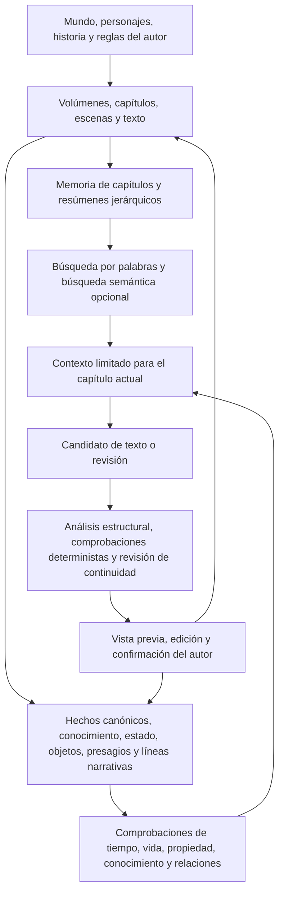

# StoryForge

[简体中文](../../README.md) · [English](./README.en.md) · [Français](./README.fr.md) · [Deutsch](./README.de.md) · [日本語](./README.ja.md) · [Español](./README.es.md)

> Parte de una idea, termina una obra real y usa el motor de mundos para convertirla en novelas, partidas de rol multijugador, interacciones con personajes, juegos narrativos y un mundo que otras personas puedan compartir, jugar y crear en común.

StoryForge es un sistema de código abierto y prioridad local para la creación narrativa con inteligencia artificial y la ejecución de mundos. La novela larga es actualmente su producto más completo. El proyecto ya incluye creación paso a paso, infraestructura de continuidad a largo plazo, espacio de trabajo del mundo, creación por nodos, partidas locales para una persona y una versión mínima de conversación con un personaje. La producción de juegos narrativos, el multijugador en línea, las versiones inmutables de mundos y el ecosistema comunitario se desarrollarán por etapas.

**Comunidad y tutoriales**

- GitHub: https://github.com/yuanbw2025/storyforge
- Sitio del proyecto: https://yuanbw.vercel.app/
- Manual en vídeo de Bilibili: https://www.bilibili.com/video/BV1q37j6QExh/
- Grupo de QQ: 1082374587

---

## Visión

Generar un fragmento breve ya es sencillo. Terminar una obra larga todavía exige planificación, continuidad factual, desarrollo de personajes, gestión de promesas narrativas, control de estilo y revisión continua. Cuando una obra se termina, su mundo, personajes, relaciones, reglas y estructuras suelen quedar encerrados en el texto y no se convierten fácilmente en material jugable, adaptable o colaborativo.

StoryForge quiere conectar toda la cadena de producción:

```text
Una idea
  → una historia y una obra completas
  → el motor de mundos
      ├─ novelas largas y series
      ├─ partidas de rol multijugador
      ├─ interacción y aventura con personajes
      └─ juegos narrativos ramificados, sistémicos y comunitarios
  → publicación, juego, adaptación y creación conjunta
  → un mundo narrativo capaz de seguir evolucionando
```

La cadena tiene tres etapas:

1. **Convertir una idea en una historia:** organizar temas, personajes, conflictos y semillas de mundo como una obra que pueda planificarse, escribirse y revisarse.
2. **Convertir la historia en un activo de mundo ejecutable:** conservar hechos, personajes, reglas, estructuras narrativas y límites de estado sobre una base compartida.
3. **Llevar el mundo a un ecosistema compartido:** publicar versiones con procedencia y permisos explícitos para que otras personas puedan leer, jugar, derivar, adaptar y colaborar.

La narración larga es un valor central por sí misma. El motor de mundos y los productos interactivos prolongan la vida de una obra; no sustituyen la escritura.

---

## Estado actual

| Forma de producto | Estado | Disponible ahora | Siguiente etapa |
|---|---|---|---|
| Motor de mundos | **Primera fase disponible** | Vista común de fundamentos, activos, estructuras narrativas, dominios e instancias de ejecución | Pertenencia explícita de mundos y obras, narrativa ejecutable, versiones inmutables e instancias unificadas |
| Novela larga | **Disponible · producto principal** | Creación paso a paso desde la idea hasta el texto; modo por nodos para orquestación libre; asistente conversacional dentro del flujo paso a paso | Evaluación y ciclos de producción más fuertes para la continuidad de millones de palabras |
| Partidas de rol | **Partida local para una persona disponible** | Dirección asistida, comprobaciones deterministas, combate, misiones, horarios de personajes, puntos de control y ramas | Salas multijugador, asientos, estado sincronizado, permisos y dirección compartida |
| Conversación con personajes | **Versión mínima de un personaje disponible** | Instantáneas congeladas, identidad del usuario, escenas, respuesta progresiva, regeneración, puntos de control y ramas | Memoria larga, salas con varios personajes, evolución de relaciones y modo aventura |
| Juegos narrativos | **Entrada experimental** | Selección y vinculación de un mundo; la entrada actual es de solo lectura y no crea un juego terminado | Editores de elecciones, estado, ramas y finales; publicación y ciclo de juego |
| Compartición de mundos | **Paquete local disponible** | Atribución, licencia, usos permitidos y avisos de contenido; exportación y verificación local | Publicación, descubrimiento, juego, grafo de derivados, colaboración y gobierno comunitario |

---

## Una base de mundo, usos independientes

Cada persona puede adoptar solo la parte que necesita. Una novelista no tiene que entrar en una partida. Quien crea una campaña no necesita terminar una novela. Quien conversa con personajes no necesita construir un juego narrativo. Cada entrada mantiene su propia interfaz y estado mutable, a la vez que comparte los hechos del mundo y los límites de seguridad.

La base común contiene cinco capas:

1. **Hechos canónicos del mundo:** hechos, reglas, identidades, entidades y relaciones que definen el mundo.
2. **Estructura narrativa:** temas, líneas principales y secundarias, misiones, escenas, elecciones y finales.
3. **Máquina de estado del mundo:** tiempo, estado, sucesos, reglas, azar, puntos de control, ramas y reproducción.
4. **Instancias aisladas:** novelas, campañas, conversaciones y juegos pueden usar la misma versión del mundo, pero evolucionan de forma independiente.
5. **Publicación y comunidad:** versiones explícitas, permisos, descubrimiento, derivación y colaboración.

---

## Motor de mundos

El motor de mundos es la primera capa del producto. Conserva hechos, estructuras narrativas y reglas de ejecución para que un mismo mundo pueda sustentar novelas, partidas de rol, interacciones con personajes y juegos narrativos.


### Fundamentos y hechos canónicos

- Reglas fundamentales y límites entre realidad, invención, física y sobrenatural.
- Orígenes, cosmología, dominios, creencias y ciclo vital del mundo.
- Naturaleza, sociedad, geografía, historia, sistemas de poder e instituciones.
- Personajes, organizaciones, facciones, lugares, objetos, especies, recursos y entradas de conocimiento.
- Relaciones de parentesco, pertenencia, hostilidad, comercio, propiedad y conocimiento.

### Plano narrativo ejecutable

- Temas, conflictos centrales, crisis de época y semillas de historias.
- Líneas principales, secundarias, de misiones, personajes, facciones y exploración.
- Volúmenes, capítulos, planes de escena, sucesos clave, elecciones y finales.
- Condiciones de entrada, activadores, fallos, efectos de estado y desbloqueos.
- Situaciones iniciales, personajes recomendados, fecha predeterminada y entrada de exploración libre.

StoryForge ya dispone de estructuras de historia, esquema, desglose de escenas y líneas narrativas. Su conversión en módulos ejecutables y versionados con condiciones y efectos pertenece a las siguientes etapas del motor de mundos.

### Máquina de estado del mundo

- Vincula una instantánea congelada o, más adelante, una publicación inmutable.
- Convierte las acciones del usuario y de la inteligencia artificial en candidatos.
- Valida en código los permisos, reglas, requisitos, límites de recursos y orden de sucesos.
- Aplica los sucesos aceptados de forma determinista y guarda puntos de control, ramas y reproducción.
- Devuelve los resultados valiosos a la creación únicamente como candidatos revisables por el autor.

### Disponible y límites actuales

- Quien use un solo mundo puede abrir el espacio de trabajo completo sin activar el modo de varios mundos.
- Fundamentos, activos, diseño narrativo, dominios, estado e instancias reutilizan los datos existentes del proyecto.
- La cobertura del mundo deriva de dominios registrados y no del progreso del manuscrito.
- El flujo paso a paso sigue siendo la base estable; el espacio del mundo no duplica ajustes ni esquemas.
- Los paquetes locales incluyen atribución, licencia, avisos, usos permitidos y comprobaciones de integridad.
- `Project` sigue siendo el límite compatible de almacenamiento local. La pertenencia explícita de mundos, obras y varias obras requiere migraciones posteriores.

---

## Creación de novela larga

La creación de obras largas es el producto más maduro de StoryForge y la entrada principal para muchas personas de la comunidad.

### Tres modos para un solo producto

| Modo | Función | Relación |
|---|---|---|
| **Paso a paso** | Flujo principal desde la idea y el mundo hasta los esquemas, el texto y la organización posterior | Es el modo más completo y la base estable actual |
| **Por nodos** | Flujo libre para autores avanzados que quieren reorganizar pasos, fuentes y controles | Lee y escribe los mismos datos de mundo, personajes, esquema y manuscrito |
| **Asistente principal** | Ayuda conversacional integrada en el modo paso a paso | Planifica e invoca capacidades existentes y conserva la confirmación de candidatos |

El modo paso a paso conduce por inspiración, mundo, historia, personajes, esquema, desglose, texto y organización posterior. Cada etapa permite edición manual, consulta de materiales y decisión explícita sobre los resultados de la inteligencia artificial.

El modo por nodos convierte las mismas capacidades en un grafo de creación libre. Puede conectar nodos de mundo, historia, personajes, esquema, texto, continuidad y control, y conserva orden de ejecución, presupuesto, entradas y salidas reales, pausa, reanudación, resultados descendentes caducados y adopción de candidatos. El grafo guarda orquestación y pruebas, no una segunda copia de la novela.

El asistente principal convierte peticiones en lenguaje natural en tareas ordenadas de mundo, inspiración, personajes, esquema y texto. Conserva candidatos, confirmaciones, rechazos, errores y estado de ejecución. Un resultado previo no adoptado nunca pasa silenciosamente a ser un hecho oficial.

### De la idea al texto

```text
Inspiración y fuentes
  → núcleo de la historia y conflicto temático
  → mundo, reglas, historia y geografía
  → personajes, relaciones, motivaciones y arcos
  → líneas principales y secundarias
  → esquemas de volumen, capítulo y escena
  → generación, continuación y edición del texto
  → organización de hechos, estados, presagios, objetos y cronología
  → revisión de continuidad, análisis de impacto y planificación futura
```


### Arquitectura de continuidad para obras de millones de palabras

La escala de millones de palabras es un objetivo de ingeniería y una dirección de evaluación. No es una afirmación de que ya se haya completado una prueba pública de calidad de esa escala.



| Medida | Qué hace StoryForge | Efecto para el autor |
|---|---|---|
| Planificación jerárquica | Ordena volúmenes, capítulos, escenas y texto | Cada capítulo conserva posición y propósito explícitos |
| Memoria y resúmenes | Guarda traspasos y resúmenes de capítulo, volumen y obra con su procedencia | Recupera antecedentes sin inyectar todo el manuscrito |
| Hechos temporales | Extrae candidatos y registra los confirmados con tiempo y procedencia | Reduce contradicciones de cronología, vida y ambientación |
| Registro de conocimiento | Separa la verdad del mundo de lo que un personaje sabía en cada capítulo | Detecta conocimiento prematuro y fugas de punto de vista |
| Registros de estado y objetos | Sigue personas, lugares, facciones, adquisición, transferencia y consumo | Reduce objetos desaparecidos y saltos de estado sin explicación |
| Líneas y presagios | Sigue etapas, promesas, preparación, eco y resolución | Mantiene visibles los hilos largos durante la publicación seriada |
| Contexto limitado | Selecciona fuentes registradas para la tarea y registra inclusión o recorte | El autor puede ver por qué el modelo recibió cada material |
| Recuperación | Usa palabras y resúmenes por defecto; la búsqueda semántica es opcional | Mejora el recuerdo lejano con un coste controlado |
| Comprobaciones deterministas | El código valida reglas duras y la revisión informa de problemas blandos sin reescribir | Los problemas quedan visibles y bajo control humano |
| Adopción de candidatos | Muestra, comprueba cambios concurrentes y pide confirmación antes de escribir | Resultados antiguos o no confirmados no sobrescriben la obra |
| Ciclo de vida de datos | Las tablas registradas participan en exportación, importación, borrado, migración y reasignación | Los proyectos largos pueden respaldarse y restaurarse con seguridad |

**Garantías duras:** los candidatos no confirmados no se convierten en datos formales; las instancias de ejecución no reescriben la novela; alcance, referencias, cambios concurrentes y ciclos registrados se comprueban en código.

**Protecciones de ingeniería:** memoria, resúmenes, recuperación, hechos, conocimiento, objetos, líneas, presagios y revisión reducen errores a larga distancia y muestran sus pruebas.

**Límite de calidad:** el resultado depende del modelo elegido, las instrucciones, la integridad de las fuentes y el criterio del autor. StoryForge reduce errores y los hace revisables, pero no promete eliminar automáticamente todos los problemas literarios o lógicos.

---

## Partidas de rol multijugador

Las funciones locales disponibles incluyen fuentes congeladas, escenas, turnos, acciones de jugadores, comprobaciones deterministas, candidatos de narración, iniciativa, ataques, daño, recursos, efectos de estado, resúmenes, misiones, horarios de personajes, reloj compartido, registro de sucesos, puntos de control, ramas, recuperación tras recarga y copias portátiles.

La forma prevista es multijugador: una persona o inteligencia artificial dirige y varias personas tienen personajes, secretos, acciones y consecuencias independientes. Las salas en línea necesitan identidad, asientos, sincronización, permisos, gestión de conflictos y coordinación de servidor. Estas capacidades no se presentan como completas en la arquitectura local actual.

Los sucesos modifican solo la instancia de la partida. No reescriben el texto de la novela ni los hechos canónicos. Los sucesos valiosos podrán volver únicamente como candidatos narrativos revisados por el autor.

---

## Conversación y aventura con personajes

La versión mínima actual de un personaje admite una instantánea congelada del mundo y del personaje, identidad del usuario, configuración de escena, respuestas progresivas, mensajes guardados, regeneración, puntos de control y ramas. El estado de la conversación permanece aislado del perfil original.

Las etapas previstas incluyen resúmenes y memoria a largo plazo, cambios de relación, límites de conocimiento, salas con varios personajes, turnos de habla, movimiento, objetos, capacidades, misiones, elecciones, pruebas aleatorias y una transición fluida de la conversación a la aventura textual.

---

## Juegos narrativos

StoryForge prevé tres familias:

| Forma | Experiencia |
|---|---|
| Aventura ramificada | El autor establece nodos y finales; las elecciones cambian relaciones, recursos y rutas |
| Narrativa sistémica | Reglas, estado y sucesos sustentan supervivencia, gestión, misterio, crecimiento y exploración |
| Derivados comunitarios | Los lectores crean historias laterales, rutas de personajes, mundos alternativos y adaptaciones jugables |

El producto actual incluye una entrada de solo lectura para vincular un mundo y permisos de paquete para el uso en juegos narrativos. La ejecución compartida ya proporciona sucesos, estado, azar, puntos de control, ramas y reproducción. Los editores de elecciones y estado, grafos de ramas, finales, publicación y ciclo del jugador todavía no están completos.

---

## Publicación y comunidad

Los paquetes locales ya admiten atribución, licencias, avisos, usos permitidos, alcance registrado, comprobaciones de integridad, inspección previa, copias aisladas y conservación de la procedencia. El manuscrito, las notas privadas, conversaciones con asistentes, partidas guardadas, configuración de conexiones y estilo personal quedan excluidos de manera predeterminada.

El futuro ciclo comunitario es:

```text
Crear y publicar
  → descubrir y jugar
  → adaptar y crear en común
  → devolver valor a la evolución del mundo
  → publicar una nueva versión inmutable
```

Los servicios previstos incluyen catálogos, búsqueda, etiquetas, formatos jugables, versiones inmutables, diferencias y dependencias, grafos de derivación, cadenas de licencias, seguimiento, comentarios, valoraciones, estadísticas de juego, invitaciones, propuestas estructuradas, revisión, integración, permisos y registros de gobierno.

El borrador local conserva la autoridad. Los servicios comunitarios solo podrán procesar el contenido y los metadatos que el usuario publique de forma explícita.

---

## Inteligencia artificial, transparencia y seguridad de datos

### Generación gobernada y recuperación

Las tareas creativas principales utilizan ahora una cadena de ejecución unificada. Cada ejecución fija su objetivo, permisos, contexto pertinente, instrucciones, herramientas e identidad del modelo. La generación queda limitada a un intento de forma predeterminada, con una sola reparación dirigida como máximo cuando una comprobación determinista localiza un problema corregible. El resultado sigue siendo un candidato editable; los fragmentos válidos y el borrador original se conservan ante avisos de calidad leves, y únicamente la confirmación explícita del autor escribe datos oficiales. Un registro persistente conserva puntos de recuperación, dependencias, recibo final, consumo de tokens, duración y motivo de detención para reanudar una tarea interrumpida sin repetir una llamada ya contabilizada.

Esta arquitectura protege los límites de ejecución y ofrece pruebas auditables; no promete una salida literaria perfecta con todos los modelos. La fase actual de desarrollo de Agent, Harness y CREL está terminada, y la fiabilidad creativa entra ahora en un periodo experimental de observación comunitaria. La prueba A/B independiente con autores y la antigua puerta de calidad prerregistrada se cerraron por decisión de producto como bloqueos de esta entrega; eso no convierte los resultados históricos en una aprobación ni respalda la afirmación de realizar «el 80 % del trabajo del autor». Consulte la [nota de actualización de la arquitectura de ejecución](../AI-HARNESS-REBUILD-RELEASE-20260817.md) y la [decisión de observación comunitaria](../adr/HARNESS-COMMUNITY-VALIDATION.md).

- La inteligencia artificial lee únicamente fuentes registradas y relevantes para la tarea, dentro de un presupuesto explícito.
- La salida sigue siendo candidata hasta superar análisis, validación determinista y confirmación del autor.
- La creación y la ejecución están aisladas; los sucesos ejecutados no pueden modificar hechos canónicos publicados o en creación.
- Identificadores y resúmenes de fuente marcan como antiguos los resultados cuando cambia el manuscrito o el mundo.
- Manuscritos, ajustes y partidas se guardan de manera predeterminada en IndexedDB dentro del navegador.
- Si se usa un servicio en la nube, el contexto pertinente se envía al servicio elegido por el usuario.
- Ollama y LM Studio permiten mantener la generación en el equipo local.
- JSON, carpetas, instantáneas, Gist y paquetes de mundo proporcionan respaldo y portabilidad.

Las tres fuentes arquitectónicas de verdad son:

| Registro | Responsabilidad |
|---|---|
| `CONTEXT_SOURCES` + `assembleContext()` | Qué puede leer la inteligencia artificial y cómo se compone el contexto |
| `FIELD_REGISTRY` + `AdoptionSchema` + `adopt()` | Qué puede escribir y cómo se validan y adoptan candidatos |
| `PROJECT_TABLES` | Exportación, importación, borrado, migración, alcance y reasignación de referencias |

---

## Inicio rápido

```bash
git clone https://github.com/yuanbw2025/storyforge.git
cd storyforge
npm install
npm run dev
```

Abre `http://localhost:1111/storyforge/`.

StoryForge todavía no distribuye un archivo `.exe` ni una versión portátil para Windows. Instala la versión de soporte prolongado de Node.js, abre PowerShell en la carpeta del proyecto y ejecuta las instrucciones anteriores.

---

## Desarrollo y documentación

Lee [CONTRIBUTING.md](../../CONTRIBUTING.md) y [AGENTS.md](../../AGENTS.md) antes de contribuir.

```bash
npm run test
npm run test:coverage
npm run test:e2e
npm run check:architecture
npm run ci
```

Consulta la planificación actual en [docs/roadmap/README.md](../roadmap/README.md), la base de capacidades en [CAPABILITY-BASELINE.md](../roadmap/CAPABILITY-BASELINE.md) y la arquitectura objetivo de mundo y comunidad en [WORLD-ENGINE-COMMUNITY-ARCHITECTURE.md](../WORLD-ENGINE-COMMUNITY-ARCHITECTURE.md). Los elementos planificados no son automáticamente funciones actuales.

---

## Licencia

StoryForge se publica bajo la [licencia MIT](../../LICENSE).
