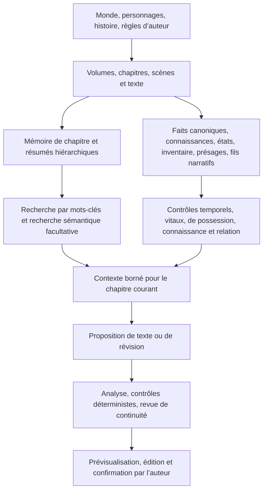

# StoryForge

[简体中文](../../README.md) · [English](./README.en.md) · [Français](./README.fr.md) · [Deutsch](./README.de.md) · [日本語](./README.ja.md) · [Español](./README.es.md)

> Partir d’une idée, achever une véritable œuvre, puis utiliser le moteur de monde pour la faire évoluer en romans, campagnes de jeu de rôle multijoueurs, interactions avec les personnages, jeux narratifs et univers partageable, jouable et co-créé.

StoryForge est un système libre, local par défaut, consacré à la création narrative assistée par intelligence artificielle et à l’exécution de mondes fictifs. La création de romans longs est aujourd’hui son produit le plus abouti. Le projet comprend déjà un parcours guidé, une infrastructure de cohérence à long terme, un atelier de monde, une création par nœuds, des campagnes locales en solo et une première version de dialogue avec un personnage. La production complète de jeux narratifs, le multijoueur en ligne, les versions immuables et l’écosystème communautaire restent des étapes planifiées.

**Communauté et tutoriels**

- Dépôt : https://github.com/yuanbw2025/storyforge
- Site du projet : https://yuanbw.vercel.app/
- Manuel vidéo : https://www.bilibili.com/video/BV1q37j6QExh/
- Groupe QQ : 1082374587

---

## Vision

Produire un court passage est devenu facile. Achever une œuvre longue exige toujours planification, continuité factuelle, évolution des personnages, résolution des promesses narratives, maîtrise du style et révisions répétées. Une fois l’œuvre terminée, son monde, ses personnages, ses relations, ses règles et ses structures restent souvent enfermés dans le texte.

StoryForge veut relier toute la chaîne :

```text
Une idée
  → une histoire et une œuvre complètes
  → le moteur de monde
      ├─ romans longs et séries
      ├─ campagnes de jeu de rôle multijoueurs
      ├─ interactions et aventures avec les personnages
      └─ jeux narratifs à embranchements, systémiques ou communautaires
  → publication, jeu, adaptation et collaboration
  → un monde narratif capable d’évoluer durablement
```

Les trois étapes sont : transformer l’idée en œuvre, transformer l’œuvre en ressource mondiale exécutable, puis publier des versions traçables et autorisées pour permettre lecture, jeu, dérivation et collaboration.

Le roman long reste une valeur centrale. Le moteur de monde et les produits interactifs prolongent la vie de l’œuvre sans remplacer l’écriture.

---

## État actuel

| Produit | État | Disponible aujourd’hui | Étape suivante |
|---|---|---|---|
| Moteur de monde | **Première tranche disponible** | Fondations, ressources, structures narratives, royaumes et instances réunis dans un même atelier | Propriété explicite monde/œuvre, narration exécutable, versions immuables, instances unifiées |
| Roman long | **Disponible · produit principal** | Parcours guidé de l’idée au texte, mode par nœuds pour l’orchestration libre, assistant conversationnel dans le parcours guidé | Renforcer les évaluations et la boucle de cohérence à l’échelle de millions de mots |
| Campagnes de jeu de rôle | **Campagne locale en solo disponible** | Assistance à la maîtrise, tests déterministes, combats, quêtes, emplois du temps des personnages non joueurs, points de contrôle et branches | Salles multijoueurs, places, synchronisation, permissions, maîtrise collaborative |
| Dialogue de personnage | **Première version à un personnage disponible** | Instantané figé, identité de l’utilisateur, scène, réponses progressives, régénération, points de contrôle et branches | Mémoire longue, salles multi-personnages, évolution des relations, aventure |
| Jeux narratifs | **Entrée expérimentale** | Sélection et liaison d’un monde ; l’entrée actuelle est en lecture seule | Éditeurs de choix, états, branches et fins ; publication et jeu |
| Partage de monde | **Paquet local disponible** | Attribution, licence, usages autorisés, avertissements et vérification d’intégrité | Publication, découverte, jeu, graphe des dérivations, collaboration et gouvernance |

---

## Une fondation commune, des usages indépendants

Chaque personne peut n’utiliser que la partie qui l’intéresse. Un romancier n’a pas besoin d’ouvrir une campagne. Un créateur de campagne n’a pas besoin d’achever un roman. Chaque entrée possède son interface et son état mutable, tout en partageant les faits et les limites de sécurité du monde.

La fondation comporte cinq couches :

1. **Canon du monde** : faits, règles, identités, entités et relations.
2. **Structure narrative** : thèmes, intrigues principales et secondaires, quêtes, scènes, choix et fins.
3. **Machine d’état du monde** : temps, états, événements, règles, hasard, points de contrôle, branches et relecture.
4. **Instances isolées** : romans, campagnes, dialogues et jeux évoluent séparément à partir d’une version du monde.
5. **Publication et communauté** : versions explicites, droits, découverte, dérivation et collaboration.

---

## Moteur de monde

Le moteur de monde constitue la première couche du produit. Il conserve les faits, les structures narratives et les règles d’exécution afin qu’un même monde puisse alimenter plusieurs formes.


### Fondations et canon

- Métarègles, frontière entre réalité et invention, physique et surnaturel.
- Origines, cosmologie, royaumes, croyances et cycle de vie du monde.
- Nature, société, géographie, histoire, systèmes de pouvoir et institutions.
- Personnages, organisations, factions, lieux, objets, espèces, ressources et connaissances.
- Relations de parenté, appartenance, hostilité, commerce, possession et connaissance.

### Plan narratif exécutable

- Thèmes, conflits centraux, crises d’époque et germes d’histoires.
- Intrigues principales et secondaires, quêtes, trajectoires de personnages, factions et exploration.
- Volumes, chapitres, scènes détaillées, événements, choix et fins.
- Conditions d’entrée, déclencheurs, échecs, effets d’état et déblocages.

StoryForge possède déjà histoires, plans, scènes détaillées et fils narratifs. Leur transformation en modules exécutables versionnés avec conditions et effets reste une étape du moteur de monde.

### Machine d’état

- Lier un instantané figé ou, plus tard, une version publiée immuable.
- Transformer les actions humaines et artificielles en propositions.
- Vérifier en code permissions, règles, prérequis, limites de ressources et ordre des événements.
- Appliquer les événements acceptés de manière déterministe.
- Enregistrer des points de contrôle, créer des branches et rejouer l’état.
- Renvoyer les événements intéressants vers l’écriture uniquement sous forme de propositions à valider.

### Disponible et limites

Les utilisateurs d’un monde unique peuvent ouvrir l’atelier sans activer le mode multi-mondes. Les fondations, ressources, récits, structures et instances réutilisent les données existantes. La complétude actuelle mesure la couverture des domaines, pas l’absence totale de conflits ni la préparation à la publication. La propriété explicite des mondes et œuvres, les versions immuables et les instances unifiées restent à réaliser par étapes.

---

## Roman long

### Trois modes pour un seul produit

| Mode | Rôle |
|---|---|
| **Parcours guidé** | Flux principal et le plus complet : idée, monde, histoire, personnages, plans, scènes, texte et organisation après chapitre |
| **Mode par nœuds** | Composition libre des mêmes capacités pour les auteurs avancés, sans dupliquer les données du roman |
| **Assistant principal** | Aide conversationnelle intégrée au parcours guidé, qui planifie et appelle les capacités existantes tout en conservant la validation des propositions |

Le mode par nœuds relie monde, histoire, personnages, plans, texte, continuité et contrôle. Il offre modèles de départ, outils de disposition, plans d’exécution, budgets, entrées et sorties visibles, pause, annulation, reprise et détection des résultats obsolètes.

L’assistant transforme les demandes en tâches ordonnées. Les résultats non adoptés restent explicitement hors canon et ne deviennent pas silencieusement des faits.

### Parcours de création

```text
Inspiration et références
  → prémisse et conflit thématique
  → monde, règles, histoire et géographie
  → personnages, relations, motivations et arcs
  → intrigues principales et secondaires
  → plans de volumes, chapitres et scènes
  → rédaction, continuation et édition
  → faits, états, présages, inventaire et chronologie
  → contrôle de continuité et planification suivante
```


### Architecture de cohérence pour les œuvres de plusieurs millions de mots

Cette échelle est un objectif d’ingénierie et d’évaluation, pas l’annonce d’un banc d’essai public déjà achevé.



| Mesure | Protection | Effet pour l’auteur |
|---|---|---|
| Plans hiérarchiques | Ordre normalisé des volumes, chapitres et scènes | Chaque chapitre garde une position et une fonction explicites |
| Mémoire et résumés | Résumés par chapitre, volume et œuvre avec pointeurs de source | Rappeler le passé pertinent sans injecter tout le manuscrit |
| Faits temporels | Propositions de faits puis confirmation, période de validité et provenance | Réduire contradictions de chronologie, état et monde |
| Connaissances des personnages | Séparer vérité du monde et savoir d’un personnage | Détecter révélations prématurées et fuites de point de vue |
| États et inventaire | Suivre acquisition, transfert, consommation et évolution | Réduire objets fantômes et changements inexpliqués |
| Fils et présages | Suivre progression, préparation, rappel et résolution | Garder visibles les promesses narratives de longue durée |
| Contexte borné | Choisir des sources enregistrées et signaler inclusion ou troncature | Comprendre ce que le modèle a réellement consulté |
| Contrôles déterministes | Vérifier les règles dures en code, rapporter les problèmes souples sans réécriture | L’auteur conserve la décision finale |
| Adoption des propositions | Contrôler la source et les modifications concurrentes avant écriture | Un résultat ancien ou non confirmé ne remplace pas le manuscrit |
| Cycle de vie des données | Export, import, suppression, migration et remappage enregistrés | Sauvegarder et restaurer un projet long avec moins de risques |

Les garanties dures concernent l’absence d’écriture sans confirmation, l’isolement des instances, les références, les portées et le cycle de vie. Les mémoires, résumés, recherches et registres sont des protections d’ingénierie. La qualité littéraire dépend toujours du modèle, des données et du jugement de l’auteur.

---

## Campagnes de jeu de rôle

La version actuelle permet de figer un monde, créer une campagne locale, gérer scènes, tours, actions, tests déterministes, narration proposée, combats, ressources, effets, résumés, quêtes, emplois du temps, temps global, journal, points de contrôle et branches.

La cible est multijoueur. Les salles en ligne exigent identité, places, synchronisation, permissions, gestion des conflits et service coordonné ; elles ne sont pas présentées comme achevées. Les événements de campagne ne modifient ni le roman ni le canon du monde.

---

## Dialogue de personnage

La première version à un personnage fournit un instantané figé, une identité utilisateur, une scène, des réponses progressives, des messages persistants, la régénération, des points de contrôle et des branches. Le dialogue n’altère pas la fiche source.

Les étapes suivantes couvrent mémoire longue, évolution des relations, frontières de connaissance, salles multi-personnages, déplacement, objets, capacités, quêtes, choix et aventure.

---

## Jeux narratifs

Trois familles sont prévues : aventures à embranchements, récits systémiques pilotés par règles et états, et œuvres dérivées par la communauté. L’entrée actuelle lie un monde en lecture seule. Le moteur partagé possède déjà événements, états, hasard, points de contrôle, branches et relecture ; les éditeurs de choix, branches, états et fins, ainsi que la publication et le jeu, restent à construire.

---

## Publication et communauté

Les paquets locaux gèrent déjà attribution, licence, avertissements, usages autorisés, périmètre de partage, hachage, contrôle avant import et conservation de la provenance. Manuscrits, notes privées, conversations d’assistant, sauvegardes d’instances, configuration d’interface et style personnel sont exclus par défaut.

La future boucle communautaire reliera création, publication, découverte, jeu, adaptation, co-création, retour et nouvelle version immuable. Le brouillon local restera l’autorité ; seuls les contenus explicitement publiés pourront être traités par les services communautaires.

---

## Intelligence artificielle, transparence et données

### Génération gouvernée et reprise

Les tâches créatives principales utilisent désormais une chaîne d’exécution unifiée. Chaque exécution fige son objectif, ses droits, le contexte utile, l’invite, les outils et l’identité du modèle. La génération est limitée à une tentative par défaut, avec au plus une correction ciblée lorsqu’un contrôle déterministe localise un défaut réparable. Le résultat reste une proposition modifiable ; les fragments valides et le brouillon initial sont conservés malgré les avertissements de qualité, et seules les données confirmées par l’auteur deviennent officielles. Un registre durable conserve points de reprise, dépendances, reçu final, jetons, durée et motif d’arrêt afin de reprendre une tâche interrompue sans répéter un appel déjà comptabilisé.

Cette architecture encadre l’exécution et fournit des preuves vérifiables ; elle ne garantit pas un résultat littéraire parfait avec chaque modèle. La phase actuelle de développement d’Agent, Harness et CREL est terminée, et la fiabilité créative entre maintenant dans une période expérimentale d’observation communautaire. L’A/B indépendant avec des auteurs et l’ancien seuil de qualité préenregistré ont été fermés par décision produit comme blocages de cette livraison ; cela ne transforme pas les résultats historiques en réussite et ne permet pas d’affirmer que le système réalise « 80 % du travail de l’auteur ». Voir la [note de version de l’architecture d’exécution](../AI-HARNESS-REBUILD-RELEASE-20260817.md) et la [décision d’observation communautaire](../adr/HARNESS-COMMUNITY-VALIDATION.md).

- L’intelligence artificielle lit uniquement les sources enregistrées utiles à la tâche, dans un budget explicite.
- Les sorties restent des propositions jusqu’à l’analyse, la validation déterministe et la confirmation.
- Les instances de jeu n’écrivent pas dans le canon de création.
- Les identifiants et hachages signalent les résultats obsolètes après modification des sources.
- Manuscrits et sauvegardes résident par défaut dans IndexedDB du navigateur.
- Un service en nuage reçoit le contexte pertinent envoyé au fournisseur choisi par l’utilisateur.
- Ollama ou LM Studio permettent d’utiliser un modèle local.
- Les sauvegardes JSON, dossier, instantané, Gist et paquet de monde assurent la portabilité.

Les fournisseurs intégrés comprennent OpenAI, Anthropic Claude, Google Gemini, Poe, NVIDIA NIM, DeepSeek, Qwen, Doubao, MiniMax, GLM, Wenxin, Kimi, ModelScope, Agnes AI, LongCat, OpenCode Go, Ollama, LM Studio et les points d’accès compatibles.

---

## Démarrage rapide

```bash
git clone https://github.com/yuanbw2025/storyforge.git
cd storyforge
npm install
npm run dev
```

Ouvrez `http://localhost:1111/storyforge/`.

StoryForge ne fournit pas encore de programme Windows autonome. Installez Node.js en version stable, ouvrez PowerShell dans le dossier du projet et exécutez les commandes ci-dessus.

---

## Développement et documentation

Lisez [le guide de contribution](../../CONTRIBUTING.md) et [les règles du dépôt](../../AGENTS.md). La [feuille de route actuelle](../roadmap/README.md) distingue l’existant du futur ; la [base de capacités](../roadmap/CAPABILITY-BASELINE.md) décrit les limites déjà livrées ; l’[architecture du monde et de la communauté](../WORLD-ENGINE-COMMUNITY-ARCHITECTURE.md) décrit la cible et ne signifie pas que tout est réalisé.

```bash
npm run test
npm run test:e2e
npm run check:architecture
npm run ci
```

---

## Licence

StoryForge est publié sous [licence MIT](../../LICENSE).
