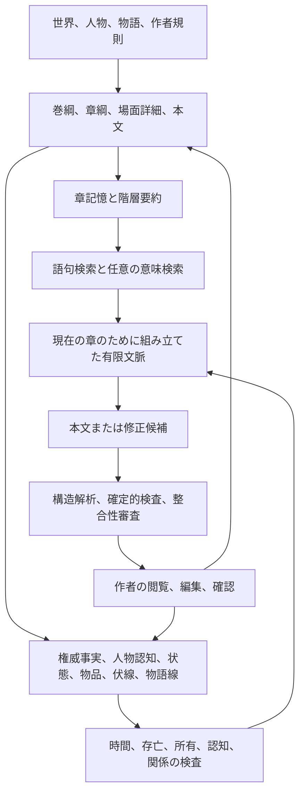

# StoryForge

[简体中文](../../README.md) · [English](./README.en.md) · [Français](./README.fr.md) · [Deutsch](./README.de.md) · [日本語](./README.ja.md) · [Español](./README.es.md)

> 一つの着想から本当の作品を完成させ、その作品をワールドエンジンによって、小説、複数人のテーブルトークゲーム、登場人物との交流、物語ゲーム、そして共有・遊戯・共同創作ができる物語世界へ育てます。

StoryForge は、オープンソースかつローカル優先の、人工知能による物語創作・世界運行システムです。現在もっとも完成度が高い製品は長編小説創作です。段階式創作、長期整合性の基盤、世界ワークスペース、ノード式創作、ローカルの一人用セッション、単一人物との対話をすでに備えています。物語ゲーム制作、オンライン複数人参加、変更不能な世界版の公開、コミュニティ生態系は今後の段階的な開発対象です。

**交流と解説**

- GitHub：https://github.com/yuanbw2025/storyforge
- プロジェクトページ：https://yuanbw.vercel.app/
- Bilibili 動画解説：https://www.bilibili.com/video/BV1q37j6QExh/
- QQ グループ：1082374587

---

## 構想

短い文章の生成は容易になりました。しかし長編作品を完成させるには、構成設計、事実の連続性、人物の成長、伏線の回収、文体の統制、反復的な推敲が必要です。作品が完成した後も、その世界、人物、関係、規則、物語構造は本文の中に閉じ込められ、遊べる内容、改作できる素材、共同創作できる資産へ変換しにくいままです。

StoryForge は、次の制作経路全体をつなぐことを目指します。

```text
一つの着想
  → 完成した物語と作品
  → ワールドエンジン
      ├─ 長編小説とシリーズ作品
      ├─ 複数人のテーブルトークゲーム
      ├─ 登場人物との交流と冒険
      └─ 分岐型、規則駆動型、共同制作型の物語ゲーム
  → 公開、遊戯、改作、共同創作
  → 成長し続ける物語世界
```

この経路には三つの段階があります。

1. **着想を物語にする：** 主題、人物、対立、世界の種を、設計・執筆・推敲できる作品へ整理します。
2. **物語を運行可能な世界資産にする：** 事実、人物、規則、物語構造、状態境界を共通の世界基盤へ蓄積します。
3. **世界を共同生態系へつなぐ：** 出所と権限が明確な版を公開し、他の人が読書、遊戯、派生、改作、共同創作を行えるようにします。

長編物語そのものが中核的な価値です。ワールドエンジンと対話型製品は創作を置き換えるものではなく、作品の寿命を延ばすためのものです。

---

## 現在の段階

| 製品形態 | 現在の状態 | 現在できること | 次の段階 |
|---|---|---|---|
| ワールドエンジン | **第一段階が利用可能** | 世界基盤、資産、物語構造、領域、運行実体を共通画面で扱う | 世界と作品の明示的な所属、実行可能な物語、変更不能な版、統一された実体 |
| 長編小説創作 | **利用可能・主要入口** | 段階式で着想から本文まで制作、ノード式で自由に編成、段階式の中で主助手が対話支援 | 数百万字規模の長期整合性、評価、制作循環の強化 |
| テーブルトークゲーム | **ローカル一人用が利用可能** | 進行支援、確定的判定、戦闘、任務、登場人物の日程、検査点、分岐 | 複数人の部屋、席、状態同期、権限、共同進行 |
| 登場人物との対話 | **単一人物の最小版が利用可能** | 凍結した人物情報、利用者の身分、場面、逐次応答、再生成、検査点、分岐 | 長期記憶、複数人物の部屋、関係変化、冒険方式 |
| 物語ゲーム | **実験入口** | 世界を選択して関連付ける。現在は読み取り専用で完成品を生成しない | 選択、状態、分岐、結末の編集、公開と遊戯の循環 |
| 世界共有 | **ローカル世界パッケージが利用可能** | 署名、許諾、用途、内容警告を指定して世界パッケージを出力・検証 | オンライン公開、発見、遊戯、派生関係、協力、共同統治 |

---

## 一つの世界基盤、独立した利用形態

利用者は必要な部分だけを選べます。小説家がゲームに参加する必要はなく、ゲーム制作者が長編小説を完成させる必要もありません。登場人物との対話だけを使う人も、物語ゲームを作る必要はありません。各入口は独立した画面と可変状態を持ちながら、世界の事実と安全境界を共有します。

共通基盤は五つの層から成ります。

1. **世界の権威事実：** 世界を成立させる事実、規則、身分、実体、関係。
2. **物語構造：** 主題、主線、副線、任務、場面、選択、結末。
3. **世界状態機械：** 時間、状態、出来事、規則、乱数、検査点、分岐、再生。
4. **隔離された運行実体：** 小説、セッション、対話、ゲームは同じ世界版を使えても、それぞれ独立して変化します。
5. **公開と共同体：** 明示的な版、権限、発見、派生、共同制作。

---

## ワールドエンジン

ワールドエンジンは製品能力の第一層です。同じ世界が長編小説、テーブルトークゲーム、登場人物との交流、物語ゲームに再利用できるよう、事実、物語構造、運行規則を保存します。


### 世界基盤と権威事実

- 現実と幻想、物理と超自然の境界を定める基本規則。
- 起源、宇宙構造、領域、信仰、世界のライフサイクル。
- 自然、社会、地理、歴史、力の体系、制度。
- 人物、組織、勢力、場所、物品、生物、資源、知識項目。
- 血縁、所属、敵対、交易、所有、認知を含む関係。

### 実行可能な物語設計図

- 主題、中心対立、時代的危機、物語の種。
- 主線、副線、任務連鎖、人物線、勢力線、探索線。
- 巻、章、場面詳細、重要出来事、選択、結末。
- 進入条件、発動条件、失敗条件、状態効果、後続開放。
- 開始状況、推奨人物、既定時点、自由探索入口。

StoryForge にはすでに物語、大綱、詳細綱、物語線の構造があります。条件、効果、版を備えた実行可能な物語モジュールへの統一は、今後のワールドエンジン開発に含まれます。

### 世界状態機械

- 凍結した世界スナップショット、将来は変更不能な公開版に結び付けます。
- 利用者と人工知能の行動を、まず候補として扱います。
- 権限、規則、前提条件、資源上限、出来事順序をコードで検証します。
- 受理された出来事だけを確定的に適用し、検査点、分岐、再生を保存します。
- 価値ある運行結果は、作者が確認できる候補としてのみ創作側へ戻します。

### 現在利用できることと境界

- 単一世界の利用者は、多世界方式を有効にしなくても完全な世界ワークスペースを開けます。
- 世界基盤、資産、物語設計、領域、状態、運行実体は既存のプロジェクト資料を再利用します。
- 世界の充足度は本文の進度ではなく、登録済み領域の充足状況から算出されます。
- 段階式創作は安定基線として残り、世界ワークスペースが設定や大綱を複製することはありません。
- ローカル世界パッケージは署名、許諾、内容警告、許可用途、完全性検査を含められます。
- 現在の `Project` は互換性のあるローカル保存境界です。明示的な世界、作品、複数作品の所属は今後の移行対象です。

---

## 長編小説創作

長編創作は StoryForge でもっとも成熟した製品であり、多くの利用者にとって主要入口です。

### 一つの長編製品を支える三つの創作方式

| 方式 | 役割 | 相互関係 |
|---|---|---|
| **段階式** | 着想、世界設定、大綱、本文、章後整理を順に進める主要作業流 | 現在もっとも完全で安定した基線 |
| **ノード式** | 上級作者が生成手順、資料、制御を自由に組み合わせる作業流 | 同じ世界、人物、大綱、原稿資料を読み書きする |
| **主助手** | 段階式の中に組み込まれた対話支援 | 既存能力を計画・呼出しし、候補確認を保持する |

段階式では、作者が着想、世界、物語、人物、大綱、詳細綱、本文、章後整理を一段ずつ進めます。各段階で手作業による編集、関連資料の確認、人工知能結果の採否を行えます。

ノード式は同じ長編能力を自由に編成できる創作図にします。世界、物語、人物、大綱、本文、連続性、制御の各ノードを接続でき、実行順、費用枠、実際の入出力、停止、再開、期限切れの下流結果、候補採用を記録します。ノード図は編成と証拠だけを保存し、小説本文の複製は作りません。

主助手は自然言語の依頼を、世界、着想、人物、大綱、本文の順序ある作業へ分解します。候補、確認、拒否、失敗、実行状態を保存し、未採用の上流結果を正式な事実として扱いません。

### 着想から本文まで

```text
着想と参考資料
  → 物語の核と主題対立
  → 世界、規則、歴史、地理
  → 人物、関係、動機、成長線
  → 主線と副線
  → 巻綱、章綱、場面詳細
  → 本文生成、続筆、編集
  → 事実、状態、伏線、物品、時間線の整理
  → 整合性検査、影響分析、後続計画
```


### 数百万字作品のための整合性構造

数百万字規模は工学上の目標と評価方向です。公開済みの数百万字品質試験をすでに完了したという主張ではありません。



| 対策 | StoryForge が行うこと | 作者が得られる効果 |
|---|---|---|
| 階層計画 | 巻、章、場面詳細、本文の順序を統一 | 各章の位置と目的が明確になる |
| 章記憶と階層要約 | 引継ぎ情報、章・巻・全書要約、出所を保存 | 原稿全体を毎回投入せずに関連前史を呼び戻せる |
| 時系列付き権威事実 | 本文から候補を抽出し、作者確認後に時間と出所を記録 | 生死、年代、設定の矛盾を減らす |
| 人物認知台帳 | 世界の真実と、特定章で人物が知っていた内容を分離 | 早すぎる知識取得や視点漏れを検出する |
| 状態・物品台帳 | 人物、場所、勢力、取得、移動、消費を追跡 | 物品消失や説明のない状態飛躍を減らす |
| 物語線と伏線 | 段階、約束、設置、呼応、回収を追跡 | 長期連載中も未回収線を見失いにくい |
| 有限文脈の組立て | 現在の作業に必要な登録資料だけを選び、採用と切捨てを記録 | 人工知能が何を読んだか作者が確認できる |
| 検索 | 語句と階層要約を既定とし、意味検索を任意にする | 費用を制御しながら遠距離の出来事を想起しやすい |
| 確定的検査 | 硬い規則はコードで検査し、柔らかい問題は読取専用の審査で報告 | 問題が見えたままになり、勝手に改稿されない |
| 候補採用 | 正式書込み前に閲覧、同時変更検査、作者確認を行う | 古い結果や未確認結果が作品を上書きしない |
| データのライフサイクル | 登録表をエクスポート、インポート、削除、移行、参照の再マッピングに参加させる | 長期作品を安全に保存・復元できる |

**コードによる保証：** 未確認候補は正式資料になりません。運行実体は小説を書き換えません。範囲、参照、同時変更、登録済みライフサイクルをコードで検査します。

**工学的な保護：** 記憶、要約、検索、権威事実、認知、物品、物語線、伏線、審査によって長距離の誤りを減らし、根拠を見えるようにします。

**品質の境界：** 生成品質は利用するモデル、指示、資料の完全性、作者の判断に左右されます。StoryForge は誤りを減らして修正可能にしますが、文学的・論理的問題をすべて自動で消すとは約束しません。

---

## 複数人のテーブルトークゲーム

現在のローカル機能には、凍結した世界資料、場面、手番、行動、確定的判定、人工知能の描写候補、戦闘順、攻撃、損害、資源、状態効果、セッション要約、任務、登場人物の日程、共有時計、出来事記録、検査点、分岐、再読込復旧、持運び可能な保存が含まれます。

目標形態は複数人参加です。一人の人間または人工知能が進行し、複数の参加者が別々の人物、秘密、行動、結果を持ちます。オンラインの部屋には身分、席、状態同期、権限、衝突処理、サーバー連携が必要であり、現在のローカル構造では完成済みとして扱いません。

セッションの出来事はその実体だけを変化させ、小説本文や世界の権威事実を書き換えません。価値ある出来事だけが、作者確認用の物語候補として将来戻せます。

---

## 登場人物との対話と冒険

現在の単一人物最小版は、凍結した世界と人物のスナップショット、利用者の身分、場面設定、逐次応答、保存済み発言、再生成、検査点、分岐を扱います。対話状態は元の人物資料から隔離されます。

今後は長期要約と出来事記憶、関係変化、知識境界、複数人物の部屋、発言順、移動、物品、能力、任務、選択、乱数判定、対話から文字冒険への連続移行を計画しています。

---

## 物語ゲーム

StoryForge は三つの形態を計画しています。

| 形態 | 体験 |
|---|---|
| 分岐冒険 | 作者が重要節点と結末を設計し、選択が関係、資源、経路を変える |
| 規則駆動物語 | 規則、状態、出来事によって生存、経営、推理、成長、探索を支える |
| 共同体による派生 | 読者が外伝、人物別経路、別世界、遊べる改作を制作する |

現在は読み取り専用の世界関連付け入口と、物語ゲーム用途を指定できる世界パッケージ権限があります。共有運行基盤には出来事、状態、乱数、検査点、分岐、再生があります。選択編集、状態設計、分岐図、結末管理、公開、遊戯の循環はまだ完成していません。

---

## 公開とコミュニティ

ローカル世界パッケージは、署名、許諾、内容警告、許可用途、共有範囲、完全性検査、インポート前の閲覧、隔離された複製、出所保持をすでに扱えます。原稿、私的な備考、助手との会話、運行保存、接続設定、個人文体は既定では含みません。

将来の循環は次の通りです。

```text
創作して公開
  → 発見して遊ぶ
  → 改作して共同創作
  → 世界の進化へ戻す
  → 新しい変更不能な版を公開
```

計画中の機能には、目録、検索、札、遊べる形式、変更不能な版、差分と依存、派生関係、許諾連鎖、追跡、意見、評価、遊戯統計、招待、構造化された変更提案、審査、統合、権限、統治記録が含まれます。

ローカル草稿が常に権威を持ちます。共同体のサービスが扱えるのは、利用者が明示的に公開した内容と付随情報だけです。

---

## 人工知能、透明性、資料安全

### 統制された生成と再開

主要な創作作業は、統一された実行基盤を通して処理されます。各実行では、目的、権限、必要な文脈、指示文、道具、モデルの識別情報を固定します。生成は原則一回に制限し、確定的な検査によって修正可能な問題を特定できた場合にだけ、一回までの対象限定修正を許可します。結果は編集可能な候補として残り、軽微な品質警告があっても有効な部分と元の草稿を失いません。作者が明示的に確認した内容だけが正式資料へ書き込まれます。永続的な実行台帳には、再開地点、依存関係、終了記録、使用量、所要時間、停止理由を保存し、中断後も完了済みの呼出しを重ねずに再開できます。

この構造が保証するのは実行境界と検証可能な証拠であり、どのモデルからも常に完全な文学作品が得られるという約束ではありません。Agent、Harness、CREL の今回の開発段階は完了し、創作信頼性は実験的な共同体観察期間に入りました。独立作者 A/B と旧事前登録品質基準は、製品判断によって今回の提供を妨げる条件から外されました。これは過去の結果が合格になったことを意味せず、「作者作業の 80 % を代行する」という主張も支えません。詳しくは[実行基盤の更新説明](../AI-HARNESS-REBUILD-RELEASE-20260817.md)と[共同体観察の判断](../adr/HARNESS-COMMUNITY-VALIDATION.md)を参照してください。

- 人工知能は、現在の作業に関連する登録済み資料だけを、明示された容量内で読みます。
- 出力は構造解析、確定的検証、作者確認を通るまで候補です。
- 世界創作と運行状態は隔離され、運行出来事が公開版や創作中の権威事実を書き換えることはありません。
- 出所識別子と要約値により、原稿や世界資料が変わった後の古い結果を期限切れとして示します。
- 原稿、設定、運行保存は既定でブラウザーの IndexedDB に保存されます。
- クラウドのモデルサービスを選んだ場合、その作業に必要な文脈が選択したサービスへ送信されます。
- ローカルの Ollama または LM Studio を使えば、生成を利用者の端末内に保てます。
- JSON、フォルダー、スナップショット、Gist、世界パッケージによって保存と移行ができます。

三つの単一事実源は次の通りです。

| 登録表 | 責任 |
|---|---|
| `CONTEXT_SOURCES` + `assembleContext()` | 人工知能が読める内容と文脈の組立て方 |
| `FIELD_REGISTRY` + `AdoptionSchema` + `adopt()` | 人工知能が書ける内容と候補の検証・採用方法 |
| `PROJECT_TABLES` | エクスポート、インポート、削除、移行、範囲、参照の再マッピングを含むライフサイクル |

---

## クイックスタート

```bash
git clone https://github.com/yuanbw2025/storyforge.git
cd storyforge
npm install
npm run dev
```

`http://localhost:1111/storyforge/` を開いてください。

現在、Windows 用の `.exe` または持運び版は配布していません。Node.js の長期サポート版を導入し、プロジェクトフォルダーで PowerShell を開いて上記のコマンドを実行してください。

---

## 開発と資料

貢献前に [CONTRIBUTING.md](../../CONTRIBUTING.md) と [AGENTS.md](../../AGENTS.md) を読んでください。

```bash
npm run test
npm run test:coverage
npm run test:e2e
npm run check:architecture
npm run ci
```

現在の開発順序は [docs/roadmap/README.md](../roadmap/README.md)、能力基線は [CAPABILITY-BASELINE.md](../roadmap/CAPABILITY-BASELINE.md)、世界と共同体の目標構造は [WORLD-ENGINE-COMMUNITY-ARCHITECTURE.md](../WORLD-ENGINE-COMMUNITY-ARCHITECTURE.md) を参照してください。計画項目は自動的に現在の機能を意味しません。

---

## 使用許諾

StoryForge は [MIT License](../../LICENSE) で公開されています。
