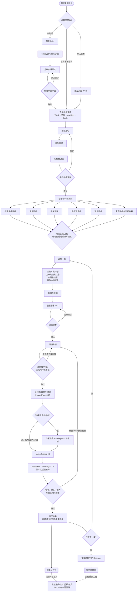
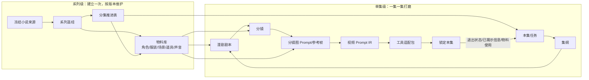
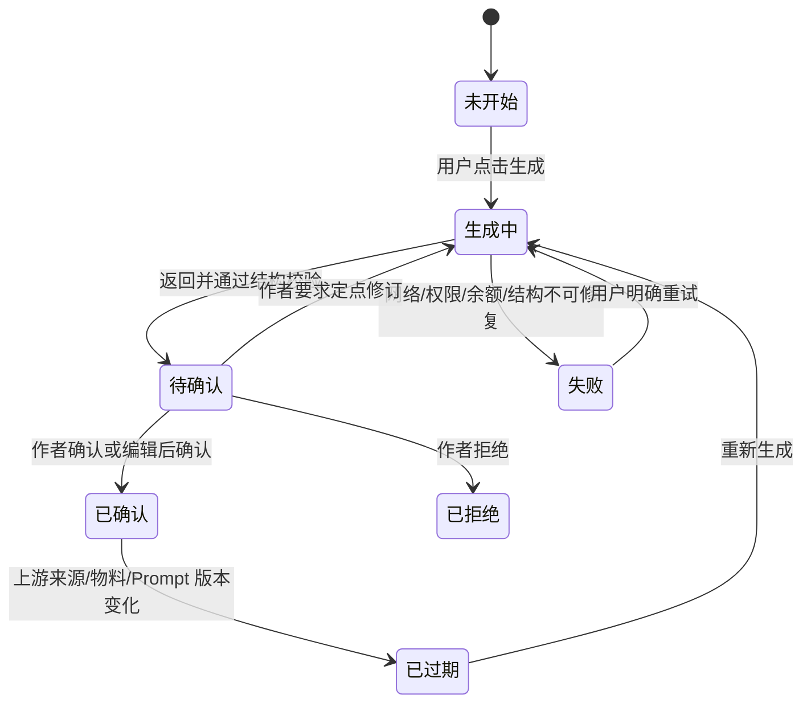
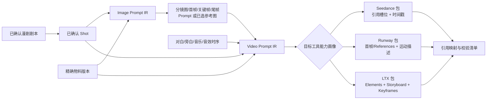

# 漫剧内容生产流程图

> 版本：1.0.0 · 生效：2026-09-09
> 产品终点：完整前期生产包；不包含视频生成、选片、剪辑和漫剧成片。

## 1. 主生产流程



## 2. 一次性资产与逐集循环



关键语义：

- 物料不是每集重做；角色、服装、场景、道具和声音先成为稳定版本，单集只绑定精确版本。
- 单集锁定后才推进故事状态；下一集读取的是经过作者确认的退出状态，不是模型临时摘要。
- 物料升级产生 v2，不覆盖 v1；已锁定旧集保持可复现，未来集可显式迁移。

## 3. 每一步的候选与确认



后台仍保留 run、输入 revision、Prompt hash、Context Manifest、原始响应、最多一次结构修复和终态回执，但用户不需要管理一个复杂 Harness。

## 4. Prompt 编译路径



核心数据保存 provider-neutral Image/Video IR。工具包是可重新编译的派生物，供应商更新时升级 adapter/capability profile，不改写剧本、分镜和已选参考帧。

## 5. 单集交付包结构

```text
EP001/
├─ episode-brief.md
├─ motion-drama-script.md
├─ motion-drama-script.json
├─ storyboard.csv
├─ storyboard.md
├─ image-prompt-ir.json
├─ video-prompt-ir.json
├─ shot-references/
├─ assets/
│  ├─ asset-map.json
│  ├─ character/
│  ├─ costume/
│  ├─ location/
│  ├─ prop/
│  └─ sound/
├─ adapters/
│  ├─ seedance.md
│  ├─ seedance.json
│  ├─ runway.md
│  ├─ runway.json
│  ├─ ltx.md
│  └─ ltx.json
├─ review-receipt.json
└─ manifest.json
```

`manifest.json` 固定 source、series、episode、asset、Prompt template、adapter 和文件内容 hash。缺实际参考媒资时，包必须标为 `prompt-only`；全部必需参考媒资和权利信息齐备后才能标为 `reference-ready`。
