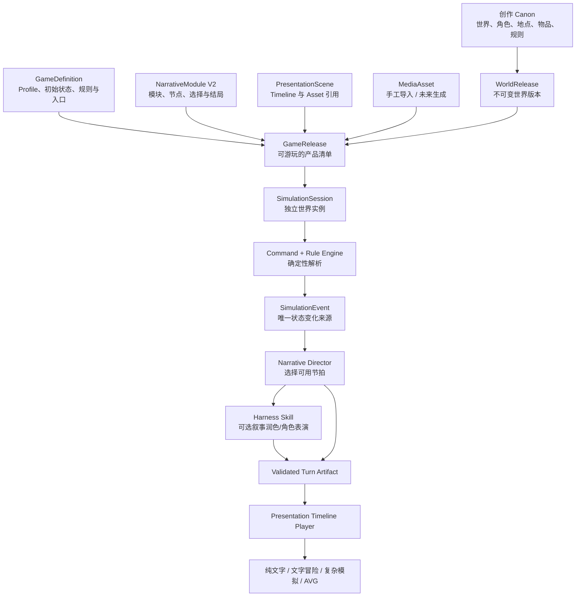
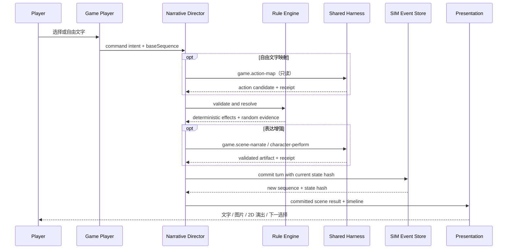

# 【已归档】TEXTGAME-1 · 通用文字游戏、复杂叙事模拟与 2D 演出设计

> 归档裁决（2026-08-13）：本文曾把纯文字、复杂模拟、AVG/Galgame、媒资和生图放入同一施工体系，
> 范围过大，已不再作为开工依据。当前类型规划见 [`../TEXT-GAME-TYPES.md`](../TEXT-GAME-TYPES.md)，
> 文字开放世界最终阶段方向见 [`../TEXT-OPEN-WORLD-DIRECTION.md`](../TEXT-OPEN-WORLD-DIRECTION.md)。本文只保留历史思考和
> 可复用接口参考；其中 Presentation、Media 与 `TEXTGAME-1E/1F/1G` 阶段均未获当前施工授权。

> 状态：`DESIGN READY`（2026-08-13）
>
> 主归属：TEXTGAME-1；兼容并吸收 CHATGAME-1 后续“长期记忆 / 多角色 / 冒险”范围
>
> 基座：WORLD-2、SIM-1、现有可执行叙事蓝图、正在收口的 Agent + Harness
>
> 目标体验：从纯文字互动故事，平滑扩展到复杂状态模拟与 AVG / Galgame 式 2D 叙事演出

## 0. 结论

这项功能不应重做世界引擎、事件运行时或 Agent Harness，也不能只把现有单角色聊天面板继续堆大。
正确路线是新增一个独立的上层产品域 `TEXTGAME-1`，复用当前底座，并补齐四个通用能力：

1. **通用游戏定义与状态规则**：覆盖角色、物品、能力、关系、任务、组织、资源、时间、危机和结局，
   不把朝代、修仙境界、星际政体或都市职业写死在核心引擎中。
2. **完整叙事导演层**：把篇章、场景、节拍、选择、条件、后果、路线和结局统一为可执行结构，
   同时支持作者预制、系统涌现和 AI 辅助三种内容来源。
3. **呈现与媒资层**：文字是永远可用的基线；图片、立绘、CG、转场、镜头、粒子、音频等通过
   可降级的 Scene Timeline 叠加，当前没有生图能力也不阻塞纯文字游戏。
4. **运行实例作用域的 Harness 接口**：复用同一套 RunContract、Skill、事件账本、预算、恢复和回执，
   但需要给现有 Harness 增加 `instance` 作用域；不得为文字游戏复制第二套 Agent Loop。

因此，对“是否等 Harness 重构完成”的裁决是：

- **不需要等待的工作**：产品合同、通用状态模型、确定性命令/事件、叙事结构、纯文字垂直切片、
  媒资显示与 2D 演出引擎，都可在现有 WORLD-2 / SIM-1 上开始。
- **必须等待公共接口稳定的工作**：正式的运行中 AI 叙事、多角色导演、动态事件生成、自动摘要和未来
  生图任务，应接入共享 Harness 的 instance-scope 能力后再发布。
- **绝对不做的工作**：临时复用旧聊天直连模型、在组件里拼 Prompt、另建文字游戏专用 Agent 表、
  让模型直接修改存档，或把 AI 返回文本当成已发生的世界事实。

## 1. 产品目标与范围

### 1.1 核心目标

同一套能力应能承载以下产品，而不是为每一类游戏另做引擎：

| 体验档位 | 示例能力 | 必需模块 |
|---|---|---|
| 纯文字互动故事 | 旁白、对话、选择、条件分支、多个结局 | 叙事蓝图、文字播放器、存档分支 |
| 文字冒险 / 轻 RPG | 角色、物品、能力、任务、地点移动、关系 | 通用状态、命令与规则、叙事导演 |
| 复杂叙事模拟 | 多组织、多资源、政策/行动、时间推进、事件链、信息差 | 系统模拟、因果链、日程、动态事件 |
| AVG / Galgame | 背景、立绘、表情、CG、镜头、转场、文字节奏、音效 | 呈现时间线、媒资系统、播放器 |
| 混合型 | 复杂模拟结果以精编剧情和 2D 演出呈现 | 以上模块按 Profile 组合 |

“崇祯模拟器式”目标只代表复杂状态、困难决策、长期因果和叙事密度；“AVG / Galgame 式”目标只代表
场景演出和叙事节奏。二者都不是题材模板，更不应把历史官制、灾荒数值或任何具体作品内容写进引擎。

### 1.2 通用题材要求

核心引擎只理解稳定语义，不理解题材专有名词：

| 通用概念 | 历史题材可映射为 | 玄幻题材可映射为 | 科幻题材可映射为 | 都市题材可映射为 |
|---|---|---|---|---|
| `organization` | 朝廷、军镇、商帮 | 宗门、家族、魔教 | 舰队、公司、殖民地 | 企业、社群、部门 |
| `resource` | 粮秣、军饷、民心 | 灵石、气运、灵力 | 能源、算力、声望 | 现金、信用、精力 |
| `capability` | 政务、军略、交涉 | 功法、神通、炼丹 | 黑客、工程、导航 | 专业技能、人脉 |
| `policy/action` | 任命、赈灾、征税 | 闭关、探索、结盟 | 跃迁、科研、谈判 | 投资、调查、社交 |
| `world metric` | 国势、灾情、边防 | 天道异变、宗门稳定 | 舰体完整、殖民稳定 | 舆情、市场、治安 |

所有题材差异由 **类型包（Genre Pack）** 提供名称、初始模板、规则预设、UI 映射和 AI 风格约束。
类型包不能增加任意数据库表、执行脚本或绕过通用事件闭集。

### 1.3 本阶段明确非目标

- 不复刻任何具体游戏的剧情、数值、角色、美术或 UI。
- 不在第一阶段提供实时联机、多人同步或社区服务。
- 不以 AI 自由文本代替规则系统、事件日志或存档。
- 不要求用户必须配置图片、音频或模型才能游玩。
- 不在首个版本引入完整 2D 游戏引擎、骨骼动画、视频剪辑或任意脚本插件。
- 不把运行事件自动写回小说正文、世界 Canon 或角色主档。

## 2. 当前基线审计

### 2.1 可以直接复用

| 现有能力 | 复用方式 | 裁决 |
|---|---|---|
| World / Work 显式所有权 | 游戏定义属于 World 或 Work，游玩实例属于 instance | 直接复用 |
| WorldRevision / WorldRelease | 冻结世界来源并形成不可变版本 | 直接复用 |
| NarrativeModule / NarrativeNode | 作为主线、支线、任务、开局和结局的逻辑图 | 升级，不另建平行叙事图 |
| SimulationSession / Event / Checkpoint | 存档、事件追加、回放、检查点、分支、确定性随机 | 直接复用并扩充闭集 |
| Canon Snapshot | 游戏创建时冻结角色、地点、物品、规则和世界来源 | 直接复用并扩充来源种类 |
| `CONTEXT_SOURCES.simulationRuntime` | 给 AI 提供经过预算和作用域校验的运行时事实 | 扩展 reader，不新建旁路 |
| TTRPG-1 / CHATGAME-1 | 复用候选解析、过期基线、事件提交、分支和 UI 经验 | 作为适配器/兼容入口，不作为新核心 |
| Harness RunContract / ledger / checkpoint / receipt | 管理运行中 AI 的权限、预算、恢复和质量证据 | 复用，先补 instance scope |

### 2.2 现有能力不足

1. `SimulationRuntimeState.version=1` 主要是实体标量、记忆、叙事，以及 TTRPG / chat 私有子状态；
   尚无通用资源、能力、库存、关系、任务、组织、全局指标、日程和触发器模型。
2. 现有 `NarrativeNode` 只有条件、效果和后继；选择项没有独立标签、代价、命令、预览和失败原因，
   也没有篇章/场景/节拍的叙事元数据。
3. 现有 `set / increment / unset` 可以证明确定性执行，但无法安全表达转移物品、改变关系、启动任务、
   触发检查、安排日程等领域动作；任意 path patch 也不适合作为长期规则 API。
4. 当前没有正式媒资表、二进制便携合同、图片播放器、演出时间线或降级策略。
5. 当前 `AgentRunScopeV1` 和 `agentRuns` 生命周期按 Work 所有权实现，不能正确表达仅属于游戏实例的 Run。
6. 单角色聊天 MVP 的直线消息状态不能代表多角色导演、系统事件或完整文字游戏。

WORLD-2F 已有 `storygame` 会话类型和可执行节点推进入口，证明“发布叙事 → 冻结实例 → 条件/效果 →
事件回放”链路可用；它是 TEXTGAME-1 的最小技术入口，不等同于本方案中的完整文字游戏产品。

### 2.3 唯一归属

- `SIM-1` 继续只负责通用确定性运行时，不吸收播放器、类型包或游戏编辑器。
- `CHATGAME-1` 已交付的单角色聊天保留兼容；其尚未完成的长期记忆、多角色与冒险统一转入
  `TEXTGAME-1`，避免聊天和文字游戏形成两个状态模型。
- `TTRPG-1` 保留规则/战役产品身份；可逐步消费通用 Game State，但不要求立刻迁移已有存档。
- `TEXTGAME-1` 是游戏定义、叙事导演、游戏播放器、呈现/媒资和类型包的唯一上层归属。

## 3. 目标架构



### 3.1 六层职责

1. **World Definition**：回答世界中什么真实、谁存在、规则是什么。
2. **Game Definition**：回答玩家扮演谁、能做什么、初始状态、胜负/结局和启用哪些体验模块。
3. **Simulation Runtime**：回答当前时刻什么已经发生，且能否通过事件完全重放。
4. **Narrative Director**：回答下一段应该讲什么、哪些选择可用、如何保持节奏与因果。
5. **Harness**：在明确事实和允许动作范围内生成/评审文字与有限结构化候选。
6. **Presentation Runtime**：回答文字、图片、角色、镜头、效果和声音如何按时间呈现。

依赖只能从上层调用下层公开合同。Presentation 不改世界状态；Harness 不跳过 Rule Engine；
Simulation 不读取可变 Canon；Game Definition 不复制 World Canon。

## 4. Game Definition 与体验 Profile

### 4.1 `GameDefinitionV1`

建议新增世界/作品域记录 `gameDefinitions`，最小合同如下：

```ts
interface GameDefinitionV1 {
  id: number
  projectId: number
  worldId: number
  workId: number | null
  gameKey: string
  title: string
  description: string
  profile: GameProfile
  playerConfigJson: string
  initialStateJson: string
  rulesetJson: string
  genrePackRefsJson: string
  presentationPolicyJson: string
  status: 'draft' | 'ready' | 'archived'
  schemaVersion: 1
}
```

`GameProfile` 不应是互斥游戏类型，而是能力开关组合：

```ts
interface GameProfile {
  narrative: 'authored' | 'systemic' | 'hybrid'
  interaction: 'choices' | 'free-text' | 'mixed'
  stateDepth: 'minimal' | 'adventure' | 'simulation'
  cast: 'single' | 'multi'
  presentation: 'text' | 'visual-novel'
  aiMode: 'off' | 'optional' | 'required'
}
```

这样，纯文字复杂模拟、带图片的线性故事、无图片的多角色冒险都只是 Profile 组合，不需要分叉引擎。

### 4.2 发布关系

建议新增不可变 `gameReleases`，而不是把游戏产品清单继续塞入 `WorldRelease`：

- `WorldRelease` 冻结共享世界事实。
- `GameRelease` 必须绑定一个未篡改的 `WorldRelease`，并冻结游戏定义、入口模块、选择、演出场景、
  规则集、类型包版本和媒资 manifest。
- 正式游玩实例绑定 `gameReleaseId`；草稿试玩可绑定显式 `draftSnapshotHash`。
- `simulationSessions` 增加可选 `gameReleaseId / gameDefinitionId`，但运行后不再读取可变游戏定义。
- 新游戏实例继续使用现有 `kind='storygame'`，不再为每个 Profile 增加 session kind。
- 社区发布未来以 Game Package 携带 `GameRelease + 所需 WorldRelease 子集 + Asset Manifest`，
  不把个人存档、Agent Run、API 配置或未发布草稿打包。

这保持“世界可被多个作品/游戏复用”，也允许同一世界提供线性剧情、开放探索和复杂模拟等多个产品。

## 5. 通用游戏状态模型

### 5.1 从 Runtime V1 演进到 V2

不废弃 `SimulationRuntimeStateV1`。新增可迁移、模块化的 `GameStateV2`，旧 TTRPG / CHATGAME 存档仍由
原 reducer 读取；只有新建 TEXTGAME-1 实例使用 V2。

```ts
interface GameStateV2 {
  schema: 'storyforge.game-state'
  version: 2
  clock: GameClock
  turn: number
  entities: Record<string, GameEntity>
  locations: Record<string, LocationState>
  inventories: Record<string, InventoryState>
  capabilities: Record<string, CapabilityState>
  relationships: Record<string, RelationshipState>
  organizations: Record<string, OrganizationState>
  objectives: Record<string, ObjectiveState>
  metrics: Record<string, MetricState>
  schedules: Record<string, ScheduleState>
  knowledge: Record<string, KnowledgeState>
  narrative: GameNarrativeState
  flags: Record<string, RuntimeScalar>
  lastSequence: number
}
```

### 5.2 状态组件

| 组件 | 必须表达 | 禁止做法 |
|---|---|---|
| Entity | 身份、生命周期、位置、标签、标量属性 | 把完整 Canon 卡复制后持续双向同步 |
| Resource / Metric | 当前值、上下限、可见性、来源 | 在叙事文本中暗改数值 |
| Inventory | 持有人、数量、装备位、容器、转移原因 | 直接复用创作层物品账本作为存档 |
| Capability | 等级、熟练、冷却、条件、消耗 | 将“法术”“枪械”等题材词写进核心枚举 |
| Relationship | 有向维度、公开/私密、证据序号 | 只保存一个模糊好感度覆盖全部关系 |
| Organization | 成员、立场、资源、目标、层级关系 | 只为朝廷或宗门设计固定字段 |
| Objective | 主线/支线/个人目标、阶段、期限、结果 | 让 AI 自由决定完成状态 |
| Schedule | 主体、时间窗、地点、活动、重复方式 | 每轮由模型重新编造日程 |
| Knowledge | 主体知道/误解/遗忘什么，证据来自何事件 | 把全局状态无差别暴露给每个角色 |
| Narrative | 当前模块、场景、节拍、路线、伏线/回收、结束状态 | 把 UI 当前页当作剧情进度权威 |

关系、资源和能力的具体维度全部由 Definition / Genre Pack 声明；状态层只执行经校验的定义。

### 5.3 复杂模拟的通用机制

复杂模拟至少包含：

- 离散回合与可配置游戏日历；所有时间推进形成事件。
- 主体行动槽、组织行动、NPC 日程和延迟效果。
- 资源流入/流出、上下限、债务/欠量策略和来源审计。
- 多指标联动、阈值、趋势、危机等级和恢复窗口。
- 条件触发器、事件队列、互斥组、冷却、优先级和确定性随机抽取。
- 公开信息、玩家可见信息、角色私有知识和导演专用真相四层视图。
- 行动 → 即时结果 → 延迟后果 → 新事件/选择的可追踪因果链。
- 失败、死亡、组织瓦解、资源耗尽和多种结局均由规则定义，不由题材硬编码。

## 6. Command、Rule 与 Event

### 6.1 玩家输入不等于状态效果

玩家点击选择或输入自由文字后，系统先形成 `GameCommand`：

```ts
interface GameCommand {
  commandId: string
  actorKey: string
  actionKey: string
  targetKeys: string[]
  parameters: Record<string, RuntimeScalar>
  baseSequence: number
  stateHash: string
}
```

`actionKey` 必须来自发布时冻结的动作目录。自由文字可由 AI 映射成允许的 action + 参数候选，但玩家原文
永远不是可执行脚本。

### 6.2 确定性效果闭集

V2 使用领域效果，不继续扩大任意 path patch：

- `clock.advance`
- `entity.move / entity.status.set / entity.attribute.set`
- `resource.change / metric.change`
- `inventory.grant / inventory.consume / inventory.transfer / equipment.set`
- `capability.learn / capability.progress / capability.cooldown.set`
- `relationship.change`
- `organization.membership.set / organization.resource.change / organization.stance.set`
- `objective.start / objective.advance / objective.complete / objective.fail`
- `schedule.upsert / schedule.cancel`
- `knowledge.record / knowledge.correct / knowledge.forget`
- `trigger.schedule / trigger.cancel`
- `narrative.advance / narrative.route.set / narrative.complete`

每一种效果都有独立 parser、上限、引用校验、作用域检查和 reducer；未知操作拒绝。规则只产生效果候选，
最终事件保存已解析命令、规则版本、随机证据、效果批次、前后 state hash 和因果来源。

### 6.3 原子 Turn

一个玩家回合采用单一领域事务：

1. 读取当前 sequence / state hash，拒绝 stale 命令。
2. 校验角色、目标、资源、冷却、可见性和 Narrative gate。
3. 用 session seed 解析随机结果。
4. 计算即时效果、触发器、时间推进和可用后继。
5. 可选调用 Harness 生成表达层 artifact；失败则使用模板/作者文本降级。
6. 再次核对 sequence / state hash。
7. 追加 `game.turn.committed` 及必要的领域事件，生成新 hash。
8. Presentation 只消费已提交结果，不参与事务。

AI 超时、用户刷新或演出被跳过都不能产生“画面已经演了但状态未提交”的半完成回合。
若本回合使用 Harness artifact，业务事件只保存可便携的 `terminalReceiptHash`，不保存未登记的数值
`agentRunId`；Harness 可按 receipt hash 反查完整证据，导入时无需在事件 JSON 中隐藏 FK 重映射。

## 7. 完整叙事结构

### 7.1 三种叙事来源

| 来源 | 用途 | 状态权威 |
|---|---|---|
| Authored | 主线、关键选择、结局、精编场景 | 发布的 Narrative Blueprint |
| Systemic | 阈值事件、日程相遇、资源危机、随机事件 | Rule / Trigger Engine |
| AI-assisted | 对话表达、场景润色、有限动作映射、动态过渡 | 经过验证的 Harness artifact |

混合模式的优先级是：硬规则与已发布主线 > 系统触发 > AI 表达。AI 不得覆盖已定义结局条件、复活死亡角色、
透露不可见知识或补造物品。

### 7.2 叙事层级

```text
Game
  └─ Route / Campaign
      └─ Act / Chapter
          └─ Scene
              └─ Beat
                  ├─ narration / dialogue / action / reveal
                  ├─ choice / check / consequence
                  └─ presentation cues
```

现有 `NarrativeModule` 继续承载可独立进入的主线、支线、任务、开局和自由模块；Node 保持逻辑图身份。
V2 在其上增加叙事元数据，而不是建立第二套图：

- 目标与冲突：`intent / stakes / tension / dilemma`。
- 节奏：所属 act/chapter、beat 类型、优先级、最短/最长停留、冷却。
- 因果：前置条件、即时效果、延迟后果、触发来源、互斥组。
- 连续性：伏线、回收、承诺、不可逆节点、汇流点。
- 完成：成功/失败/中性结局、尾声和 New Game+ 可继承声明。
- 降级：无 AI 文本、无图片或资源缺失时必须有 fallback narration。

### 7.3 选择项成为一等对象

建议新增 `narrativeChoices`，作为 `narrativeNodes` 的子表：

```ts
interface NarrativeChoiceV1 {
  nodeId: number
  choiceKey: string
  label: string
  detail: string
  conditionJson: string
  commandJson: string
  nextNodeKey: string
  consequencePreview: 'hidden' | 'hint' | 'exact'
  disabledReason: string
  order: number
}
```

- 条件不满足的选择可按定义隐藏或禁用；禁用原因不能由模型随意编造。
- `commandJson` 只能引用 Action Catalog，不能直接内嵌任意事件 payload。
- 当前 V1 choice node 可兼容读取：用后继节点标题生成临时 choice label；只有作者保存为 V2 后才持久化。
- 自动后继仍使用现有 `successorKeys`，选择后继使用 `narrativeChoices`；二者不能在同一节点产生歧义。

### 7.4 叙事导演

Narrative Director 是确定性选择器，不是一个无边界的 AI 人格。它负责：

1. 根据当前状态求出可进入的 authored/systemic beats。
2. 处理优先级、互斥、冷却、重复抑制和关键剧情保护。
3. 生成给玩家的可用选择和可见后果范围。
4. 选择需要的表达模板、角色视角与 Presentation Scene。
5. 只在确有必要时请求 Harness 进行表达或有限候选生成。

它必须输出可解释证据：`selectedBecause / rejectedBecause / sourceRuleIds / stateHash`，供调试器和测试查看。

## 8. Agent + Harness 接洽方案

### 8.1 裁决：复用，不复制；但需要公共扩展

现有 Harness 已具备 RunContract、Skill binding、Context Manifest、预算、事件账本、checkpoint、恢复、
验证和 terminal receipt。文字游戏直接复用这些机制，但当前实现以 Work 为所有者，因此需要一个明确的
`HARNESS-RUNTIME-1` 公共增量。

`HARNESS-RUNTIME-1` 的最小范围：

1. 新增有判别字段的 `AgentRunScopeV2`：`owner='work' | 'instance'`。
2. instance scope 至少绑定 `simulationSessionId / baseSequence / stateHash / worldReleaseHash`，
   需要角色表演时再绑定 `visibilityHash`。
3. `agentRuns` 增加可选 `simulationSessionId`；新记录的 `workId` 与 `simulationSessionId` 必须且只能有一个
   作为领域 owner，来源 Work 通过 session 审计，不重复占有。
4. `PROJECT_TABLES` 为 `agentRuns / agentRunEvents / agentRunCheckpoints` 增加 instance 所有权、
   session 删除级联和导入导出重映射；旧 V1 Work Run 零迁移、零语义变化。
5. `assembleContext()` 继续使用 `simulationRuntime`；reader 根据角色/玩家/导演视图过滤知识，
   不因为是游戏就开放整份隐藏状态。
6. Run terminal receipt 必须绑定输入 sequence/hash；回合提交前发现状态变化则 artifact stale，不得采纳。

这应由 Harness 公共层实现一次，节点模式、分步骤模式和文字游戏都只消费同一能力。

### 8.2 首批运行时 Skills

| Skill | 输入 | 输出 | 是否可改变状态 |
|---|---|---|---|
| `game.action-map` | 玩家自由文字、允许 Action Catalog、可见状态 | action + 有界参数候选 | 否 |
| `game.scene-narrate` | 已解析的确定性结果、语气/视角约束 | narration/dialogue artifact | 否 |
| `game.character-perform` | 单角色可见知识、关系、当前 beat | 角色台词/动作候选 | 否 |
| `game.cast-direct` | 多角色可见状态、发言预算 | 发言顺序和表演任务 | 否 |
| `game.event-propose` | Trigger 留出的动态槽、允许模板 | template key + 参数候选 | 否 |
| `game.recap` | 事件区间、已有记忆、token 预算 | 分层摘要候选 | 否 |
| `game.presentation-suggest` | 已确定 scene、可用 asset catalog | cue/asset key 候选 | 否 |

`game.event-propose` 只能选择发布清单中的模板和参数；没有权限创设新的 effect 类型。
`game.presentation-suggest` 只能引用已有 asset key；生图是未来独立 job，不在回合中隐式发起外部调用。

### 8.3 运行时 RunContract 特征

- `contextSourceKeys=['simulationRuntime', ...明确登记的压缩源]`。
- `writeTargets=[]`：模型 artifact 留在 Harness ledger，业务状态由领域 API 提交，避免把模型 Run 冒充事件写入。
- 接受条件至少包含 output-present、protocol、scope、freshness、deterministic-check；高质量档再加 semantic-review。
- 每个回合的模型次数有硬上限；普通台词优先一次调用，多角色可批量生成，不按角色无限 fan-out。
- 玩家可选择 `AI off / economy / quality`；AI off 必须能靠作者文本和模板完成主路径。

### 8.4 失败与降级

- 模型不可用：使用作者原文或系统模板，不阻塞已经可确定执行的回合。
- 结构错误：在协议修复预算内重试；耗尽后降级，不把半合法 JSON 提交为事件。
- stale：丢弃 artifact，读取新状态重新运行；不得用旧角色状态继续表演。
- 语义评审不通过：只重写表达层；若规则结果有问题，应由确定性验证失败并停止，而不是让模型自我辩护。
- 生图/音频失败：显示 fallback 文本/占位，不影响存档和选择。

## 9. Presentation Runtime 与 2D 演出

### 9.1 原则

Presentation 是可重放的表现指令，不是游戏事实。存档保存“发生了哪个 scene / beat / turn”，播放器根据
冻结的 Scene Timeline 重建画面；动画播放到一半不产生新的世界状态。

第一实现建议使用 React DOM + CSS / Web Animations 完成背景、立绘、文字框、转场和镜头；粒子等局部效果
可以使用 Canvas adapter。首期不引入重量级游戏引擎，Presentation 合同本身不绑定具体 renderer。

### 9.2 场景层级

```text
viewport
  ├─ background-far
  ├─ background
  ├─ background-near
  ├─ character-back
  ├─ character-main (left / center / right / free)
  ├─ props
  ├─ foreground
  ├─ particles / weather / lighting
  ├─ screen-overlay
  └─ dialogue / choices / status UI
```

坐标使用归一化 viewport，资源声明 anchor / safe-area / fit mode；同一 timeline 能适配桌面和移动端。

### 9.3 `PresentationSceneV1`

建议新增 `presentationScenes`，属于 GameDefinition，使用稳定 `sceneKey`，其 `timelineJson` 保存严格闭集 cues：

```ts
interface PresentationCueV1 {
  cueId: string
  at: number
  duration: number
  channel: 'text' | 'stage' | 'camera' | 'effect' | 'audio' | 'ui'
  type: PresentationCueType
  payload: unknown
  skippable: boolean
  blocking: boolean
  fallbackText?: string
}
```

首期 cue 闭集：

- 文字：`narration.show`、`dialogue.show`、`text.emphasis`、`wait`、`choice.show`。
- 舞台：`background.set`、`character.enter/exit/move`、`character.pose/expression`、
  `prop.show/hide`、`layer.clear`。
- 镜头：`camera.pan/zoom/focus/shake/reset`。
- 效果：`transition.fade/wipe`、`screen.flash/mask`、`weather.set`、`particle.play/stop`。
- 音频预留：`bgm.play/stop/fade`、`sfx.play`、`voice.play/stop`。
- UI：`status.highlight`、`objective.toast`、`metric.delta`。

所有 cue parser 都限制持续时间、层、坐标、强度和引用资源；未知 cue fail-closed。闪光、抖动必须支持
“减少动态效果”，并遵守频率和强度上限。

### 9.4 播放器功能

- 逐字、整句、暂停、强调、角色名与旁白样式。
- 点击推进、自动播放、快进、已读跳过、对话回看。
- 选择锁定后禁止重复提交；网络/模型等待与本地动画等待明确区分。
- 场景预载、资源缺失提示、低性能模式和内存回收。
- 窗口 resize 后恢复当前 cue 的稳定终态。
- 刷新后从最后已提交 turn 恢复场景终态，不依赖动画中间帧。
- 键盘、触控、屏幕阅读器、字幕、音量分轨和减少动态效果。

### 9.5 无图片时的降级顺序

1. 完整媒资 + 动效。
2. 静态背景/立绘 + 简化转场。
3. 角色名、颜色、头像占位 + 文字效果。
4. 纯文字旁白/对话/选择。

每个 scene 都必须通过第 4 级验收；媒资是增强，不是可玩性的前置条件。

## 10. 媒资与未来生成

### 10.1 先显示，再生成

首个媒资阶段只做手动导入、校验、预览、引用、打包和播放。AI 生图是 provider adapter，不能成为
图片显示能力的先决条件，也不能在玩家游玩时不经授权自动产生费用或外部数据传输。

### 10.2 `MediaAssetV1`

建议新增 `mediaAssets` 元数据表和其子表 `mediaAssetBlobs`：

```ts
interface MediaAssetV1 {
  assetKey: string
  kind: 'background' | 'character' | 'expression' | 'cg' | 'prop' | 'effect' | 'bgm' | 'sfx' | 'voice'
  mimeType: string
  contentHash: string
  width?: number
  height?: number
  durationMs?: number
  tags: string[]
  subjectKey?: string
  variantKey?: string
  provenance: AssetProvenance
  fallbackText: string
}
```

`AssetProvenance` 至少记录来源类型、作者/提供方、许可证、导入时间、原始文件名；未来生成资源再记录
provider、model、prompt hash、seed、父资源和人工确认状态。任何来源不明或许可证不允许发布的资源默认不进入包。

### 10.3 二进制与便携生命周期

- 元数据、Blob、场景引用都必须进入 `PROJECT_TABLES` 派生的删除和作用域生命周期。
- JSON 备份不能静默丢 Blob。`mediaAssetBlobs` 上线前必须同步提供 ZIP/文件夹二进制导出、导入 hash 校验、
  缺文件反例和容量预检；未完成时媒资功能保持实验性且默认隐藏。
- Game Release manifest 只引用稳定 `assetKey + contentHash`，不保存会变化的 object URL。
- 浏览器运行时从 Blob 建立短期 object URL，并在切换/卸载后回收。
- 超大图片、音频、重复内容、错误 MIME、解码失败和存储配额不足必须在导入前给出明确结果。

### 10.4 未来生成接口

```ts
interface MediaGenerationProvider {
  capabilities(): MediaCapability[]
  estimate(request: MediaGenerationRequest): Promise<CostEstimate>
  generate(request: MediaGenerationRequest, signal: AbortSignal): Promise<GeneratedAssetCandidate[]>
}
```

生成流程为：作者选择 scene/subject → 查看提示词与成本 → 显式发起 → 候选预览 → 作者确认 → 导入
`mediaAssets`。角色一致性通过 subject key、参考资源和 variant lineage 管理；模型输出不能直接覆盖已用资源。

## 11. Genre Pack

### 11.1 内容

一个类型包可声明：

- 资源、指标、关系维度、能力类别和状态模板。
- 动作目录、规则预设、日历、随机表和事件模板。
- 面板标签、图标/颜色 token、帮助文本和推荐 Game Profile。
- AI 的文体、术语、禁忌、角色表演和事件提议约束。
- 样例 Narrative Module、Presentation Scene 和可选媒资标签。

### 11.2 安全边界

- 首期内置包以版本化 JSON/TypeScript registry 提供；不执行用户代码。
- 自定义包只能使用公开 schema、Condition DSL、Action Catalog 和 Effect 闭集。
- 包引用使用 `packId@version`；Game Release 冻结实际解析结果，包升级不静默改变旧存档。
- 未知字段、未知动作、越界路径、循环触发、无限日程和不受限随机表全部拒绝发布。
- 历史、玄幻、科幻、都市四个参考包必须通过同一套 golden scenario，证明核心没有类型硬编码。

## 12. 作者工作台与玩家界面

### 12.1 作者工作台

建议在世界引擎中增加“游戏设计”入口，但复用同一 World / Work 数据，不复制角色、地点和物品面板。

1. **总览**：标题、Profile、题材包、玩家身份、可玩性检查。
2. **初始状态**：选择 WorldRelease、角色/地点/物品投影、初始资源和指标。
3. **规则与行动**：Action Catalog、消耗、判定、效果、触发器、危机和结局条件。
4. **叙事结构**：模块、篇章、场景、节点、选择、汇流、伏线与结局。
5. **角色与知识**：玩家可见、角色可见、导演真相、关系和记忆策略。
6. **舞台与媒资**：资源库、Scene Timeline、预览、缺失/授权检查。
7. **AI 与质量**：启用 Skills、模型档、预算、降级文本、评测结果。
8. **试玩与发布**：隔离实例、状态检查器、事件/因果日志、回退分支、发布 gate。

节点模式可以复用 FLOW-3 的画布和交互组件，但保存目标必须仍是 Narrative / Game / Presentation 的正式表；
不得把 `nodeFlows` 变成第二份游戏定义。分步骤编辑器和节点编辑器只是两种编排 UI。

### 12.2 玩家界面

播放器按 Profile 组合：

- 中央叙事区：文字或 2D stage。
- 输入区：选择、自由文字、行动面板或混合。
- 可选侧栏：角色、物品、能力、关系、任务、地图、组织、资源和事件日志。
- 系统菜单：保存检查点、分支、回看、自动、跳过、显示/音频/无障碍、AI 档位。
- 调试仅在作者试玩打开：当前 hash、规则证据、触发器、拒绝原因、Harness receipt。

## 13. 数据表与三注册表计划

### 13.1 建议新增/扩展

| 表/合同 | 所有权 | 用途 | 生命周期要点 |
|---|---|---|---|
| `gameDefinitions` | World 或 Work | Profile、规则、初始状态、发布配置 | 删除 owner 级联；导出 stable game key |
| `gameModuleBindings` | 跟随 GameDefinition | 绑定 NarrativeModule 及角色/优先级 | game/module 双 FK 重映射 |
| `narrativeChoices` | 跟随 NarrativeNode | 一等选择项与 Action 命令 | node 删除级联；module 内稳定 next key |
| `presentationScenes` | 跟随 GameDefinition | Scene Timeline | asset 使用稳定 key；严格 JSON parser |
| `mediaAssets` | World 或 Work | 媒资元数据与来源 | hash 去重、发布许可、stable asset key |
| `mediaAssetBlobs` | 跟随 MediaAsset | 本地二进制 | ZIP 往返、容量、删除回收、hash 校验 |
| `gameReleases` | 跟随 GameDefinition | 不可变可玩清单 | 绑定 WorldRelease；防篡改、幂等发布 |
| `simulationSessions` 扩展 | instance | 绑定 GameRelease/Definition | 发布实例只读 release；草稿实例绑 hash |
| `agentRuns` 扩展 | Work 或 instance | 复用 Harness ledger | exactly-one owner；session 级联和 remap |

首期不新增游戏存档表、聊天消息表、复杂模拟表或媒体生成任务表。运行状态继续在
`simulationSessions / simulationEvents / simulationCheckpoints`；生成任务能先用 Harness Run 表达，只有出现
与 Run 生命周期不同且可验证的需求时才另行立项。

### 13.2 `CONTEXT_SOURCES`

继续使用 `simulationRuntime` 作为运行时唯一事实入口，但拆分 reader 内部视图并保持同一个注册 key 或登记
有明确预算的新子源：

- L0：当前回合、允许行动、可见状态、当前场景、最近因果链。
- L1：当前角色知识、关系、短期记忆、活跃目标。
- L2：压缩后的长期回顾、组织/世界趋势、相关 Canon 摘要。

每次 Run 的 Context Manifest 记录 included / omitted / compressed / truncated；角色 Skill 只能请求其 visibility
允许的层，导演 Skill 才能读取导演视图。组件和 service 禁止直接读取 IndexedDB 后拼 prompt。

### 13.3 `FIELD_REGISTRY + AdoptionSchema + adopt()`

- 运行中 AI 不直接写 Canon，也不通过通用 adopt 写 SimulationEvent；其 `writeTargets=[]`。
- 作者使用 AI 创建/修改游戏定义、规则、选择或演出时，AI 先产生候选；正式采纳字段必须登记
  `FIELD_REGISTRY + AdoptionSchema`，集合身份和 FK 规则不能藏在 UI。
- 若确定性领域提交未来需要被 RunContract 表达为写目标，应登记专用
  `simulation-event-commit` Adoption Extension；禁止把 `payloadJson` 整体开放成通用可写字段。

### 13.4 `PROJECT_TABLES`

每张新表在建 schema 前先登记并补齐：

- project / world / work / instance 删除。
- World ↔ Work 作用域转换允许性。
- 发布范围、社区分享范围和私有资源排除。
- JSON 元数据与 ZIP Blob 的导入导出、外键/稳定 key 重映射。
- 角色、地点、物品、模块、GameDefinition、WorldRelease 删除/替换后的引用行为。
- 旧版本缺表默认值和未来版本 fail-closed。

## 14. 运行主链



关键点：先解析规则、后生成表达、再以最新 hash 提交；Presentation 永远消费已提交 turn。

## 15. 分阶段施工路线

### TEXTGAME-1A · 合同与纯文字 Golden Path

目标：不用 AI、不用图片也能完成一局有分支和结局的纯文字游戏。

- 登记 GameDefinition / GameRelease 的最小合同和生命周期。
- Narrative Choice V2、Action Catalog、最小 Game State V2、`game.turn.committed`。
- 纯文字播放器、选择、检查点、分支、回看和结局。
- 从不可变 WorldRelease + GameRelease 创建实例。
- 两个样例：一个 10 分钟线性分支，一个 30 分钟轻冒险。

完成边界：刷新、回放、导出导入、分支与 hash 一致；无模型配置时主路径完整可玩。

### TEXTGAME-1B · 角色、物品、能力、关系、任务与地点

- 完成 adventure 深度的通用组件和领域效果闭集。
- 地点移动、库存/装备、能力检定、关系维度、任务阶段、知识边界和角色记忆。
- CHATGAME-1 长期记忆、多角色、冒险能力迁入共享 Game State；旧聊天存档保持 V1。
- 玩家侧状态面板和作者侧状态/规则调试器。

完成边界：同一冒险可用选择与自由文字行动；AI 关闭时仍有规则/模板路径；旧 CHATGAME-1 回归不变。

### HARNESS-RUNTIME-1 · instance-scope 公共接入

这是共享 Harness 阶段，不属于文字游戏私有实现，但为 1C/1D 发布前置：

- AgentRunScopeV2、instance owner、session FK/remap/delete。
- state/visibility/release hash、stale、恢复和 terminal receipt。
- 运行时 Skill Registry 与每回合预算档位。
- 零 Canon 写入、artifact 与 SIM commit 分离的回归。

完成边界：同一 Harness 账本能运行 Work Skill 和 instance Skill；二者作用域、恢复和删除不串线。

### TEXTGAME-1C · 多角色叙事导演与 AI 表达

- `game.action-map / scene-narrate / character-perform / cast-direct / recap`。
- 多角色发言调度、角色可见知识、短/中/长期记忆、重复抑制。
- authored/systemic/AI 三源优先级、动态过渡、语义质量评测和 AI 降级。
- 成本、延迟和模型档位 UI。

完成边界：角色不越权知道秘密；状态 stale 时结果拒绝；断网/模型失败可继续；预算不随角色数无界增长。

### TEXTGAME-1D · 复杂模拟

- 组织、资源、全局指标、政策/行动、NPC 日程、事件队列、延迟后果和危机链。
- 决策后果预览策略、因果日志、趋势 UI、失败/多结局。
- 四题材共用 golden simulation：历史治理、玄幻宗门、科幻殖民地、都市组织。
- 长局检查点、分支、摘要压缩和性能上限。

完成边界：至少 100 回合可确定回放；四个题材只换 Pack/Definition，不改 reducer 分支。

### TEXTGAME-1E · 媒资显示与 2D 演出

- MediaAsset metadata / Blob 生命周期与 ZIP 便携链。
- Presentation Scene / Cue parser / Timeline Player。
- 背景、立绘/表情、CG、道具、文字节奏、镜头、转场、粒子和 UI 动效。
- 预载、缺图降级、低性能、移动端与无障碍。
- 作者 Timeline 编辑与场景预览。

完成边界：同一 Game Release 在“完整演出”和“禁用全部媒资”下都可通关；二进制往返 hash 一致。

### TEXTGAME-1F · 音频、生成 Provider 与类型包生态

- BGM / SFX / Voice cues 和分轨控制。
- 图片/音频 provider adapter、成本预估、显式授权、候选确认和 provenance。
- 历史、玄幻、科幻、都市四个官方参考包；自定义声明式包导入预检。
- Game Package、资源许可检查和发布验收。

完成边界：外部生成失败不污染项目；未确认资源不进入发布；类型包无脚本执行能力。

### TEXTGAME-1G · 质量、规模与发布门

- 叙事一致性、角色稳定、选择意义、因果正确、重复率、结局可达性、成本和延迟评测。
- 长局 soak、存储配额、低端设备、恢复、跨版本迁移和可访问性。
- 作者诊断报告、失败节点定位、发布前自动 gate。
- 只有本阶段通过后，才把复杂模拟与视觉小说标记为稳定产品能力。

## 16. 验证矩阵

### 16.1 规则与回放

- 相同 release、seed、初态和命令流得到相同 state hash。
- 缺序、重复序号、伪造随机、未知 action/effect、越界引用、过期 state hash 全部拒绝。
- 检查点损坏可从初态重建；父子分支互不影响。
- 跳过动画、关闭页面、模型超时都不会形成半回合。

### 16.2 叙事结构

- 唯一入口、结局可达、无悬空后继、无死循环或有显式循环上限。
- 每个 choice 都有合法 action、目标后继和可解释禁用原因。
- 关键 authored beat 不被系统/AI 事件挤掉；互斥路线不会同时成立。
- 伏线/回收、任务和结局条件在分支后仍准确。

### 16.3 AI / Harness

- Work Run 与 instance Run 的 scope、删除、导入和恢复隔离。
- Context Manifest 不泄露角色不可见知识；超预算时显式压缩/省略。
- AI 不能提交 state effect、骰点、隐藏 asset URL 或未登记 action。
- stale artifact、伪造 receipt、篡改 contract、错误 model binding 全部拒绝。
- AI off、provider 失败和协议耗尽均有可玩降级。

### 16.4 媒资与演出

- asset 缺失、hash 不符、MIME 伪造、解码失败、重复内容、超配额导入。
- ZIP 往返、删除/替换、发布子集和许可证排除。
- 纯文字、低性能、减少动态、键盘、触控、屏幕阅读器。
- 常见桌面/移动 viewport，无文字遮挡、选择不可点击或重要角色出安全区。

### 16.5 题材通用性

四个参考项目运行同一测试脚本，只替换 Definition/Pack：

1. 历史：组织治理、资源短缺、派系关系和灾害事件。
2. 玄幻：宗门资源、能力成长、秘境事件和角色因果。
3. 科幻：殖民地资源、科研、舰队关系和系统危机。
4. 都市：职业能力、组织关系、舆情/资金和个人路线。

若任何场景需要在核心 reducer 中增加题材名分支，即视为架构失败。

## 17. 风险与控制

| 风险 | 影响 | 控制 |
|---|---|---|
| 把 CHATGAME 私有状态继续扩成总引擎 | 模式耦合、旧存档难迁移 | 新 Game State V2；V1 只兼容 |
| Harness 尚无 instance scope | 复制 AI 管线或作用域泄漏 | 先交付无 AI 主链；公共增量后再启用 Skills |
| AI 叙事与规则相互污染 | 存档不可验证、角色“说了就发生” | artifact 与 commit 分离；Effect 闭集 |
| 复杂模拟过早无限抽象 | 长期无可玩成果 | 先 1A/1B 垂直切片，再 1D 扩深 |
| 图片/音频撑爆 IndexedDB 与备份 | 数据丢失、项目无法导出 | 二进制便携链未完成前默认隐藏 |
| 类型包变成脚本插件 | 安全与确定性丧失 | 声明式 schema，未知操作拒绝 |
| 演出逻辑污染世界状态 | 跳过/刷新改变结果 | Presentation 只消费 committed turn |
| 每角色一次模型调用 | 成本和延迟随角色数爆炸 | batch cast Skill、硬预算、模板降级 |
| 只测 happy path | 发布后损坏真实存档 | lifecycle、反例、隔离浏览器、长局 soak |

## 18. 开工前决策与完成定义

### 18.1 已冻结决策

- 上层体系稳定 ID 为 `TEXTGAME-1`，不继续扩大 `CHATGAME-1` 的语义。
- 世界引擎和 SIM 是底座，不重做。
- Game Release 与 World Release 分层；正式实例只绑定不可变版本。
- 文字基线先于图片，图片显示先于图片生成。
- 复杂模拟核心不含任何题材专有字段。
- 运行中 AI 复用 Harness；instance scope 未完成前不建临时直连。
- AI artifact 不直接改变状态，Presentation 不参与状态事务。

### 18.2 每个阶段开工卡必须回答

1. 读取哪些 `CONTEXT_SOURCES`，角色/玩家/导演分别能看什么？
2. AI 候选若可采纳，哪些字段进入 `FIELD_REGISTRY / AdoptionSchema`？
3. 新表如何进入 `PROJECT_TABLES` 的删除、导入导出、发布和引用重映射？
4. Runtime V1、CHATGAME-1、TTRPG-1 与旧世界包如何兼容？
5. 无 AI、无媒体、失败恢复和恶意输入如何验证？

### 18.3 整体完成定义

TEXTGAME-1 只有同时满足以下条件才算完成：

- 纯文字、轻冒险、复杂模拟和 2D AVG 是同一运行时的 Profile，不是四套存档。
- 历史、玄幻、科幻、都市样例不需要修改核心 reducer。
- 所有状态变化可回放、可分支、可验证，AI 与动画都不能绕过事件流。
- Harness Run 可按 instance 作用域恢复、验证、删除和便携迁移，不泄露 Work/角色知识。
- 无图片、无音频、无模型时仍有完整可玩路径。
- 图片/音频、场景和发布包具备完整数据生命周期与授权来源。
- 作者能在状态/因果调试器中解释“为什么出现这个事件、为什么可以做这个选择、结果如何产生”。
- 相关注册表、迁移、反例、类型检查、构建、E2E、长局 soak 和发布 gate 全部有证据。

任何“只有 AI 聊天看起来像游戏”“只有 UI 演示但不能回放”“图片能显示但备份会丢”“某个题材靠核心
if/else 才能运行”的实现，都不属于本方案的完成状态。
