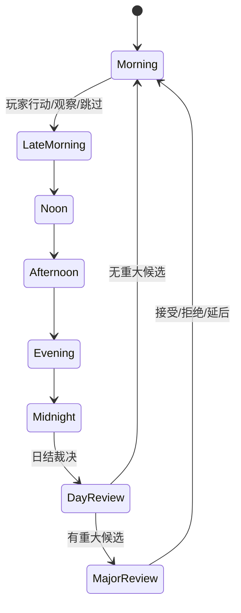
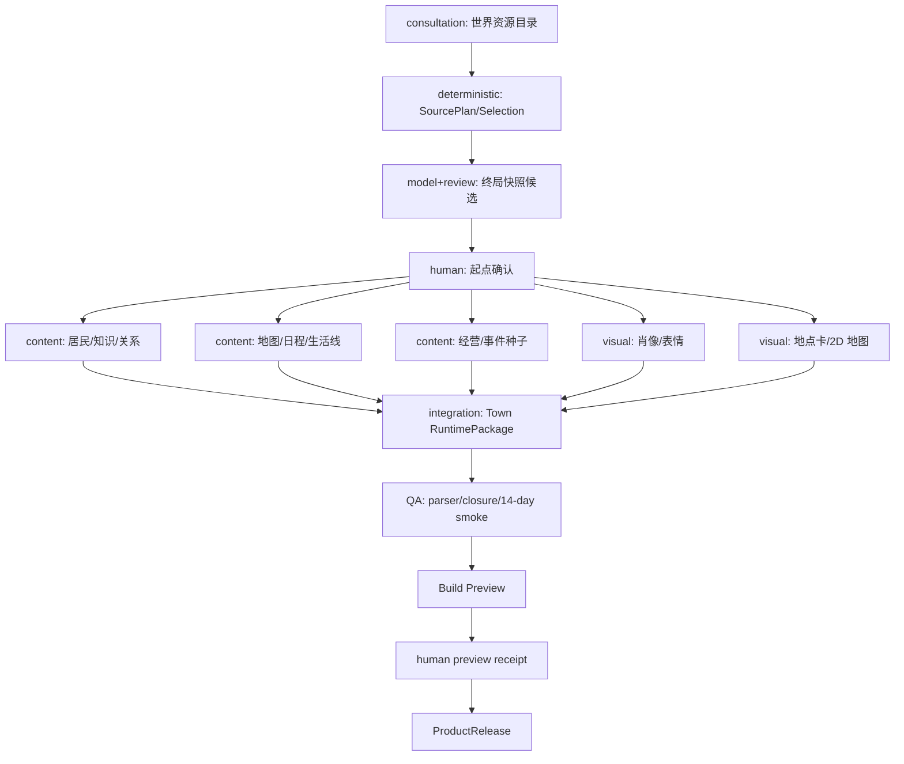
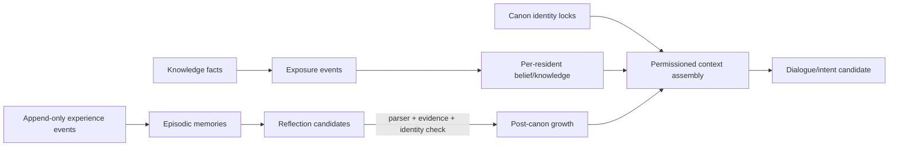

# StoryForge 后日谈 AI 小镇系统架构

> 状态：E-TOWN-01 施工契约（非项目总纲）<br>
> 产品身份：`ai-town`<br>
> 基线：`feat/ai-town-product`（以分支 HEAD 为准），上游基线 `origin/main@8df14cca`<br>
> 研究与代码复核日期：2026-09-06

## 1. Executive Decision

**做，而且首版加入轻量经营，但不做完整农场模拟。**

最终产品一句话：**把一个冻结原作结局编译成仍会继续生活的共同体；玩家作为新居民或守护者，通过交谈、陪伴、共同劳动和有限资源选择，观察并参与熟悉角色的后日谈。**

首版产品支柱是连续、共生、参与、回顾与控制。消费单位是“一个有可见因果的生活时段/生活日”，不是单条聊天消息，也不是必须通关的任务。时间、精力、三类以内物资、金钱和一个共同项目进入 MVP，因为它们能制造机会成本、角色相遇和共同记忆；农业格子、制造树、动态市场、战斗、多人和常驻云仿真延后。

商业判断：StoryForge 的差异化不是“更多 AI NPC”，而是**冻结世界版本提供的原作连续性 + 可审计知识边界 + 居民彼此生活 + 可回滚的长期演化**。若 14 个游戏日内这四项不能成立，继续增加经营系统没有意义。

## 2. Current Repository Truth

| 分类 | 当前事实 | 决策 |
|---|---|---|
| 产品身份 | `ai-town` 已进入 `PRODUCTION_PRODUCT_KINDS_V1` 正式生产闭集 | 保持独立身份，不借用 `character-interaction` 或 `text-open-world` 身份 |
| 产品目录 | `upper.ai-town` 为 `preview`，已建立独立 `ai-town` surface | 商业验收前不升为 implemented |
| 世界出口 | 当前是不可变 `WorldReleaseManifestV3`，`semanticContract: 3`，产品通过中立 `describe/search/read` 读取 | 文档中旧称 V2 的要求映射到当前 V3；不改正式出口，不读活动工作表 |
| 来源契约 | 已有 `WorldReferenceV1`、`ProductSourcePlanV1`、`ProductSourceManifestV1`、Context Manifest | 复用协议骨架；新建 AI 小镇 adapter、选择语义和角色绑定 |
| 生产 | 共用 Brief v3、durable build、lane、artifact、preview、release | 扩展 AI 小镇专属 Brief 字段、compiler、质量门；不新造公共 DAG |
| 发布 | `ProductRuntimePackageV1` 与 `ProductReleaseManifestV1` 不可变、哈希化 | 增加 `town` 冻结模块，运行只绑定 Build Preview 或 ProductRelease |
| 运行 | 共用 session/event/checkpoint、命令幂等、state hash、分支 | 增加 AI 小镇状态、事件、reducer、命令 API；不新建第二套 session 表 |
| 角色互动 | 已有 profile、scene、message、knowledge、memory、relationship | 可复用对话子能力与类型思想；小镇拥有独立长期状态和事件命名空间 |
| AI/Harness | 生产已有正式 Harness；角色互动已有运行调用路径 | 新建 AI 小镇运行 Skill/Run Contract；任何候选必须经 parser 与裁决 |
| 当前完成度 | E-TOWN-01 为 partial | 冻结来源到发布、六时段地图/日程、行动、知识隔离、对话记忆、关系、轻经营、离线推进、重大变化确认、存档分支、14 日确定性演化、自治导演 Harness、专属媒资生产/装配、玩家 UI 与浏览器旅程 E2E 已形成纵切面；真实模型长期体验、真实 provider 媒资质量与非 fixture 商业验收仍需专项推进 |

禁止复用身份：`CharacterInteractionProductRuntimePackageV1`、`OpenWorldContentV1`、其 Brief、Session kind、Source role bindings 均不能作为 AI 小镇的正式合同。允许组合的是共享底层机制和角色互动领域函数。

## 3. Evidence Matrix

| 证据 | 已验证机制 | 采用 | 风险/不采用 |
|---|---|---|---|
| [Character.AI Scenes](https://blog.character.ai/introducing-scenes-your-new-way-to-tell-stories-on-c-ai/) | 地点、背景、玩家目标、开场结构化 | 冻结后日谈起点与第一日处境 | 不把日常拆成无关联短场景 |
| [Kindroid Groupchats](https://kindroid.ai/v2/docs/groupchats/) | 角色私有背景、共享上下文、自动/手动发言 | 私域/公共知识分离与可接管 speaker 调度 | 不全量拼接角色卡 |
| [AI Dungeon Memory](https://help.aidungeon.com/faq/the-memory-system) | 常驻事实、摘要、按需词条分层 | 近期、情节、语义、承诺分层检索 | 关键词不承担权限 |
| [SillyTavern Group Chats](https://docs.sillytavern.app/usage/core-concepts/groupchats/) | 多种发言调度策略 | 自动、轮流、指定发言者三种模式 | Prompt 不是状态机 |
| [a16z AI Town](https://github.com/a16z-infra/ai-town) | 世界、agent、input log、step、记忆分层 | 输入事件排序、仿真与显示分离 | 不采用 60Hz 或常驻逐角色模型调用 |
| [Generative Agents](https://arxiv.org/abs/2304.03442) | 观察、检索、反思、计划 | 阈值式反思和日程 | 25 人高频仿真成本不可接受 |
| [Concordia](https://github.com/google-deepmind/concordia) | entity/component/engine 与 GM 裁决 | 模型提意图，规则裁决结果 | 导演不得自行写事实 |
| [Animal Crossing](https://animalcrossing.nintendo.com/new-horizons/explore/) | 每日变化、季节、居民、收集、建设 | 温和回访、日历与共同体变化 | 不做惩罚性真实时间 |
| [Stardew Valley](https://www.stardewvalley.net/about/) | 精力、日程、关系、节庆、社区修复相互咬合 | 共同项目连接经营和人物 | 不在 MVP 复制全套农业/战斗/制造 |
| [SOTOPIA](https://arxiv.org/abs/2310.11667) | 社会目标与关系维度评测 | 合作、冲突、规范纳入 eval | 不把语言流畅当社会可信 |
| [CharacterBench](https://arxiv.org/abs/2412.11912) | 人格、行为、知识、事实、记忆、情绪多维评测 | 六维角色一致性 | 不依赖单一 LLM judge |
| [NCP-Bench](https://arxiv.org/abs/2608.08160) | 长程承诺与事实存活 | 14 日承诺存活测试 | 宣传式“无限记忆”不视为证据 |

商业宣传只证明产品定位，不证明长期一致性。架构采用论文与开源仓库可观察机制，并用本项目反例/E2E 自行证明。

## 4. Product Definition and Boundaries

`ai-town` 是世界衍生的单人、本地优先、无限期生活模拟产品。它绑定一个明确结局的不可变 WorldRelease；生产阶段生成产品私域的小镇、迁入理由、日程、关系起点、生活线、资源、媒资和运行规则；发布后世界只读，运行事实只写产品域。

边界：

- 与角色聊天：聊天是小镇中的行动和表现，不是产品容器。
- 与文字开放世界：小镇重心是稳定共同体的日常、关系和照料，不是广域探索与任务生成。
- 与文字冒险/AVG：没有强制主线、结局树和“通关”。
- 与世界引擎：只消费冻结语义；回流只能生成有证据的候选，作者 adopt 后形成新 WorldRevision/Release。
- 与经营游戏：MVP 经营只为关系、地点用途和事件条件服务。

## 5. Personas, JTBD, Core Fantasy, Success/Failure Metrics

主要用户：原作作者、世界设定创作者、对特定角色有持续情感的读者/玩家。JTBD 是“原作结束后，我想安全地回到这些人身边，并相信他们即使不围着我也在继续生活”。

核心幻想：我不是重写正史的全知导演，而是这个共同体的新成员；人物记得他们真正经历过的事，会拒绝、误解、改变，也会彼此建立新的生活。

| 类型 | MVP 门槛 |
|---|---|
| 激活 | 80% 测试用户 5 分钟内完成选世界、选 4–8 人、确认起点并进入第一日 |
| 连续性 | 14 日 canon contradiction < 1%，秘密泄漏 = 0，承诺无证据丢失 = 0 |
| 共同体 | 非玩家触发的居民-居民有效事件占公共事件 30%–70%；居民参与分布 Gini < 0.55 |
| 节奏 | 空白重复日 < 10%；中高强度事件不连续超过 2 日；危机冷却有效 |
| 经营 | 80% 共同项目推进事件至少改变一个日程、地点用途、互动机会或 LifeThread |
| 成本 | 每普通游戏日模型调用 P95 ≤ 8；离线 3 日批次 P95 ≤ 20；失败可降级并保留事实 |
| 体验失败 | 角色同质化、所有人围绕玩家、每日无变化、经营只涨数字、重大变化未确认，任一出现即阻塞 preview 升级 |

## 6. Product Flow and Player Loops


核心日循环：看日历与简报 → 在地图选择地点/行动 → 发生个人或群体互动 → 规则结算时间、精力、资源、知识和关系 → 未观察居民低保真推进 → 日结摘要、反思候选和明日线索 → 保存 checkpoint。



玩家可只聊天，也可送礼、做饭/照料、共同劳动、观察群体活动或休息。主动行动必须消耗时段或精力并产生可审计事件；自由对话可保持多轮，但同一居民每日首次有效接触之后不再重复增加关系，不能成为免费无限刷关系按钮。

## 7. World Data Requirement Matrix

当前正式出口为 `WorldReleaseManifestV3`。产品只通过 resource descriptor 与 Gateway 读取，下表中的 table/field 是审计映射，不是授权直读底表。

| 消费能力 | 世界语义 | Manifest V3 区段/表/字段 | 级别 | 粒度 | 缺失策略 | 阶段 | 升级 |
|---|---|---|---|---|---|---|---|
| 来源身份 | 世界、版本、内容哈希、能力哈希 | release `releaseUid/version/contentHash`; manifest `worldCode/sourceManifest/capabilityProfile` | required | 整包身份 | 阻止 | Brief/全程 | 旧实例继续绑定；显式升级 |
| 核心居民 | 身份、性格、经历、动机、外观、语气 | `resourceCatalog(kind=character, area=characters)` → `records.characters[*]` 的 portable `_exportId` 与语义字段 | required | 4–8 记录 + 依赖闭包 | 补设定或减少阵容 | Brief/生产/媒资/运行 | 差异分析后新 Release |
| 居民关系 | 人际边、方向、类型、描述 | `resourceCatalog(kind=character-relation, area=relations)` → `records.characterRelations[*]` portable endpoints | required | 入选角色诱导子图 | 作者补设定；允许明确私域补边 | 生产/验证/运行 | 保留旧起点关系 |
| 正史终局 | 结局事实、存活、承诺、未结事项、时间锚 | `story-core/story-arc/storyline-progress/outline-node/detailed-outline/chapter/historical-event/fact` | required | 叙事模块 + 证据闭包 | 阻止严格后日谈 | Brief/生产/验证 | 必须重新编译快照 |
| 世界规则 | 能力边界、社会规范、禁忌、技术/魔法 | `foundation/entities` 区的 `worldview-field/codex-entry/fact` | required | 相关记录集合 | 阻止或显式降级 | 生产/验证/运行 | 规则变化需迁移 |
| 原作地点 | 地点、归属、用途、气氛 | `resourceCatalog(kind=location)` → 地点记录与关系 | required | 地点子图 | 允许产品补建后日谈镇，但需作者确认 | Brief/生产/媒资 | 新地图版本 |
| 势力制度 | 组织、职业、权力和公共制度 | `faction/codex-entry/fact` | optional/conditional | 居民/地点依赖闭包 | 私域补全或降级背景 | 生产/运行 | 影响分析 |
| 物件遗产 | 物品、设施、遗物 | artifact 类 `codex-entry` 与相连 fact | optional | 记录集合 | 产品生成后日谈资源 | 生产/媒资/运行 | 可携带或替换 |
| 视觉连续性 | 外观、服装、地点氛围、已有素材语义 | 角色/地点语义和合法素材引用 | optional | 精选记录 | 文字/占位图降级 | 媒资 | 新媒资版本 |
| 原文证据 | 精确章节/片段 | `chapter` 等资源经 `readOriginalEvidence` | conditional | 精确证据片段 | 不可用则不虚构引用 | 生产/验证 | Manifest 留痕 |
| 活动工作表、其它产品 runtime/媒资、Dexie id | 非法来源 | 不在冻结资源权限内 | excluded | 全禁止 | 拒绝 | 全程 | 不适用 |

## 8. AI Town Source Adapter / SourcePlan / Selection Contract

代码名采用当前公共逻辑契约的产品专属投影：

```ts
interface AiTownWorldSourceCatalogV1 {
  schema: 'storyforge.ai-town-world-source-catalog'
  version: 1
  worldReference: WorldReferenceV1
  endingCandidates: PortableResourceRefV1[]
  residentCandidates: PortableResourceRefV1[]
  relationEdges: PortableRelationRefV1[]
  locationCandidates: PortableResourceRefV1[]
  ruleAndLoreCandidates: PortableResourceRefV1[]
  artifactCandidates: PortableResourceRefV1[]
}

interface AiTownWorldSourceSelectionV1 {
  schema: 'storyforge.ai-town-world-source-selection'
  version: 1
  productType: 'ai-town'
  worldReleaseId: number              // local locator only
  worldReferenceHash: string          // frozen portable WorldReference identity
  worldContentHash: string
  sourceMappingVersion: 1
  endingResourceKeys: string[]
  residentResourceKeys: string[]
  relationSubgraphResourceKeys: string[]
  locationResourceKeys: string[]
  ruleAndLoreResourceKeys: string[]
  artifactResourceKeys: string[]
  dependencyClosureResourceKeys: string[]
  selectionHash: string
}
```

严格规则：精确字段集；schema/version/productType 常量；4–8 个不重复居民；至少一个终局资源；所有 key 必须存在于同一冻结 catalog；关系端点必须在居民集合；依赖闭包由系统计算，用户不能伪造；portable identity/hash 与 WorldReference 一致；本地 `worldReleaseId` 只负责定位并明确排除在 `selectionHash` 的便携 payload 外。当前中立世界出口不向产品暴露物理 export row ID，因此以 `worldReferenceHash + worldContentHash + portable resource keys` 作为跨导入身份，不能伪造不存在的 `sourceWorldExportId/sourceWorkExportId`。冻结后才允许正式 AI、产品表或媒资写入。

AI 小镇需求 adapter 的 stable-required：world grounding、4–8 residents、resident induced relation graph、ending continuity、rules、place grounding；recommended：artifact/lore；prohibited：multi-world、活动草稿、manuscript 全量通配读取。Cross-world 首版关闭。

## 9. Ending-to-Town Snapshot Contract

```ts
interface EndingToTownSnapshotV1 {
  schema: 'storyforge.ai-town-ending-snapshot'
  version: 1
  sourceSelectionHash: string
  anchor: { title: string; summary: string; elapsedDays: 90; evidenceRefs: string[] }
  canonLocks: Array<{ key: string; statement: string; evidenceRefs: string[] }>
  unresolvedContinuities: Array<{ key: string; statement: string; ownerKeys: string[]; evidenceRefs: string[] }>
  residents: Array<{
    residentKey: string; sourceCharacterKey: string; migrationReason: string
    identityLocks: string[]; startingKnowledgeKeys: string[]; privateBeliefSeeds: string[]
    homeLocationKey: string; workLocationKey: string | null
  }>
  map: AiTownMapDefinitionV1
  initialRelationshipEdges: AiTownRelationshipEdgeV1[]
  authorCorrections: Array<{ fieldPath: string; oldValueHash: string; newValue: unknown; reason: string }>
  snapshotHash: string
}
```

生产先提取终局事实，再生成迁入解释与私域地点，最后让作者逐居民检查身份、知识、关系、住所和迁入理由。更正写产品候选，不改 WorldRelease。锁定后的 snapshot 进入 RuntimePackage；运行中 identity lock 不可变，任何冲突候选被拒绝并记录。

## 10. AI Town Brief and Author Confirmation

`AiTownProductionBriefV1` 作为 `ProductProductionBriefV3.aiTown` 的严格专属字段，只在 `productType='ai-town'` 时必需且唯一存在。

```ts
interface AiTownProductionBriefV1 {
  schema: 'storyforge.ai-town-production-brief'
  version: 1
  sourceSelection: AiTownWorldSourceSelectionV1
  player: { role: 'new-resident' | 'caretaker'; name: string; homeConcept: string }
  continuity: { mode: 'strict-post-canon'; elapsedDays: 90; romance: 'off' | 'canon-only' | 'opt-in' }
  town: { title: string; premise: string; majorLocationTarget: 4; residentTarget: 6 }
  clock: { slots: readonly ['morning','late-morning','noon','afternoon','evening','midnight']; actionsPerDay: 3 }
  autonomy: { level: 'observational-high'; offlineEnabled: boolean; offlineMaximumDays: 3 }
  management: { resourceKeys: string[]; startingMoney: number; sharedProjectConcept: string }
  safety: { boundaries: string[]; majorChangeConfirmation: true; privateMindPlayerAccess: 'none' }
  media: { portraits: boolean; expressions: boolean; locationCards: boolean; map: true; ambientAudio: boolean }
  authorConfirmed: boolean
}
```

确认点：来源选择、终局事实、每名居民起点、地点拓扑、共同项目、浪漫边界、内容边界、离线天数/成本上限、重大变化清单、媒资权利。`authorConfirmed=false` 或 unresolved decision 非空时不得 authorize-start。

## 11. Production DAG and State Machines



| 状态 | 允许命令 | 完成门 | 失败恢复 |
|---|---|---|---|
| consulting | 保存选择/Brief | requirements resolved | 返回会谈，不写正式表 |
| brief-ready | authorize-start | 作者确认、SourcePlan frozen | 修正新 revision |
| producing | pause/stop | 各 lane receipt | checkpoint 后重试具体 task |
| validating | request-preview | package parser、地图闭包、知识闭包、质量门 | repair artifact，不隐藏重跑 |
| preview-ready | publish | 人工真实路径回执 | 继续 preview 或新 build |
| released | evolve | immutable hashes valid | 新 build/new release，不改旧包 |

`AiTownProductionRunContractV1` 固定 Brief hash、SourcePlan hash、预算、步骤 DAG、模型/媒体能力、最大重试、允许写入的 artifact kind 和终态 receipt。每次模型步骤只输出候选 artifact。

## 12. Media Plan and Ownership

MVP required：每名入选居民 1 张主肖像、可选每人 1 张首发表情差分、每个主要地点 1 张地点卡，以及始终可用的语义拓扑地图；全部允许文字/首字占位降级。Optional：共同项目阶段图、更多表情、节庆插图、环境音。Deferred：全语音、视频、3D、连续像素动画。当前生产器按 `location → portrait → expression` 冻结 artifactKey、sceneTag、尺寸和角色锚点，模型不能交换媒资用途。

所有媒资归 Product Build/Release，不进入 WorldRelease。生成顺序是视觉 bible → 角色身份基准 → 地点/地图 → 表情与项目阶段 → 完整性/权利检查。`assetKey` 与 `blobContentHash` 进入冻结包；object URL、本地 row id、provider credential 不进入。纯文字 fallback 必须完整可玩，地图退化为可访问的地点列表与路线描述。

## 13. ProductRelease / RuntimePackage / Lineage

`ProductRuntimePackageV1` 新增必需模块：

```ts
interface AiTownRuntimeContentV1 {
  schema: 'storyforge.ai-town-runtime-content'
  version: 1
  title: string
  premise: string
  elapsedCanonDays: number
  player: { role: 'new-resident' | 'caretaker'; name: string; homeConcept: string }
  canonLocks: Array<{ key: string; statement: string; evidenceRefs: string[] }>
  residents: AiTownResidentDefinitionV1[]
  relationships: AiTownRelationshipDefinitionV1[]
  map: AiTownMapDefinitionV1
  lifeThreads: LifeThreadV1[]
  eventSeeds: TownEventSeedV1[]
  clock: { slots: AiTownDaySlot[]; actionsPerDay: number }
  offline: { enabled: boolean; maximumDays: number }
  economy: AiTownEconomyDefinitionV1
  cadence: AiTownCadencePolicyV1
  safety: AiTownSafetyPolicyV1
}
```

当 `productType='ai-town'` 时 `town` 必需，其它产品必须无此模块。package hash 覆盖全部 town 内容；SourceManifest 聚合实际 Context Manifest；Lineage 绑定 worldReference/sourcePlan/sourceManifest/confirmedBrief/build/quality。旧 release 永远可启动旧存档；升级创建新 release，并通过影响分析决定保持、迁移或分叉。

## 14. Runtime Domain Model and Event Contracts

领域状态：`TownClock`、`TownMap`、`ResidentState`、`PlayerState`、`Schedule`、`Presence`、`LifeThread`、`TownEvent`、`KnowledgeLedger`、`Memory`、`RelationshipEdge`、`EconomyLedger`、`SharedProject`、`CadenceBudget`、`PendingMajorChange`、`DailyDigest`。

```ts
interface AiTownRuntimeStateV1 {
  schema: 'storyforge.ai-town-runtime-state'; version: 1; contentHash: string
  content: AiTownRuntimeContentV1
  day: number; slot: AiTownDaySlot; actionsRemaining: number; weatherKey: string
  player: { name: string; locationKey: string; energy: number; maximumEnergy: number; money: number; resources: Record<string, number> }
  residents: Record<string, AiTownResidentStateV1>
  relationships: Record<string, AiTownRelationshipStateV1>
  knowledge: AiTownKnowledgeLedgerV1
  memories: AiTownMemoryRecordV1[]
  lifeThreads: Record<string, LifeThreadRuntimeV1>
  sharedProject: AiTownSharedProjectStateV1
  cadence: AiTownCadenceStateV1
  pendingMajorChanges: AiTownMajorChangeCandidateV1[]
  dailyDigests: AiTownDailyDigestV1[]
  latestPublicEvents: string[]
  offlineDaysSimulated: number
  lastSequence: number
}
```

正式事件最小集：`town.started`、`town.action.performed`、`town.player.moved`、`town.time.advanced`、`town.relationship.changed`、`town.knowledge.exposed`、`town.memory.recorded`、`town.thread.progressed`、`town.resource.changed`、`town.event.resolved`、`town.major-change.proposed/accepted/rejected`、`town.day.closed`、`town.offline-batch.completed`。角色对话继续使用同一 session 内已有的 `interaction.*` 事件；共同项目推进是 `town.action.performed` 的已裁决效果，不另造重复事件事实源。

命令链固定为：command（含 commandId/baseSequence/baseStateHash）→ 确定性 precondition → 可选 AI candidate → strict parse → 规则/权限/预算/知识/可达性裁决 → append-only events 事务 → reducer → state hash/head → receipt。模型永不返回并覆盖完整 state。

## 15. Hybrid Simulation, Town Director and Speaker Scheduling

确定性层负责时间、路线、位置、容量、日程、资源、项目进度、冷却、暴露和重大变化阻断。模型层只负责角色意图候选、台词、事件表现、记忆/反思候选。Director 从合格 `TownEventSeed` 中按节奏、地点、参与者、LifeThread 和知识选择候选，不能直接产生权威结果。

active set：当前地点参与者和直接相关角色高保真；其余居民按日程确定性移动，仅在 LifeThread 阈值、关系摩擦或日结时批量提出低保真意图。Speaker scheduler 过滤在场、清醒、愿意参与且知道话题的角色，再按 `manual | natural | round-robin` 选择；玩家永远可打断或指定。

成本模型：

`dailyCost = Σ(textCalls_i × providerPrice_i) + Σ(mediaCalls_j × price_j)`<br>
`dailyTokens = activeSceneTokens + reflectionTokens + digestTokens`<br>
`offlineBatchCost ≤ min(userBudget, briefBudget, 3 × dailyBudget)`

预算变量：`maxCallsPerSlot=3`、`maxCallsPerDay=8`、`maxOfflineDays=3`、`maxOfflineCalls=20`、`maxContextTokensPerCall`、`maxOutputTokensPerCall`、`maxCostUsdPerDay`。达到预算后使用确定性日程和模板摘要，明确显示降级。

## 16. Memory, Knowledge, Secrets and Relationship Model



知识模型分离“事实”和“谁知道/相信什么”。`KnowledgeFact` 可为 public/private/secret；每个 resident 有 `unknown/heard/believed/witnessed/disproved` 状态和 evidence sequence。传播只能由在场对话、观察、书信/公告或规则允许的推断事件产生。

记忆具有 owner、visibility、sourceSequences、salience、confidence、createdDay、lastRecalledDay、supersedesKey。检索先按权限和实体/地点/线程关联过滤，再做相关性排序，固定 top-N 仅作为最终预算保护。反思需至少两条证据，不能修改 canon lock。

关系是有方向的 `trust/intimacy/wariness`（0–100）加可观察趋势；单事件变化有上限，显著变化必须附 sequence 证据。玩家只看到趋势和公共原因；私密判断只进入权限隔离 Context、checkpoint 和审计。

## 17. Lightweight Management Rules and Later Expansion Gate

MVP：每次行动消耗一个时段；精力 0–100，每日恢复；`materials/food/care` 三类可由 Brief 改名；简单金钱账；一个 0–100 的共同项目。项目里程碑必须至少触发一项：开放地点/子区、改变居民日程、增加群体活动、解锁事件种子或提供新谈话语境。

送礼受收礼者偏好、关系和重复冷却约束；做饭/照料形成在场共享事件；共同工作同时推进项目和关系，但不会保证正向结果。

P4 扩展门：14 日 eval 达标、经营相关事件的有效率 ≥ 70%、用户认为经营增强角色感的比例 ≥ 60%，才加入农业、制造、商店与季节经济。否则先修复共同体与角色连续性。

## 18. UX Information Architecture and Key Screens

1. 世界发布选择：显示版本/hash/能力缺口，不显示活动草稿。
2. 后日谈筹备室：选择终局、6 名居民、关系子图、原作地点/新镇方案；每项有自定义输入。
3. 起点审查：逐居民检查身份锁、知识、关系、迁入理由、住所；确认共同项目与安全边界。
4. 生产控制台：lane、预算、模型/媒资能力、重试和 checkpoint 可见。
5. Build Preview：第一日可玩、地图可点击、纯文字 fallback 可用。
6. 运行主屏：左侧 2D 地图/地点列表，中间场景和对话，右侧日历、时段、精力、资源、项目、可观察关系。
7. 每日回顾：因果摘要、公共传播、可观察关系、项目变化、明日线索；不泄露私密心智。
8. 离线回归：先审阅 1–3 日变化和重大候选，再继续。
9. 存档与版本：checkpoint、分支、导出、旧 WorldRelease 绑定、显式升级。

桌面采用三栏；移动端底部页签“地点/现场/生活/回顾”，地点列表是地图的完整替代。键盘可完成选地点、选行动、选说话者、查看摘要；不要求拖动地图。

## 19. Three Registries and Data Lifecycle Impact

| 治理面 | 新增/复用 | 约束 |
|---|---|---|
| AI 读 | 新增 `aiTownRuntime`；复用 `product-production.brief/artifact-inputs/quality-feedback` 和 WorldRelease Gateway | 只能由 `assembleContext()` 读取；按角色权限过滤秘密 |
| AI 写 | `character.ai-town-reply` 与 `prose.ai-town-director` 均先冻结候选；对话候选采用后再由证据化命令整合共享记忆，Director 候选只能解析为事件 seed 或待确认重大变化 | 普通 runtime 结果只能经命令裁决写产品事件；世界回写候选才进入 FIELD_REGISTRY/adopt，当前绝不回写世界 |
| 表 | 优先复用 productProductions/builds/artifacts/releases/runtimeSessions/events/checkpoints/agentRuns/creativeArtifacts | 若后续新增向量/大规模记忆表，先入 PROJECT_TABLES 再做 schema、迁移、导出导入删除 scope/remap |
| 生命周期 | Build/Release 不可变；runtime event canonical，head/checkpoint 派生 | 导入重映射本地 ids，不改变 portable hash；删产品实例按 registry 闭包删除 |

MVP 不新增 Dexie 表。小镇定义放冻结 RuntimePackage；运行事件放共享 append-only event 表；state head 与 checkpoint 是有界快照。记忆超过 `maxInlineMemories` 时才提出专属索引表 RFC，避免一开始制造生命周期风险。

## 20. Safety, Privacy, Rights and Commercial Readiness

- 内容：Brief 固定 lines/veils/romance；运行候选必须通过内容边界。角色可以拒绝，不能以负罪感制造留存。
- 重大变化：死亡/永久失能、婚恋/家庭、永久离开、设施不可逆变化、世界规则变化只能产生候选；接受命令需作者/玩家显式确认。
- 隐私：API key 永不进入 artifact/context/export；私密心智不进入玩家摘要、日志搜索或分享包。
- 权利：世界/角色/参考图/生成媒资保留 provenance、license/rights receipt；商业候选只允许合格 provider 与完整权利证据。
- 可靠性：授权、余额、非重试 4xx、结果未知和 stale 不自动隐藏重发；每次 retry 可见且有界。
- 商业：本地单人闭环先成立；高级模型预算、更多居民/地点、经营扩展、媒资/语音和云同步是未来付费层，不在 MVP 人为降质基础体验。

## 21. Test/Eval/E2E Matrix

| 层 | 正例 | 反例/故障注入 | Gate |
|---|---|---|---|
| parser | 合法 Brief/selection/package/state/event 往返 | 多字段、少字段、重复 key、坏 hash、跨 release key、Dexie id 冒充 portable key | 全拒绝且无写入 |
| SourcePlan | 6 人、关系子图、终局、地点、规则闭合 | 缺终局、3 人、关系端点越界、活动草稿补齐 | 阻止生产 |
| map | 地点/子区/路线可达、容量有效 | 孤岛、负旅行时间、循环 parent、居民住所缺失 | package gate 失败 |
| knowledge | 在场暴露后知情 | 不在场居民瞬间知道秘密、摘要泄密 | leakage = 0 |
| relationship | 有证据且单步有界 | 无 evidence、一次 +100、对称误写 | reducer 拒绝 |
| autonomy | 非玩家居民按日程相遇 | 全员跟随玩家、容量冲突、跨不可达地点瞬移 | deterministic adjudicator 拒绝 |
| cadence | 平稳日/摩擦/节庆受预算冷却 | 连续危机、同 seed 高频重复 | 14 日节奏门通过 |
| offline | 1–3 日批次、checkpoint、digest、重大候选 | 4 日、超预算、中断、provider 结果未知、重大变化直写 | 可恢复且无半写 |
| release | Build Preview → receipt → immutable release | 改包后 hash 不符、热替换 WorldRelease | 拒绝启动 |
| lifecycle | 完整导出/导入、scope remap、删除 | 跨项目 session/release 引用、孤儿事件 | CI 生命周期门通过 |
| AI eval | 身份、行为、知识、事实、记忆、情绪；14 日承诺 | 角色迎合、同质化、幻觉 canon | 阈值见第 5 节 |
| E2E | 隔离项目：建世界 release → 生产 → preview → 3 日 → 离线 3 日 → 审重大候选 → 导出导入继续 | 无 API 文字降级、余额不足、刷新、任务中断 | 不触碰作者真实项目 |

每阶段：定向 Vitest → `npm run check:architecture`、`check:required-tables`、`check:ai-manual` → `npx tsc --noEmit` → `npm run build` → `npm run ci`。UI/API/恢复纵切面最后跑隔离 `npm run ci:e2e`。性能门记录首屏、地图交互、读状态、命令提交、日结和离线 P50/P95。

## 22. P0–P5 Roadmap and PR/Commit Slices

| 阶段 | 可玩结果 | 串行提交/PR | 可并行项 |
|---|---|---|---|
| P0 | 合同可编译，架构测试 fail-closed | 已完成：架构文档、identity/registry closure、类型与严格 parser | 研究/eval fixtures |
| P1 | 无 AI 也可玩 3 日：地图、日程、行动、关系、资源、项目 | 已完成：deterministic runtime/reducer、compiler/release、基础 UI | 视觉占位资产已接生产 lane |
| P2 | 14 日 MVP：LifeThread、秘密、群体事件、离线 3 日、每日回顾 | 工程纵切面完成：专属回复与 Director Harness、knowledge/memory/cadence、离线批次、14 日回放和玩家 UI；真实模型质量门待验 | eval 数据集与 UX 打磨 |
| P3 | 商业候选：正式媒资、质量/权利/成本/性能门 | media lane、冻结语义绑定、Build/Release resolver 已完成；真实 provider、肖像一致性、性能/权利回执待验 | 模型/媒体 provider 验证 |
| P4 | 经营扩展 | 独立农业/制造/商店 RFC 与迁移 | 内容包 |
| P5 | 云同步、分享/市场、可选托管离线 | 等平台阶段合同 | 安全与版权审计 |

共享热点提交先落 identity、catalog、registry、runtime composition root；产品实现随后，避免其它产品被迫接入 AI 小镇专属协议。每个阶段都能启动已发布 Build/Release，不等待全功能宇宙。

## 23. Risk Register

| 风险 | 严重度 | 概率 | 可检测性 | 缓解 | owner |
|---|---:|---:|---:|---|---|
| canon 漂移 | 5 | 4 | 3 | identity lock、证据引用、14 日 eval、拒绝覆盖 | AI Town domain |
| 秘密泄漏 | 5 | 3 | 4 | per-resident ledger、Context 权限过滤、反例测试 | Context/AI Town |
| 成本失控 | 5 | 3 | 5 | active set、日/批次硬预算、确定性降级 | Harness |
| 角色同质化 | 4 | 4 | 3 | 独立目标/日程/记忆检索、分布评测 | Resident skill |
| 所有人围着玩家 | 4 | 4 | 5 | 自主日程、NPC-NPC 指标、speaker eligibility | Simulation |
| 事件过密/过空 | 4 | 3 | 5 | cadence budget/cooldown、14 日分布门 | Director |
| 经营喧宾夺主 | 3 | 3 | 4 | 每项经营必须连到人物/地点/事件 | Product |
| JSON 快照膨胀 | 4 | 3 | 5 | append-only event、checkpoint 上限、memory table gate | Data |
| 模型中断造成半写 | 5 | 2 | 5 | candidate-first、事务 append、idempotency、receipt | Harness/runtime |
| 世界升级破坏存档 | 5 | 2 | 5 | 旧绑定、影响分析、新 release/branch | Release |
| 权利不清 | 5 | 3 | 4 | provenance、商业 provider/asset receipt | Media/commercial |
| 本地设备性能 | 3 | 3 | 5 | 语义 tick、active set、分页/预算 | Runtime/UI |

## 24. Open Decisions

没有阻塞 P0–P2 的产品负责人问题。采用以下默认值并允许以后在 Brief 修改：玩家名为“新居民”、每天 3 次主动行动、关系不显示精确数字、浪漫默认关闭、少量环境音默认关闭、共同项目由 3 个候选中确认一个。

P3 商业放行前仍需要真实测试决定：6 人上下文的模型分档与日成本；表情差分是否带来足够体验增益；商业候选最低可接受的肖像一致性。P4 前按第 17 节指标裁决是否进入完整经营。P5 必须等待平台总纲能力，不提前建立云表或跨产品市场协议。

## 25. Implemented Vertical Slices and Next Gate

本分支已按下列顺序完成不跨边界的本地优先产品闭环：

1. 扩展 `product-identity.ts`、产品目录/surface、Source requirement adapter，使 `ai-town` 成为正式但仍 preview-gated 的独立产品。
2. 新建 `types/ai-town.ts`，实现 Brief、source selection、runtime content/state/event candidate 的严格 parser 与图闭包校验。
3. 在 `ProductProductionBriefV3` 与 RuntimePackage 添加精确 `aiTown`/`town` 联合约束；扩展 compiler、package parser、quality gates。
4. 新建 `lib/ai-town/runtime.ts`、`runtime-commands.ts`、`runtime-api.ts`：确定性 6 时段、移动/在场、行动、关系/知识、资源/项目、日结、离线最多 3 日。
5. 接入共享 runtime composition root、instance factory、event closed set、checkpoint/branch 验证。
6. 登记 `aiTownRuntime`、`character.ai-town-reply`、`aiTownDirectorRuntime` 与 `prose.ai-town-director` 正式 AI 入口；对话提交后形成带事件证据的居民共享记忆，Director 只能采用当前事件闭集或提出待确认重大候选。
7. Director 采用单调用 durable Harness、Context Manifest、checkpoint、stale hash、幂等 runtime command、adoption 与终验回执；不读取居民 private/secret 知识。重大变化第 7 日前禁止提出，且同一时间只能有一个 pending 候选。
8. 轻经营行动真实结算精力、货币和 1–3 类资源，共同项目完成后形成里程碑并改变居民长期目标；每个居民都有可触发事件 seed，低保真 NPC–NPC 关系和 LifeThread 在日结/离线批次推进。
9. AI 小镇进入专属 media profile：地点卡、居民主肖像、可选表情和环境音经现有 content-addressed media lane 生产，以 SourceSelection 中的便携居民 ID 固定角色锚点并装入同一个 Build/ProductRelease；玩家面按冻结 sceneTag/角色锚点解析，失败时完整降级为文字。
10. 添加 parser/reducer/source/release/lifecycle/director/14 日 longevity/媒资生产/玩家 UI 正反例，并增加从冻结 Build 进入小镇、对话、行动、离线日结、检查点、分支、刷新恢复、移动端宽度及世界哈希不变的浏览器 E2E。Build Preview 与 ProductRelease 新存档均调用 AI 小镇自己的首场景启动钩子。E-TOWN-01 仍保持 `partial`，直到真实模型长期角色一致性、真实图片/音频 provider、权利/成本/性能回执和非 fixture 浏览器体验达到第 5、20、21 节门槛。

受影响的共享文件限定为 product identity/catalog、三注册表、公共生产/发布/运行 composition roots 和导出类型；AI 小镇专属规则全部留在 `src/lib/ai-town`、`src/lib/types/ai-town.ts`、`src/components/ai-town`。任何实现若要求修改 WorldRelease 正式出口、自动回写世界或建立跨产品公共经营层，应停止并单独报告。
