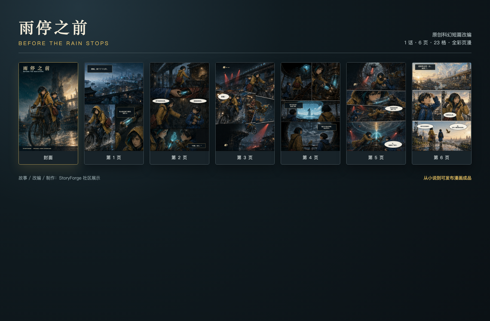

# 《雨停之前》社区展示包

一篇近未来都市科幻小说，经 StoryForge“小说转漫画”产品完整生产为 **1 话、6 页、23 格、全彩、左至右阅读**的固定页漫画。故事围绕夜班信使林昼、男孩阿澈和一只黄铜机械鸟展开：在下了十七年雨的城市里，他们必须决定是否把被隐藏的晴天还给所有人。

## 可直接展示的产物

| 产物 | 用途 |
| --- | --- |
| [在线预览图](art/final/community-preview.png) | 社区帖子、功能介绍页和版本说明 |
| [封面](art/final/cover.png) | 作品卡片与宣传封面，1024 × 1536 |
| [六页漫画](art/final/pages/) | 逐页阅读、网页画廊与二次排版，单页 1024 × 1536 |
| [PDF 成品](art/final/before-rain-stops.pdf) | 通用阅读与打印预览，6 页 |
| [CBZ 成品](art/final/before-rain-stops.cbz) | 漫画阅读器导入，含顺序清单与阅读方向 |
| [漫画工作台截图](art/final/comic-studio-final.png) | 展示 StoryForge 的页面、画格、镜头、素材与审校体验 |
| [视觉设定板](art/visual-bible.png) | 角色、道具、场景、配色与一致性参考 |
| [原作小说](source-novel.md) | 改编输入，三章、1,868 个正文字符 |

## 生产结果

- 3 个来源单元、9 条事实、7 条因果边、5 项改编决策、8 个叙事节拍。
- 6 份页节奏计划、6 个漫画页面、23 个已选择画格、9 个视觉主体。
- 来源分析、因果图、改编 Brief、改编决策、剧本改编和页节奏均由正式模型流程生成并经过作者式校订。
- 图像采用“统一视觉设定板 → 连贯整页画稿 → 分格登记 → 本地排字与合成”的制作方式；生成图不承担文字，中文对白、旁白和拟声词均在可控的本地版面层完成。
- 逐页复核并修正了第二页对白遮脸、第三页斜切分格穿过人物面部的问题。
- 最终漫画 QA：故事板阻断项 0、视觉阻断项 0、开放问题 0，可正式导出。
- 已生成不可变视觉发布 `雨停之前·彩色页漫 v1`，内容哈希见 [release-evidence.json](release-evidence.json)。

## 专业基线

本样例把“连续页面能否清楚讲完一个场景”作为首要验收项。业内投稿样张常以至少五页完整、已墨线与已排字的连续页面检验叙事能力；本包提供封面加六页完整顺序页。印刷安全区、出血与裁切意识参考 Clip Studio Paint 官方说明，数字发行包额外保留逐页 PNG、PDF 与 CBZ 三种交付形式。

- [Image Comics submission guidelines](https://imagecomics.com/submissions)
- [Clip Studio Paint: Margins](https://help.clip-studio.com/en-us/manual_en/270_canvas/Margins.htm)
- [Clip Studio Paint: Creating a New Canvas](https://help.clip-studio.com/en-us/manual_en/210_file/Creating_a_New_Canvas.htm)

这是 StoryForge 功能与社区展示样例，不是向上述出版机构提交的出版申请。对外商用或再分发前仍应按项目发布政策完成权利复核。
