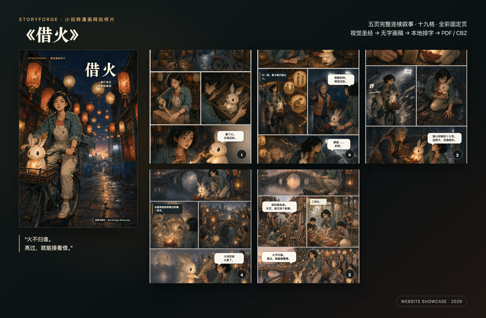

# 《借火》网站展示漫画包

《借火》是一篇关于城市更新、告别与手艺传承的暖色民俗漫画。它与《雨停之前》的冷色近未来冒险形成题材和视觉对照：一话、五页、二十格、全彩、左至右固定页阅读。

## 展示产物

| 产物 | 用途 |
| --- | --- |
| [网站预览](art/final/community-preview.png) | 社区帖子、官网案例和功能轮播 |
| [封面](art/final/cover.png) | 作品卡片、社媒封面与详情页首图 |
| [五页漫画](art/final/pages/) | 网页画廊和逐页阅读器 |
| [PDF 成品](art/final/borrowed-flame.pdf) | 通用阅读与下载 |
| [CBZ 成品](art/final/borrowed-flame.cbz) | 漫画阅读器导入 |
| [视觉设定板](art/visual-bible.png) | 人物、道具、场景和配色一致性参考 |
| [原作小说](source-novel.md) | 三章改编输入 |
| [生产说明](production-notes.md) | 改编步骤、页节奏、视觉规则与复审结论 |

## 展示卖点

- 先统一视觉圣经，再引用上一页制作下一页，形成连续而非散图式的漫画叙事。
- 生成画稿不承担文字，本地排字层控制中文、气泡、页码与安全区。
- 施工负责人不是脸谱化反派；“拆除危房”和“延续手艺”可以同时成立，让结尾更成熟。
- 五页完成“点火—借火—接火—还火”的视觉与主题闭环，可直接用于网站完整案例展示。
